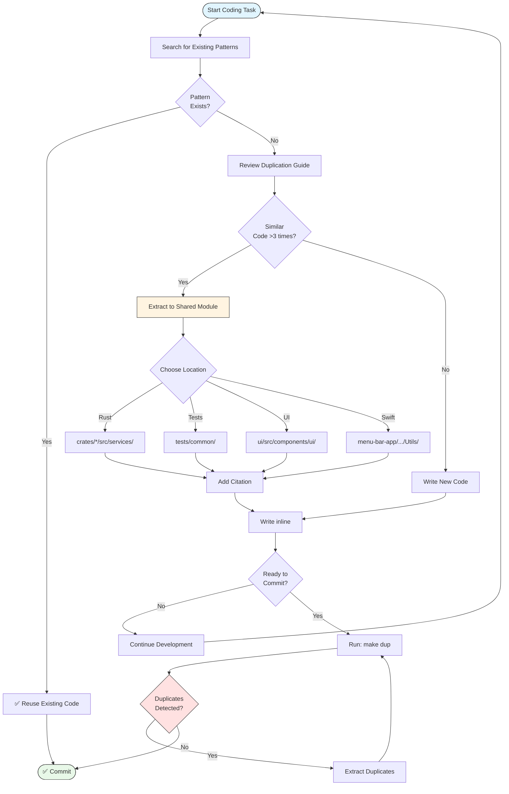

# Agent Guidelines for AdapterOS

**Purpose:** Guidelines for AI agents working on the AdapterOS codebase  
**Last Updated:** 2025-11-07  
**Status:** Active Guidelines

---

## Overview

This document provides essential guidelines for AI agents (including Cursor AI) working on the AdapterOS codebase. Follow these practices to maintain code quality, prevent duplication, and ensure consistency.

---

## Core Principles

### 1. Code Quality First
- **Never compromise correctness for speed** - See [CLAUDE.md](CLAUDE.md#code-standards)
- **Architecture compatibility > compilation** - See [.cursor/rules/compile.mdc](.cursor/rules/compile.mdc)
- **Complete implementations** - Avoid TODOs without completion plans (see [docs/DEPRECATED_PATTERNS.md](docs/DEPRECATED_PATTERNS.md))

### 2. Duplication Prevention
**CRITICAL:** Always prevent code duplication. See [docs/DUPLICATION_PREVENTION_GUIDE.md](docs/DUPLICATION_PREVENTION_GUIDE.md) for comprehensive guidelines.

**Quick Rules:**
- **Before writing code:** Search for similar patterns, check existing utilities
- **While writing code:** Extract shared code proactively
- **Before committing:** Run `make dup` to check for duplicates
- **Extract if:** Code appears 3+ times, string >50 chars used 2+ times, or function >10 lines duplicated

**Common Extraction Locations:**
- **Rust services:** `crates/*/src/services/`
- **Test utilities:** `tests/common/`
- **UI constants:** `ui/src/components/ui/utils.ts`
- **UI components:** `ui/src/components/ui/`
- **Swift utilities:** `menu-bar-app/Sources/*/Utils/`

**Citation Required:** All code extractions must include citations following codebase standards (see [CITATIONS.md](CITATIONS.md))

### 3. Error Handling
- Use `Result<T>` over `Option<T>` for error handling
- Use `AosError` from `adapteros-core` for all errors
- Add context to errors when propagating
- See [CLAUDE.md](CLAUDE.md#error-handling) for examples

### 4. Logging
- **Never use `println!`** - Use `tracing` instead
- Use appropriate log levels (`trace`, `debug`, `info`, `warn`, `error`)
- Include structured fields for querying
- See [CLAUDE.md](CLAUDE.md#logging) for examples

### 5. Documentation
- Document all public APIs
- Include examples for complex functions
- Update README.md for user-facing changes
- See [CLAUDE.md](CLAUDE.md#documentation) for standards

---

## Development Workflow

### Before Writing Code

<details>
<summary>📊 Duplication Prevention Workflow</summary>



**Key Decision Points:**
1. Search first - Don't reinvent existing utilities
2. Extract proactively - If code appears 3+ times
3. Run `make dup` before commit - Catch duplicates early

</details>

1. **Search for existing patterns:**
   ```bash
   # Search for similar functionality
   grep -r "similar_pattern" --include="*.rs" --include="*.tsx" --include="*.swift"

   # Check for existing utilities
   ls crates/*/src/services/
   ls tests/common/
   ls ui/src/components/ui/
   ```

2. **Check duplication prevention guide:**
   - Review [docs/DUPLICATION_PREVENTION_GUIDE.md](docs/DUPLICATION_PREVENTION_GUIDE.md)
   - Check [docs/DUPLICATION_PREVENTION_SUMMARY.md](docs/DUPLICATION_PREVENTION_SUMMARY.md) for quick reference

3. **Review architectural patterns:**
   - See [CLAUDE.md](CLAUDE.md#architecture-patterns) for established patterns
   - Check [docs/DUPLICATION_PREVENTION_GUIDE.md#2-architectural-patterns-for-code-sharing](docs/DUPLICATION_PREVENTION_GUIDE.md#2-architectural-patterns-for-code-sharing) for extraction patterns

### While Writing Code

1. **Extract proactively:**
   - If copying >5 lines, extract to shared module
   - If string literal >20 chars, extract to constant
   - If validation logic, use centralized validation module
   - If test setup, use test utilities

2. **Follow code standards:**
   - Use `cargo fmt` for formatting
   - Use `cargo clippy` for linting
   - Follow Rust naming conventions
   - See [CLAUDE.md](CLAUDE.md#code-standards)

3. **Add citations:**
   - All code extractions must include citations
   - Format: `【YYYY-MM-DD†category†identifier】`
   - See [CITATIONS.md](CITATIONS.md) for standards

### Before Committing

1. **Run duplication check:**
   ```bash
   make dup
   # Review var/reports/jscpd/latest/jscpd-report.json
   ```

2. **Extract any detected duplicates:**
   - Review jscpd report
   - Extract shared code
   - Update all call sites
   - Re-run `make dup` to verify reduction

3. **Verify compilation:**
   ```bash
   cargo check --workspace
   cargo clippy --workspace -- -D warnings
   ```

4. **Run tests:**
   ```bash
   cargo test --workspace
   ```

---

## Code Organization

### Workspace Structure
- **Rust crates:** `crates/` - All workspace crates
- **Documentation:** `docs/` - Living design docs
- **Tests:** `tests/` - Integration and determinism suites
- **UI:** `ui/` - React/TypeScript frontend
- **Scripts:** `scripts/` - Internal tooling
- **Menu bar app:** `menu-bar-app/` - Swift menu bar application

See [.cursor/rules/workspace.md](.cursor/rules/workspace.md) for detailed workspace orientation.

### Shared Code Locations

| Pattern | Location | Example |
|---------|----------|---------|
| UI Constants | `ui/src/components/ui/utils.ts` | `MENU_ANIMATION_CLASSES` |
| UI Components | `ui/src/components/ui/` | `menu-indicators.tsx` |
| Rust Services | `crates/*/src/services/` | `alert_deduplication.rs` |
| Test Utilities | `tests/common/` | `migration_setup.rs` |
| Swift Utilities | `menu-bar-app/Sources/*/Utils/` | `StatusUtils.swift` |

---

## Policy Compliance

All code must comply with the 20 canonical policy packs. See [CLAUDE.md](CLAUDE.md#policy-packs) for details.

**Key Policies:**
- **Egress Policy:** Zero network egress during inference
- **Determinism Policy:** Reproducible execution with seeded randomness
- **Router Policy:** K-sparse LoRA routing with Q15 gates
- **Evidence Policy:** Audit trail for policy decisions
- **Telemetry Policy:** Structured event logging

---

## Common Patterns

### Database Access
```rust
use adapteros_db::Db;
use sqlx::query;

// ✅ GOOD: Parameterized queries
let results = query("SELECT * FROM adapters WHERE tenant_id = ?")
    .bind(&tenant_id)
    .fetch_all(&db.pool)
    .await
    .map_err(|e| AosError::Database(format!("Query failed: {}", e)))?;
```

### Async Task Spawning
```rust
use tokio::spawn;

// ✅ GOOD: Proper error handling for spawned tasks
let handle = spawn(async move {
    if let Err(e) = do_work().await {
        error!(error = %e, "Background task failed");
        // Don't panic - log and continue
    }
});
```

### Production Mode Enforcement
```rust
// Production mode enforces M1 security requirements
if config.server.production_mode {
    // UDS-only serving
    if config.server.uds_socket.is_none() {
        return Err(AosError::Config(
            "Production mode requires uds_socket".to_string()
        ));
    }
    
    // Ed25519 JWTs only (no HMAC)
    if config.security.jwt_mode.as_deref() != Some("eddsa") {
        return Err(AosError::Config(
            "Production mode requires jwt_mode='eddsa'".to_string()
        ));
    }
}
```

---

## Anti-Patterns to Avoid

### ❌ TODO Comments Without Plans
```rust
// ❌ BAD: TODO with no completion plan
pub async fn start(&mut self) -> Result<()> {
    // TODO: Implement start logic
    Ok(())
}

// ✅ GOOD: Complete implementation or explicit error
pub async fn start(&mut self) -> Result<()> {
    self.watcher.start().await?;
    self.daemon.start().await?;
    Ok(())
}
```

### ❌ Placeholder Logic
```rust
// ❌ BAD: Placeholder that doesn't perform intended function
pub fn process(&self, data: &[u8]) -> Result<Processed> {
    tokio::time::sleep(Duration::from_millis(100)).await;
    Ok(Processed::default())
}

// ✅ GOOD: Real implementation
pub fn process(&self, data: &[u8]) -> Result<Processed> {
    let parsed = parse_data(data)?;
    let validated = validate(&parsed)?;
    Ok(Processed::new(validated))
}
```

### ❌ Code Duplication
```rust
// ❌ BAD: Duplicated alert checking logic
// handlers.rs line 9896
let existing_alerts = ProcessAlert::list(...).await?;
// handlers.rs line 9983 (duplicate)
let existing_alerts = ProcessAlert::list(...).await?;

// ✅ GOOD: Extract to service module
use crate::services::alert_deduplication::create_alert_if_not_exists;
create_alert_if_not_exists(state.db.pool(), &alert_request, Some("default")).await?;
```

### ❌ Using `println!` for Logging
```rust
// ❌ BAD: println! for logging
pub fn log_event(&self, event: &str) {
    println!("Event: {}", event);
}

// ✅ GOOD: Use tracing
pub fn log_event(&self, event: &str) {
    info!(event = %event, "Event occurred");
}
```

See [docs/DEPRECATED_PATTERNS.md](docs/DEPRECATED_PATTERNS.md) for more anti-patterns.

---

## Quick Reference

### Commands
```bash
# Check for duplicates
make dup

# Enable enforcement (blocks commits)
export JSCPD_ENFORCE=1

# Install git hooks
bash scripts/install_git_hooks.sh

# Format code
cargo fmt --all

# Lint code
cargo clippy --workspace -- -D warnings

# Run tests
cargo test --workspace
```

### Key Documents
- **[DUPLICATION_PREVENTION_GUIDE.md](docs/DUPLICATION_PREVENTION_GUIDE.md)** - Comprehensive duplication prevention guide
- **[DUPLICATION_PREVENTION_SUMMARY.md](docs/DUPLICATION_PREVENTION_SUMMARY.md)** - Quick reference for duplication prevention
- **[CLAUDE.md](CLAUDE.md)** - Developer guide with code examples
- **[CONTRIBUTING.md](CONTRIBUTING.md)** - Contribution process and PR guidelines
- **[CITATIONS.md](CITATIONS.md)** - Citation standards
- **[DEPRECATED_PATTERNS.md](docs/DEPRECATED_PATTERNS.md)** - Anti-patterns to avoid

---

## Citation Standards

When referencing code, use deterministic citations:

```markdown
[source: crates/adapteros-server/src/main.rs L173-L218]
```

Format: `[source: <path> L<start>-L<end>]`

See [CITATIONS.md](CITATIONS.md) for complete citation standards.

---

## References

- **DUPLICATION_PREVENTION_GUIDE.md** - Comprehensive duplication prevention guide
- **DUPLICATION_PREVENTION_SUMMARY.md** - Quick reference
- **DUPLICATION_MONITORING.md** - jscpd tooling and CI integration
- **CLAUDE.md** - Developer guide with code examples
- **CONTRIBUTING.md** - Contribution process
- **CITATIONS.md** - Citation standards
- **DEPRECATED_PATTERNS.md** - Anti-patterns to avoid
- **.cursor/rules/workspace.md** - Workspace orientation
- **.cursor/rules/compile.mdc** - Compilation guidelines

---

**Remember:** When in doubt, extract. It's easier to consolidate shared code than to untangle duplicates later.

