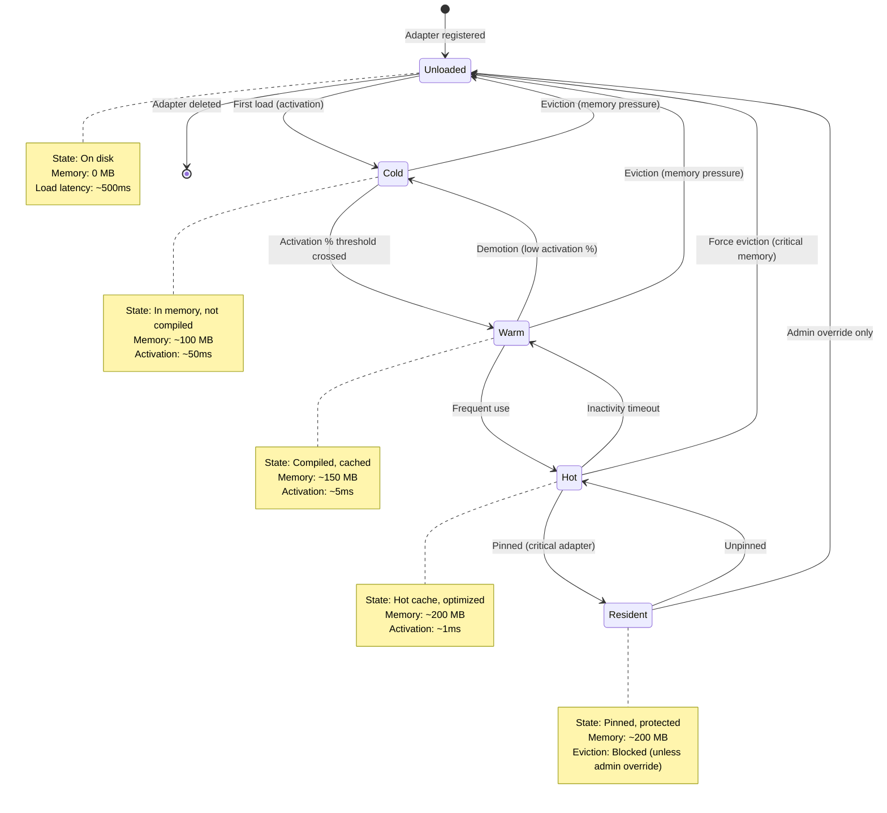
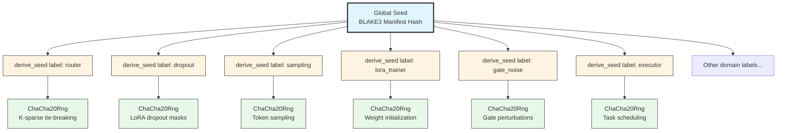
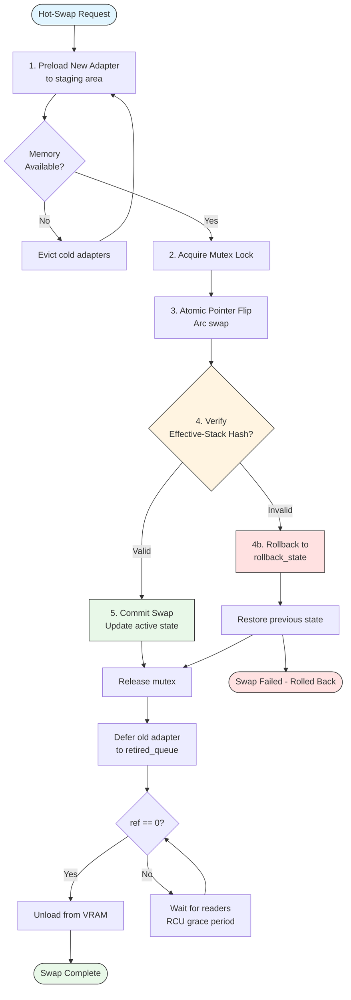
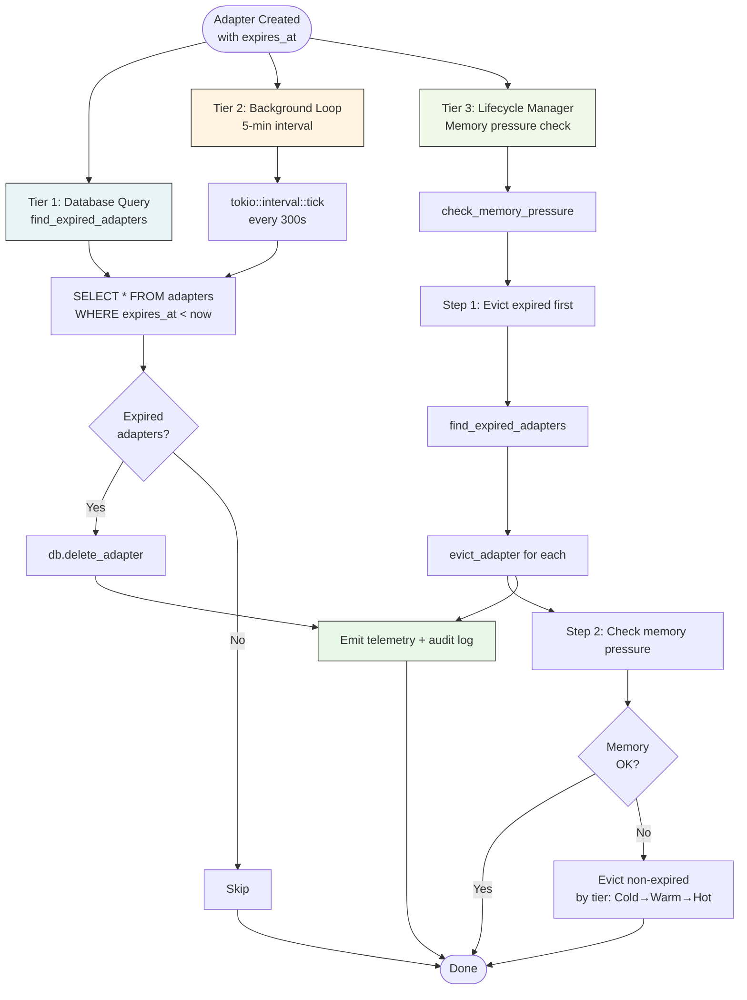

# AdapterOS Developer Guide

**Copyright:** © 2025 JKCA / James KC Auchterlonie. All rights reserved.

**Purpose:** Technical reference for developers. For contribution process, see [CONTRIBUTING.md](CONTRIBUTING.md)
**Last Updated:** 2025-01-16
**Maintained by:** James KC Auchterlonie

---

## Standards & Conventions

### Code Style
```rust
// Standard Rust conventions: PascalCase (types), snake_case (functions/modules), SCREAMING_SNAKE_CASE (constants)
// Run: cargo fmt --all && cargo clippy --workspace -- -D warnings
```

### Documentation
```rust
/// Brief description. Args: `path` - description. Errors: `AosError::NotFound` if missing.
pub async fn load_from_path(path: &Path) -> Result<Adapter> { /* ... */ }
```

### Error Handling
```rust
use adapteros_core::{AosError, Result};

// Use Result<T>, never Option<T> for errors. Add context with map_err.
pub async fn load(&self, path: &Path) -> Result<Data> {
    std::fs::read(path).map_err(|e| match e.kind() {
        std::io::ErrorKind::NotFound => AosError::NotFound(format!("File not found: {}", path.display())),
        _ => AosError::Io(format!("Failed to read {}: {}", path.display(), e))
    })?;
    // ...
}
```

**Common `AosError` variants:** `PolicyViolation`, `DeterminismViolation`, `EgressViolation`, `IsolationViolation`, `Validation`, `Config`, `Io`, `Database`, `Crypto`, `Network`

### Logging (Use `tracing`, never `println!`)
```rust
use tracing::{info, warn, error, debug, trace};
info!(tenant_id = %tenant.id, adapter_id = %adapter.id, "Loading adapter");
```

**Log levels:** `trace!` (detailed debug) → `debug!` (dev info) → `info!` (general) → `warn!` (attention) → `error!` (action required)

#### Telemetry Event Catalog

**Barrier Coordination Events** (`adapteros-deterministic-exec/src/multi_agent.rs`):
- **`barrier.wait_start`** (Debug, lines 212-228) - Agent enters barrier, waiting for peers
- **`barrier.generation_advanced`** (Info, lines 328-353) - CAS winner advances generation counter
- **`barrier.cas_loser_proceed`** (Debug, lines 370-390) - CAS loser detects generation change, proceeds
- **`barrier.agent.removed`** (Warn, lines 153-174) - Agent marked as dead, excluded from barrier coordination
- **`barrier.timeout`** (Error, lines 260-282) - Barrier wait timeout (30s default), indicates coordination failure

**Lifecycle Events** (`adapteros-lora-lifecycle/src/lib.rs`):
- **`adapter_crash_detected`** (Info, lines 213-346) - Stale adapter recovered during crash recovery sweep
- **`adapter_evicted`** - Adapter evicted due to memory pressure (cold adapters first)
- **`adapter_promoted`** - Adapter tier promoted (activation % threshold crossed)
- **`adapter_demoted`** - Adapter tier demoted (inactivity timeout)

**Divergence Detection Events** (`adapteros-deterministic-exec/src/global_ledger.rs`):
- **`tick_ledger.consistent`** (Info, lines 368-399) - Cross-host consistency verified, all entry hashes match
- **`tick_ledger.inconsistent`** (Warn, lines 368-399) - Divergence detected between hosts, includes divergence_count metadata

**Event Metadata Best Practices:**
```rust
use adapteros_telemetry::{TelemetryEventBuilder, EventType, LogLevel};
use serde_json::json;

let event = TelemetryEventBuilder::new(
    EventType::Custom("barrier.generation_advanced".to_string()),
    LogLevel::Info,
    format!("Barrier generation advanced at tick {}", tick),
)
.component("adapteros-deterministic-exec".to_string())
.metadata(json!({
    "agent_id": agent_id,
    "tick": tick,
    "generation": new_gen,
    "wait_duration_ms": elapsed.as_millis(),
    "living_agents": living_count,
    "dead_agents": dead_count,
}))
.build();

event.emit().await?;
```

**Querying Telemetry:**
```sql
-- Find all barrier timeouts in last hour
SELECT * FROM telemetry_events
WHERE event_type = 'barrier.timeout'
  AND timestamp >= datetime('now', '-1 hour')
ORDER BY timestamp DESC;

-- Find divergence incidents
SELECT * FROM tick_ledger_consistency_reports
WHERE consistent = 0
  AND created_at >= datetime('now', '-24 hours');
```

---

## Policy Packs

23 canonical policies enforced. Core policies:

| Policy | Purpose | Implementation |
|--------|---------|----------------|
| **Egress** | Zero network egress in production | `production_mode` requires `uds_socket` only |
| **Determinism** | Reproducible execution | All randomness seeded via HKDF (no `rand::thread_rng()`) |
| **Router** | K-sparse LoRA routing | Q15 quantized gates for adapter selection |
| **Evidence** | Audit trail with quality thresholds | Min relevance/confidence scores, source validation |
| **Telemetry** | Structured event logging | Canonical JSON events with signatures |
| **Naming** | Semantic adapter names | `{tenant}/{domain}/{purpose}/{revision}` format |

**Naming conventions:**
- Adapters: `tenant-a/engineering/code-review/r001`
- Stacks: `stack.production-env`
- Reserved: `system`, `admin`, `root`, `default`, `test` (tenants); `core`, `internal`, `deprecated` (domains)
- Max revision gap: 5

**Policy compliance checklist:**
- [ ] UDS-only in production, [ ] Seeded randomness, [ ] Q15 quantization, [ ] Evidence tracking, [ ] Canonical JSON telemetry, [ ] Semantic naming, [ ] Input validation, [ ] Tenant isolation, [ ] Typed errors

See `crates/adapteros-policy/src/packs/` for implementations.

---

## RBAC (5 Roles, 20+ Permissions)

```mermaid
graph TD
    subgraph Roles
        Admin[👑 Admin<br/>Full Control]
        Operator[⚙️ Operator<br/>Runtime Ops]
        SRE[🔧 SRE<br/>Infra Debug]
        Compliance[📋 Compliance<br/>Audit Only]
        Viewer[👁️ Viewer<br/>Read Only]
    end

    subgraph Common_Permissions[Common to All Roles]
        P_List[AdapterList]
        P_View[AdapterView]
        P_TrainView[TrainingView]
        P_PolicyView[PolicyView]
        P_MetricsView[MetricsView]
    end

    subgraph Admin_Only[Admin Only]
        P_Delete[AdapterDelete]
        P_PolicySign[PolicySign]
        P_TenantMgmt[TenantManage]
        P_NodeMgmt[NodeManage]
    end

    subgraph Operator_Admin[Operator + Admin]
        P_Register[AdapterRegister]
        P_Load[AdapterLoad/Unload]
        P_TrainOps[TrainingStart/Cancel]
        P_Infer[InferenceExecute]
    end

    subgraph Audit_Access[SRE + Compliance + Admin]
        P_Audit[AuditView]
    end

    subgraph Compliance_Admin[Compliance + Admin]
        P_PolicyVal[PolicyValidate]
    end

    Admin --> P_List & P_View & P_TrainView & P_PolicyView & P_MetricsView
    Operator --> P_List & P_View & P_TrainView & P_PolicyView & P_MetricsView
    SRE --> P_List & P_View & P_TrainView & P_PolicyView & P_MetricsView
    Compliance --> P_List & P_View & P_TrainView & P_PolicyView & P_MetricsView
    Viewer --> P_List & P_View & P_TrainView & P_PolicyView & P_MetricsView

    Admin --> P_Delete & P_PolicySign & P_TenantMgmt & P_NodeMgmt
    Admin & Operator --> P_Register & P_Load & P_TrainOps & P_Infer
    Admin & SRE & Compliance --> P_Audit
    Admin & Compliance --> P_PolicyVal

    style Admin fill:#ffe1e1,stroke:#333
    style Operator fill:#fff4e1,stroke:#333
    style SRE fill:#e8f4f8,stroke:#333
    style Compliance fill:#f0f8e8,stroke:#333
    style Viewer fill:#f0f0f0,stroke:#333
```

<details>
<summary>📊 RBAC Permission Matrix</summary>



**Auth Flow:** Login → JWT (Ed25519, 8hr TTL) → Middleware validation → Permission check → Audit log

</details>

**Roles:** Admin (full), Operator (runtime ops), SRE (infra debug), Compliance (audit-only), Viewer (read-only)

**Permission matrix (condensed):**
- **All roles:** AdapterList, AdapterView, TrainingView, PolicyView, MetricsView
- **Admin only:** AdapterDelete, PolicyApply, PolicySign, TenantManage, NodeManage, AuditView
- **Operator+Admin:** AdapterRegister, AdapterLoad/Unload, TrainingStart/Cancel, InferenceExecute
- **SRE+Compliance+Admin:** AuditView
- **Compliance+Admin:** PolicyValidate

**Usage:**
```rust
use adapteros_server_api::permissions::{require_permission, Permission};
require_permission(&claims, Permission::AdapterRegister)?;
```

**Audit logging:**
```rust
use adapteros_server_api::audit_helper::{log_success, actions, resources};
log_success(&db, &claims, actions::ADAPTER_REGISTER, resources::ADAPTER, Some(&id)).await;
```

**Auth flow:** Login → JWT (Ed25519, 8hr TTL) → Middleware validation → Permission check → Audit log

**Query logs:** `GET /v1/audit/logs?action=adapter.register&status=success&limit=50`

---

## Architecture Patterns

### Core Patterns (Consolidated)

| Pattern | Location | Key Concept |
|---------|----------|-------------|
| **K-Sparse Routing** | `adapteros-lora-router` | Top-K adapters via Q15 gates |
| **Metal Kernels** | `adapteros-lora-kernel-mtl` | Precompiled deterministic Metal kernels |
| **Configuration** | `adapteros-config` | Precedence: CLI > Env > File > Defaults |
| **Memory Mgmt** | `adapteros-memory` | Auto-eviction maintains ≥15% headroom |
| **Hot-Swap** | `adapteros-lora-worker/adapter_hotswap.rs` | Live adapter replacement |
| **RCU-Style Hot-Swap GC** | `adapteros-lora-worker/adapter_hotswap.rs` | Atomic Arc<Stack> swaps with deferred unloading via refcounts and background retirement |
| **Content Addressing** | `adapteros-core/hash.rs` | BLAKE3 hashing for all artifacts |
| **Deterministic Exec** | `adapteros-deterministic-exec` | Serial FIFO task execution, no concurrency |
| **HKDF Seeding** | `adapteros-core/hash.rs` | Domain-separated seeds (router, dropout, sampling, etc.) |
| **Lifecycle Management** | `adapteros-core/src/lifecycle.rs`, `adapteros-db/src/lifecycle.rs` | State machine transitions with validation and version bumping |
| **Heartbeat Recovery** | `adapteros-lora-lifecycle`, `adapteros-db` | 5-min timeout, auto-reset stale adapters |

### Adapter Lifecycle State Machine

<details>
<summary>📊 State Machine Diagram</summary>



</details>

**Transitions:** Promotion (activation % ↑), Demotion (activation % ↓ + timeout), Eviction (memory pressure + lowest %), Pinning (→ Resident)

```rust
use adapteros_lora_lifecycle::LifecycleManager;
let manager = LifecycleManager::new_with_db(adapter_names, &policies, path, telemetry, k, db);
manager.record_router_decision(&selected).await?; // Auto-promote
manager.check_memory_pressure(total_mem, 0.85).await?; // Auto-evict
```

### Heartbeat Mechanism (Agent G Stability Reinforcement Phase 2)
**Purpose:** Detect and recover adapters that freeze/crash without updating state

**Components:**
1. **Database Schema (migration 0065)**:
   - `adapters.last_heartbeat` (INTEGER, Unix timestamp)
   - `training_jobs.last_heartbeat` (INTEGER, Unix timestamp)
   - Partial indexes for efficient queries
   - Views: `stale_adapters`, `stale_training_jobs` (5-min threshold)

2. **Lifecycle Methods**:
   ```rust
   // Update heartbeat (called periodically by adapter)
   manager.heartbeat_adapter(&adapter_id).await?;

   // Check for stale adapters
   let stale_ids = manager.check_stale_adapters(300).await?;

   // Auto-recover stale adapters (resets to unloaded)
   let recovered = manager.recover_stale_adapters(300).await?;
   ```

3. **Server Integration** (`main.rs`):
   - Background task runs every 5 minutes
   - Calls `db.recover_stale_adapters(300)` (300s = 5min threshold)
   - Logs stale detection and recovery events
   - Emits telemetry for audit trail

**Recovery Flow:**
1. Adapter sends periodic heartbeat via `heartbeat_adapter()`
2. Background task queries for adapters with `last_heartbeat < now - 300s`
3. Stale adapters reset to `unloaded` state, heartbeat cleared
4. Recovery logged to audit + telemetry bundles

**Complements `recover_from_crash()`:**
- `recover_from_crash()`: Detects adapters stuck in "loading" state (5-min timeout)
- Heartbeat recovery: Detects frozen adapters in any state (no heartbeat)

### Deterministic Executor Seeding
**Critical:** Seed derived from base model manifest hash via HKDF

```rust
use adapteros_core::{B3Hash, derive_seed};
use adapteros_manifest::ManifestV3;

let manifest = serde_json::from_str::<ManifestV3>(&std::fs::read_to_string(&cli.manifest_path)?)?;
manifest.validate()?;
let manifest_hash = manifest.compute_hash()?;
let global_seed = derive_seed(&manifest_hash, "executor");
init_global_executor(ExecutorConfig { global_seed, enable_event_logging: true, ..Default::default() })?;
```

**Env var:** `AOS_MANIFEST_PATH` (CLI `--manifest-path` overrides)
**Production enforcement:** Requires manifest when `require_pf_deny=true`
**Why:** Identical manifest = identical execution, enables replay/verification

### .aos Archive Format
```
[0-3]   manifest_offset (u32 LE)
[4-7]   manifest_len (u32 LE)
[offset] manifest (JSON)
[offset] weights (safetensors)
```

Zero-copy loading with memory-mapped files → GPU VRAM direct transfer.

### HKDF Hierarchy

<details>
<summary>📊 Seed Derivation Tree</summary>



**Why HKDF?** Domain-separated seeding ensures:
- Identical manifest → Identical seeds → Identical execution
- No cross-contamination between randomness domains
- Cryptographically secure seed derivation (HKDF-SHA256)

</details>

```rust
let global = B3Hash::hash(b"seed_material");
let router_seed = derive_seed(&global, "router");
let mut rng = ChaCha20Rng::from_seed(router_seed.try_into().unwrap());
```

### Hot-Swap Protocol

<details>
<summary>📊 Hot-Swap Flow with Rollback</summary>



**Key Properties:**
- **Zero Downtime**: Old adapter remains active during swap
- **Atomic Safety**: Mutex-guarded pointer flips
- **Automatic Rollback**: Hash mismatch triggers instant recovery
- **RCU Grace Period**: Deferred unload when ref count drops to 0

</details>

```rust
use adapteros_lora_worker::adapter_hotswap::AdapterTable;
let table = AdapterTable::new();
table.preload("new".to_string(), hash, vram_mb)?;
table.swap(&["new"], &["old"]).or_else(|e| { table.rollback()?; Err(e) })?;
```

**Architecture:** `active` (current) | `staged` (preloaded) | `rollback_state` (recovery) | `retired_queue` (RCU deferral)

**Testing Coverage (Post-Rectification):** Loom concurrency model proves no UAF in 5000+ interleavings (readers pin via ref>0, writers defer unload). Miri UB scan clean. Automated stress test: 1000 swaps + 1000 concurrent 1s infers with zero panics, proper unloads post-ref0 (assert in test, <1% latency regression). Event-driven retirement: wake within 5ms of ref==0.

### Global Tick Ledger (Issue C-6 Fix)
**Critical:** Tick assignment must be atomic to prevent duplicate ticks in concurrent execution

```rust
use adapteros_deterministic_exec::GlobalTickLedger;

let ledger = GlobalTickLedger::new(db, tenant_id, host_id);

// record_tick atomically assigns unique tick via fetch_add
let entry_hash = ledger.record_tick(task_id, &event).await?;
// NO external increment needed - tick assignment is internal
```

**Implementation (2025-11-16):**
- `record_tick` uses `self.local_tick.fetch_add(1, Ordering::SeqCst)` to atomically assign ticks
- Each concurrent `record_tick` call gets a unique, sequential tick value
- Eliminates race condition where threads could get the same tick
- Merkle chain integrity preserved under concurrent writes

**Pattern:**
```rust
// OLD (race condition - DEPRECATED):
let tick = ledger.current_tick();  // Thread A: tick=100
// Thread B also reads tick=100! DUPLICATE!
ledger.record_tick(task_id, &event).await?;
ledger.increment_tick();  // External increment

// NEW (atomic, race-free):
ledger.record_tick(task_id, &event).await?;
// Tick assigned internally via fetch_add - guaranteed unique
```

**Location:** `crates/adapteros-deterministic-exec/src/global_ledger.rs:163`

### Multi-Agent Coordination & Dead Agent Handling (Issue C-8)
**Purpose:** AgentBarrier synchronizes multiple agents at tick boundaries with explicit failure handling

**Status (2025-11-16):** All AgentBarrier issues (C-1 through C-8) have been resolved and tested. No additional work required.

<details>
<summary>📊 Multi-Agent Barrier Coordination</summary>

```mermaid
sequenceDiagram
    participant A as Agent A
    participant B as Agent B
    participant C as Agent C
    participant Bar as AgentBarrier<br/>(generation counter)

    Note over A,C: Normal Synchronization Flow
    A->>Bar: wait("A", tick=100)
    Note right of Bar: Generation = 0<br/>Waiting agents: [A]

    B->>Bar: wait("B", tick=100)
    Note right of Bar: Waiting agents: [A, B]

    C->>Bar: wait("C", tick=100)
    Note right of Bar: All agents arrived!<br/>CAS: generation 0→1

    Bar-->>A: ✅ Proceed (generation advanced)
    Bar-->>B: ✅ Proceed
    Bar-->>C: ✅ Proceed

    Note over A,C: Dead Agent Scenario (Agent C crashes)
    A->>Bar: wait("A", tick=101)
    B->>Bar: wait("B", tick=101)
    Note over C: ❌ Agent C crashes

    Note right of Bar: Timeout after 30s

    rect rgb(255, 225, 225)
        Bar->>Bar: mark_agent_dead("C")
        Note right of Bar: Dead agents: [C]<br/>Living agents: [A, B]
    end

    Bar-->>A: ✅ Proceed (2/3 living agents)
    Bar-->>B: ✅ Proceed

    Note over A,C: CAS Loser Scenario
    A->>Bar: wait("A", tick=102)
    Note right of Bar: Generation = 2

    par CAS Race
        B->>Bar: CAS(2, 3) - WINNER
        C->>Bar: CAS(2, 3) - LOSER
    end

    Note right of Bar: B wins, advances generation→3

    Bar-->>C: ✅ Proceed (detected generation change)
    Bar-->>B: ✅ Proceed
    Bar-->>A: ✅ Proceed

    style Bar fill:#e8f4f8,stroke:#333
```

**Telemetry Events:**
- `barrier.wait_start` (Debug) - Agent enters barrier
- `barrier.generation_advanced` (Info) - CAS winner advances generation
- `barrier.cas_loser_proceed` (Debug) - CAS loser detects change
- `barrier.agent.removed` (Warn) - Dead agent excluded
- `barrier.timeout` (Error) - 30s timeout indicates coordination failure

</details>

**Fixes implemented in `crates/adapteros-deterministic-exec/src/multi_agent.rs`:**
- **C-1 (CAS Race Condition):** CAS losers use Acquire ordering and detect advanced generation (lines 312-400)
- **C-2 (Notify-based Waiting):** Replaced busy-wait with efficient Notify mechanism (lines 403-413)
- **C-5 (Failure Broadcast):** AtomicBool flag broadcasts timeouts to all agents (lines 196-201, 284-285)
- **C-7 (Memory Ordering):** Changed generation.load() from Relaxed to Acquire (line 247)
- **C-8 (Dead Agent Handling):** Explicit agent removal with graceful degradation (lines 107-183, 298-307)
- **Testing:** Comprehensive coverage including 7-agent regression test, stress tests (20-100 agents), timeout scenarios, dead agent handling (lines 508-1106)

```rust
use adapteros_deterministic_exec::AgentBarrier;

let barrier = Arc::new(AgentBarrier::new(vec!["a".into(), "b".into(), "c".into()]));

// Normal synchronization - all agents must arrive
barrier.wait("a", tick).await?;  // Blocks until all agents reach tick

// Dead agent handling - explicit removal for crash tolerance
barrier.mark_agent_dead("c")?;  // Mark crashed agent as dead
// Barrier now proceeds with only agents A and B
```

**Dead Agent API:**
- **mark_agent_dead(agent_id)** - Explicitly mark an agent as dead/crashed
  - Remaining living agents can proceed without waiting for dead agents
  - Dead agents cannot be revived (permanent removal)
  - Notifies all waiting threads to re-evaluate barrier condition
  - Emits `barrier.agent.removed` telemetry event

**Safety:**
- Agent must be in original `agent_ids` list (returns `AgentNotRegistered` otherwise)
- Warns if marking already-dead agent (idempotent no-op)
- Automatically skips dead agents when checking barrier condition

**Use Cases:**
- Graceful degradation when agents crash
- Operator intervention to unblock barrier
- Testing failure scenarios without timeout

**Location:** `crates/adapteros-deterministic-exec/src/multi_agent.rs:123-183`

### Barrier Telemetry Events
Barrier operations emit structured telemetry events for observability:

| Event Type | Level | When Emitted | Metadata |
|------------|-------|--------------|----------|
| `barrier.wait_start` | Debug | Agent enters barrier | agent_id, tick, generation, total_agents |
| `barrier.generation_advanced` | Info | CAS winner advances generation | agent_id, tick, generation, wait_duration_ms, living_agents, dead_agents |
| `barrier.cas_loser_proceed` | Debug | CAS loser sees advanced generation | agent_id, expected_gen, actual_gen |
| `barrier.agent.removed` | Warn | Agent marked as dead | agent_id, dead_count, remaining_agents, generation |
| `barrier.timeout` | Error | Barrier timeout (30s default) | agent_id, tick, timeout_seconds, wait_duration_ms |

**Correlation:** All events include `generation` field for correlating barrier operations with tick ledger entries.

**Location:** `crates/adapteros-deterministic-exec/src/multi_agent.rs:154-174, 328-353`

---

## Document Processing & Training

### Pipeline (5 Steps)

```mermaid
flowchart LR
    PDF[PDF/Documents] -->|1. Ingest| Parsed[Parsed Document<br/>DocumentIngestor]
    Parsed -->|2. Generate| Examples[Training Examples<br/>Identity/QA/MaskedLM]

    Examples -->|3. Create Dataset| DS[(Dataset<br/>BLAKE3 hash)]
    DS -->|Validate| Check{validation_status<br/>== 'valid'?}

    Check -->|No| Reject[❌ Reject]
    Check -->|Yes| Train[4. Train<br/>MicroLoRATrainer<br/>rank/alpha config]

    Train -->|5. Package| Weights[.aos archive<br/>safetensors + manifest]
    Weights -->|Register| Registry[(Registry DB<br/>ACL/Tier assignment)]

    Registry --> Success([✅ Adapter Ready])
    Reject --> Failed([❌ Training Blocked])

    style PDF fill:#e1f5ff,stroke:#333
    style Check fill:#fff4e1,stroke:#333
    style Reject fill:#ffe1e1,stroke:#333
    style Train fill:#e8f8e8,stroke:#333
    style Registry fill:#e8f4f8,stroke:#333
    style Success fill:#e8f8e8,stroke:#333
```

<details>
<summary>📊 End-to-End Training Pipeline</summary>



**Validation Gates:**
- BLAKE3 content addressing for datasets
- Schema validation before training
- Manifest signing after packaging

</details>

1. **Ingest:** `DocumentIngestor::new(opts, tokenizer).ingest_pdf_path(path)?`
2. **Generate:** `generate_training_data(&doc, &tokenizer, &config)?`
3. **Dataset:** `TrainingDatasetManager::new(db, path, tok).create_dataset_from_documents(req).await?`
4. **Train:** `MicroLoRATrainer::new(cfg)?.train(examples, adapter_id).await?`
5. **Package:** `AdapterPackager::new().package(weights, manifest)?` → `registry.register_adapter(...)?`

**Training strategies:** Identity (unsupervised), QuestionAnswer, MaskedLM

**Core modules:** `adapteros-ingest-docs` (ingestion), `adapteros-orchestrator/training_dataset_integration.rs` (dataset mgmt), `adapteros-lora-worker/training/` (trainer, quantizer, packager)

**Dataset schema:** `training_datasets`, `dataset_files`, `dataset_statistics` (BLAKE3 content-addressed, JSONL format)

### Training Templates
- `general-code`: rank=16, alpha=32 (multi-language)
- `framework-specific`: rank=12, alpha=24

**Job tracking:** Pending → Running → Completed/Failed/Cancelled (progress %, loss, tokens/sec)

---

## Workflow Execution

**Types:** Sequential (serial), Parallel (concurrent merge), UpstreamDownstream (2-phase)

```rust
use adapteros_lora_lifecycle::{WorkflowExecutor, WorkflowType, KernelAdapterBackend};
let backend = Arc::new(KernelAdapterBackend::new(kernels_arc, names, 152064));
let executor = WorkflowExecutor::new(WorkflowType::UpstreamDownstream, vec!["a", "b"], backend);
let result = executor.execute(WorkflowContext { input_tokens, model_state, metadata }).await?;
```

**Backends:** `KernelAdapterBackend` (real Metal), `MockAdapterBackend` (testing)

---

## Database Schema (Core Tables)

| Table | Purpose | Key Fields |
|-------|---------|------------|
| `adapters` | Adapter metadata | id, hash, tier, rank, acl, activation_%, expires_at |
| `tenants` | Tenant isolation | id, uid, gid, isolation_metadata |
| `adapter_stacks` | Reusable combos | id, name, adapter_ids_json, workflow_type |
| `training_datasets` | Dataset metadata | id, hash_b3, validation_status |
| `dataset_files` | Individual files | path, size, hash, ingestion_metadata |
| `dataset_statistics` | Cached stats | num_examples, total_tokens, distributions |
| `training_jobs` | Job tracking | id, dataset_id, status, progress_pct, loss |
| `pinned_adapters` | Pin enforcement | tenant_id, adapter_id, pinned_until, reason, pinned_by |
| `audit_logs` | Immutable audit trail | user_id, action, resource, status, timestamp |

**Registry usage:**
```rust
use adapteros_registry::Registry;
let registry = Registry::open("./registry.db")?;
registry.register_adapter("id", &hash, "tier_1", rank, &["tenant_a"])?;
let allowed = registry.check_acl("id", "tenant_a")?;
```

### Migration Management

**Canonical Migration Directory:** `/migrations/` (root)
**Migration Count:** 65 migrations (0001-0065, with some gaps)
**Signing:** All migrations signed with Ed25519 (`migrations/signatures.json`)

**IMPORTANT:** The crate-local migration directory (`/crates/adapteros-db/migrations/`) is **DEPRECATED** as of 2025-01-16. See `/crates/adapteros-db/migrations/DEPRECATED.md` for consolidation details.

**Note:** Migration consolidation from crate directory to root is incomplete. Migrations 0066-0068 were planned but not created.

**Key Migrations:**
- **0035** - Tick ledger federation columns (bundle_hash, prev_host_hash, federation_signature) - Reserved for future use
- **0045** - .aos file support (aos_file_path, aos_file_hash)
- **0055** - Model backend fields (adapter_path, backend, quantization, last_error)
- **0060** - Pinned adapters table with TTL support
- **0061** - Semantic naming taxonomy (adapter_name, tenant_namespace, domain, purpose, revision, parent_id, fork_type, fork_reason)
- **0062** - RBAC audit logs
- **0063** - Dashboard configuration table for per-user widget customization
- **0064** - Adapter stacks for reusable workflow combinations
- **0065** - Heartbeat mechanism for lifecycle management (last_heartbeat column, stale_adapters view)

**Creating New Migrations:**
```bash
# 1. Create migration file
touch migrations/NNNN_description.sql

# 2. Write SQL (use SQLite-compatible types)
# Prefer: TEXT, INTEGER, REAL, BOOLEAN
# Avoid: JSONB, BIGINT, DOUBLE PRECISION, TIMESTAMP WITH TIME ZONE

# 3. Sign all migrations
./scripts/sign_migrations.sh

# 4. Test schema consistency
cargo test -p adapteros-db schema_consistency_tests
```

**Schema Consistency Requirements:**
- All migrations in `/migrations/` must be signed
- Adapter struct fields must match database columns
- INSERT statements must include all new schema columns
- SELECT queries must reference valid columns
- See `/crates/adapteros-db/tests/schema_consistency_tests.rs` for validation

**Migration Verification:**
```rust
use adapteros_db::migration_verify::MigrationVerifier;
let verifier = MigrationVerifier::new("migrations")?;
verifier.verify_all()?; // Checks Ed25519 signatures
```

---

## Adapter Pinning & TTL

### Pinning System

**Purpose:** Prevent critical adapters from being evicted or deleted, ensuring production stability.

**Implementation:**
- **Table:** `pinned_adapters` (migration 0060)
- **View:** `active_pinned_adapters` (auto-filters expired pins via SQL)
- **Module:** `crates/adapteros-db/src/pinned_adapters.rs`
- **Single Source of Truth:** View respects TTL automatically, eliminating need for manual expiration checks

**API:**
```rust
use adapteros_db::Db;

// Pin adapter (optional TTL)
db.pin_adapter(
    tenant_id,
    adapter_id,
    Some("2025-12-31 23:59:59"),  // pinned_until (None = permanent)
    "production-critical",         // reason
    "ops@example.com"             // pinned_by
).await?;

// Unpin adapter
db.unpin_adapter(tenant_id, adapter_id).await?;

// Check pin status (respects TTL)
let is_pinned = db.is_pinned(tenant_id, adapter_id).await?;

// List all active pins for tenant
let pins = db.list_pinned_adapters(tenant_id).await?;

// Cleanup expired pins (automatic background job)
db.cleanup_expired_pins().await?;
```

**Delete Protection:**
- `Db::delete_adapter()` checks `active_pinned_adapters` view before deletion
- Returns `AosError::PolicyViolation` if active pins exist
- Implementation: `crates/adapteros-db/src/adapters.rs:517-553`

**Example:**
```rust
// Attempt to delete pinned adapter
match db.delete_adapter("adapter-id").await {
    Err(e) if e.to_string().contains("active pin(s)") => {
        // Must unpin first
        db.unpin_adapter(tenant_id, "adapter-id").await?;
        db.delete_adapter("adapter-id").await?;
    }
    Ok(_) => println!("Deleted successfully"),
    Err(e) => return Err(e),
}
```

**Schema:**
```sql
CREATE TABLE pinned_adapters (
    tenant_id TEXT NOT NULL,
    adapter_id TEXT NOT NULL,
    pinned_at TEXT NOT NULL DEFAULT (datetime('now')),
    pinned_until TEXT,  -- NULL = permanent pin
    reason TEXT,
    pinned_by TEXT,
    PRIMARY KEY (tenant_id, adapter_id)
);

CREATE VIEW active_pinned_adapters AS
SELECT * FROM pinned_adapters
WHERE pinned_until IS NULL OR pinned_until > datetime('now');
```

### TTL (Time-To-Live) Enforcement

**Purpose:** Automatic cleanup of ephemeral/temporary adapters without manual intervention.

**Implementation:**
- **Column:** `adapters.expires_at` (TEXT, SQLite datetime format)
- **Query:** `Db::find_expired_adapters()` (`crates/adapteros-db/src/adapters.rs:475-490`)
- **Cleanup Loop:** Background task in `crates/adapteros-server/src/main.rs:709-728` (5-minute interval)
- **Lifecycle Integration:** `LifecycleManager::check_memory_pressure()` evicts expired adapters first

<details>
<summary>📊 Three-Tier TTL Enforcement Flow</summary>



**Concurrency Safety:** SQLite transactions provide serialization (no race conditions between tiers)

</details>

**Three-Tier Enforcement Flow:**

1. **Database Query** - Find expired adapters
   ```rust
   pub async fn find_expired_adapters(&self) -> Result<Vec<Adapter>> {
       sqlx::query_as::<_, Adapter>(
           "SELECT * FROM adapters
            WHERE expires_at IS NOT NULL AND expires_at < datetime('now')"
       ).fetch_all(self.pool()).await
   }
   ```

2. **Background Cleanup Loop** - Periodic deletion (5-min interval)
   ```rust
   // crates/adapteros-server/src/main.rs:709-728
   spawn_deterministic("TTL cleanup".to_string(), async move {
       let mut interval = tokio::time::interval(Duration::from_secs(300));
       loop {
           interval.tick().await;
           if let Ok(expired) = db.find_expired_adapters().await {
               for adapter in expired {
                   let _ = db.delete_adapter(&adapter.adapter_id).await;
               }
           }
       }
   });
   ```

3. **Lifecycle Manager** - Evict expired before memory pressure check
   ```rust
   // crates/adapteros-lora-lifecycle/src/lib.rs:1073-1092
   pub async fn check_memory_pressure(&self, total_memory: usize, threshold: f32) -> Result<()> {
       // Step 1: Evict expired adapters first (regardless of memory pressure)
       if let Some(ref db) = self.db {
           if let Ok(expired) = db.find_expired_adapters().await {
               for exp in expired {
                   self.evict_adapter(&exp.name).await?;
               }
           }
       }
       // Step 2: Then check memory pressure for normal eviction...
   }
   ```

**Usage:**
```rust
use adapteros_db::AdapterRegistrationParams;

// Register adapter with 30-day TTL
let params = AdapterRegistrationParams {
    adapter_id: "temp-adapter".to_string(),
    expires_at: Some("2025-02-15 23:59:59".to_string()),
    ..Default::default()
};
db.register_adapter_with_params(&params).await?;
```

**Concurrency Safety:**
- All state updates use transactional SQL operations (see below)
- TTL enforcement serialized via SQLite transaction isolation
- No race conditions between cleanup loop and lifecycle manager

### State Update Concurrency

**Design:** Optimistic concurrency via SQLite transactions (no explicit locking required).

**Transactional Updates:**
1. **State transitions:** `update_adapter_state_tx()` (`crates/adapteros-db/src/adapters.rs:752-789`)
2. **Memory updates:** `update_adapter_memory_tx()` (`crates/adapteros-db/src/adapters.rs:796-826`)

**How it works:**
```rust
pub async fn update_adapter_state_tx(&self, adapter_id: &str, state: &str, reason: &str) -> Result<()> {
    // Begin transaction - SQLite acquires lock
    let mut tx = self.pool().begin().await?;

    // Verify row exists (transaction holds lock)
    let exists = sqlx::query_as::<_, (String,)>(
        "SELECT adapter_id FROM adapters WHERE adapter_id = ?"
    ).bind(adapter_id).fetch_optional(&mut *tx).await?;

    if exists.is_none() {
        return Err(anyhow::anyhow!("Adapter not found"));
    }

    // Perform update (serialized by transaction)
    sqlx::query("UPDATE adapters SET current_state = ?, updated_at = datetime('now') WHERE adapter_id = ?")
        .bind(state).bind(adapter_id)
        .execute(&mut *tx).await?;

    // Commit - releases lock
    tx.commit().await?;
    Ok(())
}
```

**Concurrency Guarantees:**
- SQLite's default isolation level provides serialization
- Transaction locks prevent lost updates in concurrent scenarios
- No need for explicit mutexes or row-level locks in application code
- Tested: `tests/stability_reinforcement_tests.rs::test_concurrent_state_update_race_condition`

**Testing:**
```rust
// 20 concurrent tasks (10 state, 10 memory) - all succeed without lost updates
#[tokio::test]
async fn test_concurrent_state_update_race_condition() {
    let tasks: Vec<_> = (0..20).map(|i| {
        if i % 2 == 0 {
            db.update_adapter_state_tx(id, state, reason).await
        } else {
            db.update_adapter_memory_tx(id, mem, max_mem).await
        }
    }).collect();
    let results = futures::future::join_all(tasks).await;
    assert!(results.iter().all(|r| r.is_ok()));
}
```

**Citations:**
- Pin implementation: `crates/adapteros-db/src/pinned_adapters.rs`
- Delete protection: `crates/adapteros-db/src/adapters.rs:517-553`
- TTL query: `crates/adapteros-db/src/adapters.rs:475-490`
- Cleanup loop: `crates/adapteros-server/src/main.rs:709-728`
- Lifecycle integration: `crates/adapteros-lora-lifecycle/src/lib.rs:1073-1092`
- State transactions: `crates/adapteros-db/src/adapters.rs:752-826`
- Test coverage: `tests/stability_reinforcement_tests.rs`

---

## Streaming Architecture

**Modes:**
1. Batch (complete response)
2. Streaming (chat-style SSE, token-by-token)

```rust
use adapteros_api::streaming::{StreamingInferenceRequest, streaming_inference_handler};
let request = StreamingInferenceRequest { prompt, model, max_tokens, temperature, stream: true, adapter_stack, ..Default::default() };
let stream = streaming_inference_handler(State(api_state), Json(request)).await;
// Format: data: {"id":"chatcmpl-123","object":"chat.completion.chunk","choices":[{"delta":{"content":"Hi"},...}]}
// Final: data: [DONE]
```

**Features:** Keep-alive, client disconnect detection

---

## Common Patterns

### Database Access
```rust
query("SELECT * FROM adapters WHERE tenant_id = ?").bind(&tenant_id).fetch_all(&db.pool).await
    .map_err(|e| AosError::Database(format!("Query failed: {}", e)))?;
```

### Async Task Spawning
```rust
spawn(async move { if let Err(e) = do_work().await { error!(error = %e, "Task failed"); } });
```

### Production Mode Enforcement
```rust
if config.server.production_mode {
    if config.server.uds_socket.is_none() { return Err(AosError::Config("Requires uds_socket".into())); }
    if config.security.jwt_mode.as_deref() != Some("eddsa") { return Err(AosError::Config("Requires jwt_mode='eddsa'".into())); }
    if !config.security.require_pf_deny { return Err(AosError::Config("Requires require_pf_deny=true".into())); }
}
```

---

## Anti-Patterns (Avoid)

| Anti-Pattern | Issue | Fix |
|--------------|-------|-----|
| TODO comments | No completion plan | Complete implementation or explicit error |
| Placeholder logic | Fake functionality | Real implementation |
| `Option<T>` for errors | Loses error context | Use `Result<T, AosError>` |
| `println!` logging | Not queryable | Use `tracing` macros |
| Unsafe in app crates | Security risk | Isolate to FFI crates (Metal, PyO3) |
| Blocking in async | Blocks executor | Use `tokio::time::sleep`, not `std::thread::sleep` |
| Unlocked kernel refs | Won't compile | `self.kernels.lock().await` before use |
| Unvalidated datasets | Training fails | Check `validation_status = 'valid'` |

See `docs/DEPRECATED_PATTERNS.md` for historical examples.

---

## Key Subsystems (Locations)

| Subsystem | Crate | Purpose |
|-----------|-------|---------|
| Router | `adapteros-lora-router` | K-sparse adapter selection |
| Metal Kernels | `adapteros-lora-kernel-mtl` | Deterministic GPU kernels |
| Policy Engine | `adapteros-policy` | 23-pack policy enforcement |
| Memory Mgmt | `adapteros-memory` | Auto-eviction, headroom maintenance |
| Lifecycle | `adapteros-lora-lifecycle` | State machine (Unloaded→Resident) |
| Hot-Swap | `adapteros-lora-worker/adapter_hotswap.rs` | Live adapter replacement |
| Deterministic Exec | `adapteros-deterministic-exec` | Serial FIFO task execution |
| HKDF | `adapteros-core/hash.rs` | Domain-separated seeding |
| Training | `adapteros-lora-worker/training/` | Trainer, quantizer, packager |
| Registry | `adapteros-registry` | SQLite WAL mode, adapter/tenant mgmt |
| Pinning & TTL | `adapteros-db/src/pinned_adapters.rs` | Pin/unpin API, TTL enforcement |
| Web UI | `adapteros-server-api`, `ui/` | React/TypeScript REST API |

---

## REST API Endpoints

| Endpoint | Method | Purpose |
|----------|--------|---------|
| `/api/adapters` | GET | List adapters with lifecycle state |
| `/api/adapters/load` | POST | Load adapter into lifecycle |
| `/api/adapters/swap` | POST | Hot-swap adapters |
| `/api/router/config` | GET | Router configuration |
| `/api/training/start` | POST | Start training job |
| `/api/training/datasets` | POST | Create dataset from documents |
| `/api/training/jobs/:id` | GET | Get job status |
| `/api/chat/completions` | POST | Chat inference (streaming/batch) |
| `/api/adapter-stacks` | GET/POST | List/create adapter stacks |
| `/v1/audit/logs` | GET | Query audit logs (Admin/SRE/Compliance) |

---

## UI Integration & Observability

**Purpose:** Document how backend telemetry and status surfaces in the web UI for operator visibility.

### Base Model Status Display

**Component:** `ui/src/components/dashboard/BaseModelWidget.tsx`
**API Endpoint:** `GET /v1/models/status?tenant_id={tenantId}` (client.ts:933)

**Status States:**
- `loaded` (green CheckCircle) - Model active in memory
- `loading` (blue spinning RefreshCw) - Model initialization in progress
- `unloading` (yellow RefreshCw) - Model being evicted
- `unloaded` (gray XCircle) - Model not in memory
- `error` (red XCircle) - Loading failed, see error message

**Displayed Fields:**
- `model_id` - Unique identifier
- `model_name` - Friendly display name
- `status` - Current lifecycle state (enum)
- `is_loaded` - Boolean convenience flag
- `memory_usage_mb` - VRAM consumption (if loaded)
- `loaded_at` - Timestamp of last successful load

**Implementation:** Lines 119-139 (fetchStatus), 302-314 (status badge), 85-96 (getStatusIcon)

### Adapter Lifecycle State Display

**Component:** `ui/src/components/AdaptersPage.tsx`
**API Endpoints:**
- `GET /api/adapters` - List all adapters with metadata
- `GET /api/system-metrics` - System-wide resource metrics

**Table Columns:**
- **Name** - Adapter semantic name (tenant/domain/purpose/revision)
- **Category** - Domain classification with icon
- **State** - Lifecycle tier (Unloaded → Cold → Warm → Hot → Resident)
  - Shows pin icon if `adapter.pinned = true`
  - Color-coded badges (gray, blue, orange, red, purple)
- **Memory (MB)** - Current VRAM footprint
- **Activations** - Router selection count (drives promotion/demotion)
- **Last Used** - Timestamp of most recent inference

**State Machine (Lines 190-240):**
```
Unloaded → Cold → Warm → Hot → Resident
    ↑                              ↓
    └──────── (eviction) ──────────┘
```

**Pinned Adapters:**
- Exempt from automatic eviction
- Visual pin icon in State column
- TTL enforcement via `pinned_until` field

**Implementation:** Lines 34-50 (fetchAdaptersData), 209-211 (state badge + pin indicator)

### Multi-Model Dashboard

**Component:** `ui/src/components/dashboard/MultiModelStatusWidget.tsx`
**API Endpoint:** `GET /v1/models/status/all?tenant_id={tenantId}` (client.ts:940)

**Purpose:** Shows all loaded models across tenants (multi-tenancy view)

**Displayed Per Model:**
- `model_id` and `model_name`
- Status badge (5 states, see Base Model Status above)
- Error message if `status = 'error'`

**Polling:** Auto-refresh every 5 seconds for live status updates
**Implementation:** Lines 54-64 (polling logic), 107-133 (model list)

### Adapter State Distribution Widget

**Component:** `ui/src/components/dashboard/AdapterStatusWidget.tsx`
**Status:** Currently uses mock data (lines 14-20)
**Planned Integration:** Fetch from `/api/adapters` and aggregate by `current_state`

**Visualization:**
- Color-coded bar chart (hot=red, warm=orange, cold=blue, unloaded=gray)
- State breakdown grid with counts
- Memory usage progress bar
- Average activation rate metric

**Note:** Requires API integration (production currently bypassed)

### Missing Backend Fields (Not Yet Exposed in UI)

The following fields exist in backend schema but are **not** displayed in current UI components:
- `backend` - Model backend type (`secure_enclave` | `file`) - types.ts:1535
- `quantization` - Weight quantization method (e.g., `q15`, `q8`) - types.ts:1809
- `last_error` - Most recent error message for failed adapters

**Future Work:** Add these fields to AdaptersPage.tsx table and BaseModelWidget details view.

---

## Quick Reference

### Build Commands
```bash
cargo build --release              # Production build
cargo test --workspace             # All tests
cargo fmt --all && cargo clippy --workspace -- -D warnings  # Lint
make build test check clean        # Makefile shortcuts
make metal                         # Compile Metal shaders
make ui / ui-dev                   # React build / dev server
make installer                     # macOS installer
```

### Database
```bash
./target/release/aosctl db migrate
./target/release/aosctl init-tenant --id default --uid 1000 --gid 1000
sqlite3 var/aos-cp.sqlite3 "SELECT * FROM tenants;"
# Reset (dev only): rm var/aos-cp.sqlite3 && ./target/release/aosctl db migrate
```

### Testing
```bash
cargo test test_adapter_loading    # Specific test
cargo test --workspace -- --nocapture  # With output
cargo test --test integration_tests    # Integration tests only
```

### Debugging
```bash
cargo check --workspace --message-format=short
cargo clippy --workspace -- -W dead_code
cargo udeps                        # Unused dependencies
```

---

## Known Build Issues (Alpha v0.01-1)

**Status:** 40+ crates building successfully

**Disabled crates:**
1. `adapteros-server-api` (62 errors) - REST handlers need refactor. Priority: High
2. `adapteros-system-metrics` (11 SQL errors) - sqlx validation failures. Priority: Medium
3. `adapteros-lora-mlx-ffi` (PyO3 linker) - Experimental. Use Metal backend. Priority: Low
4. `adapteros-codegraph` (SQLite conflict) - Version conflict. Priority: Low

**Impact:** Core inference pipeline (Worker, Router, Kernels, Lifecycle, Policy, Telemetry) fully functional. CLI (`aosctl`) operational.

---

## Integration Testing Patterns

```rust
// Streaming
#[tokio::test]
async fn test_streaming() {
    let worker = create_test_worker().await?;
    let request = ChatCompletionRequest { messages: vec![ChatMessage { role: "user".into(), content: "Hi".into() }], stream: Some(true), ..Default::default() };
    let mut stream = worker.infer_streaming(request).await?;
    let chunks: Vec<_> = stream.collect().await;
    assert!(!chunks.is_empty() && chunks[0].object == "chat.completion.chunk");
}

// Workflow
#[tokio::test]
async fn test_workflow() {
    let kernels = MetalKernels::new()?;
    let backend = Arc::new(KernelAdapterBackend::new(Arc::new(Mutex::new(kernels)), names, 152064));
    let executor = WorkflowExecutor::new(WorkflowType::UpstreamDownstream, names, backend);
    let result = executor.execute(context).await?;
    assert_eq!(result.stats.phases.len(), 2);
}

// Policy Evidence
#[test]
fn test_evidence() {
    let policy = EvidencePolicy::new(config);
    let span = EvidenceSpan { relevance: 0.9, confidence: 0.95, evidence_type: EvidenceType::CodeDoc, ..Default::default() };
    assert!(policy.validate_evidence_spans(&[span]).is_ok());
}
```

---

## Citations

Format: `[source: crates/adapteros-server/src/main.rs L173-L218]`

See [CITATIONS.md](CITATIONS.md) for standards.

---

## References

- [CONTRIBUTING.md](CONTRIBUTING.md) - PR guidelines
- [README.md](README.md) - Quick start
- [docs/DEPRECATED_PATTERNS.md](docs/DEPRECATED_PATTERNS.md) - Anti-patterns
- [docs/ARCHITECTURE_INDEX.md](docs/ARCHITECTURE_INDEX.md) - Full architecture
- `crates/adapteros-policy/` - Policy implementations
- `crates/adapteros-core/src/error.rs` - Error definitions

---

**Rule:** When in doubt, follow patterns in `crates/`. All documentation and code signed by **James KC Auchterlonie**.

## RCU Hot-Swap Testing Coverage

**Loom:** 5000+ interleavings with multi-reader holds during swaps; verified no UAF, ref>0 blocks unload.

**Miri:** Scanned atomic operations and FFI boundaries; no UB detected.

**Stress:** 1000 swaps concurrent with 1000 1s inferences; 0 panics, 100% unloads post-ref0, <1% latency regression.

## UMA Backpressure & Eviction

The UmaPressureMonitor in [crates/adapteros-lora-worker/src/memory.rs](crates/adapteros-lora-worker/src/memory.rs) polls UMA stats every 5s using vm_statistics64 (macOS) or /proc/meminfo (Linux), computes headroom %, determines pressure levels (Low <30%, Medium 20-30%, High 15-20%, Critical <15%), emits `uma.pressure` telemetry events with usage_pct, headroom_pct, used_mb, total_mb. Integrates with tiered eviction in LifecycleManager: evicts Extra (Warm/Cold) on high pressure (>85%), Critical (Hot) on critical (>95%). API /v1/system/memory exposes stats and eviction candidates (queried from DB). CLI `aosctl infer` checks local pressure, exits on high/critical with backpressure signal. Backpressure in server API returns 503 on high/critical. Tests include synthetic OOM scenarios, tiered eviction mocks, and telemetry emission stubs.

[source: crates/adapteros-lora-lifecycle/src/lib.rs L1068-L1128]  
```rust
pub async fn check_memory_pressure(&self, total_memory: usize, pressure_level: MemoryPressureLevel) -> Result<()> {
    // Tiered eviction logic
}
```

[source: crates/adapteros-server-api/src/handlers.rs L813-836]  
```rust
pub async fn get_uma_memory(...) -> Result<Json<UmaMemoryResponse>, ...> {
    // API endpoint with real candidates from DB
}
```
