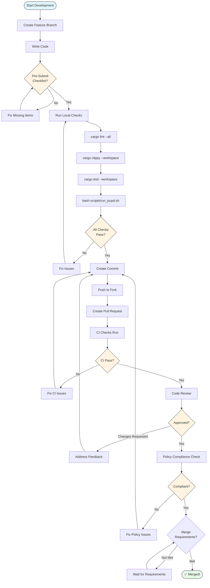

# Contributing to AdapterOS

Thank you for your interest in contributing to AdapterOS! This document provides guidelines and information for contributors.

## Table of Contents

- [Code of Conduct](#code-of-conduct)
- [Getting Started](#getting-started)
- [Development Setup](#development-setup)
- [Contributing Guidelines](#contributing-guidelines)
- [Pull Request Process](#pull-request-process)
- [Issue Reporting](#issue-reporting)
- [Alpha Release Status](#alpha-release-status)

## Code of Conduct

This project adheres to a code of conduct. By participating, you are expected to uphold this code. Please report unacceptable behavior to vats-springs0m@icloud.com.

## Getting Started

### Prerequisites

- **macOS 13.0+** with Apple Silicon (M1/M2/M3/M4)
- **Rust stable** (see `rust-toolchain.toml`): `curl --proto '=https' --tlsv1.2 -sSf https://sh.rustup.rs | sh`
- **Git**: For version control
- **GitHub CLI**: For repository operations (`gh`)

### Fork and Clone

1. Fork the repository on GitHub
2. Clone your fork locally:
   ```bash
   git clone https://github.com/YOUR_USERNAME/adapter-os.git
   cd adapter-os
   ```
3. Add upstream remote:
   ```bash
   git remote add upstream https://github.com/rogu3bear/adapter-os.git
   ```

### Security Considerations

AdapterOS uses a comprehensive keychain integration for secure cryptographic operations. When contributing to security-critical code:

- **Never store secrets in code**: All sensitive data must use the keychain provider
- **Test with secure backends**: Use platform keychains or password fallbacks, never in-memory storage
- **Validate input handling**: Command injection prevention is required for CLI operations
- **Follow Secrets Ruleset #14**: No plaintext secrets, hardware-backed keys when available
- **Error handling**: Never leak sensitive information in error messages

For keychain testing, use environment variables like `ADAPTEROS_KEYCHAIN_FALLBACK=pass:testpassword` to enable secure testing modes.

## Development Setup

### Build the Project

```bash
# Build all crates
cargo build --release

# Build specific crate
cargo build -p adapteros-lora-worker

# Run tests
cargo test --workspace

# Format code
cargo fmt --all

# Run clippy
cargo clippy --workspace -- -D warnings
```

### Development Dependencies

```bash
# Install useful development tools
cargo install cargo-watch cargo-nextest cargo-udeps

# Run tests in watch mode
cargo watch -x test

# Run benchmarks
cargo bench
```

### Database Setup

```bash
# Run migrations
./aosctl db migrate

# Initialize the database
./aosctl init-tenant --id default --uid 1000 --gid 1000
```

### Port Configuration (Multi-Developer)

When multiple developers work on the codebase simultaneously, use **port offsets** to avoid conflicts. Each developer picks a unique offset (100, 200, 300, etc.) and configures their `.env.local`:

```bash
# Developer A: default (no offset)
AOS_SERVER_PORT=8080
AOS_UI_PORT=3200
AOS_PANEL_PORT=3301

# Developer B: +100 offset
AOS_SERVER_PORT=8180
AOS_UI_PORT=3300
AOS_PANEL_PORT=3401

# Developer C: +200 offset
AOS_SERVER_PORT=8280
AOS_UI_PORT=3400
AOS_PANEL_PORT=3501
```

**Convention**: Pick your offset and stick with it. Document your offset in team channels to avoid collisions.

**Environment Variables** (all respect these):
| Variable | Default | Description |
|----------|---------|-------------|
| `AOS_SERVER_PORT` | 8080 | Backend API server |
| `AOS_UI_PORT` | 3200 | Leptos UI dev server (trunk) |
| `AOS_PANEL_PORT` | 3301 | Service panel API |


## Contributing Guidelines

### Alpha Release Considerations

**Important**: AdapterOS is currently in alpha-v0.11-unstable-pre-release. This means:

- **Breaking Changes**: May occur without notice
- **API Stability**: Not guaranteed
- **Documentation**: May be incomplete
- **Testing**: Some features may have limited test coverage

### Areas for Contribution

#### High Priority (Alpha Phase)
- **Bug Fixes**: Critical issues and compilation errors
- **Documentation**: API reference, examples, and guides
- **Testing**: Unit tests, integration tests, and edge cases
- **Performance**: Profiling and optimization opportunities

#### Medium Priority
- **Features**: New policy packs, CLI commands, or utilities
- **Refactoring**: Code organization and cleanup
- **Tooling**: Development and build improvements
- **Examples**: Usage examples and tutorials

#### Low Priority (Future Phases)
- **New Backends**: Alternative compute backends
- **Advanced Features**: Enterprise and production features
- **UI/UX**: Web interface improvements
- **Integration**: Third-party service integrations

### Code Standards

#### Rust Code Style
- Follow Rust naming conventions
- Use `cargo fmt` for formatting
- Use `cargo clippy` for linting
- Prefer `Result<T>` over `Option<T>` for error handling
- Use `tracing` for logging (not `println!`)

#### Documentation
- Document all public APIs
- Include examples for complex functions
- Update README.md for user-facing changes
- Add tests for new functionality

#### Policy Compliance
- All changes must comply with the 28 canonical policy packs
- Security-sensitive code requires review
- Performance changes need benchmarks
- Breaking changes need migration guides

### Commit Guidelines

#### Commit Message Format
```
type(scope): brief description

Detailed description of changes, including:
- What was changed
- Why it was changed
- Any breaking changes or migration notes

Fixes #123
```

#### Types
- `feat`: New features
- `fix`: Bug fixes
- `docs`: Documentation changes
- `style`: Code style changes
- `refactor`: Code refactoring
- `test`: Test additions or changes
- `chore`: Build or tooling changes

#### Examples
```
feat(policy): add new compliance policy pack

Adds PolicyPack::Compliance with controls for:
- Data retention policies
- Audit trail requirements
- Regulatory compliance checks

Closes #456
```

```
fix(router): resolve Q15 quantization overflow

Fixes integer overflow in Q15 gate quantization that
could cause router to select wrong adapters.

The fix clamps values to valid Q15 range [-32768, 32767]
and adds overflow detection.

Fixes #789
```

### Developing Plugins

- Implement `Plugin` trait from adapteros-core.
- Use PluginConfig for configuration.
- Handle tenant isolation in your plugin logic.
- Test with chaos scenarios for isolation.
Test plugin isolation with chaos scenarios: Run `cargo test --test chaos_plugin` to verify tenant isolation and fallback behavior.

```rust
// Example chaos test structure
#[tokio::test]
async fn test_plugin_isolation_git_failure() {
    // Spawn server, enable Git, simulate failure, verify inference works
}
```

## Pull Request Process

<details>
<summary>📊 Pull Request Workflow</summary>



**Merge Requirements:**
- ✅ All CI checks pass
- ✅ At least one maintainer approval
- ✅ No unresolved conversations
- ✅ Up-to-date with main branch
- ✅ Changelog entry added

</details>

### Before Submitting

1. **Update Documentation**: Ensure all changes are documented
2. **Add Tests**: Include tests for new functionality
3. **Run Checks**: Pass all CI checks locally
4. **Update Changelog**: Add entry to CHANGELOG.md
5. **Check Policies**: Ensure compliance with policy packs

### Pull Request Template

```markdown
## Description
Brief description of changes

## Type of Change
- [ ] Bug fix (non-breaking change which fixes an issue)
- [ ] New feature (non-breaking change which adds functionality)
- [ ] Breaking change (fix or feature that would cause existing functionality to not work as expected)
- [ ] Documentation update
- [ ] Performance improvement
- [ ] Code refactoring

## Testing
- [ ] Unit tests pass
- [ ] Integration tests pass
- [ ] Manual testing completed
- [ ] Performance benchmarks updated (if applicable)

## Policy Compliance
- [ ] Changes comply with all 28 canonical policy packs
- [ ] Security implications reviewed
- [ ] Performance impact assessed
- [ ] Breaking changes documented

## Checklist
- [ ] Code follows Rust style guidelines
- [ ] Self-review completed
- [ ] Documentation updated
- [ ] Changelog updated
- [ ] Tests added/updated
```

### Review Process

1. **Automated Checks**: CI runs tests, linting, and security checks
2. **Code Review**: At least one maintainer review required
3. **Policy Review**: Security and compliance review for sensitive changes
4. **Testing**: Manual testing for user-facing changes
5. **Approval**: Maintainer approval required for merge

### Merge Requirements

- All CI checks must pass
- At least one maintainer approval
- No unresolved conversations
- Up-to-date with main branch
- Changelog entry added

## Issue Reporting

### Bug Reports

Use the bug report template:

```markdown
## Bug Description
Clear description of the bug

## Steps to Reproduce
1. Step one
2. Step two
3. Step three

## Expected Behavior
What should happen

## Actual Behavior
What actually happens

## Environment
- OS: macOS 13.0+
- Hardware: Apple Silicon (M1/M2/M3/M4)
- Rust Version: 1.75+
- AdapterOS Version: alpha-v0.11-unstable-pre-release

## Additional Context
Any other relevant information
```

### Feature Requests

Use the feature request template:

```markdown
## Feature Description
Clear description of the requested feature

## Use Case
Why is this feature needed?

## Proposed Solution
How should this feature work?

## Alternatives Considered
What other approaches were considered?

## Additional Context
Any other relevant information
```

### Security Issues

For security vulnerabilities:

1. **DO NOT** create a public issue
2. Email security details to: vats-springs0m@icloud.com
3. Include: Description, impact, reproduction steps
4. We will respond within 48 hours

## Alpha Release Status

### Current Status: alpha-v0.11-unstable-pre-release

#### What's Working
- Core inference engine with policy enforcement
- K-sparse LoRA routing with Q15 gates
- Modular Metal kernels with deterministic compilation
- Configuration system with precedence rules
- Database schema with migrations
- CLI tool with basic commands
- Service supervisor for process management and health checks
- Menu bar app with status monitoring

#### Known Issues
- Server API has structural issues requiring refactoring
- Some integration tests are blocked by compilation errors
- Documentation is incomplete for some features
- Performance optimization opportunities exist

#### What's Coming
- Server API refactoring and stabilization
- Complete test suite with policy enforcement
- Full API reference and deployment guides
- Performance optimization and calibration tools
- UI enhancements for better user experience

### Development Priorities

#### Phase 1: Core Stability
1. Fix server API compilation issues
2. Complete integration test suite
3. Add missing documentation
4. Resolve known bugs

#### Phase 2: Enhancement
1. Performance optimization
2. Security hardening
3. Monitoring and observability
4. Deployment automation
5. Menu bar app integration improvements

#### Phase 3: Advanced Features
1. Enterprise features
2. Advanced policy customization
3. Multi-tenant improvements
4. Community contribution guidelines

## Getting Help

### Community Support
- **GitHub Discussions**: For questions and discussions
- **GitHub Issues**: For bug reports and feature requests
- **Email**: vats-springs0m@icloud.com for direct contact

### Development Help
- **Code Review**: Request reviews for complex changes
- **Pair Programming**: Available for significant contributions
- **Documentation**: Help with writing and editing
- **Testing**: Help with test development and execution

## Recognition

Contributors will be recognized in:
- **CHANGELOG.md**: For significant contributions
- **README.md**: For major features or fixes
- **Release Notes**: For each release
- **GitHub**: Contributor statistics and highlights

## License

By contributing to AdapterOS, you agree that your contributions will be licensed under the same terms as the project:
- Apache License, Version 2.0
- MIT License

You can choose either license for your contributions.

---

**Thank you for contributing to AdapterOS!**

*Last updated: January 2026*
