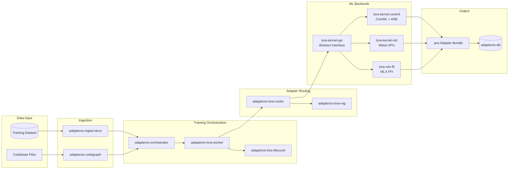
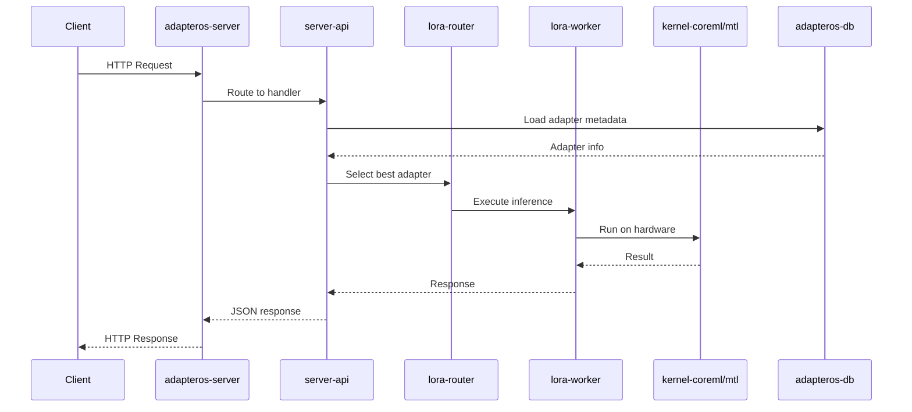
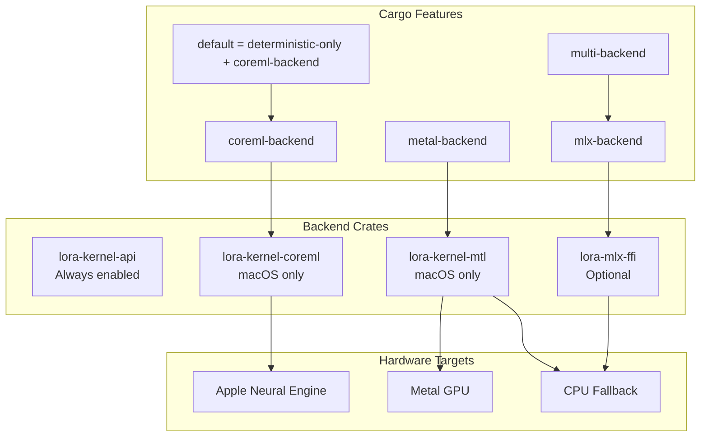
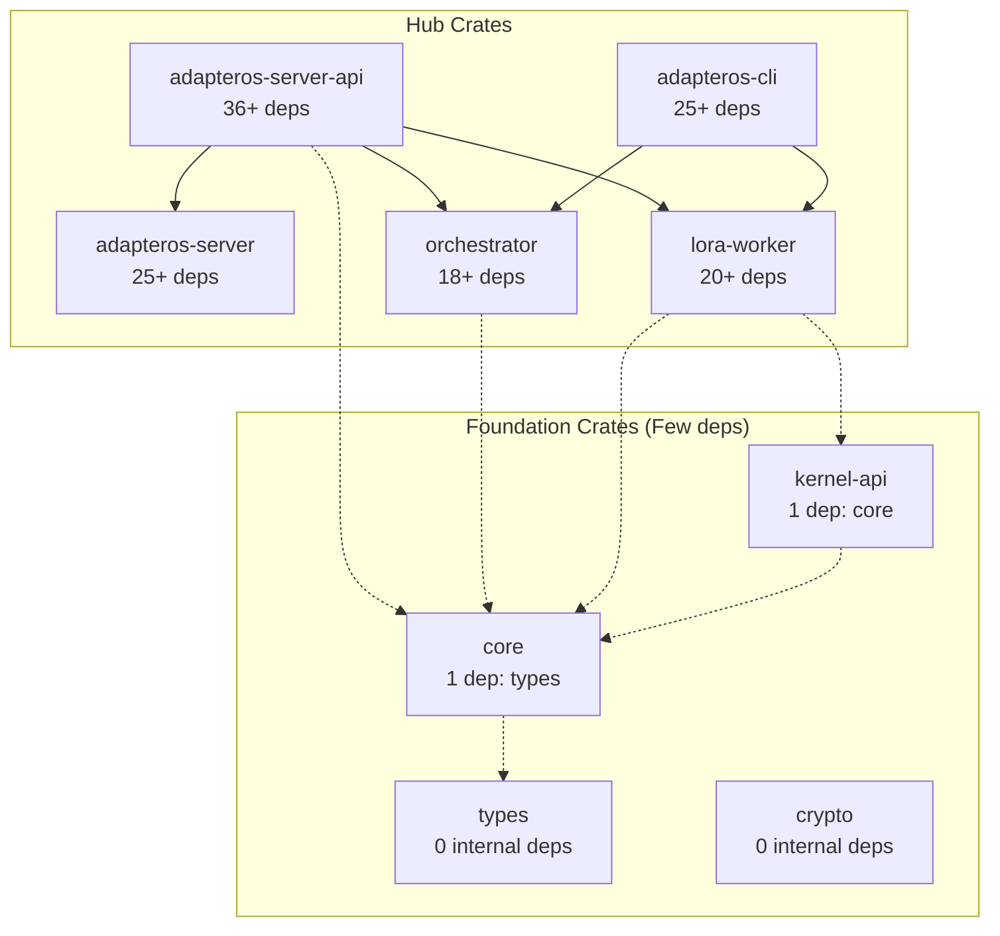
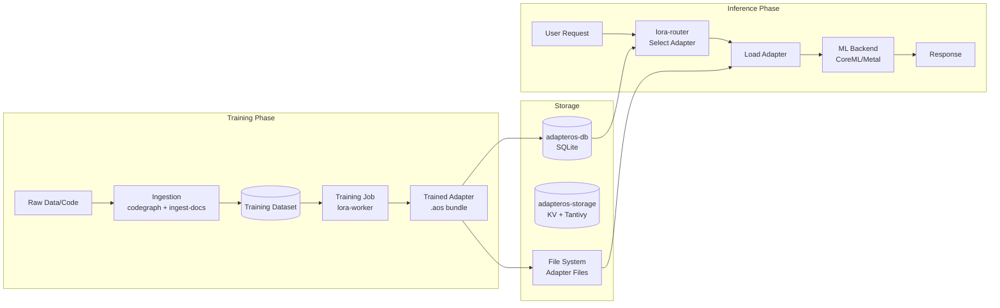

# AdapterOS Crate Architecture

## High-Level Architecture

```mermaid
flowchart TB
    subgraph Entry["Entry Points (Binaries)"]
        server[adapteros-server]
        cli[adapteros-cli<br/>aosctl]
        worker_bin[aos-worker]
    end

    subgraph API["API Layer"]
        server_api[adapteros-server-api]
    end

    subgraph Orchestration["Orchestration Layer"]
        orchestrator[adapteros-orchestrator]
        lora_worker[adapteros-lora-worker]
        lora_lifecycle[adapteros-lora-lifecycle]
    end

    subgraph Business["Business Logic"]
        codegraph[adapteros-codegraph]
        federation[adapteros-federation]
        manifest[adapteros-manifest]
        registry[adapteros-registry]
        model_hub[adapteros-model-hub]
        ingest_docs[adapteros-ingest-docs]
    end

    subgraph Policy["Policy & Config"]
        policy[adapteros-policy]
        config[adapteros-config]
        config_types[adapteros-config-types]
        det_exec[adapteros-deterministic-exec]
    end

    subgraph Core["Core Domain"]
        core[adapteros-core]
        types[adapteros-types]
        api_types[adapteros-api-types]
    end

    subgraph Data["Data Layer"]
        db[adapteros-db]
        storage[adapteros-storage]
        normalization[adapteros-normalization]
    end

    subgraph Infra["Infrastructure"]
        crypto[adapteros-crypto]
        telemetry[adapteros-telemetry]
        aos[adapteros-aos]
        platform[adapteros-platform]
        verify[adapteros-verify]
    end

    subgraph ML["ML Backends"]
        kernel_api[adapteros-lora-kernel-api]
        kernel_coreml[adapteros-lora-kernel-coreml]
        kernel_mtl[adapteros-lora-kernel-mtl]
        lora_router[adapteros-lora-router]
        lora_rag[adapteros-lora-rag]
        mlx_ffi[adapteros-lora-mlx-ffi]
    end

    %% Entry point dependencies
    server --> server_api
    server --> orchestrator
    server --> lora_worker
    cli --> orchestrator
    cli --> lora_worker
    worker_bin --> lora_worker

    %% API layer
    server_api --> orchestrator
    server_api --> lora_worker
    server_api --> db
    server_api --> core

    %% Orchestration
    orchestrator --> codegraph
    orchestrator --> lora_worker
    orchestrator --> db
    orchestrator --> storage
    lora_worker --> kernel_api
    lora_worker --> lora_router
    lora_worker --> lora_rag

    %% Business logic
    codegraph --> core
    federation --> core
    manifest --> core
    registry --> core
    model_hub --> core

    %% Policy
    policy --> core
    config --> config_types
    det_exec --> core

    %% Core layer
    api_types --> core
    api_types --> types
    core --> types

    %% Data layer
    db --> core
    db --> storage
    db --> normalization
    storage --> core
    storage --> crypto
    normalization --> core

    %% Infrastructure
    aos --> core
    platform --> core
    verify --> core
    telemetry --> core

    %% ML backends
    kernel_coreml --> kernel_api
    kernel_mtl --> kernel_api
    mlx_ffi --> kernel_api
    kernel_api --> core
    lora_router --> kernel_api
    lora_router --> core
    lora_rag --> core
```

## ML Training Pipeline

## Server Request Flow

## Dependency Layers

```mermaid
flowchart TB
    subgraph L1["Layer 1: Foundation (No internal deps)"]
        types[adapteros-types]
    end

    subgraph L2["Layer 2: Core Domain"]
        core[adapteros-core]
        crypto[adapteros-crypto]
        telemetry_types[adapteros-telemetry-types]
    end

    subgraph L3["Layer 3: Infrastructure"]
        telemetry[adapteros-telemetry]
        platform[adapteros-platform]
        aos[adapteros-aos]
        storage[adapteros-storage]
        kernel_api[lora-kernel-api]
    end

    subgraph L4["Layer 4: Data & ML"]
        db[adapteros-db]
        kernel_coreml[lora-kernel-coreml]
        kernel_mtl[lora-kernel-mtl]
        lora_router[lora-router]
        normalization[adapteros-normalization]
    end

    subgraph L5["Layer 5: Business Logic"]
        codegraph[adapteros-codegraph]
        manifest[adapteros-manifest]
        registry[adapteros-registry]
        policy[adapteros-policy]
        config[adapteros-config]
        lora_rag[lora-rag]
        lora_worker[lora-worker]
    end

    subgraph L6["Layer 6: Orchestration"]
        orchestrator[adapteros-orchestrator]
        lora_lifecycle[lora-lifecycle]
        federation[adapteros-federation]
    end

    subgraph L7["Layer 7: API"]
        server_api[adapteros-server-api]
        api_types[adapteros-api-types]
    end

    subgraph L8["Layer 8: Entry Points"]
        server[adapteros-server]
        cli[adapteros-cli]
        worker_bin[aos-worker]
    end

    L1 --> L2
    L2 --> L3
    L3 --> L4
    L4 --> L5
    L5 --> L6
    L6 --> L7
    L7 --> L8
```

## Feature-Gated Backends

## Hub Crates (Most Dependencies)

## Data Flow: Training to Inference

## Crate Categories

| Category | Crates | Purpose |
|----------|--------|---------|
| **Entry Points** | `server`, `cli`, `aos-worker` | Binary executables |
| **API** | `server-api`, `api-types` | HTTP handlers, types |
| **Core** | `core`, `types` | Domain models, validation |
| **Data** | `db`, `storage`, `normalization` | Persistence layer |
| **ML** | `lora-worker`, `lora-router`, `lora-rag` | Training orchestration |
| **Backends** | `kernel-api`, `kernel-coreml`, `kernel-mtl`, `mlx-ffi` | Hardware execution |
| **Infra** | `crypto`, `telemetry`, `platform`, `aos` | Cross-cutting concerns |
| **Business** | `orchestrator`, `codegraph`, `manifest`, `registry` | Domain logic |
| **Policy** | `policy`, `config`, `deterministic-exec` | Rules & configuration |
