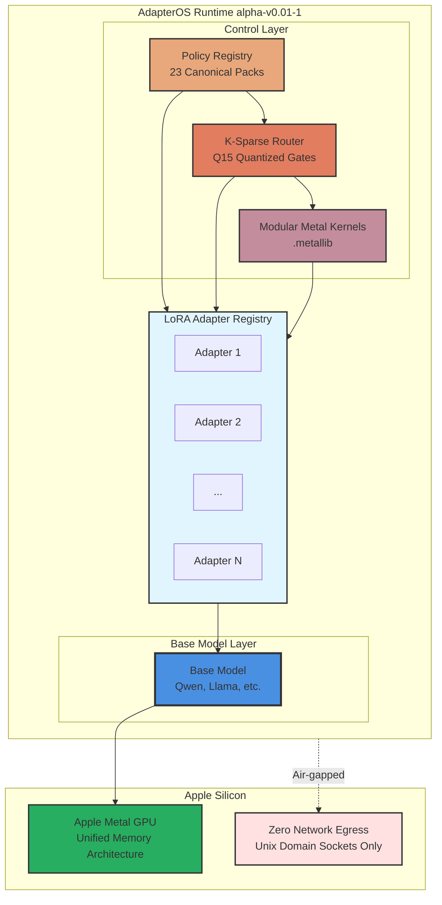

# AdapterOS: Deterministic ML Inference Runtime

**High-performance inference runtime with K-sparse LoRA routing, Metal-optimized kernels, and comprehensive policy enforcement for production environments.**

AdapterOS (v0.3-alpha) is a Rust-based ML inference engine optimized for Apple Silicon, featuring deterministic execution, modular Metal kernels, centralized policy enforcement, and memory-efficient adapter management with zero network egress during serving.

---

## [TARGET] What is AdapterOS?

AdapterOS enables **deterministic multi-adapter inference** on Apple Silicon by:

- **K-Sparse LoRA Routing**: Dynamic gating with Q15 quantized gates and entropy floor
- **Modular Metal Kernels**: Precompiled `.metallib` kernels with deterministic compilation
- **Policy Enforcement**: 23 canonical policy packs for compliance, security, and quality
- **Environment Fingerprinting**: Cryptographically signed drift detection with automatic baseline creation
- **Deterministic Execution**: Reproducible outputs with HKDF seeding and canonical JSON
- **Zero Network Egress**: Air-gapped serving with Unix domain sockets only
- **Memory Management**: Intelligent adapter eviction with ≥15% headroom maintenance

---

## Architecture

<details>
<summary>AdapterOS Architecture</summary>



**Key Components:**
- **Policy Registry**: 23 canonical policy packs (egress, determinism, router, evidence, etc.)
- **K-Sparse Router**: Top-K adapter selection with Q15 quantized gates
- **Modular Kernels**: Precompiled `.metallib` kernels for deterministic execution
- **Adapter Registry**: Content-addressed LoRA adapter storage
- **Zero Network**: Air-gapped serving via Unix domain sockets only

</details>

---

## Quick Start

### Option 1: Graphical Installer (Recommended)

**Native macOS installer with hardware validation and guided setup:**

```bash
# Build the installer
make installer

# Or open in Xcode
make installer-open
```

The graphical installer provides:
- **Hardware Pre-Checks**: Validates Apple Silicon (M1+), RAM (≥16GB), and disk space
- **Installation Modes**: Full (with model download) or Minimal (binaries only)
- **Air-Gapped Support**: Skip all network operations for offline installations
- **Checkpoint Recovery**: Resume interrupted installations automatically
- **Determinism Education**: Learn about cryptographic verification after install

See [installer/README.md](installer/README.md) for details.

### Option 2: Manual Installation

### Prerequisites

- **macOS 13.0+** with Apple Silicon (M1/M2/M3/M4)
- **Rust 1.75+**: `curl --proto '=https' --tlsv1.2 -sSf https://sh.rustup.rs | sh`
- **MLX**: `pip install mlx` (Python bindings for development)

### Build

```bash
# Clone the repository
git clone https://github.com/rogu3bear/adapter-os.git
cd adapter-os

# Build the workspace
cargo build --release

# Note: CoreML backend is the primary production backend (ANE acceleration)
# MLX backend is available for research/training
# Metal backend serves as fallback for legacy systems

# Initialize the database
./target/release/aosctl init-tenant --id default --uid 1000 --gid 1000

### Import a Model

```bash
# Download Qwen 2.5 7B (or use the included model)
./target/release/aosctl import-model \
  --name qwen2.5-7b \
  --weights models/qwen2.5-7b-mlx/weights.safetensors \
  --config models/qwen2.5-7b-mlx/config.json \
  --tokenizer models/qwen2.5-7b-mlx/tokenizer.json
```

### Register LoRA Adapters

```bash
# Register your LoRA adapters with semantic names
# Format: {tenant}/{domain}/{purpose}/{revision}
./target/release/aosctl register-adapter \
  --name "tenant-a/engineering/code-review/r001" \
  --hash <adapter-hash> \
  --tier persistent \
  --rank 16

# See docs/ADAPTER_TAXONOMY.md for naming conventions
```

### Start Serving

```bash
# Build and serve a plan
./target/release/aosctl build-plan --tenant-id default --manifest configs/cp.toml
./target/release/aosctl serve --plan-id <plan-id>

# Or use the integrated server
./target/release/mplora-server --config configs/cp.toml
```

---

## 📦 Components

### Core Crates

| Crate | Purpose |
|-------|---------|
| `adapteros-worker` | Inference engine with policy enforcement |
| `adapteros-router` | K-sparse LoRA routing with Q15 quantized gates |
| `adapteros-kernel-mtl` | Modular Metal kernels with deterministic compilation |
| `adapteros-plan` | Plan builder and loader |
| `adapteros-chat` | Chat template processor (ChatML, etc.) |
| `adapteros-rag` | Evidence retrieval with HNSW vector search |

### Management

| Crate | Purpose |
|-------|---------|
| `adapteros-server` | Control plane API server |
| `adapteros-server-api` | REST API handlers |
| `adapteros-cli` | Command-line tool (`aosctl`) |
| `adapteros-db` | SQLite database layer with migrations |

### Infrastructure

| Crate | Purpose |
|-------|---------|
| `adapteros-policy` | 23-pack policy registry with enforcement |
| `adapteros-telemetry` | Canonical JSON event logging with Merkle trees |
| `adapteros-crypto` | Ed25519 signing, BLAKE3 hashing, HKDF |
| `adapteros-artifacts` | Content-addressed artifact store with SBOM |
| `adapteros-config` | Deterministic configuration with precedence rules |

---

## 🎛️ Key Features

### 1. **K-Sparse LoRA Routing**

AdapterOS uses learned gates to select the top-K most relevant LoRA adapters per token:

```rust
// Router selects K=3 adapters with highest gate values
let selected = router.route(hidden_states, k=3);
// Gates are quantized to Q15 for efficiency
// Entropy floor prevents single-adapter collapse
// Deterministic tie-breaking: (score desc, doc_id asc)
```

### 2. **Modular Metal Kernels**

Precompiled kernels with deterministic compilation:

```metal
// Modular kernel with parameter structs
kernel void fused_attention_lora(
    constant AttentionParams& params,
    device float* Q,
    device float* K,
    device float* V,
    device float* lora_A,
    device float* lora_B
) {
    // Deterministic execution with fixed rounding
    // Precompiled to .metallib for reproducibility
}
```

### 3. **Policy Enforcement**

23 canonical policy packs ensure compliance:
- **Egress Ruleset**: Zero network during serving, PF enforcement
- **Determinism Ruleset**: Precompiled kernels, HKDF seeding
- **Router Ruleset**: K bounds, entropy floor, Q15 gates
- **Evidence Ruleset**: Mandatory open-book grounding
- **Refusal Ruleset**: Abstain on low confidence
- **Naming Ruleset**: Semantic adapter naming with lineage tracking
- **And 17 more** for security, compliance, and quality

### 4. **Deterministic Execution**

Reproducible inference with:
- Fixed random seeds (HKDF-derived)
- Quantized gates (Q15)
- Deterministic tie-breaking in retrieval
- Embedded `.metallib` kernels (no runtime compilation)
- Canonical JSON serialization (JCS)
- Configuration freeze with BLAKE3 hashing

---

## 🧪 Development

### Run Tests

```bash
cargo test --workspace
```

### Build Documentation

```bash
cargo doc --no-deps --open
```

### Format Code

```bash
cargo fmt --all
```

### Lint

```bash
cargo clippy --workspace -- -D warnings
```

### Duplication Monitoring

- Run a local scan: `make dup` (writes reports under `var/reports/jscpd/<timestamp>`)
- See `docs/DUPLICATION_MONITORING.md` for CI integration and enforcement options.

---

## Performance

Benchmarked on **M3 Max (128GB unified memory)** with alpha-v0.01-1:

| Configuration | Tokens/sec | Latency (p95) | Memory | Determinism |
|--------------|-----------|---------------|---------|-------------|
| Base model only | 45 tok/s | 22ms | 14GB | ✓ |
| K=3, 5 adapters | 42 tok/s | 24ms | 16GB | ✓ |
| K=5, 10 adapters | 38 tok/s | 28ms | 18GB | ✓ |

*Router overhead: ~8% at K=3, Policy enforcement: <1%*

---

## Configuration

Example `configs/cp.toml`:

```toml
[server]
port = 8080

[db]
path = "var/aos.db"

[security]
jwt_secret = "your-secret-key"
require_pf_deny = false

[paths]
plan_dir = "plan"
artifact_dir = "artifacts"

[router]
k_sparse = 3
entropy_floor = 0.02
gate_quant = "q15"

[memory]
min_headroom_pct = 15
evict_order = ["ephemeral_ttl", "cold_lru", "warm_lru"]
```

---

## 🛠️ Alpha Release Features

AdapterOS alpha-v0.01-1 includes:

### Completed Features
- ✅ **Naming Unification**: All crates renamed to `adapteros-*` with compatibility shims
- ✅ **Policy Registry**: 23 canonical policy packs with CLI commands
- ✅ **Adapter Taxonomy**: Semantic naming with lineage tracking and fork semantics
- ✅ **Metal Kernel Refactor**: Modular kernels with parameter structs
- ✅ **Deterministic Config**: Precedence rules with freeze mechanism
- ✅ **Database Schema**: Versioned migrations with rollback support

### In Progress
- 🔄 **Server API Refactor**: Structural improvements for production readiness
- 🔄 **Integration Tests**: End-to-end testing with policy enforcement
- 🔄 **Documentation**: Complete API reference and deployment guides

### Planned for v0.02
- 📋 **Performance Optimization**: Router calibration and kernel tuning
- 📋 **Security Hardening**: Advanced threat detection and response
- 📋 **Monitoring**: Comprehensive observability and alerting

---

## 📚 Documentation

### Quick Links
- **[Quick Start Guide](docs/QUICKSTART.md)** - Get running in 10 minutes
- **[Documentation Index](docs/README.md)** - Complete documentation navigation
- **[System Architecture](docs/architecture.md)** - High-level design and components
- **[Policy Registry](docs/POLICIES.md)** - 23 canonical policy packs
- **[Adapter Taxonomy](docs/ADAPTER_TAXONOMY.md)** - Semantic naming and lineage tracking

### Key Topics
- **Control Plane**: [docs/control-plane.md](docs/control-plane.md)
- **Configuration**: [docs/CONFIG_PRECEDENCE.md](docs/CONFIG_PRECEDENCE.md)
- **Metal Kernels**: [docs/metal/phase4-metal-kernels.md](docs/metal/phase4-metal-kernels.md)
- **Safety Features**: [docs/runaway-prevention.md](docs/runaway-prevention.md)
- **Database Schema**: [docs/database-schema/](docs/database-schema/)

### API Reference
- **Rust API**: Run `cargo doc --open`
- **REST API**: See [docs/control-plane.md](docs/control-plane.md) - includes hot-swap endpoints like `POST /v1/adapter-stacks/{id}/activate` for zero-downtime stack swaps
- **CLI Commands**: See [crates/adapteros-cli/docs/aosctl_manual.md](crates/adapteros-cli/docs/aosctl_manual.md)

---

## 🤝 Contributing

Contributions welcome! Please see `CONTRIBUTING.md` for guidelines.

### Development Setup

```bash
# Install development dependencies
cargo install cargo-watch cargo-nextest

# Run tests in watch mode
cargo watch -x test

# Run benchmarks
cargo bench
```

---

## 📄 License

Dual-licensed under Apache 2.0 or MIT at your option.

- Apache License, Version 2.0 ([LICENSE-APACHE](LICENSE-APACHE))
- MIT License ([LICENSE-MIT](LICENSE-MIT))

---

## 🙏 Acknowledgments

- **Apple Metal Team** for the excellent GPU compute framework
- **Rust Community** for amazing tooling and ecosystem
- **LoRA Authors** for the efficient fine-tuning technique
- **BLAKE3 Team** for fast cryptographic hashing
- **Ed25519 Implementers** for secure digital signatures

---

## 📞 Contact

- **GitHub**: [@rogu3bear](https://github.com/rogu3bear)
- **Email**: vats-springs0m@icloud.com

---

**AdapterOS alpha-v0.01-1 - Built with ❤️ for Apple Silicon**

*Deterministic ML inference with policy enforcement and zero network egress*

## Plugins

AdapterOS supports pluggable extensions via the PluginRegistry.

### Registering Custom Plugins

1. Implement the `Plugin` trait in your crate.
2. Register in main.rs with `registry.register(name, plugin_instance, config).await?`
3. Use API to enable/disable per tenant: POST /v1/plugins/:name/enable {tenant_id}

### API Examples

To enable the Git plugin for the default tenant:

```bash
curl -X POST http://localhost:8080/v1/plugins/git/enable \
  -H "Authorization: Bearer $JWT" \
  -H "Content-Type: application/json" \
  -d '{"tenant_id": "default"}'
```

To disable the Git plugin for a specific tenant:

```bash
curl -X POST http://localhost:8080/v1/plugins/git/disable \
  -H "Authorization: Bearer $JWT" \
  -H "Content-Type: application/json" \
  -d '{"tenant_id": "default"}'
```

To check plugin status for all tenants:

```bash
curl -X GET http://localhost:8080/v1/plugins/health \
  -H "Authorization: Bearer $JWT"
```

---

## See Also

- [QUICKSTART.md](QUICKSTART.md) - Quick start guide for macOS
- [docs/ARCHITECTURE_INDEX.md](docs/ARCHITECTURE_INDEX.md) - Full architecture documentation
- [docs/ARCHITECTURE_PATTERNS.md](docs/ARCHITECTURE_PATTERNS.md) - Detailed architectural patterns
- [CLAUDE.md](CLAUDE.md) - Developer quick reference guide
- [docs/MLX_INTEGRATION.md](docs/MLX_INTEGRATION.md) - MLX backend integration
- [docs/COREML_INTEGRATION.md](docs/COREML_INTEGRATION.md) - CoreML backend with ANE acceleration