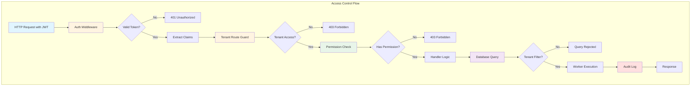
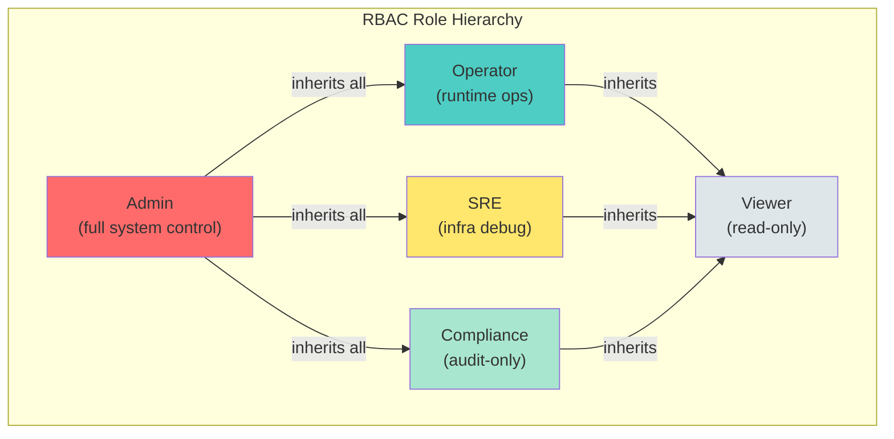
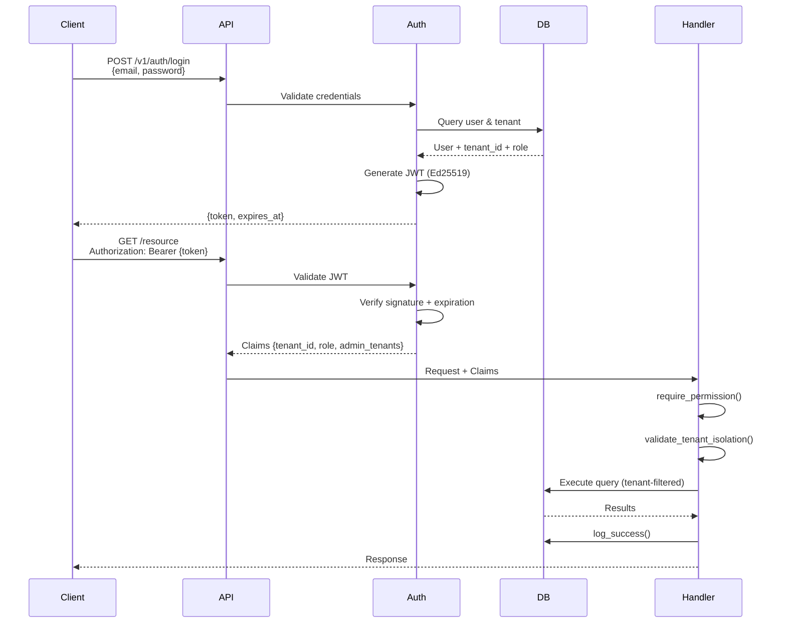

# Access Control Guide

**Purpose:** Comprehensive reference for access control implementation in AdapterOS
**Last Updated:** 2025-12-11
**Maintained by:** James KC Auchterlonie

---

## Table of Contents

1. [Overview](#overview)
2. [Access Control Architecture](#access-control-architecture)
3. [Role-Based Access Control (RBAC)](#role-based-access-control-rbac)
4. [Tenant Isolation](#tenant-isolation)
5. [Permission Model](#permission-model)
6. [Implementation Patterns](#implementation-patterns)
7. [Testing Strategies](#testing-strategies)
8. [Best Practices](#best-practices)
9. [Troubleshooting](#troubleshooting)
10. [References](#references)

---

## Overview

AdapterOS implements a defense-in-depth access control system combining:

- **RBAC (Role-Based Access Control):** 5 roles with 56 granular permissions
- **Tenant Isolation:** Multi-tenant boundary enforcement at database, API, and worker levels
- **JWT Authentication:** Ed25519 signed tokens with 8-hour TTL
- **Audit Logging:** Comprehensive logging of all security-sensitive operations

### Key Principles

1. **Least Privilege:** Users receive minimum permissions required for their role
2. **Tenant Boundaries:** Strict isolation prevents cross-tenant data leakage
3. **Defense in Depth:** Multiple enforcement layers (JWT, middleware, database, worker)
4. **Audit Trail:** All access control decisions are logged for compliance

---

## Access Control Architecture

### Multi-Layer Enforcement



### Enforcement Points

| Layer | Component | What It Enforces |
|-------|-----------|------------------|
| **Authentication** | JWT Validation | Token validity, signature, expiration |
| **Authorization** | Permission Check | Role-based operation access |
| **Tenant Routing** | Route Guard Middleware | URL path tenant access |
| **Handler** | validate_tenant_isolation() | Resource-level tenant boundaries |
| **Database** | SQL Filters + Triggers | Data-level tenant isolation |
| **Worker** | Tenant Context | Process-level resource access |

---

## Role-Based Access Control (RBAC)

### Core Roles

AdapterOS implements a 5-role RBAC system with 56 granular permissions.

| Role | Purpose | Use Case | Permission Count |
|------|---------|----------|------------------|
| **Admin** | Full system control | Account owners, system operators | 56 (all) |
| **Operator** | Runtime operations | Adapter management, training, inference | 38 |
| **SRE** | Infrastructure & debugging | Operations, troubleshooting, monitoring | 28 |
| **Compliance** | Policy & audit oversight | Regulatory, compliance officers | 18 |
| **Viewer** | Read-only access | Stakeholders, observers | 12 |

### Role Hierarchy



**Inheritance Notes:**
- Admin has all permissions from all roles
- Operator, SRE, and Compliance inherit from Viewer (read-only base)
- No lateral inheritance between Operator, SRE, and Compliance

### Permission Categories (56 Total)

**Adapter (6 permissions)**
- AdapterList, AdapterView, AdapterRegister, AdapterLoad, AdapterUnload, AdapterDelete

**Training (4 permissions)**
- TrainingView, TrainingViewLogs, TrainingStart, TrainingCancel

**Tenant (2 permissions)**
- TenantView, TenantManage

**Policy (4 permissions)**
- PolicyView, PolicyValidate, PolicyApply, PolicySign

**Inference (1 permission)**
- InferenceExecute

**Monitoring & Metrics (2 permissions)**
- MetricsView, MonitoringManage

**Node & Worker (5 permissions)**
- NodeView, NodeManage, WorkerView, WorkerSpawn, WorkerManage

**Code & Git (4 permissions)**
- GitView, GitManage, CodeView, CodeScan

**Audit & Compliance (1 permission)**
- AuditView

**Adapter Stack (2 permissions)**
- AdapterStackView, AdapterStackManage

**Advanced Operations (6 permissions)**
- ReplayManage, FederationView, FederationManage, PlanView, PlanManage, PromotionManage

**Telemetry & Contacts (4 permissions)**
- TelemetryView, TelemetryManage, ContactView, ContactManage

**Dataset (5 permissions)**
- DatasetList, DatasetView, DatasetUpload, DatasetValidate, DatasetDelete

**Workspace (4 permissions)**
- WorkspaceView, WorkspaceManage, WorkspaceMemberManage, WorkspaceResourceManage

**Notification (2 permissions)**
- NotificationView, NotificationManage

**Dashboard (2 permissions)**
- DashboardView, DashboardManage

**Activity (2 permissions)**
- ActivityView, ActivityCreate

### Role Specifications

#### Admin (Full Access)
**All 56 permissions**, including:
- Policy application and signing
- Tenant management and creation
- Node registration and deletion
- User role assignment
- Audit log access
- Cross-tenant administration (with explicit grants)

#### Operator (Runtime Operations)
**38 permissions**, including:
- Adapter registration, loading, unloading (not deletion)
- Training initiation and cancellation
- Inference execution
- Worker spawning and management
- Adapter stack management
- Git integration and code scanning
- Dataset upload and validation

**Restrictions:** Cannot delete, manage tenants, apply policies, manage nodes

#### SRE (Infrastructure & Debugging)
**28 permissions**, including:
- View metrics, logs, and telemetry
- Load/unload adapters for troubleshooting
- Test inference
- Manage monitoring rules and alerts
- Replay session creation and verification
- Audit log access

**Restrictions:** Cannot register new adapters, cannot spawn/manage workers

#### Compliance (Policy & Audit)
**18 permissions**, including:
- Policy viewing and validation
- Audit log access (primary use case)
- Metrics and telemetry viewing
- Replay session verification
- Dataset validation
- Read-only access to most resources

**Restrictions:** No write operations, no inference execution

#### Viewer (Read-Only)
**12 permissions**, including:
- List and view adapters
- View training information
- View metrics and telemetry
- View policy definitions
- Access dashboards and reports

**Restrictions:** No write operations whatsoever

---

## Tenant Isolation

### Architecture Overview

Tenant isolation ensures strict boundaries between tenants to prevent cross-tenant data leakage and unauthorized access.

**Enforcement Layers:**

1. **JWT Claims:** Every token includes `tenant_id`
2. **Middleware Validation:** Checks `tenant_id` matches resource
3. **Database Queries:** All queries scoped to `tenant_id`
4. **Worker Process Isolation:** Tenant-specific resource access

### Tenant Isolation Flow

```
HTTP Request with JWT
    ↓
[Auth Middleware] ← Extracts Claims (tenant_id, role, admin_tenants)
    ↓
[Tenant Route Guard] ← Validates tenant access for /tenants/{id} routes
    ↓
[Handler] ← Business logic with tenant isolation checks
    ↓
[Database] ← All queries include tenant_id filter
    ↓
[Worker] ← Tenant-specific resource access
```

### Core Tenant Access Logic

**File:** `crates/adapteros-server-api/src/security/mod.rs`

```rust
/// Core tenant access check logic (shared by all validation functions)
///
/// This is the single source of truth for tenant isolation logic.
/// Returns `true` if access is allowed, `false` otherwise.
fn check_tenant_access_core(claims: &Claims, resource_tenant_id: &str) -> bool {
    // Same tenant - always allowed
    if claims.tenant_id == resource_tenant_id {
        return true;
    }

    // Dev mode bypass: Allow admin role in dev mode to access any tenant
    // SECURITY: This only works in debug builds, release builds ignore AOS_DEV_NO_AUTH
    if dev_no_auth_enabled() && claims.role == "admin" {
        return true;
    }

    // Admin with explicit access
    if claims.role == "admin" {
        // Wildcard "*" grants access to ALL tenants (used by dev_no_auth_claims)
        // SECURITY: Tokens with wildcard can only be generated in debug builds
        // via dev_no_auth_claims() or dev_bootstrap_handler()
        if claims.admin_tenants.contains(&"*".to_string()) {
            return true;
        }
        // Specific tenant grant
        if claims
            .admin_tenants
            .contains(&resource_tenant_id.to_string())
        {
            return true;
        }
    }

    false
}
```

### Tenant Isolation Validation

```rust
/// Validate that the tenant_id in JWT claims matches the requested resource
///
/// This enforces tenant isolation at the request level.
///
/// **Security Fix (2025-11-27):**
/// - Removed blanket admin bypass vulnerability
/// - Admins can only access tenants listed in their `admin_tenants` claim
/// - Empty `admin_tenants` = can only access their own tenant
/// - All cross-tenant access attempts are logged for audit
///
/// **Dev Mode (2025-12-02):**
/// - In debug builds with `AOS_DEV_NO_AUTH=1`, admin role can access any tenant
/// - This bypass is compile-time restricted to debug builds only
/// - Release builds ignore `AOS_DEV_NO_AUTH` completely for security
pub fn validate_tenant_isolation(
    claims: &Claims,
    resource_tenant_id: &str,
) -> std::result::Result<(), (StatusCode, Json<ErrorResponse>)> {
    // Use shared core logic for consistency
    if check_tenant_access_core(claims, resource_tenant_id) {
        // Log successful cross-tenant access
        if claims.tenant_id != resource_tenant_id {
            if dev_no_auth_enabled() && claims.role == "admin" {
                info!(
                    user_id = %claims.sub,
                    user_role = %claims.role,
                    user_tenant = %claims.tenant_id,
                    resource_tenant = %resource_tenant_id,
                    "Dev mode: Admin cross-tenant access granted"
                );
            } else {
                info!(
                    user_id = %claims.sub,
                    user_role = %claims.role,
                    user_tenant = %claims.tenant_id,
                    resource_tenant = %resource_tenant_id,
                    admin_tenants = ?claims.admin_tenants,
                    "Cross-tenant access granted via admin_tenants"
                );
            }
        }
        return Ok(());
    }

    // Access denied - log the violation attempt
    warn!(
        user_id = %claims.sub,
        user_role = %claims.role,
        user_tenant = %claims.tenant_id,
        resource_tenant = %resource_tenant_id,
        admin_tenants = ?claims.admin_tenants,
        "Tenant isolation violation: access denied"
    );

    Err((
        StatusCode::FORBIDDEN,
        Json(
            ErrorResponse::new("tenant isolation violation")
                .with_code("TENANT_ISOLATION_ERROR")
                .with_string_details(format!(
                    "user tenant '{}' cannot access resource in tenant '{}'. User role: {}, Admin tenants: {:?}",
                    claims.tenant_id, resource_tenant_id, claims.role, claims.admin_tenants
                )),
        ),
    ))
}
```

### Tenant Route Guard Middleware

**File:** `crates/adapteros-server-api/src/middleware/mod.rs`

```rust
/// Enforce tenant isolation for any route containing `/tenants/{tenant_id}` in the path.
///
/// This middleware extracts the tenant_id from the URL path and validates that the
/// requesting user has access to that tenant.
pub async fn tenant_route_guard_middleware(
    req: Request<Body>,
    next: Next,
) -> Result<Response, (StatusCode, Json<ErrorResponse>)> {
    let path = req.uri().path();

    // Extract tenant_id from path (e.g., /v1/tenants/tenant-a/resource)
    let path_tenant = if let Some(captures) = TENANT_PATH_REGEX.captures(path) {
        captures.get(1).map(|m| m.as_str().to_string())
    } else {
        None
    };

    if let Some(path_tenant) = path_tenant {
        // Get claims from request extensions (set by auth_middleware)
        let claims = req.extensions().get::<Claims>().ok_or_else(|| {
            let detail = format!("Missing claims for tenant route: {}", path);
            tenant_isolation_error(detail)
        })?;

        if let Err((_, Json(err_body))) = validate_tenant_isolation(&claims, &path_tenant) {
            tracing::warn!(
                user_id = %claims.sub,
                user_tenant = %claims.tenant_id,
                path_tenant = %path_tenant,
                "Tenant route guard blocked access"
            );

            let detail = format!(
                "user tenant '{}' cannot access tenant '{}' in path '{}'",
                claims.tenant_id, path_tenant, path
            );
            return Err(tenant_isolation_error(detail));
        }
    }

    Ok(next.run(req).await)
}
```

### Database-Level Isolation

#### SQLite Constraints and Triggers

**File:** `migrations/0131_tenant_isolation_triggers.sql`

```sql
-- Composite foreign keys enforce tenant isolation
CREATE TABLE adapters (
    id TEXT PRIMARY KEY,
    tenant_id TEXT NOT NULL,
    name TEXT NOT NULL,
    -- other fields
    FOREIGN KEY (tenant_id) REFERENCES tenants(id) ON DELETE CASCADE
);

-- Trigger to prevent cross-tenant references
CREATE TRIGGER enforce_tenant_isolation_adapters
BEFORE INSERT ON adapters
FOR EACH ROW
BEGIN
    SELECT CASE
        WHEN NEW.tenant_id IS NULL THEN
            RAISE(ABORT, 'tenant_id cannot be null')
        WHEN (SELECT COUNT(*) FROM tenants WHERE id = NEW.tenant_id) = 0 THEN
            RAISE(ABORT, 'tenant does not exist')
    END;
END;

-- Similar triggers for other tenant-scoped tables
CREATE TRIGGER enforce_tenant_isolation_datasets
BEFORE INSERT ON datasets
FOR EACH ROW
BEGIN
    SELECT CASE
        WHEN NEW.tenant_id IS NULL THEN
            RAISE(ABORT, 'tenant_id cannot be null')
        WHEN (SELECT COUNT(*) FROM tenants WHERE id = NEW.tenant_id) = 0 THEN
            RAISE(ABORT, 'tenant does not exist')
    END;
END;
```

#### Database Query Patterns

All database queries must include tenant_id filters:

```rust
// ✅ Correct: Query with tenant filter
let adapters = sqlx::query_as::<_, Adapter>(
    "SELECT * FROM adapters WHERE tenant_id = ?"
)
.bind(&claims.tenant_id)
.fetch_all(&db.pool())
.await?;

// ❌ Incorrect: Query without tenant filter (security vulnerability)
let adapters = sqlx::query_as::<_, Adapter>(
    "SELECT * FROM adapters"  // Missing tenant_id filter
)
.fetch_all(&db.pool())
.await?;
```

### Worker-Level Isolation

```rust
// Worker receives tenant context in request
pub struct WorkerRequest {
    pub tenant_id: String,
    pub request_id: String,
    pub operation: String,
    // other fields
}

// Worker validates tenant access before processing
impl Worker {
    pub async fn process_request(&self, req: WorkerRequest) -> WorkerResult {
        // Validate tenant isolation at worker level
        self.validate_tenant_access(&req.tenant_id)?;

        // Process request in tenant context
        self.execute_in_tenant_context(req).await
    }

    fn validate_tenant_access(&self, tenant_id: &str) -> Result<()> {
        // Workers have their own tenant access control
        if !self.allowed_tenants.contains(tenant_id) {
            return Err(WorkerError::TenantAccessDenied {
                worker_id: self.id.clone(),
                tenant_id: tenant_id.to_string(),
            });
        }
        Ok(())
    }
}
```

---

## Permission Model

### Permission Check Implementation

**File:** `crates/adapteros-server-api/src/permissions.rs`

```rust
use adapteros_server_api::permissions::{require_permission, Permission};
use adapteros_server_api::audit_helper;

pub async fn register_adapter_handler(
    claims: Claims,
    db: &Db,
    payload: Json<RegisterRequest>,
) -> Result<Json<RegisterResponse>> {
    // Enforce permission check
    require_permission(&claims, Permission::AdapterRegister)?;

    // Perform operation
    let adapter_id = "adapter-xyz";

    // Log success
    audit_helper::log_success(
        db,
        &claims,
        "adapter.register",
        "adapter",
        Some(&adapter_id),
    ).await?;

    Ok(Json(RegisterResponse { id: adapter_id }))
}
```

### Audit Logging

```rust
use adapteros_server_api::audit_helper::{log_success, log_failure};

// After successful operation
log_success(
    &db,
    &claims,
    "adapter.delete",
    "adapter",
    Some(&adapter_id),
).await?;

// After failed operation
log_failure(
    &db,
    &claims,
    "adapter.delete",
    "adapter",
    Some(&adapter_id),
    &error_message,
).await?;
```

### Querying Audit Logs

```
GET /v1/audit/logs?action=adapter.register&status=success&limit=50
```

**Response includes:** user_id, role, tenant_id, action, resource_type, resource_id, status, timestamp

### Authentication Flow



---

## Implementation Patterns

### Handler Integration Patterns

#### Pattern 1: Direct Validation

```rust
pub async fn get_adapter(
    Extension(claims): Extension<Claims>,
    Path(adapter_id): Path<String>,
    State(state): State<AppState>,
) -> Result<Json<Adapter>, (StatusCode, Json<ErrorResponse>)> {
    // Check permission
    require_permission(&claims, Permission::AdapterView)?;

    // Fetch adapter from database
    let adapter = state.db.get_adapter(&adapter_id).await?;

    // Enforce tenant isolation
    validate_tenant_isolation(&claims, &adapter.tenant_id)?;

    // Proceed with operation
    Ok(Json(adapter))
}
```

#### Pattern 2: Filtered Listing

```rust
pub async fn list_adapters(
    Extension(claims): Extension<Claims>,
    State(state): State<AppState>,
) -> Result<Json<Vec<Adapter>>, (StatusCode, Json<ErrorResponse>)> {
    // Check permission
    require_permission(&claims, Permission::AdapterList)?;

    // List only adapters belonging to user's tenant
    let adapters = if claims.role == "admin" && !claims.admin_tenants.is_empty() {
        // Admin with explicit tenant access can see multiple tenants
        state.db.list_adapters_by_tenants(&claims.admin_tenants).await?
    } else {
        // Regular users and admins without explicit access see only their tenant
        state.db.list_adapters_by_tenant(&claims.tenant_id).await?
    };

    Ok(Json(adapters))
}
```

#### Pattern 3: Tenant-Specific Operations

```rust
pub async fn create_adapter(
    Extension(claims): Extension<Claims>,
    Json(req): Json<CreateAdapterRequest>,
    State(state): State<AppState>,
) -> Result<Json<Adapter>, (StatusCode, Json<ErrorResponse>)> {
    // Check permission
    require_permission(&claims, Permission::AdapterRegister)?;

    // Validate that request tenant matches user's tenant (or admin has access)
    if let Some(requested_tenant) = &req.tenant_id {
        validate_tenant_isolation(&claims, requested_tenant)?;
    }

    // Create adapter in user's tenant
    let adapter = state.db.create_adapter(&req.name, &claims.tenant_id).await?;

    // Audit log
    audit_helper::log_success(
        &state.db,
        &claims,
        "adapter.create",
        "adapter",
        Some(&adapter.id),
    ).await?;

    Ok(Json(adapter))
}
```

#### Pattern 4: Admin Multi-Tenant Operations

```rust
pub async fn admin_operation(
    Extension(claims): Extension<Claims>,
    Path(tenant_id): Path<String>,
    State(state): State<AppState>,
) -> Result<Json<Response>, (StatusCode, Json<ErrorResponse>)> {
    // Check permission (admin-only)
    require_permission(&claims, Permission::TenantManage)?;

    // Validate tenant access
    validate_tenant_isolation(&claims, &tenant_id)?;

    // Perform operation
    let result = state.db.manage_tenant(&tenant_id).await?;

    // Audit log cross-tenant admin action
    audit_helper::log_success(
        &state.db,
        &claims,
        "tenant.manage",
        "tenant",
        Some(&tenant_id),
    ).await?;

    Ok(Json(result))
}
```

---

## Testing Strategies

### Unit Tests

#### Permission Tests

```rust
#[test]
fn test_admin_has_all_permissions() {
    let admin_claims = make_test_claims("admin", "tenant-a");
    assert!(require_permission(&admin_claims, Permission::AdapterDelete).is_ok());
    assert!(require_permission(&admin_claims, Permission::PolicySign).is_ok());
    assert!(require_permission(&admin_claims, Permission::TenantManage).is_ok());
}

#[test]
fn test_operator_cannot_delete() {
    let operator_claims = make_test_claims("operator", "tenant-a");
    assert!(require_permission(&operator_claims, Permission::AdapterRegister).is_ok());
    assert!(require_permission(&operator_claims, Permission::AdapterDelete).is_err());
}

#[test]
fn test_viewer_read_only() {
    let viewer_claims = make_test_claims("viewer", "tenant-a");
    assert!(require_permission(&viewer_claims, Permission::AdapterView).is_ok());
    assert!(require_permission(&viewer_claims, Permission::AdapterRegister).is_err());
}
```

#### Tenant Isolation Tests

```rust
#[test]
fn test_tenant_isolation_same_tenant() {
    let claims = Claims {
        sub: "user-1".to_string(),
        email: "user@tenant-a.com".to_string(),
        role: "operator".to_string(),
        tenant_id: "tenant-a".to_string(),
        admin_tenants: vec![],
        exp: 1234567890,
        iat: 1234567800,
    };

    assert!(validate_tenant_isolation(&claims, "tenant-a").is_ok());
}

#[test]
fn test_tenant_isolation_different_tenant() {
    let claims = Claims {
        sub: "user-1".to_string(),
        email: "user@tenant-a.com".to_string(),
        role: "operator".to_string(),
        tenant_id: "tenant-a".to_string(),
        admin_tenants: vec![],
        exp: 1234567890,
        iat: 1234567800,
    };

    assert!(validate_tenant_isolation(&claims, "tenant-b").is_err());
}

#[test]
fn test_tenant_isolation_admin_with_access() {
    let claims = Claims {
        sub: "admin-1".to_string(),
        email: "admin@system.com".to_string(),
        role: "admin".to_string(),
        tenant_id: "system".to_string(),
        admin_tenants: vec!["tenant-a".to_string(), "tenant-b".to_string()],
        exp: 1234567890,
        iat: 1234567800,
    };

    // Admin can access tenants in admin_tenants list
    assert!(validate_tenant_isolation(&claims, "system").is_ok()); // Own tenant
    assert!(validate_tenant_isolation(&claims, "tenant-a").is_ok()); // Granted access
    assert!(validate_tenant_isolation(&claims, "tenant-b").is_ok()); // Granted access
    assert!(validate_tenant_isolation(&claims, "tenant-c").is_err()); // No access
}

#[test]
fn test_tenant_isolation_admin_without_grants() {
    let claims = Claims {
        sub: "admin-1".to_string(),
        email: "admin@tenant-a.com".to_string(),
        role: "admin".to_string(),
        tenant_id: "tenant-a".to_string(),
        admin_tenants: vec![], // No explicit grants
        exp: 1234567890,
        iat: 1234567800,
    };

    // Admin without grants can only access own tenant
    assert!(validate_tenant_isolation(&claims, "tenant-a").is_ok());
    assert!(validate_tenant_isolation(&claims, "tenant-b").is_err());
}
```

### Integration Tests

#### Tenant Route Guard Tests

```rust
#[tokio::test]
async fn test_tenant_route_guard() {
    // Setup test router
    let app = Router::new()
        .route("/v1/tenants/:tenant_id/resource", get(|| async { "OK" }))
        .layer(axum::middleware::from_fn(tenant_route_guard_middleware));

    // Test same tenant access
    let mut req = Request::builder()
        .uri("/v1/tenants/tenant-a/resource")
        .body(Body::empty())
        .unwrap();
    req.extensions_mut().insert(make_test_claims("tenant-a", "operator"));

    let response = app.clone().oneshot(req).await.unwrap();
    assert_eq!(response.status(), StatusCode::OK);

    // Test cross-tenant access (should be blocked)
    let mut req = Request::builder()
        .uri("/v1/tenants/tenant-b/resource")
        .body(Body::empty())
        .unwrap();
    req.extensions_mut().insert(make_test_claims("tenant-a", "operator"));

    let response = app.oneshot(req).await.unwrap();
    assert_eq!(response.status(), StatusCode::FORBIDDEN);
}
```

#### End-to-End Permission + Tenant Tests

```rust
#[tokio::test]
async fn test_e2e_adapter_access_control() {
    let (state, _cleanup) = setup_test_state().await;

    // Create adapters in different tenants
    let adapter_a = state.db.create_adapter("adapter-a", "tenant-a").await.unwrap();
    let adapter_b = state.db.create_adapter("adapter-b", "tenant-b").await.unwrap();

    // User in tenant-a
    let claims_a = make_test_claims("tenant-a", "operator");

    // User can access their own tenant's adapter
    let result = get_adapter(
        Extension(claims_a.clone()),
        Path(adapter_a.id.clone()),
        State(state.clone()),
    ).await;
    assert!(result.is_ok());

    // User cannot access other tenant's adapter
    let result = get_adapter(
        Extension(claims_a),
        Path(adapter_b.id.clone()),
        State(state.clone()),
    ).await;
    assert!(result.is_err());

    // Admin with grants can access both
    let admin_claims = Claims {
        role: "admin".to_string(),
        tenant_id: "system".to_string(),
        admin_tenants: vec!["tenant-a".to_string(), "tenant-b".to_string()],
        ..make_test_claims("system", "admin")
    };

    let result = get_adapter(
        Extension(admin_claims.clone()),
        Path(adapter_a.id),
        State(state.clone()),
    ).await;
    assert!(result.is_ok());

    let result = get_adapter(
        Extension(admin_claims),
        Path(adapter_b.id),
        State(state),
    ).await;
    assert!(result.is_ok());
}
```

### End-to-End API Tests

```bash
#!/bin/bash
# Test tenant isolation with curl

# Setup: Create two tenants and users
curl -X POST http://localhost:8080/v1/tenants \
  -H "Authorization: Bearer $ADMIN_TOKEN" \
  -H "Content-Type: application/json" \
  -d '{"id": "tenant-a", "name": "Tenant A"}'

curl -X POST http://localhost:8080/v1/tenants \
  -H "Authorization: Bearer $ADMIN_TOKEN" \
  -H "Content-Type: application/json" \
  -d '{"id": "tenant-b", "name": "Tenant B"}'

# Create user in tenant-a
curl -X POST http://localhost:8080/v1/users \
  -H "Authorization: Bearer $ADMIN_TOKEN" \
  -H "Content-Type: application/json" \
  -d '{"email": "user-a@example.com", "password": "password", "tenant_id": "tenant-a"}'

# Create user in tenant-b
curl -X POST http://localhost:8080/v1/users \
  -H "Authorization: Bearer $ADMIN_TOKEN" \
  -H "Content-Type: application/json" \
  -d '{"email": "user-b@example.com", "password": "password", "tenant_id": "tenant-b"}'

# Login as user-a
TOKEN_A=$(curl -X POST http://localhost:8080/v1/auth/login \
  -H "Content-Type: application/json" \
  -d '{"email": "user-a@example.com", "password": "password"}' | jq -r '.token')

# Login as user-b
TOKEN_B=$(curl -X POST http://localhost:8080/v1/auth/login \
  -H "Content-Type: application/json" \
  -d '{"email": "user-b@example.com", "password": "password"}' | jq -r '.token')

# Test: User A can access their own tenant (should return 200)
curl -i http://localhost:8080/v1/tenants/tenant-a \
  -H "Authorization: Bearer $TOKEN_A"

# Test: User A cannot access tenant B (should return 403)
curl -i http://localhost:8080/v1/tenants/tenant-b \
  -H "Authorization: Bearer $TOKEN_A"

# Test: User B cannot access tenant A (should return 403)
curl -i http://localhost:8080/v1/tenants/tenant-a \
  -H "Authorization: Bearer $TOKEN_B"
```

---

## Best Practices

### Access Control Best Practices

#### 1. Always Enforce Permissions

**Do:**
```rust
// Always check permissions before sensitive operations
require_permission(&claims, Permission::AdapterRegister)?;
let adapter = db.register_adapter(&payload).await?;
```

**Don't:**
```rust
// ❌ Missing permission check - security vulnerability
let adapter = db.register_adapter(&payload).await?;
```

#### 2. Always Validate Tenant Access

**Do:**
```rust
// Always validate tenant isolation before accessing resources
let adapter = db.get_adapter(&adapter_id).await?;
validate_tenant_isolation(&claims, &adapter.tenant_id)?;
// Proceed with operation
```

**Don't:**
```rust
// ❌ Missing tenant isolation check
let adapter = db.get_adapter(&adapter_id).await?;
// Direct access without validation - security vulnerability!
```

#### 3. Use Tenant-Specific Database Queries

**Do:**
```rust
// Always include tenant_id in WHERE clauses
let adapters = sqlx::query_as::<_, Adapter>(
    "SELECT * FROM adapters WHERE tenant_id = ?"
)
.bind(&claims.tenant_id)
.fetch_all(&db.pool())
.await?;
```

**Don't:**
```rust
// ❌ Missing tenant_id filter - returns all adapters across tenants
let adapters = sqlx::query_as::<_, Adapter>(
    "SELECT * FROM adapters"
)
.fetch_all(&db.pool())
.await?;
```

#### 4. Handle Admin Access Carefully

**Do:**
```rust
// Admin with explicit tenant access
if claims.role == "admin" && claims.admin_tenants.contains(&tenant_id) {
    // Allow access
} else {
    // Deny access
}
```

**Don't:**
```rust
// ❌ Blanket admin bypass - security vulnerability!
if claims.role == "admin" {
    // Allow all access - dangerous!
}
```

#### 5. Always Log Audit Events

**Do:**
```rust
// Log all administrative and sensitive actions
audit_helper::log_success(
    &db,
    &claims,
    "adapter.register",
    "adapter",
    Some(&adapter_id),
).await?;
```

**Don't:**
```rust
// ❌ Silent operation - no audit trail
// No logging
```

#### 6. Log All Cross-Tenant Access

**Do:**
```rust
// Log cross-tenant access for audit
if claims.tenant_id != resource_tenant_id {
    info!(
        user_id = %claims.sub,
        user_tenant = %claims.tenant_id,
        resource_tenant = %resource_tenant_id,
        "Cross-tenant access granted"
    );
}
```

**Don't:**
```rust
// ❌ Silent cross-tenant access - no audit trail
// No logging
```

#### 7. Use Predefined Constants

**Do:**
```rust
use adapteros_server_api::permissions::Permission;

require_permission(&claims, Permission::AdapterRegister)?;
```

**Don't:**
```rust
// ❌ Magic strings - prone to typos
if !claims.permissions.contains("adapter:register") {
    return Err("forbidden");
}
```

#### 8. Handle Permission Errors Gracefully

**Do:**
```rust
require_permission(&claims, Permission::AdapterDelete)
    .map_err(|e| {
        info!(
            user_id = %claims.sub,
            required_permission = "AdapterDelete",
            "Permission denied"
        );
        e
    })?;
```

**Don't:**
```rust
// ❌ Silent failure - no context for debugging
require_permission(&claims, Permission::AdapterDelete)?;
```

### Common Patterns

#### Pattern 1: Tenant Context Propagation

```rust
// Propagate tenant context through function calls
pub async fn process_request(
    tenant_id: &str,
    claims: &Claims,
    request: &Request
) -> Result<Response> {
    validate_tenant_isolation(claims, tenant_id)?;

    // Process in tenant context
    let result = execute_in_tenant(tenant_id, request).await?;

    Ok(result)
}
```

#### Pattern 2: Tenant-Specific Resource Creation

```rust
pub async fn create_resource(
    claims: &Claims,
    resource_data: ResourceData
) -> Result<Resource> {
    // Check permission
    require_permission(claims, Permission::ResourceCreate)?;

    // Create resource in user's tenant
    let resource = db.create_resource(
        &resource_data.name,
        &claims.tenant_id,  // Always use claims.tenant_id
        &resource_data.config
    ).await?;

    // Audit log
    audit_helper::log_success(
        &db,
        claims,
        "resource.create",
        "resource",
        Some(&resource.id),
    ).await?;

    Ok(resource)
}
```

#### Pattern 3: Multi-Tenant Admin Operations

```rust
pub async fn admin_operation(
    claims: &Claims,
    tenant_id: &str
) -> Result<()> {
    // Check admin permission
    require_permission(claims, Permission::TenantManage)?;

    // Validate tenant access
    validate_tenant_isolation(claims, tenant_id)?;

    // Perform operation
    execute_admin_operation(tenant_id).await?;

    // Audit log
    audit_helper::log_success(
        &db,
        claims,
        "tenant.manage",
        "tenant",
        Some(tenant_id),
    ).await?;

    Ok(())
}
```

### Anti-Patterns to Avoid

#### 1. Hardcoded Tenant IDs

```rust
// ❌ Hardcoded tenant ID - breaks isolation
let adapters = db.get_adapters_by_tenant("hardcoded-tenant").await?;

// ✅ Use tenant from claims
let adapters = db.get_adapters_by_tenant(&claims.tenant_id).await?;
```

#### 2. Missing Tenant Validation

```rust
// ❌ Missing tenant isolation check
pub async fn get_resource(resource_id: &str) -> Result<Resource> {
    let resource = db.get_resource(resource_id).await?;
    Ok(resource)  // No tenant validation!
}

// ✅ Always validate tenant
pub async fn get_resource(
    claims: &Claims,
    resource_id: &str
) -> Result<Resource> {
    let resource = db.get_resource(resource_id).await?;
    validate_tenant_isolation(claims, &resource.tenant_id)?;
    Ok(resource)
}
```

#### 3. Inconsistent Tenant Handling

```rust
// ❌ Inconsistent tenant handling
if some_condition {
    validate_tenant_isolation(&claims, &tenant_id)?;  // Sometimes validate
} else {
    // Sometimes don't - inconsistent security!
}

// ✅ Always validate consistently
validate_tenant_isolation(&claims, &tenant_id)?;
if some_condition {
    // Conditional logic after validation
}
```

#### 4. Missing Permission Checks

```rust
// ❌ Missing permission check
pub async fn delete_adapter(adapter_id: &str) -> Result<()> {
    db.delete_adapter(adapter_id).await
}

// ✅ Always check permissions
pub async fn delete_adapter(
    claims: &Claims,
    adapter_id: &str
) -> Result<()> {
    require_permission(claims, Permission::AdapterDelete)?;
    db.delete_adapter(adapter_id).await
}
```

#### 5. Blanket Role Checks

```rust
// ❌ Blanket role check - bypasses permission system
if claims.role == "admin" {
    // Allow all operations
}

// ✅ Use granular permissions
require_permission(&claims, Permission::SpecificOperation)?;
```

---

## Troubleshooting

### Common Issues

#### 1. Permission Denied Errors

**Error:**
```
HTTP 403 Forbidden
{
  "error": "permission denied",
  "details": "role 'operator' does not have permission 'AdapterDelete'"
}
```

**Solution:**
- Verify the user's role has the required permission (see Role Specifications)
- Consider upgrading user to appropriate role (Admin for delete operations)
- Check audit logs to see permission denial patterns

#### 2. Tenant Isolation Violation Errors

**Error:**
```
HTTP 403 Forbidden
{
  "error": "tenant isolation violation",
  "code": "TENANT_ISOLATION_ERROR",
  "details": "user tenant 'tenant-a' cannot access resource in tenant 'tenant-b'"
}
```

**Solution:**
- Verify the user's JWT contains the correct tenant_id
- Check that the resource actually belongs to the user's tenant
- For admins, ensure the tenant is listed in admin_tenants claim
- Review cross-tenant access grants

#### 3. Missing Claims in Request

**Error:**
```
HTTP 500 Internal Server Error
{
  "error": "internal server error",
  "details": "Missing claims for tenant route"
}
```

**Solution:**
- Ensure auth middleware is properly configured
- Verify JWT is valid and contains required claims
- Check middleware order (auth should run before tenant guard)
- Inspect JWT payload to ensure all required fields are present

#### 4. Database Tenant Mismatch

**Error:**
```
SQLite Error: FOREIGN KEY constraint failed
```

**Solution:**
- Verify tenant_id exists in tenants table
- Check that tenant_id is not null in resource tables
- Ensure proper tenant context is used in database operations
- Review database triggers for constraint violations

#### 5. JWT Expiration

**Error:**
```
HTTP 401 Unauthorized
{
  "error": "token expired"
}
```

**Solution:**
- Re-authenticate to obtain a new token (8-hour TTL)
- Implement token refresh mechanism in client
- Check server clock synchronization

#### 6. Invalid JWT Signature

**Error:**
```
HTTP 401 Unauthorized
{
  "error": "invalid token signature"
}
```

**Solution:**
- Ensure client is using the latest token
- Verify server Ed25519 keys haven't rotated
- Check for token tampering or corruption
- Re-authenticate to obtain a new token

### Debugging Tips

#### Enable Detailed Logging

```bash
RUST_LOG=adapteros_server_api::security=debug,adapteros_server_api::permissions=debug \
cargo run --bin adapteros-server
```

#### Inspect JWT Claims

```rust
// In handler, log claims for debugging
tracing::debug!(
    user_id = %claims.sub,
    tenant_id = %claims.tenant_id,
    role = %claims.role,
    admin_tenants = ?claims.admin_tenants,
    "Processing request"
);
```

#### Check Audit Logs

```sql
-- Query recent permission denials
SELECT * FROM audit_logs
WHERE status = 'failure'
  AND action LIKE '%permission%'
ORDER BY timestamp DESC
LIMIT 50;

-- Query cross-tenant access
SELECT * FROM audit_logs
WHERE user_tenant_id != resource_tenant_id
ORDER BY timestamp DESC
LIMIT 50;
```

---

## Examples

### Example 1: Creating an Adapter (Permission + Tenant)

```rust
pub async fn create_adapter_example(
    Extension(claims): Extension<Claims>,
    Json(req): Json<CreateAdapterRequest>,
    State(state): State<AppState>,
) -> Result<Json<CreateAdapterResponse>, (StatusCode, Json<ErrorResponse>)> {
    // Step 1: Check permission
    require_permission(&claims, Permission::AdapterRegister)
        .map_err(|_| {
            (
                StatusCode::FORBIDDEN,
                Json(ErrorResponse::new("permission denied")
                    .with_code("PERMISSION_DENIED")
                    .with_string_details("operator role required")),
            )
        })?;

    // Step 2: Validate tenant isolation (if tenant specified in request)
    if let Some(requested_tenant) = &req.tenant_id {
        validate_tenant_isolation(&claims, requested_tenant)?;
    }

    // Step 3: Create adapter in user's tenant
    let adapter = state.db.create_adapter(
        &req.name,
        &claims.tenant_id,  // Use authenticated user's tenant
        &req.config,
    ).await
        .map_err(|e| {
            (
                StatusCode::INTERNAL_SERVER_ERROR,
                Json(ErrorResponse::new("failed to create adapter")
                    .with_string_details(e.to_string())),
            )
        })?;

    // Step 4: Audit log
    audit_helper::log_success(
        &state.db,
        &claims,
        "adapter.create",
        "adapter",
        Some(&adapter.id),
    ).await
        .map_err(|e| {
            tracing::error!("Failed to log audit event: {}", e);
            // Don't fail the request, but log the error
        })
        .ok();

    // Step 5: Return response
    Ok(Json(CreateAdapterResponse {
        id: adapter.id,
        name: adapter.name,
        tenant_id: adapter.tenant_id,
        created_at: adapter.created_at,
    }))
}
```

### Example 2: Admin Cross-Tenant Operation

```rust
pub async fn admin_list_all_adapters(
    Extension(claims): Extension<Claims>,
    Query(params): Query<ListParams>,
    State(state): State<AppState>,
) -> Result<Json<Vec<Adapter>>, (StatusCode, Json<ErrorResponse>)> {
    // Step 1: Check admin permission
    require_permission(&claims, Permission::AdapterList)?;

    // Step 2: Determine accessible tenants
    let accessible_tenants = if claims.role == "admin" {
        if claims.admin_tenants.contains(&"*".to_string()) {
            // Wildcard access - get all tenants (dev mode only)
            state.db.list_all_tenant_ids().await?
        } else if !claims.admin_tenants.is_empty() {
            // Explicit grants + own tenant
            let mut tenants = claims.admin_tenants.clone();
            tenants.push(claims.tenant_id.clone());
            tenants.sort();
            tenants.dedup();
            tenants
        } else {
            // Admin with no grants - only own tenant
            vec![claims.tenant_id.clone()]
        }
    } else {
        // Non-admin - only own tenant
        vec![claims.tenant_id.clone()]
    };

    // Step 3: Fetch adapters from accessible tenants
    let adapters = state.db
        .list_adapters_by_tenants(&accessible_tenants)
        .await?;

    // Step 4: Log if cross-tenant access occurred
    if accessible_tenants.len() > 1 ||
       (accessible_tenants.len() == 1 && accessible_tenants[0] != claims.tenant_id) {
        info!(
            user_id = %claims.sub,
            user_tenant = %claims.tenant_id,
            accessible_tenants = ?accessible_tenants,
            adapter_count = adapters.len(),
            "Cross-tenant adapter list access"
        );
    }

    Ok(Json(adapters))
}
```

### Example 3: SRE Debugging Access

```rust
pub async fn sre_view_metrics(
    Extension(claims): Extension<Claims>,
    Path(tenant_id): Path<String>,
    State(state): State<AppState>,
) -> Result<Json<MetricsResponse>, (StatusCode, Json<ErrorResponse>)> {
    // Step 1: Check SRE permission
    require_permission(&claims, Permission::MetricsView)?;

    // Step 2: Validate tenant access
    validate_tenant_isolation(&claims, &tenant_id)?;

    // Step 3: Fetch metrics (tenant-scoped)
    let metrics = state.metrics_service
        .get_tenant_metrics(&tenant_id)
        .await?;

    // Step 4: Audit log (SRE accessing metrics)
    audit_helper::log_success(
        &state.db,
        &claims,
        "metrics.view",
        "tenant",
        Some(&tenant_id),
    ).await.ok();

    Ok(Json(MetricsResponse {
        tenant_id,
        metrics,
        timestamp: chrono::Utc::now(),
    }))
}
```

---

## References

### Core Implementation Files

| Component | File Path |
|-----------|-----------|
| **Security Module** | `crates/adapteros-server-api/src/security/mod.rs` |
| **Permissions** | `crates/adapteros-server-api/src/permissions.rs` |
| **Tenant Route Guard** | `crates/adapteros-server-api/src/middleware/mod.rs` |
| **Audit Helper** | `crates/adapteros-server-api/src/audit_helper.rs` |
| **JWT Claims** | `crates/adapteros-server-api/src/auth.rs` |
| **Database Migrations** | `migrations/` (especially `0131_tenant_isolation_triggers.sql`) |
| **Handler Examples** | `crates/adapteros-server-api/src/handlers/` |

### Related Documentation

- [AUTHENTICATION.md](AUTHENTICATION.md) - JWT authentication, Ed25519 signing, token management
- [SECURITY.md](SECURITY.md) - Defense-in-depth security architecture
- [POLICIES.md](POLICIES.md) - Policy enforcement system
- [CLAUDE.md](../CLAUDE.md) - Quick reference with RBAC and tenant isolation summary
- [DATABASE.md](DATABASE.md) - Database schema with tenant isolation details

### API Endpoints

**Authentication:**
- `POST /v1/auth/login` - Login and obtain JWT
- `POST /v1/auth/logout` - Logout and revoke token

**Audit:**
- `GET /v1/audit/logs` - Query audit logs (requires AuditView permission)

**Tenant Management:**
- `GET /v1/tenants` - List tenants (filtered by access)
- `GET /v1/tenants/{tenant_id}` - Get tenant details
- `POST /v1/tenants` - Create tenant (admin only)
- `PUT /v1/tenants/{tenant_id}` - Update tenant (admin only)
- `DELETE /v1/tenants/{tenant_id}` - Delete tenant (admin only)

---

## Summary

AdapterOS implements comprehensive access control through:

1. **RBAC System:** 5 roles (Admin, Operator, SRE, Compliance, Viewer) with 56 granular permissions
2. **Tenant Isolation:** Multi-layer enforcement (JWT, middleware, handler, database, worker)
3. **JWT Authentication:** Ed25519 signed tokens with tenant context
4. **Audit Logging:** Comprehensive logging of all security events
5. **Defense in Depth:** Multiple enforcement layers prevent bypass

**Security Guarantees:**

- No operation succeeds without valid authentication
- No permission bypass except via explicit role grants
- No cross-tenant access without explicit admin grants
- All security decisions are audited and logged
- Database constraints prevent data corruption

**Operational Benefits:**

- Clear separation of duties via roles
- Granular permission control for compliance
- Multi-tenant support with strong isolation
- Comprehensive audit trail for security analysis
- Flexible admin access with explicit grants

---

**All documentation and code signed by James KC Auchterlonie.**
**MLNavigator Inc December 11, 2025.**
