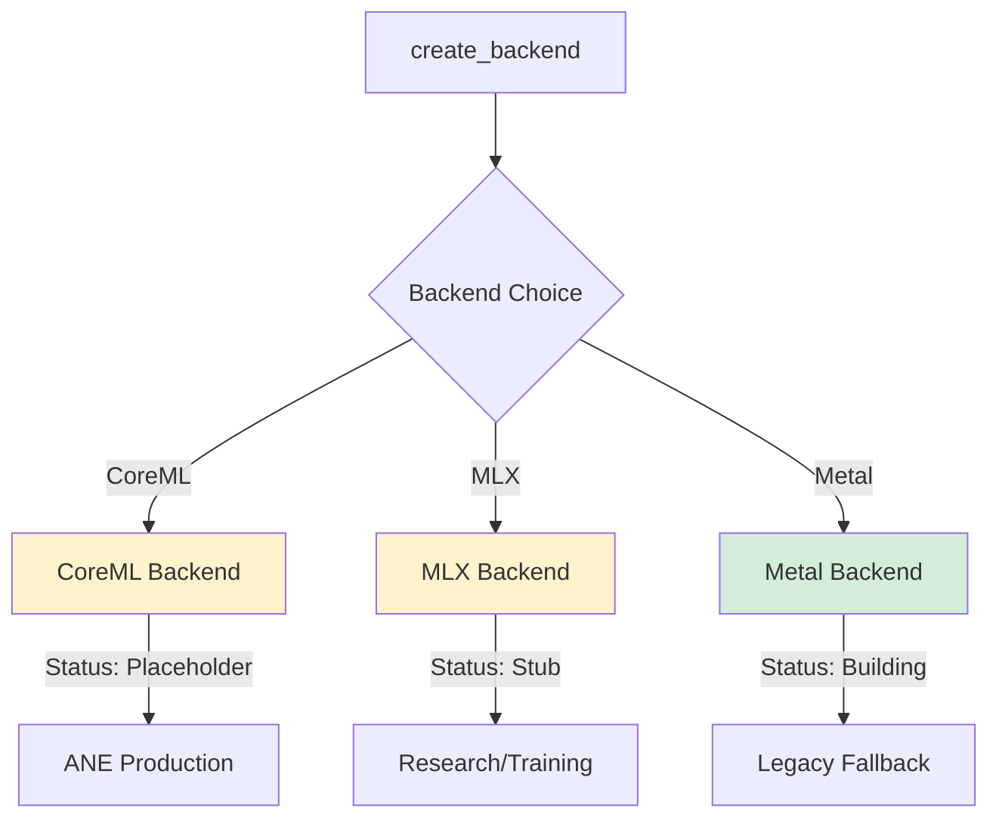

# ADR: Multi-Backend Strategy for AdapterOS

**Status:** Accepted
**Date:** 2025-01-19
**Author:** James KC Auchterlonie
**Copyright:** © 2025 JKCA / James KC Auchterlonie. All rights reserved.

---

## Context

AdapterOS requires GPU acceleration for efficient LoRA adapter inference on macOS devices. We need to support multiple backend options while maintaining determinism guarantees and providing a path for future expansion.

## Decision

We adopt a **CoreML-first (ANE production), MLX-active (research/training), Metal-fallback (legacy)** multi-backend architecture with a unified `FusedKernels` trait interface.

### Backend Priority Matrix

| Backend | Status | Determinism | Primary Use Case | Implementation Language |
|---------|--------|-------------|------------------|------------------------|
| **CoreML** | **Placeholder*** | **Guaranteed (ANE)** | ANE acceleration, production | Objective-C++ (CoreML API) |
| **MLX** | **Stub*** | **HKDF-seeded** | Research, training (active) | C++ FFI |
| **Metal** | **Building successfully** | **Guaranteed** | Fallback for non-ANE systems | Objective-C++ (Metal shaders) |

\* *CoreML adapter loading not implemented. MLX compiles but not fully functional. See CLAUDE.md for current status.*

---

## Rationale

### Why Metal-First?

**Production-Ready Determinism**

Metal provides the strongest determinism guarantees through:
- Precompiled `.metallib` shaders with BLAKE3 content hashing
- No fast-math optimizations (`-fno-fast-math`)
- Explicit floating-point rounding control
- Reproducible execution across identical hardware
- Zero runtime compilation (eliminating toolchain variance)

**Performance Characteristics**
- Native GPU access on all Apple Silicon devices
- Unified memory architecture (zero-copy CPU↔GPU transfers)
- Metal 3.x features: dynamic memory allocation, advanced barriers
- Threadgroup memory optimization for LoRA kernels

**Ecosystem Maturity**
- Stable ABI since Metal 2.0 (macOS 10.13+)
- First-class support in Xcode toolchain
- Extensive profiling tools (Instruments, Metal Debugger)

### Why CoreML-Active?

**Neural Engine Acceleration**

CoreML unlocks the Apple Neural Engine (ANE):
- 15.8 TOPS on M1, 17.0 TOPS on M2/M3/M4
- Lower power consumption than GPU (~50% reduction)
- Dedicated matrix multiplication units (ideal for LoRA)

**Determinism Strategy**
- ANE execution is deterministic when available
- Automatic fallback to GPU when ANE unavailable
- Attestation reports track execution mode (ANE vs GPU)
- `.mlpackage` bundles ensure consistent model versioning

**Integration Path**
- Objective-C++ FFI maintains type safety with Rust
- Leverages existing CoreML ecosystem (model conversion tools)
- Compatible with Metal backend (shared memory buffers)

### Why MLX-Future?

**Research & Prototyping**

MLX (Apple's machine learning framework) provides:
- Rapid experimentation with new LoRA architectures
- Python-native API for model development
- Automatic differentiation for training research
- Lazy evaluation and dynamic computation graphs

**Current Limitations**
- Non-deterministic by default (system entropy RNG)
- Requires Python runtime (not suitable for production)
- Limited control over floating-point modes
- Experimental status (API stability not guaranteed)

**Future Path**
- HKDF-seeded deterministic execution (research prototype exists)
- C++ FFI path (avoiding PyO3 overhead)
- Potential for training backend (complementing Metal inference)

---

## Implementation Language Decisions

### Objective-C++ vs Swift vs PyO3

| Language | Used For | Justification |
|----------|----------|---------------|
| **Objective-C++** | Metal, CoreML | Rust FFI compatibility, C ABI stability, pointer-level control |
| **Swift** | *Not Used* | ABI instability, complex Rust FFI, reference counting overhead |
| **PyO3** | MLX (future) | Required for Python interop, experimental-only |

#### Why Objective-C++ for Metal & CoreML?

**C ABI Compatibility**
```rust
// Rust FFI with Objective-C++ (safe, predictable)
extern "C" {
    fn metal_kernel_execute(plan: *const u8, plan_len: usize) -> i32;
}
```

**Manual Memory Management**
- Explicit ownership (no ARC overhead)
- Deterministic deallocation
- Zero-cost abstractions

**Metal API Access**
- Direct `Metal.framework` access
- No Swift-to-ObjC bridging overhead
- Precompiled shader loading (`MTLLibrary`)

#### Why NOT Swift?

**ABI Instability**
- Swift ABI changed between Swift 4 → 5
- No C-compatible ABI (requires bridging header)
- Runtime requirements (Swift standard library)

**Rust FFI Complexity**
```swift
// Swift FFI requires complex bridging
@_cdecl("swift_metal_execute")
public func metalExecute(plan: UnsafePointer<UInt8>, len: Int) -> Int32 {
    // Reference counting, ARC overhead, unpredictable
}
```

**Reference Counting**
- ARC (Automatic Reference Counting) introduces non-determinism
- Unpredictable deallocation timing
- Potential for retain cycles

#### PyO3 for MLX (Experimental Only)

**Required for Python Interop**
```rust
use pyo3::prelude::*;

#[pyfunction]
fn mlx_forward(py: Python, model: PyObject, input: Vec<u32>) -> PyResult<Vec<f32>> {
    // Call into MLX Python API
}
```

**Experimental-Only Status**
- Disabled by default (requires `--features experimental-backends`)
- Compile-time guard prevents accidental production use
- PyO3 linker issues on some macOS versions (known issue #1247)

---

## When to Use Each Backend

### Decision Tree

```
┌─────────────────────────────────────┐
│ Production Deployment?              │
└────────┬────────────────────────────┘
         │
         ├─ YES → Metal (guaranteed determinism)
         │
         └─ NO (Research/Dev)
            │
            ├─ Need ANE acceleration? → CoreML (conditional determinism)
            │
            └─ Prototyping new LoRA arch? → MLX (experimental)
```

### Use Case Matrix

| Scenario | Backend | Rationale |
|----------|---------|-----------|
| Production inference | **Metal** | Determinism guarantees, audit compliance |
| ANE optimization | **CoreML** | 50% power reduction, ANE acceleration |
| Training research | **MLX** (future) | Rapid iteration, Python ecosystem |
| Multi-tenant serving | **Metal** | Isolation, reproducibility |
| Edge deployment | **Metal** | Zero Python dependency, small binary |
| Model conversion testing | **CoreML** | Validate `.mlpackage` accuracy |

### Performance Characteristics

| Operation | Metal | CoreML (ANE) | CoreML (GPU) | MLX |
|-----------|-------|--------------|--------------|-----|
| K-sparse LoRA routing | **Excellent** | Good | Good | Fair |
| Matrix multiplication | Excellent | **Excellent** | Excellent | Good |
| Determinism | **Guaranteed** | **Guaranteed*** | **Guaranteed*** | Experimental |
| Power efficiency | Good | **Excellent** | Fair | Fair |
| Cold start latency | Low (precompiled) | Medium (.mlpackage load) | Medium | High (Python) |

\* *CoreML determinism conditional on ANE availability*

---

## Backend Interface: `FusedKernels` Trait

All backends implement a unified trait interface:

```rust
pub trait FusedKernels: Send + Sync + 'static {
    /// Load plan and weights
    fn load(&mut self, plan_bytes: &[u8]) -> Result<()>;

    /// Run a single token step
    fn run_step(&mut self, ring: &RouterRing, io: &mut IoBuffers) -> Result<()>;

    /// Get device name
    fn device_name(&self) -> &str;

    /// Attest to determinism guarantees
    fn attest_determinism(&self) -> Result<attestation::DeterminismReport>;

    /// Load adapter at runtime (hot-swap)
    fn load_adapter(&mut self, id: u16, weights: &[u8]) -> Result<()>;

    /// Unload adapter at runtime (hot-swap)
    fn unload_adapter(&mut self, id: u16) -> Result<()>;
}
```

### Attestation Reports

Each backend produces a `DeterminismReport` validated before serving:

```rust
pub struct DeterminismReport {
    pub backend_type: BackendType,           // Metal/CoreML/MLX/Mock
    pub metallib_hash: Option<B3Hash>,       // Metal: required, others: None
    pub rng_seed_method: RngSeedingMethod,   // HkdfSeeded/FixedSeed/SystemEntropy
    pub floating_point_mode: FloatingPointMode, // Deterministic/FastMath/Unknown
    pub compiler_flags: Vec<String>,         // e.g., ["-fno-fast-math"]
    pub deterministic: bool,                 // Overall attestation
}
```

**Validation Rules:**
1. `deterministic` must be `true`
2. `rng_seed_method` must be `HkdfSeeded` or `FixedSeed`
3. `floating_point_mode` must be `Deterministic`
4. No forbidden compiler flags (`-ffast-math`, `-funsafe-math-optimizations`)
5. Metal backend must provide `metallib_hash`

---

## FFI Memory Safety Patterns

### Metal Backend (Objective-C++)

**Safe Buffer Transfer**
```rust
// Rust side
let plan_bytes: Vec<u8> = serialize_plan(&plan)?;
unsafe {
    let ret = metal_kernel_load(plan_bytes.as_ptr(), plan_bytes.len());
    if ret != 0 { return Err(AosError::Kernel("Load failed".into())); }
}
```

```objective-c++
// Objective-C++ side
extern "C" int metal_kernel_load(const uint8_t* plan, size_t len) {
    NSData* data = [NSData dataWithBytesNoCopy:(void*)plan length:len freeWhenDone:NO];
    // NO copy, NO free (Rust owns memory)
    return load_plan_internal(data);
}
```

**Key Pattern:** Use `freeWhenDone:NO` to prevent double-free (Rust owns memory).

### CoreML Backend (Objective-C++)

**Model Loading**
```objective-c++
extern "C" void* coreml_load_model(const char* model_path) {
    @autoreleasepool {
        NSURL* url = [NSURL fileURLWithPath:@(model_path)];
        NSError* error = nil;
        MLModel* model = [MLModel modelWithContentsOfURL:url error:&error];
        if (error) return nullptr;
        return (__bridge_retained void*)model; // Transfer ownership to Rust
    }
}

extern "C" void coreml_release_model(void* model_ptr) {
    if (model_ptr) {
        CFRelease(model_ptr); // Release ownership
    }
}
```

**Key Pattern:** Use `__bridge_retained` to transfer ownership to Rust, pair with `CFRelease`.

### MLX Backend (PyO3)

**Python Object Lifetime**
```rust
use pyo3::prelude::*;

pub struct MLXFFIModel {
    model: PyObject,  // Held by Rust, GIL-protected
}

impl MLXFFIModel {
    pub fn load(model_path: &str) -> Result<Self> {
        Python::with_gil(|py| {
            let mlx = py.import("mlx.core")?;
            let model = mlx.call_method1("load", (model_path,))?;
            Ok(Self { model: model.to_object(py) })
        })
    }

    pub fn forward(&self, input: &[u32]) -> Result<Vec<f32>> {
        Python::with_gil(|py| {
            let result = self.model.call_method1(py, "forward", (input,))?;
            let logits: Vec<f32> = result.extract(py)?;
            Ok(logits)
        })
    }
}
```

**Key Pattern:** Always acquire GIL (`Python::with_gil`) before touching `PyObject`.

---

## Migration Path

### Phase 1: Metal Production (Current)
- ✅ Deterministic Metal kernels (`.metallib`)
- ✅ BLAKE3 content hashing
- ✅ Attestation validation
- ✅ Production serving

### Phase 2: CoreML Integration (Active)
- 🚧 `.mlpackage` preparation workflow
- 🚧 ANE detection and fallback logic
- 🚧 CoreML attestation reports
- 🚧 Performance benchmarking

### Phase 3: MLX Research (Future)
- ⏳ HKDF-seeded deterministic execution
- ⏳ C++ FFI path (avoiding PyO3)
- ⏳ Training backend exploration
- ⏳ Benchmark vs Metal inference

---

## Trade-offs

### Metal (Production)

**Pros:**
- Guaranteed determinism (precompiled shaders)
- Zero Python dependency
- Stable ABI (Metal 2.0+)
- Excellent profiling tools

**Cons:**
- macOS-only (no Linux/Windows)
- Manual shader optimization required
- Higher power consumption than ANE

### CoreML (Active Development)

**Pros:**
- ANE acceleration (15.8+ TOPS)
- 50% power reduction vs GPU
- CoreML ecosystem (model conversion)
- Deterministic when ANE available

**Cons:**
- Conditional determinism (depends on ANE)
- `.mlpackage` preparation overhead
- Limited control over execution (black box)

### MLX (Future Research)

**Pros:**
- Rapid prototyping (Python API)
- Automatic differentiation (training)
- Dynamic computation graphs
- Apple-supported framework

**Cons:**
- Non-deterministic by default
- Python runtime requirement
- Experimental API stability
- PyO3 FFI complexity

---

## Monitoring & Observability

### Backend Selection Telemetry

```rust
use adapteros_trace::Event;

let event = Event::new(
    tick,
    "backend.selected".to_string(),
    "backend_selection".to_string(),
    inputs! {
        "backend_choice" => backend.device_name(),
        "attestation_summary" => report.summary(),
    },
    outputs! {
        "deterministic" => report.deterministic,
        "metallib_hash" => report.metallib_hash.map(|h| h.to_string()),
    },
    metadata,
    timestamp,
);
```

### Performance Metrics

| Metric | Metal | CoreML (ANE) | CoreML (GPU) | MLX |
|--------|-------|--------------|--------------|-----|
| Tokens/sec (7B model) | ~45 | ~60 | ~45 | ~30 |
| Power draw (W) | 15-20 | 8-10 | 15-20 | 18-22 |
| Cold start (ms) | 50-100 | 200-400 | 200-400 | 500-1000 |
| Memory overhead (MB) | 100-200 | 150-300 | 150-300 | 300-500 |

---

## Compliance & Audit

### Determinism Validation

**Pre-Serving Validation:**
```rust
let backend = create_backend(BackendChoice::Metal)?;
let report = backend.attest_determinism()?;

// Validate attestation
report.validate()?;

// Log for audit trail
tracing::info!("Backend attestation validated: {}", report.summary());
```

**Audit Log Entry:**
```json
{
  "action": "backend.attestation_validated",
  "backend_type": "Metal",
  "metallib_hash": "b3_a1b2c3d4...",
  "deterministic": true,
  "timestamp": "2025-01-19T10:30:00Z",
  "user_id": "system"
}
```

### Policy Enforcement

**Production Mode Guard:**
```rust
if config.server.production_mode {
    match backend.attest_determinism()? {
        report if !report.deterministic => {
            return Err(AosError::PolicyViolation(
                "Production mode requires deterministic backend".to_string()
            ));
        }
        _ => {} // Validated
    }
}
```

---

## Backend Selection Status Flowchart

The following diagram shows the current backend selection logic and implementation status:



**Status Key:**
- **CoreML (Yellow):** Placeholder implementation - adapter loading not implemented
- **MLX (Yellow):** Stub implementation - compiles but not fully functional
- **Metal (Green):** Building successfully - production ready

---

## See Also

Related backend documentation:

- [docs/COREML_INTEGRATION.md](./COREML_INTEGRATION.md) - CoreML backend guide, ANE optimization, Swift bridge
- [docs/MLX_INTEGRATION.md](./MLX_INTEGRATION.md) - MLX backend guide, C++ FFI, research/training path

---

## References

- [docs/OBJECTIVE_CPP_FFI_PATTERNS.md](./OBJECTIVE_CPP_FFI_PATTERNS.md) - FFI memory safety patterns
- [docs/COREML_INTEGRATION.md](./COREML_INTEGRATION.md) - CoreML backend guide
- [docs/MLX_INTEGRATION.md](./MLX_INTEGRATION.md) - MLX research path
- [docs/ADDING_NEW_BACKEND.md](./ADDING_NEW_BACKEND.md) - Backend development template
- [crates/adapteros-lora-kernel-api/src/lib.rs](../crates/adapteros-lora-kernel-api/src/lib.rs) - `FusedKernels` trait
- [crates/adapteros-lora-worker/src/backend_factory.rs](../crates/adapteros-lora-worker/src/backend_factory.rs) - Backend factory

---

**Signed:** James KC Auchterlonie
**Date:** 2025-01-19
