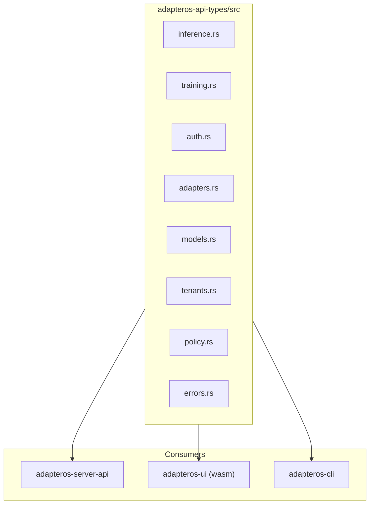

# APIS

API surface, types, and domains. Code is authoritative. Source: `adapteros-api-types`, `adapteros-server-api`, `docs/api/openapi.json`.

---

## API Types Crate

`adapteros-api-types` provides shared request/response types for server, CLI, and UI.



**Features:** `server` (default, utoipa schemas), `wasm` (WASM-compatible, serde only).

---

## Domain Modules

| Module | Key Types | Purpose |
|--------|-----------|---------|
| inference | InferRequest, InferResponse, StopPolicySpec | Inference, streaming |
| training | StartTrainingRequest, TrainingJobResponse, DatasetVersionSelection | Training jobs |
| auth | Claims, Principal, AuthConfig | JWT, sessions |
| adapters | AdapterSummary, AdapterDetail | Adapter registry |
| models | ModelStatus, ModelSummary | Model registry |
| tenants | TenantSummary, TenantDetail | Tenant management |
| policy | PolicyPackSummary, PolicyViolation | Policy packs |
| errors | ErrorResponse | API errors |
| workers | WorkerStatus, WorkerHealth | Worker lifecycle |
| datasets | DatasetVersion, CreateDatasetVersionRequest | Datasets |
| replay | ReplaySession, ReplayExecution | Replay, determinism |

---

## Request/Response Format

**Inference request** (`InferRequest`):

```json
{
  "prompt": "Hello",
  "adapter_id": "optional",
  "max_tokens": 128,
  "temperature": 0.7,
  "stop_policy": { "output_max_tokens": 2048 }
}
```

**Inference response** (`InferResponse`):

```json
{
  "text": "...",
  "tokens": 42,
  "unavailable_pinned_adapters": null,
  "run_receipt": { ... }
}
```

**Error response** (`ErrorResponse`):

```json
{
  "code": "NOT_FOUND",
  "message": "Adapter not found",
  "details": null
}
```

---

## OpenAPI

Spec generated from `#[derive(OpenApi)]` on `ApiDoc` in `adapteros-server-api/src/routes/mod.rs`. Paths and schemas are derived from handler signatures and `#[openapi]` attributes.

```bash
# Generate
cargo run -p adapteros-server -- --generate-openapi

# Output
docs/api/openapi.json
```

**Tags** (from OpenAPI): health, auth, tenants, models, adapters, inference, training, replay, policy, etc.

---

## Versioning

`API_SCHEMA_VERSION` from `adapteros-core`. Response types use `schema_version()` as default. Version header: `X-API-Version` (see `versioning_middleware`).
