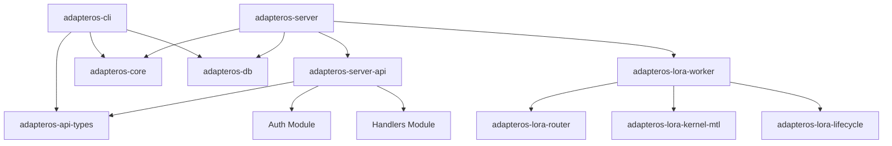
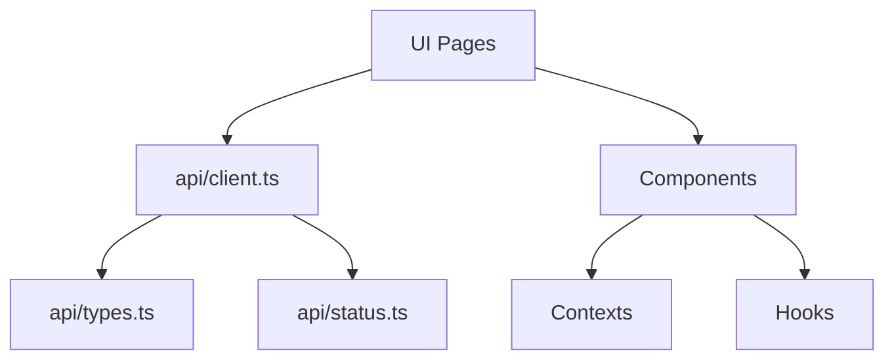
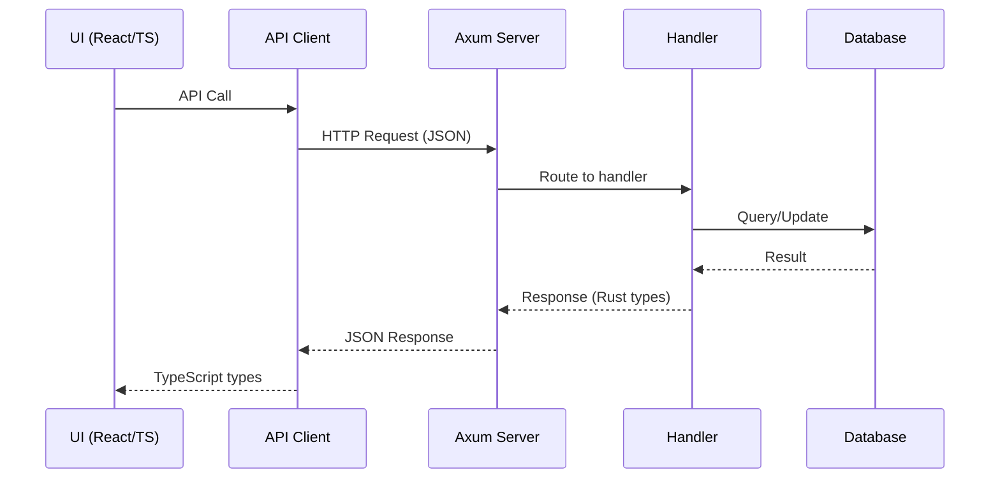

# AdapterOS API Contract Map

**Generated:** 2025-11-17
**Purpose:** End-to-end API contract mapping across UI ↔ CLI ↔ Server
**Agent:** Repo Health & API Contracts (Free Agent)

---

## Executive Summary

### Critical Issues Found

1. **🔴 CRITICAL: Merge Conflicts in UI API Layer**
   - **22 unresolved merge conflicts** in UI API files
   - Files affected: `ui/src/api/types.ts`, `ui/src/api/client.ts`
   - Impact: Type inconsistencies, duplicate definitions, broken builds

2. **🟡 WARNING: adapteros-server-api Crate Disabled**
   - 62 compilation errors (per CLAUDE.md)
   - Critical REST handlers unavailable
   - Blocks API integration testing

3. **🟡 WARNING: Schema Drift Detected**
   - TypeScript `UserRole` type has **two conflicting definitions**
   - Rust vs TypeScript field naming inconsistencies

---

## API Surface Inventory

### 1. REST API Endpoints (Server)

**Source:** `crates/adapteros-server-api/src/routes.rs`

#### Public Routes (No Auth)
| Endpoint | Method | Purpose |
|----------|--------|---------|
| `/healthz` | GET | Health check |
| `/readyz` | GET | Readiness check |
| `/v1/auth/login` | POST | Authentication |
| `/v1/meta` | GET | Meta information |

#### Protected Routes (JWT Auth Required)

**Auth & Users**
- `POST /v1/auth/logout`
- `GET /v1/auth/me`

**Tenants** (15 endpoints)
- `GET /v1/tenants` - List tenants
- `POST /v1/tenants` - Create tenant
- `PUT /v1/tenants/:tenant_id` - Update tenant
- `POST /v1/tenants/:tenant_id/pause` - Pause tenant
- `POST /v1/tenants/:tenant_id/archive` - Archive tenant
- `POST /v1/tenants/:tenant_id/policies` - Assign policies
- `POST /v1/tenants/:tenant_id/adapters` - Assign adapters
- `GET /v1/tenants/:tenant_id/usage` - Get usage stats

**Adapters** (18 endpoints)
- `GET /v1/adapters` - List adapters
- `GET /v1/adapters/:adapter_id` - Get adapter details
- `POST /v1/adapters/register` - Register new adapter
- `DELETE /v1/adapters/:adapter_id` - Delete adapter
- `POST /v1/adapters/:adapter_id/load` - Load adapter
- `POST /v1/adapters/:adapter_id/unload` - Unload adapter
- `GET /v1/adapters/verify-gpu` - Verify GPU integrity
- `GET /v1/adapters/:adapter_id/activations` - Get activation history
- `POST /v1/adapters/:adapter_id/promote` - Promote adapter state
- `GET /v1/adapters/:adapter_id/manifest` - Download manifest
- `POST /v1/adapters/directory/upsert` - Upsert directory adapter
- `GET /v1/adapters/:adapter_id/health` - Health check
- `POST /v1/adapters/validate-name` - Validate semantic naming
- `POST /v1/stacks/validate-name` - Validate stack naming
- `GET /v1/adapters/next-revision/:tenant/:domain/:purpose` - Get next revision

**Adapter Stacks** (5 endpoints)
- `GET /v1/adapter-stacks` - List stacks
- `POST /v1/adapter-stacks` - Create stack
- `GET /v1/adapter-stacks/:id` - Get stack
- `DELETE /v1/adapter-stacks/:id` - Delete stack
- `POST /v1/adapter-stacks/:id/activate` - Activate stack
- `POST /v1/adapter-stacks/deactivate` - Deactivate stack

**Domain Adapters** (8 endpoints)
- `GET /v1/domain-adapters` - List domain adapters
- `POST /v1/domain-adapters` - Create domain adapter
- `GET /v1/domain-adapters/:adapter_id` - Get domain adapter
- `DELETE /v1/domain-adapters/:adapter_id` - Delete domain adapter
- `POST /v1/domain-adapters/:adapter_id/load` - Load domain adapter
- `POST /v1/domain-adapters/:adapter_id/unload` - Unload domain adapter
- `POST /v1/domain-adapters/:adapter_id/test` - Test domain adapter
- `GET /v1/domain-adapters/:adapter_id/manifest` - Get manifest
- `POST /v1/domain-adapters/:adapter_id/execute` - Execute domain adapter

**Inference** (3 endpoints)
- `POST /v1/patch/propose` - Propose patch
- `POST /v1/infer` - Single inference
- `POST /v1/infer/batch` - Batch inference

**Nodes** (6 endpoints)
- `GET /v1/nodes` - List nodes
- `POST /v1/nodes/register` - Register node
- `POST /v1/nodes/:node_id/ping` - Test connection
- `POST /v1/nodes/:node_id/offline` - Mark offline
- `DELETE /v1/nodes/:node_id` - Evict node
- `GET /v1/nodes/:node_id/details` - Get node details

**Models** (2 endpoints)
- `POST /v1/models/import` - Import model
- `GET /v1/models/status` - Get base model status

**Plans** (7 endpoints)
- `GET /v1/plans` - List plans
- `POST /v1/plans/build` - Build plan
- `GET /v1/plans/:plan_id/details` - Get plan details
- `POST /v1/plans/:plan_id/rebuild` - Rebuild plan
- `POST /v1/plans/compare` - Compare plans
- `GET /v1/plans/:plan_id/manifest` - Export manifest

**Control Plane** (5 endpoints)
- `POST /v1/cp/promote` - Promote
- `GET /v1/cp/promotion-gates/:cpid` - Get gates
- `POST /v1/cp/rollback` - Rollback
- `POST /v1/cp/promote/dry-run` - Dry run promotion
- `GET /v1/cp/promotions` - Promotion history

**Workers** (7 endpoints)
- `GET /v1/workers` - List workers
- `POST /v1/workers/spawn` - Spawn worker
- `GET /v1/workers/:worker_id/logs` - Process logs
- `GET /v1/workers/:worker_id/crashes` - Crash logs
- `POST /v1/workers/:worker_id/debug` - Debug session
- `POST /v1/workers/:worker_id/troubleshoot` - Troubleshoot

**Jobs** (1 endpoint)
- `GET /v1/jobs` - List jobs

**Policies** (7 endpoints)
- `GET /v1/policies` - List policies
- `GET /v1/policies/:cpid` - Get policy
- `POST /v1/policies/validate` - Validate policy
- `POST /v1/policies/apply` - Apply policy
- `POST /v1/policies/:cpid/sign` - Sign policy
- `POST /v1/policies/compare` - Compare versions
- `GET /v1/policies/:cpid/export` - Export policy

**Telemetry** (4 endpoints)
- `GET /v1/telemetry/bundles` - List bundles
- `GET /v1/telemetry/bundles/:bundle_id/export` - Export bundle
- `POST /v1/telemetry/bundles/:bundle_id/verify` - Verify signature
- `POST /v1/telemetry/bundles/purge` - Purge old bundles

**Replay** (4 endpoints)
- `GET /v1/replay/sessions` - List sessions
- `POST /v1/replay/sessions` - Create session
- `GET /v1/replay/sessions/:id` - Get session
- `POST /v1/replay/sessions/:id/verify` - Verify session

**Contacts** (5 endpoints)
- `GET /v1/contacts` - List contacts
- `POST /v1/contacts` - Create contact
- `GET /v1/contacts/:id` - Get contact
- `DELETE /v1/contacts/:id` - Delete contact
- `GET /v1/contacts/:id/interactions` - Get interactions

**Code Intelligence** (6 endpoints)
- `POST /v1/code/register-repo` - Register repository
- `POST /v1/code/scan` - Scan repository
- `GET /v1/code/scan/:job_id` - Get scan status
- `GET /v1/code/repositories` - List repositories
- `GET /v1/code/repositories/:repo_id` - Get repository
- `POST /v1/code/commit-delta` - Create commit delta

**Metrics** (4 endpoints)
- `GET /v1/metrics/quality` - Quality metrics
- `GET /v1/metrics/adapters` - Adapter metrics
- `GET /v1/metrics/system` - System metrics
- `GET /v1/system/memory` - UMA memory stats

**Commits** (3 endpoints)
- `GET /v1/commits` - List commits
- `GET /v1/commits/:sha` - Get commit
- `GET /v1/commits/:sha/diff` - Get commit diff

**Routing** (3 endpoints)
- `POST /v1/routing/debug` - Debug routing
- `GET /v1/routing/history` - Routing history
- `GET /v1/routing/decisions` - Routing decisions

**Training** (7 endpoints)
- `GET /v1/training/jobs` - List jobs
- `GET /v1/training/jobs/:job_id` - Get job
- `POST /v1/training/start` - Start training
- `POST /v1/training/jobs/:job_id/cancel` - Cancel job
- `GET /v1/training/jobs/:job_id/logs` - Get logs
- `GET /v1/training/jobs/:job_id/metrics` - Get metrics
- `GET /v1/training/templates` - List templates
- `GET /v1/training/templates/:template_id` - Get template

**Git Integration** (5 endpoints)
- `GET /v1/git/status` - Git status
- `POST /v1/git/sessions/start` - Start session
- `POST /v1/git/sessions/:session_id/end` - End session
- `GET /v1/git/branches` - List branches
- `GET /v1/streams/file-changes` - File changes stream (SSE)

**Monitoring** (11 endpoints)
- `GET /v1/monitoring/rules` - List rules
- `POST /v1/monitoring/rules` - Create rule
- `GET /v1/monitoring/alerts` - List alerts
- `POST /v1/monitoring/alerts/:alert_id/acknowledge` - Acknowledge alert
- `GET /v1/monitoring/anomalies` - List anomalies
- `POST /v1/monitoring/anomalies/:anomaly_id/status` - Update status
- `GET /v1/monitoring/dashboards` - List dashboards
- `POST /v1/monitoring/dashboards` - Create dashboard
- `GET /v1/monitoring/health-metrics` - Health metrics
- `GET /v1/monitoring/reports` - List reports
- `POST /v1/monitoring/reports` - Create report

**Audit** (4 endpoints)
- `GET /v1/audit/federation` - Federation audit
- `GET /v1/audit/compliance` - Compliance audit
- `GET /v1/audit/logs` - Query audit logs
- `GET /v1/audits` - Extended audits
- `GET /v1/promotions/:id` - Get promotion

**SSE Streams** (6 endpoints)
- `GET /v1/streams/training` - Training events
- `GET /v1/streams/discovery` - Discovery events
- `GET /v1/streams/contacts` - Contact events
- `GET /v1/stream/metrics` - System metrics
- `GET /v1/stream/telemetry` - Telemetry events
- `GET /v1/stream/adapters` - Adapter state changes

**Plugins** (4 endpoints)
- `POST /v1/plugins/:name/enable` - Enable plugin
- `POST /v1/plugins/:name/disable` - Disable plugin
- `GET /v1/plugins/:name` - Get plugin status
- `GET /v1/plugins` - List plugins

**Total REST API Endpoints: 167+**

---

### 2. CLI Commands (aosctl)

**Source:** `crates/adapteros-cli/src/main.rs`

#### Tenant Management
- `aosctl init-tenant` - Initialize new tenant

#### Adapter Management
- `aosctl list-adapters` - List adapters
- `aosctl register-adapter` - Register adapter
- `aosctl pin-adapter` - Pin adapter (prevent eviction)
- `aosctl unpin-adapter` - Unpin adapter
- `aosctl list-pinned` - List pinned adapters
- `aosctl adapter-swap` - Hot-swap adapters

**Additional Commands** (from subcommand files):
- Database management (`db` subcommand)
- Deployment (`deploy` subcommand)
- Router debugging (`router` subcommand)
- Metrics (`metrics` subcommand)
- Policy management (`policy` subcommand)
- Golden runs (`golden` subcommand)
- Profile management (`profile` subcommand)
- Replay bundles (`replay_bundle` subcommand)
- Status checks (`status` subcommand)
- Verification (`verify` subcommand)
- Maintenance (`maintenance` subcommand)
- AOS operations (`aos` subcommand)
- Baseline management (`baseline` subcommand)
- Migration (`migrate` subcommand)

---

### 3. UI TypeScript Types

**Source:** `ui/src/api/types.ts` (2,374 lines)

#### Core Type Exports (First 50)
```typescript
LoginRequest, LoginResponse, UserInfoResponse, User, UserRole,
SessionInfo, RotateTokenResponse, TokenMetadata, AuthConfigResponse,
UpdateAuthConfigRequest, UpdateProfileRequest, ProfileResponse,
Tenant, CreateTenantRequest, Node, RegisterNodeRequest, NodePingResponse,
WorkerInfo, NodeDetailsResponse, Plan, BuildPlanRequest,
PlanComparisonResponse, PromotionRequest, PromotionGate, PromotionRecord,
Policy, ValidatePolicyRequest, ApplyPolicyRequest, TelemetryBundle,
UnifiedTelemetryEvent, MetricsSnapshotResponse, MetricsSeriesResponse,
MetricDataPointResponse, Trace, Span, GoldenRunSummary, GoldenRun,
GoldenCompareMetric, GoldenCompareResult, Strictness, GoldenCompareRequest,
EpsilonStats, LayerDivergence, EpsilonComparison, ToolchainMetadata,
DeviceFingerprint, GoldenRunMetadata, VerificationReport, Adapter
```

**Total Type Exports:** 275+ (estimated)

---

## Schema Drift Analysis

### 🔴 CRITICAL: Duplicate Type Definitions

#### 1. UserRole Type Conflict

**Location:** `ui/src/api/types.ts`

**Definition 1 (line 47):**
```typescript
export type UserRole = 'admin' | 'operator' | 'sre' | 'compliance' | 'auditor' | 'viewer';
```

**Definition 2 (line 95):**
```typescript
export type UserRole = 'Admin' | 'Operator' | 'SRE' | 'Compliance' | 'Viewer';
```

**Impact:**
- Capitalization inconsistency
- Missing 'auditor' role in second definition
- Will cause TypeScript compilation errors
- Runtime type mismatches

**Root Cause:** Unresolved merge conflict between HEAD and integration-branch

---

### 🟡 WARNING: Merge Conflicts

**Files with Active Conflicts:**
- `ui/src/api/types.ts` - Multiple conflicts
- `ui/src/api/client.ts` - Multiple conflicts

**Conflict Markers Found:** 22

**Example from client.ts:**
```typescript

  private retryConfig: RetryConfig;

  private token: string | null = null;
  private requestLog: Array<{ id: string; method: string; path: string; timestamp: string }> = [];
>
```

---

### Field Naming Inconsistencies

#### Rust API Types vs TypeScript
| Field | Rust (adapteros-api-types) | TypeScript (UI) | Status |
|-------|---------------------------|-----------------|--------|
| `adapter_id` | Snake case | `adapter_id` / `id` | ⚠️ Inconsistent |
| `hash_b3` | Snake case | `hash_b3` | ✅ Consistent |
| `created_at` | Snake case | `created_at` | ✅ Consistent |
| `user_role` | - | `UserRole` (enum) | ⚠️ Casing conflict |

---

## Type Contract Matrix

### Adapter Types

| Type | Rust (adapteros-api-types) | TypeScript (UI) | CLI | Notes |
|------|---------------------------|-----------------|-----|-------|
| `AdapterResponse` | ✅ `src/adapters.rs:18` | ✅ `types.ts` | - | Matches |
| `RegisterAdapterRequest` | ✅ `src/adapters.rs:7` | ❓ Not found | ✅ Via flags | Missing in UI |
| `AdapterStats` | ✅ `src/adapters.rs:33` | ✅ `types.ts` | - | Matches |
| `AdapterManifest` | ✅ `src/adapters.rs:62` | ❓ Not found | - | Missing in UI |
| `AdapterHealthResponse` | ✅ `src/adapters.rs:84` | ❓ Not found | - | Missing in UI |

### Inference Types

| Type | Rust | TypeScript | CLI | Notes |
|------|------|------------|-----|-------|
| `InferRequest` | ✅ `src/inference.rs:7` | ✅ `types.ts` | ✅ | Matches |
| `InferResponse` | ✅ `src/inference.rs:24` | ✅ `types.ts` | ✅ | Matches |
| `InferenceTrace` | ✅ `src/inference.rs:33` | ✅ `types.ts` | - | Matches |
| `RouterDecision` | ✅ `src/inference.rs:49` | ✅ `types.ts` | - | Matches |
| `RouterCandidate` | ✅ `src/inference.rs:41` | ❓ Not found | - | Missing in UI |

### Telemetry Types

| Type | Rust | TypeScript | CLI | Notes |
|------|------|------------|-----|-------|
| `ApiTelemetryEvent` | ✅ `src/telemetry.rs:10` | ⚠️ `UnifiedTelemetryEvent` | - | Name mismatch |
| `TelemetryBundleResponse` | ✅ `src/telemetry.rs:32` | ✅ `TelemetryBundle` | - | Name close |
| `BundleMetadata` | ✅ `src/telemetry.rs:68` | ❓ Not found | - | Missing in UI |

---

## Missing API Contracts

### Rust → TypeScript (Not in UI)
1. `AdapterManifest` - Adapter manifest download
2. `AdapterHealthResponse` - Adapter health checks
3. `RouterCandidate` - Router candidate details
4. `BundleMetadata` - Telemetry bundle metadata

### TypeScript → Rust (Not in Server API)
1. `SessionInfo` - User session tracking
2. `RotateTokenResponse` - Token rotation
3. `TokenMetadata` - Token metadata
4. `AuthConfigResponse` - Auth configuration
5. `UpdateProfileRequest` - Profile updates

**Note:** Many TypeScript types may be UI-only or belong to disabled `adapteros-server-api` crate.

---

## Dependency Graph

### Rust Crate Dependencies



### UI Module Dependencies



### API Flow



---

## Breaking Change Alerts

### 🔴 IMMEDIATE ACTION REQUIRED

1. **Resolve UI Merge Conflicts**
   - Files: `ui/src/api/types.ts`, `ui/src/api/client.ts`
   - Impact: Compilation failures, type mismatches
   - Resolution: Manual merge conflict resolution

2. **Fix UserRole Type Duplication**
   - Choose canonical casing (recommend lowercase for consistency)
   - Add 'auditor' role to both definitions
   - Update all consumers

3. **Fix adapteros-server-api Crate**
   - 62 compilation errors blocking integration
   - Many handlers unavailable
   - Impacts: E2E testing, production deployment

### 🟡 RECOMMENDED ACTIONS

1. **Standardize Field Naming**
   - Adopt snake_case for JSON fields (matches Rust)
   - Document in style guide

2. **Complete TypeScript Type Coverage**
   - Add missing types: `AdapterManifest`, `AdapterHealthResponse`, `RouterCandidate`, `BundleMetadata`
   - Generate from OpenAPI schema

3. **API Versioning Strategy**
   - All endpoints use `/v1/` prefix (good!)
   - Document breaking change policy
   - Consider schema evolution strategy

---

## Recommendations

### 1. Immediate (This Week)

1. **Resolve Merge Conflicts**
   - Clean up `ui/src/api/types.ts` and `client.ts`
   - Run `git diff --check` to find remaining markers
   - Add pre-commit hook to block merge conflict markers

2. **Fix adapteros-server-api Build**
   - Address 62 compilation errors
   - Re-enable in workspace
   - Unblock API integration testing

3. **Standardize UserRole Type**
   - Choose lowercase variant
   - Update RBAC documentation
   - Add migration guide

### 2. Short-term (This Month)

1. **Generate OpenAPI Schema**
   - Use `utoipa` derives (already present!)
   - Export to `openapi.json`
   - Auto-generate TypeScript types

2. **Create Contract Tests**
   - JSON schema validation
   - Type compatibility tests
   - CI integration

3. **Document API Contracts**
   - Maintain this document as living artifact
   - Add change log
   - Version with schema changes

### 3. Long-term (Next Quarter)

1. **Schema-Driven Development**
   - OpenAPI as source of truth
   - Code generation for UI types
   - Contract-first API design

2. **Automated Drift Detection**
   - CI job to compare Rust ↔ TypeScript types
   - Breaking change alerts
   - Weekly drift reports

3. **Mock Generation**
   - Auto-generate mock fixtures from schemas
   - UI/CLI dev without backend
   - Integration test data

---

## Appendix A: Full Endpoint List

See inline documentation above for complete 167+ endpoint inventory.

---

## Appendix B: Crate Inventory

**Total Rust Crates:** 65+

**Key API-Related Crates:**
- `adapteros-api-types` - Shared types
- `adapteros-server-api` - REST handlers (DISABLED)
- `adapteros-server` - Main server binary
- `adapteros-cli` - CLI tool
- `adapteros-client` - API client library

**UI Projects:**
- `ui/` - React/TypeScript dashboard
- `crates/mplora-codegraph-viewer/` - Code graph UI

---

## Appendix C: Type Coverage Gaps

**Missing in TypeScript:**
- 4 adapter-related types
- 3 telemetry types
- Multiple internal types (likely not exposed)

**Missing in Rust:**
- 5 auth-related types (may be UI-only)

**Unknown Coverage:**
- Need to complete full type audit
- Recommend automated schema comparison

---

**Document Version:** 1.0
**Next Update:** After merge conflict resolution
**Maintainer:** Repo Health Agent
