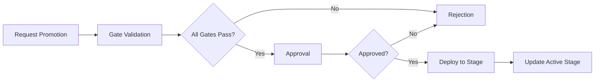

# AdapterOS API Guides

**Version:** 1.0.0
**Last Updated:** 2025-12-11
**Copyright:** 2025 MLNavigator Inc. All rights reserved.

This document provides workflow guides, versioning information, and best practices for the AdapterOS API.

---

## Table of Contents

1. [API Versioning](#api-versioning)
2. [Tenant & Settings Management](#tenant--settings-management)
3. [Promotion Workflow](#promotion-workflow)
4. [Best Practices](#best-practices)

---

## API Versioning

### Current Version

**API Version:** `v1` (stable)
**Schema Version:** `1.0.0`

The v1 API is stable and production-ready. No breaking changes will be introduced to v1 endpoints without a deprecation period and migration path.

### Version Identification

#### Response Headers

All API responses include version information:

```http
X-API-Version: v1
Content-Type: application/vnd.aos.v1+json
```

#### Schema Version

All structured responses include a `schema_version` field:

```json
{
  "schema_version": "1.0.0",
  "data": { ... }
}
```

### Version Negotiation

The API supports multiple methods for specifying the desired API version. Precedence order:

1. **Path-based version** (highest priority)
2. **Accept-Version header**
3. **Accept header**
4. **Default to v1** (lowest priority)

#### 1. Path-Based Version (Recommended)

Specify version directly in the URL path:

```bash
# v1 API
curl https://api.adapteros.local/v1/adapters

# v2 API (future)
curl https://api.adapteros.local/v2/adapters
```

**Recommendation:** Use path-based versioning for explicit control and clarity.

#### 2. Accept-Version Header

Specify version using the `Accept-Version` header:

```bash
# All these are equivalent for v1:
curl -H "Accept-Version: v1" https://api.adapteros.local/adapters
curl -H "Accept-Version: 1" https://api.adapteros.local/adapters
curl -H "Accept-Version: 1.0" https://api.adapteros.local/adapters
curl -H "Accept-Version: 1.0.0" https://api.adapteros.local/adapters
```

**Use case:** Client libraries that want to set a default version across all requests without modifying URLs.

#### 3. Accept Header (Content Negotiation)

Specify version using vendor-specific MIME types:

```bash
# v1 API
curl -H "Accept: application/vnd.aos.v1+json" https://api.adapteros.local/adapters

# v2 API (future)
curl -H "Accept: application/vnd.aos.v2+json" https://api.adapteros.local/adapters
```

**Use case:** REST purist clients that prefer content negotiation.

#### 4. Default Version

If no version is specified, the API defaults to **v1**:

```bash
# Defaults to v1
curl https://api.adapteros.local/adapters
```

**Warning:** Relying on the default is not recommended for production applications. Always specify a version explicitly.

### Stability Guarantees

#### v1 Stability Promise

AdapterOS commits to the following guarantees for v1 endpoints:

**No Breaking Changes:**
- Existing fields will NOT be removed
- Existing fields will NOT change type
- Existing fields will NOT change semantics
- Existing endpoints will NOT be removed without deprecation
- Existing query parameters will NOT be removed or change behavior

**Allowed Changes (Non-Breaking):**
- Adding new optional fields to responses
- Adding new endpoints
- Adding new optional query parameters
- Improving error messages (keeping error codes stable)
- Performance improvements

### Breaking Change Definition

A change is considered **breaking** if it requires client code modifications:

**Breaking Changes:**
- Removing a field from a response
- Renaming a field
- Changing a field's data type (e.g., `string` to `number`)
- Changing field semantics (e.g., timestamp format change)
- Removing an endpoint
- Changing HTTP status codes for existing scenarios
- Making an optional field required
- Changing authentication/authorization behavior
- Removing or renaming query parameters
- Changing error codes for existing error conditions

**Non-Breaking Changes:**
- Adding new optional fields to responses
- Adding new optional query parameters
- Adding new endpoints
- Adding new enum values (if clients handle unknown values gracefully)
- Deprecating fields (with continued support)
- Improving performance
- Fixing bugs that resulted in incorrect behavior

### Deprecation Process

When functionality needs to be phased out, AdapterOS follows a structured deprecation process:

#### Phase 1: Deprecation Announcement

Deprecated endpoints receive deprecation headers:

```http
X-API-Deprecation: deprecated_at="2025-01-01T00:00:00Z"; sunset_at="2025-07-01T00:00:00Z"; replacement="/v1/new-endpoint"; migration_url="https://docs.adapteros.com/migrations/endpoint-name"
Sunset: 2025-07-01T00:00:00Z
```

**Timeline:** Minimum 6 months between deprecation and sunset.

#### Phase 2: Deprecation Period

During the deprecation period (6+ months):
- Deprecated functionality continues to work
- Warning headers are present
- Documentation is updated with migration guides
- New clients should use replacement endpoints

#### Phase 3: Sunset

After the sunset date:
- Deprecated endpoint returns `410 Gone` status
- Error response includes migration instructions
- Replacement endpoint is fully operational

### Version History

#### v1.0.0 (Current - Stable)

**Released:** 2025-01-15
**Status:** Stable

**Endpoints:** 189+ endpoints across:
- Adapter management (`/v1/adapters/*`)
- Inference (`/v1/infer/*`)
- Training (`/v1/training/*`)
- Datasets (`/v1/datasets/*`)
- Tenants (`/v1/tenants/*`)
- Workers (`/v1/workers/*`)
- Policies (`/v1/policies/*`)
- Telemetry (`/v1/telemetry/*`)

#### v2 (Future - Not Yet Released)

**Status:** Planned for future release

Potential v2 improvements under consideration:
- Enhanced RAG vector retrieval
- Unified adapter/stack lifecycle API
- Streaming improvements
- GraphQL support

**Note:** v2 is not yet available. This is a placeholder for future planning.

### Client Best Practices

#### 1. Always Specify Version

**Good:**
```typescript
const client = new AdapterOSClient({
  baseURL: 'https://api.adapteros.local/v1',
  // or
  headers: { 'Accept-Version': '1.0.0' }
});
```

**Bad:**
```typescript
const client = new AdapterOSClient({
  baseURL: 'https://api.adapteros.local', // No version!
});
```

#### 2. Monitor Deprecation Headers

Check for `X-API-Deprecation` headers in responses:

```typescript
if (response.headers['x-api-deprecation']) {
  console.warn('Deprecated API in use:', response.headers['x-api-deprecation']);
  // Log to monitoring system
}
```

#### 3. Handle Unknown Fields Gracefully

Ignore unknown fields in responses to allow for non-breaking additions:

```typescript
// Good: Destructure only known fields
const { id, name, status } = adapter;

// Bad: Strict validation that fails on new fields
const adapter = strictSchema.parse(response); // Breaks when new fields added
```

#### 4. Pin to Major Version

Lock to a major version but accept minor/patch updates:

```bash
# In package.json or requirements.txt
adapteros-client: "^1.0.0"  # Accepts 1.x.x updates
```

### Support Policy

**v1 Support:**
- Active development and bug fixes
- Security updates
- No sunset date planned
- Guaranteed support through at least 2027

**Future Versions:**
- v2: Planned for future release
- Support policy will be announced with v2 release

---

## Tenant & Settings Management

### Tenant Management

#### Create Tenant

```bash
POST /v1/tenants
Authorization: Bearer <admin_token>
Content-Type: application/json

{
  "name": "acme-corp",
  "itar_flag": false
}
```

**Response:**
```json
{
  "schema_version": "1.0",
  "id": "01234567-89ab-cdef-0123-456789abcdef",
  "name": "acme-corp",
  "itar_flag": false,
  "created_at": "2025-11-25 10:00:00",
  "status": "active",
  "max_adapters": null,
  "max_training_jobs": null,
  "max_storage_gb": null,
  "rate_limit_rpm": 1000
}
```

#### Update Tenant

```bash
PUT /v1/tenants/{tenant_id}
Authorization: Bearer <admin_token>
Content-Type: application/json

{
  "name": "acme-corporation",
  "max_adapters": 50,
  "max_training_jobs": 5,
  "max_storage_gb": 100.0,
  "rate_limit_rpm": 500
}
```

#### List Tenants

```bash
GET /v1/tenants
Authorization: Bearer <token>
```

**Response:**
```json
[
  {
    "schema_version": "1.0",
    "id": "tenant-1",
    "name": "acme-corp",
    "itar_flag": false,
    "created_at": "2025-11-25 10:00:00",
    "status": "active",
    "updated_at": "2025-11-25 11:30:00",
    "default_stack_id": "stack-1",
    "max_adapters": 50,
    "max_training_jobs": 5,
    "max_storage_gb": 100.0,
    "rate_limit_rpm": 500
  }
]
```

#### Pause Tenant

```bash
POST /v1/tenants/{tenant_id}/pause
Authorization: Bearer <admin_token>
```

**Use Cases:**
- Temporarily suspend operations for maintenance
- Stop billing while preserving tenant data
- Enforce policy violations

#### Archive Tenant

```bash
POST /v1/tenants/{tenant_id}/archive
Authorization: Bearer <admin_token>
```

**Use Cases:**
- Long-term deactivation
- Customer cancellation
- Compliance retention

#### Get Tenant Usage

```bash
GET /v1/tenants/{tenant_id}/usage
Authorization: Bearer <token>
```

**Response:**
```json
{
  "schema_version": "1.0",
  "tenant_id": "tenant-1",
  "cpu_usage_pct": 0.0,
  "gpu_usage_pct": 0.0,
  "memory_used_gb": 0.0,
  "memory_total_gb": 0.0,
  "inference_count_24h": 1250,
  "active_adapters_count": 12
}
```

#### Assign Policies

```bash
POST /v1/tenants/{tenant_id}/policies
Authorization: Bearer <admin_token>
Content-Type: application/json

{
  "policy_ids": ["cp-001", "cp-egress-002", "cp-evidence-004"]
}
```

#### Assign Adapters

```bash
POST /v1/tenants/{tenant_id}/adapters
Authorization: Bearer <admin_token>
Content-Type: application/json

{
  "adapter_ids": ["adapter-1", "adapter-2"]
}
```

### Settings Management

#### Get System Settings

```bash
GET /v1/settings
Authorization: Bearer <admin_token>
```

**Response:**
```json
{
  "schema_version": "1.0",
  "general": {
    "system_name": "AdapterOS",
    "environment": "production",
    "api_base_url": "https://api.adapteros.example.com"
  },
  "server": {
    "http_port": 8080,
    "https_port": 8443,
    "uds_socket_path": "/var/run/adapteros.sock",
    "production_mode": true
  },
  "security": {
    "jwt_mode": "eddsa",
    "token_ttl_seconds": 28800,
    "require_mfa": false,
    "egress_enabled": false,
    "require_pf_deny": true
  },
  "performance": {
    "max_adapters": 100,
    "max_workers": 10,
    "memory_threshold_pct": 0.85,
    "cache_size_mb": 1024
  }
}
```

#### Update System Settings

```bash
PUT /v1/settings
Authorization: Bearer <admin_token>
Content-Type: application/json

{
  "general": {
    "system_name": "AdapterOS Production",
    "environment": "production"
  },
  "security": {
    "jwt_mode": "eddsa",
    "token_ttl_seconds": 14400,
    "require_mfa": true
  },
  "performance": {
    "max_adapters": 200,
    "max_workers": 20,
    "memory_threshold_pct": 0.80
  }
}
```

**Response:**
```json
{
  "schema_version": "1.0",
  "success": true,
  "restart_required": true,
  "message": "Settings updated: security, performance. Restart required for changes to take effect."
}
```

**Restart Required For:**
- Server settings (ports, UDS socket, production mode)
- Security settings (JWT mode, MFA, egress control)

**Applied Immediately:**
- General settings
- Performance settings

### Plugin Management

#### List Plugins

```bash
GET /v1/plugins
Authorization: Bearer <token>
```

**Response:**
```json
{
  "plugins": [
    {
      "plugin": "code-intelligence",
      "tenant": "tenant-1",
      "enabled": true,
      "health": {
        "status": "Running",
        "details": null
      }
    },
    {
      "plugin": "federation",
      "tenant": "tenant-1",
      "enabled": false,
      "health": {
        "status": "Stopped",
        "details": null
      }
    }
  ]
}
```

#### Get Plugin Status

```bash
GET /v1/plugins/{name}
Authorization: Bearer <token>
```

#### Enable Plugin

```bash
POST /v1/plugins/{name}/enable
Authorization: Bearer <admin_or_operator_token>
```

**Response:**
```json
{
  "status": "enabled",
  "plugin": "code-intelligence",
  "tenant": "tenant-1"
}
```

#### Disable Plugin

```bash
POST /v1/plugins/{name}/disable
Authorization: Bearer <admin_or_operator_token>
```

### Authorization Matrix

| Operation | Admin | Operator | SRE | Compliance | Viewer |
|-----------|-------|----------|-----|------------|--------|
| List tenants | ✓ | ✓ | ✓ | ✓ | ✓ |
| Create tenant | ✓ | ✗ | ✗ | ✗ | ✗ |
| Update tenant | ✓ | ✗ | ✗ | ✗ | ✗ |
| Pause/archive tenant | ✓ | ✗ | ✗ | ✗ | ✗ |
| View usage | ✓ | ✓ | ✓ | ✓ | ✓ |
| Assign policies | ✓ | ✗ | ✗ | ✗ | ✗ |
| Assign adapters | ✓ | ✗ | ✗ | ✗ | ✗ |
| Get settings | ✓ | ✗ | ✗ | ✗ | ✗ |
| Update settings | ✓ | ✗ | ✗ | ✗ | ✗ |
| Enable/disable plugins | ✓ | ✓ | ✗ | ✗ | ✗ |
| View plugins | ✓ | ✓ | ✓ | ✓ | ✓ |

### Workflow Examples

#### Example 1: Create and Configure New Tenant

```bash
# 1. Create tenant
curl -X POST http://localhost:8080/v1/tenants \
  -H "Authorization: Bearer $ADMIN_TOKEN" \
  -H "Content-Type: application/json" \
  -d '{
    "name": "startup-inc",
    "itar_flag": false
  }'

# Response: { "id": "tenant-123", ... }

# 2. Set resource limits
curl -X PUT http://localhost:8080/v1/tenants/tenant-123 \
  -H "Authorization: Bearer $ADMIN_TOKEN" \
  -H "Content-Type: application/json" \
  -d '{
    "max_adapters": 25,
    "max_training_jobs": 3,
    "max_storage_gb": 50.0,
    "rate_limit_rpm": 300
  }'

# 3. Assign policies
curl -X POST http://localhost:8080/v1/tenants/tenant-123/policies \
  -H "Authorization: Bearer $ADMIN_TOKEN" \
  -H "Content-Type: application/json" \
  -d '{
    "policy_ids": ["cp-001", "cp-egress-002"]
  }'
```

#### Example 2: Monitor Tenant Usage

```bash
# Get current usage
curl -X GET http://localhost:8080/v1/tenants/tenant-123/usage \
  -H "Authorization: Bearer $TOKEN"

# Response:
# {
#   "tenant_id": "tenant-123",
#   "inference_count_24h": 1523,
#   "active_adapters_count": 18,
#   ...
# }

# Check against limits
curl -X GET http://localhost:8080/v1/tenants/tenant-123 \
  -H "Authorization: Bearer $TOKEN"

# Compare active_adapters_count (18) against max_adapters (25)
# 18/25 = 72% utilization
```

#### Example 3: Configure System Settings

```bash
# Get current settings
curl -X GET http://localhost:8080/v1/settings \
  -H "Authorization: Bearer $ADMIN_TOKEN"

# Update performance settings
curl -X PUT http://localhost:8080/v1/settings \
  -H "Authorization: Bearer $ADMIN_TOKEN" \
  -H "Content-Type: application/json" \
  -d '{
    "performance": {
      "max_adapters": 150,
      "max_workers": 15,
      "memory_threshold_pct": 0.90,
      "cache_size_mb": 2048
    }
  }'

# Response indicates if restart needed
# {
#   "success": true,
#   "restart_required": false,
#   "message": "Settings updated: performance. Changes applied immediately."
# }
```

### Best Practices

#### Tenant Management
1. **Set limits proactively**: Configure resource limits when creating tenants
2. **Monitor usage regularly**: Check usage statistics to prevent quota overruns
3. **Use status transitions**: Pause instead of deleting for temporary suspensions
4. **Document policy assignments**: Track which policies apply to each tenant

#### Settings Management
1. **Test in dev first**: Always test settings changes in development
2. **Schedule restarts**: Plan for downtime when restart is required
3. **Backup configs**: Save current settings before making changes
4. **Validate values**: Ensure performance settings match hardware capabilities

#### Plugin Management
1. **Enable incrementally**: Start with essential plugins only
2. **Monitor health**: Check plugin status regularly
3. **Test before prod**: Enable plugins in staging first
4. **Document dependencies**: Track which features require which plugins

---

## Promotion Workflow

### Overview

The Promotion Workflow API provides endpoints for managing the promotion of golden runs through validation gates, approval workflow, and deployment to staging/production environments.

### Workflow Architecture



### Workflow Stages

1. **Request Promotion** → Create promotion request
2. **Gate Validation** → Run policy checks, hash validation, determinism check
3. **Approval** → Sign approval or rejection
4. **Deployment** → Update stage (staging/production)

### Endpoints

#### 1. Request Promotion

**Endpoint:** `POST /v1/golden/:runId/promote`

**Description:** Initiates a promotion request for a golden run. This triggers automatic gate validation in the background.

**RBAC:** Requires `PromotionManage` permission (Admin, Operator roles)

**Request:**
```bash
POST /v1/golden/my-run-001/promote
Authorization: Bearer $JWT_TOKEN
Content-Type: application/json

{
  "target_stage": "staging",  // "staging" or "production"
  "notes": "Promoting after QA verification"  // optional
}
```

**Response (200 OK):**
```json
{
  "request_id": "promo-my-run-uuid-v4",
  "golden_run_id": "my-run",
  "target_stage": "staging",
  "status": "pending",
  "created_at": "2025-11-19T10:30:00Z"
}
```

**Error Responses:**
- `400 Bad Request`: Invalid target_stage or golden run doesn't exist
- `403 Forbidden`: Insufficient permissions
- `404 Not Found`: Golden run not found

#### 2. Get Promotion Status

**Endpoint:** `GET /v1/golden/:runId/promotion`

**Description:** Retrieves the current promotion status, including gate results and approval records.

**Request:**
```bash
GET /v1/golden/my-run-001/promotion
Authorization: Bearer $JWT_TOKEN
```

**Response (200 OK):**
```json
{
  "request_id": "promo-my-run-uuid-v4",
  "golden_run_id": "my-run",
  "target_stage": "staging",
  "status": "pending",  // "pending", "approved", "rejected", "promoted", "rolled_back"
  "requester_email": "engineer@example.com",
  "created_at": "2025-11-19T10:30:00Z",
  "updated_at": "2025-11-19T10:35:00Z",
  "notes": "Promoting after QA verification",
  "gates": [
    {
      "gate_name": "hash_validation",
      "status": "passed",
      "passed": true,
      "details": {
        "bundle_hash": "b3:abc123...",
        "layer_count": 32
      },
      "error_message": null,
      "checked_at": "2025-11-19T10:30:05Z"
    },
    {
      "gate_name": "policy_check",
      "status": "passed",
      "passed": true,
      "details": {
        "policies_checked": 23,
        "policies_passed": 23
      },
      "error_message": null,
      "checked_at": "2025-11-19T10:30:10Z"
    },
    {
      "gate_name": "determinism_check",
      "status": "passed",
      "passed": true,
      "details": {
        "max_epsilon": 1.2e-7,
        "mean_epsilon": 3.4e-8
      },
      "error_message": null,
      "checked_at": "2025-11-19T10:30:15Z"
    }
  ],
  "approvals": []
}
```

#### 3. Approve or Reject Promotion

**Endpoint:** `POST /v1/golden/:runId/approve`

**Description:** Records an approval or rejection decision. If approved, automatically executes the promotion.

**Request:**
```bash
POST /v1/golden/my-run-001/approve
Authorization: Bearer $JWT_TOKEN
Content-Type: application/json

{
  "action": "approve",  // "approve" or "reject"
  "message": "All gates passed, approved for staging deployment"
}
```

**Response (200 OK):**
```json
{
  "request_id": "promo-my-run-uuid-v4",
  "status": "approved",  // "approved" or "rejected"
  "signature": "sig-abc123..."  // Ed25519 signature
}
```

#### 4. Get Gate Status

**Endpoint:** `GET /v1/golden/:runId/gates`

**Description:** Retrieves only the gate validation results for a promotion request.

**Request:**
```bash
GET /v1/golden/my-run-001/gates
Authorization: Bearer $JWT_TOKEN
```

**Response (200 OK):**
```json
[
  {
    "gate_name": "hash_validation",
    "status": "passed",
    "passed": true,
    "details": {
      "bundle_hash": "b3:abc123...",
      "layer_count": 32
    },
    "error_message": null,
    "checked_at": "2025-11-19T10:30:05Z"
  },
  {
    "gate_name": "policy_check",
    "status": "failed",
    "passed": false,
    "details": null,
    "error_message": "Policy egress_control_v2 failed validation",
    "checked_at": "2025-11-19T10:30:10Z"
  }
]
```

#### 5. Rollback Promotion

**Endpoint:** `POST /v1/golden/:stage/rollback`

**Description:** Rolls back a stage to the previous golden run version.

**Request:**
```bash
POST /v1/golden/production/rollback
Authorization: Bearer $JWT_TOKEN
Content-Type: application/json

{
  "reason": "Critical bug found in production - reverting to previous version"
}
```

**Response (200 OK):**
```json
{
  "stage": "production",
  "rolled_back_to": "previous-run-001",
  "rolled_back_from": "current-run-002",
  "reason": "Critical bug found in production - reverting to previous version"
}
```

### Validation Gates

#### Gate Types

The promotion workflow includes three automatic validation gates:

##### 1. Hash Validation Gate
- **Purpose:** Verify bundle integrity and adapter hashes
- **Checks:**
  - Bundle hash exists and is valid
  - All adapter hashes are present
  - Layer count matches expectations
- **Pass Criteria:** All hashes valid, no empty values

##### 2. Policy Check Gate
- **Purpose:** Ensure compliance with all 23 canonical policies
- **Checks:**
  - Egress control policy
  - Determinism policy
  - Evidence policy
  - All other policy pack rules
- **Pass Criteria:** All 23 policies pass validation

##### 3. Determinism Check Gate
- **Purpose:** Verify deterministic execution guarantees
- **Checks:**
  - Max epsilon < 1e-6
  - Mean epsilon acceptable
  - Epsilon statistics available
- **Pass Criteria:** Epsilon values within acceptable bounds

#### Gate Execution

Gates are executed **asynchronously** when a promotion request is created. The workflow:

1. Create promotion request → Returns immediately with `status: "pending"`
2. Background task spawns → Runs all gates in parallel
3. Results recorded in database → `golden_run_promotion_gates` table
4. Frontend polls `/v1/golden/:runId/gates` → Shows real-time progress

### Workflow Examples

#### Example: Complete Promotion Flow

```bash
# 1. Create golden run (via aosctl)
aosctl golden create --name test-run-001 --bundle /path/to/bundle.ndjson

# 2. Request promotion
curl -X POST http://localhost:3000/v1/golden/test-run-001/promote \
  -H "Authorization: Bearer $TOKEN" \
  -H "Content-Type: application/json" \
  -d '{"target_stage":"staging"}'

# 3. Check gate status (poll until complete)
curl http://localhost:3000/v1/golden/test-run-001/gates \
  -H "Authorization: Bearer $TOKEN"

# 4. Approve promotion
curl -X POST http://localhost:3000/v1/golden/test-run-001/approve \
  -H "Authorization: Bearer $TOKEN" \
  -H "Content-Type: application/json" \
  -d '{"action":"approve","message":"Approved for staging"}'

# 5. Verify stage updated
curl http://localhost:3000/v1/golden/test-run-001/promotion \
  -H "Authorization: Bearer $TOKEN"

# 6. Test rollback
curl -X POST http://localhost:3000/v1/golden/staging/rollback \
  -H "Authorization: Bearer $TOKEN" \
  -H "Content-Type: application/json" \
  -d '{"reason":"Testing rollback procedure"}'
```

#### Example: React Hook Integration

```typescript
import { useQuery, useMutation } from '@tanstack/react-query';

// Request promotion
const useRequestPromotion = () => {
  return useMutation({
    mutationFn: async ({ runId, targetStage, notes }: {
      runId: string;
      targetStage: 'staging' | 'production';
      notes?: string;
    }) => {
      const response = await fetch(`/v1/golden/${runId}/promote`, {
        method: 'POST',
        headers: {
          'Content-Type': 'application/json',
          'Authorization': `Bearer ${getToken()}`,
        },
        body: JSON.stringify({ target_stage: targetStage, notes }),
      });
      return response.json();
    },
  });
};

// Poll promotion status
const usePromotionStatus = (runId: string, enabled: boolean) => {
  return useQuery({
    queryKey: ['promotion-status', runId],
    queryFn: async () => {
      const response = await fetch(`/v1/golden/${runId}/promotion`, {
        headers: { 'Authorization': `Bearer ${getToken()}` },
      });
      return response.json();
    },
    refetchInterval: enabled ? 2000 : false, // Poll every 2s when enabled
    enabled,
  });
};

// Approve promotion
const useApprovePromotion = () => {
  return useMutation({
    mutationFn: async ({ runId, action, message }: {
      runId: string;
      action: 'approve' | 'reject';
      message: string;
    }) => {
      const response = await fetch(`/v1/golden/${runId}/approve`, {
        method: 'POST',
        headers: {
          'Content-Type': 'application/json',
          'Authorization': `Bearer ${getToken()}`,
        },
        body: JSON.stringify({ action, message }),
      });
      return response.json();
    },
  });
};
```

### Policy Compliance

The promotion workflow enforces the following policies:

1. **Gate Validation:** All promotions must pass validation gates
2. **Approval Required:** At least one approval signature required
3. **Audit Trail:** All actions logged in `audit_logs` table
4. **Rollback Capability:** Previous version always preserved
5. **Ed25519 Signatures:** All approvals cryptographically signed

### Error Handling

#### Common Error Codes

| Code | HTTP Status | Description | Resolution |
|------|-------------|-------------|------------|
| `NOT_FOUND` | 404 | Golden run or promotion not found | Check run ID spelling |
| `BAD_REQUEST` | 400 | Invalid request parameters | Review request body schema |
| `FORBIDDEN` | 403 | Insufficient permissions | Check user role and permissions |
| `INTERNAL_ERROR` | 500 | Database or system error | Check server logs, retry |

#### Error Response Format

```json
{
  "message": "golden run not found",
  "code": "NOT_FOUND",
  "details": "run_id: my-run-001"
}
```

---

## Best Practices

### Authentication

1. **Always use HTTPS in production** - JWT tokens should never be transmitted over plain HTTP
2. **Store tokens securely** - Use httpOnly cookies or secure storage (never localStorage)
3. **Implement token refresh** - Handle `SESSION_EXPIRED` errors gracefully
4. **Rotate secrets regularly** - Update JWT signing keys periodically
5. **Monitor for suspicious activity** - Track failed login attempts

### Rate Limiting

1. **Respect rate limit headers** - Check `X-RateLimit-Remaining` before making requests
2. **Implement exponential backoff** - When rate limited, wait before retrying
3. **Use batch endpoints** - Prefer `/v1/infer/batch` over multiple single requests
4. **Cache responses** - Reduce redundant API calls
5. **Monitor your usage** - Track API calls per tenant

### Error Handling

1. **Always check HTTP status codes** - Don't rely solely on response body
2. **Parse error codes** - Use structured error codes for programmatic handling
3. **Implement retry logic** - For transient errors (5xx, `BACKPRESSURE`)
4. **Log errors with context** - Include request_id for debugging
5. **Provide user-friendly messages** - Translate technical errors for end users

### Performance

1. **Use streaming for large responses** - `/v1/infer/stream` for real-time output
2. **Paginate list endpoints** - Use `limit` and `offset` parameters
3. **Filter on the server** - Use query parameters instead of client-side filtering
4. **Compress requests** - Enable gzip compression
5. **Monitor latency** - Track p95 and p99 response times

### Security

1. **Validate all inputs** - Never trust user input
2. **Use RBAC appropriately** - Grant minimum required permissions
3. **Audit sensitive operations** - Review audit logs regularly
4. **Protect against CSRF** - Validate CSRF tokens on state-changing requests
5. **Keep dependencies updated** - Regularly update client libraries

---

## Related Documentation

- [API_REFERENCE.md](API_REFERENCE.md) - Complete API reference
- [CLAUDE.md](../CLAUDE.md) - Development guide
- [ACCESS_CONTROL.md](ACCESS_CONTROL.md) - Access control (RBAC + tenant isolation)
- [POLICIES.md](POLICIES.md) - Policy enforcement
- [TELEMETRY_EVENTS.md](TELEMETRY_EVENTS.md) - Event tracking

---

**Document Version:** 1.0.0
**Last Updated:** 2025-12-11
**Maintained By:** MLNavigator Inc

For questions or support:
- Documentation: https://docs.adapteros.com
- Issues: GitHub Issues
- Security: security@adapteros.com
