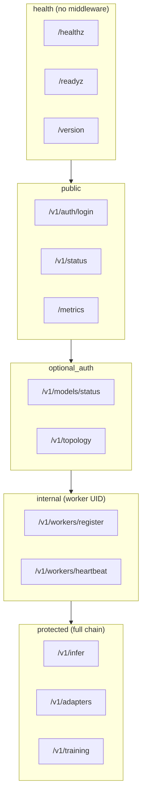

# API_REFERENCE

REST API. Canonical source: `docs/api/openapi.json`, `adapteros-server-api/src/routes/mod.rs`.

---

## Base

| Item | Value |
|------|-------|
| Base URL | `http://127.0.0.1:8080` |
| Prefix | `/v1/` |
| Auth | JWT (Cookie/Authorization) or X-API-Key |

---

## Route Tiers



**Handler registration:** `routes/mod.rs` merges route modules (adapters, auth, chat, tenant, training) and applies middleware per tier.

---

## Key Endpoints

| Path | Method | Handler | Purpose |
|------|--------|---------|---------|
| /healthz | GET | handlers::health | Liveness |
| /readyz | GET | handlers::ready | Readiness (DB, worker, models) |
| /v1/infer | POST | handlers::infer | Inference |
| /v1/infer/stream | POST | streaming_infer::streaming_infer | Streaming inference |
| /v1/models | GET | handlers::models::list_models_with_stats | List models |
| /v1/adapters | GET | handlers::adapters::list_adapters | List adapters |
| /v1/workers | GET | handlers::workers::list_workers | Worker status |
| /v1/adapteros/replay | POST | handlers::adapteros_receipts::adapteros_replay | Replay |
| /v1/chat/completions | POST | openai_compat::chat_completions | OpenAI-compat chat |

---

## Inference Request

```json
{
  "prompt": "Hello",
  "adapter_id": "optional",
  "max_tokens": 128,
  "temperature": 0.7
}
```

**Type:** `adapteros_api_types::InferRequest`. Response: `InferResponse` with `text`, `tokens`, `unavailable_pinned_adapters`.

---

## Spec

```bash
# Generate OpenAPI
cargo run -p adapteros-server -- --generate-openapi

# View
cat docs/api/openapi.json | jq .
```

---

## Errors

See [ERRORS.md](ERRORS.md). Response: `{ "code": "NOT_FOUND", "message": "..." }`.
