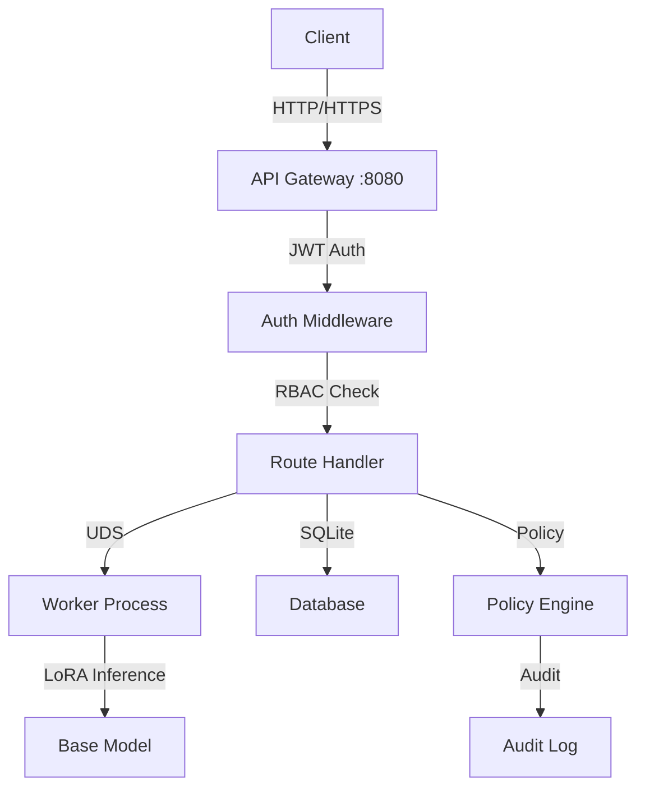
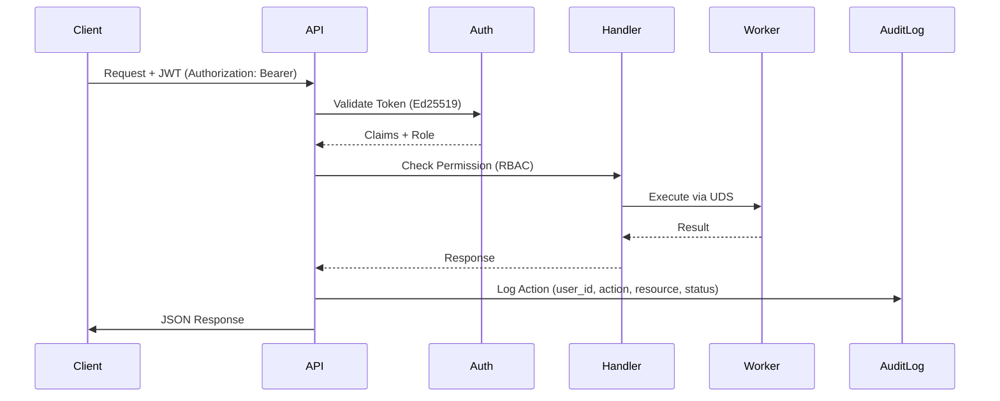
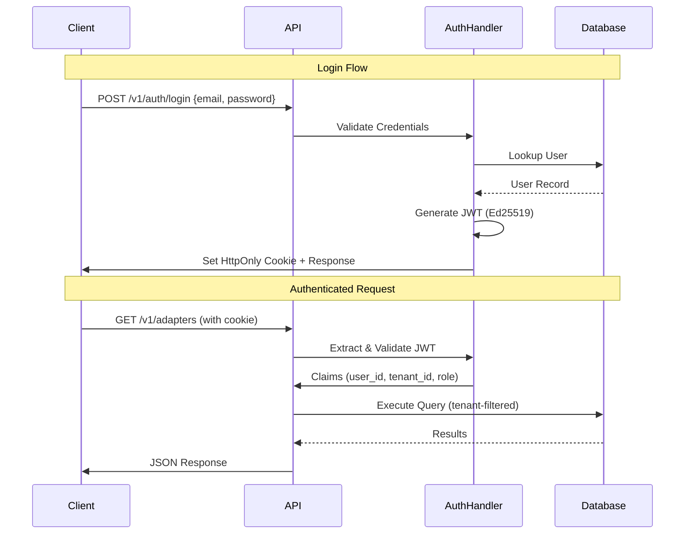

# AdapterOS API Reference

**Version:** 1.0.0
**Last Updated:** 2025-12-11
**Copyright:** 2025 MLNavigator Inc. All rights reserved.

This document provides the complete API reference for AdapterOS, consolidating endpoint documentation, request/response formats, and integration examples.

---

## Table of Contents

1. [Overview](#overview)
2. [Architecture](#architecture)
3. [Authentication](#authentication)
4. [Core Endpoints](#core-endpoints)
5. [LLM Interface](#llm-interface)
6. [Request/Response Formats](#requestresponse-formats)
7. [Examples](#examples)
8. [Error Handling](#error-handling)

---

## Overview

### System Architecture

AdapterOS provides a multi-tenant ML inference platform with the following components:

- **Control Plane** (port 8080): HTTP API with SQLite, JWT auth, policy enforcement
- **Worker Processes**: LoRA inference/training over Unix Domain Sockets (UDS)
- **K-Sparse Router**: Multi-adapter mixing with Q15 quantization
- **Multi-Backend**: CoreML/ANE (primary), Metal, MLX

### API Characteristics

- **Base URL**: `http://localhost:8080` (development)
- **API Version**: v1 (prefix: `/v1/`)
- **Auth**: JWT (Ed25519) with httpOnly cookies
- **Total Endpoints**: ~189 registered routes
- **Architecture**: Single-node, multi-tenant, zero network egress



---

## Architecture

### Request Flow



### API Layers

| Layer | Responsibility |
|-------|----------------|
| **Middleware** | Security headers, rate limiting, CORS, request validation |
| **Auth** | JWT validation, session management, RBAC |
| **Handlers** | Business logic, request routing, response formatting |
| **Services** | Adapter management, training orchestration, inference |
| **Data** | SQLite persistence, KV store, telemetry |

### Key Files

| Component | File Path | Purpose |
|-----------|-----------|---------|
| Routes | `crates/adapteros-server-api/src/routes.rs` | Route definitions |
| Handlers | `crates/adapteros-server-api/src/handlers/` | Endpoint implementations |
| State | `crates/adapteros-server-api/src/state.rs` | AppState + dependency injection |
| Auth | `crates/adapteros-server-api/src/auth.rs` | JWT validation, RBAC |
| Inference | `crates/adapteros-server-api/src/inference_core.rs` | Core inference logic |

---

## Authentication

### Authentication Flow



### Token Details

**JWT Format:**
- **Algorithm**: Ed25519 (EdDSA)
- **TTL**: 8 hours (28800 seconds)
- **Claims**: `user_id`, `tenant_id`, `role`, `permissions`, `admin_tenants`
- **Cookie Name**: `auth_token` (HttpOnly, Secure in prod)

**CSRF Protection:**
- Separate `csrf_token` cookie (HttpOnly=false)
- Validated on state-changing requests

### Endpoints

#### Login

```http
POST /v1/auth/login
Content-Type: application/json

{
  "email": "admin@example.com",
  "password": "password"
}
```

**Response (200 OK):**
```json
{
  "schema_version": "1.0",
  "token": "eyJ...", // Also set in HttpOnly cookie
  "user": {
    "id": "user-123",
    "email": "admin@example.com",
    "role": "admin",
    "tenant_id": "tenant-1"
  },
  "csrf_token": "csrf-abc123"
}
```

**Error Codes:**
- `INVALID_CREDENTIALS` - Wrong email/password
- `ACCOUNT_LOCKED` - Too many failed attempts
- `ACCOUNT_DISABLED` - User deactivated
- `MFA_REQUIRED` - MFA enabled but not provided
- `DATABASE_ERROR` - System error

#### Logout

```http
POST /v1/auth/logout
Authorization: Bearer <token>
```

**Response (200 OK):**
```json
{
  "message": "Logged out successfully"
}
```

Clears `auth_token`, `refresh_token`, and `csrf_token` cookies.

#### Get Current User

```http
GET /v1/auth/me
Authorization: Bearer <token>
```

**Response (200 OK):**
```json
{
  "schema_version": "1.0",
  "id": "user-123",
  "email": "admin@example.com",
  "role": "admin",
  "tenant_id": "tenant-1",
  "permissions": ["adapter.read", "adapter.write", ...],
  "admin_tenants": ["*"]  // "*" in dev mode only
}
```

#### Refresh Token

```http
POST /v1/auth/refresh
Authorization: Bearer <refresh_token>
```

**Response (200 OK):**
```json
{
  "token": "eyJ...",
  "csrf_token": "csrf-xyz789"
}
```

#### Session Management

**List Active Sessions:**
```http
GET /v1/auth/sessions
Authorization: Bearer <token>
```

**Revoke Session:**
```http
DELETE /v1/auth/sessions/{jti}
Authorization: Bearer <token>
```

### RBAC

**5 Roles:**
- **Admin**: Full system access
- **Operator**: Day-to-day operations
- **SRE**: Infrastructure and monitoring
- **Compliance**: Audit and policy review
- **Viewer**: Read-only access

**Permission Format:** `<resource>.<action>`

**Common Permissions:**
- `adapter.read`, `adapter.write`, `adapter.register`
- `training.start`, `training.cancel`
- `policy.view`, `policy.enforce`
- `audit.view`

See [Access Control documentation](ACCESS_CONTROL.md) for complete permission matrix and RBAC details.

---

## Core Endpoints

### Public Endpoints (No Auth)

| Method | Path | Description |
|--------|------|-------------|
| GET | `/healthz` | Basic health check |
| GET | `/healthz/all` | All components health |
| GET | `/healthz/{component}` | Specific component health |
| GET | `/readyz` | Readiness probe |
| POST | `/v1/auth/login` | User login |
| POST | `/v1/auth/bootstrap` | Bootstrap admin (one-time) |
| POST | `/v1/auth/dev-bypass` | Dev bypass (debug builds only) |
| GET | `/v1/meta` | API metadata |
| GET | `/swagger-ui` | Swagger UI |
| GET | `/api-docs/openapi.json` | OpenAPI spec |

### Tenant Management

**List Tenants:**
```http
GET /v1/tenants
Authorization: Bearer <token>
```

**Response:**
```json
[
  {
    "schema_version": "1.0",
    "id": "tenant-1",
    "name": "acme-corp",
    "itar_flag": false,
    "created_at": "2025-11-25 10:00:00",
    "status": "active",
    "max_adapters": 50,
    "max_training_jobs": 5,
    "max_storage_gb": 100.0,
    "rate_limit_rpm": 500
  }
]
```

**Create Tenant (Admin only):**
```http
POST /v1/tenants
Authorization: Bearer <admin_token>
Content-Type: application/json

{
  "name": "startup-inc",
  "itar_flag": false
}
```

**Update Tenant:**
```http
PUT /v1/tenants/{tenant_id}
Authorization: Bearer <admin_token>
Content-Type: application/json

{
  "max_adapters": 25,
  "max_training_jobs": 3,
  "rate_limit_rpm": 300
}
```

**Tenant Operations:**
- `POST /v1/tenants/{tenant_id}/pause` - Pause tenant
- `POST /v1/tenants/{tenant_id}/archive` - Archive tenant
- `POST /v1/tenants/{tenant_id}/policies` - Assign policies
- `POST /v1/tenants/{tenant_id}/adapters` - Assign adapters
- `GET /v1/tenants/{tenant_id}/usage` - Usage statistics

### Adapter Management

**List Adapters:**
```http
GET /v1/adapters?tier=1&framework=pytorch
Authorization: Bearer <token>
```

**Response:**
```json
[
  {
    "id": "adapter-abc123",
    "name": "my-custom-adapter",
    "tenant_id": "tenant-1",
    "tier": 1,
    "framework": "pytorch",
    "load_state": "loaded",
    "lifecycle_stage": "production",
    "created_at": "2025-11-20T10:30:00Z"
  }
]
```

**Get Adapter:**
```http
GET /v1/adapters/{adapter_id}
Authorization: Bearer <token>
```

**Register Adapter:**
```http
POST /v1/adapters/register
Authorization: Bearer <token>
Content-Type: application/json

{
  "name": "customer-support-v2",
  "description": "Fine-tuned for customer support",
  "framework": "pytorch",
  "base_model": "qwen2.5-7b",
  "lora_rank": 16
}
```

**Import Adapter:**
```http
POST /v1/adapters/import
Authorization: Bearer <token>
Content-Type: multipart/form-data

file=@adapter.aos
```

**Adapter Operations:**
- `POST /v1/adapters/{adapter_id}/load` - Load adapter into memory
- `POST /v1/adapters/{adapter_id}/unload` - Unload adapter
- `DELETE /v1/adapters/{adapter_id}` - Delete adapter
- `GET /v1/adapters/{adapter_id}/activations` - Activation history
- `GET /v1/adapters/{adapter_id}/lineage` - Lineage tree
- `GET /v1/adapters/{adapter_id}/manifest` - Download manifest
- `GET /v1/adapters/{adapter_id}/health` - Health status

**Lifecycle Management:**
- `POST /v1/adapters/{adapter_id}/lifecycle/promote` - Promote stage
- `POST /v1/adapters/{adapter_id}/lifecycle/demote` - Demote stage

**Pinning:**
- `GET /v1/adapters/{adapter_id}/pin` - Get pin status
- `POST /v1/adapters/{adapter_id}/pin` - Pin adapter (prevent eviction)
- `DELETE /v1/adapters/{adapter_id}/pin` - Unpin adapter

### Inference

**Single Inference:**
```http
POST /v1/infer
Authorization: Bearer <token>
Content-Type: application/json

{
  "prompt": "What is the capital of France?",
  "adapter_ids": ["adapter-abc123"],
  "max_tokens": 100,
  "temperature": 0.7,
  "top_p": 0.9
}
```

**Response:**
```json
{
  "text": "The capital of France is Paris.",
  "tokens": 7,
  "adapters_used": ["adapter-abc123"],
  "evidence": [],
  "latency_ms": 342,
  "trace_id": "trace-xyz789",
  "cpid": "cp-20251211-abc"
}
```

**Streaming Inference (SSE):**
```http
POST /v1/infer/stream
Authorization: Bearer <token>
Content-Type: application/json

{
  "prompt": "Write a haiku about coding",
  "max_tokens": 50
}
```

**SSE Stream:**
```
event: chunk
data: {"text": "Lines", "index": 0}

event: chunk
data: {"text": " of", "index": 1}

event: done
data: {"total_tokens": 15, "latency_ms": 450}
```

**Batch Inference:**
```http
POST /v1/infer/batch
Authorization: Bearer <token>
Content-Type: application/json

{
  "prompts": [
    "Translate to French: Hello",
    "Translate to Spanish: Hello"
  ],
  "max_tokens": 20
}
```

### Training

**List Training Jobs:**
```http
GET /v1/training/jobs?status=running&limit=50
Authorization: Bearer <token>
```

**Get Training Job:**
```http
GET /v1/training/jobs/{job_id}
Authorization: Bearer <token>
```

**Response:**
```json
{
  "job_id": "job-123",
  "adapter_id": "adapter-new",
  "status": "running",
  "progress": 0.45,
  "created_at": "2025-12-11T09:00:00Z",
  "epochs_completed": 3,
  "epochs_total": 10,
  "loss": 0.023
}
```

**Start Training:**
```http
POST /v1/training/start
Authorization: Bearer <token>
Content-Type: application/json

{
  "adapter_name": "custom-adapter-v3",
  "dataset_id": "dataset-456",
  "base_model": "qwen2.5-7b",
  "epochs": 5,
  "learning_rate": 0.0001,
  "lora_rank": 16,
  "lora_alpha": 32
}
```

**Cancel Training:**
```http
POST /v1/training/jobs/{job_id}/cancel
Authorization: Bearer <token>
```

**Training Operations:**
- `GET /v1/training/jobs/{job_id}/logs` - Job logs
- `GET /v1/training/jobs/{job_id}/metrics` - Training metrics
- `GET /v1/training/jobs/{job_id}/artifacts` - Output artifacts
- `GET /v1/training/templates` - List templates
- `GET /v1/training/templates/{template_id}` - Get template

### Datasets

**Upload Dataset:**
```http
POST /v1/datasets/upload
Authorization: Bearer <token>
Content-Type: multipart/form-data

file=@training_data.jsonl
name=customer-support-qa
```

**Chunked Upload (Large Files):**

1. **Initiate:**
```http
POST /v1/datasets/chunked-upload/initiate
Authorization: Bearer <token>
Content-Type: application/json

{
  "filename": "large_dataset.jsonl",
  "total_size": 524288000,
  "chunk_size": 5242880
}
```

2. **Upload Chunks:**
```http
POST /v1/datasets/chunked-upload/{session_id}/chunk
Authorization: Bearer <token>
Content-Type: application/octet-stream

<binary chunk data>
```

3. **Complete:**
```http
POST /v1/datasets/chunked-upload/{session_id}/complete
Authorization: Bearer <token>
```

**Dataset Operations:**
- `GET /v1/datasets` - List datasets
- `GET /v1/datasets/{dataset_id}` - Get dataset
- `DELETE /v1/datasets/{dataset_id}` - Delete dataset
- `GET /v1/datasets/{dataset_id}/files` - List files
- `GET /v1/datasets/{dataset_id}/statistics` - Statistics
- `POST /v1/datasets/{dataset_id}/validate` - Validate format
- `GET /v1/datasets/{dataset_id}/preview` - Preview samples

### Models

**Get Base Model Status:**
```http
GET /v1/models/status
Authorization: Bearer <token>
```

**Response:**
```json
{
  "model_id": "qwen2.5-7b-4bit",
  "status": "ready",  // no-model, loading, ready, unloading, error, checking
  "backend": "mlx",
  "memory_mb": 4096,
  "loaded_at": "2025-12-11T08:00:00Z"
}
```

**Model Status Values:**
- `no-model` - No model loaded
- `loading` - Model loading in progress
- `ready` - Model ready for inference
- `unloading` - Model unloading
- `error` - Load/unload error
- `checking` - Health check in progress

**Model Operations:**
- `POST /v1/models/import` - Import model
- `POST /v1/models/{model_id}/load` - Load model
- `POST /v1/models/{model_id}/unload` - Unload model
- `GET /v1/models/{model_id}/status` - Get status
- `GET /v1/models/{model_id}/validate` - Validate model

**Note:** Router only allows inference when status is `ready`, otherwise returns 503 `MODEL_NOT_READY`.

### Workers & Nodes

**List Workers:**
```http
GET /v1/workers
Authorization: Bearer <token>
```

**Spawn Worker:**
```http
POST /v1/workers/spawn
Authorization: Bearer <token>
Content-Type: application/json

{
  "model_id": "qwen2.5-7b",
  "backend": "mlx"
}
```

**Worker Operations:**
- `GET /v1/workers/{worker_id}/logs` - Worker logs
- `GET /v1/workers/{worker_id}/crashes` - Crash reports
- `POST /v1/workers/{worker_id}/debug` - Debug session
- `POST /v1/workers/{worker_id}/troubleshoot` - Troubleshoot
- `POST /v1/workers/{worker_id}/stop` - Stop worker

**Node Operations:**
- `GET /v1/nodes` - List nodes
- `POST /v1/nodes/register` - Register node
- `POST /v1/nodes/{node_id}/ping` - Test connection
- `POST /v1/nodes/{node_id}/offline` - Mark offline
- `DELETE /v1/nodes/{node_id}` - Evict node
- `GET /v1/nodes/{node_id}/details` - Node details

### Metrics & Monitoring

**Prometheus Metrics:**
```http
GET /v1/metrics
Authorization: Bearer <metrics_token>
```

**Metrics Endpoints:**
- `GET /v1/metrics/quality` - Quality metrics
- `GET /v1/metrics/adapters` - Adapter metrics
- `GET /v1/metrics/system` - System metrics
- `GET /v1/metrics/snapshot` - Point-in-time snapshot
- `GET /v1/metrics/series` - Time series data

**Key Metrics:**
- `adapteros_model_load_success_total` - Successful model loads
- `adapteros_model_load_failure_total` - Failed model loads
- `adapteros_model_loaded` - Current loaded state (0 or 1)
- `adapteros_model_unload_success_total` - Successful unloads
- `adapteros_model_unload_failure_total` - Failed unloads

**Monitoring:**
- `GET /v1/monitoring/rules` - List monitoring rules
- `POST /v1/monitoring/rules` - Create rule
- `GET /v1/monitoring/alerts` - List alerts
- `POST /v1/monitoring/alerts/{alert_id}/acknowledge` - Ack alert
- `GET /v1/monitoring/dashboards` - List dashboards

### Telemetry & Audit

**Query Audit Logs:**
```http
GET /v1/audit/logs?action=adapter.load&limit=100&offset=0
Authorization: Bearer <token>
```

**Response:**
```json
[
  {
    "id": "audit-123",
    "timestamp": "2025-12-11T10:30:00Z",
    "user_id": "user-456",
    "action": "adapter.load",
    "resource_type": "adapter",
    "resource_id": "adapter-abc",
    "status": "success",
    "tenant_id": "tenant-1"
  }
]
```

**Telemetry:**
- `GET /v1/telemetry/bundles` - List telemetry bundles
- `GET /v1/telemetry/bundles/{bundle_id}/export` - Export bundle
- `POST /v1/telemetry/bundles/{bundle_id}/verify` - Verify signature
- `POST /v1/telemetry/bundles/purge` - Purge old bundles

**Traces & Logs:**
- `GET /v1/traces/search` - Search traces
- `GET /v1/traces/{trace_id}` - Get trace
- `GET /v1/logs/query` - Query logs
- `GET /v1/logs/stream` - Stream logs (SSE)

### SSE Streaming Endpoints

All streaming endpoints use Server-Sent Events (SSE) and require authentication.

| Path | Description |
|------|-------------|
| `/v1/streams/training` | Training events |
| `/v1/streams/discovery` | Discovery events |
| `/v1/streams/contacts` | Contacts events |
| `/v1/streams/file-changes` | File change notifications |
| `/v1/stream/metrics` | System metrics stream |
| `/v1/stream/telemetry` | Telemetry events |
| `/v1/stream/adapters` | Adapter state changes |

**Example SSE Connection:**
```javascript
const eventSource = new EventSource('/v1/stream/metrics', {
  headers: {
    'Authorization': `Bearer ${token}`
  }
});

eventSource.onmessage = (event) => {
  const data = JSON.parse(event.data);
  console.log('Metric:', data);
};
```

---

## LLM Interface

### Overview

The LLM interface specification defines how the base language model interacts with the AdapterOS runtime. This enables:
- Function calling for retrieval and computation
- Signal-based adapter activation
- Evidence-grounded responses
- Policy enforcement

### Core Interface

```typescript
interface LLMRuntime {
  // Inference entry point
  async generate(request: GenerateRequest): Promise<GenerateResponse>;

  // Streaming variant
  async generateStream(request: GenerateRequest): AsyncIterator<StreamChunk>;

  // Adapter management
  async loadAdapter(adapterId: string): Promise<AdapterHandle>;
  async unloadAdapter(adapterId: string): Promise<void>;
}

interface GenerateRequest {
  prompt: string;
  tenantId: string;
  cpid: string;  // Control Plane ID
  maxTokens: number;
  temperature: number;
  topP: number;

  // Policy constraints
  policyContext: PolicyContext;
  requireEvidence: boolean;
  minEvidenceSpans: number;
}

interface GenerateResponse {
  text: string;
  tokens: number;
  adaptersUsed: AdapterActivation[];
  evidence: EvidenceSpan[];
  latencyMs: number;
  traceId: string;
}
```

### Function Catalog

#### Retrieval Functions

**retrieve_evidence** - Semantic search over knowledge base:
```typescript
async function retrieve_evidence(params: {
  query: string;
  topK: number;
  filters?: {
    docType?: string[];
    dateRange?: [Date, Date];
  };
}): Promise<{
  spans: EvidenceSpan[];
  retrievalTimeMs: number;
}>;
```

**retrieve_by_id** - Direct document retrieval:
```typescript
async function retrieve_by_id(params: {
  docId: string;
  revision?: string;
  spanIds?: string[];
}): Promise<{
  document: Document;
  spans: EvidenceSpan[];
}>;
```

**search_code** - Code repository search:
```typescript
async function search_code(params: {
  query: string;
  language?: string[];
  repoId?: string;
  maxResults: number;
}): Promise<{
  results: CodeMatch[];
}>;
```

#### Computation Functions

**calculate** - Mathematical computations:
```typescript
async function calculate(params: {
  expression: string;
  units?: {
    input: Record<string, string>;
    output: string;
  };
  precision?: number;
}): Promise<{
  result: number;
  units: string;
  steps?: string[];
}>;
```

**convert_units** - Unit conversion:
```typescript
async function convert_units(params: {
  value: number;
  fromUnit: string;
  toUnit: string;
}): Promise<{
  value: number;
}>;
```

#### State Functions

**store_context** - Store session context:
```typescript
async function store_context(params: {
  key: string;
  value: any;
  scope: 'session' | 'turn' | 'persistent';
  ttl?: number;
}): Promise<{
  stored: boolean;
  contextId: string;
}>;
```

**retrieve_context** - Retrieve stored context:
```typescript
async function retrieve_context(params: {
  key: string;
  scope: 'session' | 'turn' | 'persistent';
}): Promise<{
  value: any;
  timestamp: Date;
}>;
```

#### Policy Functions

**check_policy** - Query policy constraints:
```typescript
async function check_policy(params: {
  action: string;
  resource?: string;
  context?: Record<string, any>;
}): Promise<{
  allowed: boolean;
  reason?: string;
  alternatives?: string[];
}>;
```

**should_refuse** - Determine if query should be refused:
```typescript
async function should_refuse(params: {
  query: string;
  evidence: EvidenceSpan[];
  confidence: number;
}): Promise<{
  refuse: boolean;
  reason?: string;
  suggestedQuestions?: string[];
}>;
```

### Signal Protocol

Signals are lightweight notifications from LLM to runtime:

```typescript
enum SignalType {
  // Adapter routing
  ADAPTER_REQUEST = 'adapter.request',
  ADAPTER_ACTIVATE = 'adapter.activate',

  // Evidence
  EVIDENCE_REQUIRED = 'evidence.required',
  EVIDENCE_CITE = 'evidence.cite',
  EVIDENCE_INSUFFICIENT = 'evidence.insufficient',

  // Policy
  POLICY_CHECK = 'policy.check',
  REFUSAL_INTENT = 'refusal.intent',

  // State
  CONTEXT_SAVE = 'context.save',
  CHECKPOINT_REQUEST = 'checkpoint.request',
}

interface Signal {
  type: SignalType;
  timestamp: Date;
  payload: Record<string, any>;
  priority: 'low' | 'normal' | 'high' | 'critical';
}
```

**Example Usage:**
```typescript
// Request specific adapters
emit_signal({
  type: SignalType.ADAPTER_REQUEST,
  payload: {
    requestedAdapters: ['aviation_maintenance', 'boeing_737'],
    reason: 'maintenance_procedure_query',
  },
  priority: 'normal',
  timestamp: new Date()
});

// Cite evidence
emit_signal({
  type: SignalType.EVIDENCE_CITE,
  payload: {
    spanId: 'doc_123:span_456',
    textPosition: { start: 150, end: 175 },
    citationType: 'direct'
  },
  priority: 'normal',
  timestamp: new Date()
});
```

### Determinism & Constraints

**Key Principles:**
1. **Determinism First**: Same inputs + CPID → Same outputs
2. **Zero Egress**: No network access during inference
3. **Policy Enforcement**: All operations subject to tenant policies
4. **Evidence Traceability**: Every claim must cite sources

**Security Constraints:**
- No network operations (`fetch`, `WebSocket`, etc.)
- Tenant data isolation enforced
- All tool executions logged
- BLAKE3 hashing for integrity

---

## Request/Response Formats

### Standard Response Format

All API responses follow this structure:

```json
{
  "schema_version": "1.0",
  "data": { ... },
  "metadata": {
    "request_id": "req-abc123",
    "timestamp": "2025-12-11T10:30:00Z"
  }
}
```

### Error Response Format

```json
{
  "schema_version": "1.0",
  "error": "Detailed error message",
  "code": "ERROR_CODE",
  "details": "Additional context",
  "request_id": "req-abc123"
}
```

### Common Error Codes

#### Authentication Errors
- `INVALID_CREDENTIALS` - Wrong username/password
- `MFA_REQUIRED` - MFA needed but not provided
- `INVALID_MFA_CODE` - Incorrect MFA code
- `ACCOUNT_LOCKED` - Too many failed attempts
- `ACCOUNT_DISABLED` - Account deactivated
- `SESSION_EXPIRED` - JWT token expired
- `UNAUTHORIZED` - Not authenticated

#### Authorization Errors
- `FORBIDDEN` - Insufficient permissions
- `NO_TENANT_ACCESS` - No access to tenant
- `TENANT_ACCESS_DENIED` - Cross-tenant access denied

#### Validation Errors
- `VALIDATION_ERROR` - Request validation failed
- `WEAK_PASSWORD` - Password doesn't meet requirements
- `INVALID_MFA_CODE` - MFA code format invalid

#### Inference Errors
- `MODEL_NOT_READY` - Model not loaded (status != ready)
- `NO_COMPATIBLE_WORKER` - No workers available
- `BACKPRESSURE` - System overloaded
- `REQUEST_TIMEOUT` - Request took too long
- `ADAPTER_NOT_FOUND` - Adapter doesn't exist
- `ADAPTER_NOT_LOADABLE` - Adapter can't be loaded
- `POLICY_HOOK_VIOLATION` - Policy check failed
- `RAG_ERROR` - Retrieval error
- `ROUTING_CHAIN_ERROR` - Router error

#### System Errors
- `DATABASE_ERROR` - Database operation failed
- `INTERNAL_ERROR` - Unspecified internal error
- `NOT_FOUND` - Resource not found
- `SERVICE_UNAVAILABLE` - Service unavailable (503)

### Pagination

**Offset-based (most endpoints):**
```http
GET /v1/audit/logs?limit=50&offset=100
```

**Response includes:**
```json
{
  "data": [...],
  "pagination": {
    "limit": 50,
    "offset": 100,
    "total": 1234
  }
}
```

### Filtering

**Common query parameters:**
- `limit` - Max results (default: 100, max: 1000)
- `offset` - Skip N results (default: 0)
- `sort` - Sort field (e.g., `created_at`)
- `order` - Sort order (`asc` or `desc`)

**Resource-specific filters:**
```http
GET /v1/adapters?tier=1&framework=pytorch&status=loaded
GET /v1/training/jobs?status=running&created_after=2025-12-01
GET /v1/audit/logs?action=adapter.load&user_id=user-123
```

---

## Examples

### Complete Workflow: Train and Deploy Adapter

```bash
#!/bin/bash
set -e

BASE_URL="http://localhost:8080"
TOKEN="your-jwt-token"

# 1. Upload training dataset
echo "Uploading dataset..."
DATASET_ID=$(curl -X POST "$BASE_URL/v1/datasets/upload" \
  -H "Authorization: Bearer $TOKEN" \
  -F "file=@training_data.jsonl" \
  -F "name=customer-support-v1" \
  | jq -r '.id')

echo "Dataset ID: $DATASET_ID"

# 2. Start training job
echo "Starting training..."
JOB_ID=$(curl -X POST "$BASE_URL/v1/training/start" \
  -H "Authorization: Bearer $TOKEN" \
  -H "Content-Type: application/json" \
  -d '{
    "adapter_name": "customer-support-adapter",
    "dataset_id": "'$DATASET_ID'",
    "base_model": "qwen2.5-7b",
    "epochs": 3,
    "learning_rate": 0.0001,
    "lora_rank": 16
  }' \
  | jq -r '.job_id')

echo "Job ID: $JOB_ID"

# 3. Poll training status
echo "Waiting for training to complete..."
while true; do
  STATUS=$(curl -s "$BASE_URL/v1/training/jobs/$JOB_ID" \
    -H "Authorization: Bearer $TOKEN" \
    | jq -r '.status')

  if [ "$STATUS" = "completed" ]; then
    echo "Training completed!"
    break
  elif [ "$STATUS" = "failed" ]; then
    echo "Training failed!"
    exit 1
  fi

  echo "Status: $STATUS"
  sleep 10
done

# 4. Get adapter ID
ADAPTER_ID=$(curl -s "$BASE_URL/v1/training/jobs/$JOB_ID" \
  -H "Authorization: Bearer $TOKEN" \
  | jq -r '.adapter_id')

echo "Adapter ID: $ADAPTER_ID"

# 5. Load adapter
echo "Loading adapter..."
curl -X POST "$BASE_URL/v1/adapters/$ADAPTER_ID/load" \
  -H "Authorization: Bearer $TOKEN"

# 6. Run inference
echo "Running inference..."
curl -X POST "$BASE_URL/v1/infer" \
  -H "Authorization: Bearer $TOKEN" \
  -H "Content-Type: application/json" \
  -d '{
    "prompt": "How do I reset my password?",
    "adapter_ids": ["'$ADAPTER_ID'"],
    "max_tokens": 100
  }' \
  | jq '.text'

echo "Deployment complete!"
```

### Streaming Inference with JavaScript

```javascript
async function streamInference(prompt) {
  const response = await fetch('http://localhost:8080/v1/infer/stream', {
    method: 'POST',
    headers: {
      'Authorization': `Bearer ${token}`,
      'Content-Type': 'application/json'
    },
    body: JSON.stringify({
      prompt,
      max_tokens: 200,
      temperature: 0.7
    })
  });

  const reader = response.body.getReader();
  const decoder = new TextDecoder();
  let buffer = '';

  while (true) {
    const { done, value } = await reader.read();
    if (done) break;

    buffer += decoder.decode(value, { stream: true });
    const lines = buffer.split('\n');
    buffer = lines.pop(); // Keep incomplete line in buffer

    for (const line of lines) {
      if (line.startsWith('data: ')) {
        const data = JSON.parse(line.slice(6));

        if (data.text) {
          process.stdout.write(data.text);
        }

        if (data.done) {
          console.log('\nDone! Total tokens:', data.total_tokens);
        }
      }
    }
  }
}

streamInference('Write a haiku about machine learning');
```

### TypeScript Client SDK

```typescript
class AdapterOSClient {
  constructor(
    private baseURL: string,
    private token: string
  ) {}

  async login(email: string, password: string) {
    const response = await fetch(`${this.baseURL}/v1/auth/login`, {
      method: 'POST',
      headers: { 'Content-Type': 'application/json' },
      body: JSON.stringify({ email, password })
    });

    const data = await response.json();
    this.token = data.token;
    return data;
  }

  async listAdapters(filters?: { tier?: number; framework?: string }) {
    const params = new URLSearchParams();
    if (filters?.tier) params.set('tier', String(filters.tier));
    if (filters?.framework) params.set('framework', filters.framework);

    const response = await fetch(
      `${this.baseURL}/v1/adapters?${params}`,
      {
        headers: { 'Authorization': `Bearer ${this.token}` }
      }
    );

    return response.json();
  }

  async infer(request: {
    prompt: string;
    adapterIds?: string[];
    maxTokens?: number;
  }) {
    const response = await fetch(`${this.baseURL}/v1/infer`, {
      method: 'POST',
      headers: {
        'Authorization': `Bearer ${this.token}`,
        'Content-Type': 'application/json'
      },
      body: JSON.stringify({
        prompt: request.prompt,
        adapter_ids: request.adapterIds || [],
        max_tokens: request.maxTokens || 100
      })
    });

    return response.json();
  }

  async startTraining(request: {
    adapterName: string;
    datasetId: string;
    baseModel: string;
    epochs: number;
  }) {
    const response = await fetch(`${this.baseURL}/v1/training/start`, {
      method: 'POST',
      headers: {
        'Authorization': `Bearer ${this.token}`,
        'Content-Type': 'application/json'
      },
      body: JSON.stringify({
        adapter_name: request.adapterName,
        dataset_id: request.datasetId,
        base_model: request.baseModel,
        epochs: request.epochs
      })
    });

    return response.json();
  }
}

// Usage
const client = new AdapterOSClient('http://localhost:8080', '');
await client.login('admin@example.com', 'password');

const adapters = await client.listAdapters({ tier: 1 });
console.log('Adapters:', adapters);

const result = await client.infer({
  prompt: 'Hello, world!',
  maxTokens: 50
});
console.log('Response:', result.text);
```

---

## Error Handling

### Retry Strategy

```typescript
async function withRetry<T>(
  fn: () => Promise<T>,
  maxAttempts = 3,
  backoffMs = 1000
): Promise<T> {
  let lastError: Error;

  for (let attempt = 1; attempt <= maxAttempts; attempt++) {
    try {
      return await fn();
    } catch (error) {
      lastError = error as Error;

      // Don't retry on client errors (4xx)
      if (error.status >= 400 && error.status < 500) {
        throw error;
      }

      if (attempt < maxAttempts) {
        const delay = backoffMs * Math.pow(2, attempt - 1);
        console.log(`Retry attempt ${attempt} after ${delay}ms`);
        await new Promise(resolve => setTimeout(resolve, delay));
      }
    }
  }

  throw lastError!;
}

// Usage
const result = await withRetry(
  () => client.infer({ prompt: 'Hello' }),
  3,
  1000
);
```

### Error Response Handling

```typescript
async function handleAPIError(response: Response) {
  if (!response.ok) {
    const error = await response.json();

    switch (error.code) {
      case 'SESSION_EXPIRED':
        // Refresh token and retry
        await refreshToken();
        return retryRequest();

      case 'MODEL_NOT_READY':
        // Wait for model to load
        await waitForModel();
        return retryRequest();

      case 'BACKPRESSURE':
        // Exponential backoff
        const retryAfter = response.headers.get('Retry-After');
        await sleep(parseInt(retryAfter) * 1000);
        return retryRequest();

      case 'VALIDATION_ERROR':
        // Don't retry, fix request
        throw new Error(`Validation failed: ${error.details}`);

      default:
        throw new Error(`API error: ${error.code} - ${error.error}`);
    }
  }

  return response.json();
}
```

### Health Check Integration

```typescript
async function waitForService(timeout = 60000) {
  const start = Date.now();

  while (Date.now() - start < timeout) {
    try {
      const response = await fetch('http://localhost:8080/readyz');

      if (response.ok) {
        console.log('Service is ready');
        return true;
      }
    } catch (error) {
      // Service not available yet
    }

    await new Promise(resolve => setTimeout(resolve, 1000));
  }

  throw new Error('Service did not become ready within timeout');
}

// Usage before running tests
await waitForService();
```

---

## Appendices

### Middleware Stack

Applied in order (outermost to innermost):

1. **client_ip_middleware** - Extract client IP
2. **security_headers_middleware** - CSP, X-Frame-Options, etc.
3. **request_size_limit_middleware** - Body size limits
4. **rate_limiting_middleware** - Per-tenant rate limits
5. **cors_layer** - CORS configuration
6. **TraceLayer** - HTTP request tracing
7. **auth_middleware** - JWT validation (protected routes only)

### Security Headers

All responses include:
- `Content-Security-Policy`
- `X-Frame-Options: DENY`
- `X-Content-Type-Options: nosniff`
- `Referrer-Policy: strict-origin-when-cross-origin`
- `Permissions-Policy` (restrictive)

### Rate Limiting

**Headers:**
- `X-RateLimit-Remaining` - Requests remaining
- `X-RateLimit-Reset` - Unix timestamp of reset
- `X-RateLimit-Limit` - Total limit
- `Retry-After` - Seconds until retry (when exceeded)

**Default Limits:**
- Per tenant: 1000 requests/minute
- Configurable via tenant settings

### API Statistics

| Category | Count |
|----------|-------|
| Total Endpoints | ~189 |
| Public Endpoints | 8 |
| Protected Endpoints | ~181 |
| SSE Streams | 7 |
| Handler Modules | 31 |

### Related Documentation

- [CLAUDE.md](../CLAUDE.md) - Development guide
- [ACCESS_CONTROL.md](ACCESS_CONTROL.md) - Access control (RBAC + tenant isolation)
- [POLICIES.md](POLICIES.md) - Policy enforcement
- [TELEMETRY_EVENTS.md](TELEMETRY_EVENTS.md) - Event tracking
- [API_GUIDES.md](API_GUIDES.md) - Workflow guides

---

**Document Version:** 1.0.0
**Last Updated:** 2025-12-11
**Maintained By:** MLNavigator Inc

For questions or support:
- Documentation: https://docs.adapteros.com
- Issues: GitHub Issues
- Security: security@adapteros.com
