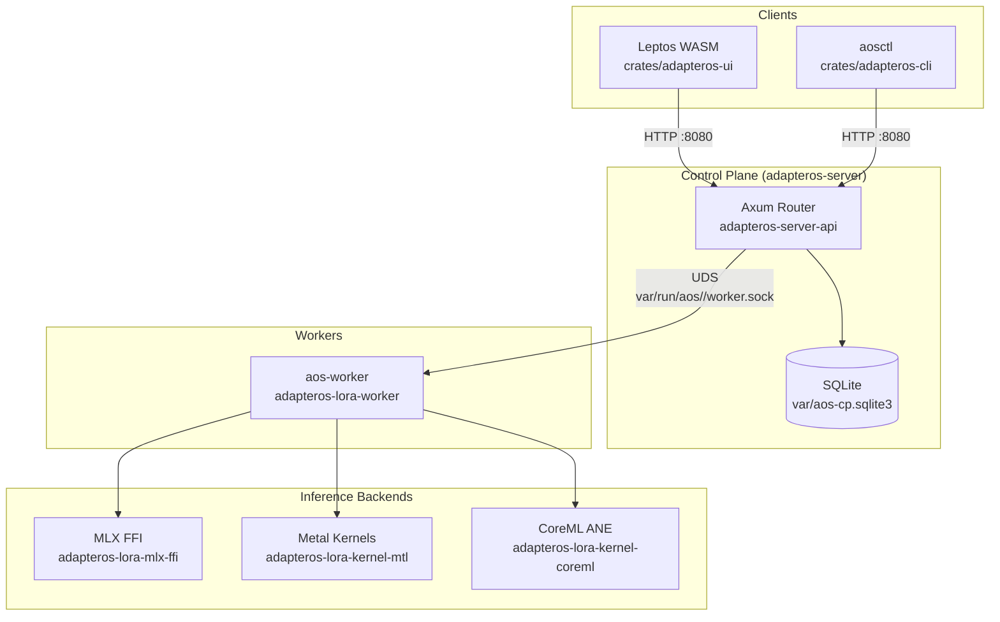
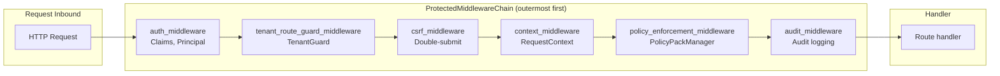
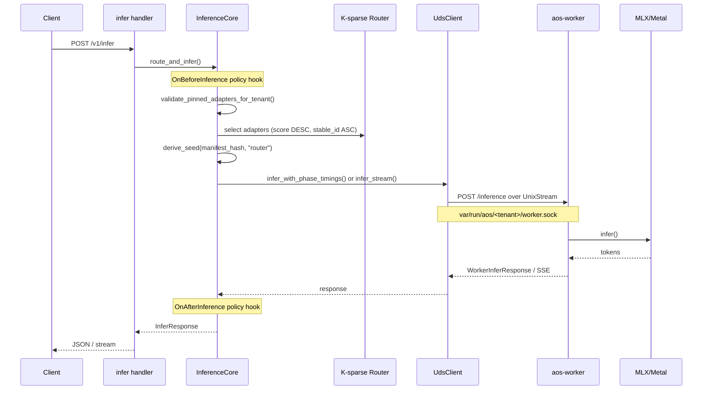
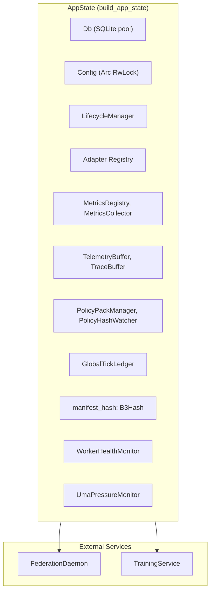
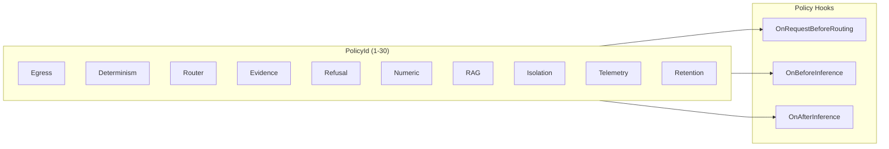

# ARCHITECTURE

adapterOS control plane and worker topology. Code is authoritative.

---

## Topology

**Key paths:**
- Control plane: `crates/adapteros-server/src/main.rs`
- API routes: `crates/adapteros-server-api/src/routes/mod.rs`
- Worker socket: `adapteros-core::defaults::DEFAULT_WORKER_SOCKET_PROD_ROOT` = `var/run/aos`

---

## Boot Sequence

Phases run via `StartupOrchestrator::run_phase()`. Source: `adapteros-server/src/main.rs`.

```mermaid
flowchart TD
    subgraph Phase1["Phase 1: Config"]
        P1["initialize_config()<br/>ConfigContext"]
    end

    subgraph Phase2["Phase 2: Security"]
        P2["initialize_security()<br/>security_init"]
    end

    subgraph Phase3["Phase 3: Executor"]
        P3["initialize_executor()<br/>executor_init"]
        P3b["determinism_seed<br/>manifest_hash gate"]
    end

    subgraph Phase4["Phase 4: Preflight & Invariants"]
        P4["run_preflight_checks()"]
        P4b["validate_boot_invariants()<br/>invariants"]
        P4c["check_model_server_readiness()"]
    end

    subgraph Phase5["Phase 5-6: Database"]
        P5["initialize_database()<br/>db_connect"]
        P6["run_migrations()<br/>migrations"]
        P6b["validate_post_db_invariants()"]
    end

    subgraph Phase7["Phase 7: Recovery"]
        P7["run_startup_recovery()<br/>orphaned jobs, adapters"]
    end

    subgraph Phase8["Phase 8-9: Router & Federation"]
        P8["build_api_config()<br/>router_build"]
        P9["initialize_federation()"]
        P9b["initialize_metrics()"]
    end

    subgraph Phase10["Phase 10: AppState"]
        P10["build_app_state()<br/>WorkerHealthMonitor, LifecycleManager"]
        P10b["spawn_all_background_tasks()<br/>worker_attach"]
    end

    subgraph Phase11["Phase 11-12: Bind"]
        P11["ensure_runtime_gates_ready()<br/>replay_ready"]
        P12["bind_and_serve()"]
    end

    P1 --> P2 --> P3 --> P3b --> P4 --> P4b --> P4c --> P5 --> P6 --> P6b
    P6b --> P7 --> P8 --> P9 --> P9b --> P10 --> P10b --> P11 --> P12
```

**Failure codes:** `adapteros-server-api::boot_state::failure_codes` (e.g. `SECURITY_INIT_FAILED`, `DB_CONN_FAILED`, `WORKER_ATTACH_FAILED`).

---

## Request Path: Middleware Chain

Order enforced at compile time via type-state pattern. Source: `adapteros-server-api/src/middleware/chain_builder.rs`.

**Type states:** `NeedsAuth` → `NeedsTenantGuard` → `NeedsCsrf` → `NeedsContext` → `NeedsPolicy` → `NeedsAudit` → `Complete`.

**Route tiers:**
- `health`: `/healthz`, `/readyz`, `/version` (no middleware)
- `public`: `/v1/auth/login`, `/v1/status`, `/metrics`, etc.
- `optional_auth`: `/v1/models/status`, `/v1/topology`
- `internal`: `/v1/workers/register`, `/v1/workers/heartbeat` (worker UID, skip tenant guard)
- `protected`: full chain above

---

## Inference Flow

End-to-end path from HTTP to tokens. Source: `adapteros-server-api/src/inference_core/core.rs`, `adapteros-server-api/src/uds_client.rs`.

**Key types:**
- `InferenceCore::route_and_infer()` — main entry
- `WorkerInferRequest` / `WorkerInferResponse` — UDS payload
- `UdsClient::infer_with_phase_timings()` — sync inference
- `UdsClient::infer_stream()` — streaming

---

## AppState

Central services in `AppState`. Source: `adapteros-server-api/src/state.rs`, `adapteros-server/src/boot/app_state.rs`.

---

## Policy Packs

30 packs, enforced in order. Source: `adapteros-policy/src/registry.rs`, `PolicyId`.

**Enforcement:** `policy_enforcement_middleware` → `PolicyPackManager` → hooks. See [POLICIES.md](POLICIES.md).

---

## Crates

| Crate | Role | Key Modules |
|-------|------|-------------|
| adapteros-server | CP entry, boot | `main.rs`, `boot/` |
| adapteros-server-api | Routes, handlers, middleware | `routes/mod.rs`, `inference_core/`, `middleware/` |
| adapteros-lora-worker | Inference, backend dispatch | `lib.rs`, `uds_server.rs` |
| adapteros-lora-router | K-sparse selection | `quantization.rs` (Q15 denom 32767.0) |
| adapteros-lora-mlx-ffi | MLX backend | C++ FFI |
| adapteros-lora-kernel-mtl | Metal kernels | `metal/` |
| adapteros-db | SQLite, migrations | `migrations/` |
| adapteros-policy | Policy packs | `registry.rs`, `policy_packs.rs` |
| adapteros-core | Seed, errors, path security | `seed.rs`, `error_codes.rs`, `path_security.rs` |
| adapteros-config | Config loader | `configs/cp.toml` |
