# AdapterOS Architecture

**Canonical reference for AdapterOS system architecture, concepts, and workflows**

**Last Updated:** 2025-12-11

---

## Table of Contents

1. [System Overview](#system-overview)
2. [Core Concepts](#core-concepts)
3. [Architecture Components](#architecture-components)
4. [Inference Flow](#inference-flow)
5. [Adapter Lifecycle](#adapter-lifecycle)
6. [User Flows](#user-flows)
7. [Glossary](#glossary)

---

## System Overview

AdapterOS is an ML inference platform powered by **LORAX (Low Rank Adapter Exchange)** — an offline-capable, UMA-optimized orchestration layer for multi-LoRA systems on Apple Silicon.

### Key Characteristics

- **Single-node, multi-tenant** deployment model
- **Zero network egress** during serving
- **Deterministic replay** for compliance and debugging
- **Hot-swap adapters** without service interruption
- **Multi-backend support**: CoreML/ANE (primary), Metal, MLX

### System Architecture Diagram

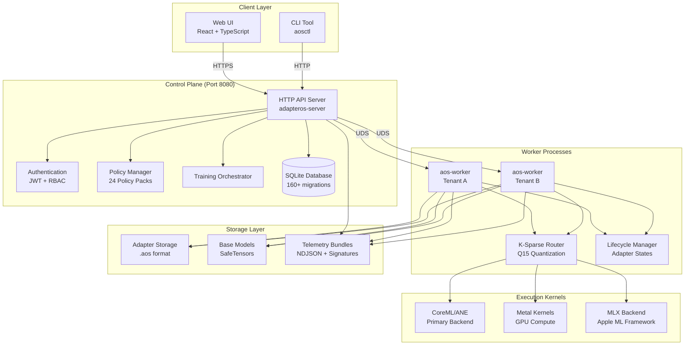

### Technology Stack

| Layer | Technologies |
|-------|-------------|
| **Frontend** | React 18, TypeScript, Vite, TanStack Query, Tailwind CSS |
| **Backend** | Rust (nightly), Axum, SQLite with WAL mode |
| **ML Frameworks** | CoreML, Metal Performance Shaders, MLX |
| **Security** | JWT (HMAC-SHA256 or Ed25519), Argon2id password hashing |
| **Observability** | Tracing, Prometheus metrics, NDJSON telemetry bundles |

---

## Core Concepts

### 1. Tenant

**Definition:** A tenant is the top-level isolation unit in AdapterOS, representing a user, organization, or environment.

**Purpose:** Enforce security boundaries, resource quotas, and access control.

**Properties:**
- `tenant_id` - Unique identifier
- `uid` / `gid` - Unix user/group for OS-level isolation
- Resource limits (memory, adapters, stacks)

**Examples:**
- `tenant-dev` - Development environment
- `tenant-prod` - Production environment
- `acme-corp` - Customer organization

**CLI Usage:**
```bash
aosctl init-tenant --id tenant-prod --uid 5000 --gid 5000
```

**Database Schema:**
```sql
CREATE TABLE tenants (
    id TEXT PRIMARY KEY,
    name TEXT NOT NULL,
    uid INTEGER,
    gid INTEGER,
    created_at TEXT DEFAULT (datetime('now'))
);
```

---

### 2. Adapter

**Definition:** A LoRA (Low-Rank Adaptation) module that specializes a base model for a specific task, domain, or style.

**Purpose:** Efficient fine-tuning without modifying base model weights.

**Naming Convention:** `{tenant}/{domain}/{purpose}/{revision}`
- Example: `tenant-a/engineering/code-review/r001`

**Properties:**
- `adapter_id` - Unique identifier
- `hash` - BLAKE3 content hash
- `rank` - LoRA rank (e.g., 8, 16, 32)
- `current_state` - Lifecycle state (unloaded, cold, warm, hot, resident)
- `activation_pct` - % of requests where router selected this adapter
- `memory_bytes` - VRAM footprint
- `expires_at` - TTL for ephemeral adapters
- `pinned` - Protection from eviction

**Lifecycle States:**
```
Unloaded → Cold → Warm → Hot → Resident
    ↑                              ↓
    └──────── (eviction) ──────────┘
```

**State Definitions:**
- **Unloaded**: Not in memory (0 MB VRAM, ~500ms load latency)
- **Cold**: In memory, not compiled (~100 MB VRAM, ~50ms activation)
- **Warm**: Compiled and cached (~150 MB VRAM, ~5ms activation)
- **Hot**: Highly optimized (~200 MB VRAM, ~1ms activation)
- **Resident**: Pinned, protected from eviction (~200 MB VRAM)

**File Format (.aos):**
```
+--------+--------+------------------------------------------+
| Offset | Size   | Field                                    |
+--------+--------+------------------------------------------+
| 0      | 8      | Magic bytes: "AOS3\x00\x00\x00\x00"      |
| 8      | 4      | Format version (u32 LE) = 3              |
| 12     | 4      | Flags (reserved)                         |
| 16     | 8      | Total file size (u64 LE)                 |
| 24     | 8      | Weights offset (u64 LE)                  |
| 32     | 8      | Weights size (u64 LE)                    |
| 40     | 8      | Manifest offset (u64 LE)                 |
| 48     | 8      | Manifest size (u64 LE)                   |
| 56     | 8      | Reserved                                 |
+--------+--------+------------------------------------------+
| 64     | N      | Weights (SafeTensors or Q15)             |
| 64+N   | M      | Manifest (JSON metadata)                 |
+--------+--------+------------------------------------------+
```

---

### 3. Stack

**Definition:** A tenant-scoped set of adapters with execution rules (workflow type, policies) used for inference.

**Purpose:** Reusable adapter combinations with consistent behavior.

**Workflow Types:**
- **Sequential**: Apply adapters in order
- **Parallel**: Apply adapters concurrently, merge results
- **UpstreamDownstream**: Two-phase (analysis → generation)

**Properties:**
- `stack_id` - Unique identifier
- `name` - Human-readable name
- `adapter_ids` - Ordered list of adapters
- `workflow_type` - Execution strategy
- `tenant_id` - Owner tenant

**Examples:**
```yaml
code-review-stack:
  adapters: [syntax-analyzer, style-checker]
  workflow: Sequential

multilingual-stack:
  adapters: [en-adapter, fr-adapter, es-adapter]
  workflow: Parallel

reasoning-stack:
  adapters: [fact-checker, reasoner]
  workflow: UpstreamDownstream
```

---

### 4. Router

**Definition:** The K-sparse gating mechanism that selects the top-K most relevant adapters for each inference request.

**Purpose:** Dynamic adapter selection based on input features, not static rules.

**Algorithm:**
1. Compute gate scores for all adapters (based on hidden states)
2. Select top-K adapters (e.g., K=3)
3. Deterministic tie-breaking: `(score desc, adapter_id asc)`
4. Quantize gates to Q15 for efficiency

**Critical Invariant:** Q15 denominator is **32767.0** (NOT 32768) - precision-critical

**Q15 Quantization:**
```rust
// Quantize gate score to Q15
let gate_q15 = (gate_f32 * 32767.0).round() as i16;

// Dequantize Q15 to float
let gate_f32 = gate_q15 as f32 / 32767.0;
```

**Key Parameters:**
- `k_sparse` - Number of adapters to select (default: 3)
- `entropy_floor` - Minimum entropy to prevent collapse (default: 0.02)
- `gate_quant` - Quantization mode (Q15, Q8)

**Location:** `crates/adapteros-lora-router/src/lib.rs`

---

### 5. Kernel

**Definition:** Precompiled Metal compute shaders that execute LoRA operations on the GPU.

**Purpose:** Deterministic, reproducible computation with zero runtime compilation.

**Types:**
- Attention kernels (Q, K, V with LoRA)
- MLP kernels (FFN with LoRA)
- Fused kernels (attention + LoRA in one pass)

**Properties:**
- `.metallib` files embedded in binary
- Deterministic rounding modes
- Parameter structs for modularity
- BLAKE3 hashes for verification

**Critical Invariant:** No `-ffast-math` compiler flags (breaks determinism)

**Location:** `crates/adapteros-lora-kernel-mtl/`

---

### 6. Telemetry

**Definition:** Structured event logging system that creates an immutable audit trail of all system operations.

**Purpose:** Compliance, debugging, replay verification, incident response.

**Event Types:**
- Inference events (request, response, router decisions)
- Lifecycle events (adapter load/unload, eviction)
- Policy events (violations, enforcement)
- System events (memory pressure, crashes)

**Storage Format:**
- Canonical JSON (JCS-serialized)
- Merkle chain (each event references previous hash)
- Bundles (compressed, signed archives)

**Event Structure:**
```json
{
  "event_id": "evt_abc123",
  "event_type": "adapter.lifecycle.promoted",
  "timestamp": "2025-01-15T12:00:00Z",
  "tenant_id": "default",
  "component": "adapteros-server-api",
  "metadata": {
    "adapter_id": "my-adapter",
    "old_state": "cold",
    "new_state": "warm",
    "actor": "user@example.com",
    "reason": "inference request",
    "duration_ms": 12.5
  },
  "signature": "ed25519_signature_here"
}
```

**Location:** `crates/adapteros-telemetry/`

---

### 7. Golden Run & Replay

**Definition:** A golden run is a verified, deterministic inference execution whose telemetry bundle serves as a reference for future replay.

**Purpose:** Verify determinism by re-executing the same request and comparing outputs.

**Workflow:**
1. **Golden Run**: Execute inference, record telemetry bundle
2. **Store Bundle**: Save bundle with signature
3. **Replay**: Re-execute same request using bundle metadata
4. **Compare**: Verify outputs match byte-for-byte
5. **Report**: Emit divergence events if mismatch detected

**Replay Metadata:**
- `manifest_hash` - Adapter manifest hash
- `router_seed` - Seed for audit (routing is deterministic by algorithm)
- `sampling_params_json` - Temperature, top_k, top_p, seed
- `rag_snapshot_hash` - RAG context hash (if applicable)
- `adapter_ids_json` - List of adapters used

**CLI Usage:**
```bash
# Create golden run
aosctl infer --prompt "Test" --golden-run ./golden-runs/test-001.json

# Replay
aosctl replay --bundle ./golden-runs/test-001.json

# Verify determinism
aosctl verify determinism-loop --json
```

---

## Architecture Components

### Control Plane

The control plane (`adapteros-server`) is the orchestration hub for AdapterOS.

**Responsibilities:**
- HTTP API server (port 8080)
- Authentication and authorization (JWT + RBAC)
- Policy enforcement (24 policy packs)
- Training orchestration
- Worker management
- Telemetry indexing
- Database management (SQLite with WAL)

**Component Diagram:**

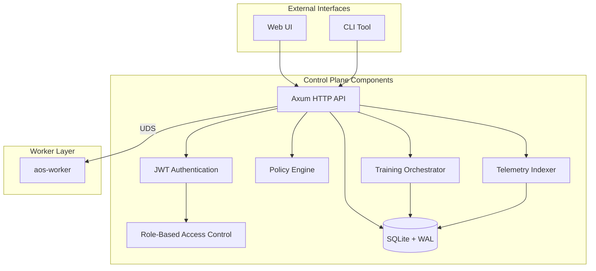

**Key API Endpoints:**

| Category | Endpoint | Method | Description |
|----------|----------|--------|-------------|
| **Health** | `/healthz` | GET | Health check |
| **Auth** | `/v1/auth/login` | POST | User login |
| **Auth** | `/v1/auth/me` | GET | Get current user |
| **Adapters** | `/v1/adapters` | GET | List adapters |
| **Adapters** | `/v1/adapters/register` | POST | Register adapter |
| **Training** | `/v1/training/start` | POST | Start training job |
| **Training** | `/v1/training/jobs/:id` | GET | Get job status |
| **Inference** | `/v1/infer` | POST | Perform inference |
| **Inference** | `/v1/infer/stream` | POST | Streaming inference |
| **Telemetry** | `/v1/telemetry/stream` | GET | SSE event stream |

**RBAC Roles:**
- **admin**: Full access to all operations
- **operator**: Manage workers, plans, and promotions
- **sre**: Worker management and node operations
- **compliance**: Audit access, policy management
- **auditor**: Read-only audit and telemetry access
- **viewer**: Read-only access to status and reports

**Location:** `crates/adapteros-server-api/`

---

### Worker Processes

Workers (`aos-worker`) are the execution engines that perform inference and training.

**Responsibilities:**
- Load base models into memory
- Manage adapter lifecycle (load/unload/hot-swap)
- Execute inference requests
- Run training jobs
- Emit telemetry events
- Enforce memory pressure policies

**Communication:**
- **Unix Domain Sockets (UDS)** for control plane ↔ worker communication
- Path format: `/var/run/aos/{tenant_id}/aos.sock`
- HTTP over UDS protocol
- 30-second timeout default

**Worker State Machine:**

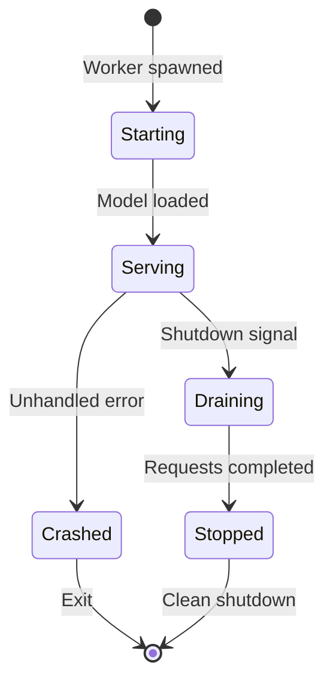

**Location:** `crates/adapteros-lora-worker/`

---

### Router (K-Sparse Gating)

The router is the core intelligence that selects which adapters to use for each request.

**Algorithm Details:**

```rust
pub struct Decision {
    pub adapter_ids: Vec<usize>,
    pub gates_q15: Vec<i16>,
    pub entropy: f32,
}

impl Router {
    pub fn route(&self, hidden_states: &[f32], k: usize) -> Decision {
        // 1. Compute gate scores for all adapters
        let scores: Vec<f32> = self.compute_scores(hidden_states);

        // 2. Select top-K adapters
        let mut indexed_scores: Vec<(usize, f32)> =
            scores.iter().enumerate()
                .map(|(i, &s)| (i, s))
                .collect();

        // 3. Sort: score DESC, then index ASC (deterministic tie-breaking)
        indexed_scores.sort_by(|a, b| {
            b.1.partial_cmp(&a.1)
                .unwrap_or(std::cmp::Ordering::Equal)
                .then(a.0.cmp(&b.0))
        });

        // 4. Take top K
        let top_k = &indexed_scores[..k.min(indexed_scores.len())];

        // 5. Quantize to Q15
        let gates_q15: Vec<i16> = top_k.iter()
            .map(|(_, score)| (score * 32767.0).round() as i16)
            .collect();

        Decision {
            adapter_ids: top_k.iter().map(|(idx, _)| *idx).collect(),
            gates_q15,
            entropy: self.compute_entropy(&scores),
        }
    }
}
```

**Entropy Floor:** Prevents router collapse (all weight on one adapter)
- Minimum entropy: 0.02
- If entropy < floor, reject decision and fall back to uniform distribution

**Location:** `crates/adapteros-lora-router/src/lib.rs`

---

### Lifecycle Manager

Manages adapter state transitions and memory pressure.

**State Transitions:**

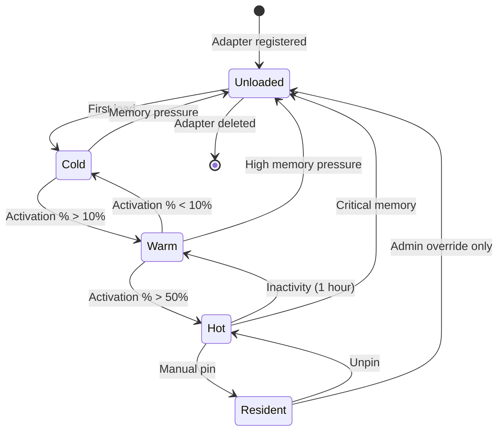

**Memory Pressure Levels:**
- **Low**: <30% usage
- **Medium**: 20-30% usage
- **High**: 15-20% usage (evict Cold adapters)
- **Critical**: <15% headroom (evict Warm/Hot adapters)

**Eviction Priority (lowest tier evicted first):**
1. **Cold** - Low priority, minimal impact
2. **Warm** - Moderate priority
3. **Hot** - High priority (only under critical pressure)
4. **Resident** - Protected (admin override required)

**Heartbeat Mechanism:**
- Adapters send periodic heartbeats (every 60s)
- Stale adapters (no heartbeat for 5 minutes) automatically recovered to `unloaded`
- Background task runs every 5 minutes

**TOCTOU Protection:**
- Compare-And-Swap (CAS) for state transitions
- Prevents race conditions between concurrent state updates

```rust
// Use CAS to prevent TOCTOU races
let updated = db.update_adapter_state_cas(
    adapter_id,
    "cold",      // Expected current state
    "warm",      // New state
    "warming up for inference"
).await?;

if !updated {
    // State changed between read and write - retry
    return Err(AosError::Validation("State conflict"));
}
```

**Location:** `crates/adapteros-lora-lifecycle/src/lib.rs`

---

## Inference Flow

### End-to-End Request Flow

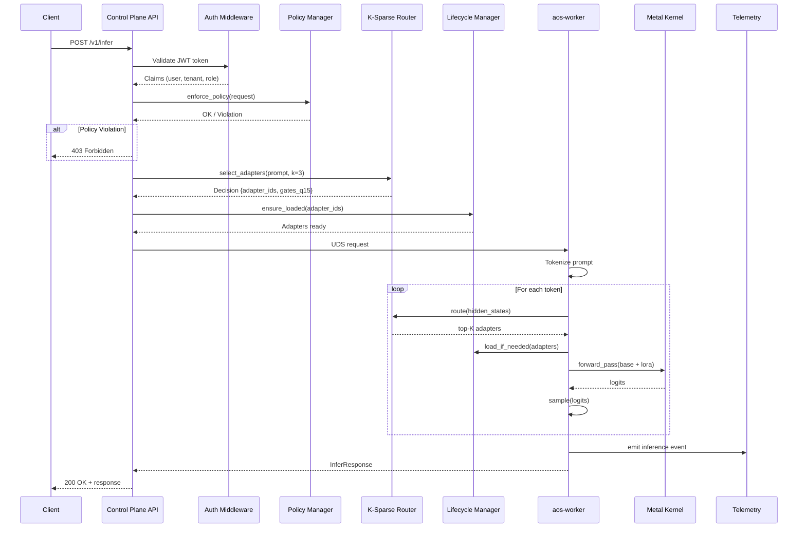

### Model Load Status Gate

**Canonical Statuses:**
- `no-model` - No model loaded
- `loading` - Model loading in progress
- `ready` - Model ready for inference
- `unloading` - Model being unloaded
- `error` - Load/unload error
- `checking` - Health check in progress

**Aggregation (cluster-level per model):**
```
Any worker ready → ready
Else any loading → loading
Else any checking → checking
Else any unloading → unloading
Else any error → error
Else no-model
```

**Router Guard:**
- Inference allowed **only** when aggregated status is `ready`
- Otherwise, requests fail fast with `MODEL_NOT_READY` (503)

**Error Response:**
```json
{
  "code": "MODEL_NOT_READY",
  "message": "Base model not ready for inference",
  "request_id": "req_abc123"
}
```

**Metrics:**
- `adapteros_model_load_success_total` (counter)
- `adapteros_model_load_failure_total` (counter)
- `adapteros_model_unload_success_total` (counter)
- `adapteros_model_unload_failure_total` (counter)
- `adapteros_model_loaded{model_id,tenant_id}` (gauge: 1=ready, 0=not ready)

---

### Data Flow Diagram

```
User Prompt (text)
    ↓
[1] Tokenizer → [token_ids]
    ↓
[2] InferencePipeline.infer() → Autoregressive Loop:
    ├─ [3] Router.route() → Decision { adapter_ids, gates_q15 }
    ├─ [4] HotSwap → Ensure adapters loaded
    ├─ [5] MetalKernels.run_step() → Apply LoRA deltas
    └─ [6] Generator.next_token() → Sample from logits
    ↓
[7] Tokenizer.decode() → Generated Text
    ↓
[8] Build InferenceResponse with trace
```

---

### Inference Error Codes

| Code | HTTP Status | Description | Handler Location |
|------|-------------|-------------|------------------|
| `MODEL_NOT_READY` | 503 | Base model not loaded | `InferenceCore::route_and_infer()` |
| `NO_COMPATIBLE_WORKER` | 503 | No workers available | Handler layer |
| `BACKPRESSURE` | 503 | System overloaded | Worker layer |
| `PERMISSION_DENIED` | 403 | Authorization failure | Auth middleware |
| `RAG_ERROR` | 500 | Evidence retrieval failed | Worker pipeline |
| `ROUTING_BYPASS` | 400 | Invalid routing params | Router |
| `REQUEST_TIMEOUT` | 504 | Request timed out | Worker/UDS client |
| `SERVICE_UNAVAILABLE` | 503 | Service temporarily down | Various |
| `ADAPTER_NOT_FOUND` | 404 | Adapter doesn't exist | Database layer |
| `POLICY_HOOK_VIOLATION` | 403 | Policy blocked request | Policy manager |
| `VALIDATION_ERROR` | 400 | Request validation failed | Handler layer |
| `DATABASE_ERROR` | 500 | Database operation failed | Database layer |
| `SERIALIZATION_ERROR` | 500 | JSON serialization failed | Handler layer |
| `ACCESS_DENIED` | 403 | Tenant isolation violation | Security layer |
| `ADAPTER_NOT_LOADABLE` | 500 | Adapter load failed | Lifecycle manager |
| `APPROXIMATE_REPLAY_REQUIRED` | 400 | Exact replay impossible | Replay handler |

**All errors wrapped in:**
```json
{
  "code": "ERROR_CODE",
  "message": "Human-readable message",
  "detail": "Optional detailed error info",
  "request_id": "req_abc123"
}
```

---

## Adapter Lifecycle

### State Machine Detail

The adapter lifecycle is a state machine with 5 states and automatic transitions based on usage patterns and memory pressure.

**Complete State Diagram:**

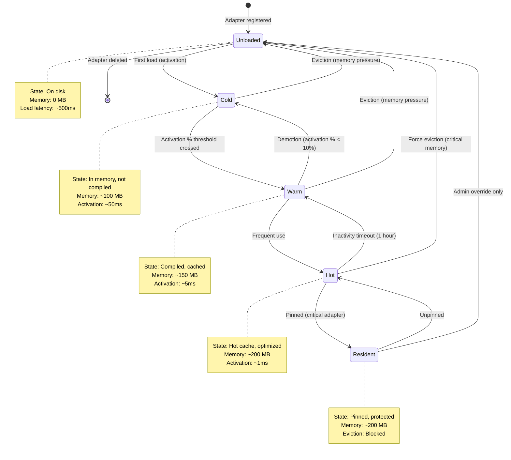

---

### Transition Triggers

**Promotion Triggers:**

| From | To | Trigger | Threshold |
|------|-----|---------|-----------|
| Unloaded | Cold | First load request | N/A |
| Cold | Warm | Activation % increased | >10% |
| Warm | Hot | High activation rate | >50% |
| Hot | Resident | Manual pinning | Admin action |

**Demotion Triggers:**

| From | To | Trigger | Threshold |
|------|-----|---------|-----------|
| Resident | Hot | Manual unpinning | Admin action |
| Hot | Warm | Inactivity timeout | 1 hour no use |
| Warm | Cold | Low activation % | <10% |
| Cold | Unloaded | Memory pressure | System-wide threshold |

---

### Lifecycle API

```rust
use adapteros_lora_lifecycle::LifecycleManager;

let manager = LifecycleManager::new_with_db(
    adapter_names,
    &policies,
    path,
    telemetry,
    k,
    db
);

// Auto-promote on router decision
manager.record_router_decision(&selected).await?;

// Auto-evict on memory pressure
manager.check_memory_pressure(total_mem, MemoryPressureLevel::High).await?;

// Manual state transitions
manager.load_adapter("adapter-id").await?;
manager.evict_adapter("adapter-id").await?;

// Heartbeat mechanism
manager.heartbeat_adapter(&adapter_id).await?;
let stale_ids = manager.check_stale_adapters(300).await?;
let recovered = manager.recover_stale_adapters(300).await?;
```

---

### Telemetry Events

| Event Type | When Emitted | Metadata |
|------------|--------------|----------|
| `adapter_promoted` | State tier increased | adapter_id, old_tier, new_tier, activation_pct |
| `adapter_demoted` | State tier decreased | adapter_id, old_tier, new_tier, inactivity_duration_s |
| `adapter_evicted` | Adapter removed from memory | adapter_id, tier, memory_freed_mb, reason |
| `adapter_crash_detected` | Stale adapter recovered | adapter_id, last_seen, recovery_timestamp |

**Location:** `crates/adapteros-lora-lifecycle/src/lib.rs:213-346`

---

### Critical Field Conventions

**CRITICAL:** The `adapters` table has TWO distinct state-related fields:

| Field | Purpose | Valid Values |
|-------|---------|--------------|
| `current_state` | Runtime lifecycle state | `unloaded`, `cold`, `warm`, `hot`, `resident` |
| `lifecycle_state` | Metadata/registration status | `draft`, `active`, `deprecated`, `retired` |

**Always use `current_state` for runtime state checks. Using `lifecycle_state` is a bug.**

**State Check Methods:**

```rust
use adapteros_lora_lifecycle::AdapterState;

let state: AdapterState = adapter.current_state.parse()?;

// Check if adapter can serve inference
if state.is_available() {  // warm, hot, or resident
    // OK to infer
}

// Check if adapter is loaded at all
if state.is_loaded() {  // cold, warm, hot, or resident
    // In memory
}

// Check if adapter is protected
if state.is_pinned() {  // resident
    // Protected from eviction
}
```

---

## User Flows

### Flow 1: Authentication & Login

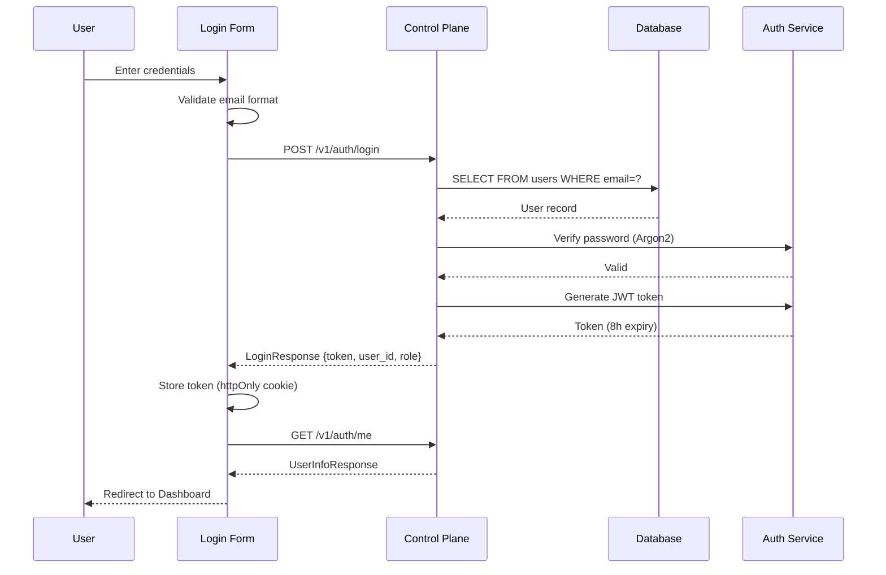

**Key Components:**
- **Password Hashing:** Argon2id with `m_cost=19456, t_cost=2, p_cost=1`
- **JWT Mode:** HMAC-SHA256 or Ed25519 (configurable)
- **Token Expiry:** 8 hours default (configurable)
- **Cookie:** `auth_token`; HttpOnly, Secure, SameSite=Strict

**Location:** `crates/adapteros-server-api/src/handlers.rs:1145-1280`

---

### Flow 2: Adapter Training

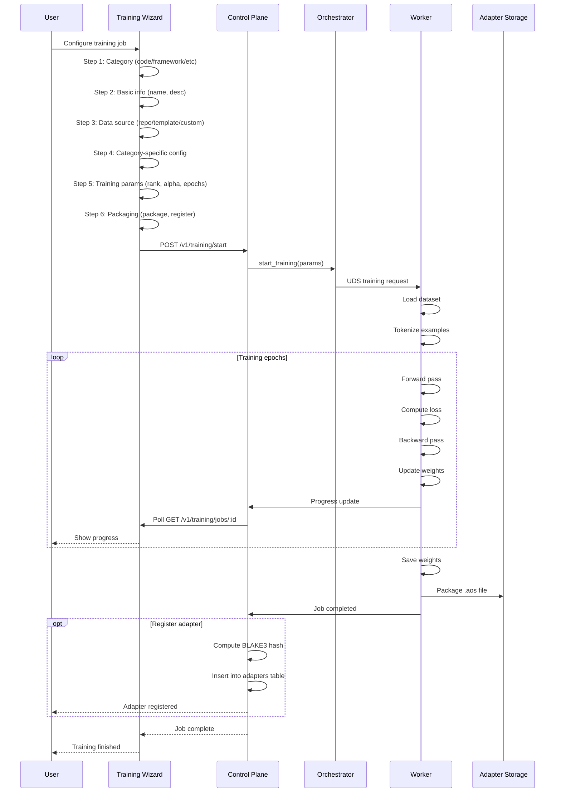

**Training Parameters:**
- `rank` - LoRA rank (default: 8)
- `alpha` - LoRA alpha (default: 16)
- `targets` - Target layers (e.g., `['q_proj', 'v_proj']`)
- `epochs` - Number of epochs (default: 3)
- `learning_rate` - Learning rate (default: 3e-4)
- `batch_size` - Batch size (default: 4)

**Location:**
- Frontend: `ui/src/components/TrainingWizard.tsx`
- Backend: `crates/adapteros-server-api/src/handlers.rs:10599-10756`
- Orchestrator: `crates/adapteros-orchestrator/src/training.rs`

---

### Flow 3: Model Inference

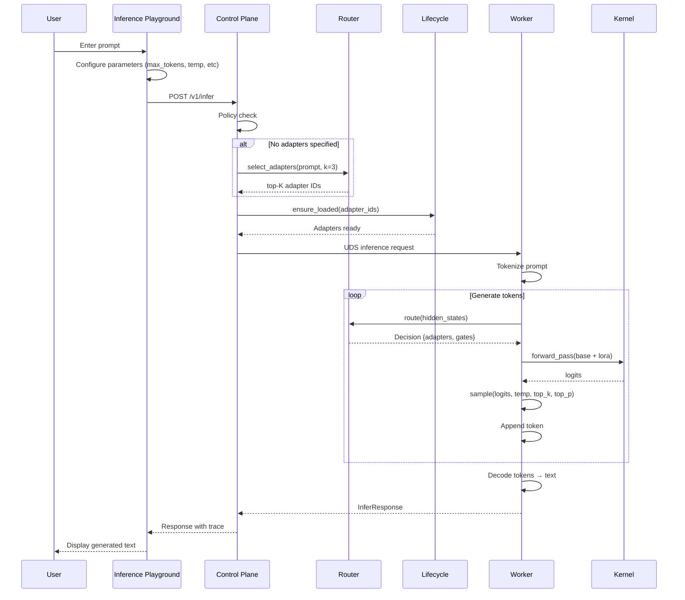

**Inference Parameters:**
- `prompt` - Input text
- `max_tokens` - Maximum tokens to generate (default: 100)
- `temperature` - Sampling temperature (default: 0.7)
- `top_k` - Top-k sampling (default: 50)
- `top_p` - Nucleus sampling (default: 0.9)
- `seed` - Random seed for determinism (optional)
- `require_evidence` - Require citations/evidence (default: false)
- `adapters` - Explicit adapter IDs (optional, router auto-selects if empty)

**Location:**
- Frontend: `ui/src/components/InferencePlayground.tsx`
- Backend: `crates/adapteros-server-api/src/handlers.rs:4736+`
- Worker: `crates/adapteros-lora-worker/src/inference_pipeline.rs`

---

### Flow 4: Memory Pressure → Eviction

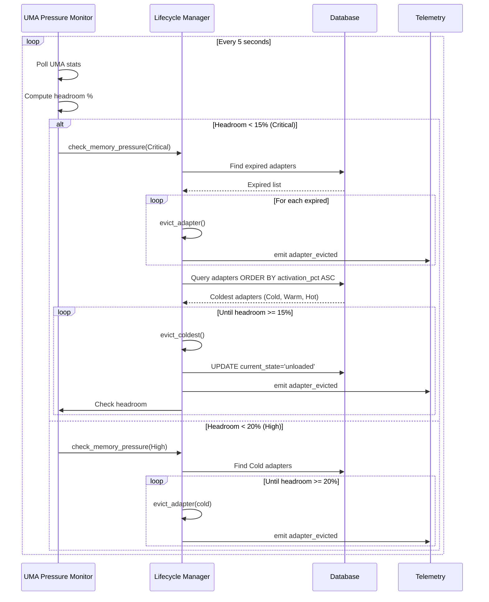

**Pressure Levels:**
- **Low**: <30% usage (no action)
- **Medium**: 20-30% usage (monitor only)
- **High**: 15-20% usage (evict Cold)
- **Critical**: <15% headroom (evict Cold, Warm, Hot)

**Eviction Protection:**
- **Resident** adapters are protected from automatic eviction
- Only admin override can unload Resident adapters

**Location:** `crates/adapteros-lora-lifecycle/src/lib.rs:1068-1128`

---

### Flow 5: Telemetry → Golden Run → Replay

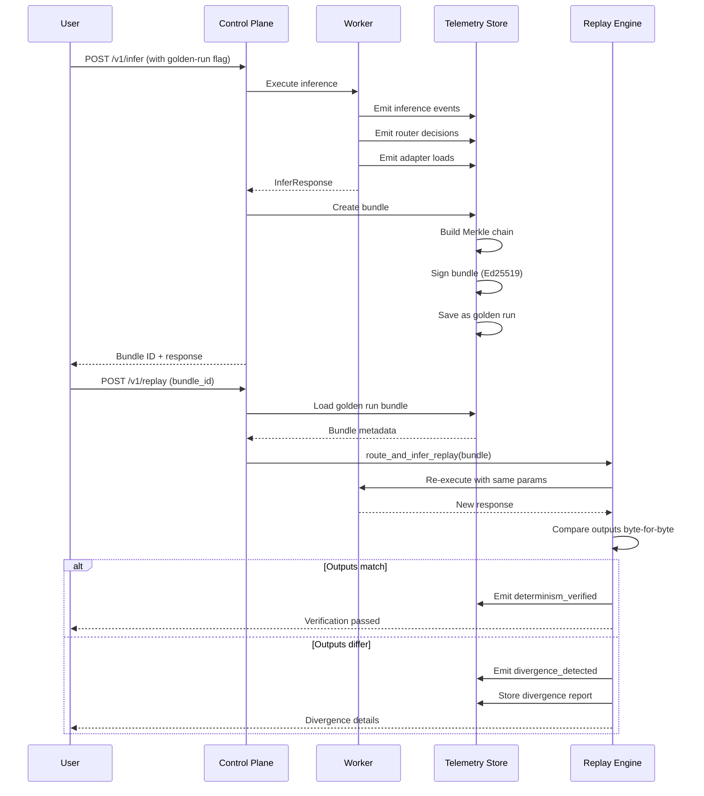

**Replay Metadata Stored:**
- `manifest_hash` - Adapter manifest hash
- `router_seed` - Seed for audit trail (routing is deterministic)
- `sampling_params_json` - Temperature, top_k, top_p, seed
- `rag_snapshot_hash` - RAG context hash (if applicable)
- `adapter_ids_json` - List of adapters used

**Determinism Requirements:**
- Same base model version
- Same adapter versions (hash-verified)
- Same sampling parameters
- Same router algorithm (Q15 gates)
- No `-ffast-math` compiler flags

**Location:**
- Replay: `crates/adapteros-server-api/src/inference_core.rs:route_and_infer_replay()`
- Telemetry: `crates/adapteros-telemetry/`

---

## Glossary

| Term | Definition |
|------|------------|
| **Adapter** | LoRA module that specializes a base model for a specific task |
| **Adapter Stack** | Tenant-scoped set of adapters with execution rules |
| **Activation %** | Percentage of requests where router selected this adapter |
| **Base Model** | Foundation model (e.g., Qwen, Llama) that adapters modify |
| **Bundle** | Compressed, signed telemetry archive for replay |
| **Divergence** | Mismatch between golden run and replay execution |
| **Eviction** | Removal of adapter from memory due to pressure |
| **Golden Run** | Verified, deterministic execution used as reference |
| **K-Sparse** | Router algorithm that selects top-K adapters per request |
| **Kernel** | Precompiled Metal compute shader for LoRA operations |
| **Lifecycle** | State machine for adapter memory management (Unloaded → Resident) |
| **Merkle Chain** | Linked sequence of hashed telemetry events |
| **Pinning** | Protection mechanism to prevent adapter eviction |
| **Policy Pack** | Set of rules enforced across tenants, adapters, and execution |
| **Q15** | 15-bit fixed-point quantization format (denominator: 32767.0) |
| **Replay** | Re-execution of golden run to verify determinism |
| **Router** | K-sparse gating mechanism for adapter selection |
| **Stack** | See "Adapter Stack" |
| **Telemetry** | Structured event logging for audit trail |
| **Tenant** | Top-level isolation unit (user, org, environment) |
| **Tier** | Lifecycle state (unloaded, cold, warm, hot, resident) |
| **TTL** | Time-to-live for ephemeral adapters (auto-delete) |
| **UDS** | Unix Domain Socket (IPC mechanism for worker communication) |
| **UMA** | Unified Memory Architecture (shared CPU/GPU memory on Apple Silicon) |
| **Workflow Type** | Execution strategy (Sequential, Parallel, UpstreamDownstream) |

---

## Related Documentation

- **[CLAUDE.md](../CLAUDE.md)** - Developer quick reference
- **[POLICIES.md](POLICIES.md)** - Policy enforcement details
- **[DATABASE.md](DATABASE.md)** - Database schema reference
- **[DETERMINISM.md](DETERMINISM.md)** - Determinism and replay guarantees
- **[AOS_FORMAT.md](AOS_FORMAT.md)** - Adapter package format specification
- **[TELEMETRY_EVENTS.md](TELEMETRY_EVENTS.md)** - Event catalog
- **[AUTHENTICATION.md](AUTHENTICATION.md)** - Authentication details
- **[UI_INTEGRATION.md](UI_INTEGRATION.md)** - Frontend integration guide

---

**Copyright:** © 2025 MLNavigator Inc / James KC Auchterlonie. All rights reserved.

**Maintained by:** AdapterOS Team

**Last Updated:** 2025-12-11
