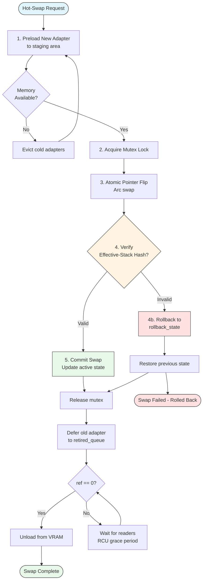
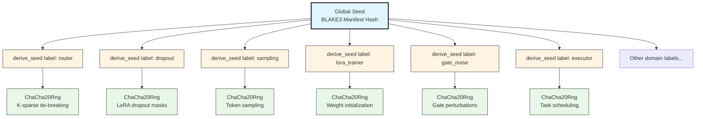
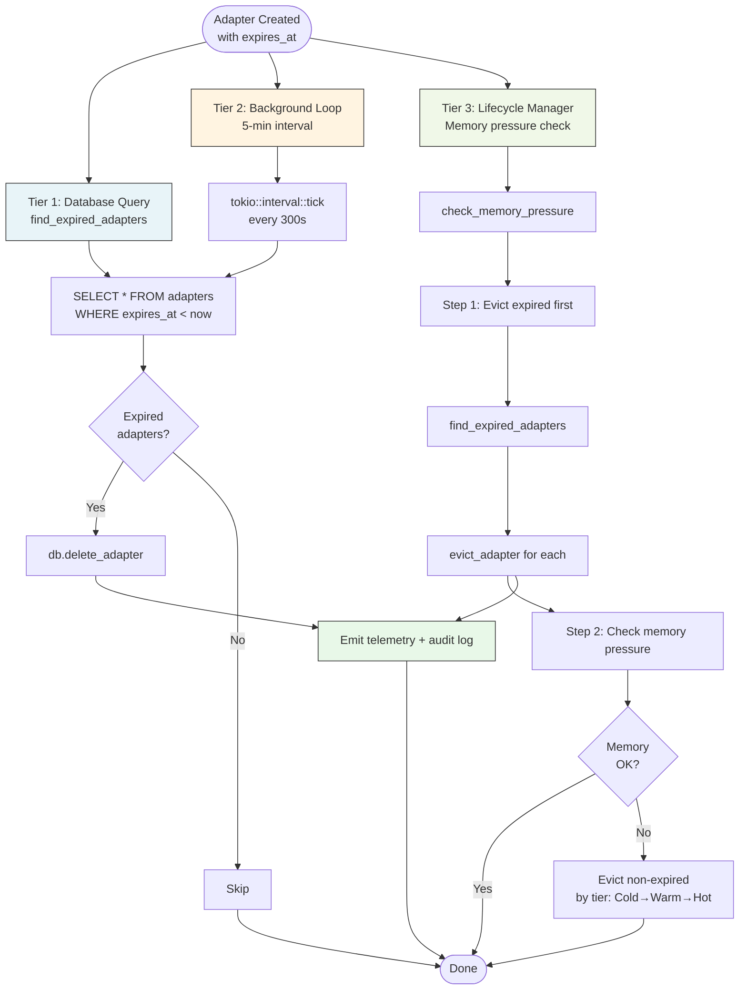

# Architecture Patterns - Detailed Reference

**Purpose:** Comprehensive documentation of AdapterOS architectural patterns with diagrams

**Last Updated:** 2025-01-19

---

## Table of Contents

- [Hot-Swap Protocol](#hot-swap-protocol)
- [HKDF Seeding Hierarchy](#hkdf-seeding-hierarchy)
- [Multi-Agent Coordination](#multi-agent-coordination)
- [Training Pipeline](#training-pipeline)
- [TTL Enforcement](#ttl-enforcement)

---

## Hot-Swap Protocol

### Overview

RCU-style hot-swapping enables zero-downtime adapter replacement with automatic rollback on failure.

### Flow Diagram



### Key Properties

- **Zero Downtime**: Old adapter remains active during swap
- **Atomic Safety**: Mutex-guarded pointer flips
- **Automatic Rollback**: Hash mismatch triggers instant recovery
- **RCU Grace Period**: Deferred unload when ref count drops to 0

### Implementation

**Location:** `crates/adapteros-lora-worker/src/adapter_hotswap.rs`

```rust
use adapteros_lora_worker::adapter_hotswap::AdapterTable;

let table = AdapterTable::new();
table.preload("new".to_string(), hash, vram_mb)?;
table.swap(&["new"], &["old"]).or_else(|e| { table.rollback()?; Err(e) })?;
```

**Architecture:** `active` (current) | `staged` (preloaded) | `rollback_state` (recovery) | `retired_queue` (RCU deferral)

### Testing Coverage (Post-Rectification)

- **Loom:** 5000+ interleavings with multi-reader holds during swaps; verified no UAF, ref>0 blocks unload
- **Miri:** Scanned atomic operations and FFI boundaries; no UB detected
- **Stress:** 1000 swaps concurrent with 1000 1s inferences; 0 panics, 100% unloads post-ref0, <1% latency regression
- **Event-driven retirement:** Wake within 5ms of ref==0

---

## HKDF Seeding Hierarchy

### Overview

Domain-separated deterministic seeding ensures reproducible execution across all randomness sources.

### Seed Derivation Tree



### Why HKDF?

Domain-separated seeding ensures:
- Identical manifest → Identical seeds → Identical execution
- No cross-contamination between randomness domains
- Cryptographically secure seed derivation (HKDF-SHA256)

### Usage

**Location:** `crates/adapteros-core/src/hash.rs`

```rust
let global = B3Hash::hash(b"seed_material");
let router_seed = derive_seed(&global, "router");
let mut rng = ChaCha20Rng::from_seed(router_seed.try_into().unwrap());
```

---

## Multi-Agent Coordination

### Overview

`AgentBarrier` synchronizes multiple agents at tick boundaries with explicit failure handling and graceful degradation.

### Coordination Flow

```mermaid
sequenceDiagram
    participant A as Agent A
    participant B as Agent B
    participant C as Agent C
    participant Bar as AgentBarrier<br/>(generation counter)

    Note over A,C: Normal Synchronization Flow
    A->>Bar: wait("A", tick=100)
    Note right of Bar: Generation = 0<br/>Waiting agents: [A]

    B->>Bar: wait("B", tick=100)
    Note right of Bar: Waiting agents: [A, B]

    C->>Bar: wait("C", tick=100)
    Note right of Bar: All agents arrived!<br/>CAS: generation 0→1

    Bar-->>A: ✅ Proceed (generation advanced)
    Bar-->>B: ✅ Proceed
    Bar-->>C: ✅ Proceed

    Note over A,C: Dead Agent Scenario (Agent C crashes)
    A->>Bar: wait("A", tick=101)
    B->>Bar: wait("B", tick=101)
    Note over C: ❌ Agent C crashes

    Note right of Bar: Timeout after 30s

    rect rgb(255, 225, 225)
        Bar->>Bar: mark_agent_dead("C")
        Note right of Bar: Dead agents: [C]<br/>Living agents: [A, B]
    end

    Bar-->>A: ✅ Proceed (2/3 living agents)
    Bar-->>B: ✅ Proceed

    Note over A,C: CAS Loser Scenario
    A->>Bar: wait("A", tick=102)
    Note right of Bar: Generation = 2

    par CAS Race
        B->>Bar: CAS(2, 3) - WINNER
        C->>Bar: CAS(2, 3) - LOSER
    end

    Note right of Bar: B wins, advances generation→3

    Bar-->>C: ✅ Proceed (detected generation change)
    Bar-->>B: ✅ Proceed
    Bar-->>A: ✅ Proceed

    style Bar fill:#e8f4f8,stroke:#333
```

### Telemetry Events

- `barrier.wait_start` (Debug) - Agent enters barrier
- `barrier.generation_advanced` (Info) - CAS winner advances generation
- `barrier.cas_loser_proceed` (Debug) - CAS loser detects change
- `barrier.agent.removed` (Warn) - Dead agent excluded
- `barrier.timeout` (Error) - 30s timeout indicates coordination failure

### Implementation

**Location:** `crates/adapteros-deterministic-exec/src/multi_agent.rs`

**Status (2025-11-16):** All AgentBarrier issues (C-1 through C-8) resolved and tested.

**Fixes implemented:**
- **C-1 (CAS Race Condition):** CAS losers use Acquire ordering and detect advanced generation (lines 312-400)
- **C-2 (Notify-based Waiting):** Replaced busy-wait with efficient Notify mechanism (lines 403-413)
- **C-5 (Failure Broadcast):** AtomicBool flag broadcasts timeouts to all agents (lines 196-201, 284-285)
- **C-7 (Memory Ordering):** Changed generation.load() from Relaxed to Acquire (line 247)
- **C-8 (Dead Agent Handling):** Explicit agent removal with graceful degradation (lines 107-183, 298-307)

### Usage

```rust
use adapteros_deterministic_exec::AgentBarrier;

let barrier = Arc::new(AgentBarrier::new(vec!["a".into(), "b".into(), "c".into()]));

// Normal synchronization - all agents must arrive
barrier.wait("a", tick).await?;  // Blocks until all agents reach tick

// Dead agent handling - explicit removal for crash tolerance
barrier.mark_agent_dead("c")?;  // Mark crashed agent as dead
// Barrier now proceeds with only agents A and B
```

### Dead Agent API

- **mark_agent_dead(agent_id)** - Explicitly mark an agent as dead/crashed
  - Remaining living agents can proceed without waiting for dead agents
  - Dead agents cannot be revived (permanent removal)
  - Notifies all waiting threads to re-evaluate barrier condition
  - Emits `barrier.agent.removed` telemetry event

**Safety:**
- Agent must be in original `agent_ids` list (returns `AgentNotRegistered` otherwise)
- Warns if marking already-dead agent (idempotent no-op)
- Automatically skips dead agents when checking barrier condition

---

## Training Pipeline

### End-to-End Flow

```mermaid
flowchart LR
    PDF[PDF/Documents] -->|1. Ingest| Parsed[Parsed Document<br/>DocumentIngestor]
    Parsed -->|2. Generate| Examples[Training Examples<br/>Identity/QA/MaskedLM]

    Examples -->|3. Create Dataset| DS[(Dataset<br/>BLAKE3 hash)]
    DS -->|Validate| Check{validation_status<br/>== 'valid'?}

    Check -->|No| Reject[❌ Reject]
    Check -->|Yes| Train[4. Train<br/>MicroLoRATrainer<br/>rank/alpha config]

    Train -->|5. Package| Weights[.aos archive<br/>safetensors + manifest]
    Weights -->|Register| Registry[(Registry DB<br/>ACL/Tier assignment)]

    Registry --> Success([✅ Adapter Ready])
    Reject --> Failed([❌ Training Blocked])

    style PDF fill:#e1f5ff,stroke:#333
    style Check fill:#fff4e1,stroke:#333
    style Reject fill:#ffe1e1,stroke:#333
    style Train fill:#e8f8e8,stroke:#333
    style Registry fill:#e8f4f8,stroke:#333
    style Success fill:#e8f8e8,stroke:#333
```



### Validation Gates

- BLAKE3 content addressing for datasets
- Schema validation before training
- Manifest signing after packaging

### Implementation

**Modules:**
- `adapteros-ingest-docs` - Document ingestion
- `adapteros-orchestrator/training_dataset_integration.rs` - Dataset management
- `adapteros-lora-worker/training/` - Trainer, quantizer, packager

---

## TTL Enforcement

### Three-Tier Architecture



### Concurrency Safety

SQLite transactions provide serialization (no race conditions between tiers).

### Implementation

**Locations:**
- Database query: `crates/adapteros-db/src/adapters.rs:475-490`
- Background loop: `crates/adapteros-server/src/main.rs:709-728`
- Lifecycle integration: `crates/adapteros-lora-lifecycle/src/lib.rs:1073-1092`

---

## See Also

- [CLAUDE.md](../CLAUDE.md) - Developer quick reference
- [LIFECYCLE.md](LIFECYCLE.md) - Adapter lifecycle state machine
- [DETERMINISTIC_EXECUTION.md](DETERMINISTIC_EXECUTION.md) - Deterministic execution details
- [ARCHITECTURE_INDEX.md](ARCHITECTURE_INDEX.md) - Full architecture overview
