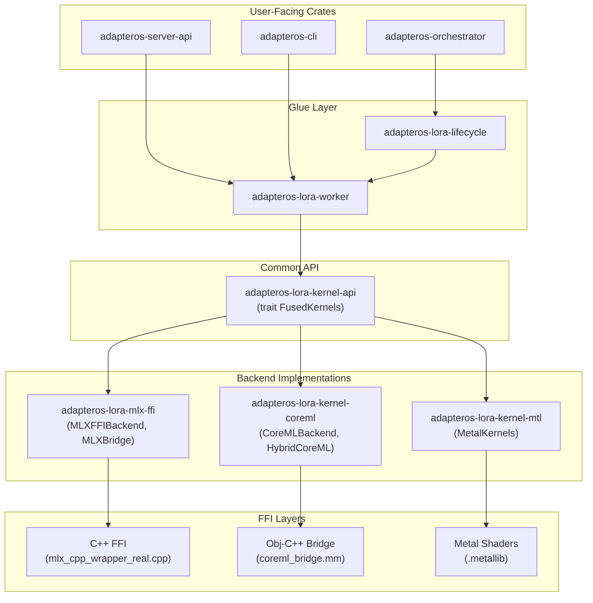

# Backend Architecture

> **Agent note:** Code is authoritative. Crate names and dependency graph may have changed. Re-verify in `crates/adapteros-lora-*` before trusting. See [CANONICAL_SOURCES.md](CANONICAL_SOURCES.md) and [DOCS_AUDIT_2026-02-18.md](DOCS_AUDIT_2026-02-18.md).

**Copyright:** © 2025 JKCA / James KC Auchterlonie. All rights reserved.  
**Canonical source:** `crates/adapteros-lora-worker/`, `crates/adapteros-lora-kernel-*`  
**Last Updated:** 2026-02-18  
**Purpose:** Crate dependency map and architecture overview for MLX, CoreML, and Metal backends

---

## Overview

adapterOS implements a **multi-backend architecture** with three production backends:

| Backend | Crate | FFI Layer | Status |
|---------|-------|-----------|--------|
| **MLX** | `adapteros-lora-mlx-ffi` | C++ FFI (`mlx_cpp_wrapper_real.cpp`) | Production (Primary) |
| **CoreML** | `adapteros-lora-kernel-coreml` | Obj-C++/Swift (`coreml_bridge.mm`) | Production |
| **Metal** | `adapteros-lora-kernel-mtl` | Metal Shaders (`.metallib`) | Production |

All three backends are **production-ready** and actively maintained. None are legacy or deprecated.

---

## Architecture Diagram



---

## Crate Dependency Map

### Direct Dependencies by Crate

| Crate | MLX FFI | CoreML | Metal | Notes |
|-------|---------|--------|-------|-------|
| **adapteros-lora-worker** | ✅ Direct | ✅ Direct | ✅ Direct | Primary consumer of all backends |
| **adapteros-lora-lifecycle** | ❌ | ✅ Direct | ✅ Direct | Workflow execution |
| **adapteros-cli** | ✅ Via worker | ✅ Via worker | ❌ | CLI commands |
| **adapteros-server-api** | ✅ Via worker | ✅ Via worker | ❌ | API handlers |
| **adapteros-orchestrator** | ✅ Via worker | ✅ Via lifecycle | ❌ | Training orchestration |
| **adapteros-system-metrics** | ✅ Direct | ✅ Direct (FFI) | ❌ | GPU/ANE metrics |
| **adapteros-memory** | ❌ | ❌ | ✅ Direct | Unified memory tracking |

### The Hub: `adapteros-lora-worker`

The worker crate is the **central hub** that:

1. **Creates** backends via `backend_factory.rs`
2. **Wraps** them with `KernelWrapper` for fallback support
3. **Detects** capabilities via `capabilities.rs`
4. **Selects** the best backend based on priority chain
5. **Exposes** training operations that use backends directly

All higher-level crates (server, CLI, orchestrator) interact with backends **through the worker**, never directly.

---

## Feature Flags

### Workspace-Level Features

```toml
# Cargo.toml [features]
default = ["multi-backend", "coreml-backend", "metal-backend"]

# MLX
multi-backend = ["adapteros-lora-worker/multi-backend"]
mlx = []  # Enables real C++ FFI (vs stub)

# CoreML
coreml-backend = ["adapteros-lora-worker/coreml-backend"]

# Metal
metal-backend = ["adapteros-lora-worker/metal-backend"]
```

### Crate-Level Features

| Crate | Feature | Effect |
|-------|---------|--------|
| `adapteros-lora-worker` | `multi-backend` | Enables MLX FFI backend |
| `adapteros-lora-worker` | `coreml-backend` | Enables CoreML backend |
| `adapteros-lora-worker` | `mlx-bridge` | Enables Python subprocess for MoE |
| `adapteros-lora-mlx-ffi` | `mlx` | Compiles real C++ wrapper (vs stub) |

---

## `FusedKernels` Trait Implementations

All backends implement the common `FusedKernels` trait from `adapteros-lora-kernel-api`:

| Implementation | Crate | Feature | Status |
|----------------|-------|---------|--------|
| `MetalKernels` | `kernel-mtl` | default | Production |
| `CoreMLBackend` | `kernel-coreml` | `coreml-backend` | Production |
| `HybridCoreMLBackend` | `kernel-coreml` | `coreml-backend` | Production |
| `MLXFFIBackend` | `mlx-ffi` | `multi-backend` | Production |
| `MLXSubprocessBridge` | `lora-worker` | `mlx-bridge` | Production (MoE) |
| `KernelWrapper` | `lora-worker` | default | Wrapper |
| `MockKernels` | `kernel-api` | default | Testing |

### Core Trait Methods

```rust
pub trait FusedKernels: Send + Sync {
    fn load(&mut self, plan_bytes: &[u8]) -> Result<()>;
    fn run_step(&mut self, ring: &RouterRing, io: &mut IoBuffers) -> Result<()>;
    fn device_name(&self) -> &str;
    fn attest_determinism(&self) -> Result<DeterminismReport>;

    // Hot-swap adapter support (optional)
    fn load_adapter(&mut self, id: u16, weights: &[u8]) -> Result<()>;
    fn unload_adapter(&mut self, id: u16) -> Result<()>;
}
```

---

## Request Flow

```
HTTP POST /v1/infer
    │
    ▼
adapteros-server-api::handlers::inference_handler()
    │
    ▼
InferenceCore::route_and_infer()
    │
    ▼
Worker UDS Communication (Unix Domain Socket)
    │
    ▼
adapteros-lora-worker::Worker::infer()
    │
    ▼
KernelWrapper::run_step()  ← Handles fallback if primary fails
    │
    ├──► MLXFFIBackend::run_step()      (if MLX selected)
    ├──► CoreMLBackend::run_step()      (if CoreML selected)
    └──► MetalKernels::run_step()       (if Metal selected)
           │
           ▼
        FFI Layer → GPU/ANE Execution
```

---

## Backend Selection Priority

The system uses an MLX-first priority chain:

```
MLX → CoreML → MlxBridge → Metal → CPU
```

| Priority | Backend | Rationale |
|----------|---------|-----------|
| 1 | **MLX** | Primary backend, HKDF-seeded determinism, training support |
| 2 | **CoreML** | ANE acceleration, 50% power savings, production determinism |
| 3 | **MlxBridge** | MoE models via Python subprocess |
| 4 | **Metal** | GPU fallback, legacy hardware support |
| 5 | **CPU** | Observability only (not implemented for inference) |

---

## FFI Layer Details

### MLX C++ FFI

- **Location:** `crates/adapteros-lora-mlx-ffi/src/mlx_cpp_wrapper_real.cpp`
- **Size:** ~2,400 lines of C++ code
- **Build:** Compiled via `build.rs` when `--features mlx` is enabled
- **Functions:** Model loading, inference, training, optimizers, memory management

### CoreML Obj-C++/Swift Bridge

- **Location:** `crates/adapteros-lora-kernel-coreml/src/coreml_bridge.mm`
- **Swift Bridge:** `swift/CoreMLBridge.swift` (macOS 15+ MLTensor API)
- **Functions:** ANE detection, model compilation, inference with LoRA

### Metal Shaders

- **Location:** `metal/src/kernels/adapteros_kernels.metal`
- **Output:** `crates/adapteros-lora-kernel-mtl/shaders/adapteros_kernels.metallib`
- **Build:** Compiled via `xcrun metal` toolchain
- **Kernels:** `fused_mlp`, `fused_qkv`, `flash_attention`, `vocabulary_projection`

---

## Related Documentation

- [BACKEND_SELECTION.md](BACKEND_SELECTION.md) - Complete backend selection guide
- [MLX_GUIDE.md](MLX_GUIDE.md) - MLX backend documentation
- [COREML_BACKEND.md](COREML_BACKEND.md) - CoreML/ANE backend guide
- [METAL_BACKEND.md](METAL_BACKEND.md) - Metal GPU backend guide
- [DETERMINISM.md](DETERMINISM.md) - Determinism guarantees

---

## Implementation References

| Component | Location |
|-----------|----------|
| Backend Factory | `crates/adapteros-lora-worker/src/backend_factory.rs` |
| Capabilities Detection | `crates/adapteros-lora-worker/src/backend_factory/capabilities.rs` |
| Kernel API Trait | `crates/adapteros-lora-kernel-api/src/lib.rs` |
| MLX FFI Backend | `crates/adapteros-lora-mlx-ffi/src/backend.rs` |
| CoreML Backend | `crates/adapteros-lora-kernel-coreml/src/lib.rs` |
| Metal Backend | `crates/adapteros-lora-kernel-mtl/src/lib.rs` |
| C++ Wrapper | `crates/adapteros-lora-mlx-ffi/src/mlx_cpp_wrapper_real.cpp` |
| CoreML Bridge | `crates/adapteros-lora-kernel-coreml/src/coreml_bridge.mm` |
| Metal Shaders | `metal/src/kernels/adapteros_kernels.metal` |

---

**End of Backend Architecture Guide**
