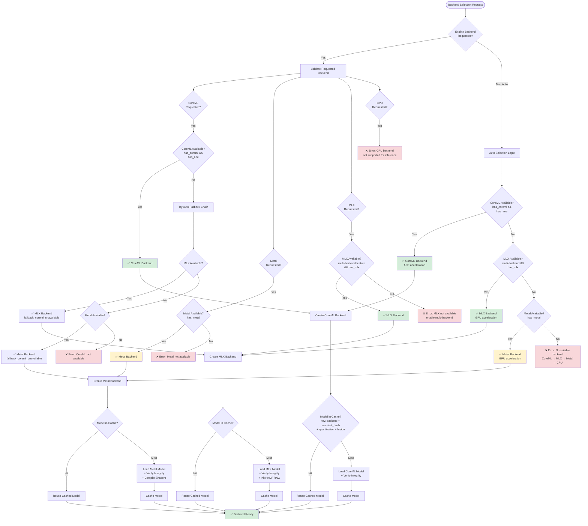

# Backend Selection Guide

**Copyright:** © 2025 JKCA / James KC Auchterlonie. All rights reserved.
**Last Updated:** 2025-12-24
**Purpose:** Complete guide to backend selection strategies in AdapterOS

---

## Table of Contents

1. [Overview](#overview)
2. [Available Backends](#available-backends)
3. [Selection Strategies](#selection-strategies)
4. [Capability Detection](#capability-detection)
5. [Configuration & Environment Variables](#configuration--environment-variables)
6. [Decision Flowchart](#decision-flowchart)
7. [Performance Characteristics](#performance-characteristics)
8. [Use Case Recommendations](#use-case-recommendations)
9. [Troubleshooting](#troubleshooting)

---

## Overview

AdapterOS implements a **multi-backend architecture** that dynamically selects the optimal inference kernel based on:

- **Hardware capabilities** (Apple Neural Engine, Metal GPU, MLX support)
- **Model requirements** (size, architecture, quantization)
- **User preferences** (explicit backend selection or auto-detection)
- **Execution profile** (power efficiency vs. performance)

The backend selection system is implemented in `/Users/mln-dev/Dev/adapter-os/crates/adapteros-lora-worker/src/backend_factory.rs` and uses the canonical `BackendKind` enum from `adapteros-core`.

### Key Design Principles

1. **CoreML-first priority**: ANE provides deterministic execution with 50% power savings
2. **Graceful fallbacks**: Automatic degradation when preferred backends are unavailable
3. **Deterministic selection**: Same inputs always produce the same backend choice
4. **Model caching**: Backends share a per-worker model cache to deduplicate loaded models

---

## Available Backends

### 1. CoreML (Apple Neural Engine)

**Status:** ✅ Production Ready
**Platform:** macOS only
**Features:** `coreml-backend` build flag required

**Characteristics:**
- **Hardware:** Apple Neural Engine (M1/M2/M3/M4)
- **Determinism:** Guaranteed deterministic when ANE is available
- **Performance:** 15.8 TOPS (M1), 17.0 TOPS (M2/M3/M4)
- **Power Efficiency:** 50% power reduction vs GPU
- **Use Case:** Production inference with audit trails, power-constrained deployments

**Compute Units:**
- `CpuOnly`: CPU fallback (not recommended)
- `CpuAndGpu`: GPU acceleration without ANE
- `CpuAndNeuralEngine`: ANE acceleration (recommended)
- `All`: Uses all available compute units

**Configuration:**
```toml
# configs/cp.toml
[coreml]
compute_preference = "cpu_and_ne"  # cpu_only, cpu_and_gpu, cpu_and_ne, all
production_mode = false  # Disable fallbacks in production
```

**Environment Variables:**
- `AOS_COREML_COMPUTE_PREFERENCE`: Override compute preference
- `AOS_COREML_PRODUCTION_MODE`: Enable production mode (no fallbacks)

**Documentation:** See [COREML_BACKEND.md](COREML_BACKEND.md)

---

### 2. MLX (Apple MLX Framework)

**Status:** ✅ Production Ready (Feature-Gated)
**Platform:** macOS (Apple Silicon)
**Features:** `multi-backend` + `mlx` build flags required

**Characteristics:**
- **Hardware:** Unified memory on Apple Silicon
- **Determinism:** HKDF-seeded RNG for reproducible inference/training
- **Performance:** GPU-accelerated, flexible framework
- **Power Efficiency:** Good (GPU-based)
- **Use Case:** Production inference, training, research workloads

**Features:**
- Multi-adapter routing with K-sparse selection
- Hot-swap adapter loading/unloading
- Circuit breaker pattern for resilience
- Unified memory tracking and GC hints
- Tokenizer integration
- MoE (Mixture of Experts) support via subprocess bridge

**Memory Management:**
```bash
# Model cache budget (shared across backends)
export AOS_MODEL_CACHE_MAX_MB=8192  # 8GB cache
```

**Environment Variables:**
- `AOS_MODEL_PATH`: Path to MLX model directory (must contain config.json)
- `AOS_FUSION_INTERVAL_MODE`: Fusion strategy (`per_request`, `per_token`, `per_segment:N`)

**Documentation:** See [MLX_GUIDE.md](MLX_GUIDE.md)

---

### 2b. MLX Bridge (Subprocess Backend for MoE Models)

**Status:** ✅ Production Ready (Feature-Gated)
**Platform:** macOS (Apple Silicon) with Python 3.9+ and mlx-lm
**Features:** `mlx-bridge` build flag required

**Characteristics:**
- **Hardware:** Apple Silicon with Python/mlx-lm subprocess
- **Determinism:** Best-effort (Python subprocess has weaker determinism guarantees)
- **Performance:** Slightly slower than native MLX FFI due to subprocess overhead
- **Power Efficiency:** Moderate (GPU-based via Python)
- **Use Case:** MoE (Mixture of Experts) models that aren't supported by MLX FFI

**When to Use:**
- Models with `num_experts > 0` in config.json (e.g., Qwen3-30B MoE, Mixtral)
- Models with architecture names containing "Moe" or "Mixtral"
- When explicit `--backend mlx-bridge` is requested

**Auto-Selection:**
The backend factory automatically selects MLX Bridge for MoE models:
```rust
fn is_moe_model(model_path: &Path) -> bool {
    // Checks for num_experts, num_local_experts, or MoE architecture
}
```

**Configuration:**
```bash
# Environment variables for MLX Bridge
export MLX_BRIDGE_PYTHON_PATH=python3      # Custom Python path
export MLX_BRIDGE_TIMEOUT=300              # Request timeout in seconds
export MLX_BRIDGE_MAX_RESTARTS=3           # Max restart attempts
```

**Features:**
- Streaming token generation
- Automatic subprocess lifecycle management (spawn, health check, restart on failure)
- JSON protocol for request/response serialization
- Fallback to MLX FFI for non-MoE models when Python unavailable

**Python Requirements:**
```bash
pip install mlx-lm
```

**Health Check:**
The bridge performs periodic health checks and can automatically restart the Python subprocess on failure.

**Documentation:** See [MLX_GUIDE.md](MLX_GUIDE.md#mlx-bridge-subprocess-backend)

---

### 3. Metal (Apple Metal GPU)

**Status:** ✅ Implemented
**Platform:** macOS only
**Features:** Built-in (no feature flag required)

**Characteristics:**
- **Hardware:** Any macOS device with Metal GPU (Intel or Apple Silicon)
- **Determinism:** Guaranteed with precompiled shaders
- **Performance:** GPU-accelerated, parallel processing
- **Power Efficiency:** Moderate (GPU-based)
- **Use Case:** Legacy hardware (pre-M1), development/testing

**Features:**
- Precompiled Metal shaders (`.metallib`)
- Zero-copy unified memory on Apple Silicon
- Grouped Query Attention (GQA) support
- Model integrity verification

**Shader Compilation:**
```bash
# Metal shaders compiled at build time
xcrun -sdk macosx metal -c -std=metal3.1 kernels.metal -o kernels.air
xcrun -sdk macosx metallib kernels.air -o kernels.metallib
```

**Documentation:** See [METAL_BACKEND.md](METAL_BACKEND.md)

---

### 4. CPU (Fallback)

**Status:** ⚠️ Not Implemented for Inference
**Platform:** All platforms
**Features:** Built-in (observability only)

**Characteristics:**
- **Hardware:** CPU-only execution
- **Determinism:** N/A (not implemented)
- **Performance:** N/A (not implemented)
- **Use Case:** Training fallback when `require_gpu=false`

**Current Status:**
- CPU backend is listed in the fallback chain for observability
- Inference kernels are NOT implemented for CPU
- Selecting CPU explicitly returns an error: "CPU backend is not supported for inference kernels"

---

## Selection Strategies

The backend factory implements several selection strategies defined in `BackendStrategy`:

### 1. Auto Selection (Default)

**Priority Order:** CoreML → MLX → Metal → CPU

```rust
pub fn auto_select_backend(capabilities: &BackendCapabilities) -> Result<BackendChoice>
```

**Selection Logic:**
1. **CoreML**: If `has_coreml && has_ane`, select CoreML
2. **MLX**: If `multi-backend` feature enabled and `has_mlx`, select MLX
3. **Metal**: If `has_metal`, select Metal
4. **CPU**: Terminal entry (returns error - not implemented)

**Usage:**
```rust
let backend = create_backend_with_model(BackendChoice::Auto, model_path)?;
```

**Environment Variable:**
```bash
# Auto-selection uses hardware detection
export AOS_BACKEND=auto  # or omit for default
```

---

### 2. MetalWithCoreMLFallback

**Primary:** Metal
**Fallback:** CoreML (if ANE available)

```rust
BackendStrategy::MetalWithCoreMLFallback => {
    if capabilities.has_metal {
        Ok(BackendChoice::Metal)
    } else if capabilities.has_coreml && capabilities.has_ane {
        Ok(BackendChoice::CoreML)
    } else {
        Err(AosError::Config("No suitable backend available".to_string()))
    }
}
```

**Use Case:** Prioritize GPU for maximum performance, fallback to ANE

---

### 3. CoreMLWithMetalFallback

**Primary:** CoreML
**Fallback:** Metal

```rust
BackendStrategy::CoreMLWithMetalFallback => {
    if capabilities.has_coreml && capabilities.has_ane {
        Ok(BackendChoice::CoreML)
    } else if capabilities.has_metal {
        Ok(BackendChoice::Metal)
    } else {
        Err(AosError::Config("No suitable backend available".to_string()))
    }
}
```

**Use Case:** Prioritize power efficiency (ANE), fallback to GPU

---

### 4. MlxPrimary

**Primary:** MLX (no fallback)

```rust
BackendStrategy::MlxPrimary => {
    if capabilities.has_mlx {
        Ok(BackendChoice::Mlx)
    } else {
        Err(AosError::Config("MLX backend not available".to_string()))
    }
}
```

**Use Case:** Force MLX for training/research workloads

---

### 5. MetalOnly

**Primary:** Metal (no fallback)

```rust
BackendStrategy::MetalOnly => {
    if capabilities.has_metal {
        Ok(BackendChoice::Metal)
    } else {
        Err(AosError::Config("Metal backend not available".to_string()))
    }
}
```

**Use Case:** Force Metal for development/testing

---

## Capability Detection

The backend factory performs runtime hardware detection via `detect_capabilities()`:

### Detection Logic

```rust
pub struct BackendCapabilities {
    pub has_metal: bool,           // Metal GPU detected
    pub metal_device_name: Option<String>,
    pub has_ane: bool,             // Apple Neural Engine detected
    pub has_coreml: bool,          // CoreML framework available
    pub has_mlx: bool,             // MLX runtime initialized
    pub has_mlx_bridge: bool,      // Python/mlx-lm subprocess available
    pub gpu_memory_bytes: Option<u64>,
}
```

### Metal Detection

**Platform:** macOS only
**Method:** Query `metal::Device::system_default()`

```rust
#[cfg(target_os = "macos")]
fn detect_metal_device(caps: &mut BackendCapabilities) -> bool {
    if let Some(device) = Device::system_default() {
        caps.metal_device_name = Some(device.name().to_string());
        caps.gpu_memory_bytes = Some(device.recommended_max_working_set_size());
        true
    } else {
        false
    }
}
```

**Capabilities Detected:**
- Device name (e.g., "Apple M2")
- Recommended max working set size (GPU memory)

---

### CoreML/ANE Detection

**Platform:** macOS with `coreml-backend` feature
**Method:** Query CoreML framework for ANE availability

```rust
#[cfg(all(target_os = "macos", feature = "coreml-backend"))]
{
    caps.has_coreml = true;
    caps.has_ane = detect_neural_engine();
}
```

**ANE Detection:**
```rust
fn detect_neural_engine() -> bool {
    use adapteros_lora_kernel_coreml::is_neural_engine_available;
    is_neural_engine_available()
}
```

**Apple Silicon Detection:**
```rust
#[cfg(target_arch = "aarch64")]
fn is_apple_silicon() -> bool {
    true
}
```

---

### MLX Detection

**Platform:** macOS (Apple Silicon) with `multi-backend` + `mlx` features
**Method:** Initialize MLX runtime

```rust
#[cfg(feature = "multi-backend")]
{
    #[cfg(feature = "mlx")]
    {
        use adapteros_lora_mlx_ffi::{mlx_runtime_init, mlx_runtime_is_initialized};
        caps.has_mlx = mlx_runtime_is_initialized() || mlx_runtime_init().is_ok();
    }
}
```

**Note:** Without `mlx` feature flag, `has_mlx = false` (stub mode)

---

### Detection Logging

All capability detection results are logged:

```rust
debug!(
    has_metal = caps.has_metal,
    metal_device = ?caps.metal_device_name,
    has_ane = caps.has_ane,
    has_coreml = caps.has_coreml,
    has_mlx = caps.has_mlx,
    gpu_memory_mb = caps.gpu_memory_bytes.map(|b| b / BYTES_PER_MB),
    "Backend capabilities detected"
);
```

---

## Configuration & Environment Variables

### Model Cache Configuration

**Required:** Model cache budget must be configured before any backend creation

```bash
# Environment variable (highest priority)
export AOS_MODEL_CACHE_MAX_MB=8192  # 8GB cache
```

```toml
# configs/cp.toml (fallback)
[model.cache]
max.mb = 8192  # 8GB cache
```

**Validation:**
```rust
pub fn validate_model_cache_budget() -> Result<u64>
```

**Error if Missing:**
```
Model cache budget not configured.

Configuration Status:
  - AOS_MODEL_CACHE_MAX_MB: not set
  - model.cache.max.mb (config): not set

How to fix:
  1. Set environment variable:
     export AOS_MODEL_CACHE_MAX_MB=8192  # For 8GB cache

  2. Or add to config file (configs/cp.toml or configs/aos.toml):
     [model.cache]
     max.mb = 8192  # For 8GB cache

Recommended minimums by model size:
  - 7B models (4-bit):   4096 MB (4GB)
  - 7B models (fp16):    16384 MB (16GB)
  - 13B models (4-bit):  8192 MB (8GB)
  - 32B+ models:         24576+ MB (24GB+)
```

---

### Backend Selection Environment Variables

#### AOS_BACKEND (Legacy)

**Deprecated:** Use `ExecutionProfile.backend_profile` instead

```bash
export AOS_BACKEND=coreml  # auto, coreml, mlx, metal, cpu
```

**Parsed Values:**
- `auto`, `autodev`, `default` → `BackendKind::Auto`
- `coreml`, `core-ml`, `ane` → `BackendKind::CoreML`
- `mlx` → `BackendKind::Mlx`
- `mlxbridge`, `mlx-bridge`, `mlx_bridge`, `subprocess` → `BackendKind::MlxBridge`
- `metal` → `BackendKind::Metal`
- `cpu`, `cpu_only`, `cpu-only` → `BackendKind::CPU`

---

### CoreML-Specific Variables

```bash
# Compute preference
export AOS_COREML_COMPUTE_PREFERENCE=cpu_and_ne  # cpu_only, cpu_and_gpu, cpu_and_ne, all

# Production mode (disable fallbacks)
export AOS_COREML_PRODUCTION_MODE=true
```

---

### MLX-Specific Variables

```bash
# Model path (required for MLX)
export AOS_MODEL_PATH=/var/model-cache/models/qwen2.5-7b-instruct-bf16

# Fusion interval mode
export AOS_FUSION_INTERVAL_MODE=per_request  # per_request, per_token, per_segment:N
export AOS_FUSION_MODE=per_token  # Alias for AOS_FUSION_INTERVAL_MODE
```

---

### MLX Bridge-Specific Variables

```bash
# Python executable path (default: python3)
export MLX_BRIDGE_PYTHON_PATH=/usr/bin/python3

# Request timeout in seconds (default: 300)
export MLX_BRIDGE_TIMEOUT=300

# Maximum restart attempts on failure (default: 3)
export MLX_BRIDGE_MAX_RESTARTS=3

# Path to bridge script (auto-detected if not set)
export MLX_BRIDGE_SCRIPT_PATH=/opt/aos/scripts/mlx_bridge_server.py
```

**Note:** The MLX Bridge requires Python 3.9+ with `mlx-lm` package installed:
```bash
pip install mlx-lm
```

---

### Model Integrity Verification

```bash
# Skip model hash verification (development only)
export AOS_SKIP_MODEL_HASH_VERIFY=1

# Force model bytes verification (debug)
export AOS_VERIFY_MODEL_BYTES=1
```

---

### Config File Path

```bash
# Override config file location
export AOS_CONFIG_TOML=/path/to/custom/config.toml
```

**Default:** `configs/cp.toml`

---

## Decision Flowchart



### Decision Tree Key

**Capability Checks:**
- `has_coreml && has_ane`: CoreML framework available AND Apple Neural Engine detected
- `has_mlx`: MLX runtime initialized (requires `multi-backend` + `mlx` features)
- `has_mlx_bridge`: Python/mlx-lm subprocess available (requires `mlx-bridge` feature)
- `has_metal`: Metal GPU device detected

**Cache Key Components:**
- `backend_type`: CoreML, MLX, MlxBridge, Metal
- `manifest_hash`: B3 hash of manifest JSON
- `quantization_mode`: Detected from config.json or backend-specific tag
- `fusion_mode`: Fusion interval strategy (`per_request`, `per_token`, `per_segment:N`)
- `kernel_version_id`: AdapterOS version string
- `build_id`: AdapterOS version (optional)

**Fallback Reasons:**
- `fallback_coreml_unavailable`: CoreML requested but not available, falling back
- `fallback_metal`: Generic Metal fallback

---

## Performance Characteristics

### Throughput Comparison

| Backend | Hardware | Typical Throughput | Latency (7B fp16) | Power Draw |
|---------|----------|-------------------|-------------------|------------|
| **CoreML** | M1 ANE | 15.8 TOPS | 40-60ms | **Low** (50% reduction) |
| **CoreML** | M2/M3/M4 ANE | 17.0 TOPS | 35-55ms | **Low** (50% reduction) |
| **MLX** | M1/M2 Unified | Variable (GPU) | 50-80ms | Moderate |
| **MLX Bridge** | M1/M2 + Python | Variable (GPU) | 60-100ms | Moderate |
| **Metal** | M1/M2 GPU | Variable (GPU) | 50-80ms | Moderate |
| **Metal** | Intel GPU | Variable (GPU) | 80-120ms | Moderate-High |

**Note:** Throughput varies significantly based on model architecture, quantization, and batch size. MLX Bridge has ~10-20% higher latency due to subprocess overhead.

---

### Memory Footprint

| Backend | Overhead | Sharing | Notes |
|---------|----------|---------|-------|
| **CoreML** | Low | Per-model cache | Compiled `.mlmodelc` cached on disk |
| **MLX** | Moderate | Unified memory | Shares system RAM/GPU memory |
| **MLX Bridge** | Moderate-High | Separate Python process | Extra overhead for subprocess + IPC |
| **Metal** | Low-Moderate | Arc-backed buffers | Zero-copy on Apple Silicon |

**Model Cache Budget:**
- Shared across all backends
- Cache key: `(backend_type, manifest_hash, quantization, fusion, kernel_version)`
- Eviction policy: LRU with memory budget enforcement

**Recommended Cache Budgets:**
```
7B models (4-bit):   4096 MB (4GB)
7B models (fp16):   16384 MB (16GB)
13B models (4-bit):  8192 MB (8GB)
32B+ models:        24576+ MB (24GB+)
```

---

### Determinism Guarantees

| Backend | Determinism Level | Seeding Method | Use Case |
|---------|------------------|----------------|----------|
| **CoreML** | ✅ Guaranteed (ANE) | ANE hardware | Audit trails, compliance |
| **CoreML** | ⚠️ Conditional (GPU) | GPU non-deterministic | Fallback only |
| **MLX** | ✅ HKDF-seeded | Manifest hash → RNG seed | Training, reproducible research |
| **MLX Bridge** | ⚠️ Best-effort | Python mlx-lm seeding | MoE models |
| **Metal** | ✅ Guaranteed | Precompiled shaders | Development, testing |
| **CPU** | ❌ N/A | Not implemented | N/A |

**HKDF-Seeded Determinism (MLX):**
```rust
// Manifest hash used as HKDF input key material (IKM)
let backend = MLXFFIBackend::with_manifest_hash_arc(model_arc, manifest_hash)?;
```

**Attestation:**
- All backends report determinism status via attestation API
- CoreML reports ANE usage flag
- MLX reports HKDF seed derivation
- MLX Bridge reports `deterministic: false` (Python subprocess has weaker guarantees)

---

### Startup Time

| Backend | Cold Start | Warm Start (Cached) | Notes |
|---------|-----------|---------------------|-------|
| **CoreML** | 2-5s | 500ms-1s | `.mlmodelc` compilation + ANE load |
| **MLX** | 1-3s | 200ms-500ms | Model load + HKDF seed derivation |
| **MLX Bridge** | 3-5s | 1-2s | Python subprocess + model load |
| **Metal** | 500ms-1s | 100ms-300ms | Shader compilation (precompiled) |

**Cache Benefits:**
- Model cache eliminates redundant model loads
- Subsequent requests reuse cached models (O(1) lookup)
- Cache key identity ensures consistent reuse

---

## Use Case Recommendations

### Production Inference (Audit Trails)

**Recommended Backend:** CoreML
**Fallback:** MLX → Metal

**Rationale:**
- Guaranteed determinism with ANE
- 50% power savings
- Audit trail compatibility

**Configuration:**
```bash
export AOS_COREML_COMPUTE_PREFERENCE=cpu_and_ne
export AOS_COREML_PRODUCTION_MODE=true  # No fallbacks
export AOS_MODEL_CACHE_MAX_MB=16384     # 16GB cache
```

```toml
[coreml]
compute_preference = "cpu_and_ne"
production_mode = true

[model.cache]
max.mb = 16384
```

---

### Training & Research

**Recommended Backend:** MLX
**Fallback:** None (fail if MLX unavailable)

**Rationale:**
- HKDF-seeded determinism for reproducible training
- Unified memory architecture
- Circuit breaker resilience
- Multi-adapter routing

**Configuration:**
```bash
export AOS_BACKEND=mlx
export AOS_MODEL_PATH=/var/model-cache/models/qwen2.5-7b-instruct-bf16
export AOS_FUSION_INTERVAL_MODE=per_token
export AOS_MODEL_CACHE_MAX_MB=24576  # 24GB cache
```

**Build Flags:**
```bash
cargo build --features multi-backend,mlx
```

---

### Power-Constrained Deployment

**Recommended Backend:** CoreML
**Fallback:** None (fail if ANE unavailable)

**Rationale:**
- ANE provides 50% power reduction vs GPU
- Lower thermal footprint
- Longer battery life on mobile deployments

**Configuration:**
```bash
export AOS_COREML_COMPUTE_PREFERENCE=cpu_and_ne
export AOS_COREML_PRODUCTION_MODE=true
```

---

### Legacy Hardware (Intel Macs)

**Recommended Backend:** Metal
**Fallback:** None

**Rationale:**
- Only GPU backend available on Intel Macs
- No ANE support
- CoreML/MLX require Apple Silicon

**Configuration:**
```bash
export AOS_BACKEND=metal
export AOS_MODEL_CACHE_MAX_MB=8192  # 8GB cache
```

---

### Development & Testing

**Recommended Backend:** Metal or Auto
**Fallback:** Auto selection chain

**Rationale:**
- Fast iteration
- Precompiled shaders for consistent results
- Auto-selection tests fallback logic

**Configuration:**
```bash
export AOS_BACKEND=auto  # Test auto-selection
export AOS_MODEL_CACHE_MAX_MB=4096  # 4GB cache (smaller for testing)
```

---

### MoE Models (Mixture of Experts)

**Recommended Backend:** MLX (subprocess bridge)
**Fallback:** None

**Rationale:**
- MoE models detected from `config.json` (`num_experts > 1`)
- Automatic subprocess bridge creation
- Python bridge for complex routing logic

**Detection:**
```rust
fn is_moe_model(model_path: &Path) -> bool {
    // Checks for num_experts field in config.json
}
```

**Configuration:**
```bash
export AOS_BACKEND=mlx
export AOS_MODEL_PATH=/var/model-cache/models/qwen3-30b-moe
```

---

## Troubleshooting

### Backend Selection Errors

#### Error: "No suitable backend available"

**Cause:** Auto-selection exhausted all options (CoreML → MLX → Metal → CPU)

**Solution:**
1. Check hardware capabilities:
   ```bash
   # Look for capability detection logs
   grep "Backend capabilities detected" logs/worker.log
   ```

2. Verify build features:
   ```bash
   cargo build --features coreml-backend,multi-backend,mlx
   ```

3. Check macOS version:
   - CoreML: macOS 13+ (MLTensor API requires macOS 15+)
   - Metal: macOS 10.11+
   - MLX: macOS 13+ (Apple Silicon only)

---

#### Error: "CoreML backend not available (ANE/CoreML missing)"

**Cause:** CoreML requested but ANE not detected or `coreml-backend` feature not enabled

**Solution:**
1. Check for Apple Silicon:
   ```bash
   uname -m  # Should show "arm64"
   ```

2. Verify build features:
   ```bash
   cargo build --features coreml-backend
   ```

3. Check ANE availability:
   ```bash
   # Check system_profiler for Neural Engine
   system_profiler SPHardwareDataType | grep "Chip"
   ```

---

#### Error: "MLX backend not available (enable multi-backend)"

**Cause:** MLX requested but `multi-backend` or `mlx` feature not enabled

**Solution:**
```bash
cargo build --features multi-backend,mlx
```

**Verify MLX runtime:**
```bash
# Check MLX initialization logs
grep "MLX runtime" logs/worker.log
```

---

#### Error: "Metal backend not available"

**Cause:** Metal requested but no Metal GPU detected

**Solution:**
1. Check for Metal support:
   ```bash
   # macOS only
   system_profiler SPDisplaysDataType | grep "Metal"
   ```

2. Verify macOS version (Metal requires 10.11+)

---

#### Error: "Model cache budget not configured"

**Cause:** Neither `AOS_MODEL_CACHE_MAX_MB` nor `model.cache.max.mb` is set

**Solution:**
```bash
# Option 1: Environment variable
export AOS_MODEL_CACHE_MAX_MB=8192

# Option 2: Config file
cat >> configs/cp.toml <<EOF
[model.cache]
max.mb = 8192
EOF
```

**Recommended Budgets:**
- 7B models (4-bit): 4096 MB
- 7B models (fp16): 16384 MB
- 13B models (4-bit): 8192 MB
- 32B+ models: 24576+ MB

---

### Model Loading Errors

#### Error: "Failed to load MLX model from '...': ..."

**Cause:** MLX model path invalid or missing `config.json`

**Solution:**
1. Verify model directory structure:
   ```bash
   ls -la $AOS_MODEL_PATH
   # Should contain: config.json, model-*.safetensors or model.safetensors.index.json
   ```

2. Validate config.json:
   ```bash
   jq . $AOS_MODEL_PATH/config.json
   ```

3. Check model path security:
   ```bash
   # Model path must NOT be in /tmp (rejected by security policy)
   realpath $AOS_MODEL_PATH
   ```

---

#### Error: "Model config validation failed: GQA heads mismatch"

**Cause:** Grouped Query Attention (GQA) configuration invalid (`num_attention_heads` not divisible by `num_key_value_heads`)

**Solution:**
1. Verify config.json:
   ```bash
   jq '{num_attention_heads, num_key_value_heads}' $AOS_MODEL_PATH/config.json
   ```

2. Expected invariant:
   ```
   num_attention_heads % num_key_value_heads == 0
   ```

3. **This is a FATAL error** (BREAKING CHANGE from prior behavior)
   - Invalid GQA config prevents backend creation
   - Fix the model config or use a different model

---

#### Error: "Cache corruption detected"

**Cause:** Model integrity verification failed (hash mismatch)

**Solution:**
1. Re-download the model:
   ```bash
   rm -rf $AOS_MODEL_PATH
   # Re-download from source
   ```

2. Skip verification (development only):
   ```bash
   export AOS_SKIP_MODEL_HASH_VERIFY=1
   ```

3. Check disk corruption:
   ```bash
   # macOS: Disk Utility → First Aid
   diskutil verifyVolume /
   ```

---

### Performance Issues

#### High Memory Usage

**Cause:** Model cache budget too large or too many models cached

**Solution:**
1. Reduce cache budget:
   ```bash
   export AOS_MODEL_CACHE_MAX_MB=4096  # Reduce to 4GB
   ```

2. Check cache statistics:
   ```bash
   grep "Model cache" logs/worker.log
   ```

3. Clear cache and restart worker:
   ```bash
   # Cache is in-memory per worker - restart to clear
   pkill aos_worker
   ```

---

#### Slow Inference (First Request)

**Cause:** Cold start overhead (model loading, compilation)

**Solution:**
1. **CoreML:** Pre-compile `.mlmodelc`:
   ```bash
   # CoreML compiles on first use
   # Subsequent requests use cached .mlmodelc
   ```

2. **Metal:** Shaders are precompiled at build time (no action needed)

3. **MLX:** Pre-load model at startup:
   ```bash
   # Model cache persists across requests
   # First request loads, subsequent requests reuse
   ```

---

#### Slow Inference (All Requests)

**Cause:** Backend fallback to CPU, insufficient GPU memory, or quantization mismatch

**Solution:**
1. Check backend selection:
   ```bash
   grep "selected" logs/worker.log
   # Should show: "Auto-selected CoreML backend with Neural Engine"
   # NOT: "fallback_coreml_unavailable"
   ```

2. Verify ANE usage (CoreML):
   ```bash
   grep "ane_used" logs/worker.log
   # Should show: ane_used=true
   ```

3. Check GPU memory:
   ```bash
   # macOS Activity Monitor → GPU Memory tab
   ```

---

### Debugging Tips

#### Enable Verbose Logging

```bash
export RUST_LOG=debug
export RUST_BACKTRACE=1
```

#### Check Capability Detection

```bash
grep "Backend capabilities detected" logs/worker.log
```

**Expected Output:**
```
has_metal=true, metal_device="Apple M2", has_ane=true, has_coreml=true, has_mlx=true, gpu_memory_mb=8192
```

#### Trace Backend Creation

```bash
grep "Creating.*kernel backend" logs/worker.log
```

**Expected Output:**
```
Creating CoreML kernel backend: compute_preference=cpu_and_ne, production_mode=false, gpu_available=true, ane_available=true, gpu_used=false, ane_used=true
```

#### Verify Model Cache

```bash
grep "Model cache" logs/worker.log
```

**Expected Output:**
```
Initializing per-worker model cache with explicit budget: max_memory_mb=8192
Model cache budget validated: budget_mb=8192, source=AOS_MODEL_CACHE_MAX_MB
```

---

## Related Documentation

- [COREML_BACKEND.md](COREML_BACKEND.md) - CoreML/ANE backend guide
- [METAL_BACKEND.md](METAL_BACKEND.md) - Metal GPU backend guide
- [MLX_GUIDE.md](MLX_GUIDE.md) - MLX backend guide
- [ARCHITECTURE.md](ARCHITECTURE.md) - System architecture overview
- [CONFIGURATION.md](CONFIGURATION.md) - Configuration reference
- [DETERMINISM.md](DETERMINISM.md) - Determinism guarantees
- [TROUBLESHOOTING.md](TROUBLESHOOTING.md) - General troubleshooting

---

## Implementation Reference

**Primary Module:**
- `/Users/mln-dev/Dev/adapter-os/crates/adapteros-lora-worker/src/backend_factory.rs`

**Key Types:**
```rust
// Backend choice (canonical)
pub type BackendChoice = adapteros_core::backend::BackendKind;

// Selection strategy
pub enum BackendStrategy {
    MetalWithCoreMLFallback,
    CoreMLWithMetalFallback,
    MlxPrimary,
    MetalOnly,
}

// Capability detection
pub struct BackendCapabilities {
    pub has_metal: bool,
    pub metal_device_name: Option<String>,
    pub has_ane: bool,
    pub has_coreml: bool,
    pub has_mlx: bool,
    pub has_mlx_bridge: bool,
    pub gpu_memory_bytes: Option<u64>,
}

// Selection context
pub struct SelectionContext {
    pub profile: ExecutionProfile,
    pub capabilities: BackendCapabilities,
}
```

**Key Functions:**
```rust
// Capability detection
pub fn detect_capabilities() -> BackendCapabilities

// Auto-selection
pub fn auto_select_backend(capabilities: &BackendCapabilities) -> Result<BackendChoice>

// Context-aware selection
pub fn select_backend_from_execution_profile(
    context: &SelectionContext,
) -> Result<BackendSelection>

// Backend creation
pub fn create_backend_from_config(config: &ModelConfig) -> Result<KernelBox>
pub fn create_backend_with_model(choice: BackendChoice, model_path: &Path) -> Result<KernelBox>
pub fn create_backend_with_model_hashes(
    choice: BackendChoice,
    model_path: &Path,
    manifest_hash: Option<&B3Hash>,
    model_weights_hash: Option<&B3Hash>,
) -> Result<KernelBox>
```

---

**End of Backend Selection Guide**
