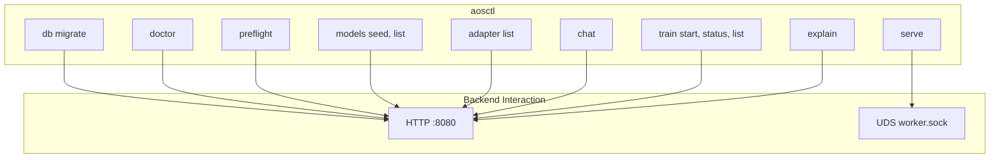

# CLI_GUIDE

aosctl. Source: `crates/adapteros-cli`.

---

## Help

```bash
./aosctl --help
./aosctl <subcommand> --help
```

---

## Command Structure



---

## Common Commands

| Command | Purpose | Source |
|---------|---------|--------|
| `aosctl db migrate` | Run migrations | `crates/adapteros-cli/src/commands/db.rs` |
| `aosctl doctor` | Health check | `crates/adapteros-cli/src/commands/doctor.rs` |
| `aosctl preflight` | Preflight checks | `crates/adapteros-cli/src/commands/preflight.rs` |
| `aosctl models seed` | Seed models from dir | `crates/adapteros-cli/src/commands/models.rs` |
| `aosctl models list` | List models | `crates/adapteros-cli/src/commands/models.rs` |
| `aosctl adapter list` | List adapters | `crates/adapteros-cli/src/commands/adapters.rs` |
| `aosctl chat` | Interactive chat | `crates/adapteros-cli/src/commands/chat.rs` |
| `aosctl serve` | Start worker (UDS) | `crates/adapteros-cli/src/commands/serve.rs` |
| `aosctl train start` | Start training job | `crates/adapteros-cli/src/commands/train_cli.rs` |
| `aosctl train-docs` | Train on docs | `crates/adapteros-cli/src/commands/train_docs.rs` |
| `aosctl explain <code>` | Explain error code | `crates/adapteros-cli/src/commands/explain.rs` |

---

## Build

```bash
./aosctl --rebuild --help
```

---

## Manual

`crates/adapteros-cli/docs/aosctl_manual.md`
