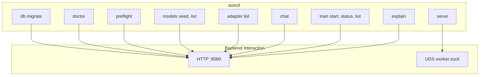

# CLI_GUIDE

aosctl. Source: `crates/adapteros-cli`.

---

## Help

```bash
./aosctl --help
./aosctl <subcommand> --help
```

---

## Command Structure



---

## Common Commands

| Command | Purpose | Source |
|---------|---------|--------|
| `aosctl db migrate` | Run migrations | commands/db.rs |
| `aosctl doctor` | Health check | commands/doctor.rs |
| `aosctl preflight` | Preflight checks | commands/preflight.rs |
| `aosctl models seed` | Seed models from dir | commands/models.rs |
| `aosctl models list` | List models | commands/models.rs |
| `aosctl adapter list` | List adapters | commands/adapters.rs |
| `aosctl chat` | Interactive chat | commands/chat.rs |
| `aosctl serve` | Start worker (UDS) | commands/serve.rs |
| `aosctl train start` | Start training job | commands/train_cli.rs |
| `aosctl train-docs` | Train on docs | commands/train_docs.rs |
| `aosctl explain <code>` | Explain error code | commands/explain.rs |

---

## Build

```bash
cargo build --release -p adapteros-cli --features tui
ln -sf target/release/aosctl ./aosctl
```

---

## Manual

`crates/adapteros-cli/docs/aosctl_manual.md`
