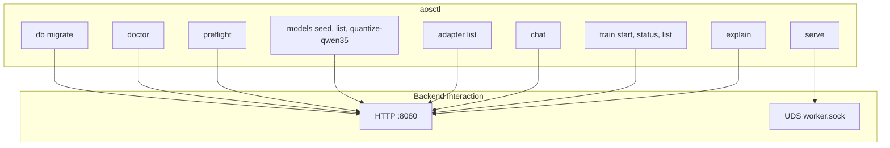

# CLI_GUIDE

aosctl. Source: `crates/adapteros-cli`.

---

## Help

```bash
./aosctl --help
./aosctl <subcommand> --help
```

---

## Command Structure



---

## Common Commands

| Command | Purpose | Source |
|---------|---------|--------|
| `aosctl db migrate` | Run migrations | `crates/adapteros-cli/src/commands/db.rs` |
| `aosctl doctor` | Health check | `crates/adapteros-cli/src/commands/doctor.rs` |
| `aosctl preflight` | Preflight checks | `crates/adapteros-cli/src/commands/preflight.rs` |
| `aosctl models seed` | Seed models from dir | `crates/adapteros-cli/src/commands/models.rs` |
| `aosctl models list` | List models | `crates/adapteros-cli/src/commands/models.rs` |
| `aosctl models quantize-qwen35` | Deterministic Qwen3.5-27B int4 quantize+eval+register gate | `crates/adapteros-cli/src/commands/models.rs`, `crates/adapteros-cli/src/commands/quantize_qwen.rs` |
| `aosctl adapter list` | List adapters | `crates/adapteros-cli/src/commands/adapters.rs` |
| `aosctl chat` | Interactive chat | `crates/adapteros-cli/src/commands/chat.rs` |
| `aosctl serve` | Start worker (UDS) | `crates/adapteros-cli/src/commands/serve.rs` |
| `aosctl train start` | Start training job | `crates/adapteros-cli/src/commands/train_cli.rs` |
| `aosctl train-docs` | Train on docs | `crates/adapteros-cli/src/commands/train_docs.rs` |
| `aosctl explain <code>` | Explain error code | `crates/adapteros-cli/src/commands/explain.rs` |

---

## Build

```bash
./aosctl --rebuild --help
```

---

## Manual

`crates/adapteros-cli/docs/aosctl_manual.md`

---

## Quantize Qwen3.5-27B

```bash
aosctl models quantize-qwen35 \
  --input var/models/Qwen3.5-27B \
  --output . \
  --guided \
  --enable-native-probes \
  --probe-max-samples 8 \
  --revision auto \
  --golden-prompts data/golden_prompts.jsonl \
  --calibration data/calibration.jsonl \
  --baseline-fp16 artifacts/fp16/qwen3.5-27b \
  --enforce-gates
```

Default behavior computes gate metrics in-command using deterministic evaluation flow. Legacy compatibility mode is available via `--metrics-from-flags`.

Optional native probe mode:
- Enable with `--enable-native-probes` (and optionally `--probe-max-samples <N>`).
- Probe outputs are informational in this phase and do **not** replace gate authority.
- Probe status contract:
  - `disabled`: probes were not requested.
  - `unavailable`: probe prerequisites/runtime context were not satisfied.
  - `failed`: probe was attempted but runtime/model probe execution failed.
  - `success`: probe completed and emitted probe metrics.
- In multi-backend mode, native probe execution is runtime-dependent and best-effort.
- Gates remain evaluated from deterministic `policy_metrics`.
- This pass does not add a dedicated real-MLX integration test.

Beginner-first flow:

```bash
aosctl models quantize-qwen35 \
  --input var/models/Qwen3.5-27B \
  --output . \
  --guided
```

Preflight only:

```bash
aosctl models quantize-qwen35 \
  --input var/models/Qwen3.5-27B \
  --output . \
  --guided \
  --dry-run
```

Exit codes:

- `0`: quantization/evaluation passed and artifact registered
- `2`: quantization/evaluation completed but release gates failed (artifact not registered)
- `3`: input/revision/infrastructure failure
