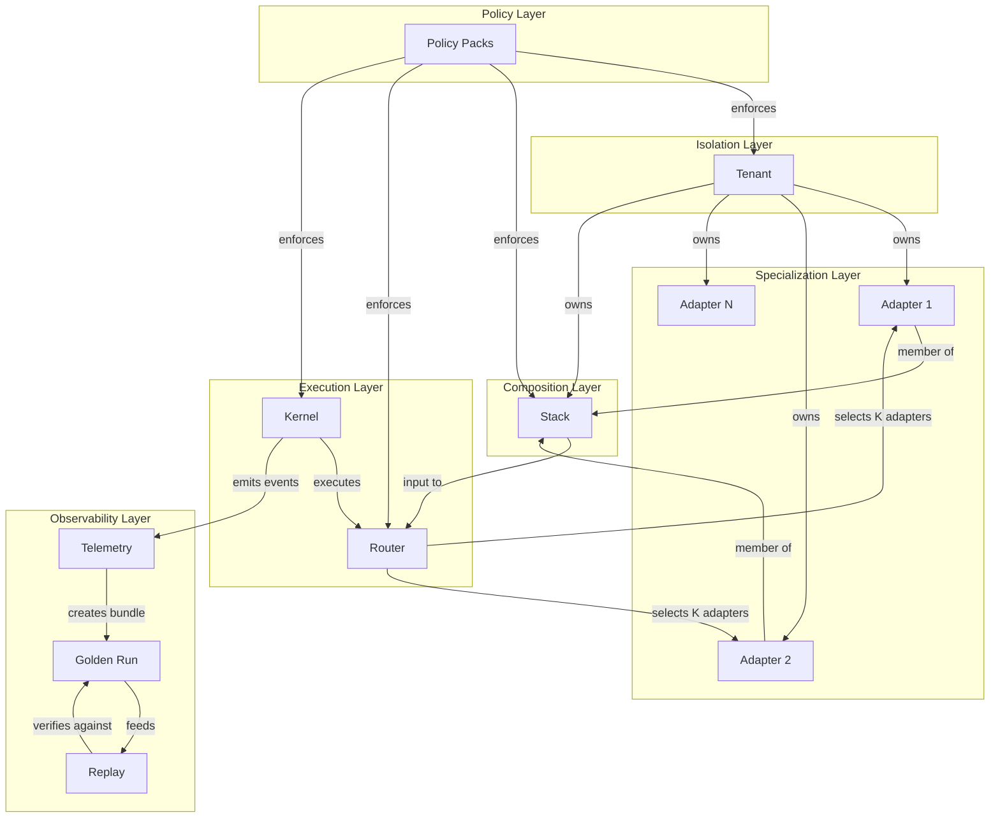

# AdapterOS Concepts

**Purpose**: Canonical mental model for understanding AdapterOS entities, relationships, and workflows.

**Audience**: All users (operators, developers, compliance officers, SREs)

**Last Updated**: 2025-11-17

---

## Overview

AdapterOS enables **deterministic multi-adapter inference** by organizing adapters, policies, and execution into a unified system. This document defines the core entities and their relationships.

### The Big Picture

```
┌─────────────────────────────────────────────────────────────┐
│                    AdapterOS Mental Model                    │
├─────────────────────────────────────────────────────────────┤
│                                                              │
│  1. TENANTS (Isolation Units)                               │
│     ↓                                                        │
│  2. ADAPTERS (Specialization Units)                         │
│     │                                                        │
│     ├─ Training → Weights → Packaging → Registration        │
│     │                                                        │
│     ↓                                                        │
│  3. STACKS (Execution Sets)                                 │
│     │                                                        │
│     ├─ Adapters + Workflow Rules + Policies                 │
│     │                                                        │
│     ↓                                                        │
│  4. ROUTER (Selection Logic)                                │
│     │                                                        │
│     ├─ K-Sparse Gating → Top-K Adapters per Request         │
│     │                                                        │
│     ↓                                                        │
│  5. KERNEL (Execution Engine)                               │
│     │                                                        │
│     ├─ Metal Kernels → Deterministic Computation            │
│     │                                                        │
│     ↓                                                        │
│  6. TELEMETRY (Audit Trail)                                 │
│     │                                                        │
│     ├─ Canonical JSON Events → Merkle Chain → Bundles       │
│     │                                                        │
│     ↓                                                        │
│  7. REPLAY (Verification)                                   │
│     │                                                        │
│     └─ Bundle → Re-execution → Determinism Check            │
│                                                              │
└─────────────────────────────────────────────────────────────┘
```

---

## Core Entities

### 1. Tenant

**Definition**: A tenant is the top-level isolation unit in AdapterOS, representing a user, organization, or environment.

**Purpose**: Enforce security boundaries, resource quotas, and access control.

**Examples**:
- `tenant-dev` - Development environment
- `tenant-prod` - Production environment
- `acme-corp` - Customer organization

**Key Properties**:
- `tenant_id` - Unique identifier
- `uid` / `gid` - Unix user/group for OS-level isolation
- Resource limits (memory, adapters, stacks)

**CLI**: `aosctl init-tenant --id tenant-prod --uid 5000 --gid 5000`

**UI**: Tenant selector in header, tenant management page

---

### 2. Adapter

**Definition**: An adapter is a LoRA (Low-Rank Adaptation) module that specializes a base model for a specific task, domain, or style.

**Purpose**: Efficient fine-tuning without modifying base model weights.

**Naming Convention**: `{tenant}/{domain}/{purpose}/{revision}`
- Example: `tenant-a/engineering/code-review/r001`

**Lifecycle States**:
```
Unloaded → Cold → Warm → Hot → Resident
    ↑                              ↓
    └──────── (eviction) ──────────┘
```

- **Unloaded**: Not in memory
- **Cold**: Recently loaded, rarely used
- **Warm**: Moderately active
- **Hot**: Frequently selected by router
- **Resident**: Pinned, cannot be evicted

**Key Properties**:
- `adapter_id` - Unique identifier
- `hash` - BLAKE3 content hash
- `rank` - LoRA rank (e.g., 8, 16, 32)
- `tier` - Lifecycle tier (unloaded, cold, warm, hot, resident)
- `activation_pct` - % of requests where router selected this adapter
- `memory_bytes` - VRAM footprint
- `expires_at` - TTL for ephemeral adapters
- `pinned` - Protection from eviction

**CLI**: `aosctl register-adapter --name tenant-a/engineering/code-review/r001 --hash <hash> --tier persistent --rank 16`

**UI**: Adapters page with state visualization, lifecycle controls

---

### 3. Stack

**Definition**: A stack is a tenant-scoped set of adapters with execution rules (workflow type, policies) used for inference.

**Purpose**: Reusable adapter combinations with consistent behavior.

**Workflow Types**:
- **Sequential**: Apply adapters in order
- **Parallel**: Apply adapters concurrently, merge results
- **UpstreamDownstream**: Two-phase (analysis → generation)

**Examples**:
- `code-review-stack` - [syntax-analyzer, style-checker] (Sequential)
- `multilingual-stack` - [en-adapter, fr-adapter, es-adapter] (Parallel)
- `reasoning-stack` - [fact-checker, reasoner] (UpstreamDownstream)

**Key Properties**:
- `stack_id` - Unique identifier
- `name` - Human-readable name
- `adapter_ids` - Ordered list of adapters
- `workflow_type` - Execution strategy
- `tenant_id` - Owner tenant

**CLI**: `aosctl create-stack --name code-review-stack --adapters adapter1,adapter2 --workflow sequential`

**UI**: Stacks page, stack builder wizard

---

### 4. Router

**Definition**: The router is the K-sparse gating mechanism that selects the top-K most relevant adapters for each inference request.

**Purpose**: Dynamic adapter selection based on input features, not static rules.

**Algorithm**:
1. Compute gate scores for all adapters (based on hidden states)
2. Select top-K adapters (e.g., K=3)
3. Deterministic tie-breaking: `(score desc, adapter_id asc)`
4. Quantize gates to Q15 for efficiency

**Key Parameters**:
- `k_sparse` - Number of adapters to select (default: 3)
- `entropy_floor` - Minimum entropy to prevent collapse (default: 0.02)
- `gate_quant` - Quantization mode (Q15, Q8)

**CLI**: Router config in `configs/cp.toml`

**UI**: Router configuration page, routing inspector (shows which adapters were selected for each request)

---

### 5. Kernel

**Definition**: Kernels are precompiled Metal compute shaders that execute LoRA operations on the GPU.

**Purpose**: Deterministic, reproducible computation with zero runtime compilation.

**Types**:
- Attention kernels (Q, K, V with LoRA)
- MLP kernels (FFN with LoRA)
- Fused kernels (attention + LoRA in one pass)

**Key Properties**:
- `.metallib` files embedded in binary
- Deterministic rounding modes
- Parameter structs for modularity
- BLAKE3 hashes for verification

**CLI**: Kernels managed at build time (`make metal`)

**UI**: Kernel status in system metrics, GPU utilization graphs

---

### 6. Telemetry

**Definition**: Telemetry is the structured event logging system that creates an immutable audit trail of all system operations.

**Purpose**: Compliance, debugging, replay verification, incident response.

**Event Types**:
- Inference events (request, response, router decisions)
- Lifecycle events (adapter load/unload, eviction)
- Policy events (violations, enforcement)
- System events (memory pressure, crashes)

**Storage Format**:
- Canonical JSON (JCS-serialized)
- Merkle chain (each event references previous hash)
- Bundles (compressed, signed archives)

**Key Fields**:
- `event_id` - Unique identifier
- `event_type` - Event category
- `timestamp` - ISO 8601 timestamp
- `tenant_id` - Tenant context
- `metadata` - Event-specific data
- `signature` - Ed25519 signature

**CLI**: `aosctl telemetry-verify --bundle-dir ./var/telemetry`

**UI**: Telemetry page with event timeline, bundle download

---

### 7. Golden Run & Replay

**Definition**: A golden run is a verified, deterministic inference execution whose telemetry bundle serves as a reference for future replay.

**Purpose**: Verify determinism by re-executing the same request and comparing outputs.

**Workflow**:
1. **Golden Run**: Execute inference, record telemetry bundle
2. **Store Bundle**: Save bundle with signature
3. **Replay**: Re-execute same request using bundle metadata
4. **Compare**: Verify outputs match byte-for-byte
5. **Report**: Emit divergence events if mismatch detected

**Key Properties**:
- `bundle_id` - Unique bundle identifier
- `bundle_hash` - BLAKE3 hash of bundle contents
- `replay_count` - Number of times replayed
- `divergence_count` - Number of detected divergences

**CLI**: `aosctl replay --bundle ./golden-runs/bundle-123.json`

**UI**: Golden runs page with replay controls, divergence reports

---

## Entity Relationships



**Diagram Explanation**:
- **Tenants** own adapters and stacks
- **Adapters** are grouped into stacks
- **Stacks** are input to the router
- **Router** selects K adapters per request
- **Kernel** executes the selected adapters
- **Telemetry** captures all events
- **Golden Runs** store verified executions
- **Replay** verifies determinism
- **Policies** enforce rules across all layers

---

## Key Workflows

### Workflow 1: Training → Adapter → Stack → Inference

This is the end-to-end flow from training a custom adapter to using it in production.

```
1. TRAINING
   ├─ Prepare dataset (PDF, text, code)
   ├─ Train LoRA adapter (rank=16, alpha=32)
   ├─ Validate adapter (test set)
   └─ Package adapter (.aos format)

2. REGISTRATION
   ├─ Compute BLAKE3 hash
   ├─ Register in registry (tenant, tier, rank)
   └─ Upload to artifact store

3. STACK CREATION
   ├─ Select adapters to combine
   ├─ Choose workflow type (Sequential, Parallel, etc.)
   ├─ Assign to tenant
   └─ Save stack configuration

4. INFERENCE
   ├─ Client sends request (prompt, model, stack_id)
   ├─ Router selects top-K adapters
   ├─ Kernel executes adapters
   ├─ Return response
   └─ Emit telemetry events

5. MONITORING
   ├─ Track adapter activation %
   ├─ Monitor memory usage
   ├─ Review policy violations
   └─ Analyze telemetry
```

**CLI Example**:
```bash
# 1. Train adapter
aosctl train --dataset ./data --rank 16 --output ./adapter

# 2. Register adapter
aosctl register-adapter \
  --name tenant-a/engineering/code-review/r001 \
  --hash <hash> \
  --tier persistent \
  --rank 16

# 3. Create stack
aosctl create-stack \
  --name code-review-stack \
  --adapters code-review/r001,style-checker/r002 \
  --workflow sequential

# 4. Inference
aosctl infer \
  --prompt "Review this code: ..." \
  --stack code-review-stack
```

---

### Workflow 2: Telemetry → Golden Run → Replay → Verification

This is the determinism verification flow.

```
1. CAPTURE TELEMETRY
   ├─ Execute inference request
   ├─ Record all events (router, kernel, policy)
   ├─ Build Merkle chain
   └─ Create telemetry bundle

2. CREATE GOLDEN RUN
   ├─ Mark bundle as "golden"
   ├─ Sign bundle with Ed25519
   ├─ Store in golden runs registry
   └─ Record bundle hash

3. REPLAY EXECUTION
   ├─ Load golden run bundle
   ├─ Extract request metadata
   ├─ Re-execute inference
   └─ Capture new telemetry

4. VERIFY DETERMINISM
   ├─ Compare outputs byte-for-byte
   ├─ Compare telemetry hashes
   ├─ Report divergences (if any)
   └─ Update divergence count
```

**CLI Example**:
```bash
# 1. Create golden run
aosctl infer --prompt "Test" --golden-run ./golden-runs/test-001.json

# 2. Replay
aosctl replay --bundle ./golden-runs/test-001.json

# 3. Verify
aosctl verify determinism-loop --json
```

---

### Workflow 3: Memory Pressure → Eviction → Lifecycle Management

This is the automatic resource management flow.

```
1. MONITOR MEMORY
   ├─ Poll UMA stats (every 5s)
   ├─ Compute headroom %
   └─ Determine pressure level

2. TRIGGER EVICTION (if pressure > 85%)
   ├─ Sort adapters by activation % (asc)
   ├─ Exclude pinned adapters
   ├─ Evict coldest adapter
   └─ Repeat until headroom ≥ 15%

3. UPDATE LIFECYCLE
   ├─ Mark adapter as "unloaded"
   ├─ Free VRAM
   ├─ Emit lifecycle event
   └─ Update activation stats

4. AUTO-PROMOTION (if activation % crosses threshold)
   ├─ Cold → Warm (10% activations)
   ├─ Warm → Hot (30% activations)
   ├─ Hot → Resident (user-pinned)
   └─ Update tier in registry
```

**UI Indicators**:
- Memory usage gauge (red = critical pressure)
- Adapter state badges (Unloaded, Cold, Warm, Hot, Resident)
- Pin icon for protected adapters

---

## Glossary

| Term | Definition |
|------|------------|
| **Adapter** | LoRA module that specializes a base model for a specific task |
| **Adapter Stack** | Tenant-scoped set of adapters with execution rules |
| **Activation %** | Percentage of requests where router selected this adapter |
| **Base Model** | Foundation model (e.g., Qwen, Llama) that adapters modify |
| **Bundle** | Compressed, signed telemetry archive for replay |
| **Divergence** | Mismatch between golden run and replay execution |
| **Eviction** | Removal of adapter from memory due to pressure |
| **Golden Run** | Verified, deterministic execution used as reference |
| **K-Sparse** | Router algorithm that selects top-K adapters per request |
| **Kernel** | Precompiled Metal compute shader for LoRA operations |
| **Lifecycle** | State machine for adapter memory management (Unloaded → Resident) |
| **Merkle Chain** | Linked sequence of hashed telemetry events |
| **Pinning** | Protection mechanism to prevent adapter eviction |
| **Policy Pack** | Set of rules enforced across tenants, adapters, and execution |
| **Replay** | Re-execution of golden run to verify determinism |
| **Router** | K-sparse gating mechanism for adapter selection |
| **Stack** | See "Adapter Stack" |
| **Telemetry** | Structured event logging for audit trail |
| **Tenant** | Top-level isolation unit (user, org, environment) |
| **Tier** | Lifecycle state (unloaded, cold, warm, hot, resident) |
| **TTL** | Time-to-live for ephemeral adapters (auto-delete) |
| **Workflow Type** | Execution strategy (Sequential, Parallel, UpstreamDownstream) |

---

## Frequently Asked Questions

### Q: What's the difference between an adapter and a stack?

**A**: An **adapter** is a single LoRA module (e.g., `code-review/r001`). A **stack** is a collection of adapters with a workflow type (e.g., `[code-review/r001, style-checker/r002]` in Sequential mode).

### Q: When should I pin an adapter?

**A**: Pin adapters that are **production-critical** and must never be evicted, even under memory pressure. Examples: fraud detection, safety filters, core business logic.

### Q: How does the router decide which adapters to use?

**A**: The router computes a gate score for each adapter based on the input's hidden states, then selects the top-K adapters with the highest scores. This is **learned**, not rule-based.

### Q: What happens when memory pressure is high?

**A**: The system automatically evicts the coldest (least-used) adapters until headroom ≥ 15%. Pinned adapters are never evicted.

### Q: How do I verify determinism?

**A**: Create a golden run bundle, then replay it. If outputs match byte-for-byte, determinism is verified. Divergences are logged to telemetry.

### Q: What are policy packs?

**A**: Policy packs are sets of rules enforced across the system. Example: **Egress Policy** ensures zero network egress in production. See `CLAUDE.md` for all 23 packs.

---

## Next Steps

### For Operators

1. **Setup a Tenant**: `aosctl init-tenant --id prod --uid 5000 --gid 5000`
2. **Register Adapters**: `aosctl register-adapter ...`
3. **Create Stacks**: `aosctl create-stack ...`
4. **Monitor System**: Check UI dashboard, telemetry page

### For Developers

1. **Read CLAUDE.md**: Developer guide with code examples
2. **Explore Diagrams**: See `docs/ARCHITECTURE_INDEX.md`
3. **Try Inference**: `aosctl infer --prompt "..." --stack ...`

### For Compliance Officers

1. **Review Policies**: See `docs/POLICIES.md`
2. **Audit Telemetry**: Check UI telemetry page, download bundles
3. **Verify Determinism**: `aosctl verify determinism-loop`

---

## Related Documentation

- **[CLAUDE.md](../CLAUDE.md)** - Developer guide
- **[ARCHITECTURE_INDEX.md](ARCHITECTURE_INDEX.md)** - Architecture docs index
- **[aosctl Manual](../crates/adapteros-cli/docs/aosctl_manual.md)** - CLI reference
- **[UI Quick Start](../ui/QUICK_START.md)** - UI guide
- **[POLICIES.md](POLICIES.md)** - Policy packs (create if missing)

---

**Copyright**: © 2025 JKCA / James KC Auchterlonie. All rights reserved.

**Maintained by**: AdapterOS Team

**Last Updated**: 2025-11-17
