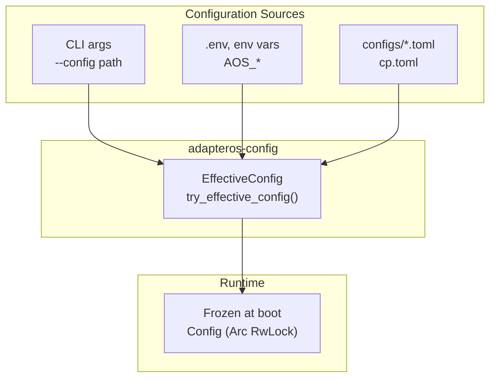
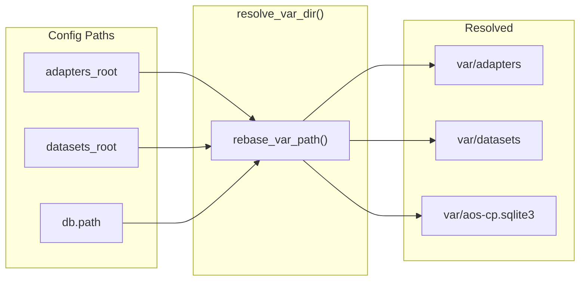

# CONFIGURATION

Precedence: CLI > env > TOML. Frozen at startup. Source: `adapteros-config`, `configs/cp.toml`.

---

## Load Order

**Entry:** `initialize_config()` in `adapteros-server/src/boot/config.rs` loads and merges.

---

## Sections (from cp.toml)

| Section | Key fields | Purpose |
|---------|------------|---------|
| `[server]` | port, bind, production_mode | HTTP bind, mode gate |
| `[general]` | determinism_mode | strict \| besteffort \| nondeterministic |
| `[db]` | path, pool_size, kv_path, kv_tantivy_path | SQLite, redb, Tantivy |
| `[auth]` | session_lifetime | JWT expiry (seconds) |
| `[security]` | require_pf_deny, jwt_secret, jwt_mode, dev_bypass | PF rules, JWT, dev bypass |
| `[paths]` | artifacts_root, adapters_root, datasets_root, documents_root | var/ layout |
| `[model.cache]` | max.mb | Worker KV cache budget (MB) |
| `[worker.safety]` | inference_timeout_secs, circuit_breaker_*, max_concurrent_requests | Timeouts, limits |
| `[circuit_breaker]` | failure_threshold, reset_timeout_secs, enable_stub_fallback | Circuit breaker |
| `[rate_limits]` | requests_per_minute, inference_per_minute, burst_size | Per-tenant limits |
| `[logging]` | level, log_dir, rotation | Tracing, file output |
| `[coreml]` | compute_preference, production_mode | ANE vs CPU |
| `[model_server]` | enabled, socket_path, server_addr, max_kv_cache_sessions | External model server (UDS-first) |

---

## Path Resolution

Paths in config are relative to `AOS_VAR_DIR` (default `var`). Resolved via `adapteros-core::resolve_var_dir()`.

---

## Env Overrides

| Var | Default | Purpose |
|-----|---------|---------|
| `AOS_VAR_DIR` | `var` | Root for runtime data |
| `AOS_MODEL_PATH` | - | Base model path |
| `AOS_MODEL_BACKEND` | `mlx` | mlx \| metal \| coreml |
| `AOS_PORT_PANE_BASE` | `18080` | Base offset for derived local ports |
| `AOS_SERVER_PORT` | 18080 | HTTP port |
| `AOS_DEV_NO_AUTH` | - | Bypass auth when set |
| `AOS_SECURITY_JWT_SECRET` | - | Override jwt_secret |
| `AOS_WORKER_SOCKET` | var/run/worker.sock (dev) | Worker UDS path |
| `AOS_TRAINING_EXECUTION_MODE` | `worker` | Training execution mode (`worker` or `in_process`) |
| `AOS_TRAINING_WORKER_FALLBACK` | `true` | Allow CP fallback to in-process when worker dispatch fails |
| `AOS_TRAINING_WORKER_SOCKET` | `var/run/training-worker.sock` | Training worker UDS path |
| `AOS_MODEL_SERVER_SOCKET_PATH` | `var/run/aos-model-srv.sock` | Model-server UDS endpoint (preferred) |
| `AOS_MODEL_SERVER_ADDR` | `http://127.0.0.1:18085` | Legacy TCP model-server endpoint (migration fallback) |
| `AOS_DATABASE_URL` | `sqlite://var/aos-cp.sqlite3` | Shared DB URL for CP and training worker |
| `AOS_DATASETS_DIR` | `var/datasets` | Training dataset root |
| `AOS_ARTIFACTS_DIR` | `var/artifacts` | Training artifacts/report root |

---

## Model Server Endpoint Contract

- UDS-first: set `model_server.socket_path` (or `AOS_MODEL_SERVER_SOCKET_PATH`) for hardened runtime deployments.
- Migration fallback: `model_server.server_addr` (or `AOS_MODEL_SERVER_ADDR`) remains supported for legacy/containerized TCP deployments.
- Worker transport selection:
  - If `socket_path` is set, workers connect over UDS and do not silently fall back to localhost TCP.
  - If `socket_path` is unset, workers use `server_addr`.
- Production policy:
  - When runtime mode is `prod` and `model_server.enabled=true`, `model_server.socket_path` is required.

---

## Dev Bypass

`security.dev_bypass = true` (debug builds) or `AOS_DEV_NO_AUTH=1` skips auth for UI iteration.

**Code:** `adapteros-server-api::set_dev_bypass_from_config()` called after `build_api_config()`.

---

## Training Worker Supervision

In `AOS_TRAINING_EXECUTION_MODE=worker`, the control plane supervises `aos-training-worker` on-host:

- It first probes the configured training-worker socket and adopts an existing healthy worker.
- If no healthy worker is available, it spawns `aos-training-worker` and retries with bounded backoff.
- It exports `AOS_TRAINING_WORKER_SOCKET`, `AOS_DATABASE_URL`, `AOS_DATASETS_DIR`, and `AOS_ARTIFACTS_DIR` to the managed worker process.
- In strict boot flows, attach/health failures are treated as boot failures; in non-strict mode, boot continues with warnings.

Recommended rollout:

1. Staging: `AOS_TRAINING_EXECUTION_MODE=worker` and `AOS_TRAINING_WORKER_FALLBACK=false`.
2. Production initial: `AOS_TRAINING_EXECUTION_MODE=worker` and `AOS_TRAINING_WORKER_FALLBACK=true`.
3. Production hardened: disable fallback after validating worker attach/restart metrics and cancel semantics.
