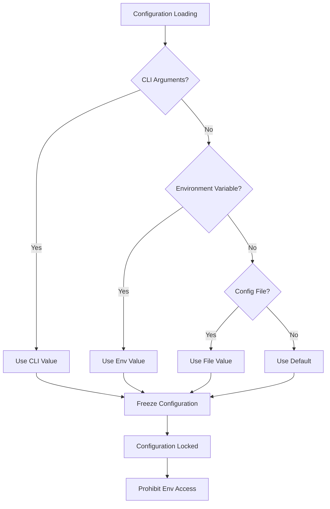
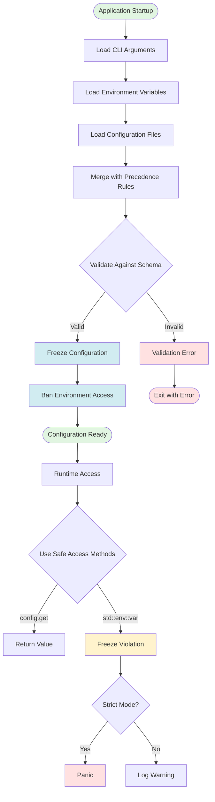

# AdapterOS Configuration Guide

**Purpose:** Comprehensive reference for configuring AdapterOS development and deployment environments.

**Last Updated:** 2026-01-02

---

## Table of Contents

1. [Environment Setup and Prerequisites](#environment-setup-and-prerequisites)
2. [Configuration File Formats](#configuration-file-formats)
3. [Configuration Precedence Rules](#configuration-precedence-rules)
4. [Environment Variables Reference](#environment-variables-reference)
   - [Backend Selection Priority](#backend-selection-priority)
   - [HuggingFace Hub Integration](#huggingface-hub-integration)
   - [Model Seeding](#model-seeding)
5. [Configuration Loading Flow](#configuration-loading-flow)
6. [Troubleshooting](#troubleshooting)

---

## Environment Setup and Prerequisites

### Quick Start

```bash
# Step 1: Copy environment template
cp .env.example .env

# Step 2: Edit for your setup
vim .env

# Step 3: Verify configuration
cargo run -p adapteros-orchestrator -- config show
```

### Platform Requirements

- **Operating System:** macOS 13+ with Apple Silicon (M1/M2/M3/M4)
- **Rust:** Nightly (see `rust-toolchain.toml`)
- **Database:** SQLite 3.35+
- **Build Tools:** Xcode Command Line Tools
- **UI Development:** pnpm 9+, Node.js 18+

### New Developer Setup Checklist

- [ ] Clone repository: `git clone https://github.com/rogu3bear/adapter-os.git`
- [ ] Copy environment: `cp .env.example .env`
- [ ] Download model: `./scripts/download_model.sh`
- [ ] Initialize database: `cargo run -p adapteros-orchestrator -- db migrate`
- [ ] Create default tenant: `cargo run -p adapteros-orchestrator -- init-tenant --id default --uid 1000 --gid 1000`
- [ ] Verify configuration: `cargo run -p adapteros-orchestrator -- config show`
- [ ] Start backend: `cargo run --release -p adapteros-server-api`
- [ ] Start UI: `cd ui && pnpm install && pnpm dev`
- [ ] Access UI: Open http://localhost:3200

### Production Deployment Checklist

- [ ] Set `AOS_SERVER_PRODUCTION_MODE=true`
- [ ] Generate JWT secret: `openssl rand -base64 32`
- [ ] Set `AOS_SECURITY_JWT_SECRET` to generated value
- [ ] Set `AOS_SECURITY_JWT_MODE=eddsa`
- [ ] Set `AOS_SECURITY_PF_DENY=true`
- [ ] Create UDS socket directory: `mkdir -p /var/run/aos`
- [ ] Set `AOS_SERVER_UDS_SOCKET=/var/run/aos/aos.sock`
- [ ] Update `AOS_DATABASE_URL` to production path
- [ ] Set `AOS_TELEMETRY_ENABLED=true`
- [ ] Set `RUST_LOG=warn,adapteros=info`
- [ ] Test configuration: `cargo run -p adapteros-orchestrator -- config show`
- [ ] Build release binary: `cargo build --release -p adapteros-server-api`
- [ ] Deploy and start service

---

## Configuration File Formats

AdapterOS supports TOML configuration files for structured settings.

### Example TOML Configuration

```toml
# configs/cp.toml
[server]
host = "127.0.0.1"
port = 8080
workers = 4

[database]
url = "sqlite://var/aos.db"
pool_size = 10

[policy]
strict_mode = true
audit_logging = true

[logging]
level = "info"
format = "json"
```

### Configuration Schema

#### Server Configuration
- `server.host` (string): Server bind address (default: "127.0.0.1")
- `server.port` (integer): Server port number (default: 8080, range: 1-65535)
- `server.workers` (integer): Number of worker threads (default: 4, range: 1-64)

#### Database Configuration
- `database.url` (string): Database connection URL (required)
- `database.pool_size` (integer): Connection pool size (default: 10, range: 1-100)

#### Policy Configuration
- `policy.strict_mode` (boolean): Enable strict policy enforcement (default: true)
- `policy.audit_logging` (boolean): Enable policy audit logging (default: true)

#### Logging Configuration
- `logging.level` (string): Logging level (default: "info", enum: debug,info,warn,error)
- `logging.format` (string): Logging format (default: "json", enum: json,text)

#### Diagnostics Configuration

Diagnostics capture structured event traces during inference, routing, and failure handling.
Configure these settings in your TOML config (for example, `configs/cp.toml`):

```toml
[diagnostics]
enabled = true
level = "stages"
channel_capacity = 1000
batch_size = 100
batch_timeout_ms = 500
max_events_per_run = 10000
```

- `diagnostics.enabled` (boolean, default: true, valid range: true/false): Enable diagnostics capture.
  - Performance: when false, disables diagnostics overhead entirely.
- `diagnostics.level` (string, default: "stages", enum: off, errors, stages, router, tokens): Capture depth.
  - `off`: No events captured (zero overhead).
  - `errors`: Failures and errors only.
  - `stages`: Stage enter/exit events (recommended baseline).
  - `router`: Includes routing decisions (useful for adapter debugging).
  - `tokens`: Token-level detail (high volume; dev-only).
  - Performance: higher levels increase event volume and storage pressure.
- `diagnostics.channel_capacity` (integer, default: 1000, valid range: >= 1): Buffer size before backpressure or drops.
  - Performance: higher values use more memory but reduce drops under load.
- `diagnostics.batch_size` (integer, default: 100, valid range: >= 1): Events per persistence batch.
  - Performance: higher values improve throughput but increase flush latency.
- `diagnostics.batch_timeout_ms` (integer, default: 500, valid range: >= 1): Max wait before forcing a flush.
  - Performance: lower values reduce latency but increase I/O.
- `diagnostics.max_events_per_run` (integer, default: 10000, valid range: >= 1): Upper bound per inference run.
  - Performance: prevents runaway runs from exhausting storage.

**Example use cases (starting points):**

| Scenario | Suggested Settings |
| --- | --- |
| Production (minimal overhead) | `level = "errors"`, `batch_size = 200` |
| Production (auditable) | `level = "stages"`, `batch_size = 100` |
| Debugging routing | `level = "router"` |
| Deep debugging | `level = "tokens"`, `max_events_per_run = 25000` |
| High-throughput | `channel_capacity = 5000`, `batch_size = 500`, `batch_timeout_ms = 2000` |

---

## Configuration Precedence Rules

AdapterOS uses a deterministic configuration system with strict precedence ordering to ensure predictable behavior.

### Precedence Order

Configuration values are loaded in this order (highest to lowest priority):

1. **CLI Arguments** (highest priority)
2. **Environment Variables** (medium priority)
3. **Configuration Files (.env, TOML)** (lower priority)
4. **Built-in Defaults** (lowest priority)



### 1. CLI Arguments (Highest Priority)

Command-line arguments override all other sources:

```bash
# Override server port via CLI
adapteros serve --server.port 9090

# Override multiple values
adapteros serve --server.host 0.0.0.0 --server.port 8080 --policy.strict_mode false
```

**Format:** `--key value` or `--key` (for boolean flags)

### 2. Environment Variables (Medium Priority)

Environment variables override manifest files but are overridden by CLI arguments:

```bash
# Set server configuration via environment
export AOS_SERVER_HOST=0.0.0.0
export AOS_SERVER_PORT=8080
export AOS_POLICY_STRICT_MODE=true

# Run application
adapteros serve
```

**Format:** `AOS_` prefix for AdapterOS-specific variables, underscore to dot conversion

### 3. Configuration Files (Lower Priority)

TOML configuration files and `.env` files provide defaults.

**Example:**
```bash
# .env contains
AOS_SERVER_PORT=8080

# CLI overrides .env
aosctl serve --port 9000  # Uses 9000, not 8080

# Environment overrides .env
export AOS_SERVER_PORT=8081
aosctl serve              # Uses 8081, not 8080
```

### Configuration Freeze Mechanism

Once initialized, configuration is frozen and becomes immutable:

```rust
use adapteros_config::{initialize_config, get_config};

// Initialize and freeze configuration
let config = initialize_config(cli_args, Some("configs/cp.toml".to_string()))?;

// Configuration is now frozen
assert!(config.is_frozen());

// Access configuration values
let host = config.get_or_default("server.host", "127.0.0.1");
let port: u16 = config.get("server.port")
    .and_then(|s| s.parse().ok())
    .unwrap_or(8080);
```

### Environment Variable Ban After Freeze

After freeze, direct environment variable access is prohibited to ensure determinism:

```rust
use adapteros_config::{safe_env_var, ConfigGuards};

// This will fail after freeze
let result = safe_env_var("PATH");
// Returns: Err(AosError::Config("Environment variable access prohibited after freeze"))

// Check if guards are frozen
if ConfigGuards::is_frozen() {
    println!("Configuration is frozen - env access prohibited");
}
```

---

## Environment Variables Reference

### Configuration Profiles

Choose the profile matching your use case:

#### Development Profile (Recommended for Local Testing)

**Characteristics:** All features enabled, debug logging, insecure defaults for convenience.

**.env setup:**
```bash
RUST_LOG=debug,adapteros=trace
AOS_SERVER_PRODUCTION_MODE=false
AOS_SECURITY_JWT_MODE=hs256
AOS_DATABASE_URL=sqlite:var/aos-cp.sqlite3
AOS_MODEL_PATH=./var/models/Qwen2.5-7B-Instruct-4bit
AOS_WORKER_MANIFEST=./manifests/qwen32b-coder-mlx.yaml
AOS_MANIFEST_HASH=756be0c4434c3fe5e1198fcf417c52a662e7a24d0716dbf12aae6246bea84f9e
AOS_MODEL_BACKEND=mlx
```

**Use when:**
- Running locally on your machine
- Debugging issues
- Testing new features
- Experimenting with different model backends

**Ports:**
- Backend API: `8080`
- UI development server: `3200` (shared for dev/prod tooling)
- Service panel: `3301`

#### Training Profile (ML Model Fine-Tuning)

**Characteristics:** MLX backend with GPU acceleration, float16 precision, memory pool enabled.

**.env setup:**
```bash
AOS_MODEL_BACKEND=mlx
AOS_MODEL_PATH=./var/models/Qwen2.5-7B-Instruct-4bit
AOS_WORKER_MANIFEST=./manifests/qwen32b-coder-mlx.yaml
AOS_MANIFEST_HASH=756be0c4434c3fe5e1198fcf417c52a662e7a24d0716dbf12aae6246bea84f9e
AOS_MLX_PRECISION=float16
AOS_MLX_MEMORY_POOL_ENABLED=true
AOS_MLX_MAX_MEMORY=0
RUST_LOG=info,adapteros_lora_mlx_ffi=debug
AOS_DATABASE_URL=sqlite:var/aos-cp.sqlite3
```

**Use when:**
- Training new LoRA adapters
- Running experiments
- Using MLX for production inference or training
- Need GPU-accelerated computation

**Requirements:**
- MLX library installed: `brew install mlx` (optional for MLX backend)
- Model in MLX format with `config.json`, `tokenizer.json`, weights

#### Production Profile (Secure Serving)

**Characteristics:** CoreML backend for ANE acceleration, maximum security, Ed25519 JWT, audit logging.

**.env setup:**
```bash
AOS_SERVER_PRODUCTION_MODE=true
AOS_MODEL_BACKEND=coreml
AOS_SECURITY_JWT_MODE=eddsa
AOS_SECURITY_JWT_SECRET=<generate-with-openssl>
AOS_SECURITY_PF_DENY=true
AOS_SERVER_UDS_SOCKET=/var/run/aos/aos.sock
AOS_DATABASE_URL=sqlite:/var/lib/aos/cp.db
RUST_LOG=warn,adapteros=info
AOS_TELEMETRY_ENABLED=true
```

**Use when:**
- Serving inference at scale
- Enforcing security policies
- Auditing required (compliance, regulations)
- Production-grade reliability needed

**Requirements:**
- macOS 13+ with Apple Silicon (M1+)
- Xcode Command Line Tools
- CoreML model or conversion pipeline
- JWT secret (generate: `openssl rand -base64 32`)
- UDS socket directory: `sudo mkdir -p /var/run/aos && sudo chmod 755 /var/run/aos`

### Variable Reference Tables

#### Model Configuration

| Variable | Default | Purpose | Example |
|----------|---------|---------|---------|
| `AOS_MODEL_PATH` | `./var/models/Qwen2.5-7B-Instruct-4bit` | Base model directory | `./var/models/Qwen2.5-7B-Instruct-4bit` |
| `AOS_MANIFEST_HASH` | `756be0c4434c3fe5e1198fcf417c52a662e7a24d0716dbf12aae6246bea84f9e` | Manifest hash (preferred contract) | Same as default |
| `AOS_MODEL_BACKEND` | `mlx` | Backend selection | `mlx`, `coreml`, `metal`, `auto` |
| `AOS_MODEL_ARCHITECTURE` | Auto-detect | Model type (Qwen2, Llama, etc.) | `qwen2`, `llama2` |
| `AOS_PIN_BASE_MODEL` | `false` | Pin base model in worker cache for residency | `true` |
| `AOS_PIN_BUDGET_BYTES` | unset | Pin budget for base model residency (bytes) | `16GB`, `17179869184` |

**Notes:**
- `AOS_MODEL_PATH` must contain `config.json` and model weights
- `AOS_MANIFEST_HASH` is the routing contract; workers fetch/verify by hash
- `AOS_MODEL_BACKEND=mlx` by default; `auto` selects MLX > CoreML > MlxBridge > Metal
- Model auto-detected from `config.json` if architecture not specified
- Base model pinning keeps weights resident; set `AOS_PIN_BUDGET_BYTES` >= model size to avoid startup failure

#### Backend Selection for Codebase Adapters

Codebase adapters have special backend requirements due to their session-scoped, live-updating nature.

**Live Codebase Sessions:**

When running inference with a live codebase adapter (bound to an active session), configure:

```bash
# Required: Use MLX or Metal for live codebase adapters
export AOS_MODEL_BACKEND=mlx  # or 'metal'

# CoreML is NOT compatible with live codebase adapters
# Setting 'coreml' will auto-downgrade to mlx for codebase sessions
```

**Why CoreML Doesn't Work:**
- CoreML packages are compiled and immutable
- Live codebase adapters receive incremental updates during the session
- Updates cannot be reflected in a pre-compiled package

**Frozen Codebase Adapters (CoreML Deployment):**

To deploy a frozen codebase adapter on CoreML:

```bash
# 1. Freeze the adapter (unbind from session)
# This triggers automatic versioning

# 2. Pre-fuse the frozen adapter into base weights
cargo run --bin aosctl -- coreml fuse \
  --adapter ./frozen-codebase.aos \
  --base ./base-model.safetensors \
  --output ./fused.safetensors

# 3. Convert to CoreML package
python scripts/convert_mlx_to_coreml.py \
  --input ./fused.safetensors \
  --output ./fused-codebase.mlpackage

# 4. Deploy with CoreML backend
export AOS_MODEL_BACKEND=coreml
export AOS_MODEL_PATH=./fused-codebase.mlpackage
```

**Configuration Validation:**

The system validates backend compatibility at startup:

| Scenario | AOS_MODEL_BACKEND | Codebase Adapter State | Result |
|----------|-------------------|------------------------|--------|
| Live session | `coreml` | Live (bound) | Auto-downgrade to MLX + warning |
| Live session | `mlx` | Live (bound) | OK |
| Deployment | `coreml` | Frozen (fused package) | OK |
| Deployment | `mlx` | Frozen | OK (but wastes ANE) |

#### Server Configuration

| Variable | Default | Purpose | Example |
|----------|---------|---------|---------|
| `AOS_SERVER_HOST` | `127.0.0.1` | Bind address | `0.0.0.0` (bind all), `192.168.1.100` (specific) |
| `AOS_SERVER_PORT` | `8080` | API server port | `8000`, `9000` |
| `AOS_SERVER_WORKERS` | CPU cores | Worker thread count | `4`, `8` |
| `AOS_SERVER_PRODUCTION_MODE` | `false` | Enable production constraints | `true` (production), `false` (dev) |
| `AOS_SERVER_UDS_SOCKET` | unset | Unix domain socket (production only) | `/var/run/aos/aos.sock` |
| `AOS_UI_PORT` | `3200` | Vite dev server port | `3000`, `5173` |
| `AOS_PANEL_PORT` | `3301` | Service panel port | `3300` |

**Production Requirements:**
- When `AOS_SERVER_PRODUCTION_MODE=true`:
  - `AOS_SERVER_UDS_SOCKET` must be set
  - `AOS_SECURITY_JWT_MODE` must be `eddsa`
  - `AOS_SECURITY_PF_DENY` must be `true`

#### Database Configuration

| Variable | Default | Purpose | Example |
|----------|---------|---------|---------|
| `AOS_DATABASE_URL` | `sqlite:var/aos-cp.sqlite3` | Database connection string | `sqlite:/path/to/db.sqlite3` |
| `AOS_DATABASE_POOL_SIZE` | `10` | Connection pool size | `5`, `20` |
| `AOS_DATABASE_TIMEOUT` | `30` | Query timeout (seconds) | `60`, `120` |

**Connection String Formats:**
- SQLite (development): `sqlite:var/aos-cp.sqlite3`
- SQLite (absolute path): `sqlite:/var/lib/aos/cp.db`

**Notes:**
- SQLite always uses WAL mode for safety
- Pool size should match expected concurrent connections
- Timeout covers all database operations

#### Runtime Path Configuration

| Variable | Default | Purpose |
|----------|---------|---------|
| `AOS_MODEL_CACHE_DIR` | `./var/model-cache/models` | Base model cache root (joins with `AOS_BASE_MODEL_ID`) |
| `AOS_ADAPTERS_ROOT` | `./var/adapters` (legacy: `AOS_ADAPTERS_DIR`) | Root for .aos artifacts/registry |
| `DATABASE_URL` | `./var/cp.db` | Control plane SQLite path (used if `AOS_DATABASE_URL` unset) |
| `AOS_TELEMETRY_DIR` | `./var/telemetry` | Telemetry bundle output (workers + CLI serve) |
| `AOS_INDEX_DIR` | `./var/indices` | RAG index root (`<tenant>` appended) |
| `AOS_MANIFEST_CACHE_DIR` | `./var/manifest-cache` | Worker manifest cache location |
| `AOS_WORKER_SOCKET` | `/var/run/aos/<tenant>/worker.sock` (fallback `./var/run/worker.sock`) | Worker UDS path; training cancel falls back to `/var/run/adapteros.sock` |
| `AOS_STATUS_PATH` | `/var/run/adapteros_status.json` (fallback `var/adapteros_status.json`) | Menu bar status file target |
| `AOS_EMBEDDING_MODEL_PATH` | `./var/model-cache/models/bge-small-en-v1.5` | Embedding model location (tokenizer at `<path>/tokenizer.json`) |

**Behavior:** When unset, runtime logs the chosen default path and source (env vs default) at startup to remove ambiguity between `./var/...` and `/var/...`.

#### Embedding / RAG Paths

- `AOS_EMBEDDING_MODEL_PATH` points to the embedding model directory; tokenizer is expected at `<path>/tokenizer.json`. Resolved via `resolve_embedding_model_path*` (env override or default) and logged with the source.
- `AOS_INDEX_DIR` is the RAG index root; namespaces are per-tenant at `<index_root>/<tenant_id>`. Indices are not shared across tenants/namespaces.
- Set both when running ingest or server so embedding and RAG loaders resolve consistently.

#### Security Configuration

| Variable | Default | Purpose | Example |
|----------|---------|---------|---------|
| `AOS_SECURITY_JWT_MODE` | `eddsa` | JWT signing algorithm | `eddsa` (Ed25519, production), `hs256` (HMAC, dev-only) |
| `AOS_SECURITY_JWT_SECRET` | unset | JWT signing secret | Generate: `openssl rand -base64 32` |
| `AOS_SECURITY_JWT_TTL` | `8h` | Token time-to-live | `1h`, `24h` |
| `AOS_SECURITY_PF_DENY` | `false` | Enable PF deny rules | `true` (production), `false` (dev) |

**JWT Generation:**
```bash
# Generate a new JWT secret
openssl rand -base64 32

# Example output:
# 1a2b3c4d5e6f7g8h9i0j1k2l3m4n5o6p7q8r9s0=
```

**Ed25519 (Production):**
- Uses 256-bit Ed25519 keys
- Guaranteed authenticity and non-repudiation
- Required for `AOS_SERVER_PRODUCTION_MODE=true`

**HS256 (Development-Only):**
- Simple HMAC-SHA256
- Requires `AOS_SECURITY_JWT_SECRET`
- Must NOT be used in production

#### Logging Configuration

| Variable | Default | Purpose | Example |
|----------|---------|---------|---------|
| `RUST_LOG` | `info,adapteros=debug` | Log level specification | `debug`, `trace`, `info,myapp=debug` |
| `AOS_LOG_FORMAT` | `text` | Output format | `text` (human-readable), `json` (structured) |
| `AOS_LOG_FILE` | stderr | Log file path | `/var/log/aos/aos.log` |

**Log Levels (highest to lowest):**
```
ERROR   - Critical failures (action required)
WARN    - Warnings (attention needed)
INFO    - General information (normal operations)
DEBUG   - Development details (diagnostics)
TRACE   - Detailed debug (very verbose)
```

**Module-Specific Configuration:**
```bash
# Backend debug info, everything else at info
RUST_LOG=info,adapteros_lora_mlx_ffi=debug

# Trace router decisions, debug adapters, warn everything else
RUST_LOG=warn,adapteros_lora_router=trace,adapteros_lora_worker=debug

# Development (very verbose)
RUST_LOG=debug,adapteros=trace
```

**JSON Format Example:**
```bash
AOS_LOG_FORMAT=json
# Output: {"timestamp":"2025-11-23T...","level":"INFO","module":"adapteros","message":"..."}
```

#### Diagnostics Configuration

Diagnostics settings control event capture and persistence for the diagnostics pipeline.

**Example (TOML):**
```toml
[diagnostics]
enabled = true
level = "stages"
channel_capacity = 1000
batch_size = 100
batch_timeout_ms = 500
max_events_per_run = 10000
```

**Field Reference:**
- `diagnostics.enabled` (bool, default: `true`, valid: `true|false`). Performance: `false` disables capture (lowest overhead). Example: disable in latency-critical or storage-constrained environments.
- `diagnostics.level` (enum, default: `stages`, valid: `off|errors|stages|router|tokens`). Performance: higher verbosity increases event volume and I/O. Example: `errors` for minimal overhead; `router` for adapter debugging; `tokens` for deep debugging (dev only).
- `diagnostics.channel_capacity` (int, default: `1000`, valid: `>= 1`). Performance: larger buffers reduce drops under load at the cost of memory. Example: raise to 5000 for bursty traffic.
- `diagnostics.batch_size` (int, default: `100`, valid: `>= 1`). Performance: larger batches improve throughput but increase flush latency. Example: raise to 200 for high-throughput workloads.
- `diagnostics.batch_timeout_ms` (int, default: `500`, valid: `>= 1`). Performance: lower values flush more often (fresh data, more I/O). Example: reduce to 100ms when monitoring live incidents.
- `diagnostics.max_events_per_run` (int, default: `10000`, valid: `>= 1`). Performance: higher limits allow verbose runs but risk storage growth. Example: cap at 2000 for constrained storage.

**Performance Tuning Guide:**

| Scenario | Recommended Settings |
|----------|----------------------|
| Production (minimal overhead) | `level = "errors"`, `batch_size = 200` |
| Production (auditable) | `level = "stages"`, `batch_size = 100` |
| Debugging routing | `level = "router"` |
| Deep debugging | `level = "tokens"`, `max_events_per_run = 50000` |
| High-throughput | `channel_capacity = 5000`, `batch_size = 500` |

#### Memory Configuration

| Variable | Default | Purpose | Example |
|----------|---------|---------|---------|
| `AOS_MEMORY_HEADROOM_PCT` | `0.15` | Headroom to maintain | `0.2` (20%), `0.1` (10%) |
| `AOS_MEMORY_EVICTION_THRESHOLD` | `0.85` | Trigger eviction at (%) | `0.9` (90%), `0.75` (75%) |

**Memory Management:**
- **Headroom:** Percentage of RAM to keep free for system operations
  - `0.15` = keep 15% free (evict when usage > 85%)
  - Higher = more aggressive eviction, lower latency
  - Lower = more adapter capacity, risk of system slowdown

- **Eviction threshold:** When to start evicting adapters
  - `0.85` = evict when system usage exceeds 85% of total RAM
  - Adapters evicted by LRU (least recently used)

**Example (16GB Mac):**
```bash
# Keep 2.4GB free (15% of 16GB)
AOS_MEMORY_HEADROOM_PCT=0.15

# Evict when total usage exceeds 13.6GB (85% of 16GB)
AOS_MEMORY_EVICTION_THRESHOLD=0.85
```

#### Backend Configuration

| Variable | Default | Purpose | Example |
|----------|---------|---------|---------|
| `AOS_BACKEND_COREML_ENABLED` | `true` | Enable CoreML backend | `false` to disable |
| `AOS_BACKEND_METAL_ENABLED` | `true` | Enable Metal backend | `false` to disable |
| `AOS_BACKEND_MLX_ENABLED` | `true` | Enable MLX backend | `false` to disable |
| `AOS_BACKEND_GPU_INDEX` | `0` | GPU device index (multi-GPU) | `1`, `2` |

#### MLX Backend Configuration

| Variable | Default | Purpose | Example |
|----------|---------|---------|---------|
| `AOS_MLX_FFI_MODEL` | unset | MLX model directory | `./var/models/Qwen2.5-7B-Instruct-4bit` |
| `AOS_MLX_IMPL` | `auto` | MLX implementation override (`auto`, `ffi`, `rs`) | `ffi` |
| `AOS_MLX_MAX_MEMORY` | `0` (unlimited) | Max memory (bytes) | `16000000000` (16GB) |
| `AOS_MLX_MEMORY_POOL_ENABLED` | `true` | Enable memory pool | `false` to disable |
| _Quantization_ | model-defined | Quantization/precision is fixed per backend | model weights (int4/int8/fp16) |

**Quantization Note:** Quantization/precision is fixed per backend. MLX uses the model's packaged weights (int4/int8/fp16) without per-request or per-token overrides. Metal/CoreML run backend-fixed fp16/bf16 kernels.

**TOML Configuration (`[mlx]` section):**

```toml
# configs/cp.toml
[mlx]
enabled = true
max_memory = 0              # 0 = unlimited, or bytes (e.g., 16000000000 for 16GB)
memory_pool_enabled = true  # Enable unified memory pool
model_path = "./var/models/Qwen2.5-7B-Instruct-4bit"
```

#### Backend Selection Priority

When `AOS_MODEL_BACKEND=auto` (or unset), backends are selected using the MLX-first priority chain:

1. **MLX** (highest priority) - Native Apple Silicon inference via C++ FFI
2. **CoreML** - ANE-accelerated inference for compiled models
3. **MlxBridge** - Fallback MLX bridge implementation
4. **Metal** - Direct GPU compute kernels
5. **CPU** (lowest priority) - Software fallback

The system probes each backend in order and selects the first available. Set `AOS_MODEL_BACKEND` explicitly to override:

```bash
# Force specific backend
export AOS_MODEL_BACKEND=mlx      # Always use MLX
export AOS_MODEL_BACKEND=coreml   # Always use CoreML (requires .mlpackage)
export AOS_MODEL_BACKEND=metal    # Always use Metal kernels
export AOS_MODEL_BACKEND=cpu      # Force CPU fallback
export AOS_MODEL_BACKEND=auto     # Use priority chain (default)
```

#### HuggingFace Hub Integration

AdapterOS can automatically download models from HuggingFace Hub on startup.

| Variable | Default | Purpose | Example |
|----------|---------|---------|---------|
| `AOS_HF_HUB_ENABLED` | `false` | Enable HuggingFace Hub model downloads | `true` |
| `AOS_PRIORITY_MODELS` | unset | Comma-separated list of models to download on startup | `Qwen/Qwen2.5-7B-Instruct,meta-llama/Llama-3.1-8B` |
| `HF_TOKEN` | unset | HuggingFace API token for private/gated models | `hf_xxxxxxxxxxxxxxxx` |
| `AOS_HF_REGISTRY_URL` | `https://huggingface.co` | Custom registry URL (for mirrors/proxies) | `https://hf-mirror.com` |
| `AOS_MAX_CONCURRENT_DOWNLOADS` | `3` | Max parallel downloads (1-10) | `5` |
| `AOS_DOWNLOAD_TIMEOUT_SECS` | `300` | Download timeout in seconds (30-3600) | `600` |

**Setup Example:**

```bash
# Enable HuggingFace Hub downloads
export AOS_HF_HUB_ENABLED=true

# Download specific models on startup
export AOS_PRIORITY_MODELS="Qwen/Qwen2.5-7B-Instruct,mlx-community/Llama-3.1-8B-4bit"

# For private/gated models (e.g., Llama), set your HF token
export HF_TOKEN=hf_xxxxxxxxxxxxxxxxxxxxxxxxxxxxxxxx

# Optional: Increase concurrent downloads for faster startup
export AOS_MAX_CONCURRENT_DOWNLOADS=5

# Optional: Increase timeout for large models on slow connections
export AOS_DOWNLOAD_TIMEOUT_SECS=600
```

**Notes:**
- Models are downloaded to `AOS_MODEL_CACHE_DIR` (default: `./var/model-cache/models`)
- The HF token is required for gated models (Llama, Mistral, etc.) - generate at https://huggingface.co/settings/tokens
- Downloads are cached; subsequent startups skip already-downloaded models
- Use `AOS_HF_REGISTRY_URL` for air-gapped environments with a local HuggingFace mirror

#### Model Seeding

Model seeding automatically registers cached models in the database on startup.

| Variable | Default | Purpose | Example |
|----------|---------|---------|---------|
| `AOS_SEED_MODEL_CACHE` | `true` (debug), `false` (release) | Enable auto-seeding models from cache to DB | `true` |
| `AOS_MODEL_CACHE_DIR` | `./var/model-cache/models` | Model cache directory location | `/data/models` |

**Behavior:**
- In **debug builds**, model seeding is enabled by default for developer convenience
- In **release builds**, model seeding is disabled by default (explicit registration preferred)
- When enabled, the server scans `AOS_MODEL_CACHE_DIR` on startup and registers any valid models found

**Setup Example:**

```bash
# Enable model seeding in production (if desired)
export AOS_SEED_MODEL_CACHE=true

# Custom model cache location
export AOS_MODEL_CACHE_DIR=/data/aos-models

# Models in this directory will be auto-registered on startup
```

**Directory Structure:**
```
$AOS_MODEL_CACHE_DIR/
├── Qwen2.5-7B-Instruct-4bit/
│   ├── config.json
│   ├── tokenizer.json
│   └── model-*.safetensors
├── Llama-3.1-8B-Instruct/
│   ├── config.json
│   ├── tokenizer.json
│   └── model-*.safetensors
└── ...
```

**Notes:**
- Each subdirectory must contain a valid `config.json` to be recognized as a model
- Seeding is idempotent; existing models in the database are not duplicated
- Use `aosctl models list` to verify registered models after seeding

#### Telemetry Configuration

| Variable | Default | Purpose | Example |
|----------|---------|---------|---------|
| `AOS_TELEMETRY_ENABLED` | `false` | Enable telemetry collection | `true` (production) |
| `AOS_TELEMETRY_EXPORT_INTERVAL` | `60s` | Export frequency | `30s`, `5m` |

**Telemetry Data Collected:**
- Router decisions (adapter selections)
- Inference latencies and throughput
- Memory usage patterns
- Error rates and recovery events
- Policy violations (if enabled)

#### Federation Configuration

| Variable | Default | Purpose | Example |
|----------|---------|---------|---------|
| `AOS_FEDERATION_ENABLED` | `false` | Enable federation | `true` for multi-node |
| `AOS_FEDERATION_NODE_ID` | auto-generated | Node identifier | `prod-node-001` |
| `AOS_FEDERATION_PEERS` | empty | Comma-separated peer addresses | `peer1.com:9000,peer2.com:9000` |

#### Legacy AOS Migration (Temporary)

- `AOS_ALLOW_LEGACY_AOS` (default: off) — Emergency migration flag to allow legacy AOS 1.x bundles. Default off; do not use in steady state. Emits `LEGACY_AOS_*` warnings and metrics when used. Removal scheduled for AdapterOS v0.15.0; tracked in `docs/issues/AOS_ALLOW_LEGACY_AOS_REMOVAL.md`.
- Repackage adapters into AOS2: convert legacy bundles with `aosctl aos convert --input <legacy.aos> --output <adapter.aos> --format aos2` (or rerun packaging to emit AOS2 directly), then turn this flag off.

#### Debug Flags (Development Only)

**DANGER: Do not use in production!**

| Variable | Default | Purpose |
|----------|---------|---------|
| `AOS_DEBUG_DETERMINISTIC` | `false` | Enable determinism debug logging |
| `AOS_DEBUG_SKIP_KERNEL_SIG` | `false` | Skip kernel signature verification (DEV-ONLY; blocked when `AOS_SERVER_PRODUCTION_MODE` is set) |

---

## Configuration Loading Flow

### Mermaid Diagram



### Loading Process

1. **CLI Arguments Loading**
   - Parse command-line arguments
   - Store in highest priority tier

2. **Environment Variables Loading**
   - Read from system environment
   - Apply `AOS_` prefix filtering
   - Store in medium priority tier

3. **Configuration File Loading**
   - Load TOML manifest files
   - Load `.env` files
   - Store in lower priority tier

4. **Merge with Precedence**
   - Apply precedence rules (CLI > Env > File > Default)
   - Resolve conflicts deterministically

5. **Schema Validation**
   - Validate types (integer, string, boolean)
   - Validate ranges (port numbers, pool sizes)
   - Validate required fields
   - Check enum values

6. **Configuration Freeze**
   - Lock configuration as immutable
   - Generate configuration hash
   - Store freeze timestamp

7. **Ban Environment Access**
   - Enable environment access guards
   - Prohibit `std::env::var()` calls
   - Enforce safe access methods

### Usage Examples

#### Basic Configuration Loading

```rust
use adapteros_config::{ConfigLoader, LoaderOptions};

// Create loader with default options
let loader = ConfigLoader::new();

// Load configuration from multiple sources
let config = loader.load(
    vec!["--server.port".to_string(), "9090".to_string()],
    Some("configs/cp.toml".to_string())
)?;

// Configuration is automatically frozen
assert!(config.is_frozen());
```

#### Custom Loader Options

```rust
use adapteros_config::{ConfigLoader, LoaderOptions};

// Create custom loader options
let options = LoaderOptions {
    strict_mode: true,
    validate_types: true,
    allow_unknown_keys: false,
    env_prefix: "AOS_".to_string(),
};

let loader = ConfigLoader::with_options(options);
```

#### Configuration Validation

```rust
// Validate configuration against schema
let validation_errors = config.validate()?;
if !validation_errors.is_empty() {
    for error in validation_errors {
        eprintln!("Validation error: {} - {}", error.key, error.message);
    }
    return Err(AosError::Config("Configuration validation failed"));
}
```

### Best Practices

#### 1. Initialize Early
Initialize configuration as early as possible in application startup:

```rust
fn main() -> Result<()> {
    // Initialize configuration first
    let config = initialize_config(std::env::args().collect(), None)?;

    // Initialize other systems with frozen config
    let server = Server::new(config)?;
    server.run()
}
```

#### 2. Use Safe Access Methods
Always use the provided safe access methods:

```rust
// Good: Use safe access methods
let host = config.get_or_default("server.host", "127.0.0.1");
let port = config.get("server.port")
    .and_then(|s| s.parse().ok())
    .unwrap_or(8080);

// Bad: Direct environment access after freeze
let host = std::env::var("AOS_SERVER_HOST")?; // Prohibited
```

#### 3. Validate Configuration
Always validate configuration before use:

```rust
let config = loader.load(cli_args, manifest_path)?;
let validation_errors = config.validate()?;
if !validation_errors.is_empty() {
    return Err(AosError::Config("Invalid configuration"));
}
```

#### 4. Handle Errors Gracefully
Provide meaningful error messages for configuration issues:

```rust
match initialize_config(cli_args, manifest_path) {
    Ok(config) => {
        println!("Configuration loaded successfully");
        // Use config...
    }
    Err(AosError::Config(msg)) => {
        eprintln!("Configuration error: {}", msg);
        std::process::exit(1);
    }
    Err(e) => {
        eprintln!("Unexpected error: {}", e);
        std::process::exit(1);
    }
}
```

---

## Troubleshooting

### Common Configuration Issues

#### Variable Not Taking Effect

**Problem:** Changed `.env` but server still uses old value.

**Solution:** Environment variables must be loaded before starting the process.
```bash
# Option 1: Export from .env
export $(grep -v '^#' .env | xargs)

# Option 2: Use cargo run (automatically loads .env)
cargo run --release -p adapteros-server-api

# Option 3: Use .env.local in development
cp .env .env.local
# .env.local is loaded by most Rust frameworks
```

#### Port Already in Use

**Problem:** `Error: bind: Address already in use`

**Solution:**
```bash
# Find process using port
lsof -i :8080

# Kill process
pkill -f adapteros-server

# Or use different port
AOS_SERVER_PORT=9000 cargo run --release -p adapteros-server-api
```

#### Database Connection Failed

**Problem:** `Error: unable to open database: no such file or directory`

**Solution:**
```bash
# Verify AOS_DATABASE_URL
echo $AOS_DATABASE_URL

# Create directory if needed
mkdir -p var

# Run migrations
cargo run -p adapteros-orchestrator -- db migrate
```

#### Model Not Found

**Problem:** `Error: model not found at ./var/models/Qwen2.5-7B-Instruct-4bit`

**Solution:**
```bash
# Verify AOS_MODEL_PATH or AOS_MLX_FFI_MODEL
echo $AOS_MODEL_PATH

# Download model
./scripts/download_model.sh

# Check model directory
ls -la var/models/Qwen2.5-7B-Instruct-4bit/
# Should contain: config.json, tokenizer.json, model weights
```

#### MLX Backend Not Available

**Problem:** `Error: MLX backend not available`

**Solution:**
```bash
# Install MLX library (optional, not required for all uses)
brew install mlx

# Or use different backend
export AOS_MODEL_BACKEND=metal

# Verify available backends
cargo run -p adapteros-orchestrator -- config show | grep backend
```

### Configuration Failure Modes

#### 1. Invalid Configuration File
```bash
# Malformed TOML file
echo "invalid toml content" > config.toml
adapteros serve --config config.toml
# Error: Failed to parse manifest file config.toml: expected `=`
```

#### 2. Missing Required Fields
```bash
# Missing required database.url
adapteros serve
# Error: Configuration validation failed: database.url - Required field missing
```

#### 3. Invalid Field Types
```bash
# Invalid port number
export AOS_SERVER_PORT=invalid
adapteros serve
# Error: Configuration validation failed: server.port - Invalid integer value
```

#### 4. Environment Variable Access After Freeze
```rust
// This will panic in strict mode or return error
let config = initialize_config(vec![], None)?;
let _ = std::env::var("PATH"); // Prohibited after freeze
```

#### 5. Configuration Already Frozen
```rust
let config = initialize_config(vec![], None)?;
let result = initialize_config(vec![], None); // Second initialization fails
// Error: Configuration already initialized
```

### Debugging Configuration

#### Enable Debug Logging
```bash
export RUST_LOG=adapteros_config=debug
adapteros serve
```

#### Configuration Inspection
```rust
// Get configuration metadata
let metadata = config.get_metadata();
println!("Frozen at: {}", metadata.frozen_at);
println!("Hash: {}", metadata.hash);
println!("Sources: {} entries", metadata.sources.len());

// Get configuration as JSON
let json = config.to_json()?;
println!("Configuration: {}", json);
```

#### Violation Tracking
```rust
use adapteros_config::ConfigGuards;

// Get all freeze violations
let violations = ConfigGuards::get_violations()?;
for violation in violations {
    println!("Violation: {} - {}", violation.attempted_operation, violation.message);
    if let Some(stack_trace) = violation.stack_trace {
        println!("Stack trace: {}", stack_trace);
    }
}
```

---

## Integration with Other Systems

### Trace Integration
Configuration hash is included in root trace node:

```rust
use adapteros_trace::TraceWriter;

let config = initialize_config(cli_args, manifest_path)?;
let trace_writer = TraceWriter::new()?;

// Include configuration hash in trace
trace_writer.log_event("config_initialized", serde_json::json!({
    "hash": config.get_metadata().hash,
    "frozen_at": config.get_metadata().frozen_at,
    "sources": config.get_metadata().sources.len()
}))?;
```

### Policy Integration
Configuration values can be used by policy enforcement:

```rust
use adapteros_policy::PolicyEngine;

let config = initialize_config(cli_args, manifest_path)?;
let policy_engine = PolicyEngine::new()?;

// Check policy configuration
let strict_mode = config.get("policy.strict_mode")
    .map(|s| s == "true")
    .unwrap_or(true);

if strict_mode {
    policy_engine.enable_strict_mode()?;
}
```

---

## Migration Guide

### From Ad-hoc Environment Access
Replace direct environment variable access with configuration system:

```rust
// Old: Direct environment access
let host = std::env::var("SERVER_HOST").unwrap_or_else(|_| "127.0.0.1".to_string());
let port = std::env::var("SERVER_PORT")
    .unwrap_or_else(|_| "8080".to_string())
    .parse::<u16>()
    .unwrap_or(8080);

// New: Configuration system
let config = initialize_config(cli_args, manifest_path)?;
let host = config.get_or_default("server.host", "127.0.0.1");
let port = config.get("server.port")
    .and_then(|s| s.parse().ok())
    .unwrap_or(8080);
```

### From Manual Configuration Parsing
Replace manual configuration parsing with schema validation:

```rust
// Old: Manual parsing
let config: Config = toml::from_str(&config_content)?;
if config.server.port < 1 || config.server.port > 65535 {
    return Err("Invalid port number");
}

// New: Schema validation
let config = loader.load(cli_args, manifest_path)?;
// Validation happens automatically
```

---

## See Also

- [AdapterOS Configuration API](../crates/adapteros-config/src/lib.rs)
- [Configuration Types](../crates/adapteros-config/src/types.rs)
- [Precedence System](../crates/adapteros-config/src/precedence.rs)
- [Configuration Loader](../crates/adapteros-config/src/loader.rs)
- [Configuration Guards](../crates/adapteros-config/src/guards.rs)
- [Policy Registry](../crates/adapteros-policy/src/registry.rs)
- [Quick Start Guide](QUICKSTART.md)
- [MLX Integration Guide](MLX_INTEGRATION.md)
- [CoreML Integration Guide](COREML_INTEGRATION.md)

---

**Last Updated:** 2026-01-02 | **Maintainer:** MLNavigator Inc

MLNavigator Inc 2026-01-02
