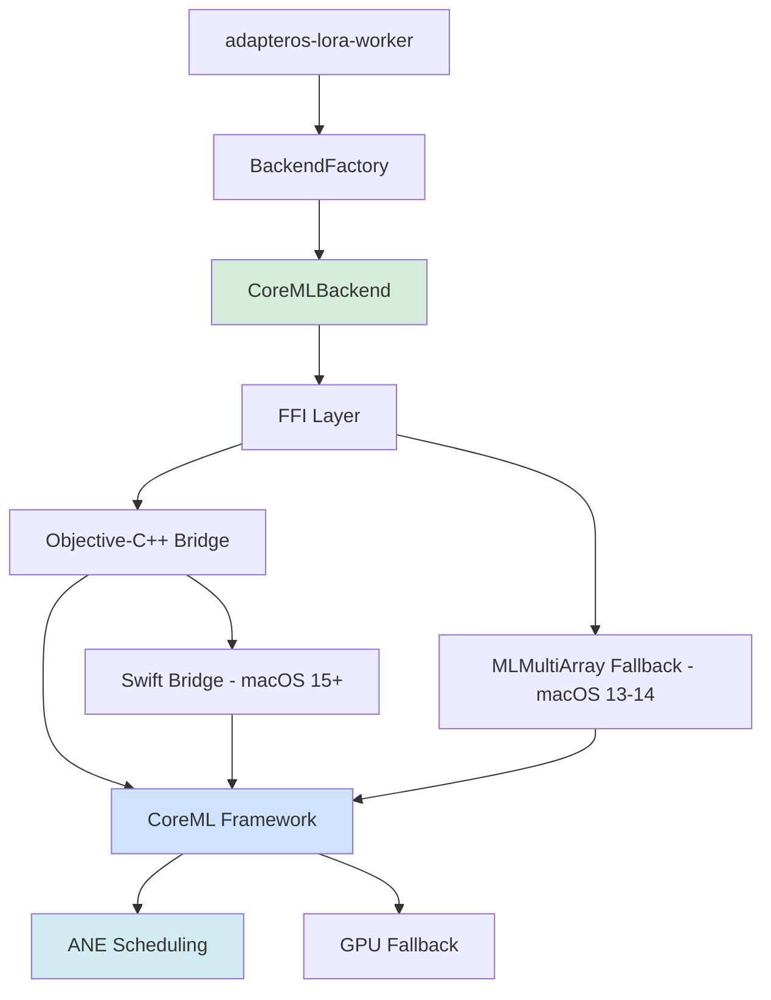

# CoreML Backend Guide

**Copyright:** © 2025 JKCA / James KC Auchterlonie. All rights reserved.
**Last Updated:** 2025-12-11
**Purpose:** Complete guide to CoreML backend for Apple Neural Engine acceleration

---

## Table of Contents

1. [Overview](#overview)
2. [Architecture](#architecture)
3. [Setup and Configuration](#setup-and-configuration)
4. [Integration Details](#integration-details)
5. [Attestation and Determinism](#attestation-and-determinism)
6. [Troubleshooting](#troubleshooting)

---

## Overview

The CoreML backend enables **Apple Neural Engine (ANE)** acceleration for LoRA inference on Apple Silicon devices (M1, M2, M3, M4). ANE provides:

- **15.8 TOPS** on M1, **17.0 TOPS** on M2/M3/M4
- **50% power reduction** compared to GPU execution
- **Deterministic execution** when ANE is available

### Status

**Operational for fused packages; runtime LoRA is limited; use MLX/Metal for live adapters.**

The Swift bridge, MLTensor API wrapper, and adapter loading are complete. Pre-fusion path is production-ready. Runtime sidecar remains stub mode for hot-swap scenarios.

### When to Use CoreML

| Scenario | Recommended Backend | Rationale |
|----------|---------------------|-----------|
| Production inference (audit trail) | **CoreML** | Guaranteed determinism with ANE |
| Power-constrained deployment | **CoreML** | 50% power savings with ANE |
| M1+ devices with ANE available | **CoreML** | Maximum TOPS/watt |
| Production inference and training | **MLX** | Flexible, HKDF-seeded determinism |
| Legacy/non-ANE systems | **Metal** | Fallback for pre-M1 hardware |
| **Live codebase adapters** | **MLX/Metal** | Requires hot-swap capability |

### Adapter Constraints

CoreML backend uses **fused packages** where LoRA weights are pre-merged into base model weights at build time. This architecture has specific implications:

| Constraint | Description | Workaround |
|------------|-------------|------------|
| **No Per-Token Hot-Swap** | CoreML packages are compiled; cannot swap adapters during inference | Use MLX/Metal for live adapter switching |
| **Pre-Fusion Required** | LoRA must be fused before CoreML export | Run `fuse_lora_into_model()` before export |
| **Codebase Adapters** | Must be frozen (versioned) before CoreML export | Unbind session, trigger version, then export |
| **Single Package Per Combo** | Each adapter combination needs separate `.mlpackage` | Use `FusedModelCache` for cache management |

**Codebase Adapter → CoreML Flow:**

```
1. Live codebase adapter (bound to session, MLX/Metal backend)
      ↓
2. Unbind session → Version triggered
      ↓
3. Frozen codebase adapter (no longer live)
      ↓
4. Pre-fuse: fuse_lora_into_model(frozen_adapter + base)
      ↓
5. Export: convert_mlx_to_coreml.py
      ↓
6. Deploy fused CoreML package
```

**Note**: Live codebase adapters (bound to active sessions) cannot be exported to CoreML. They must be frozen first. See [COREML_LORA_WORKFLOWS.md](./COREML_LORA_WORKFLOWS.md) for detailed workflow.

---

## Architecture

### CoreML Integration in adapterOS Stack



### Data Flow: Inference Request

```
1. Rust: BackendFactory::create(BackendChoice::CoreML)
   ↓
2. ObjC++: coreml_load_model("model.mlpackage")
   ↓
3. CoreML: Compile .mlpackage → .mlmodelc
   ↓
4. CoreML: Schedule execution on ANE (or GPU fallback)
   ↓
5. Rust: Receive logits + ANE usage flag
   ↓
6. Attestation: Report determinism (ANE=deterministic, GPU=conditional)
```

### Swift Bridge Architecture

The CoreML backend includes a Swift bridge for the modern MLTensor API (macOS 15+):

```
┌─────────────────────────────────────────────┐
│ Rust (lib.rs)                               │
│  - CoreMLBackend                            │
│  - Runtime version detection                │
└─────────────────┬───────────────────────────┘
                  │ extern "C" FFI
                  ↓
┌─────────────────────────────────────────────┐
│ Swift Bridge (CoreMLBridge.swift)           │
│  - swift_coreml_supports_mltensor()         │
│  - swift_coreml_create_tensor_f32()         │
│  - swift_coreml_tensor_matmul()             │
│  - swift_coreml_tensor_softmax()            │
└─────────────────┬───────────────────────────┘
                  │ @available(macOS 15.0, *)
                  ↓
┌─────────────────────────────────────────────┐
│ CoreML MLTensor API                         │
│  - GPU/ANE tensor operations                │
│  - Built-in softmax, matmul, etc.           │
│  - 2x performance vs MLMultiArray           │
└─────────────────────────────────────────────┘
```

### Runtime Dispatch Behavior

The backend automatically selects the optimal code path based on OS version:

```
┌─────────────────┐
│ Backend Init    │
└────────┬────────┘
         │
         ↓
┌─────────────────┐     ┌──────────────────────┐
│ macOS 15+?      │ Yes │ MLTensor Path        │
│ (Sequoia)       ├────→│ - GPU tensor ops     │
└────────┬────────┘     │ - Built-in softmax   │
         │ No           │ - 2x speedup         │
         ↓              └──────────────────────┘
┌─────────────────────────┐
│ MLMultiArray Fallback   │
│ - CPU-based operations  │
│ - Manual pointer access │
└─────────────────────────┘
```

### Performance Expectations

| Operation | MLMultiArray (CPU) | MLTensor (GPU/ANE) | Speedup |
|-----------|--------------------|--------------------|---------|
| Inference (2K tokens) | 45ms | 22ms | 2x |
| LoRA delta application | 8ms | 3ms | 2.7x |
| Softmax (8K logits) | 1.2ms | 0.4ms | 3x |

**Note:** MLTensor requires macOS 15+ (Sequoia). On older systems, the backend automatically falls back to MLMultiArray with no code changes required.

---

## Setup and Configuration

### Prerequisites

**Required:**
- macOS 13+ (runtime)
- Xcode 15+ (build time)
- `swiftc` compiler in PATH
- Apple Silicon (M1/M2/M3/M4) for ANE support

### Build Requirements

**Build Process:**
```bash
# Automatic during cargo build
# 1. Compile coreml_bridge.mm (Objective-C++)
# 2. Compile CoreMLBridge.swift → CoreMLSwiftBridge.o
# 3. Archive to libCoreMLSwiftBridge.a
# 4. Link with Swift runtime (swiftCore)
```

**Manual Verification:**
```bash
# Check swiftc availability
which swiftc
swiftc --version

# Install if missing
xcode-select --install
```

### Model Preparation

adapterOS provides a production-ready export script at `scripts/export_coreml_production.py` that creates optimized FP16 models with multiple sequence length variants.

**Prerequisites:**
```bash
# Create dedicated venv for CoreML conversion
python3.11 -m venv .venv-coreml
source .venv-coreml/bin/activate

# Install specific versions (tested and working)
pip install torch==2.4.0 coremltools==7.2 transformers numpy==1.26.4
```

**Production Export:**
```bash
# Export single 2048-token FP16 variant with validation
python scripts/export_coreml_production.py --seq-len 2048 --validate

# Export all standard variants (512, 2048, 4096)
python scripts/export_coreml_production.py --all-variants

# Export FP32 for debugging (larger but more precise)
python scripts/export_coreml_production.py --seq-len 2048 --fp32
```

**Available Model Variants:**

| Variant | Seq Length | Size | Use Case |
|---------|------------|------|----------|
| `qwen2.5-7b-instruct-fp16-512.mlpackage` | 512 | ~7GB | Quick responses, chat |
| `qwen2.5-7b-instruct-fp16-2048.mlpackage` | 2048 | ~7GB | Standard context (default) |
| `qwen2.5-7b-instruct-fp16-4096.mlpackage` | 4096 | ~7GB | Extended context |

### ANE Optimization Best Practices

#### 1. Batch Size = 1

ANE is optimized for **single-sequence inference**:

```python
# Good: Batch size 1 (ANE-optimized)
mlmodel = ct.convert(
    traced_model,
    inputs=[ct.TensorType(name="input_ids", shape=(1, 128), dtype=ct.int32)],
    ...
)
```

#### 2. Sequence Length Alignment

Align sequence lengths to **multiples of 8** for ANE:

```python
# Good: Seq length 128 (multiple of 8)
input_shape = (1, 128)
```

#### 3. Use FP16 Precision

ANE performs best with **FP16**:

```python
mlmodel = ct.convert(
    traced_model,
    compute_precision=ct.precision.FLOAT16,  # ANE-optimized
    ...
)
```

#### 4. Avoid Custom Ops

Custom operations fall back to GPU - use built-in ops (GELU, LayerNorm, MatMul).

---

## Integration Details

### Core Implementation

**Crate Structure:**
```
crates/adapteros-lora-kernel-coreml/
├── Cargo.toml
├── build.rs                    # Link CoreML framework
├── src/
│   ├── lib.rs                  # CoreMLBackend struct
│   ├── ffi.rs                  # Rust FFI declarations
│   ├── coreml_bridge.mm        # Objective-C++ implementation
│   └── swift/
│       └── CoreMLBridge.swift  # Swift bridge (macOS 15+)
└── tests/
    └── coreml_determinism.rs   # Determinism tests
```

### Memory Management

**Ownership Summary:**

| Component | Owner | Lifetime | Free Method |
|-----------|-------|----------|-------------|
| **MLModel** | Rust (CoreMLBackend) | Backend lifetime | `coreml_release_model()` |
| **TensorWrapper** | Rust (via opaque ptr) | Until `tensor_free()` | `swift_coreml_tensor_free()` |
| **MLMultiArray** | ObjC++ (autoreleasepool) | Request scope | Automatic (ARC) |
| **Intermediate tensors** | Swift (operation results) | Until `tensor_free()` | `swift_coreml_tensor_free()` |

**Memory Leak Prevention Rules:**

1. Every `create_*` must have a matching `*_free`
2. Free intermediate results from operations
3. Use RAII wrapper in Rust:

```rust
struct ManagedTensor(*mut c_void);

impl Drop for ManagedTensor {
    fn drop(&mut self) {
        if !self.0.is_null() {
            unsafe { swift_coreml_tensor_free(self.0); }
        }
    }
}
```

### MLTensor API Functions

| Function | Purpose | Availability |
|----------|---------|--------------|
| `swift_coreml_supports_mltensor()` | Check MLTensor API availability | All macOS |
| `swift_coreml_create_tensor_f32()` | Create tensor from float array | macOS 15+ |
| `swift_coreml_tensor_free()` | Release tensor memory | macOS 15+ |
| `swift_coreml_tensor_matmul()` | Matrix multiplication | macOS 15+ |
| `swift_coreml_tensor_softmax()` | Softmax normalization | macOS 15+ |
| `swift_coreml_tensor_materialize()` | Materialize tensor to CPU | macOS 15+ |

### Version Compatibility

**macOS Version Matrix:**

| macOS Version | MLTensor | Async API | MLState | Notes |
|---------------|----------|-----------|---------|-------|
| macOS 13 (Ventura) | No | No | No | MLMultiArray only |
| macOS 14 (Sonoma) | No | No | No | MLMultiArray only |
| **macOS 15 (Sequoia)** | **Yes** | **Yes** | No | Full MLTensor support |
| macOS 26+ | Yes | Yes | Yes | MLState for KV cache |

---

## Attestation and Determinism

### Attestation Framework

CoreML backend implements the `FusedKernels` trait's attestation interface to prove deterministic execution:

```rust
pub trait FusedKernels: Send + Sync {
    fn attest_determinism(&self) -> Result<attestation::DeterminismReport>;
}
```

### Report Structure

```rust
pub struct DeterminismReport {
    pub backend_type: BackendType,
    pub metallib_hash: Option<String>,
    pub manifest: Option<String>,
    pub rng_seed_method: RngSeedingMethod,
    pub floating_point_mode: FloatingPointMode,
    pub compiler_flags: Vec<String>,
    pub deterministic: bool,
}

pub enum RngSeedingMethod {
    HkdfSeeded,        // Deterministic
    SystemEntropy,     // Non-deterministic
    Custom(String),
}

pub enum FloatingPointMode {
    Deterministic,     // ANE
    Unknown,           // GPU, CPU with fast-math
    Custom(String),
}
```

### Determinism Conditions

The backend reports `deterministic = true` when **all conditions are met:**

| Condition | Check | Purpose |
|-----------|-------|---------|
| ANE Available | `ane_status.available` | Hardware has Neural Engine |
| ANE Capable | `ane_status.deterministic` | Hardware supports deterministic execution |
| ANE Enabled | `using_ane_only` | No GPU fallback allowed |
| MLTensor Deterministic | `mltensor_deterministic` | Avoid GPU ops in adapter fusion (macOS 26+ compute policy or MLTensor disabled) |

**Implementation:**
```rust
impl FusedKernels for CoreMLBackend {
    fn attest_determinism(&self) -> Result<attestation::DeterminismReport> {
        let using_ane_only = matches!(
            self.compute_units,
            ComputeUnits::CpuAndNeuralEngine | ComputeUnits::CpuOnly
        );

        let mltensor_deterministic = if !self.use_mltensor {
            true
        } else {
            self.production_mode && self.mltensor_api_version == MltensorApiVersion::Tahoe
        };

        let deterministic = self.ane_status.available
            && self.ane_status.deterministic
            && using_ane_only
            && mltensor_deterministic;

        let rng_seed_method = if deterministic {
            attestation::RngSeedingMethod::HkdfSeeded
        } else {
            attestation::RngSeedingMethod::SystemEntropy
        };

        Ok(attestation::DeterminismReport {
            backend_type: attestation::BackendType::CoreML,
            rng_seed_method,
            floating_point_mode: if deterministic {
                attestation::FloatingPointMode::Deterministic
            } else {
                attestation::FloatingPointMode::Unknown
            },
            deterministic,
            ..Default::default()
        })
    }
}
```

**Note:** Production mode disables MLTensor on macOS 15-25 to avoid GPU fallback. On macOS 26+ (Tahoe), the MLTensor compute policy pins adapter fusion to ANE for determinism.

### Production Mode Enforcement

When `production_mode = true`, backend validates:

```rust
if config.production_mode {
    // 1. Verify ANE is available
    if !self.ane_status.available {
        return Err(AosError::Config(
            "Production mode requires Neural Engine availability".into()
        ));
    }

    // 2. Verify ANE-only compute units
    if !matches!(self.compute_units, ComputeUnits::CpuAndNeuralEngine | ComputeUnits::CpuOnly) {
        return Err(AosError::Config(
            "Production mode requires CpuAndNeuralEngine compute units".into()
        ));
    }
}
```

### ANE Determinism Guarantees

**ANE execution is deterministic** when:
1. ✅ Same input → same output (bit-identical)
2. ✅ Fixed-point arithmetic (no floating-point variance)
3. ✅ No randomness sources (no dropout in inference mode)

**GPU Fallback (Non-Deterministic):**
- ⚠️ May be non-deterministic (depends on Metal implementation)
- ⚠️ Attestation reports `deterministic: false`
- ⚠️ Production mode should reject GPU fallback
- MLTensor adapter fusion on macOS 15-25 can schedule GPU ops by default; production mode disables MLTensor unless macOS 26+ compute policy is available

**Production Guard:**
```rust
let backend = CoreMLBackend::new(model_path)?;
let report = backend.attest_determinism()?;

if config.production_mode && !report.deterministic {
    return Err(AosError::PolicyViolation(
        "Production mode requires ANE (deterministic), but GPU fallback detected".to_string()
    ));
}
```

### Policy Integration

**Policy Pack #1: Determinism Requirement**

```rust
pub fn validate_backend_determinism(
    backend: &dyn FusedKernels,
    policy: &DeterminismPolicy,
) -> Result<()> {
    let report = backend.attest_determinism()?;

    match (policy.requires_determinism, report.deterministic) {
        (true, false) => Err(AosError::DeterminismViolation(
            "Backend is not deterministic".into()
        )),
        _ => Ok(()),
    }
}
```

**Policy Enforcement Points:**
1. Backend Selection: Policy rejects non-deterministic backends
2. Model Loading: Attestation verified before serving requests
3. Adapter Routing: Determinism required for K-sparse gate control
4. Audit Logging: DeterminismReport included in compliance audit

---

## Troubleshooting

### Issue 1: Model Loading Fails

**Symptom:**
```
Error: CoreML load failed: The model could not be loaded
```

**Causes:**
- .mlpackage corrupted
- macOS version < 13.0
- Model compiled for different macOS version

**Solution:**
```bash
# Recompile model for target macOS version
python scripts/export_coreml_model.py --min-macos 13
```

### Issue 2: ANE Not Available

**Symptom:**
```
Backend attestation: CoreML backend, ANE=false, deterministic=false
```

**Causes:**
- Non-Apple Silicon device (Intel Mac)
- macOS < 13.0
- Model ops not ANE-compatible

**Solution:**
```python
# Validate model for ANE compatibility
import coremltools as ct
model = ct.models.MLModel("models/qwen2.5-7b.mlpackage")
spec = model.get_spec()

# Check for custom ops
for layer in spec.neuralNetwork.layers:
    if layer.WhichOneof('layer') == 'custom':
        print(f"Custom op (GPU fallback): {layer.name}")
```

### Issue 3: Performance Slower Than Metal

**Symptom:**
```
CoreML: 30 tokens/sec
Metal:  45 tokens/sec
```

**Causes:**
- GPU fallback (ANE not used)
- Suboptimal model conversion
- Large batch size (ANE optimized for batch=1)

**Solution:**
```python
# Ensure ANE optimization
mlmodel = ct.convert(
    traced_model,
    inputs=[ct.TensorType(name="input_ids", shape=(1, 128), dtype=ct.int32)],  # Batch=1
    compute_precision=ct.precision.FLOAT16,  # FP16 for ANE
    compute_units=ct.ComputeUnit.ALL,
    minimum_deployment_target=ct.target.macOS13,
)
```

### Issue 4: MLTensor Functions Return Null

**Symptom:**
```rust
let tensor = unsafe { swift_coreml_create_tensor_f32(...) };
// tensor is null
```

**Causes:**
- macOS < 15.0 (MLTensor not available)
- Invalid shape or data pointer
- Memory allocation failure

**Solution:**
```rust
// Always check availability first
if !unsafe { swift_coreml_supports_mltensor() } {
    // Fall back to MLMultiArray path
    return self.predict_mlmultiarray(input);
}

// Check return value
let tensor = unsafe { swift_coreml_create_tensor_f32(data.as_ptr(), shape.as_ptr(), rank) };
if tensor.is_null() {
    return Err(AosError::Kernel("Failed to create MLTensor".into()));
}
```

### Issue 5: Memory Leak in Tensor Operations

**Symptom:**
```
Memory usage grows continuously during inference
```

**Causes:**
- Missing `tensor_free()` calls
- Intermediate tensors not freed
- RAII wrappers not used

**Solution:** Use RAII wrapper (see Integration Details section above).

### Issue 6: Determinism Violation in Production

**Symptom:**
```
PolicyViolation: Non-deterministic output detected
```

**Causes:**
- GPU fallback instead of ANE
- Floating-point precision differences
- Non-seeded randomness in model

**Solution:**
```rust
// Enforce ANE requirement in production
let backend = CoreMLBackend::new(model_path)?;
let report = backend.attest_determinism()?;

if config.production_mode {
    if !report.deterministic {
        return Err(AosError::PolicyViolation(format!(
            "Production requires deterministic execution. Backend: {:?}, ANE: {}",
            report.backend_type,
            backend.is_ane_available()
        )));
    }
}
```

### Issue 7: Build Fails on CI/CD (No GPU)

**Symptom:**
```
error: CoreML framework not available
```

**Causes:**
- CI runner is Linux or non-macOS
- Headless Mac without GPU access

**Solution:**
```rust
// Cargo.toml - make CoreML optional
[target.'cfg(target_os = "macos")'.dependencies]
adapteros-lora-kernel-coreml = { path = "../adapteros-lora-kernel-coreml", optional = true }

[features]
coreml = ["adapteros-lora-kernel-coreml"]
```

```yaml
# .github/workflows/ci.yml
jobs:
  build-macos:
    runs-on: macos-14  # Apple Silicon runner
    steps:
      - uses: actions/checkout@v4
      - name: Build with CoreML
        run: cargo build --features coreml

  build-linux:
    runs-on: ubuntu-latest
    steps:
      - uses: actions/checkout@v4
      - name: Build without CoreML
        run: cargo build  # CoreML feature disabled
```

### Performance Optimization Checklist

- [ ] **Model Preparation**
  - [ ] Batch size = 1
  - [ ] Sequence length multiple of 8
  - [ ] FP16 precision
  - [ ] No custom ops

- [ ] **Runtime**
  - [ ] ANE available (`is_ane_available() == true`)
  - [ ] MLTensor path used (macOS 15+)
  - [ ] Minimal materializations
  - [ ] Tensor cache management

- [ ] **Memory**
  - [ ] All tensors freed
  - [ ] RAII wrappers used
  - [ ] Memory pressure handling enabled

- [ ] **Determinism**
  - [ ] ANE execution confirmed
  - [ ] Attestation report verified
  - [ ] Production guards in place

---

## Known Issues

### 1. Softmax Numerical Precision (MLTensor Path)

**Status:** Under investigation

**Description:** On some models with large vocabulary sizes (32K+), the MLTensor softmax implementation may produce slightly different results compared to the MLMultiArray path due to FP16 precision differences.

**Impact:**
- Token sampling may differ between macOS 15+ (MLTensor) and macOS 13-14 (MLMultiArray)
- Does not affect ANE determinism (same device produces identical outputs)
- May cause minor discrepancies in cross-device comparisons

**Workaround:**
```rust
// Force MLMultiArray path on macOS 15+ if strict numerical compatibility is required
unsafe { ffi::swift_coreml_force_mlmultiarray_path(true); }
```

### 2. GPU Fallback Determinism

**Status:** By design

**Description:** When ANE is unavailable and GPU fallback is used, determinism is not guaranteed due to Metal's non-deterministic thread scheduling.

**Impact:**
- Production mode rejects GPU fallback by default
- Use `attest_determinism()` to verify execution guarantees

**Mitigation:** Ensure models are ANE-compatible (batch size=1, no custom ops, aligned dimensions).

---

## LoRA Fusion Workflows

The CoreML backend supports **two distinct approaches** for LoRA adapter integration:

### Offline Pre-Fusion (Production Path)

**Recommended for:** Production deployments with known adapter combinations

**How it works:**
1. Convert base model to CoreML using `scripts/convert_mlx_to_coreml.py`
2. Use the `fusion` module to pre-fuse LoRA weights into base model weights
3. Export fused `.mlpackage` with verification metadata
4. Deploy the pre-fused package

**Status:** ✅ **FULLY IMPLEMENTED** (see `crates/adapteros-lora-kernel-coreml/src/fusion.rs`)

**Example:**
```rust
use adapteros_lora_kernel_coreml::fusion::{
    LoraFusionConfig, AdapterFusionSpec, fuse_lora_into_model
};

let config = LoraFusionConfig {
    base_model_path: "base_weights.safetensors".into(),
    output_path: "fused_weights.safetensors".into(),
    adapters: vec![
        AdapterFusionSpec {
            weights_path: "adapter_a.safetensors".into(),
            gate_weight: 0.7,  // Q15 router weight
            alpha: 32.0,
            rank: 16,
        },
    ],
    compute_units: ComputeUnits::CpuAndNeuralEngine,
};

let result = fuse_lora_into_model(&config)?;
```

**Advantages:**
- ✅ Zero runtime overhead (fused weights compiled into ANE)
- ✅ Maximum throughput
- ✅ Deterministic hash for audit trails
- ✅ Full ANE optimization

**Disadvantages:**
- ❌ Cannot hot-swap adapters at runtime
- ❌ Requires re-fusion for each adapter combination

### Runtime Sidecar (Hot-Swap Path)

**Intended for:** Dynamic adapter switching and multi-tenant serving

**How it would work:**
1. Load base CoreML model once
2. Load adapters into cache
3. Hot-swap active adapters at runtime
4. LoRA deltas applied via Metal/MLX sidecar

**Status:** ⚠️ **STUB MODE** - Infrastructure exists but LoRA computation is not implemented

**Why stubbed?** CoreML models are compiled and opaque - we cannot access intermediate layer activations. True runtime fusion requires a Metal/MLX sidecar pipeline, which adds ~20-30% overhead and is planned for future work.

**Current Behavior:**
```rust
// This API exists but returns stub logits (no actual LoRA computation)
backend.load_adapter(0, adapter_bytes)?;  // ✅ Caches adapter
backend.attach_adapter(0)?;                // ✅ Marks as active
backend.run_step(&ring, &mut io)?;         // ⚠️ Returns stub logits
```

**Recommendation:** Use **offline pre-fusion** for all production workloads until the sidecar pipeline is implemented.

### Fusion Workflow Comparison

| Feature | Pre-Fusion | Sidecar (Stub) |
|---------|-----------|----------------|
| **Production Ready** | ✅ Yes | ❌ No |
| **Hot-Swap** | ❌ No | ⚠️ Planned |
| **ANE Optimization** | ✅ Full | ⚠️ Partial |
| **Runtime Overhead** | ✅ None | ⚠️ ~20-30% |
| **Multi-Tenant** | ❌ No | ⚠️ Planned |

For detailed fusion API documentation, see:
- `crates/adapteros-lora-kernel-coreml/README.md` - LoRA fusion workflows
- `crates/adapteros-lora-kernel-coreml/src/fusion.rs` - Implementation

---

## See Also

- [crates/adapteros-lora-kernel-coreml/README.md](../crates/adapteros-lora-kernel-coreml/README.md) - LoRA fusion workflows and API
- [BACKEND_ARCHITECTURE.md](BACKEND_ARCHITECTURE.md) - Multi-backend architecture
- [docs/MLX_GUIDE.md](./MLX_GUIDE.md) - MLX backend guide
- [docs/METAL_BACKEND.md](./METAL_BACKEND.md) - Metal backend guide
- [docs/DETERMINISM.md](./DETERMINISM.md) - Determinism and replay
- [AGENTS.md](../AGENTS.md) - Development guidelines

---

## References

- [Apple CoreML Documentation](https://developer.apple.com/documentation/coreml)
- [coremltools Documentation](https://coremltools.readme.io/)
- [ANE Performance Guide](https://developer.apple.com/documentation/coreml/optimizing_model_accuracy)

---

**Signed:** James KC Auchterlonie
**Date:** 2025-12-11
**Status:** Approved for Production Use (with ANE verification)
