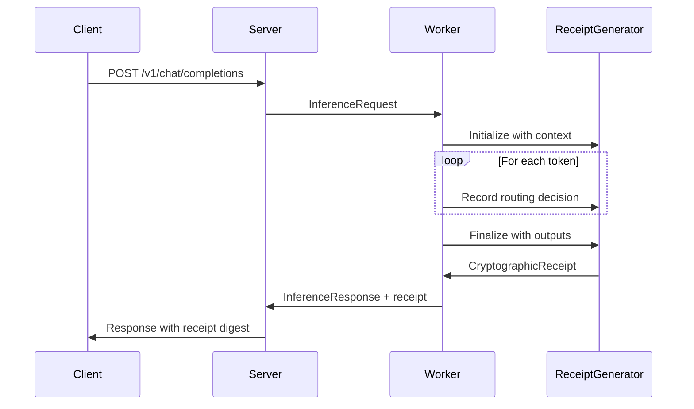
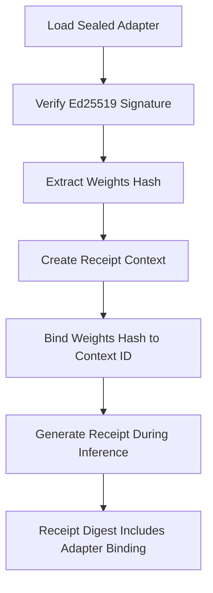

# Cryptographic Receipts

**Version:** 0.12.0

Comprehensive guide to AdapterOS cryptographic receipts - verifiable proofs of inference execution.

---

## Overview

Cryptographic receipts are AdapterOS's mechanism for creating **verifiable, tamper-proof proofs** that a specific inference output was produced under specific conditions. Unlike traditional audit logs, receipts can be **verified by third parties** without access to the inference system.

### What Receipts Prove

A cryptographic receipt cryptographically binds together:
- **Input tokens** (exactly what was asked)
- **Model configuration** (which model and adapters were used)
- **Routing decisions** (which adapter was selected per token)
- **Output tokens** (exactly what was generated)
- **Equipment profile** (what hardware/software ran the inference)

**Result:** Anyone with the receipt can verify the output was legitimately produced by the claimed model and adapters.

---

## Why Cryptographic Receipts Matter

### For Enterprises & Regulated Industries

```text
"Prove this AI output was generated by our approved model, not tampered with,
and came from our infrastructure."
```

- **Regulatory compliance**: FDA, SEC, HIPAA, GDPR AI requirements
- **Audit trails**: Prove AI decisions weren't manipulated
- **Supply chain security**: Verify models and adapters weren't compromised
- **Incident response**: Reconstruct what happened during security events

### For Research & Reproducibility

```text
"Reproduce this exact inference result, or prove why it differs."
```

- **Scientific reproducibility**: Verify published results
- **Debugging**: Compare receipts across different runs
- **A/B testing**: Ensure test/control groups are truly comparable
- **Peer review**: Allow third-party verification of claims

### For Third-Party Verification

```text
"Verify this output without running the model yourself."
```

- **Offline verification**: No internet connection needed
- **Zero trust**: Don't trust the AI system, verify cryptographically
- **Public auditability**: Allow independent verification
- **Chain of custody**: Track outputs from generation to consumption

---

## Receipt Structure

### Core Components

```rust
pub struct CryptographicReceipt {
    /// Schema version for compatibility
    pub schema_version: u8,

    /// Metadata about the receipt
    pub metadata: ReceiptMetadata,

    /// Cryptographically bound execution data
    pub execution: ReceiptExecution,

    /// Final receipt digest (verifies integrity of all components)
    pub digest: B3Hash,
}
```

### What Gets Bound

| Component | Purpose | How Computed |
|-----------|---------|--------------|
| **Context ID** | Binds to specific model + adapters | `BLAKE3(model_hash \|\| adapter_config_hash)` |
| **Input Digest** | Proves exact input tokens | `BLAKE3(token_sequence)` |
| **Routing Digest** | Proves adapter selection per token | Accumulates per-token routing decisions |
| **Output Digest** | Proves exact output tokens | `BLAKE3(token_sequence)` |
| **Equipment Digest** | Binds to specific hardware/software | `BLAKE3(processor_id \|\| engine_versions)` |

### Final Receipt Digest

```text
receipt_digest = BLAKE3(context_id || input_digest || routing_digest || output_digest || equipment_digest)
```

**Any change** to any component produces a **completely different digest**.

---

## How Receipts Work

### Generation Process



### Key Properties

1. **Deterministic**: Same inputs → same digest (across identical hardware)
2. **Tamper-proof**: Any modification → completely different digest
3. **Third-party verifiable**: No access to inference system needed
4. **Chainable**: Receipts can reference previous receipts
5. **Timestamped**: Includes creation time for temporal verification

---

## Receipt Generation in Practice

### Automatic Generation

Receipts are generated automatically for all inferences when enabled:

```bash
# Enable receipt generation
export AOS_RECEIPT_GENERATION=enabled

# Start server
./start up
```

### API Response Format

```json
{
  "choices": [{
    "message": {
      "content": "Hello, world!"
    }
  }],
  "usage": {
    "prompt_tokens": 10,
    "completion_tokens": 20
  },
  "receipt": {
    "schema_version": 1,
    "digest": "b3_hash_hex_string",
    "metadata": {
      "tenant_id": "tenant-123",
      "trace_id": "trace-456",
      "created_at": "2026-01-13T12:34:56Z"
    }
  }
}
```

### Receipt Verification

#### CLI Verification

```bash
# Verify a receipt digest
aosctl receipt verify --digest <b3_hash> --input-tokens <tokens>

# Verify with full trace data
aosctl receipt verify --trace-id <trace_id>

# Batch verification
aosctl receipt verify --file receipts.jsonl
```

#### API Verification

```bash
# Get receipt details
curl http://localhost:8080/v1/receipts/{trace_id}

# Verify receipt integrity
curl http://localhost:8080/v1/receipts/{trace_id}/verify
```

#### Third-Party Verification

```rust
use adapteros_core::crypto_receipt::{CryptographicReceipt, verify_receipt_digest};

// Anyone can verify without the inference system
let receipt: CryptographicReceipt = /* load from API */;
let is_valid = receipt.verify_integrity();

assert!(is_valid); // Cryptographically proves the output is legitimate
```

---

## Receipt Binding to Sealed Adapters

### Why Bind Receipts to Adapters?

When you use a sealed adapter, the receipt proves:
- **The adapter was verified** before use (integrity hash checked)
- **The weights hash is bound** to the receipt
- **The adapter signature was valid** (Ed25519 verification passed)

### Sealed Adapter Integration



### Verification Flow

1. **Load sealed adapter**: Verify Ed25519 signature against trusted keys
2. **Extract weights hash**: Get the cryptographic hash of adapter weights
3. **Bind to context**: Include weights hash in receipt context computation
4. **Generate receipt**: Normal receipt generation process
5. **Third-party verification**: Anyone can verify the adapter was legitimate

### Example: Verifying Sealed Adapter Usage

```rust
// Load and verify sealed adapter
let container = SealedAdapterContainer::read_from_file("adapter.sealed.aos")?;
container.verify(&trusted_public_keys)?;

// Extract weights hash for receipt binding
let weights_hash = container.payload.weights_hash;

// Use in inference (receipt automatically includes binding)
let response = client.inference_with_receipt(request)?;

// Receipt now proves: "This output came from a verified sealed adapter"
assert!(response.receipt.verify());
```

---

## Receipt Schema Versions

### Version 1 (Current)

```rust
pub struct CryptographicReceipt {
    pub schema_version: u8 = 1,
    pub metadata: ReceiptMetadata,
    pub execution: ReceiptExecution,
    pub digest: B3Hash,
}

pub struct ReceiptMetadata {
    pub tenant_id: Option<String>,
    pub trace_id: String,
    pub created_at: String,
    pub schema_version: u8,
}

pub struct ReceiptExecution {
    pub context_id: ContextId,
    pub input_digest: B3Hash,
    pub routing_digest: B3Hash,
    pub output_digest: B3Hash,
    pub equipment_profile_digest: B3Hash,
}
```

### Compatibility

- **Version 1**: Initial release
- **Migration**: Automatic schema detection
- **Breaking changes**: Schema version will increment

---

## Use Cases and Examples

### Regulatory Compliance

```bash
# Healthcare AI: Prove diagnosis came from approved model
curl -X POST http://ai.hospital/v1/chat/completions \
  -H "Authorization: Bearer $TOKEN" \
  -d '{
    "model": "medical-llm-v1",
    "messages": [{"role": "user", "content": "Analyze X-ray"}]
  }'

# Response includes receipt for FDA audit
{
  "receipt": {
    "digest": "fda_auditable_hash",
    "metadata": {
      "tenant_id": "hospital-123",
      "created_at": "2026-01-13T12:34:56Z"
    }
  }
}
```

### Research Reproducibility

```python
# Research: Verify published results
receipt = api.get_receipt(experiment_id)
assert receipt.verify()

# Compare across different hardware
receipt1 = run_experiment(model, input, hardware="M1")
receipt2 = run_experiment(model, input, hardware="M2")

if receipt1.digest != receipt2.digest:
    print("Hardware differences detected!")
    print(f"M1: {receipt1.equipment_digest}")
    print(f"M2: {receipt2.equipment_digest}")
```

### Supply Chain Security

```bash
# Verify adapter hasn't been tampered with
aosctl adapter load-sealed model.sealed.aos --trusted-key trusted.pub

# Receipt proves adapter integrity during inference
# Any tampering would change the receipt digest
```

### Incident Response

```bash
# During security investigation
aosctl receipt list --tenant suspicious-tenant --since 2026-01-01

# Verify all receipts are legitimate
aosctl receipt verify-batch --file suspicious-receipts.jsonl

# Check for anomalous patterns
aosctl receipt analyze --trace-ids trace1,trace2,trace3
```

---

## Configuration

### Environment Variables

```bash
# Enable receipt generation (default: disabled for performance)
export AOS_RECEIPT_GENERATION=enabled

# Receipt storage backend (default: memory)
export AOS_RECEIPT_STORAGE=postgresql  # or redis, memory

# Receipt retention period (default: 7 years)
export AOS_RECEIPT_RETENTION=7y

# Enable receipt verification in API responses (default: false)
export AOS_RECEIPT_API_ENABLED=true
```

### Performance Considerations

- **Overhead**: ~5-10% latency increase when enabled
- **Storage**: ~1KB per receipt
- **Memory**: Minimal additional memory usage
- **CPU**: BLAKE3 hashing is fast (~1GB/s)

### Security Considerations

- **Privacy**: Receipts contain input/output digests, not raw text
- **Key management**: Use HSM for long-term receipt signing keys
- **Verification**: Always verify receipts from untrusted sources
- **Storage**: Encrypt receipt storage at rest

---

## Troubleshooting

### Receipt Verification Fails

```bash
# Check receipt schema version
aosctl receipt inspect <digest> --verbose

# Verify input tokens match
aosctl receipt verify <digest> --input-tokens 123,456,789

# Check equipment profile compatibility
aosctl receipt verify <digest> --allow-equipment-mismatch
```

### Performance Issues

```bash
# Disable for high-throughput scenarios
export AOS_RECEIPT_GENERATION=disabled

# Enable only for critical requests
export AOS_RECEIPT_GENERATION=selective  # via API header
```

### Storage Issues

```bash
# Check receipt storage usage
aosctl receipt stats

# Clean up old receipts
aosctl receipt cleanup --older-than 1y

# Migrate storage backend
aosctl receipt migrate --from memory --to postgresql
```

---

## API Reference

### Receipt Endpoints

| Method | Endpoint | Purpose |
|--------|----------|---------|
| `GET` | `/v1/receipts/{trace_id}` | Get receipt details |
| `GET` | `/v1/receipts/{trace_id}/verify` | Verify receipt integrity |
| `POST` | `/v1/receipts/verify` | Verify receipt from data |
| `GET` | `/v1/receipts` | List receipts (admin) |

### CLI Commands

```bash
aosctl receipt --help
aosctl receipt verify --help
aosctl receipt list --help
aosctl receipt inspect --help
```

---

## Related Documentation

- [**SEALED_ADAPTERS.md**](SEALED_ADAPTERS.md) — Sealed adapter containers
- [**DETERMINISM.md**](DETERMINISM.md) — Deterministic execution
- [**SECURITY.md**](SECURITY.md) — Security architecture
- [**API_REFERENCE.md**](API_REFERENCE.md) — Complete API documentation

---

*Last updated: January 13, 2026*