# AdapterOS Database Documentation

**Purpose:** Comprehensive database architecture, schema, operations, and troubleshooting guide

**Last Updated:** 2025-12-20
**Schema Version:** 223 migrations applied

---

## Table of Contents

1. [Overview](#overview)
2. [Architecture](#architecture)
3. [Entity Relationship Diagram](#entity-relationship-diagram)
4. [Core Tables](#core-tables)
5. [Adapter Management](#adapter-management)
6. [Routing and Telemetry](#routing-and-telemetry)
7. [Training and Datasets](#training-and-datasets)
8. [Federation and Determinism](#federation-and-determinism)
9. [Security and Compliance](#security-and-compliance)
10. [KV Store Operations](#kv-store-operations)
11. [Migration Guide](#migration-guide)
12. [Common Queries](#common-queries)
13. [Troubleshooting](#troubleshooting)

---

## Overview

AdapterOS uses a **hybrid database architecture** supporting both relational (SQLite/PostgreSQL) and key-value (redb) backends. The system is designed for:

- **Multi-tenant isolation** with strict tenant boundaries
- **Adapter lifecycle management** with versioning and state tracking
- **Deterministic execution** with cross-host verification
- **Federated deployment** with peer-to-peer synchronization
- **Security and compliance** tracking with comprehensive audit trails
- **Training and inference** telemetry with evidence-based validation

### Key Design Principles

- Content-addressable storage using BLAKE3 hashing
- Cryptographic signatures for artifact verification
- Event sourcing patterns for audit trails
- Cross-host determinism verification
- Multi-backend abstraction (SQLite/PostgreSQL/KV)
- Zero network egress during serving
- Deterministic replay capability

### Database Backends

| Backend | Use Case | Primary Features |
|---------|----------|-----------------|
| **SQLite** | Default relational store | WAL mode, foreign key enforcement, JSON support |
| **PostgreSQL** | Enterprise deployments | JSONB, pgvector, advanced indexing |
| **redb (KV)** | High-performance key-value | ACID transactions, zero-copy reads, append-only |

---

## Architecture

### Database Backend Abstraction

AdapterOS abstracts database operations through the `DatabaseBackend` trait:

```rust
pub trait DatabaseBackend: Send + Sync {
    async fn insert_stack(&self, req: &CreateStackRequest) -> Result<String>;
    async fn get_stack(&self, tenant_id: &str, id: &str) -> Result<Option<StackRecord>>;
    async fn list_stacks(&self) -> Result<Vec<StackRecord>>;
    async fn run_migrations(&self) -> Result<()>;
    fn database_type(&self) -> &str;
}
```

### Storage Modes

AdapterOS supports **four storage modes**:

| Mode | Description | Use Case |
|------|-------------|----------|
| `sql_only` | SQLite only | Traditional relational-only deployments |
| `dual_write` | SQL primary, KV mirror | Migration period, drift detection |
| `kv_primary` | KV read/write, SQL fallback | Production KV with safety net |
| `kv_only` | KV only (downgrades to kv_primary on errors) | High-performance production |

**Configuration:**
```bash
# Environment variables
export AOS_STORAGE_BACKEND=kv_primary
export AOS_KV_PATH=var/aos-kv.redb
export AOS_TANTIVY_PATH=var/aos-search  # Optional full-text search
export DATABASE_URL=sqlite://var/aos-cp.sqlite3
export AOS_ATOMIC_DUAL_WRITE_STRICT=1  # Auto-enforced in kv_primary/kv_only
```

### Migration System

Migrations are managed using the Refinery framework and stored in `/migrations/`. Each migration is:

- Numbered sequentially (0001-0190+)
- Signed with Ed25519 (`migrations/signatures.json`)
- SQLite-compatible by default
- PostgreSQL-compatible via abstraction layer

---

## Entity Relationship Diagram

```mermaid
erDiagram
    tenants ||--o{ adapters : owns
    tenants ||--o{ adapter_stacks : owns
    tenants ||--o{ workers : runs
    tenants ||--o{ plans : manages
    tenants ||--o{ telemetry_bundles : generates
    tenants ||--o{ pinned_adapters : manages
    tenants ||--o{ audit_logs : tracked_by

    users ||--o{ adapters : creates
    users ||--o{ cp_pointers : promotes
    users ||--o{ training_jobs : initiates
    users ||--o{ audit_logs : actions

    nodes ||--o{ workers : hosts

    models ||--o{ adapters : based_on

    adapters }o--|| adapter_stacks : grouped_in
    adapters ||--o{ adapter_version_history : tracks
    adapters ||--o{ pinned_adapters : pinned

    adapter_stacks ||--o{ stack_version_history : tracks
    adapter_stacks ||--o{ routing_decisions : routes

    workers ||--o{ process_security_audit_logs : generates

    plans ||--|| cp_pointers : points_to
    plans ||--|| manifests : compiled_from

    telemetry_bundles ||--o{ audits : audited_by

    training_datasets ||--o{ dataset_files : contains
    training_datasets ||--o{ dataset_statistics : statistics
    training_datasets ||--o{ training_jobs : used_by

    federation_peers ||--o{ federation_output_hashes : verifies

    workspaces ||--o{ workspace_members : members
    workspaces ||--o{ workspace_resources : resources
    workspaces ||--o{ messages : messages
    workspaces ||--o{ activity_events : activity

    routing_decisions }o--|| adapter_stacks : uses
```



---

## Core Tables

### `tenants`

**Purpose:** Multi-tenant isolation boundaries. Each tenant has separate namespace for adapters, workers, and policies.

**Schema:**
```sql
CREATE TABLE tenants (
    id TEXT PRIMARY KEY,
    name TEXT NOT NULL,
    itar_flag INTEGER NOT NULL DEFAULT 0,
    created_at TEXT NOT NULL DEFAULT (datetime('now'))
);
```

**Columns:**
- `id`: Unique tenant identifier (UUID format)
- `name`: Human-readable tenant name (unique)
- `itar_flag`: ITAR compliance flag (0=non-ITAR, 1=ITAR-compliant)
- `created_at`: Tenant creation timestamp

**Indexes:**
- Primary key on `id`
- Unique constraint on `name`

**Example Queries:**
```sql
-- Get all ITAR-compliant tenants
SELECT * FROM tenants WHERE itar_flag = 1;

-- Count adapters per tenant
SELECT t.name, COUNT(a.id) as adapter_count
FROM tenants t
LEFT JOIN adapters a ON t.id = a.tenant_id
GROUP BY t.id, t.name;
```

---

### `users`

**Purpose:** Local authentication and role-based access control (RBAC).

**Schema:**
```sql
CREATE TABLE users (
    id TEXT PRIMARY KEY,
    email TEXT UNIQUE NOT NULL,
    display_name TEXT NOT NULL,
    pw_hash TEXT NOT NULL,
    role TEXT NOT NULL CHECK(role IN ('admin','operator','sre','compliance','auditor','viewer')),
    disabled INTEGER NOT NULL DEFAULT 0,
    created_at TEXT NOT NULL DEFAULT (datetime('now'))
);
```

**Roles:**
- `admin`: Full system access
- `operator`: Adapter and worker management
- `sre`: Infrastructure and monitoring
- `compliance`: Audit and policy management
- `auditor`: Read-only audit access
- `viewer`: Read-only general access

**Example Queries:**
```sql
-- Find active admins
SELECT * FROM users WHERE role = 'admin' AND disabled = 0;

-- Audit user activity
SELECT u.email, COUNT(a.id) as adapters_created
FROM users u
LEFT JOIN adapters a ON u.id = a.created_by
GROUP BY u.id, u.email;
```

---

### `nodes`

**Purpose:** Worker hosts running the aos-node agent.

**Schema:**
```sql
CREATE TABLE nodes (
    id TEXT PRIMARY KEY,
    hostname TEXT UNIQUE NOT NULL,
    agent_endpoint TEXT NOT NULL,
    status TEXT NOT NULL DEFAULT 'pending' CHECK(status IN ('pending','active','offline','maintenance')),
    last_seen_at TEXT,
    labels_json TEXT,
    created_at TEXT NOT NULL DEFAULT (datetime('now'))
);
```

**Indexes:**
- `idx_nodes_status` on `status`

**Example Queries:**
```sql
-- Find active nodes with GPUs
SELECT * FROM nodes
WHERE status = 'active'
  AND labels_json LIKE '%gpu%';

-- Nodes offline for >1 hour
SELECT * FROM nodes
WHERE status = 'active'
  AND datetime(last_seen_at) < datetime('now', '-1 hour');
```

---

### `models`

**Purpose:** Base model artifacts (e.g., Qwen2.5, Llama3.1).

**Schema:**
```sql
CREATE TABLE models (
    id TEXT PRIMARY KEY,
    name TEXT UNIQUE NOT NULL,
    hash_b3 TEXT UNIQUE NOT NULL,
    license_hash_b3 TEXT,
    config_hash_b3 TEXT NOT NULL,
    tokenizer_hash_b3 TEXT NOT NULL,
    tokenizer_cfg_hash_b3 TEXT NOT NULL,
    metadata_json TEXT,
    created_at TEXT NOT NULL DEFAULT (datetime('now'))
);
```

**Example Queries:**
```sql
-- List all models with their adapter counts
SELECT m.name, COUNT(a.id) as adapter_count
FROM models m
LEFT JOIN adapters a ON m.id = a.model_id
GROUP BY m.id, m.name;
```

---

## Tenant Isolation Implementation

### Overview

AdapterOS enforces tenant isolation at multiple layers: handler validation, database constraints, and composite foreign keys. However, **current implementation has gaps** that require rectification.

### Handler-Level Enforcement

**✅ IMPLEMENTED:**
- JWT claims validation via `validate_tenant_isolation()`
- Admin cross-tenant access via `admin_tenants` claim array
- Wildcard `"*"` grants all-tenant access (debug builds only)

**Validation Function:**
```rust
pub fn validate_tenant_isolation(
    claims: &Claims,
    resource_tenant_id: &str,
) -> Result<(), (StatusCode, Json<ErrorResponse>)> {
    // Same tenant - always allowed
    if claims.tenant_id == resource_tenant_id {
        return Ok(());
    }

    // Admin bypass with explicit tenant grants
    if claims.role == "admin" {
        if claims.admin_tenants.contains(&resource_tenant_id.to_string()) {
            return Ok(());
        }
    }

    Err((StatusCode::FORBIDDEN, Json(ErrorResponse {
        code: "TENANT_ISOLATION_VIOLATION".to_string(),
        message: "Access denied: tenant isolation violation".to_string(),
    })))
}
```

### Database-Level Enforcement

**✅ IMPLEMENTED:**
- Migration 0131: Composite FKs prevent cross-tenant references
- 15+ triggers enforce tenant boundaries on INSERT/UPDATE
- Orphan detection fails migration if data integrity broken

**Example Composite FK:**
```sql
-- Documents belong to exactly one tenant
CREATE TABLE document_chunks (
    tenant_id TEXT NOT NULL,
    document_id TEXT NOT NULL,
    -- Composite FK ensures tenant consistency
    FOREIGN KEY (tenant_id, document_id)
        REFERENCES documents(tenant_id, id) ON DELETE CASCADE
);
```

### ✅ Trigger Revalidation Complete (PRD-RECT-004)

**Validated:** 2024-12 via `cargo test -p adapteros-db tenant_trigger_isolation`

All tenant isolation triggers have been validated with comprehensive test coverage:

| Migration | Triggers | Test Coverage |
|-----------|----------|---------------|
| 0131 | 27 core triggers | ✅ Validated |
| 0211 | 3 adapter_versions repo tenant match | ✅ Validated |
| 0223 | 3 adapter_stacks cross-tenant | ✅ Validated |
| 0224 | 3 training_jobs adapter tenant | ✅ Validated |
| 0226 | 4 base_model tenant guards | ✅ Validated |

**Test Files:**
- `crates/adapteros-db/tests/tenant_trigger_isolation.rs` (23 tests)
- `crates/adapteros-db/tests/tenant_trigger_isolation_extended.rs` (8 tests)

### Implementation Status

| Component | Status | Notes |
|-----------|--------|-------|
| Handler validation | ✅ Implemented | `validate_tenant_isolation()` |
| JWT claims | ✅ Implemented | `tenant_id` in all tokens |
| Composite FKs | ✅ Implemented | Migration 0131 |
| Database triggers | ✅ Implemented | 40+ tenant boundary triggers |
| Trigger revalidation | ✅ Validated | PRD-RECT-004 complete |
| Test coverage | ✅ Complete | 31 tenant isolation tests |

**Status:** Fully implemented with comprehensive test coverage

---

## Adapter Management

### `adapters`

**Purpose:** Per-tenant LoRA adapters with lifecycle management.

**Schema:**
```sql
CREATE TABLE adapters (
    id TEXT PRIMARY KEY,
    tenant_id TEXT NOT NULL REFERENCES tenants(id) ON DELETE CASCADE,
    name TEXT NOT NULL,
    tier TEXT NOT NULL CHECK(tier IN ('persistent','warm','ephemeral')),
    hash_b3 TEXT UNIQUE NOT NULL,
    rank INTEGER NOT NULL,
    alpha REAL NOT NULL,
    targets_json TEXT NOT NULL,
    acl_json TEXT,
    adapter_id TEXT,
    active INTEGER NOT NULL DEFAULT 1,
    lifecycle_state TEXT,
    version TEXT,
    load_state TEXT,
    last_loaded_at TEXT,
    current_state TEXT,
    pinned INTEGER,
    memory_bytes INTEGER,
    last_activated TEXT,
    activation_count INTEGER,
    expires_at TEXT,
    created_at TEXT NOT NULL DEFAULT (datetime('now')),
    updated_at TEXT NOT NULL DEFAULT (datetime('now')),
    UNIQUE(tenant_id, name)
);
```

**Key Columns:**
- `adapter_id`: External adapter identifier (for API lookups)
- `tenant_id`: Owning tenant (FK to tenants)
- `tier`: Memory tier (persistent, warm, ephemeral)
- `hash_b3`: BLAKE3 content hash
- `rank`: LoRA rank
- `alpha`: LoRA alpha scaling factor
- `targets_json`: JSON array of target modules (e.g., `["q_proj", "v_proj"]`)
- `lifecycle_state`: Lifecycle state (draft, active, deprecated, retired)
- `load_state`: Current load state (unloaded, loading, loaded, error)
- `pinned`: Pin status for eviction protection

**Indexes:**
- `idx_adapters_adapter_id` on `adapter_id`
- `idx_adapters_active` on `active`
- `idx_adapters_tenant_id` on `tenant_id`

**Example Queries:**
```sql
-- Find all active adapters for a tenant
SELECT * FROM adapters
WHERE tenant_id = 'tenant-123'
  AND active = 1
  AND lifecycle_state = 'active';

-- Adapters nearing expiration
SELECT name, expires_at FROM adapters
WHERE expires_at IS NOT NULL
  AND datetime(expires_at) < datetime('now', '+7 days');

-- Most frequently activated adapters
SELECT name, activation_count
FROM adapters
ORDER BY activation_count DESC
LIMIT 10;
```

---

### `adapter_stacks`

**Purpose:** Named adapter stacks for workflow selection.

**Schema:**
```sql
CREATE TABLE adapter_stacks (
    id TEXT PRIMARY KEY DEFAULT (lower(hex(randomblob(16)))),
    tenant_id TEXT NOT NULL,
    name TEXT UNIQUE NOT NULL,
    description TEXT,
    adapter_ids_json TEXT NOT NULL,
    workflow_type TEXT CHECK(workflow_type IN ('Parallel', 'UpstreamDownstream', 'Sequential')),
    lifecycle_state TEXT,
    version INTEGER,
    created_by TEXT,
    created_at TEXT DEFAULT (datetime('now')),
    updated_at TEXT DEFAULT (datetime('now')),
    UNIQUE (tenant_id, name)
);
```

**Naming Rules:**
- Format: `stack.{namespace}[.{identifier}]`
- Max length: 100 characters
- No consecutive hyphens
- Reserved names: `stack.safe-default`, `stack.system`

**Indexes:**
- `idx_adapter_stacks_name` on `name`
- `idx_adapter_stacks_created_at` on `created_at`
- `idx_adapter_stacks_tenant_name_active` on `(tenant_id, name, lifecycle_state)` filtered to active stacks for tenant-scoped routing lookups

**Example Queries:**
```sql
-- Get stack with adapter details
SELECT
    s.name,
    s.workflow_type,
    a.name as adapter_name,
    a.lifecycle_state
FROM adapter_stacks s
CROSS JOIN json_each(s.adapter_ids_json) as adapter_id
LEFT JOIN adapters a ON json_extract(adapter_id.value, '$') = a.adapter_id
WHERE s.id = 'stack-id-123';
```

---

### `adapter_version_history`

**Purpose:** Track all lifecycle transitions and version bumps (audit trail).

**Schema:**
```sql
CREATE TABLE adapter_version_history (
    id TEXT PRIMARY KEY DEFAULT (lower(hex(randomblob(16)))),
    adapter_id TEXT NOT NULL,
    version TEXT NOT NULL,
    lifecycle_state TEXT NOT NULL,
    previous_lifecycle_state TEXT,
    reason TEXT,
    initiated_by TEXT NOT NULL,
    metadata_json TEXT,
    created_at TEXT NOT NULL DEFAULT (datetime('now')),
    FOREIGN KEY (adapter_id) REFERENCES adapters(adapter_id) ON DELETE CASCADE
);
```

**Indexes:**
- `idx_adapter_version_history_adapter_id` on `adapter_id`
- `idx_adapter_version_history_version` on `(adapter_id, version)`

**Example Queries:**
```sql
-- Get version history for an adapter
SELECT version, lifecycle_state, previous_lifecycle_state, reason, created_at
FROM adapter_version_history
WHERE adapter_id = 'adapter-123'
ORDER BY created_at DESC;
```

---

### `pinned_adapters`

**Purpose:** Time-based adapter pinning with TTL support and audit trail.

**Schema:**
```sql
CREATE TABLE pinned_adapters (
    id TEXT PRIMARY KEY,
    tenant_id TEXT NOT NULL,
    adapter_id TEXT NOT NULL,
    pinned_until TEXT,  -- NULL = indefinite
    reason TEXT,
    pinned_by TEXT NOT NULL,
    pinned_at TEXT NOT NULL DEFAULT (datetime('now')),
    created_at TEXT NOT NULL DEFAULT (datetime('now')),
    updated_at TEXT NOT NULL DEFAULT (datetime('now')),
    UNIQUE(tenant_id, adapter_id),
    FOREIGN KEY (adapter_id) REFERENCES adapters(adapter_id) ON DELETE CASCADE
);
```

**View:**
```sql
-- View: active_pinned_adapters (only non-expired pins)
CREATE VIEW active_pinned_adapters AS
SELECT pa.*, a.name as adapter_name, a.current_state
FROM pinned_adapters pa
INNER JOIN adapters a ON pa.adapter_id = a.adapter_id
WHERE pa.pinned_until IS NULL OR pa.pinned_until > datetime('now');
```

**Example Queries:**
```sql
-- Find adapters pinned for more than 30 days
SELECT a.name, pa.reason, pa.pinned_at
FROM pinned_adapters pa
JOIN adapters a ON pa.adapter_id = a.adapter_id
WHERE datetime(pa.pinned_at) < datetime('now', '-30 days');
```

---

## Routing and Telemetry

### `routing_decisions`

**Purpose:** Store router decision events with timing metrics, candidate sets, and stack relationships.

**Schema:**
```sql
CREATE TABLE routing_decisions (
    id TEXT PRIMARY KEY,
    tenant_id TEXT NOT NULL,
    timestamp TEXT NOT NULL DEFAULT (datetime('now')),
    request_id TEXT,
    step INTEGER NOT NULL,
    input_token_id INTEGER,
    stack_id TEXT,
    stack_hash TEXT,
    entropy REAL NOT NULL,
    tau REAL NOT NULL,
    entropy_floor REAL NOT NULL,
    k_value INTEGER,
    candidate_adapters TEXT NOT NULL,
    selected_adapter_ids TEXT,
    router_latency_us INTEGER,
    total_inference_latency_us INTEGER,
    overhead_pct REAL,
    created_at TEXT NOT NULL DEFAULT (datetime('now')),
    FOREIGN KEY (tenant_id) REFERENCES tenants(id) ON DELETE CASCADE,
    FOREIGN KEY (stack_id) REFERENCES adapter_stacks(id) ON DELETE SET NULL
);
```

**Key Columns:**
- `step`: Token generation step in inference
- `entropy`: Shannon entropy of gate distribution
- `k_value`: Number of adapters selected
- `candidate_adapters`: JSON array of `{adapter_idx, raw_score, gate_q15}`
- `overhead_pct`: Router overhead as percentage of total inference time

**Indexes:**
- `idx_routing_decisions_tenant_timestamp` on `(tenant_id, timestamp DESC)`
- `idx_routing_decisions_stack_id` on `stack_id`
- `idx_routing_decisions_request_id` on `request_id`

**Example Queries:**
```sql
-- Average router overhead by stack
SELECT
    s.name,
    AVG(rd.overhead_pct) as avg_overhead,
    AVG(rd.router_latency_us) as avg_latency_us
FROM routing_decisions rd
JOIN adapter_stacks s ON rd.stack_id = s.id
GROUP BY s.id, s.name
ORDER BY avg_overhead DESC;
```

---

### `telemetry_bundles`

**Purpose:** NDJSON event bundles with Merkle root verification.

**Schema:**
```sql
CREATE TABLE telemetry_bundles (
    id TEXT PRIMARY KEY,
    tenant_id TEXT NOT NULL REFERENCES tenants(id) ON DELETE CASCADE,
    cpid TEXT NOT NULL,
    path TEXT UNIQUE NOT NULL,
    merkle_root_b3 TEXT NOT NULL,
    start_seq INTEGER NOT NULL,
    end_seq INTEGER NOT NULL,
    event_count INTEGER NOT NULL DEFAULT 0,
    created_at TEXT NOT NULL DEFAULT (datetime('now'))
);
```

**Indexes:**
- `idx_telemetry_bundles_cpid` on `cpid`
- `idx_telemetry_bundles_tenant` on `(tenant_id, created_at DESC)`

---

### `audits`

**Purpose:** Hallucination metrics and compliance checks.

**Schema:**
```sql
CREATE TABLE audits (
    id TEXT PRIMARY KEY,
    tenant_id TEXT NOT NULL REFERENCES tenants(id) ON DELETE CASCADE,
    cpid TEXT NOT NULL,
    suite_name TEXT NOT NULL,
    bundle_id TEXT REFERENCES telemetry_bundles(id),
    arr REAL,          -- Answer Relevance Rate
    ecs5 REAL,         -- Evidence Coverage Score @5
    hlr REAL,          -- Hallucination Rate
    cr REAL,           -- Conflict Rate
    nar REAL,          -- Numeric Accuracy Rate
    par REAL,          -- Provenance Attribution Rate
    verdict TEXT NOT NULL CHECK(verdict IN ('pass','fail','warn')),
    details_json TEXT,
    created_at TEXT NOT NULL DEFAULT (datetime('now'))
);
```

**Metrics:**
- `hlr`: Lower is better (0.0-1.0)
- `arr`, `ecs5`, `nar`, `par`: Higher is better (0.0-1.0)

---

## Training and Datasets

### `training_datasets`

**Purpose:** Store uploaded training data for adapter fine-tuning.

**Schema:**
```sql
CREATE TABLE training_datasets (
    id TEXT PRIMARY KEY,
    name TEXT NOT NULL,
    description TEXT,
    file_count INTEGER NOT NULL DEFAULT 0,
    total_size_bytes INTEGER NOT NULL DEFAULT 0,
    format TEXT NOT NULL,  -- 'patches', 'jsonl', 'txt', 'custom'
    hash_b3 TEXT NOT NULL,
    dataset_hash_b3 TEXT,
    storage_path TEXT NOT NULL,
    status TEXT NOT NULL DEFAULT 'uploaded' CHECK (status IN ('uploaded','processing','ready','failed')),
    validation_status TEXT NOT NULL DEFAULT 'pending',
    validation_errors TEXT,
    metadata_json TEXT,
    created_by TEXT,
    created_at TEXT NOT NULL DEFAULT (datetime('now')),
    updated_at TEXT NOT NULL DEFAULT (datetime('now')),
    dataset_type TEXT,
    purpose TEXT,
    source_location TEXT,
    collection_method TEXT,
    ownership TEXT,
    tenant_id TEXT,
    workspace_id TEXT,
    FOREIGN KEY (created_by) REFERENCES users(id) ON DELETE SET NULL,
    FOREIGN KEY (tenant_id) REFERENCES tenants(id) ON DELETE CASCADE,
    FOREIGN KEY (workspace_id) REFERENCES workspaces(id) ON DELETE SET NULL
);
```

**Indexes:**
- `idx_training_datasets_created_at` on `created_at DESC`
- `idx_training_datasets_created_by` on `created_by`
- `idx_training_datasets_format` on `format`
- `idx_training_datasets_hash` on `hash_b3`
- `idx_training_datasets_type` on `dataset_type`
- `idx_training_datasets_tenant` on `tenant_id`
- `idx_training_datasets_tenant_id_composite` on `(tenant_id, id)` (unique)
- `idx_training_datasets_ownership` on `ownership`
- `idx_training_datasets_workspace_id` on `workspace_id`
- `idx_training_datasets_status` on `status`
- `idx_training_datasets_dataset_hash` on `dataset_hash_b3`

---

### `dataset_files`

**Purpose:** Track individual files within a training dataset.

**Schema:**
```sql
CREATE TABLE dataset_files (
    id TEXT PRIMARY KEY,
    dataset_id TEXT NOT NULL,
    file_name TEXT NOT NULL,
    file_path TEXT NOT NULL,
    size_bytes INTEGER NOT NULL,
    hash_b3 TEXT NOT NULL,
    mime_type TEXT,
    created_at TEXT NOT NULL DEFAULT (datetime('now')),
    FOREIGN KEY (dataset_id) REFERENCES training_datasets(id) ON DELETE CASCADE
);
```

---

### `training_jobs`

**Purpose:** Job tracking and progress.

**Schema:**
```sql
CREATE TABLE training_jobs (
    id TEXT PRIMARY KEY,
    dataset_id TEXT,
    status TEXT NOT NULL,
    progress_pct REAL,
    loss REAL,
    tokens_per_sec REAL,
    last_heartbeat INTEGER,
    created_at TEXT NOT NULL DEFAULT (datetime('now')),
    updated_at TEXT NOT NULL DEFAULT (datetime('now')),
    FOREIGN KEY (dataset_id) REFERENCES training_datasets(id)
);
```

---

## Federation and Determinism

### `federation_peers`

**Purpose:** Federated host registry for cross-host verification.

**Schema:**
```sql
CREATE TABLE federation_peers (
    host_id TEXT PRIMARY KEY,
    pubkey TEXT NOT NULL,  -- Ed25519 public key (hex)
    hostname TEXT,
    registered_at TEXT NOT NULL DEFAULT (datetime('now')),
    last_seen_at TEXT,
    attestation_metadata TEXT,  -- JSON
    active INTEGER NOT NULL DEFAULT 1,
    UNIQUE(pubkey)
);
```

**Indexes:**
- `idx_federation_peers_active` on `(active, last_seen_at DESC)`

---

### `federation_output_hashes`

**Purpose:** Store inference output hashes for cross-host determinism verification.

**Schema:**
```sql
CREATE TABLE federation_output_hashes (
    id TEXT PRIMARY KEY DEFAULT (lower(hex(randomblob(16)))),
    session_id TEXT NOT NULL,
    host_id TEXT NOT NULL,
    output_hash TEXT NOT NULL,  -- BLAKE3 hash
    input_hash TEXT NOT NULL,   -- BLAKE3 hash
    computed_at TEXT NOT NULL DEFAULT (datetime('now')),
    deterministic INTEGER NOT NULL DEFAULT 1,
    FOREIGN KEY (host_id) REFERENCES federation_peers(host_id)
);
```

**Indexes:**
- `idx_federation_output_session` on `(session_id, host_id)`
- `idx_federation_output_input_hash` on `(input_hash, host_id)`

**Example Queries:**
```sql
-- Find non-deterministic outputs (different hashes for same input)
SELECT input_hash, COUNT(DISTINCT output_hash) as hash_count
FROM federation_output_hashes
GROUP BY input_hash
HAVING hash_count > 1;
```

---

### `tick_ledger_entries`

**Purpose:** Global tick ledger for deterministic execution tracking.

**Schema:**
```sql
CREATE TABLE tick_ledger_entries (
    id TEXT PRIMARY KEY DEFAULT (lower(hex(randomblob(16)))),
    tick INTEGER NOT NULL,
    tenant_id TEXT NOT NULL,
    host_id TEXT NOT NULL,
    task_id TEXT NOT NULL,
    event_type TEXT NOT NULL,
    event_hash TEXT NOT NULL,  -- BLAKE3 hash
    timestamp_us INTEGER NOT NULL,
    prev_entry_hash TEXT,  -- Merkle chain
    created_at TEXT NOT NULL DEFAULT (datetime('now'))
);
```

**Indexes:**
- `idx_tick_ledger_tick` on `tick DESC`
- `idx_tick_ledger_tenant` on `(tenant_id, tick DESC)`

**Example Queries:**
```sql
-- Verify tick ledger chain integrity
SELECT
    id,
    tick,
    event_hash,
    prev_entry_hash,
    (SELECT event_hash FROM tick_ledger_entries t2
     WHERE t2.tick = t1.tick - 1 LIMIT 1) as expected_prev
FROM tick_ledger_entries t1
WHERE prev_entry_hash != (SELECT event_hash FROM tick_ledger_entries t2
                          WHERE t2.tick = t1.tick - 1 LIMIT 1);
```

---

## Security and Compliance

### `process_security_audit_logs`

**Purpose:** Security event audit trail.

**Schema:**
```sql
CREATE TABLE process_security_audit_logs (
    id TEXT PRIMARY KEY,
    tenant_id TEXT NOT NULL REFERENCES tenants(id) ON DELETE CASCADE,
    worker_id TEXT REFERENCES workers(id) ON DELETE CASCADE,
    event_type TEXT NOT NULL,
    event_category TEXT NOT NULL,
    severity TEXT NOT NULL CHECK(severity IN ('info','warning','error','critical')),
    event_description TEXT NOT NULL,
    user_id TEXT REFERENCES users(id),
    source_ip TEXT,
    user_agent TEXT,
    request_id TEXT,
    event_data_json TEXT,
    timestamp TEXT NOT NULL DEFAULT (datetime('now')),
    created_at TEXT NOT NULL DEFAULT (datetime('now'))
);
```

**Indexes:**
- `idx_security_audit_tenant_id` on `(tenant_id, timestamp DESC)`
- `idx_security_audit_severity` on `severity`

**Example Queries:**
```sql
-- Find recent critical security events
SELECT event_type, event_description, user_id, timestamp
FROM process_security_audit_logs
WHERE severity = 'critical'
  AND timestamp > datetime('now', '-24 hours')
ORDER BY timestamp DESC;
```

---

### `incidents`

**Purpose:** Security and policy violations.

**Schema:**
```sql
CREATE TABLE incidents (
    id TEXT PRIMARY KEY,
    tenant_id TEXT REFERENCES tenants(id),
    severity TEXT NOT NULL CHECK(severity IN ('critical','high','medium','low')),
    kind TEXT NOT NULL,
    description TEXT NOT NULL,
    worker_id TEXT REFERENCES workers(id),
    bundle_id TEXT REFERENCES telemetry_bundles(id),
    resolved INTEGER NOT NULL DEFAULT 0,
    created_at TEXT NOT NULL DEFAULT (datetime('now')),
    resolved_at TEXT
);
```

**Indexes:**
- `idx_incidents_tenant` on `(tenant_id, created_at DESC)`
- `idx_incidents_resolved` on `resolved`

---

### `audit_logs`

**Purpose:** Immutable audit trail for user actions.

**Schema:**
```sql
CREATE TABLE audit_logs (
    id INTEGER PRIMARY KEY,
    user_id TEXT,
    action TEXT,
    resource TEXT,
    resource_id TEXT,
    status TEXT,
    error_message TEXT,
    timestamp TEXT
);
```

**Indexes:**
- `idx_audit_logs_action` on `action`
- `idx_audit_logs_user` on `user_id`
- `idx_audit_logs_timestamp` on `timestamp`

---

## KV Store Operations

### Storage Modes

AdapterOS supports **four storage modes** for flexible deployment:

| Mode | Read From | Write To | Use Case |
|------|-----------|----------|----------|
| `sql_only` | SQLite | SQLite | Legacy deployments |
| `dual_write` | SQLite | Both SQLite + KV | Migration/validation period |
| `kv_primary` | KV (fallback to SQLite) | Both KV + SQLite | Production with safety net |
| `kv_only` | KV (downgrades to kv_primary on errors) | KV only | High-performance production |

### Configuration

```bash
# Environment variables
export AOS_STORAGE_BACKEND=kv_primary
export AOS_KV_PATH=var/aos-kv.redb
export AOS_TANTIVY_PATH=var/aos-search  # Optional full-text search
export DATABASE_URL=sqlite://var/aos-cp.sqlite3
export AOS_ATOMIC_DUAL_WRITE_STRICT=1  # Auto-enforced in kv_primary/kv_only
```

### Bootstrap (KV-only or KV-primary)

```bash
# Start control plane in KV-only mode
STORAGE_BACKEND=kv_only AOS_KV_PATH=var/aos-kv.redb ./start up

# System bootstrap creates 'system' tenant and seeds core policies via KV
# No SQLite required for KV-only deployments
```

**Guard Behavior:**
- KV-only mode **downgrades to kv_primary** if KV fallbacks/errors counters are non-zero
- Check `degradation_reason` for details
- System bootstrap: `Db::ensure_system_tenant()` creates the `system` tenant and seeds core policies via KV

### Dual-Write Drift Checks

```bash
# CLI verification tool
aosctl storage verify --kv-path var/aos-kv.redb

# Domain-specific checks
aosctl storage verify --adapters-only
aosctl storage verify --tenants-only
aosctl storage verify --stacks-only

# JSON output for CI
aosctl storage verify --json --fail-on-drift
```

**Drift Detection:**
- Monitor `kv_metrics.fallback_operations_total` for SQL fallbacks
- Monitor `kv_metrics.drift_detections_total` for inconsistencies
- Alert on `kv_metrics.errors_total` and `degraded` flag

### CI Drift Check

```bash
# Run in CI pipeline
mkdir -p var
cargo run -p adapteros-cli -- db migrate --db-path ./var/aos-cp.sqlite3
cargo run -p adapteros-cli -- storage migrate \
  --db-path ./var/aos-cp.sqlite3 \
  --kv-path ./var/aos-kv.redb \
  --domains adapters,tenants,stacks,plans,auth_sessions,runtime_sessions,rag_artifacts,policy_audit,training_jobs,chat_sessions \
  --batch-size 200 \
  --force
cargo run -p adapteros-cli -- storage verify \
  --json \
  --db-path ./var/aos-cp.sqlite3 \
  --kv-path ./var/aos-kv.redb \
  --domains adapters,tenants,stacks,plans,auth_sessions,runtime_sessions,rag_artifacts,policy_audit,training_jobs,chat_sessions \
  --fail-on-drift

# Equivalent to:
aosctl storage verify --json \
  --domains adapters,tenants,stacks,plans,auth_sessions,runtime_sessions,rag_artifacts,policy_audit,training_jobs,chat_sessions \
  --fail-on-drift
```

**CI Environment Variables:**
- `KV_VERIFY_DB`: SQLite path (default: `var/aos-cp.sqlite3`)
- `KV_VERIFY_KV`: KV path (default: `var/aos-kv.redb`)
- `KV_VERIFY_DOMAINS`: Comma-separated domain list

**JSON Contract:**
```json
{
  "drift": 0,
  "drift_events": 0,
  "fallback": 0,
  "errors": 0,
  "degraded": false,
  "degradation_reason": null,
  "kv_metrics": { "...": "..." },
  "issues": []
}
```

**CI Gate:** Fail if `drift > 0` OR `fallback > 0` OR `errors > 0` OR `degraded == true`

### Migration Commands

```bash
# Dry-run migration (validate without writes)
aosctl storage migrate \
  --domains adapters,tenants,stacks \
  --batch-size 200 \
  --resume \
  --checkpoint-path ./var/aos-migrate.checkpoint.json \
  --dry-run

# Execute migration
aosctl storage migrate \
  --domains adapters,tenants,stacks \
  --batch-size 200 \
  --resume \
  --checkpoint-path ./var/aos-migrate.checkpoint.json
```

**Resume Semantics:**
- Checkpoint file written only when NOT in `--dry-run`
- Re-run with `--resume` to skip processed rows deterministically

### Deterministic Ordering

KV list operations enforce deterministic ordering:

| Domain | Sort Order |
|--------|------------|
| Tenants, Adapters, Stacks, Plans | `created_at DESC`, then `id ASC` |
| Training Jobs | `started_at DESC` |
| Auth Sessions, Documents, Collections | `created_at DESC`, then `id ASC` |

**Per-Tenant Namespacing:**
- Key prefix format: `tenant/{tenant_id}/...`
- Enforces tenant isolation at KV layer

### Rollback

```bash
# Re-enable SQL reads
export STORAGE_BACKEND=sql
# OR
export STORAGE_BACKEND=dual_write

# KV-only guard automatically falls back to kv_primary if coverage is incomplete
```

### Operational Checks

```rust
// Check for degradation
if db.is_degraded() {
    warn!("Database degraded: {}", db.degradation_reason());
}

// Monitor KV metrics
let metrics = global_kv_metrics().snapshot();
info!("KV fallbacks: {}", metrics.fallback_operations_total);
info!("KV errors: {}", metrics.errors_total);

// Health check
let health = kv_health_check().await?;
assert!(health.latency_ms < 100);
```

### Backup and Restore

#### KV Backup (redb)

```bash
# Quiesce writes (or stop control plane)
# Copy KV file
cp var/aos-kv.redb /backups/aos-kv-$(date +%Y%m%d).redb

# Optional: checksum verification
b3sum var/aos-kv.redb > /backups/aos-kv-$(date +%Y%m%d).b3sum
```

#### Tantivy Backup (if enabled)

```bash
rsync -a --delete var/aos-search/ /backups/aos-search-$(date +%Y%m%d)/
```

#### Restore Procedure

```bash
# 1. Stop services
systemctl stop adapteros-server

# 2. Replace KV file
cp /backups/aos-kv-20251211.redb var/aos-kv.redb

# 3. Replace Tantivy index (if used)
rsync -a --delete /backups/aos-search-20251211/ var/aos-search/

# 4. Start in kv_primary (safe mode)
export STORAGE_BACKEND=kv_primary
systemctl start adapteros-server

# 5. Verify integrity
aosctl storage verify --kv-path var/aos-kv.redb --json --fail-on-drift

# 6. Switch to kv_only only after fallbacks/errors stay at 0
export STORAGE_BACKEND=kv_only
systemctl restart adapteros-server
```

### Compaction Cadence

**redb** is append-only; periodic backup+restore serves as compaction:

```bash
# Schedule weekly during low-traffic windows
# Example cron: 0 2 * * 0 /usr/local/bin/aos-compact-kv.sh

	#!/bin/bash
	# aos-compact-kv.sh
	systemctl stop adapteros-server
	mkdir -p var/tmp
	cp var/aos-kv.redb var/tmp/aos-kv-compact.redb
	rm var/aos-kv.redb
	mv var/tmp/aos-kv-compact.redb var/aos-kv.redb
	systemctl start adapteros-server
	```

### Downgrade-to-kv_primary Playbook

**Trigger:** `kv_only` guard downgrades when `fallback_operations_total > 0` OR `errors_total > 0`

**Action:**
1. Leave system in `kv_primary` (automatic downgrade)
2. Investigate KV backend health
3. Clear counters via restart or `global_kv_metrics().reset()` in maintenance mode
4. Re-test with `aosctl storage verify --json --fail-on-drift`
5. Re-enable `kv_only` only after counters remain at 0

### Alert Thresholds and Channels

**Background Monitor:**
- Control plane evaluates `kv_alert_rules()` every 5 seconds
- Logs any alert
- Records metrics: `kv.fallbacks_total`, `kv.errors_total`, `kv.drift_detections_total`, `kv.degraded_events_total`

**Default Alert Rules:**
- **Warning:** Any fallback or drift (`> 0`)
- **Critical:** Any backend error or degraded event (`> 0`)

**Channel:** `log:kv-alerts` (forward to Slack/PagerDuty as needed)

**Sample Alert Payloads:**
```json
// Warning (fallback)
{
  "rule_name": "kv_fallbacks_detected",
  "metric": "kv.fallbacks_total",
  "value": 1,
  "severity": "Warning"
}

// Critical (backend error)
{
  "rule_name": "kv_backend_errors",
  "metric": "kv.errors_total",
  "value": 1,
  "severity": "Critical"
}
```

**Runbook (Alerts/Degraded):**
1. Open Dashboard → KV health card; confirm counters
2. If `degraded > 0`, expect `kv_only` downgraded to `kv_primary` automatically
3. Inspect KV logs and run `kv_health_check()`
4. Run `aosctl storage verify --json --fail-on-drift`
5. If fallbacks/errors persist, restart worker/control plane to clear counters only after fixes
6. Rerun verify to confirm `0`s before re-enabling `kv_only`

---

## Migration Guide

### Directory Structure

**Canonical Location:** `/migrations/` (root)

**Migration Count:** 223 migrations (0001-0225, gaps at 0136 and 0180)

**Signing:** All migrations signed with Ed25519 (`migrations/signatures.json`)

### Key Migrations

| Migration | Description | Tables Affected |
|-----------|-------------|-----------------|
| **0045** | .aos file support | `adapters` |
| **0055** | Model backend fields | `models` |
| **0060** | Pinned adapters table | `pinned_adapters`, `active_pinned_adapters` view |
| **0061** | Semantic naming taxonomy | `adapters` |
| **0064** | Adapter stacks | `adapter_stacks` |
| **0065** | Heartbeat mechanism | `adapters`, `training_jobs` |
| **0070** | Routing decisions telemetry | `routing_decisions` |
| **0071** | Lifecycle version history | `adapter_version_history`, `stack_version_history` |
| **0165** | LoRA strength and routing determinism | `adapters`, `routing_decisions` |
| **0175** | Adapter repositories and versions | `adapter_repositories`, `adapter_versions` |
| **0177** | Dataset trust gates | `training_datasets` |
| **0185** | Worker lifecycle upgrade | `workers` |
| **0190** | Manifest lineage trust snapshot | `manifests`, `lineage_snapshots` |

### Creating New Migrations

```bash
# 1. Create migration file
touch migrations/NNNN_description.sql

# 2. Write SQL (use SQLite-compatible types)
# Prefer: TEXT, INTEGER, REAL, BOOLEAN
# Avoid: JSONB, BIGINT, DOUBLE PRECISION, TIMESTAMP WITH TIME ZONE

# 3. Sign all migrations
./scripts/sign_migrations.sh

# 4. Test schema consistency
cargo test -p adapteros-db schema_consistency_tests
```

### Schema Consistency Requirements

- All migrations in `/migrations/` must be signed
- Adapter struct fields must match database columns
- INSERT statements must include all new schema columns
- SELECT queries must reference valid columns
- See `/crates/adapteros-db/tests/schema_consistency_tests.rs` for validation

### Migration Verification

```rust
use adapteros_db::migration_verify::MigrationVerifier;

let verifier = MigrationVerifier::new("migrations")?;
verifier.verify_all()?; // Checks Ed25519 signatures
```

### Running Migrations

```bash
# Via CLI
./aosctl db migrate

# Via SQLx
cargo sqlx migrate run

# Via Rust API
db.run_migrations().await?;
```

---

## Common Queries

### Adapter Lifecycle Queries

```sql
-- Count adapters by lifecycle state
SELECT lifecycle_state, COUNT(*) as count
FROM adapters
GROUP BY lifecycle_state;

-- Find adapters ready for retirement (deprecated >90 days)
SELECT name, lifecycle_state, updated_at
FROM adapters
WHERE lifecycle_state = 'deprecated'
  AND datetime(updated_at) < datetime('now', '-90 days');

-- Adapter version timeline
SELECT
    a.name,
    avh.version,
    avh.lifecycle_state,
    avh.created_at
FROM adapter_version_history avh
JOIN adapters a ON avh.adapter_id = a.adapter_id
WHERE a.name = 'my-adapter'
ORDER BY avh.created_at DESC;
```

### Stack Management Queries

```sql
-- Get stack with all adapter details
SELECT
    s.name as stack_name,
    s.workflow_type,
    json_extract(value, '$') as adapter_id,
    a.name as adapter_name,
    a.lifecycle_state
FROM adapter_stacks s,
     json_each(s.adapter_ids_json) as value
LEFT JOIN adapters a ON json_extract(value, '$') = a.adapter_id
WHERE s.id = ?;

-- Find stacks using deprecated adapters
SELECT DISTINCT s.name
FROM adapter_stacks s,
     json_each(s.adapter_ids_json) as value
JOIN adapters a ON json_extract(value, '$') = a.adapter_id
WHERE a.lifecycle_state = 'deprecated';
```

### Performance and Resource Queries

```sql
-- Worker resource utilization
SELECT
    n.hostname,
    COUNT(w.id) as worker_count,
    AVG(w.memory_headroom_pct) as avg_headroom
FROM nodes n
LEFT JOIN workers w ON n.id = w.node_id AND w.status = 'serving'
GROUP BY n.id, n.hostname;

-- Router overhead analysis
SELECT
    DATE(timestamp) as date,
    AVG(overhead_pct) as avg_overhead,
    MAX(overhead_pct) as max_overhead,
    COUNT(*) as decision_count
FROM routing_decisions
WHERE timestamp > datetime('now', '-7 days')
GROUP BY DATE(timestamp)
ORDER BY date DESC;
```

### Audit and Compliance Queries

```sql
-- Recent security events by severity
SELECT
    severity,
    event_type,
    COUNT(*) as event_count
FROM process_security_audit_logs
WHERE timestamp > datetime('now', '-24 hours')
GROUP BY severity, event_type
ORDER BY severity DESC, event_count DESC;

-- User activity audit
SELECT u.email, COUNT(al.id) as action_count, al.action
FROM audit_logs al
JOIN users u ON al.user_id = u.id
WHERE al.timestamp > datetime('now', '-7 days')
GROUP BY u.email, al.action
ORDER BY action_count DESC;
```

### Federation and Determinism Queries

```sql
-- Check cross-host determinism
SELECT
    session_id,
    input_hash,
    COUNT(DISTINCT output_hash) as unique_outputs,
    COUNT(DISTINCT host_id) as host_count
FROM federation_output_hashes
GROUP BY session_id, input_hash
HAVING COUNT(DISTINCT output_hash) > 1;

-- Tick ledger consistency
SELECT
    tenant_id,
    COUNT(*) as inconsistency_count,
    SUM(divergence_count) as total_divergences
FROM tick_ledger_consistency_reports
WHERE consistent = 0
GROUP BY tenant_id;
```

---

## Troubleshooting

### Common Issues

#### 1. Migration Failures

**Symptom:** Migration fails with foreign key constraint error.

**Cause:** SQLite foreign key enforcement not enabled.

**Solution:**
```sql
PRAGMA foreign_keys = ON;
```

**Prevention:** Database initialization code automatically enables this.

---

#### 2. Slow Queries on Large Tables

**Symptom:** Queries on `routing_decisions` or `telemetry_bundles` are slow.

**Cause:** Missing or unused indexes.

**Diagnosis:**
```sql
-- Check if indexes are being used (SQLite)
EXPLAIN QUERY PLAN
SELECT * FROM routing_decisions
WHERE tenant_id = 'tenant-123'
ORDER BY timestamp DESC;
```

**Solution:**
```sql
-- Verify index exists
SELECT name FROM sqlite_master
WHERE type = 'index'
  AND tbl_name = 'routing_decisions';

-- Add missing index if needed
CREATE INDEX IF NOT EXISTS idx_routing_decisions_tenant_timestamp
    ON routing_decisions(tenant_id, timestamp DESC);
```

---

#### 3. JSON Query Performance

**Symptom:** Queries using `json_extract()` are slow.

**Cause:** JSON columns are not indexed efficiently.

**Solution (SQLite):**
- Use expression indexes on frequently queried JSON paths
- Consider denormalizing hot paths into separate columns

**Solution (PostgreSQL):**
```sql
-- Use JSONB instead of JSON
-- Create GIN indexes on JSONB columns
CREATE INDEX idx_adapter_metadata_gin ON adapters USING GIN (metadata_json);
```

---

#### 4. Database Lock Errors

**Symptom:** `database is locked` errors in SQLite.

**Cause:** Long-running transactions blocking writes.

**Solution:**
```sql
-- Enable WAL mode
PRAGMA journal_mode=WAL;
```

- Reduce transaction duration
- Use connection pooling with appropriate timeout settings

---

#### 5. Orphaned Records

**Symptom:** Adapters reference non-existent stacks or models.

**Cause:** Foreign key constraints not enforced or cascade delete not configured.

**Diagnosis:**
```sql
-- Find orphaned adapters (no matching tenant)
SELECT a.id, a.name, a.tenant_id
FROM adapters a
LEFT JOIN tenants t ON a.tenant_id = t.id
WHERE t.id IS NULL;

-- Find orphaned routing decisions (no matching stack)
SELECT rd.id, rd.stack_id
FROM routing_decisions rd
LEFT JOIN adapter_stacks s ON rd.stack_id = s.id
WHERE rd.stack_id IS NOT NULL AND s.id IS NULL;
```

**Solution:**
```sql
-- Clean up orphaned records
DELETE FROM adapters WHERE tenant_id NOT IN (SELECT id FROM tenants);

-- Ensure foreign keys are enforced (SQLite)
PRAGMA foreign_keys = ON;
```

---

#### 6. Version History Bloat

**Symptom:** `adapter_version_history` table grows very large.

**Cause:** Frequent lifecycle transitions creating many history records.

**Solution:**
```sql
-- Archive old history (>1 year)
CREATE TABLE adapter_version_history_archive AS
SELECT * FROM adapter_version_history
WHERE created_at < datetime('now', '-1 year');

DELETE FROM adapter_version_history
WHERE created_at < datetime('now', '-1 year');

-- Vacuum to reclaim space (SQLite)
VACUUM;
```

---

#### 7. Stack Naming Validation Errors

**Symptom:** `INSERT` fails with "Invalid stack name format".

**Cause:** Stack name doesn't match required pattern `stack.{namespace}[.{identifier}]`.

**Valid Examples:**
- `stack.my-project`
- `stack.my-project.v2`
- `stack.code-assistant`

**Invalid Examples:**
- `my-stack` (missing `stack.` prefix)
- `stack.` (empty namespace)
- `stack.my project` (spaces not allowed)
- `stack.my---project` (consecutive hyphens)

**Solution:** Ensure stack names follow the pattern and avoid reserved names.

---

#### 8. KV Drift Detection

**Symptom:** `aosctl storage verify` reports drift.

**Cause:** SQL and KV stores out of sync.

**Diagnosis:**
```bash
# Get detailed drift report
aosctl storage verify --json --kv-path var/aos-kv.redb > drift-report.json
```

**Solution:**
```bash
# Re-migrate from SQL to KV
aosctl storage migrate \
  --domains adapters,tenants,stacks \
  --batch-size 200 \
  --checkpoint-path ./var/aos-migrate.checkpoint.json
```

---

#### 9. KV Backend Degradation

**Symptom:** System logs show "Database degraded" warnings.

**Cause:** KV fallbacks or errors detected.

**Diagnosis:**
```rust
if db.is_degraded() {
    warn!("Degradation reason: {}", db.degradation_reason());
}

let metrics = global_kv_metrics().snapshot();
info!("Fallbacks: {}, Errors: {}",
      metrics.fallback_operations_total,
      metrics.errors_total);
```

**Solution:**
1. Keep system in `kv_primary` mode (automatic downgrade)
2. Run `kv_health_check()` to verify KV connectivity
3. Run `aosctl storage verify --json --fail-on-drift`
4. Investigate KV logs for root cause
5. Clear counters via restart only after fixing root cause
6. Re-enable `kv_only` only after counters remain at 0

---

### Performance Tuning

#### SQLite Optimizations

```sql
-- Enable WAL mode for better concurrency
PRAGMA journal_mode = WAL;

-- Increase cache size (default is often too small)
PRAGMA cache_size = -64000;  -- 64MB

-- Synchronous mode for better performance (less crash-safe)
PRAGMA synchronous = NORMAL;

-- Memory-mapped I/O for large databases
PRAGMA mmap_size = 268435456;  -- 256MB

-- Use memory for temp tables (sorting/joins)
PRAGMA temp_store = MEMORY;

-- Analyze tables for better query planning
ANALYZE;
```

#### PostgreSQL Optimizations

```sql
-- Update table statistics
ANALYZE routing_decisions;

-- Reindex if queries are slow despite indexes
REINDEX TABLE routing_decisions;

-- Check for bloat in frequently updated tables
SELECT
    schemaname,
    tablename,
    pg_size_pretty(pg_total_relation_size(schemaname||'.'||tablename)) AS size
FROM pg_tables
WHERE schemaname = 'public'
ORDER BY pg_total_relation_size(schemaname||'.'||tablename) DESC;
```

---

### Maintenance Tasks

#### Daily
- Check worker heartbeats and mark stale workers as offline
- Clean up expired pinned adapters
- Rotate telemetry bundles
- Monitor KV metrics (`fallbacks_total`, `errors_total`, `drift_detections_total`)

#### Weekly
- Vacuum database (SQLite) or analyze tables (PostgreSQL)
- Review audit logs for security incidents
- Check tick ledger consistency across federation peers
- Backup KV store and Tantivy index

#### Monthly
- Archive old version history (>90 days)
- Review and clean up orphaned records
- Update table statistics for query optimization
- Compaction: backup+restore KV store to reclaim space

---

### Backup and Recovery

#### SQLite Backup

```bash
# Online backup (while database is running)
sqlite3 var/aos-cp.sqlite3 ".backup /backups/aos-cp-$(date +%Y%m%d).sqlite3"

# Copy WAL files too
cp var/aos-cp.sqlite3-wal /backups/
cp var/aos-cp.sqlite3-shm /backups/
```

#### PostgreSQL Backup

```bash
# Dump entire database
pg_dump adapteros > /backups/adapteros-$(date +%Y%m%d).sql

# Dump schema only
pg_dump --schema-only adapteros > /backups/schema-$(date +%Y%m%d).sql

# Dump data only
pg_dump --data-only adapteros > /backups/data-$(date +%Y%m%d).sql
```

#### Recovery Testing

Regularly test recovery procedures:

1. Restore backup to test environment
2. Run migrations to ensure schema is current
3. Verify data integrity with checksums
4. Test application connectivity
5. Run `aosctl storage verify` to confirm consistency

---

### Tenant-Scoped Query Optimization

**Migration 0210** introduced composite indexes to optimize high-frequency tenant-scoped operations, eliminating temporary B-tree sorts and table scans.

#### 1. Composite Indexes
These indexes follow the pattern `(tenant_id, filter_col, sort_col)` to support efficient filtering and ordering.

| Index | Table | Columns | Use Case |
|-------|-------|---------|----------|
| `idx_adapters_tenant_active_tier_created` | `adapters` | `tenant_id, active, tier, created_at DESC` | Adapter listing |
| `idx_documents_tenant_created` | `documents` | `tenant_id, created_at DESC` | Document pagination |
| `idx_chat_messages_tenant_created` | `chat_messages` | `tenant_id, created_at DESC` | Chat history |
| `idx_routing_decisions_tenant_timestamp_stack` | `routing_decisions` | `tenant_id, timestamp DESC, stack_id` | Telemetry analysis |

#### 2. Covering Indexes
For critical lookups, covering indexes include all selected columns to avoid primary key lookups.

- `idx_adapters_tenant_hash_active_covering`: Supports sub-millisecond hash deduplication.

#### 3. Maintenance
- Run `scripts/monitor_index_performance.sh` to validate index usage.
- Ensure `ANALYZE` is run after bulk data loads.
- Monitor `sqlite_stat1` to ensure query planner has accurate statistics.

---

## Additional Resources

- **AGENTS.md:** `/AGENTS.md` - Developer quick reference (source of truth)
- **Migration Documentation:** `/docs/PRD-05_MIGRATION_CONSOLIDATION.md`
- **Database Abstraction Code:** `/crates/adapteros-db/src/traits.rs`
- **SQLite Backend:** `/crates/adapteros-db/src/sqlite_backend.rs`
- **KV Store:** `/crates/adapteros-db/src/adapters_kv.rs`
- **Schema Migrations:** `/migrations/`
- **Lifecycle States:** `/docs/LIFECYCLE.md`
- **Pinning and TTL:** `/docs/PINNING_TTL.md`

---

**Maintained by:** AdapterOS Engineering Team
**MLNavigator Inc** 2025-12-17
