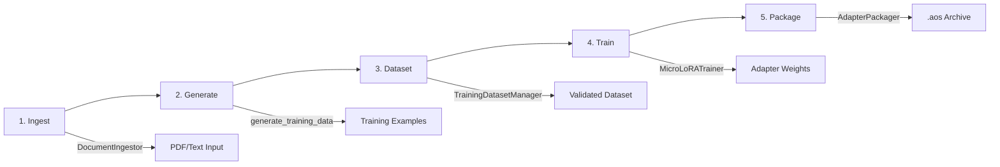

# Dataset to Training Pipeline Integration

## Overview

This document describes the implementation of the dataset-to-training data flow, connecting uploaded dataset files to the training pipeline.

## Canonical 5-Step Pipeline

The AdapterOS training pipeline follows these canonical steps:



**Pipeline Steps:**

1. **Ingest** - `DocumentIngestor::new(opts, tokenizer).ingest_pdf_path(path)?`
2. **Generate** - `generate_training_data(&doc, &tokenizer, &config)?`
3. **Dataset** - `TrainingDatasetManager::new(db, path, tok).create_dataset_from_documents(req).await?`
4. **Train** - `MicroLoRATrainer::new(cfg)?.train(examples, adapter_id).await?`
5. **Package** - `AdapterPackager::new().package(weights, manifest)?` then `registry.register_adapter(...)?`

This document focuses on Steps 2-3 (Generate and Dataset), which handle the dataset-to-training data flow.

## Architecture

The integration consists of three main components:

### 1. Dataset Upload & Storage
- Users upload training data files (JSON, JSONL, TXT formats)
- Files are stored in the filesystem with configurable storage root
- Metadata is recorded in the database (file names, sizes, MIME types)
- BLAKE3 hashes verify file integrity

### 2. TrainingDatasetManager
Located in `crates/adapteros-orchestrator/src/training_dataset_integration.rs`

Responsibilities:
- Load and parse datasets in multiple formats
- Convert files to standardized training examples
- Verify dataset integrity via hash validation
- Store dataset statistics in the database

Key methods:
- `load_dataset_examples(dataset_id)` - Main entry point for loading training data
- `load_examples_from_file(file_path, mime_type)` - Load examples from a single file
- `parse_jsonl_content(content)` - Parse JSONL format
- `parse_json_content(content)` - Parse JSON arrays or objects
- `parse_text_content(content)` - Parse text with configurable structure
- `extract_training_example(value)` - Extract examples from JSON objects
- `tokenize_text(text)` - Convert text to token IDs

### 3. Training Service Integration
Located in `crates/adapteros-orchestrator/src/training.rs`

Responsibilities:
- Start training jobs with optional datasets
- Pass dataset ID to training runner
- Load training examples at job start time

Key changes:
- Added `new_with_db()` method for database-aware service creation
- Added `start_training_job()` method accepting dataset_id and database connection
- Updated `run_training_job()` to load examples from datasets

## Data Flow

```
User Upload
    ↓
Dataset Files (JSON/JSONL/TXT)
    ↓
TrainingDatasetManager.load_examples_from_file()
    ↓
Format Detection & Parsing
    ├─ JSON: Array/Object parsing
    ├─ JSONL: Line-by-line parsing
    └─ TXT: Line or block parsing
    ↓
Training Examples (Vec<WorkerTrainingExample>)
    ↓
TrainingService.start_training_job()
    ↓
MicroLoRATrainer.train()
```

## File Format Support

### JSONL Format
One example per line, JSON objects with input/output fields:
```jsonl
{"input": "What is 2+2?", "output": "The answer is 4"}
{"input": "How are you?", "output": "I'm doing well"}
```

### JSON Format
Array of objects or single object:
```json
[
  {"prompt": "Q1", "completion": "A1"},
  {"prompt": "Q2", "completion": "A2"}
]
```

### Text Format
Line-based: each line becomes an example
```
Hello world
This is a test
Training data
```

Block-based: separated by blank lines (first block = input, second = output):
```
What is 2+2?

The answer is 4

What is 3+3?

The answer is 6
```

## Field Name Conventions

The parser recognizes multiple field naming conventions:
- Input fields: `input`, `prompt`, `text`, `content`
- Output fields: `output`, `target`, `completion`, `response`

Example with different field names:
```json
{"prompt": "Question", "completion": "Answer"}
{"text": "Input", "target": "Output"}
```

## Training Example Structure

```rust
pub struct WorkerTrainingExample {
    pub input: Vec<u32>,           // Input token IDs
    pub target: Vec<u32>,          // Target/output token IDs
    pub metadata: HashMap<String, String>,  // Source file, etc.
    pub weight: f32,               // Example weight (default: 1.0)
}
```

## Database Tables

### `training_datasets`
Stores dataset metadata:
- `id`: Unique dataset ID
- `name`: Dataset name
- `format`: File format (jsonl, json, txt, mixed)
- `hash_b3`: BLAKE3 hash for integrity verification
- `storage_path`: Path to dataset file/directory
- `validation_status`: pending, valid, invalid
- `created_at`, `updated_at`: Timestamps

### `dataset_files`
Stores individual files within a dataset:
- `dataset_id`: Parent dataset ID
- `file_name`: Original filename
- `file_path`: Storage path
- `size_bytes`: File size
- `hash_b3`: File integrity hash
- `mime_type`: Content type

### `dataset_statistics`
Stores aggregated statistics:
- `num_examples`: Total training examples
- `avg_input_length`: Average input token count
- `avg_target_length`: Average target token count
- `total_tokens`: Total tokens across all examples

## Usage Examples

### Load Dataset for Training
```rust
let manager = TrainingDatasetManager::new(
    db,
    PathBuf::from("var/datasets"),
    Some(PathBuf::from("models/tokenizer.json"))
);

let examples = manager.load_dataset_examples("dataset-id-123").await?;
```

### Start Training with Dataset
```rust
let service = TrainingService::new_with_db(db, "qwen2.5-7b");

let job = service.start_training_job(
    "my-adapter".to_string(),
    config,
    None,  // template_id
    None,  // repo_id
    Some("dataset-id".to_string()),  // dataset_id
    Some(Arc::new(db)),
    Some(PathBuf::from("var/datasets"))
).await?;
```

### Parse Uploaded Files
```rust
let examples = manager
    .load_examples_from_file(
        "/tmp/training_data.jsonl",
        &Some("application/jsonl".to_string())
    )
    .await?;
```

## Error Handling

The implementation returns detailed errors for:
- Missing files: `"File not found: {path}"`
- Invalid formats: `"Invalid JSON structure"`
- Validation failures: `"Dataset is not validated"`
- Hash mismatches: `"hash mismatch: expected X, got Y"`
- Parsing errors: `"Failed to parse line N"`

## Testing

Comprehensive tests in `crates/adapteros-orchestrator/src/training_dataset_integration.rs`:

1. **test_save_and_load_examples** - Round-trip JSONL serialization
2. **test_parse_jsonl_file** - JSONL format parsing
3. **test_parse_json_array** - JSON array parsing with multiple field names
4. **test_parse_text_file** - Text file parsing
5. **test_parse_text_with_input_output_pairs** - Block-based text parsing
6. **test_extract_training_example_multiple_field_names** - Field name flexibility
7. **test_load_examples_from_missing_file** - Error handling

Integration tests in `tests/dataset_training_integration.rs`:

1. **test_dataset_loading_flow_jsonl_format** - End-to-end JSONL flow
2. **test_dataset_loading_flow_multiple_files** - Multi-file datasets
3. **test_file_format_detection** - MIME type vs extension detection
4. **test_invalid_dataset_status** - Validation status checks
5. **test_hash_verification** - Integrity verification
6. **test_training_example_weight_preservation** - Metadata preservation
7. **test_training_config_integration** - Config compatibility

## Performance Considerations

- Files are read asynchronously with `tokio::fs`
- Large datasets are streamed line-by-line (JSONL)
- Tokenization can be optimized with real tokenizer models
- Hash computation is done once during storage verification
- Dataset statistics are cached in the database

## Future Enhancements

1. **Real Tokenization**: Replace character-code tokenization with actual BPE/SentencePiece
2. **Streaming Datasets**: Support very large files via lazy loading
3. **Data Validation**: Schema validation for input/output fields
4. **Format Auto-Detection**: Detect format by content, not just extension
5. **Dataset Augmentation**: Built-in augmentation strategies
6. **Batch Loading**: Efficient batch iteration for training
7. **Deduplication**: Detect and remove duplicate examples
8. **Quality Scoring**: Estimate training example quality

## API Endpoints

Once integrated with the server API:

```
POST /v1/datasets/{dataset_id}/load
  -> Returns: {examples: [...]}

GET /v1/datasets/{dataset_id}/statistics
  -> Returns: {num_examples, avg_tokens, ...}

POST /v1/training/start
  Request body: {adapter_name, config, dataset_id}
  -> Returns: {job_id, status}
```

## Related Files

- Dataset manager: `crates/adapteros-orchestrator/src/training_dataset_integration.rs`
- Training service: `crates/adapteros-orchestrator/src/training.rs`
- Database schema: `crates/adapteros-db/src/training_datasets.rs`
- Integration tests: `tests/dataset_training_integration.rs`
- API types: `crates/adapteros-api-types/src/training.rs`

## See Also

- [USER_GUIDE_DATASETS.md](USER_GUIDE_DATASETS.md) - Dataset upload and management guide
- [Training.md](Training.md) - CLI training and orchestrated training guide
- [AOS_FORMAT.md](AOS_FORMAT.md) - .aos archive format specification
- [TRAINING_PIPELINE.md](TRAINING_PIPELINE.md) - Full training pipeline architecture
- [CLAUDE.md](../CLAUDE.md) - Training section in developer guide
