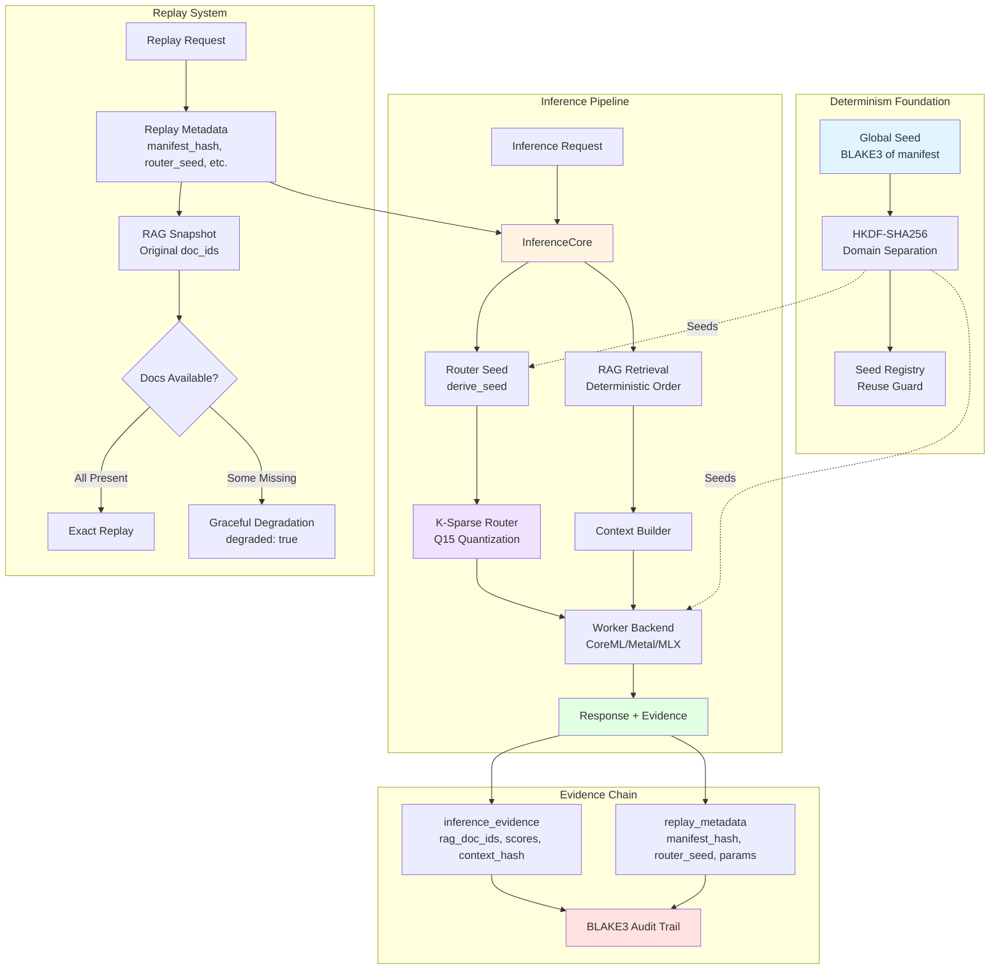
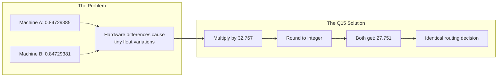
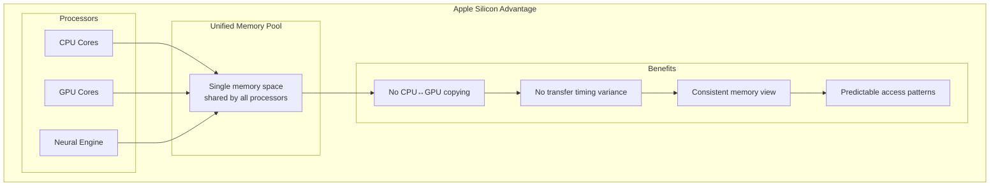
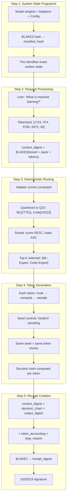
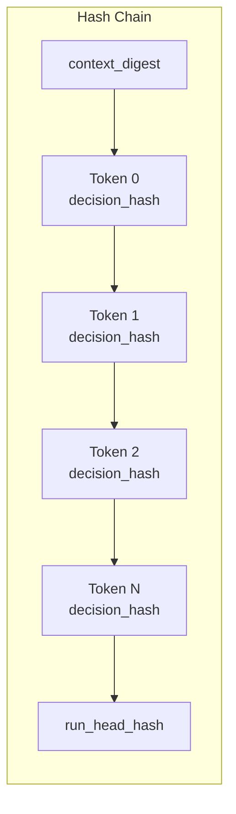

# Determinism and Replay

**Purpose:** Comprehensive documentation for deterministic execution, reproducibility, RAG determinism, and replay systems in AdapterOS

**Last Updated:** 2025-12-11

---

## Overview

AdapterOS guarantees reproducible execution through HKDF-seeded randomness, global tick ledger synchronization, deterministic RAG retrieval, and comprehensive replay capabilities. All inference operations are auditable and exactly reproducible given the same inputs and system state.

### Key Guarantees

- **Bit-exact reproducibility**: Same inputs + same state → same outputs (per-backend)
- **Deterministic routing**: K-sparse adapter selection with fixed tie-breaking
- **RAG ordering contract**: Score DESC, doc_id ASC for consistent retrieval
- **Replay support**: Full reconstruction of past inferences with evidence tracking
- **Seed isolation**: HKDF domain separation prevents RNG reuse
- **Auditability**: Complete evidence chain for all decisions

---

## System Architecture



---

## HKDF Seeding Hierarchy

All randomness in AdapterOS is derived from a global seed using HKDF (HMAC-based Key Derivation Function) with domain separation labels to ensure isolation and reproducibility.

### Seed Derivation

**Sources:** `crates/adapteros-core/src/seed.rs`, `crates/adapteros-server/src/main.rs`

#### Global Seed Initialization

The server derives the global executor seed from the manifest hash:

```rust
// Production: requires manifest, fails if missing
let global_seed = derive_seed(&manifest_hash, "executor");

// Development: uses fixed fallback hash
let fallback_hash = BLAKE3::from_hex("deadbeef...");
let global_seed = derive_seed(&fallback_hash, "executor");
```

#### Request Seed Derivation

Per-request seeds incorporate:
- Manifest hash (system state)
- Tenant ID (isolation)
- Request ID (uniqueness)
- Worker ID (distribution)
- Nonce (sequence)

```rust
let request_seed = derive_seed_typed(
    &manifest_hash,
    tenant_id,
    request_id,
    worker_id,
    nonce
);
```

#### Adapter Set Isolation

For adapter-specific seeds:

```rust
let adapter_seed = derive_seed_full(
    &manifest_hash,
    &adapter_directory_hash,
    "adapter_context"
);
```

### Domain Labels

HKDF domain separation ensures different subsystems use cryptographically isolated RNG streams:

| Label | Purpose | Component | Notes |
|-------|---------|-----------|-------|
| `executor` | Global executor seed | `adapteros-deterministic-exec` | Root of derivation tree |
| `router` | K-sparse tie-breaking | `adapteros-lora-router` | Router decisions |
| `dropout` | LoRA dropout masks | `adapteros-lora-worker` | Training only |
| `sampling` | Token sampling | `adapteros-lora-mlx-ffi` | MLX backend |
| `lora_trainer` | Weight initialization | `adapteros-lora-worker/training` | Training only |
| `gate_noise` | Gate perturbations | `adapteros-lora-router` | Testing/robustness |

### Seed Registry (Reuse Guard)

**Source:** `crates/adapteros-core/src/seed.rs`

The seed registry prevents accidental seed reuse within a request:

```rust
// Registers (label, nonce) and fails fast on collision
let seed = derive_adapter_seed(&manifest_hash, "router", nonce)?;

// Clear at inference boundaries to prevent carryover
clear_seed_registry();
```

**Best Practice:** Always clear the seed registry between requests to prevent false positives from intentional reuse across request boundaries.

---

## Router Determinism

The K-sparse router makes deterministic adapter selection decisions using quantized gates and fixed tie-breaking rules.

### Routing Algorithm

**Source:** `crates/adapteros-lora-router/src/lib.rs`

1. **Score Calculation**: Compute relevance scores for all adapters
2. **Q15 Quantization**: Convert float32 gates to int16 fixed-point
3. **Top-K Selection**: Select K adapters with highest scores
4. **Deterministic Tie-Breaking**: Score DESC, then index ASC

```rust
// Q15 quantization (CRITICAL: denominator is 32767.0, NOT 32768.0)
let gate_q15 = (gate_f32 * 32767.0).round() as i16;
let gate_restored = gate_q15 as f32 / 32767.0;

// Deterministic sorting
scored_adapters.sort_by(|(idx_a, score_a), (idx_b, score_b)| {
    score_b
        .partial_cmp(score_a)
        .unwrap_or(std::cmp::Ordering::Equal)
        .then_with(|| idx_a.cmp(idx_b))
});
```

### Router Seed

The router seed is derived per-request and stored in replay metadata:

```rust
let router_seed = derive_seed(&manifest_hash, "router");
```

**Important:** `router_seed` is stored for **audit purposes only**. The router algorithm is deterministic by design (score-based sorting), not by RNG. The seed enables verification that the same system state was used, not that random tie-breaking occurred.

### Q15 Precision

**Critical Invariant:** The Q15 denominator must be exactly `32767.0` (2^15 - 1), NOT `32768.0` (2^15).

This ensures symmetric quantization around zero and matches fixed-point arithmetic conventions. Violating this breaks determinism across quantization boundaries.

### Why Q15 Eliminates Float Drift



---

## Hardware Determinism on Apple Silicon

AdapterOS achieves determinism through a combination of hardware advantages and software controls.

### Unified Memory Architecture (UMA)



### The Determinism Stack

| Layer | Mechanism | Purpose |
|-------|-----------|---------|
| **Hardware** | UMA shared memory | No copy timing variance |
| **Hardware** | ANE fixed datapath | Consistent tensor operations |
| **Kernels** | Precompiled .metallib | No runtime compilation drift |
| **Verification** | BLAKE3 hash check | Detect kernel tampering |
| **Seeds** | HKDF from manifest | Controlled randomness |
| **Quantization** | Q15 fixed-point | Eliminate float drift |
| **Reduction** | Kahan summation | Consistent rounding |
| **Tie-breaking** | Index ascending | No comparison ambiguity |
| **Compiler** | No -ffast-math | IEEE 754 compliance |

### Critical Compiler Constraints

**No Fast-Math:** The `-ffast-math` flag is prohibited because it allows:
- Operation reordering (breaks associativity)
- Fused multiply-add substitution
- Relaxed IEEE 754 compliance

```toml
# Cargo.toml - No fast-math flags allowed
[profile.release]
# Determinism requires strict IEEE floating-point
```

---

## Conversation Trace: Determinism in Action

This trace shows how a single message becomes deterministically reproducible:



### Per-Token Decision Chain

Every generated token creates a hash linking to the previous:



Each `decision_hash` includes:
- Token index
- Selected adapter IDs
- Gate values (Q15)
- Policy mask digest
- Backend ID

**Tampering any token breaks the chain** → receipt verification fails.

---

## RAG Determinism

AdapterOS guarantees deterministic RAG (Retrieval-Augmented Generation) results through strict ordering contracts and comprehensive evidence tracking.

### Ordering Contract

Documents retrieved from the RAG index are ordered by:

1. **Score DESC** - Highest relevance score first (cosine similarity)
2. **doc_id ASC** - Alphabetical document ID for tie-breaking

This ensures identical queries against identical database state return documents in the same order every time.

### Implementation

**Source:** `crates/adapteros-lora-rag/src/pgvector.rs`

```rust
// Deterministic sorting: score DESC, doc_id ASC
scored_docs.sort_by(|(row_a, score_a), (row_b, score_b)| {
    score_b
        .partial_cmp(score_a)
        .unwrap_or(std::cmp::Ordering::Equal)
        .then_with(|| row_a.doc_id.cmp(&row_b.doc_id))
});
```

### KV Store vs SQL/pgvector

AdapterOS supports multiple RAG storage backends with strict consistency guarantees:

#### Storage Modes

- **`kv_primary`**: KV store is primary, SQL/pgvector secondary (dual-write, fallback on errors)
- **`kv_only`**: KV store only (SQL/pgvector read-only, fail fast on KV errors)
- **SQL/pgvector**: Traditional SQL-based retrieval (fallback/legacy)

#### Consistency Guarantees

- **Dual-write**: Both KV and SQL are updated atomically during document ingestion
- **Drift detection**: KV results compared against SQL to detect split-brain
- **Deterministic ordering**: Both implementations must produce identical `(score DESC, doc_id ASC)` ordering
- **Tenant isolation**: All queries scoped by `tenant_id` + `model_hash`
- **Backfill support**: Hydrate KV from existing `rag_documents` + `rag_document_embeddings` before enabling KV reads

#### Failure Policies

| Mode | KV Error Behavior | SQL Error Behavior |
|------|-------------------|-------------------|
| `kv_primary` | Fall back to SQL, log warning | Fail request |
| `kv_only` | Fail fast (no silent divergence) | N/A (read-only) |

**Best Practice:** Use `kv_primary` during migration, transition to `kv_only` once drift checks pass consistently.

### Evidence Tracking

Every RAG-enabled inference creates `inference_evidence` records:

| Field | Description |
|-------|-------------|
| `rag_doc_ids` | JSON array of document IDs in retrieval order |
| `rag_scores` | JSON array of relevance scores (parallel to doc_ids) |
| `rag_collection_id` | Collection used for scoped retrieval |
| `document_id` | Individual document contributing to context |
| `chunk_id` | Specific chunk within the document |
| `relevance_score` | Cosine similarity score for this chunk |
| `rank` | Position in result set (0 = most relevant) |
| `context_hash` | BLAKE3 hash of concatenated context |

---

## Replay System

The replay system enables exact reconstruction of past inferences with full auditability and graceful degradation when data is unavailable.

### Replay Metadata

**Source:** `crates/adapteros-db/src/replay_metadata.rs`

Every inference stores replay metadata:

```sql
CREATE TABLE replay_metadata (
    inference_id TEXT PRIMARY KEY,
    manifest_hash TEXT NOT NULL,        -- System state snapshot
    router_seed TEXT NOT NULL,          -- Router seed (audit only)
    sampling_params_json TEXT NOT NULL, -- Temperature, top_p, etc.
    rag_snapshot_hash TEXT,             -- BLAKE3 of RAG context
    adapter_ids_json TEXT NOT NULL,     -- Adapter stack used
    created_at INTEGER NOT NULL
);
```

### Replay Request

To replay an inference:

```rust
let replay_request = ReplayRequest {
    original_inference_id: "inf-123".to_string(),
    use_original_rag_docs: true,  // Use original RAG documents
    validate_only: false,          // Actually execute, don't just validate
};
```

### Exact Replay Flow

1. **Fetch Metadata**: Retrieve `replay_metadata` for original inference
2. **Verify Manifest**: Ensure current system state matches `manifest_hash`
3. **Restore RAG Context**: Fetch original documents by `rag_doc_ids`
4. **Restore Adapter Stack**: Load adapters by `adapter_ids_json`
5. **Apply Sampling Params**: Use exact `sampling_params_json`
6. **Execute**: Route through `InferenceCore` with restored state
7. **Compare**: Verify output matches original (bit-exact for deterministic backends)

### Graceful Degradation

If original RAG documents have been deleted since the inference:

```rust
// Replay continues with available documents
let replay_response = ReplayResponse {
    inference_id: "replay-456".to_string(),
    degraded: true,  // Indicates incomplete replay
    missing_doc_ids: vec!["doc-001", "doc-003"],  // What's missing
    output: "...",  // Best-effort output with available data
};
```

**Degradation Policy:**
- Continue with available documents (preserving order)
- Set `degraded: true` flag
- List `missing_doc_ids` for transparency
- Log warning for audit trail

This allows "best effort" replay while being transparent about data availability.

### Verification Procedures

#### Verify Determinism

Run the same query twice against identical state:

```bash
# Query 1
curl -X POST http://localhost:8080/v1/infer/stream \
  -H "Authorization: Bearer $TOKEN" \
  -H "Content-Type: application/json" \
  -d '{
    "prompt": "test query",
    "collection_id": "col-123",
    "temperature": 0.0
  }'

# Query 2 (should return same output)
curl -X POST http://localhost:8080/v1/infer/stream \
  -H "Authorization: Bearer $TOKEN" \
  -H "Content-Type: application/json" \
  -d '{
    "prompt": "test query",
    "collection_id": "col-123",
    "temperature": 0.0
  }'
```

Compare outputs and evidence records - they should be identical.

#### Query Inference Evidence

```sql
SELECT
    inference_id,
    rag_doc_ids,
    rag_scores,
    rag_collection_id,
    context_hash
FROM inference_evidence
WHERE inference_id = 'your-inference-id'
LIMIT 1;
```

#### Verify Replay Capability

```bash
# Replay an inference
curl -X POST http://localhost:8080/v1/replay \
  -H "Authorization: Bearer $TOKEN" \
  -H "Content-Type: application/json" \
  -d '{
    "original_inference_id": "inf-123",
    "use_original_rag_docs": true
  }'
```

---

## Global Tick Ledger

The deterministic executor maintains a global tick counter for serializable execution ordering.

**Source:** `crates/adapteros-deterministic-exec/src/global_ledger.rs`

### Initialization

```rust
use adapteros_deterministic_exec::{init_global_executor, ExecutorConfig};

let config = ExecutorConfig {
    global_seed,
    enable_event_logging: true,
    ..Default::default()
};
init_global_executor(config)?;
```

### Properties

- **Serial FIFO execution**: Tasks execute in deterministic order
- **No concurrent mutation**: Single-threaded task execution (per executor)
- **Tick-based ordering**: Global tick counter provides total ordering
- **Reproducible scheduling**: Same seeds → same task order

**Use Case:** Multi-agent coordination, federation sync, distributed consensus

---

## Multi-Agent Coordination

`AgentBarrier` synchronizes multiple agents at tick boundaries for deterministic multi-agent systems.

**Source:** `crates/adapteros-deterministic-exec/src/multi_agent.rs`

### Usage

```rust
use adapteros_deterministic_exec::AgentBarrier;

let barrier = Arc::new(AgentBarrier::new(vec![
    "agent-a".into(),
    "agent-b".into(),
    "agent-c".into()
]));

// All agents wait at barrier
barrier.wait("agent-a", tick).await?;

// Dead agent handling
barrier.mark_agent_dead("agent-c")?;
```

### Failure Handling

| Scenario | Timeout | Behavior |
|----------|---------|----------|
| **Normal operation** | N/A | All agents proceed at same tick |
| **Slow agent** | 30s default | Triggers graceful degradation |
| **Dead agent** | Immediate | Explicit removal via `mark_agent_dead()` |
| **CAS races** | N/A | Handled with Acquire ordering |

---

## Policy Enforcement

### Determinism Policy Pack

**Source:** `crates/adapteros-policy/src/packs/determinism.rs`

The Determinism policy pack validates:

- **HKDF-seeded RNG usage**: Blocks non-deterministic RNG (e.g., `thread_rng()`)
- **Precompiled metallib embeds**: No runtime kernel compilation (breaks reproducibility)
- **Global seed format**: 32-byte hex string derived from manifest
- **Q15 quantization**: Correct denominator (32767.0)
- **Sorted operations**: Deterministic iteration order (e.g., BTreeMap vs HashMap)

### Kernel Determinism

Metal kernels are embedded as precompiled `.metallib` files with hash verification:

**Build-Time:**
- Kernel source compiled to `.metallib`
- BLAKE3 hash recorded in `metallib_manifest.json`
- Manifest signed with Ed25519 key

**Runtime:**
- Load `.metallib` from embedded bytes
- Compute BLAKE3 hash of loaded binary
- Compare against manifest hash
- Trigger `AosError::Kernel` on mismatch

This prevents runtime kernel compilation (non-deterministic) and detects kernel tampering.

---

## KV Cache Coherence on Adapter Hot-Swap

**Source:** `crates/adapteros-lora-worker/src/kvcache.rs`

The KV cache must remain coherent across adapter hot-swaps to prevent stale data from leaking into new inference sessions.

### Mechanism

- **Stack Generation Tracking**: `KvCache` tracks `stack_generation` (incremented on adapter swap)
- **Automatic Reset**: `ensure_cache_coherence()` compares cache generation to current stack generation
- **Guard Allocation**: `allocate_with_guard()` captures generation at sequence allocation
- **Pre-Inference Check**: Worker calls `ensure_cache_coherence()` before routing/dispatch

### Example

```rust
// Hot-swap increments stack generation
adapter_stack.increment_generation();

// Next inference call detects mismatch
kv_cache.ensure_cache_coherence(current_generation)?;
// -> Cache reset, guards cleared, fresh KV state
```

This prevents cross-contamination between different adapter configurations.

---

## Backend Determinism Coverage

### Per-Backend Guarantees

| Backend | Determinism Type | Test Coverage | Notes |
|---------|-----------------|---------------|-------|
| **CoreML** | Bit-exact | Repeat-run tests | Tensor ops are deterministic |
| **Metal** | Bit-exact | Kernel hash verification | Production default |
| **MLX** | HKDF-seeded | Repeat-run tests | RNG-seeded determinism |

### Cross-Backend Parity

**Status:** Not yet enforced

- Run-by-run reproducibility is **per-backend** today
- CoreML vs. MLX vs. Metal may produce different outputs for same inputs
- Switching backends mid-session invalidates replay
- Multi-backend builds should gate on attestation results

**Recommendation:** Use single backend per deployment for strict determinism. Multi-backend is for development/testing only.

---

## Verification Procedures

### 1. Determinism Self-Test

```bash
make determinism-check
```

Runs:
- Router determinism tests (K-sparse tie-breaking)
- Seed derivation tests (HKDF isolation)
- Replay reconstruction tests
- RAG ordering tests

### 2. Manual Verification

```bash
# Run same inference twice
./aosctl infer --prompt "test" --seed 42 > out1.json
./aosctl infer --prompt "test" --seed 42 > out2.json

# Compare outputs (should be identical)
diff out1.json out2.json
```

### 3. Replay Verification

```bash
# Original inference
INFERENCE_ID=$(./aosctl infer --prompt "test" | jq -r '.inference_id')

# Replay
./aosctl replay --inference-id $INFERENCE_ID > replay.json

# Compare
diff <(jq '.output' out1.json) <(jq '.output' replay.json)
```

### 4. RAG Determinism Test

```sql
-- Run RAG query twice
SELECT * FROM inference_evidence
WHERE inference_id IN ('inf-001', 'inf-002')
ORDER BY inference_id;

-- Compare rag_doc_ids (should be identical for same query/state)
```

---

## Troubleshooting

### Issue: Non-Deterministic Outputs

**Symptoms:** Same inputs produce different outputs

**Checklist:**
1. Verify seed derivation (same manifest hash?)
2. Check router sorting (score DESC, index ASC?)
3. Confirm Q15 denominator = 32767.0
4. Ensure no `thread_rng()` or `rand::random()` usage
5. Verify backend consistency (same backend for both runs?)
6. Run `make determinism-check`

### Issue: Replay Fails

**Symptoms:** Replay produces different output than original

**Checklist:**
1. Verify manifest hash matches (`replay_metadata.manifest_hash`)
2. Check adapter availability (same adapters loaded?)
3. Confirm RAG documents available (check `missing_doc_ids`)
4. Verify sampling params match (`sampling_params_json`)
5. Ensure same backend used (CoreML/Metal/MLX)

### Issue: RAG Ordering Inconsistent

**Symptoms:** Same query returns different document order

**Checklist:**
1. Check storage mode (`kv_primary` vs `kv_only` vs SQL)
2. Run drift detection between KV and SQL
3. Verify tenant isolation (correct `tenant_id` scoping?)
4. Check for NaN scores (forces stable tie-breaking)
5. Confirm `doc_id` sorting on ties

### Issue: Seed Reuse Error

**Symptoms:** `derive_adapter_seed` fails with "seed already used"

**Solution:**
```rust
// Clear seed registry at inference boundaries
clear_seed_registry();
```

**Cause:** Seed registry prevents accidental reuse within a request. Clear between requests to reset.

---

## Related Documentation

- **[CLAUDE.md](../CLAUDE.md)** - Developer quick reference, determinism invariants
- **[VISUAL_GUIDES.md](VISUAL_GUIDES.md)** - Visual guides: comparisons, token flows, KV cache diagrams
- **[replay_spec.md](replay_spec.md)** - Replay harness and verification
- **[ARCHITECTURE.md](ARCHITECTURE.md)** - System architecture and token accounting
- **[POLICIES.md](POLICIES.md)** - Policy system architecture
- **[POLICY_ENFORCEMENT.md](POLICY_ENFORCEMENT.md)** - Policy enforcement middleware
- **[TELEMETRY_EVENTS.md](TELEMETRY_EVENTS.md)** - Audit event logging
- **[DATABASE.md](DATABASE.md)** - Database schema (inference_evidence, replay_metadata)

---

**MLNavigator Inc 2025-12-18**
