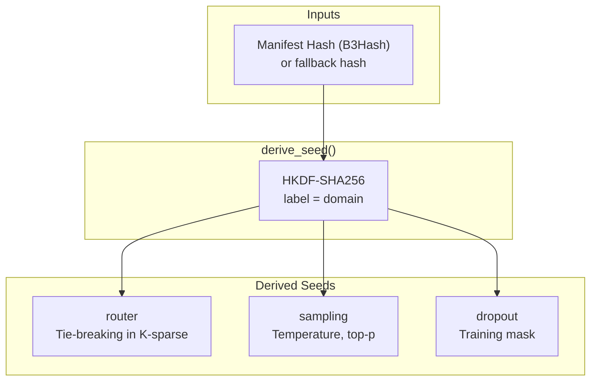
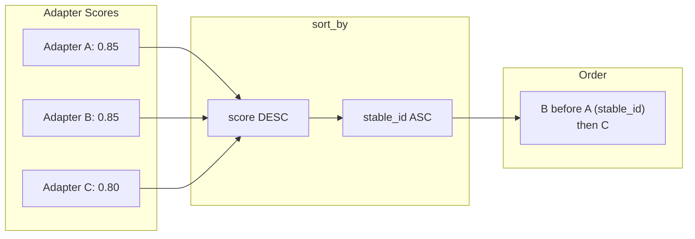

# DETERMINISM

Reproducible inference. Source: `adapteros-core/seed.rs`, `adapteros-lora-router/quantization.rs`.

---

## Seed Derivation

From `adapteros-core/src/seed.rs`:



**Function:** `adapteros_core::seed::derive_seed(hash: &B3Hash, label: &str) -> [u8; 32]`

**Labels:** `SeedLabel::Router`, `SeedLabel::Sampling`, `SeedLabel::Dropout` (see `derive_seed_typed`).

---

## Router Determinism

K-sparse router tie-breaking. Source: `adapteros-lora-router`.



**Invariant:** Tie-break must be `(score DESC, stable_id ASC)`. No `sort_unstable_by` without tie-breaker.

---

## Q15 Quantization

Gate values quantized for deterministic routing. Source: `adapteros-lora-router/src/quantization.rs`.

| Rule | Value | Rationale |
|------|-------|-----------|
| Q15 denominator | **32767.0** | Must be 32767, NOT 32768 |
| Quantization | `(gate * 32767.0).round() as i16` | Fixed-point representation |

**Verification:** `grep -n "32767" crates/adapteros-lora-router/src/quantization.rs`

---

## Modes

From `adapteros_core::SeedMode`:

| Mode | Behavior | Use Case |
|------|----------|----------|
| Strict | Requires manifest hash; fails if missing | Production inference |
| BestEffort | Uses manifest when present; fallback hash | Dev/testing |
| NonDeterministic | Random seed (non-replayable) | Benchmarking only |

**Config:** `[general] determinism_mode = "besteffort"` in cp.toml.

---

## DeterminismConfig

For replay and testing. Source: `adapteros_core::seed::DeterminismConfig`.

```rust
// Fixed seed and timestamp for replay
DeterminismConfig::builder()
    .fixed_seed(12345)
    .fixed_timestamp(...)
    .stable_ordering(true)
    .build();
```

---

## Verification

```bash
cargo test --test determinism_core_suite
cargo test -p adapteros-lora-router --test determinism
cargo test -p adapteros-server-api --test replay_determinism_tests
./scripts/check_fast_math_flags.sh
```

Set `AOS_DEBUG_DETERMINISM=1` for seed logging.

---

## Receipt Hash Canonicalization Inventory (DET-01)

All receipt-hash inputs are assembled through [`ReceiptDigestInput`](../crates/adapteros-core/src/receipt_digest.rs) and hashed by `compute_receipt_digest`.
The canonicalization contract is: no raw float is hashed directly; inputs are represented as fixed-size integers, length-prefixed bytes, booleans, or fixed digest bytes.

| Input class | Canonical form | Source path | Receipt-attested |
|------|------|------|------|
| Token and billing counts | `u32`/`u64` little-endian bytes | `crates/adapteros-core/src/receipt_digest.rs` (`compute_v1_digest`, `compute_v4_digest`, `compute_v7_digest`) | yes |
| Decoder sampling controls | `temperature_q15`, `top_p_q15`, `stop_eos_q15` as `i16` (None uses sentinel) | `crates/adapteros-core/src/receipt_digest.rs` (`compute_v7_digest`) | yes |
| Identity/provenance strings | length-prefixed UTF-8 bytes | `crates/adapteros-core/src/receipt_digest.rs` (`compute_v2_digest`..`compute_v7_digest`) | yes |
| Digest/hash fields | fixed 32-byte canonical digest (None -> zero digest where required) | `crates/adapteros-core/src/receipt_digest.rs` | yes |
| Optional numeric fields | fixed sentinels (`0xFFFFFFFF` for optional `u32`, `i16::MIN` for optional Q15) | `crates/adapteros-core/src/receipt_digest.rs` | yes |

Verification signals:
- `tests/determinism/canonical_hashing.rs` asserts Q15 canonical integer binding and None-vs-zero sentinel differentiation.
- `tests/record_replay_receipt_harness.rs` replays production receipt generation and asserts byte-identical digest/canonical-bytes across runs.

### Training Receipt Canonicalization (V1)

Training receipts are canonicalized through [`TrainingReceiptDigestInputV1`](../crates/adapteros-core/src/training_receipt_digest.rs) and hashed by `compute_training_receipt_digest_v1`.
The V1 scope intentionally excludes wall-clock and ephemeral runtime fields (`started_at_unix_ms`, `finished_at_unix_ms`, phase runtime IDs/timestamps, mutable debug metadata), and binds only deterministic provenance fields plus reduced `phase_statuses` (`phase`, `status`, `inputs_hash`, `outputs_hash`).

Binding locations:
- Adapter package metadata: `crates/adapteros-orchestrator/src/training/packaging.rs` (`package_metadata["training_receipt_schema_version"]`, `package_metadata["training_receipt_digest_b3"]`).
- Persisted training artifact metadata: `crates/adapteros-orchestrator/src/training/packaging.rs` (`artifact_metadata` keys above), persisted via `crates/adapteros-db/src/training_jobs.rs::update_training_job_artifact(...)`.
- Determinism vectors: `docs/training_receipt_test_vectors/v1/*`, validated by `crates/adapteros-core/tests/canonical_training_receipt_serialization_vectors.rs`.

---

## Unquantized Determinism Envelope (DET-02)

Determinism envelope: deterministic guarantees are strongest at receipt-attested boundaries. Unquantized runtime paths are tracked below with their mitigation and verification status.

| Layer or path owner | Source path(s) | Unquantized risk profile | Mitigation strategy | Receipt-attested | Verification signal |
|------|------|------|------|------|------|
| MLX runtime/kernel implementation | `crates/adapteros-lora-mlx-ffi/src/lib.rs` | Runtime vs build MLX drift can alter floating-point execution behavior | Runtime/build version check, strict-mode mismatch fail-closed via `AOS_ENFORCE_MLX_VERSION_MATCH` | no | boot init path + `cargo test -p adapteros-lora-mlx-ffi --tests` |
| Sampling logits path (pre-quantization) | `crates/adapteros-lora-mlx-ffi/src/lib.rs` (`sample_token_impl`) | Floating-point logits and sampler internals are backend/runtime sensitive | Receipt binds canonicalized sampling controls (`*_q15`, seed digest, backend identity) rather than raw logits | partial (controls attested, raw logits not) | `tests/determinism_replay_harness.rs`, `crates/adapteros-server-api/tests/replay_determinism_tests.rs` |
| Router score computation before Q15 | `crates/adapteros-lora-router/src/routing.rs`, `crates/adapteros-lora-router/src/quantization.rs` | Float score math can vary by execution environment | Q15 quantization (`32767.0`) and deterministic sorting before receipt-bound gate usage | yes (Q15-derived outputs) | router determinism suite + `tests/determinism_core_suite.rs` |
| JSON/tool/retrieval intermediate payloads | `crates/adapteros-db/src/inference_trace.rs`, `crates/adapteros-core/src/receipt_digest.rs` | Unordered map/serialization drift if non-canonical JSON is hashed | Canonical digest bytes (`*_digest_b3`) are hashed in receipt instead of raw arbitrary payload bytes | yes (digest fields attested) | receipt recompute path + replay receipt harness |
