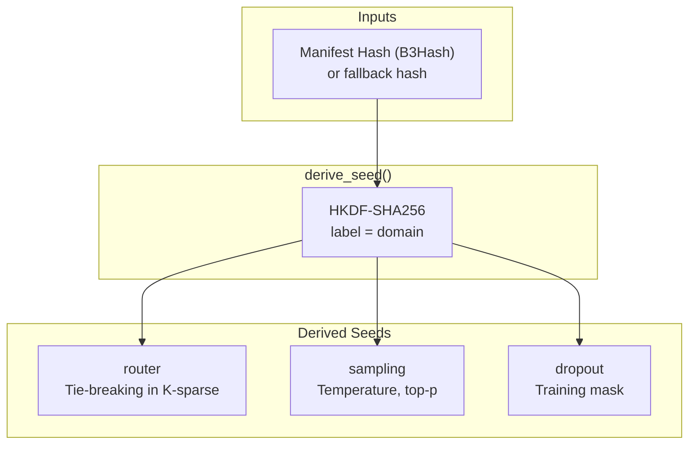
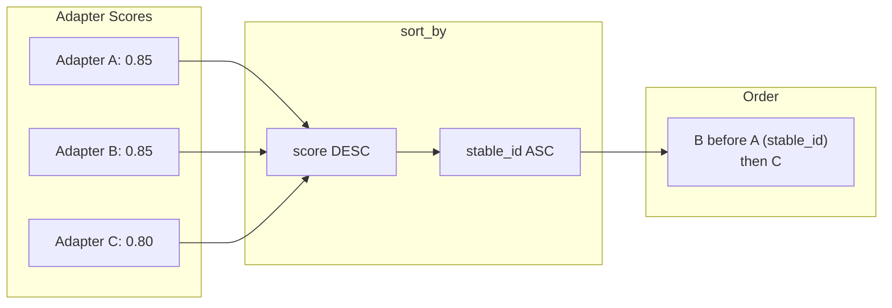

# DETERMINISM

Reproducible inference. Source: `adapteros-core/seed.rs`, `adapteros-lora-router/quantization.rs`.

---

## Seed Derivation

From `adapteros-core/src/seed.rs`:



**Function:** `adapteros_core::seed::derive_seed(hash: &B3Hash, label: &str) -> [u8; 32]`

**Labels:** `SeedLabel::Router`, `SeedLabel::Sampling`, `SeedLabel::Dropout` (see `derive_seed_typed`).

---

## Router Determinism

K-sparse router tie-breaking. Source: `adapteros-lora-router`.



**Invariant:** Tie-break must be `(score DESC, stable_id ASC)`. No `sort_unstable_by` without tie-breaker.

---

## Q15 Quantization

Gate values quantized for deterministic routing. Source: `adapteros-lora-router/src/quantization.rs`.

| Rule | Value | Rationale |
|------|-------|-----------|
| Q15 denominator | **32767.0** | Must be 32767, NOT 32768 |
| Quantization | `(gate * 32767.0).round() as i16` | Fixed-point representation |

**Verification:** `grep -n "32767" crates/adapteros-lora-router/src/quantization.rs`

---

## Modes

From `adapteros_core::SeedMode`:

| Mode | Behavior | Use Case |
|------|----------|----------|
| Strict | Requires manifest hash; fails if missing | Production inference |
| BestEffort | Uses manifest when present; fallback hash | Dev/testing |
| NonDeterministic | Random seed (non-replayable) | Benchmarking only |

**Config:** `[general] determinism_mode = "besteffort"` in cp.toml.

---

## DeterminismConfig

For replay and testing. Source: `adapteros_core::seed::DeterminismConfig`.

```rust
// Fixed seed and timestamp for replay
DeterminismConfig::builder()
    .fixed_seed(12345)
    .fixed_timestamp(...)
    .stable_ordering(true)
    .build();
```

---

## Verification

```bash
cargo test --test determinism_core_suite
cargo test -p adapteros-lora-router --test determinism
cargo test -p adapteros-server-api --test replay_determinism_tests
./scripts/check_fast_math_flags.sh
```

Set `AOS_DEBUG_DETERMINISM=1` for seed logging.
