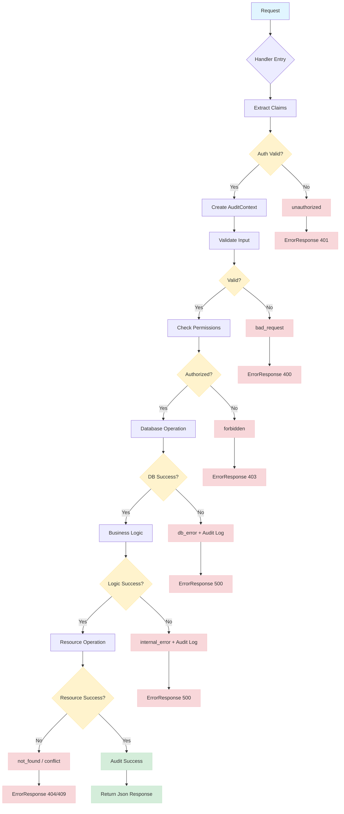

# Error Handling in AdapterOS

**Version:** alpha-v0.11-unstable-pre-release
**Last Updated:** 2025-12-11

This document provides a comprehensive guide to error handling in AdapterOS, including error codes, patterns, helper utilities, and best practices.

---

## Table of Contents

1. [Error Type Reference](#error-type-reference)
2. [Error Handling Patterns](#error-handling-patterns)
3. [Error Helper Utilities](#error-helper-utilities)
4. [Error Flow Diagram](#error-flow-diagram)
5. [API Error Responses](#api-error-responses)
6. [Best Practices](#best-practices)

---

## Error Type Reference

### Core Error Type: `AosError`

All errors in AdapterOS use the `AosError` enum defined in `crates/adapteros-core/src/error.rs`. This ensures consistent error handling, logging, and user experience across the system.

**Type Alias:**
```rust
pub type Result<T> = std::result::Result<T, AosError>;
```

### Error Categories

#### Database & Storage Errors
```rust
AosError::Database(String)          // Database operation failures
AosError::Sqlx(String)              // SQLx-specific errors
AosError::Sqlite(String)            // SQLite-specific errors
AosError::Registry(String)          // Adapter registry errors
```

#### I/O & File System Errors
```rust
AosError::Io(String)                // File system operations
AosError::Artifact(String)          // Artifact handling errors
AosError::Git(String)               // Git operations
```

#### Network & Communication Errors
```rust
AosError::Network(String)           // Network operations
AosError::Http(String)              // HTTP requests
AosError::UdsConnectionFailed { path, source }  // Unix Domain Socket failures
AosError::Federation(String)        // Cross-node communication
```

#### Security & Cryptography Errors
```rust
AosError::Crypto(String)            // Cryptographic operations
AosError::Auth(String)              // Authentication failures
AosError::Authz(String)             // Authorization failures
AosError::EncryptionFailed { reason }
AosError::DecryptionFailed { reason }
AosError::InvalidSealedData { reason }
```

#### Policy & Compliance Errors
```rust
AosError::PolicyViolation(String)   // Policy enforcement failures
AosError::Policy(String)            // Policy pack errors
AosError::Quarantined(String)       // System quarantine due to violations
AosError::PolicyHashMismatch { pack_id, expected, actual }
AosError::DeterminismViolation(String)
AosError::EgressViolation(String)
AosError::IsolationViolation(String)
```

#### Adapter & Model Errors
```rust
AosError::AdapterNotLoaded { adapter_id, current_state }
AosError::AdapterNotInManifest { adapter_id, available }
AosError::AdapterNotInEffectiveSet { adapter_id, effective_set }
AosError::AdapterHashMismatch { adapter_id, expected, actual }
AosError::AdapterLayerHashMismatch { adapter_id, layer_id, expected, actual }
AosError::InvalidManifest(String)
AosError::ModelNotFound { model_id }
AosError::ModelAcquisitionInProgress { model_id, state }
```

#### Backend & Kernel Errors
```rust
AosError::Kernel(String)            // Kernel operation failures
AosError::KernelLayoutMismatch { tensor, expected, got }
AosError::CoreML(String)            // CoreML backend errors
AosError::Mlx(String)               // MLX backend errors
AosError::Mtl(String)               // Metal backend errors
AosError::Worker(String)            // Worker process errors
```

#### Training & Inference Errors
```rust
AosError::Training(String)          // Training pipeline errors
AosError::Autograd(String)          // Gradient computation errors
AosError::Rag(String)               // RAG system errors
AosError::Routing(String)           // Router decision errors
AosError::ChatTemplate(String)      // Chat template processing
```

#### Resource & Performance Errors
```rust
AosError::ResourceExhaustion(String)
AosError::MemoryPressure(String)
AosError::Memory(String)
AosError::Unavailable(String)
AosError::PerformanceViolation(String)
```

#### Configuration & Validation Errors
```rust
AosError::Config(String)            // Configuration errors
AosError::Validation(String)        // Input validation failures
AosError::Parse(String)             // Parsing errors
```

#### System & Lifecycle Errors
```rust
AosError::Lifecycle(String)         // Component lifecycle errors
AosError::System(String)            // System-level errors
AosError::Platform(String)          // Platform-specific errors
AosError::Toolchain(String)         // Build toolchain errors
```

#### Resilience Errors
```rust
AosError::Timeout { duration }
AosError::CircuitBreakerOpen { service }
AosError::CircuitBreakerHalfOpen { service }
AosError::WorkerNotResponding { path }
AosError::InvalidResponse { reason }
```

#### Cache & Download Errors
```rust
AosError::DownloadFailed { repo_id, reason, is_resumable }
AosError::CacheCorruption { path, expected, actual }
AosError::HealthCheckFailed { model_id, reason, retry_count }
```

#### Feature Control Errors
```rust
AosError::FeatureDisabled { feature, reason, alternative }
```

#### Generic Errors
```rust
AosError::Internal(String)          // Internal errors
AosError::NotFound(String)          // Resource not found
AosError::Other(String)             // Catch-all for external errors
AosError::WithContext { context, source }  // Context wrapping
```

### Error Message Standards

When creating error messages, follow these conventions:

1. **Capitalization**: Start with a capital letter
   - ✅ `"Failed to load adapter: file not found"`
   - ❌ `"failed to load adapter: file not found"`

2. **Format**: Use "Action failed: reason" or "Entity state: details"
   - ✅ `"Dataset not found: {id}"`
   - ✅ `"Invalid configuration: vocab_size must be non-zero"`
   - ❌ `"dataset not found"`

3. **Dynamic values**: Use `format!()` for interpolation
   - ✅ `AosError::Config(format!("Port {} already in use", port))`
   - ❌ `AosError::Config("port already in use".to_string())`

4. **Static messages**: Use `.to_string()` without interpolation
   - ✅ `AosError::Config("Database connection required".to_string())`

5. **No trailing periods**: Error strings should not end with periods
   - ✅ `"Connection timeout after 30s"`
   - ❌ `"Connection timeout after 30s."`

6. **Be specific and actionable**: Include enough context to debug
   - ✅ `"Failed to verify GPU buffers for adapter 'code-review': hash mismatch"`
   - ❌ `"Verification failed"`

---

## Error Handling Patterns

These patterns were implemented across AdapterOS and should be reused throughout the codebase.

### Pattern 1: Lock Poisoning Handling

**Use When:** Reading/writing from `Arc<RwLock<T>>` where poison could cause panic

```rust
// BEFORE (PANIC RISK):
let cfg = server_config.read().unwrap();

// AFTER (SAFE):
let cfg = server_config.read().map_err(|e| {
    error!("Config lock poisoned: {}", e);
    AosError::Config("config lock poisoned".into())
})?;
```

**Alternative (Non-Propagating):**
```rust
match config.read() {
    Ok(cfg) => {
        // Use cfg
    }
    Err(e) => {
        error!("Config lock poisoned: {}", e);
        // Continue with defaults or skip operation
    }
}
```

### Pattern 2: Signal Handler Graceful Degradation

**Use When:** Registering Unix signals for config reload, shutdown, etc.

```rust
// BEFORE (PANIC RISK):
let mut sig = signal(SignalKind::hangup()).expect("Failed to setup handler");

// AFTER (SAFE):
let mut sig = match signal(SignalKind::hangup()) {
    Ok(s) => s,
    Err(e) => {
        warn!(
            error = %e,
            "Failed to register signal handler, feature will be unavailable"
        );
        return; // Exit task gracefully
    }
};
```

**For shutdown signals:**
```rust
let ctrl_c = async {
    match signal::ctrl_c().await {
        Ok(()) => {}
        Err(e) => {
            error!(error = %e, "Failed to install Ctrl+C handler");
        }
    }
};

let terminate = async {
    match signal::unix::signal(signal::unix::SignalKind::terminate()) {
        Ok(mut sig) => {
            sig.recv().await;
        }
        Err(e) => {
            warn!(error = %e, "Failed to install SIGTERM handler");
            std::future::pending::<()>().await; // Block forever
        }
    }
};
```

### Pattern 3: spawn_deterministic Error Handling

**Use When:** Spawning background tasks with deterministic executor

```rust
// BEFORE (PANIC RISK):
let handle = spawn_deterministic("Task name".to_string(), async move {
    // task logic
})
.expect("Failed to spawn task");
shutdown_coordinator.register_task(handle);

// AFTER (SAFE):
match spawn_deterministic("Task name".to_string(), async move {
    // task logic
}) {
    Ok(handle) => {
        shutdown_coordinator.register_task(handle);
        info!("Task started successfully");
    }
    Err(e) => {
        error!(
            error = %e,
            "Failed to spawn task, feature will be unavailable"
        );
    }
}
```

### Pattern 4: Circuit Breaker + Exponential Backoff

**Use When:** Background tasks that could enter infinite error loops

```rust
let mut consecutive_errors = 0u32;
const MAX_CONSECUTIVE_ERRORS: u32 = 5;
const CIRCUIT_BREAKER_PAUSE_SECS: u64 = 1800; // 30 minutes

loop {
    interval.tick().await;

    // Circuit breaker: pause if too many consecutive errors
    if consecutive_errors >= MAX_CONSECUTIVE_ERRORS {
        error!(
            consecutive_errors,
            pause_duration_secs = CIRCUIT_BREAKER_PAUSE_SECS,
            "Circuit breaker triggered, pausing task"
        );
        tokio::time::sleep(Duration::from_secs(CIRCUIT_BREAKER_PAUSE_SECS)).await;
        consecutive_errors = 0;
        continue;
    }

    // Perform operation
    match perform_operation().await {
        Ok(result) => {
            // Handle success
            consecutive_errors = 0; // Reset on success
        }
        Err(e) => {
            consecutive_errors += 1;
            let backoff_secs = 2u64.pow(consecutive_errors.min(6)); // Cap at 64 seconds
            warn!(
                error = %e,
                consecutive_errors,
                backoff_secs,
                "Operation failed, applying exponential backoff"
            );
            tokio::time::sleep(Duration::from_secs(backoff_secs)).await;
        }
    }
}
```

**Backoff Progression:** 2s → 4s → 8s → 16s → 32s → 64s (capped)
**Circuit Opens:** After 5 consecutive errors
**Circuit Recovery:** Automatic after 30 minute pause

### Pattern 5: Multi-Operation Circuit Breaker

**Use When:** Multiple operations in a loop, any could fail

```rust
let mut consecutive_errors = 0u32;
const MAX_CONSECUTIVE_ERRORS: u32 = 5;
const CIRCUIT_BREAKER_PAUSE_SECS: u64 = 1800;

loop {
    interval.tick().await;

    // Circuit breaker check
    if consecutive_errors >= MAX_CONSECUTIVE_ERRORS {
        error!("Circuit breaker triggered");
        tokio::time::sleep(Duration::from_secs(CIRCUIT_BREAKER_PAUSE_SECS)).await;
        consecutive_errors = 0;
        continue;
    }

    let mut had_error = false;

    // Operation 1
    match operation1().await {
        Ok(_) => { /* handle success */ }
        Err(e) => {
            had_error = true;
            warn!(error = %e, "Operation 1 failed");
        }
    }

    // Operation 2
    if let Err(e) = operation2().await {
        had_error = true;
        warn!(error = %e, "Operation 2 failed");
    }

    // Update error counter with exponential backoff
    if had_error {
        consecutive_errors += 1;
        let backoff_secs = 2u64.pow(consecutive_errors.min(6));
        warn!(consecutive_errors, backoff_secs, "Applying exponential backoff");
        tokio::time::sleep(Duration::from_secs(backoff_secs)).await;
    } else {
        consecutive_errors = 0; // Reset on full success
    }
}
```

### Pattern 6: Drain Timeout with Diagnostics

**Use When:** Gracefully shutting down with in-flight operations

```rust
let start = tokio::time::Instant::now();
let mut logged_waiting = false;
let mut sample_count = 0u64;
let mut total_in_flight = 0u64;
let mut peak_in_flight = 0usize;

loop {
    let count = in_flight_requests.load(std::sync::atomic::Ordering::SeqCst);

    // Track statistics for drain analysis
    sample_count += 1;
    total_in_flight += count as u64;
    peak_in_flight = peak_in_flight.max(count);

    if count == 0 {
        info!("All operations completed");
        break;
    }

    if !logged_waiting {
        info!(
            in_flight = count,
            timeout_secs = drain_timeout.as_secs(),
            "Waiting for operations to complete"
        );
        logged_waiting = true;
    }

    let elapsed = start.elapsed();
    if elapsed >= drain_timeout {
        let avg_in_flight = if sample_count > 0 {
            total_in_flight as f64 / sample_count as f64
        } else {
            0.0
        };

        error!(
            in_flight_current = count,
            in_flight_peak = peak_in_flight,
            in_flight_avg = format!("{:.2}", avg_in_flight),
            elapsed_secs = elapsed.as_secs(),
            timeout_secs = drain_timeout.as_secs(),
            sample_count,
            "Drain timeout exceeded - incomplete operations detected"
        );

        error!(
            "MANUAL RECOVERY REQUIRED: {} operations incomplete. \
             Peak: {}, Average: {:.2}. \
             Investigate: database locks, slow I/O, stuck tasks.",
            count,
            peak_in_flight,
            avg_in_flight
        );

        break;
    }

    // Sample every 100ms
    tokio::time::sleep(Duration::from_millis(100)).await;
}
```

**Metrics Collected:**
- `sample_count`: Number of 100ms samples (total drain time / 100ms)
- `total_in_flight`: Sum of all in-flight counts
- `peak_in_flight`: Maximum simultaneous operations
- `avg_in_flight`: Average operations during drain

### Anti-Patterns to Avoid

#### 1. Unwrap on Locks
```rust
// BAD:
let cfg = config.read().unwrap();

// GOOD:
let cfg = config.read().map_err(|e| AosError::Config(...))?;
```

#### 2. Expect on Spawns
```rust
// BAD:
let handle = spawn_deterministic(...).expect("spawn failed");

// GOOD:
match spawn_deterministic(...) {
    Ok(handle) => { /* use handle */ }
    Err(e) => { error!("spawn failed: {}", e); }
}
```

#### 3. Infinite Error Loops
```rust
// BAD:
loop {
    if let Err(e) = operation().await {
        warn!("error: {}", e);
        // Retry immediately, flooding logs
    }
}

// GOOD:
let mut errors = 0;
loop {
    match operation().await {
        Ok(_) => { errors = 0; }
        Err(e) => {
            errors += 1;
            if errors >= 5 {
                // Circuit breaker
                tokio::time::sleep(Duration::from_secs(1800)).await;
                errors = 0;
            } else {
                // Exponential backoff
                let backoff = 2u64.pow(errors.min(6));
                tokio::time::sleep(Duration::from_secs(backoff)).await;
            }
        }
    }
}
```

#### 4. Panicking Signal Handlers
```rust
// BAD:
let sig = signal(SignalKind::hangup()).expect("signal failed");

// GOOD:
let sig = match signal(SignalKind::hangup()) {
    Ok(s) => s,
    Err(e) => {
        warn!("signal handler unavailable: {}", e);
        return; // Exit gracefully
    }
};
```

### Configuration Values

#### Circuit Breaker
- `MAX_CONSECUTIVE_ERRORS`: 5 (triggers circuit breaker)
- `CIRCUIT_BREAKER_PAUSE_SECS`: 1800 (30 minutes)

#### Exponential Backoff
- Base: 2 seconds
- Max exponent: 6 (cap at 64 seconds)
- Formula: `2^min(consecutive_errors, 6)` seconds

#### Drain Timeout
- Sample interval: 100ms
- Default timeout: 30 seconds (configurable via `drain_timeout_secs`)

---

## Error Helper Utilities

AdapterOS provides extension traits that simplify error handling by reducing boilerplate and ensuring consistent error messages.

**Location:** `crates/adapteros-core/src/error_helpers.rs`

### Core Error Helpers (adapteros-core)

#### DbErrorExt - Database Operations

For database operations using SQLx, rusqlite, or any database abstraction.

```rust
use adapteros_core::error_helpers::DbErrorExt;

// Before
sqlx::query("SELECT * FROM adapters WHERE id = ?")
    .bind(adapter_id)
    .fetch_one(&pool)
    .await
    .map_err(|e| AosError::Database(format!("Failed to fetch adapter {}: {}", adapter_id, e)))?;

// After
sqlx::query("SELECT * FROM adapters WHERE id = ?")
    .bind(adapter_id)
    .fetch_one(&pool)
    .await
    .db_err("fetch adapter")?;

// With dynamic context
sqlx::query("UPDATE adapters SET state = ? WHERE id = ?")
    .bind(state)
    .bind(adapter_id)
    .execute(&pool)
    .await
    .db_context(|| format!("update adapter {} state to {}", adapter_id, state))?;
```

#### IoErrorExt - File System Operations

For file system and I/O operations.

```rust
use adapteros_core::error_helpers::IoErrorExt;
use std::fs;
use std::path::Path;

// Before
fs::read_to_string(&manifest_path)
    .map_err(|e| AosError::Io(format!("Failed to read manifest at {}: {}", manifest_path.display(), e)))?;

// After - Simple operation
fs::create_dir(&adapter_dir)
    .io_err("create adapter directory")?;

// After - With path context
fs::read_to_string(&manifest_path)
    .io_err_path("read adapter manifest", &manifest_path)?;
```

#### CryptoErrorExt - Cryptographic Operations

For cryptographic operations (signing, verification, hashing).

```rust
use adapteros_core::error_helpers::CryptoErrorExt;

// Before
sign_data(&key, &payload)
    .map_err(|e| AosError::Crypto(format!("Failed to sign adapter manifest: {}", e)))?;

// After
sign_data(&key, &payload)
    .crypto_err("sign adapter manifest")?;

verify_signature(&public_key, &signature, &data)
    .crypto_err("verify policy pack signature")?;
```

#### ValidationErrorExt - Input Validation

For input validation and field checking.

```rust
use adapteros_core::error_helpers::ValidationErrorExt;

// Before
if adapter_name.is_empty() {
    return Err(AosError::Validation("Invalid adapter_name: cannot be empty".to_string()));
}

// After
if adapter_name.is_empty() {
    return Err("cannot be empty").validation_err("adapter_name");
}

// Parsing with validation context
let rank: usize = rank_str
    .parse()
    .validation_err("lora_rank")?;

if rank == 0 || rank > 128 {
    return Err("must be between 1 and 128").validation_err("lora_rank");
}
```

#### ConfigErrorExt - Configuration Parsing

For configuration parsing and validation.

```rust
use adapteros_core::error_helpers::ConfigErrorExt;

// Before
let port: u16 = port_str
    .parse()
    .map_err(|e| AosError::Config(format!("Invalid server_port: {}", e)))?;

// After
let port: u16 = port_str.parse().config_err("server_port")?;

let k_sparse: usize = env::var("AOS_ROUTER_K_SPARSE")
    .unwrap_or_else(|_| "4".to_string())
    .parse()
    .config_err("AOS_ROUTER_K_SPARSE")?;
```

#### ResultExt - Context Wrapping

For adding context to any error without disrupting error types.

```rust
use adapteros_core::ResultExt;

// Static context
result.context("processing training request")?;

// Dynamic context
result.with_context(|| format!("fetching adapter {}", id))?;

// Chaining contexts
result
    .context("loading weights")
    .with_context(|| format!("initializing adapter {}", adapter_id))?;
```

### API Error Helpers (adapteros-server-api)

**Location:** `crates/adapteros-server-api/src/error_helpers.rs`

#### Type Alias
```rust
pub type ApiResult<T> = Result<Json<T>, (StatusCode, Json<ErrorResponse>)>;
```

#### Standard Error Converters

```rust
use crate::error_helpers::{ApiResult, db_error, not_found, bad_request};

pub async fn my_handler(
    State(state): State<AppState>,
) -> ApiResult<MyResponse> {
    // Database error (500)
    let data = state.db.get_data().await.map_err(db_error)?;

    // Not found error (404)
    let item = data.ok_or_else(|| not_found("Item"))?;

    // Bad request error (400)
    validate_input(&item).map_err(bad_request)?;

    Ok(Json(MyResponse { ... }))
}
```

#### Available Helpers

| Helper | Status Code | Use Case |
|--------|-------------|----------|
| `db_error(e)` | 500 | Database operation failed |
| `db_error_msg(msg, e)` | 500 | Database error with custom message |
| `db_error_with_details(e)` | 500 | Standard "database error" message |
| `internal_error(e)` | 500 | Generic internal error |
| `internal_error_msg(msg, e)` | 500 | Internal error with custom message |
| `bad_request(e)` | 400 | Invalid input |
| `not_found(resource)` | 404 | Resource not found |
| `not_found_with_details(msg, details)` | 404 | Not found with additional details |
| `unauthorized(msg)` | 401 | Authentication failed |
| `forbidden(msg)` | 403 | Permission denied |
| `conflict(msg)` | 409 | Resource conflict |
| `payload_too_large(msg)` | 413 | Request payload exceeds limit |
| `not_implemented(msg)` | 501 | Feature disabled/unavailable |
| `service_unavailable(msg)` | 503 | Service temporarily unavailable |
| `bad_gateway(msg, e)` | 502 | Downstream service failed |

#### Audit-Aware Error Handling

For operations that require audit logging on failure:

```rust
use crate::error_helpers::{AuditContext, adapter_audit};
use crate::audit_helper::actions;

pub async fn register_adapter(
    State(state): State<AppState>,
    Extension(claims): Extension<Claims>,
    Json(req): Json<RegisterRequest>,
) -> ApiResult<RegisterResponse> {
    let audit = adapter_audit(&state.db, &claims, actions::ADAPTER_REGISTER);

    // Automatically logs failure before returning error
    let adapter = audit.on_error(
        state.db.get_adapter(&req.id).await,
        db_error,
        Some(&req.id),
    ).await?;

    // Manual failure logging
    if req.name.is_empty() {
        return Err(audit.fail(bad_request("name is required"), None).await);
    }

    // Log success
    audit.success(Some(&req.id)).await;

    Ok(Json(RegisterResponse { ... }))
}
```

**Specialized Audit Contexts:**
- `adapter_audit(db, claims, action)` - For adapter operations
- `training_audit(db, claims, action)` - For training operations
- `AuditContext::new(db, claims, action, resource_type)` - Generic

### Real-World Examples

#### Example 1: Adapter Registration

```rust
use adapteros_core::error_helpers::{DbErrorExt, IoErrorExt, ValidationErrorExt};
use adapteros_core::Result;

async fn register_adapter(
    db: &Db,
    adapter_id: &str,
    manifest_path: &Path,
) -> Result<()> {
    // Validate inputs
    if adapter_id.is_empty() {
        return Err("cannot be empty").validation_err("adapter_id");
    }

    // Read manifest from disk
    let manifest_content = fs::read_to_string(manifest_path)
        .io_err_path("read adapter manifest", manifest_path)?;

    // Parse manifest
    let manifest: AdapterManifest = serde_json::from_str(&manifest_content)
        .validation_err("adapter_manifest")?;

    // Insert into database
    sqlx::query(
        "INSERT INTO adapters (id, manifest, created_at) VALUES (?, ?, ?)"
    )
    .bind(adapter_id)
    .bind(&manifest_content)
    .bind(chrono::Utc::now())
    .execute(&db.pool())
    .await
    .db_context(|| format!("register adapter {}", adapter_id))?;

    Ok(())
}
```

#### Example 2: Training Job Creation

```rust
use adapteros_core::error_helpers::{DbErrorExt, IoErrorExt, ConfigErrorExt};
use adapteros_core::Result;

async fn create_training_job(
    db: &Db,
    config: &TrainingConfig,
    dataset_path: &Path,
) -> Result<String> {
    // Validate configuration
    let rank = config.rank
        .ok_or_else(|| "rank is required").config_err("training_config")?;

    if rank == 0 || rank > 128 {
        return Err("rank must be between 1 and 128").validation_err("lora_rank");
    }

    // Check dataset exists
    if !dataset_path.exists() {
        return Err("dataset file not found")
            .io_err_path("check dataset", dataset_path);
    }

    // Read dataset
    let dataset = fs::read_to_string(dataset_path)
        .io_err_path("read training dataset", dataset_path)?;

    // Create job in database
    let job_id = uuid::Uuid::new_v4().to_string();
    sqlx::query(
        "INSERT INTO training_jobs (id, config, dataset, status) VALUES (?, ?, ?, 'pending')"
    )
    .bind(&job_id)
    .bind(serde_json::to_string(config).unwrap())
    .bind(&dataset)
    .execute(&db.pool())
    .await
    .db_context(|| format!("create training job {}", job_id))?;

    Ok(job_id)
}
```

#### Example 3: Policy Pack Verification

```rust
use adapteros_core::error_helpers::{CryptoErrorExt, IoErrorExt, ValidationErrorExt};
use adapteros_core::Result;

fn verify_policy_pack(
    pack_path: &Path,
    public_key: &PublicKey,
) -> Result<PolicyPack> {
    // Read policy pack file
    let pack_bytes = fs::read(pack_path)
        .io_err_path("read policy pack", pack_path)?;

    // Extract signature (last 64 bytes)
    if pack_bytes.len() < 64 {
        return Err("file too small to contain signature")
            .validation_err("policy_pack_size");
    }

    let (content, signature) = pack_bytes.split_at(pack_bytes.len() - 64);

    // Verify signature
    verify_signature(public_key, signature, content)
        .crypto_err("verify policy pack signature")?;

    // Parse policy pack
    let pack: PolicyPack = serde_json::from_slice(content)
        .validation_err("policy_pack_content")?;

    Ok(pack)
}
```

### Best Practices

#### 1. Use Static Strings When Possible

```rust
// Good - no dynamic allocation for simple operations
.db_err("fetch adapter")?
.io_err("create directory")?

// Use dynamic context only when needed
.db_context(|| format!("fetch adapter {}", id))?
```

#### 2. Be Specific in Operation Descriptions

```rust
// Too vague
.db_err("operation")?

// Better
.db_err("fetch adapter by ID")?
.db_err("update training job status")?
```

#### 3. Include Entity Context in Dynamic Messages

```rust
// Good - includes entity identifier
.db_context(|| format!("delete adapter {}", adapter_id))?
.io_err_path("read weights", &weights_path)?
```

#### 4. Chain with Existing Context Traits

```rust
use adapteros_core::ResultExt; // For .context()

result
    .db_err("fetch training job")?
    .context("processing training request")?
```

#### 5. Validation Messages Should Be Actionable

```rust
// Good - tells user what's wrong
Err("must be non-zero").validation_err("port")?
Err("must be between 1 and 128").validation_err("lora_rank")?
Err("cannot be empty").validation_err("adapter_name")?

// Avoid vague messages
Err("invalid").validation_err("port")? // Too vague
```

### Performance Notes

- **Lazy evaluation**: `db_context()` closure is only called on error path
- **Zero overhead on success**: Error helpers have zero cost in happy path
- **Static strings**: Use `.db_err("op")` instead of `.db_context()` when possible to avoid allocation

---

## Error Flow Diagram



### Error Flow Stages

1. **Authentication** - `unauthorized(msg)` if JWT invalid or missing
2. **Input Validation** - `bad_request(e)` if request format invalid
3. **Authorization** - `forbidden(msg)` if user lacks permissions
4. **Database Operations** - `db_error(e)` if query fails, with audit logging
5. **Business Logic** - `internal_error(e)` if processing fails
6. **Resource Operations** - `not_found(resource)` or `conflict(msg)` as appropriate
7. **Success Path** - Audit success, return `Json<Response>`

---

## API Error Responses

### ErrorResponse Structure

```rust
pub struct ErrorResponse {
    pub error: String,           // Human-readable error message
    pub code: String,            // Machine-readable error code
    pub timestamp: String,       // RFC3339 timestamp
    pub details: Option<String>, // Optional detailed error information
}
```

### Standard Error Codes

| Code | Status | Description |
|------|--------|-------------|
| `DATABASE_ERROR` | 500 | Database operation failed |
| `INTERNAL_ERROR` | 500 | Internal server error |
| `BAD_REQUEST` | 400 | Invalid request format or parameters |
| `NOT_FOUND` | 404 | Requested resource not found |
| `UNAUTHORIZED` | 401 | Authentication required or failed |
| `FORBIDDEN` | 403 | Insufficient permissions |
| `CONFLICT` | 409 | Resource state conflict |
| `PAYLOAD_TOO_LARGE` | 413 | Request payload exceeds limit |
| `FEATURE_DISABLED` | 501 | Feature requires optional compilation flag |
| `SERVICE_UNAVAILABLE` | 503 | Service temporarily unavailable |
| `BAD_GATEWAY` | 502 | Downstream service error |

### Example Responses

#### Not Found (404)
```json
{
  "error": "Adapter not found",
  "code": "NOT_FOUND",
  "timestamp": "2025-12-11T10:30:00Z"
}
```

#### Database Error (500)
```json
{
  "error": "database error",
  "code": "INTERNAL_SERVER_ERROR",
  "timestamp": "2025-12-11T10:30:00Z",
  "details": "connection timeout after 30s"
}
```

#### Validation Error (400)
```json
{
  "error": "Invalid lora_rank: must be between 1 and 128",
  "code": "BAD_REQUEST",
  "timestamp": "2025-12-11T10:30:00Z"
}
```

#### Forbidden (403)
```json
{
  "error": "Permission denied",
  "code": "FORBIDDEN",
  "timestamp": "2025-12-11T10:30:00Z"
}
```

---

## Best Practices

### 1. Always Use Result Type

```rust
use adapteros_core::Result;

// Good
async fn fetch_adapter(id: &str) -> Result<Adapter> { ... }

// Bad
async fn fetch_adapter(id: &str) -> Adapter { ... }
```

### 2. Use Error Helpers for Consistency

```rust
// Good
result.db_err("fetch adapter")?;

// Bad
result.map_err(|e| AosError::Database(format!("Failed to fetch adapter: {}", e)))?;
```

### 3. Log Before Returning Errors

```rust
use tracing::{error, warn};

// Good
match operation().await {
    Ok(v) => Ok(v),
    Err(e) => {
        error!(error = %e, operation = "fetch_adapter", "Database operation failed");
        Err(db_error(e))
    }
}
```

### 4. Provide Actionable Error Messages

```rust
// Good
Err("Port must be between 1024 and 65535").validation_err("server_port")

// Bad
Err("invalid").validation_err("port")
```

### 5. Use Structured Logging

```rust
use tracing::error;

// Good
error!(
    error = %e,
    adapter_id = %id,
    tenant_id = %tenant,
    "Failed to load adapter"
);

// Bad
error!("Failed to load adapter: {}", e);
```

### 6. Handle Errors at Appropriate Levels

- **Handler Level**: Convert to `ApiResult` using error helpers
- **Service Level**: Use `AosError` with context
- **Core Level**: Use specific error variants

### 7. Never Panic in Production Code

```rust
// Good
let value = config.get("key").ok_or_else(|| {
    AosError::Config("missing required configuration key".to_string())
})?;

// Bad
let value = config.get("key").expect("key must exist");
```

### 8. Use Circuit Breakers for External Dependencies

```rust
// Good - with circuit breaker
if circuit_breaker.is_open() {
    return Err(AosError::CircuitBreakerOpen {
        service: "worker".to_string()
    });
}

// Bad - retry forever
loop {
    match connect().await {
        Ok(conn) => return Ok(conn),
        Err(_) => continue, // Infinite retry
    }
}
```

### 9. Add Context to Errors

```rust
use adapteros_core::ResultExt;

// Good
load_model(&path)
    .context("initializing inference pipeline")?;

// Okay but less informative
load_model(&path)?;
```

### 10. Test Error Paths

```rust
#[cfg(test)]
mod tests {
    #[test]
    fn test_validation_error() {
        let result = validate_port(0);
        assert!(matches!(result.unwrap_err(), AosError::Validation(_)));
    }

    #[test]
    fn test_error_message_format() {
        let err = Err("must be non-zero").validation_err::<()>("port").unwrap_err();
        assert_eq!(err.to_string(), "Invalid port: must be non-zero");
    }
}
```

---

## Quick Decision Tree

**Should I use error handling pattern?**

1. **Is it a lock operation (`read()`/`write()`)? → Use Pattern 1**
2. **Is it signal registration? → Use Pattern 2**
3. **Is it spawning a task? → Use Pattern 3**
4. **Is it a background loop that could fail? → Use Pattern 4 or 5**
5. **Is it draining operations on shutdown? → Use Pattern 6**

**Which error helper should I use?**

1. **Database query? → `DbErrorExt`**
2. **File operation? → `IoErrorExt`**
3. **Signature/encryption? → `CryptoErrorExt`**
4. **Input validation? → `ValidationErrorExt`**
5. **Config parsing? → `ConfigErrorExt`**
6. **Adding context? → `ResultExt`**

---

## References

- **Core Error Types**: `crates/adapteros-core/src/error.rs`
- **Core Error Helpers**: `crates/adapteros-core/src/error_helpers.rs`
- **API Error Helpers**: `crates/adapteros-server-api/src/error_helpers.rs`
- **Error Standards**: `AGENTS.md` (Error handling must use `Result<T, AosError>`)
- **Logging Standards**: `AGENTS.md` (Logging uses `tracing` macros)
- **Implementation Examples**: `crates/adapteros-server/src/main.rs`

---

## Testing

### Core Error Helper Tests

```bash
# Run all error helper tests
cargo test -p adapteros-core error_helpers

# Run specific test
cargo test -p adapteros-core error_helpers::tests::test_db_err
```

### Integration Tests

```bash
# Test error handling in server API
cargo test -p adapteros-server-api error

# Test error handling patterns
cargo test -p adapteros-server
```

---

**Document Version:** 1.0
**Compiled From:**
- `docs/ERROR_REFERENCE.md`
- `docs/ERROR_HANDLING_PATTERNS.md`
- `docs/ERROR_HELPERS.md`
- `crates/adapteros-core/src/error.rs`
- `crates/adapteros-core/src/error_helpers.rs`
- `crates/adapteros-server-api/src/error_helpers.rs`
