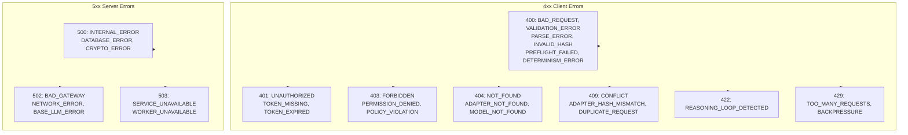

# ERRORS

Canonical error codes. Source: `adapteros-core/error_codes.rs`.

---

## Response Format

```json
{
  "code": "NOT_FOUND",
  "message": "Adapter not found",
  "details": null
}
```

**Type:** `adapteros_api_types::ErrorResponse`. Handlers use `ApiError::not_found("NOT_FOUND", "message")`.

---

## Categories



---

## Key Codes (by domain)

| Domain | Codes |
|--------|-------|
| Validation | BAD_REQUEST, VALIDATION_ERROR, PARSE_ERROR, MISSING_FIELD, INVALID_CPID |
| Auth | UNAUTHORIZED, TOKEN_MISSING, TOKEN_EXPIRED, INVALID_SIGNATURE |
| Policy | FORBIDDEN, PERMISSION_DENIED, POLICY_VIOLATION |
| Resources | NOT_FOUND, ADAPTER_NOT_FOUND, MODEL_NOT_FOUND, WORKER_UNAVAILABLE |
| Determinism | DETERMINISM_ERROR |
| Rate limit | TOO_MANY_REQUESTS, BACKPRESSURE |
| Worker | SERVICE_UNAVAILABLE, WORKER_UNAVAILABLE, BAD_GATEWAY |

---

## Lookup

```bash
./aosctl explain <code>
```

**Source:** `adapteros-cli/src/commands/explain.rs` reads from `adapteros-core` error code registry.
