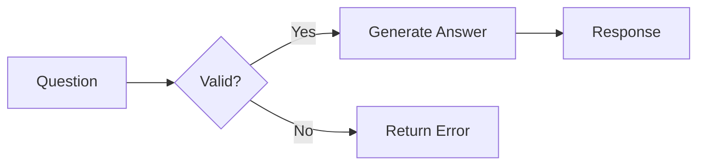
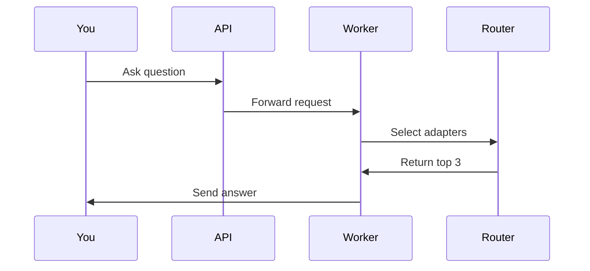

# Getting Started with AdapterOS Architecture

**Welcome!** This guide explains AdapterOS architecture in plain language, perfect for anyone new to the project.

---

## What is AdapterOS?

AdapterOS is an AI inference system that runs machine learning models on Apple Silicon (M1/M2/M3 chips). Think of it like a smart assistant that can:

- **Understand code** in multiple programming languages
- **Answer questions** about your codebase
- **Generate code** with proper context
- **Track its reasoning** so you know why it made decisions

**The "magic"**: It uses small specialized adapters (think of them as skills) that activate based on what you're asking, making it fast and accurate.

---

## Visual Tour: Start Here

### 1. The Big Picture (5 minutes)

**"How does everything fit together?"**

```
You (typing a question)
    ↓
Web Browser (Port 3200)
    ↓
API Server (Port 8080)
    ↓
Worker Process (does the AI work)
    ↓
Response (with explanation)
```

**Key Insight**: Your question flows through layers like a factory assembly line, with each layer doing a specific job.

📊 **[See Full Diagram →](architecture/precision-diagrams.md#1-system-architecture)**

---

### 2. How Your Question Gets Answered (10 minutes)

**"What happens when I ask a question?"**

Let's trace what happens when you ask: *"How do I fix this Python bug?"*

**Step-by-step**:

1. **Your Question** → Sent to API server
2. **Security Check** → "Is this user allowed?"
3. **Find a Worker** → "Which AI worker is available?"
4. **Tokenization** → Break your question into tokens (words/pieces)
5. **Router Decision** → "Which adapters (skills) do we need?"
   - Sees "Python" → activates Python adapter
   - Sees "bug" + "fix" → activates debugging adapter
6. **AI Processing** → Generate answer using selected adapters
7. **Quality Check** → "Does this answer make sense?"
8. **Response** → Send back to you with explanation

**Time**: Typically 1-3 seconds from question to answer

📊 **[See Detailed Flow →](architecture/precision-diagrams.md#2-inference-pipeline-flow)**

---

### 3. The Router: Choosing the Right Skills (10 minutes)

**"How does it know which adapters to use?"**

Think of the router like a hiring manager selecting the best team for a job:

**Your Question**: *"Fix this Django template bug"*

**Router's Analysis**:
```
Language: Python (30% importance) ✅ Strong match
Framework: Django (25% importance) ✅ Strong match
Code Symbols: template, render (20% importance) ✅ Found
File Path: templates/ (15% importance) ✅ Relevant
Action: "fix" (10% importance) ✅ Matched
```

**Result**: Activates 3 best adapters:
1. Python General (90% confidence)
2. Django Specific (85% confidence)
3. Template Debugging (75% confidence)

**Why only 3?** More adapters = slower. We pick the top K=3 for speed.

📊 **[See Router Algorithm →](architecture/precision-diagrams.md#3-router-scoring--selection)**

---

### 4. Memory Management: Keeping Things Fast (10 minutes)

**"How does it stay fast without using all my RAM?"**

AdapterOS manages memory like a smart cache system:

**Adapter States** (from coldest to hottest):

```
Unloaded (on disk)
    ↓ Load when needed
Cold (in RAM, not ready)
    ↓ Compile for GPU
Warm (ready to use)
    ↓ Use frequently
Hot (actively used, cached)
    ↓ Pin for critical use
Resident (never evict)
```

**What happens under memory pressure?**

```
Memory at 70%: 😊 All good, just monitoring
Memory at 80%: 😐 Start evicting cold adapters
Memory at 90%: 😟 Evict warm adapters, reduce active count
Memory at 95%: 🚨 Emergency: evict everything except hot, deny new requests
```

**Memory Budget** (example on 16GB system):
- Base AI Model: 8 GB (fixed)
- System: 1 GB (fixed)
- Active Adapters: 0-5 GB (flexible)
- Cache: 0-1.5 GB (flexible)
- Safety Buffer: 0.5 GB (minimum)

📊 **[See Memory System →](architecture/precision-diagrams.md#5-memory-management-system)**

---

### 5. API: How to Talk to AdapterOS (5 minutes)

**"What can I ask the API to do?"**

**Public Endpoints** (no login required):
```
GET  /healthz          → "Is the system running?"
GET  /readyz           → "Is the system ready?"
POST /v1/auth/login    → "Log me in"
```

**Main Endpoints** (login required):
```
POST /v1/infer              → "Answer my question"
GET  /v1/adapters           → "What skills are available?"
GET  /v1/repositories       → "What codebases can you analyze?"
POST /v1/patch/propose      → "Generate code changes"
```

**Real-time Streams**:
```
GET /v1/stream/metrics      → Live system performance
GET /v1/stream/telemetry    → Live event log
GET /v1/streams/file-changes → Watch for code changes
```

**Try it**: Visit `http://localhost:8080/swagger-ui` for interactive docs

📊 **[See Complete API →](architecture/precision-diagrams.md#7-api-stack-architecture)**

---

## Common Questions

### "Why is it called AdapterOS?"

**Adapters** = Small specialized AI modules (like plugins or skills)  
**OS** = It orchestrates and manages these adapters like an operating system

### "What makes it different from ChatGPT?"

1. **Specialized**: Uses task-specific adapters instead of one giant model
2. **Fast**: Only activates 3 adapters per request (not everything)
3. **Traceable**: Shows you exactly which adapters were used and why
4. **Private**: Runs entirely on your computer (no cloud)
5. **Deterministic**: Same question = same answer (important for coding)

### "What's K-sparse routing?"

**K-sparse** = Only K adapters active at once (K=3 by default)

Instead of using all 100 available adapters, we:
1. Score each adapter based on your question
2. Pick the top 3
3. Use only those 3

**Why?** Speed + accuracy. Using too many adapters slows things down and can confuse the AI.

### "What's Q15 quantization?"

A way to represent numbers efficiently:
- **Before**: Gate values stored as 32-bit floats (0.0 to 1.0)
- **After**: Gate values stored as 16-bit integers (0 to 32767)

**Why?** Faster computation, less memory, no accuracy loss for this use case.

### "What are policy packs?"

Rules that the system must follow, like:
- **Network Isolation**: No internet during AI processing (security)
- **Determinism**: Same input = same output (reliability)
- **Memory Limits**: Don't use more than 85% of RAM (stability)
- **Evidence Required**: Cite sources for factual claims (trust)

Think of them as safety rules and quality checks.

---

## Learning Paths

### Path A: Visual Learner (Recommended)

**Goal**: Understand through diagrams

1. ✅ **You are here** - This guide
2. 📊 [System Architecture](architecture/precision-diagrams.md#1-system-architecture) - See all components
3. 📊 [Request Flow](architecture/precision-diagrams.md#2-inference-pipeline-flow) - Follow a question
4. 📊 [Database Schema](database-schema/schema-diagram.md) - Understand data
5. 📊 [Workflows](database-schema/workflows/) - See operations

**Time**: 2-3 hours total  
**Outcome**: Clear mental model of the system

### Path B: Hands-On Learner

**Goal**: Learn by doing

1. ✅ **You are here** - This guide
2. 🚀 [Quick Start](QUICKSTART.md) - Get it running in 10 minutes
3. 🧪 Try the Web UI at `http://localhost:3200`
4. 🔍 Explore Swagger UI at `http://localhost:8080/swagger-ui`
5. 💻 Read [CLAUDE.md](../CLAUDE.md) - Code examples

**Time**: 1-2 hours to get productive  
**Outcome**: Working system you can experiment with

### Path C: Code-First Learner

**Goal**: Understand implementation

1. ✅ **You are here** - This guide
2. 💻 [CLAUDE.md](../CLAUDE.md) - Developer guide with code refs
3. 📂 Browse `crates/` - Read the actual code
4. 📊 Cross-check with [Precision Diagrams](architecture/precision-diagrams.md)
5. 🧪 Run tests: `cargo test --workspace`

**Time**: 4-6 hours for deep understanding  
**Outcome**: Contributor-level knowledge

---

## Real-World Examples

### Example 1: Asking About Code

**Your Question**: 
```
"What does the parse_request function in uds_server.rs do?"
```

**What Happens Behind the Scenes**:

1. **Router Analysis**:
   - Language: Rust (strong signal)
   - File: uds_server.rs (path match)
   - Symbol: parse_request (direct hit)
   - Action: "what does" (explanation request)

2. **Adapter Selection**:
   - Rust Language Adapter (90%)
   - AdapterOS Codebase Adapter (85%)
   - Documentation Helper (70%)

3. **Processing**:
   - Load `uds_server.rs` from code index
   - Find `parse_request` function
   - Extract documentation and code
   - Generate natural language explanation

4. **Response**:
```
The parse_request function reads HTTP requests from a Unix Domain 
Socket (UDS) stream. It:

1. Reads the request line (GET/POST, path, HTTP version)
2. Parses HTTP headers
3. Reads the request body if present
4. Returns a structured Request object

This is used in worker processes to receive inference requests
from the API server over UDS instead of TCP for better security
and isolation.

Evidence: crates/adapteros-lora-worker/src/uds_server.rs:82-119
```

### Example 2: Debugging Memory Issues

**Your Question**: 
```
"System is running slow, memory at 90%"
```

**What AdapterOS Does**:

1. **Detects High Pressure** (90% > 85% threshold)
2. **Takes Action**:
   ```
   [11:42:33] Memory pressure: HIGH (90%)
   [11:42:33] Evicting cold adapters: 3 removed
   [11:42:34] Memory pressure: HIGH (87%)
   [11:42:34] Evicting warm adapters: 2 removed
   [11:42:35] Reducing K: 3 → 2 (fewer active adapters)
   [11:42:36] Memory pressure: MEDIUM (81%)
   [11:42:36] Pressure relieved
   ```

3. **System Continues**: Now using 2 adapters instead of 3, but stable

4. **Telemetry Logged**:
   ```json
   {
     "event": "memory.pressure.high",
     "timestamp": "2025-01-14T11:42:33Z",
     "usage_pct": 90,
     "actions": ["evict_cold", "evict_warm", "reduce_k"],
     "adapters_evicted": 5,
     "k_reduced_to": 2
   }
   ```

---

## Key Concepts Simplified

### Concept: Deterministic Execution

**Simple Explanation**: Same question always gives the same answer

**Why it matters**: 
- Debugging: Reproduce issues exactly
- Testing: Verify behavior doesn't change
- Auditing: Prove what the system did

**How it works**:
- Fixed random seed (not truly random)
- Precompiled GPU code (no runtime variations)
- Sorted retrieval results (consistent order)
- Canonical JSON (identical formatting)

### Concept: Evidence Grounding

**Simple Explanation**: AI shows its sources like a research paper

**Why it matters**:
- Trust: Verify claims against sources
- Accuracy: Catch hallucinations
- Compliance: Audit trail for decisions

**Example**:
```
Question: "What's the router entropy floor?"

Answer: "The router entropy floor is 0.02, meaning each adapter 
must receive at least 0.02/K probability to prevent collapse 
to a single adapter."

Evidence:
- crates/adapteros-lora-router/src/lib.rs:322-325
- Policy Pack #3: Router Ruleset
```

### Concept: Multi-Tenant Isolation

**Simple Explanation**: Multiple users can't see each other's data

**How it works**:
- Separate process per user (different memory space)
- Different Unix user ID (OS-level isolation)
- Separate Unix socket (different communication channel)
- No shared memory (can't accidentally leak)

**Real-world analogy**: Like separate apartments in a building - each has its own space, locks, and can't access neighbors' apartments.

---

## Diagram Reading Guide

### How to Read Flowcharts

**Shapes mean things**:
- 📦 **Rectangle**: A process or action
- 💎 **Diamond**: A decision point (yes/no)
- 🔵 **Rounded box**: Start or end
- 🗄️ **Cylinder**: Database
- ➡️ **Arrow**: Flow direction

**Example**:


**Reading order**: Follow arrows from top to bottom or left to right

### How to Read Sequence Diagrams

**Shows**: Who talks to whom and when

**Example**:


**Reading order**: Top to bottom, each arrow is a message

### Colors in Diagrams

Throughout our diagrams, colors have consistent meaning:

- 🟦 **Blue**: Workers, main processes
- 🟥 **Red**: Critical systems, databases
- 🟧 **Orange**: Memory, warnings
- 🟪 **Purple**: Servers, control plane
- 🟨 **Yellow**: Caution, thresholds
- 🟩 **Green**: Success, healthy states

---

## Next Steps

### Just Exploring?

Continue with:
1. [Architecture Overview](architecture.md) - High-level concepts
2. [MasterPlan](architecture/MasterPlan.md) - Complete design
3. [Interactive Diagrams](architecture/precision-diagrams.md) - All details

### Want to Use It?

Start with:
1. [Quick Start Guide](QUICKSTART.md) - Setup in 10 minutes
2. [API Documentation](control-plane.md) - Using the API
3. [Swagger UI](http://localhost:8080/swagger-ui) - Try endpoints

### Want to Contribute?

Begin with:
1. [CLAUDE.md](../CLAUDE.md) - Developer guide
2. [Contributing Guide](../CONTRIBUTING.md) - How to contribute
3. [Precision Diagrams](architecture/precision-diagrams.md) - Code references

### Want Deep Knowledge?

Study:
1. All [Precision Diagrams](architecture/precision-diagrams.md)
2. All [Database Workflows](database-schema/workflows/)
3. [Code Intelligence Docs](code-intelligence/)
4. Source code in `crates/`

---

## Glossary

**Adapter**: A small AI module specialized for a specific task (like Python coding or Django debugging)

**API**: Application Programming Interface - how programs talk to each other

**Circuit Breaker**: Safety mechanism that stops processing when too many errors occur

**Control Plane**: The management system that coordinates everything

**Deterministic**: Always produces the same output for the same input

**Eviction**: Removing something from memory to free up space

**Gateway**: Entry point that checks security before allowing access

**Inference**: Running the AI model to generate an answer

**K-sparse**: Using only K adapters at a time (K=3 by default)

**LoRA**: Low-Rank Adaptation - a way to add specialized skills to AI models

**Metal**: Apple's GPU programming framework for Mac

**Policy Pack**: A set of rules the system must follow

**Q15**: A number format using 16 bits (0 to 32767)

**Router**: Decides which adapters to use for each question

**Telemetry**: Recording what the system does for monitoring and debugging

**Tokenization**: Breaking text into pieces the AI can understand

**UDS**: Unix Domain Socket - a way for programs to communicate securely

**Worker**: A process that does the actual AI inference work

---

## Getting Help

### Documentation Issues

**Found something confusing?** 
Create an issue: [GitHub Issues](https://github.com/your-repo/issues)

**Want more examples?**
Check: [Code Intelligence Docs](code-intelligence/)

**Need visual explanation?**
See: [Precision Diagrams](architecture/precision-diagrams.md)

### Technical Issues

**System not starting?**
Read: [Quick Start Guide](QUICKSTART.md)

**API not responding?**
Check: [Control Plane Docs](control-plane.md)

**Memory issues?**
See: [Memory Management](architecture/precision-diagrams.md#5-memory-management-system)

---

## Quick Reference Card

### Important URLs

| Service | URL | Purpose |
|---------|-----|---------|
| Web UI | http://localhost:3200 | Main interface |
| API | http://localhost:8080 | Backend API |
| Swagger | http://localhost:8080/swagger-ui | API docs |
| Metrics | http://localhost:8080/metrics | System stats |

### Important Commands

```bash
# Start the UI (development)
make ui-dev

# Start the server
cargo run --release --bin adapteros-server

# Run tests
cargo test --workspace

# Check for errors
cargo clippy --workspace

# Format code
cargo fmt --all
```

### Important Files

| File | Purpose |
|------|---------|
| `configs/cp.toml` | Server configuration |
| `Cargo.toml` | Rust project dependencies |
| `var/aos-cp.sqlite3` | Main database |
| `migrations/*.sql` | Database schema |

### Important Ports

| Port | Service |
|------|---------|
| 3200 | UI Dev Server (Vite) |
| 8080 | API Server (Axum) |

---

## Feedback

This guide is meant to be accessible to everyone. If something is still confusing:

1. **Create an issue**: Tell us what's unclear
2. **Suggest improvements**: What would make it better?
3. **Share your experience**: How did you learn? What helped?

Your feedback helps us make better documentation for everyone!

---

**Last Updated**: 2025-01-14  
**For**: Beginners and non-technical readers  
**Next**: [Quick Start Guide](QUICKSTART.md) or [Precision Diagrams](architecture/precision-diagrams.md)

