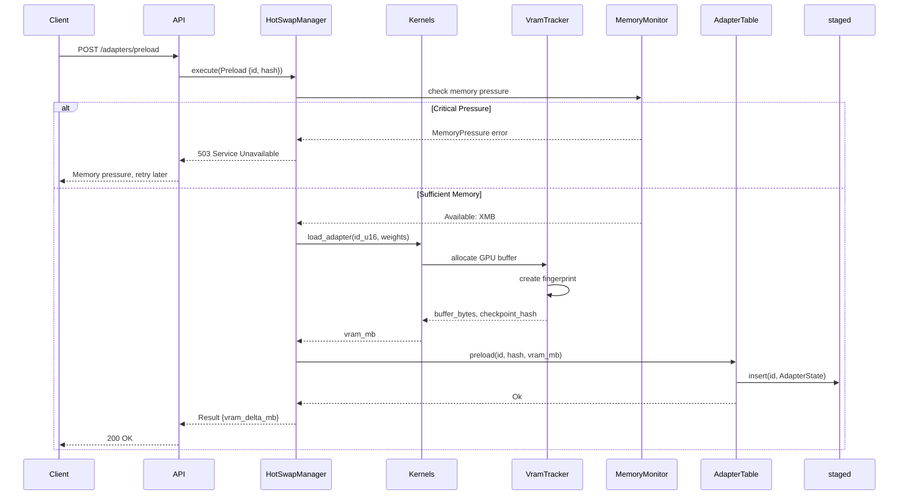
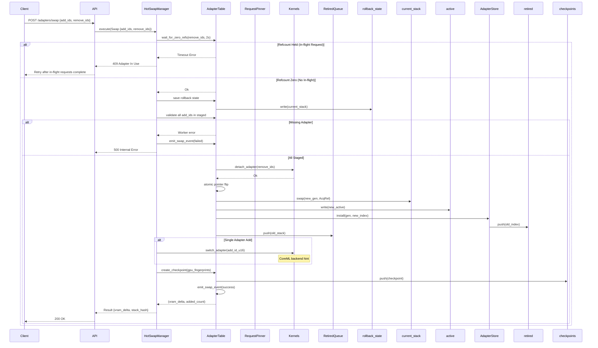
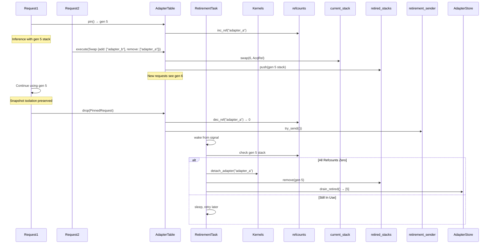
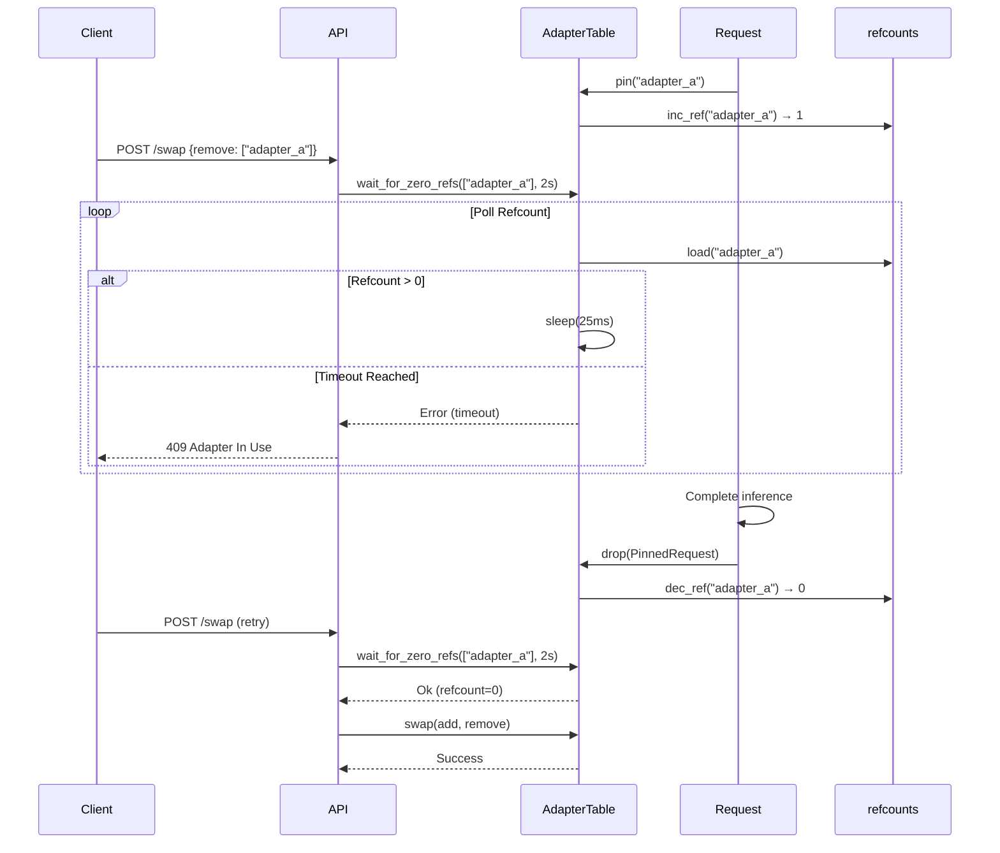
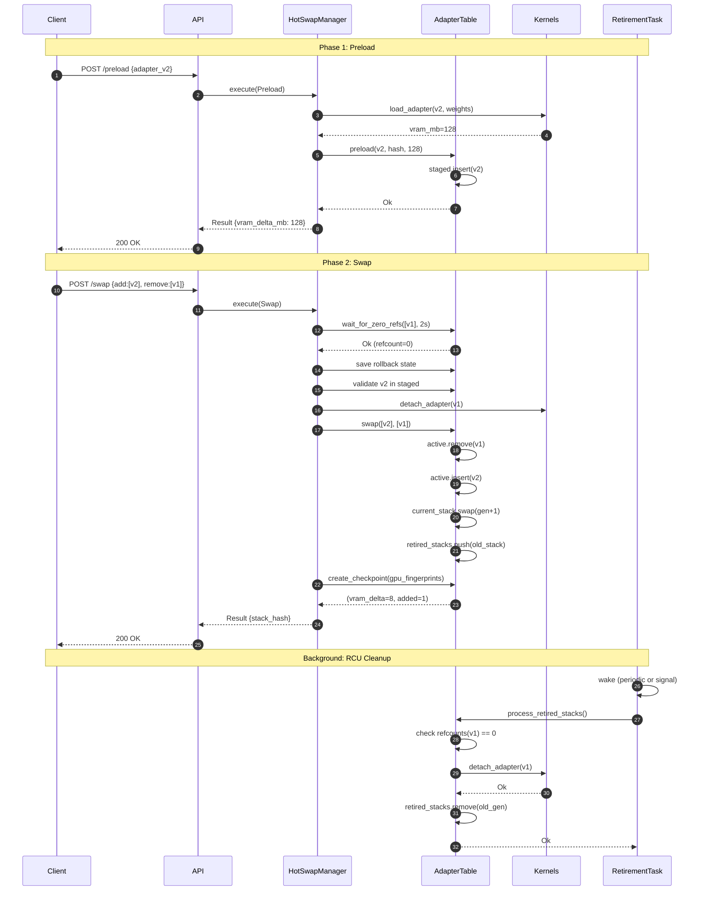
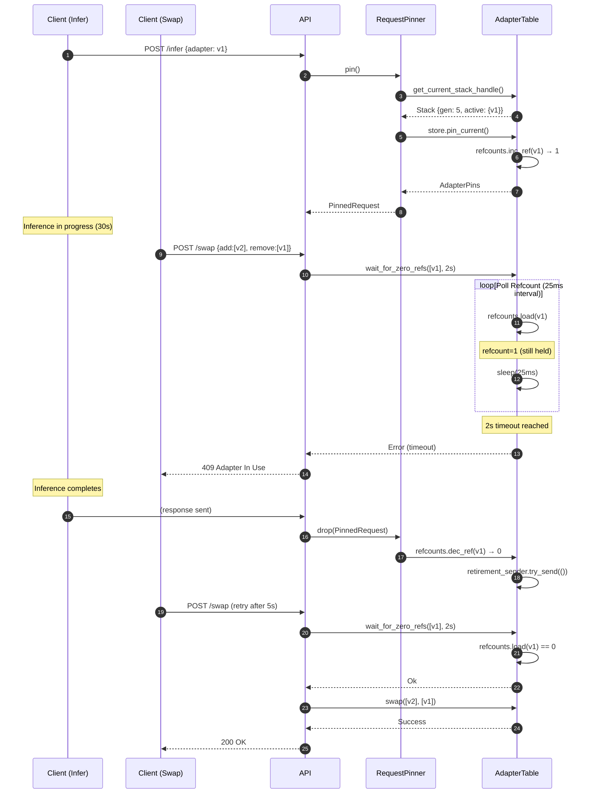
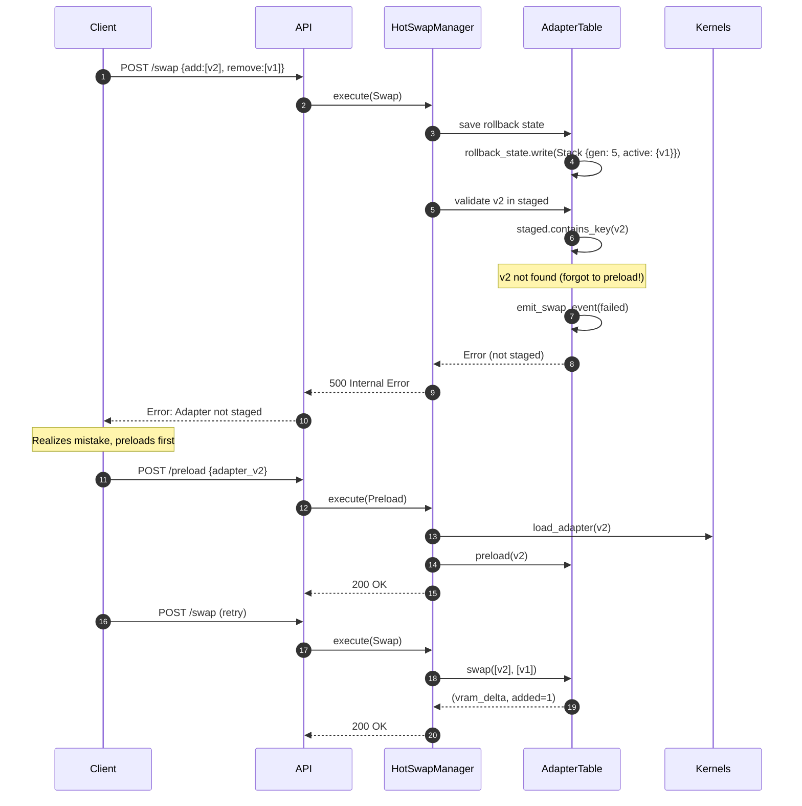
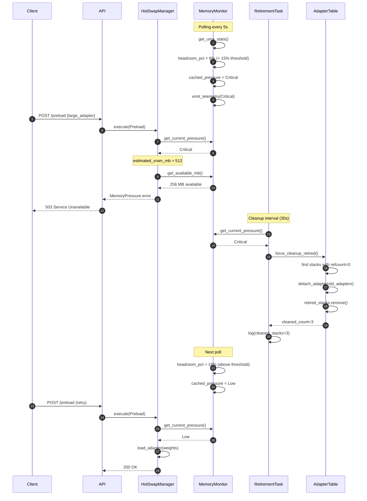

# Hot-Swap Scenarios in AdapterOS

**Comprehensive guide to zero-downtime adapter hot-swapping with failure recovery**

**Last Updated:** 2025-12-24

---

## Table of Contents

1. [Overview](#overview)
2. [Core Concepts](#core-concepts)
3. [Two-Phase Hot-Swap Protocol](#two-phase-hot-swap-protocol)
4. [Request Pinning and RCU](#request-pinning-and-rcu)
5. [Zero-Downtime Guarantee](#zero-downtime-guarantee)
6. [Failure Modes and Recovery](#failure-modes-and-recovery)
7. [Memory Pressure Integration](#memory-pressure-integration)
8. [API Reference](#api-reference)
9. [Sequence Diagrams](#sequence-diagrams)
10. [Examples](#examples)

---

## Overview

AdapterOS implements a sophisticated **two-phase hot-swap protocol** that enables zero-downtime adapter updates with automatic rollback on failure. The system combines:

- **Two-phase commit**: Preload → Swap with validation
- **RCU (Read-Copy-Update)**: Lock-free snapshot isolation for in-flight requests
- **Reference counting**: Precise tracking of adapter usage
- **Automatic rollback**: Revert to last verified state on failure
- **Memory pressure awareness**: Reject swaps when VRAM is constrained

### Key Files

- **`crates/adapteros-lora-worker/src/adapter_hotswap.rs`**: Core hot-swap infrastructure
- **`crates/adapteros-lora-worker/src/request_pinner.rs`**: Request pinning and RAII guards
- **`crates/adapteros-core/src/adapter_store.rs`**: RCU-style adapter index
- **`crates/adapteros-lora-worker/src/backoff.rs`**: Exponential backoff and circuit breakers
- **`crates/adapteros-lora-worker/src/memory.rs`**: UMA pressure monitoring

---

## Core Concepts

### Adapter Lifecycle States

```rust
pub enum LifecycleState {
    Loaded,    // Preloaded into VRAM, not yet active
    Active,    // Serving inference requests
    Retired,   // Swapped out, waiting for refcount drain
}
```

### Stack Generation

Each hot-swap increments a **monotonic generation counter**. This enables:
- **Snapshot isolation**: Requests pin a specific generation
- **RCU retirement**: Old generations retire only after refcount reaches zero
- **Cache coherence**: KV cache invalidation on generation change

### Adapter Table

The `AdapterTable` maintains three states:

```rust
pub struct AdapterTable {
    active: RwLock<HashMap<String, AdapterState>>,      // Currently serving
    staged: RwLock<HashMap<String, AdapterState>>,      // Preloaded, not active
    rollback_state: RwLock<Option<Arc<Stack>>>,         // Last verified state
    current_stack: AtomicUsize,                          // Generation pointer
    refcounts: TokioMutex<HashMap<String, Arc<AtomicUsize>>>,
    retired_stacks: TokioMutex<Vec<Arc<Stack>>>,        // RCU retirement queue
    checkpoints: RwLock<Vec<StackCheckpoint>>,          // Replay verification
}
```

### GPU Fingerprints

Cross-layer integrity verification combines:
- **Metadata hash**: Adapter IDs + `.aos` file hashes
- **GPU fingerprint**: BLAKE3 of checkpoint samples (first/mid/last 4KB)

```rust
pub struct GpuFingerprint {
    pub adapter_id: String,
    pub buffer_bytes: u64,
    pub checkpoint_hash: B3Hash,  // Hash of (first_4kb, mid_4kb, last_4kb)
}
```

---

## Two-Phase Hot-Swap Protocol

### Phase 1: Preload

**Purpose**: Load adapter into VRAM without activating it.



**Key Operations**:

1. **Tenant isolation check**: Verify adapter path is within tenant root
2. **Memory pressure check**: Reject if VRAM insufficient or critical pressure
3. **Load weights into GPU**: Read `.aos` file, deserialize SafeTensors
4. **Create GPU fingerprint**: Sample first/mid/last 4KB for integrity tracking
5. **Update staged set**: Mark as `LifecycleState::Loaded`
6. **Initialize refcount**: Ensure entry exists for pinning

**Failure Modes**:
- `AosError::MemoryPressure`: Insufficient VRAM or critical pressure
- `AosError::IsolationViolation`: Adapter path outside tenant root
- `AosError::Io`: Failed to read `.aos` file
- `AosError::Parse`: Invalid SafeTensors format

### Phase 2: Swap

**Purpose**: Atomically activate staged adapters and retire old ones.



**Key Operations**:

1. **Wait for drain**: Ensure no in-flight requests hold removed adapters (2s timeout)
2. **Save rollback state**: Snapshot current stack before modification
3. **Validate staged set**: Ensure all `add_ids` exist in `staged` (prevents partial swap)
4. **Unload removed adapters**: Call `detach_adapter()` for GPU cleanup
5. **Atomic pointer flip**: Update `current_stack` generation with `AcqRel` ordering
6. **Publish new index**: Install new adapter index for request pinning
7. **Retire old stack**: Move to RCU retirement queue
8. **Create checkpoint**: Capture metadata + GPU fingerprints for replay verification
9. **CoreML backend hint**: If single-adapter swap, call `switch_adapter()` (no-op for other backends)

**Invariants**:
- Generation counter **strictly increases** on successful swap
- Readers see **consistent snapshots** during pointer flip (no torn reads)
- Old stack **remains accessible** until refcounts reach zero

---

## Request Pinning and RCU

### Request Pinning

**Purpose**: Ensure in-flight requests see a stable adapter set, even during concurrent swaps.

```rust
pub struct RequestPinner {
    table: Arc<AdapterTable>,
}

pub struct PinnedRequest {
    pins: AdapterPins,          // RAII guard that decrements on drop
    stack: Arc<Stack>,          // Snapshot of active adapters
    stack_hash: B3Hash,         // Metadata hash for verification
}
```

**Pinning Protocol**:

```rust
// Capture snapshot with retry on concurrent swap
fn pin_internal(&self, allow_empty: bool) -> Result<PinnedRequest> {
    for _ in 0..2 {
        let stack = self.table.get_current_stack_handle();  // Load generation
        if stack.active.is_empty() && !allow_empty {
            return Err(AosError::Worker("No active adapters"));
        }

        let pins = self.table.store().pin_current();        // Increment refcounts
        if pins.generation() == stack.generation {          // Verify coherence
            return Ok(PinnedRequest { pins, stack, stack_hash });
        }
        // Generation changed during pin attempt, retry
    }
    Err(AosError::Worker("Stack changed while pinning"))
}
```

**RAII Lifecycle**:

```rust
impl Drop for AdapterPins {
    fn drop(&mut self) {
        for (_id, rc) in &self.pinned {
            let prev = rc.fetch_sub(1, Ordering::AcqRel);
            if prev == 1 {
                // Last reference released, signal retirement task
                retirement_sender.try_send(()).ok();
            }
        }
    }
}
```

### RCU (Read-Copy-Update)

**Purpose**: Lock-free snapshot isolation for concurrent readers and writers.



**Retirement Task**:

```rust
async fn retirement_task(table: Arc<AdapterTable>, kernels: Option<Arc<Mutex<K>>>) {
    let backoff = BackoffConfig::new(500ms, 60s, 2.0, 5);
    let circuit_breaker = CircuitBreaker::new(5, 120s);
    let mut cleanup_interval = tokio::time::interval(30s);

    loop {
        tokio::select! {
            _ = retirement_sender.recv() => {},             // Wake on refcount zero
            _ = sleep(5s) => {},                            // Periodic check
            _ = cleanup_interval.tick() => {                // Memory pressure cleanup
                if memory_monitor.pressure() >= High {
                    table.force_cleanup_retired(kernels).await?;
                }
            }
        }

        if circuit_breaker.is_open() {
            sleep(circuit_breaker.reset_timeout()).await;
            continue;
        }

        match table.process_retired_stacks(kernels).await {
            Ok(_) => {
                circuit_breaker.record_success();
                consecutive_failures = 0;
            }
            Err(e) => {
                circuit_breaker.record_failure();
                consecutive_failures += 1;
                sleep(backoff.next_delay(consecutive_failures)).await;
            }
        }
    }
}
```

**Retry Invariant**: Each retired stack gets **at most 3 unload attempts** before quarantine.

```rust
if retry_count >= 3 {
    // Quarantine: remove from queue, log for manual intervention
    retired.remove(i);
    retry_counts.remove(&gen);
    tracing::error!(event = "retire_quarantine", generation = gen);
    telemetry.log("rcu_unload_failed", json!({
        "generation": gen,
        "retries": retry_count,
        "error": "max_retries_exceeded"
    }));
}
```

---

## Zero-Downtime Guarantee

### Guarantee Statement

**During a hot-swap, no in-flight request is interrupted, and new requests see a consistent adapter set.**

### Mechanisms

1. **Atomic Pointer Flip**

   ```rust
   let old = self.current_stack.swap(new_gen, Ordering::AcqRel);
   ```

   - `AcqRel` ordering ensures:
     - **Acquire**: All writes before swap are visible
     - **Release**: All subsequent reads see new generation
   - No torn reads: Readers see old OR new, never a mix

2. **Snapshot Isolation**

   ```rust
   let handle = table.get_current_stack_handle();  // Captures generation
   // Even if swap happens here, handle still references old stack
   for adapter in handle.active.values() {
       // Uses old stack consistently
   }
   ```

3. **Reference Counting**

   ```rust
   // Request holds pins
   let pins = pinner.pin()?;  // Increments refcounts

   // Swap waits for drain
   table.wait_for_zero_refs(&remove_ids, Duration::from_secs(2)).await?;

   // Inference completes
   drop(pins);  // Decrements refcounts, signals retirement
   ```

4. **Deferred Cleanup**

   Old adapters remain in VRAM until:
   - All in-flight requests complete (refcount = 0)
   - Retirement task processes the stack
   - GPU unload succeeds

### Failure Isolation

- **Preload failure**: No effect on active stack (staged set only)
- **Swap failure**: Rollback to last verified state
- **GPU unload failure**: Retry with exponential backoff, quarantine after 3 attempts

---

## Failure Modes and Recovery

### 1. Preload Failures

#### Scenario: Insufficient VRAM

```rust
// Memory pressure check during preload
if estimated_vram_mb > available_mb {
    return Err(AosError::MemoryPressure(format!(
        "Insufficient VRAM: adapter requires ~{}MB but only {}MB available",
        estimated_vram_mb, available_mb
    )));
}
```

**Recovery**:
- **Client**: Receives `503 Service Unavailable` (memory pressure)
- **System**: Triggers force cleanup of retired adapters
- **Retry**: Client should back off and retry after cleanup completes

#### Scenario: Critical Memory Pressure

```rust
if pressure == MemoryPressureLevel::Critical {
    return Err(AosError::MemoryPressure(format!(
        "Critical memory pressure detected, cannot preload adapter (requires ~{}MB)",
        estimated_vram_mb
    )));
}
```

**Recovery**:
- **System**: Immediately fails preload
- **Memory monitor**: Triggers aggressive cleanup every 30s
- **Operator**: Consider reducing adapter count or increasing VRAM

#### Scenario: Invalid Adapter File

```rust
let adapter_bytes = tokio::fs::read(&adapter_path).await.map_err(|e| {
    AosError::Io(format!("Failed to read adapter file {}: {}", adapter_path.display(), e))
})?;
```

**Recovery**:
- **Client**: Receives `500 Internal Server Error`
- **Operator**: Verify `.aos` file integrity, check tenant isolation
- **Retry**: Not recommended (file issue requires fix)

### 2. Swap Failures

#### Scenario: In-Flight Request Blocks Swap

```rust
let blocked = table.wait_for_zero_refs(&remove_ids, Duration::from_secs(2)).await;
if blocked.is_err() {
    return Err(AosError::Worker(format!(
        "Hot-swap blocked: adapters still in use after 2s: {:?}",
        remove_ids
    )));
}
```

**Recovery**:
- **Client**: Receives `409 Conflict` (adapter in use)
- **Client**: Should retry after a short delay (e.g., 5s)
- **System**: In-flight request completes, refcount drops to zero

**Sequence**:



#### Scenario: Adapter Not Staged

```rust
for id in add_ids {
    if !staged_read.contains_key(id) {
        let err = AosError::Worker(format!(
            "Adapter {} not found in staged set - aborting swap before any changes",
            id
        ));
        self.emit_swap_event(add_ids, remove_ids, false, Some(err.to_string()));
        return Err(err);
    }
}
```

**Recovery**:
- **Client**: Receives `500 Internal Server Error`
- **System**: No state change (validation happens before modifications)
- **Client**: Must call `preload` first, then retry `swap`

#### Scenario: GPU Unload Failure During Swap

```rust
if let Err(e) = kernels_lock.detach_adapter(adapter_id_u16) {
    tracing::warn!(adapter_id = %remove_id, error = %e, "Failed to unload adapter");
}
```

**Recovery**:
- **System**: Logs warning, continues with swap (best-effort cleanup)
- **Retirement task**: Will retry unload in background with exponential backoff
- **If persistent**: Quarantines stack after 3 attempts, logs telemetry event

### 3. Rollback Scenarios

#### Trigger: Swap Validation Failure

```rust
// If adapter disappears from staged after validation (concurrent modification)
if let Some(rollback_stack) = rollback_state.as_ref() {
    let _old = self.current_stack.swap(rollback_stack.generation as usize, Ordering::AcqRel);
    tracing::error!("UNEXPECTED: Adapter not in staged after validation - rolling back");
    self.staged.write().clear();
    return Err(AosError::Worker(format!(
        "Adapter {} disappeared from staged set (concurrent modification)",
        id
    )));
}
```

**Recovery**:
- **System**: Automatically reverts to `rollback_state`
- **Generation**: Reverted to previous value
- **Client**: Receives error, current state unchanged

#### Manual Rollback API

```rust
pub async fn rollback(&self) -> Result<()> {
    let rollback_stack = self.rollback_state.read()
        .as_ref()
        .cloned()
        .ok_or_else(|| AosError::Worker("No rollback state available"))?;

    let old = self.current_stack.swap(rollback_stack.generation as usize, Ordering::AcqRel);
    *self.active.write() = rollback_stack.active.clone();

    // Retire the previous current stack
    if old as u64 > rollback_stack.generation {
        self.retired_stacks.lock().await.push(Arc::new(Stack {
            generation: old as u64,
            active: self.active.read().clone(),
        }));
    }

    *self.rollback_state.write() = None;
    Ok(())
}
```

**Usage**:
```bash
curl -X POST http://localhost:8080/api/v1/adapters/rollback \
  -H "Authorization: Bearer $TOKEN"
```

### 4. Retirement Task Failures

#### Scenario: GPU Detach Failure

```rust
for id in &adapter_ids_for_unload {
    let id_u16 = adapter_id_to_u16(id);
    if let Err(e) = k_lock.detach_adapter(id_u16) {
        tracing::warn!("Failed to unload adapter {}: {}", id, e);
        unload_failed = true;
        break;  // Retry next time
    }
}
```

**Recovery**:
- **System**: Increments retry count, applies exponential backoff
- **Backoff schedule**: 500ms → 1s → 2s → 4s → 8s (max 60s)
- **Circuit breaker**: Opens after 5 consecutive failures (300s cooldown)
- **Quarantine**: After 3 attempts, removes from queue and logs telemetry

#### Scenario: Circuit Breaker Open

```rust
if circuit_breaker.is_open() {
    tracing::warn!(
        failure_count = circuit_breaker.failure_count(),
        "Retirement task circuit breaker is open, pausing"
    );
    sleep(circuit_breaker.reset_timeout()).await;
    continue;
}
```

**Recovery**:
- **System**: Pauses retirement for 300s
- **Memory monitor**: Triggers force cleanup if pressure is high
- **After timeout**: Resets failure count, resumes normal operation

---

## Memory Pressure Integration

### Pressure Levels

```rust
pub enum MemoryPressureLevel {
    Low,       // < 70% utilization, normal operation
    High,      // 70-85% utilization, trigger cleanup
    Critical,  // > 85% utilization, reject preloads
}
```

### Monitoring

```rust
pub struct UmaPressureMonitor {
    min_headroom_pct: u8,           // Minimum headroom (e.g., 15%)
    cached_pressure: Arc<RwLock<MemoryPressureLevel>>,
    telemetry: Option<TelemetryWriter>,
}

// Polling task (5s interval)
async fn start_polling(&mut self) {
    let mut interval = interval(Duration::from_secs(5));
    loop {
        interval.tick().await;

        let stats = get_uma_stats()?;
        let pressure = determine_pressure(&stats, min_headroom_pct);
        *pressure_cache.write() = pressure;

        if pressure != MemoryPressureLevel::Low {
            emit_telemetry(&telemetry, &stats, pressure).await;
        }
        if pressure == MemoryPressureLevel::Critical {
            warn!("Critical UMA pressure: headroom {}%", stats.headroom_pct);
        }
    }
}
```

### Adaptive Cleanup

```rust
// Retirement task checks pressure every 30s
let mut cleanup_interval = tokio::time::interval(Duration::from_secs(30));

loop {
    tokio::select! {
        _ = cleanup_interval.tick() => {
            if memory_monitor.get_current_pressure() >= MemoryPressureLevel::High {
                tracing::warn!(pressure = %pressure, "Memory pressure detected, forcing cleanup");
                match table.force_cleanup_retired(kernels).await {
                    Ok(cleaned) if cleaned > 0 => {
                        tracing::info!(cleaned_stacks = cleaned, "Force cleanup completed");
                    }
                    Err(e) => {
                        tracing::error!(error = %e, "Force cleanup failed");
                    }
                }
            }
        }
    }
}
```

### Force Cleanup

```rust
pub async fn force_cleanup_retired<K: FusedKernels>(&self, kernels: Option<Arc<Mutex<K>>>) -> Result<usize> {
    let mut cleaned_count = 0;
    let mut retired_guard = self.retired_stacks.lock().await;
    let mut i = 0;

    while i < retired_guard.len() {
        let stack = &retired_guard[i];
        let adapter_ids: Vec<String> = stack.active.keys().cloned().collect();

        // Check if all adapters have zero refcount
        let can_unload = {
            let refcounts = self.refcounts.lock().await;
            adapter_ids.iter().all(|id| {
                refcounts.get(id).is_some_and(|rc| rc.load(Ordering::Relaxed) == 0)
            })
        };

        if can_unload {
            // Unload from GPU
            if let Some(kernels) = kernels.clone() {
                let mut k_lock = kernels.lock().await;
                for id in &adapter_ids {
                    k_lock.detach_adapter(adapter_id_to_u16(id))?;
                }
            }

            // Remove from retired queue
            retired_guard.remove(i);
            cleaned_count += 1;
            tracing::info!("Force cleanup: unloaded retired stack gen {}", stack.generation);
        } else {
            i += 1;
        }
    }

    Ok(cleaned_count)
}
```

---

## API Reference

### Preload Adapter

**Endpoint**: `POST /api/v1/adapters/preload`

**Request Body**:
```json
{
  "adapter_id": "style-transfer-v2",
  "hash": "blake3:a1b2c3d4...",
  "tenant_id": "tenant_001"
}
```

**Response** (200 OK):
```json
{
  "success": true,
  "message": "Preloaded adapter: style-transfer-v2",
  "vram_delta_mb": 128,
  "duration_ms": 450,
  "stack_hash": null
}
```

**Errors**:
- `503 Service Unavailable`: Memory pressure, retry later
- `500 Internal Server Error`: Adapter file error or GPU failure
- `403 Forbidden`: Tenant isolation violation

### Swap Adapters

**Endpoint**: `POST /api/v1/adapters/swap`

**Request Body**:
```json
{
  "add_ids": ["style-transfer-v2"],
  "remove_ids": ["style-transfer-v1"]
}
```

**Response** (200 OK):
```json
{
  "success": true,
  "message": "Swapped: +[\"style-transfer-v2\"] / -[\"style-transfer-v1\"]",
  "vram_delta_mb": 8,
  "duration_ms": 125,
  "stack_hash": "blake3:e5f6g7h8..."
}
```

**Errors**:
- `409 Conflict`: Adapter in use, retry after in-flight requests complete
- `500 Internal Server Error`: Adapter not staged, validation failure

### Rollback

**Endpoint**: `POST /api/v1/adapters/rollback`

**Response** (200 OK):
```json
{
  "success": true,
  "message": "Rolled back to last verified state",
  "vram_delta_mb": null,
  "duration_ms": 45,
  "stack_hash": "blake3:a1b2c3d4..."
}
```

**Errors**:
- `500 Internal Server Error`: No rollback state available

### Verify Stack

**Endpoint**: `POST /api/v1/adapters/verify`

**Response** (200 OK):
```json
{
  "success": true,
  "message": "Stack verified (with GPU integrity check)",
  "vram_delta_mb": null,
  "duration_ms": 80,
  "stack_hash": "blake3:cross_layer_hash..."
}
```

### Get Active Adapters

**Endpoint**: `GET /api/v1/adapters/active`

**Response** (200 OK):
```json
{
  "generation": 42,
  "adapters": [
    {
      "id": "style-transfer-v2",
      "hash": "blake3:a1b2c3d4...",
      "vram_mb": 128,
      "loaded_at": "2025-12-24T10:30:00Z",
      "lifecycle": "Active"
    }
  ],
  "total_vram_mb": 128
}
```

---

## Sequence Diagrams

### Normal Hot-Swap Flow



### Swap Blocked by In-Flight Request



### Rollback on Swap Failure



### Memory Pressure Rejection



---

## Examples

### Example 1: Basic Hot-Swap

```bash
#!/bin/bash
# basic_hotswap.sh - Demonstrate two-phase hot-swap

TOKEN="your_jwt_token"
API="http://localhost:8080/api/v1"

# Phase 1: Preload new adapter
echo "Preloading adapter-v2..."
curl -X POST "$API/adapters/preload" \
  -H "Authorization: Bearer $TOKEN" \
  -H "Content-Type: application/json" \
  -d '{
    "adapter_id": "sentiment-v2",
    "hash": "blake3:abc123...",
    "tenant_id": "tenant_001"
  }'

# Phase 2: Atomic swap
echo "Swapping v1 -> v2..."
curl -X POST "$API/adapters/swap" \
  -H "Authorization: Bearer $TOKEN" \
  -H "Content-Type: application/json" \
  -d '{
    "add_ids": ["sentiment-v2"],
    "remove_ids": ["sentiment-v1"]
  }'

# Verify new stack
curl -X GET "$API/adapters/active" \
  -H "Authorization: Bearer $TOKEN"
```

### Example 2: Rollback After Failed Swap

```bash
#!/bin/bash
# rollback_example.sh - Demonstrate automatic rollback

TOKEN="your_jwt_token"
API="http://localhost:8080/api/v1"

# Attempt swap without preload (will fail)
echo "Attempting swap without preload..."
RESPONSE=$(curl -s -w "\n%{http_code}" -X POST "$API/adapters/swap" \
  -H "Authorization: Bearer $TOKEN" \
  -H "Content-Type: application/json" \
  -d '{
    "add_ids": ["not-preloaded"],
    "remove_ids": ["sentiment-v1"]
  }')

HTTP_CODE=$(echo "$RESPONSE" | tail -n1)
if [ "$HTTP_CODE" -eq 500 ]; then
    echo "Swap failed as expected (adapter not staged)"

    # Verify rollback preserved v1
    ACTIVE=$(curl -s -X GET "$API/adapters/active" \
      -H "Authorization: Bearer $TOKEN")

    if echo "$ACTIVE" | jq -e '.adapters[] | select(.id == "sentiment-v1")' > /dev/null; then
        echo "✓ Rollback successful: sentiment-v1 still active"
    else
        echo "✗ Rollback failed: sentiment-v1 missing"
    fi
fi
```

### Example 3: Retry on Conflict (In-Flight Request)

```bash
#!/bin/bash
# retry_on_conflict.sh - Handle 409 conflicts

TOKEN="your_jwt_token"
API="http://localhost:8080/api/v1"

# Preload new adapter
curl -X POST "$API/adapters/preload" \
  -H "Authorization: Bearer $TOKEN" \
  -H "Content-Type: application/json" \
  -d '{
    "adapter_id": "sentiment-v2",
    "hash": "blake3:def456...",
    "tenant_id": "tenant_001"
  }'

# Attempt swap with retry logic
MAX_RETRIES=5
RETRY_DELAY=5

for i in $(seq 1 $MAX_RETRIES); do
    echo "Swap attempt $i/$MAX_RETRIES..."

    RESPONSE=$(curl -s -w "\n%{http_code}" -X POST "$API/adapters/swap" \
      -H "Authorization: Bearer $TOKEN" \
      -H "Content-Type: application/json" \
      -d '{
        "add_ids": ["sentiment-v2"],
        "remove_ids": ["sentiment-v1"]
      }')

    HTTP_CODE=$(echo "$RESPONSE" | tail -n1)
    BODY=$(echo "$RESPONSE" | head -n-1)

    if [ "$HTTP_CODE" -eq 200 ]; then
        echo "✓ Swap succeeded"
        echo "$BODY" | jq .
        break
    elif [ "$HTTP_CODE" -eq 409 ]; then
        echo "Conflict: adapter in use, retrying in ${RETRY_DELAY}s..."
        sleep $RETRY_DELAY
    else
        echo "✗ Swap failed with HTTP $HTTP_CODE"
        echo "$BODY"
        exit 1
    fi
done
```

### Example 4: Rust API Usage

```rust
use adapteros_lora_worker::adapter_hotswap::{
    HotSwapManager, AdapterCommand, AdapterCacheIdentity
};
use adapteros_core::B3Hash;
use std::path::PathBuf;

#[tokio::main]
async fn main() -> Result<(), Box<dyn std::error::Error>> {
    // Create hot-swap manager with CoreML backend
    let manager = HotSwapManager::new_with_kernels(
        kernels,              // Arc<Mutex<CoreMLKernels>>
        PathBuf::from("/var/aos/adapters"),
        "tenant_001".to_string(),
        Some(telemetry_writer),
        Some(memory_monitor)
    );

    // Configure cache identity
    manager.set_cache_identity(AdapterCacheIdentity {
        base_manifest_hash: Some(base_hash),
        backend_type: "coreml".to_string(),
        kernel_version_id: "v1.2.3".to_string(),
        tenant_id: Some("tenant_001".to_string()),
        adapter_dir_hash: None,
    });

    // Phase 1: Preload adapter
    let preload_result = manager.execute(AdapterCommand::Preload {
        adapter_id: "sentiment-v2".to_string(),
        hash: B3Hash::hash(b"adapter_content"),
    }).await?;

    println!("Preloaded: {} MB VRAM", preload_result.vram_delta_mb.unwrap());

    // Phase 2: Swap adapters
    let swap_result = manager.execute(AdapterCommand::Swap {
        add_ids: vec!["sentiment-v2".to_string()],
        remove_ids: vec!["sentiment-v1".to_string()],
    }).await?;

    println!("Swap complete: stack hash {}", swap_result.stack_hash.unwrap().to_hex());

    // Verify stack integrity
    let verify_result = manager.execute(AdapterCommand::VerifyStack).await?;
    println!("Verification: {}", verify_result.message);

    Ok(())
}
```

### Example 5: Request Pinning in Inference

```rust
use adapteros_lora_worker::request_pinner::RequestPinner;
use adapteros_lora_worker::adapter_hotswap::AdapterTable;
use std::sync::Arc;

async fn infer_with_pinning(
    pinner: &RequestPinner,
    prompt: &str
) -> Result<String, Box<dyn std::error::Error>> {
    // Pin current adapter snapshot
    let pinned = pinner.pin()?;

    println!("Pinned generation: {}", pinned.generation());
    println!("Stack hash: {}", pinned.stack_hash().to_hex());

    // Inference loop - snapshot remains stable even during concurrent swaps
    let mut output = String::new();
    for token in 0..100 {
        // Access adapters from pinned snapshot
        for (id, adapter) in pinned.stack().active.iter() {
            // Use adapter weights (guaranteed to remain in VRAM)
        }

        // Generate token
        output.push_str(&format!("token_{} ", token));
    }

    // Drop pinned request - refcounts decremented automatically
    drop(pinned);

    Ok(output)
}

#[tokio::main]
async fn main() -> Result<(), Box<dyn std::error::Error>> {
    let table = Arc::new(AdapterTable::new());
    let pinner = RequestPinner::new(table.clone());

    // Preload and activate adapter
    table.preload("sentiment-v1".to_string(), hash, 128).await?;
    table.swap(&["sentiment-v1".to_string()], &[]).await?;

    // Concurrent inference and swap
    let infer_handle = tokio::spawn({
        let pinner = pinner.clone();
        async move {
            infer_with_pinning(&pinner, "This is amazing!").await
        }
    });

    let swap_handle = tokio::spawn({
        let table = table.clone();
        async move {
            tokio::time::sleep(Duration::from_millis(50)).await;
            table.preload("sentiment-v2".to_string(), hash2, 128).await?;
            table.swap(&["sentiment-v2".to_string()], &["sentiment-v1".to_string()]).await
        }
    });

    // Both complete without interference
    let infer_result = infer_handle.await??;
    let swap_result = swap_handle.await??;

    println!("Inference: {}", infer_result);
    println!("Swap VRAM delta: {} MB", swap_result.0);

    Ok(())
}
```

---

## Testing and Validation

### Unit Tests

Key test cases from `adapter_hotswap.rs`:

1. **`swap_is_atomic_for_inflight_snapshot`**: Verifies snapshot isolation during concurrent swap
2. **`wait_for_zero_refs_blocks_until_release`**: Confirms swap waits for refcount drain
3. **`inflight_swap_is_rejected_and_cache_resets_on_generation_bump`**: Tests 409 conflict and KV cache coherence
4. **`preload_failure_then_success_is_recoverable`**: Validates retry after preload error
5. **`stress_test_swap_during_inference`**: 100 concurrent infers + 50 swaps, no panics

### Integration Tests

```bash
# Run hot-swap integration tests
cargo test -p adapteros-lora-worker --test '*hotswap*' -- --nocapture

# Stress test with loom (requires 'loom' feature)
cargo test -p adapteros-lora-worker --features loom loom_rcu_no_uaf
```

### Manual Verification

```bash
# Start server with telemetry
cargo run --bin adapteros-server -- --config configs/dev.toml

# In another terminal, run swap sequence
./scripts/test_hotswap.sh

# Check telemetry for events
tail -f /var/log/aos/telemetry.ndjson | jq 'select(.event_type | contains("swap"))'
```

---

## Performance Characteristics

### Latency

- **Preload**: 200-500ms (depends on adapter size, I/O speed)
- **Swap**: 50-150ms (atomic pointer flip + GPU detach)
- **Rollback**: 30-80ms (pointer revert only)
- **Verification**: 60-100ms (hash computation + GPU fingerprint)

### Memory Overhead

- **Checkpoints**: 20 × ~2KB = 40KB (configurable limit)
- **Retired stacks**: Typically 0-2 stacks (cleared within 5-30s)
- **Refcount metadata**: 8 bytes per adapter (negligible)

### Throughput

- **Concurrent swaps**: Serialized by `swap()` mutex (one at a time)
- **Concurrent preloads**: Parallel (limited by GPU memory bandwidth)
- **Inference during swap**: No impact (RCU ensures zero contention)

---

## Related Documentation

- **[ARCHITECTURE.md](./ARCHITECTURE.md)**: System overview and component descriptions
- **[COREML_BACKEND.md](./COREML_BACKEND.md)**: CoreML-specific hot-swap considerations
- **[DETERMINISM.md](./DETERMINISM.md)**: Impact of hot-swap on deterministic replay
- **[OPERATIONS.md](./OPERATIONS.md)**: Production deployment and monitoring
- **[API_REFERENCE.md](./API_REFERENCE.md)**: Complete REST API documentation

---

## Changelog

- **2025-12-24**: Initial documentation created
  - Comprehensive coverage of two-phase protocol
  - Failure modes and recovery strategies
  - Memory pressure integration
  - Sequence diagrams and examples
