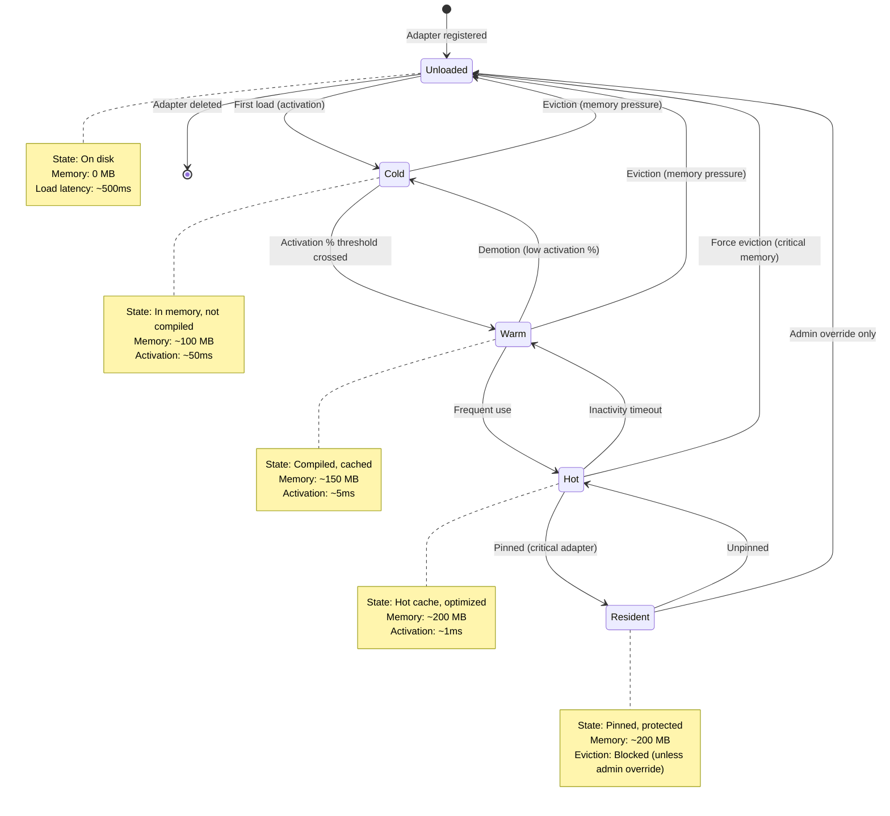

# Adapter Lifecycle State Machine

**Purpose:** Detailed documentation of adapter lifecycle states and transitions

**Last Updated:** 2025-01-19

---

## State Machine Diagram



---

## State Definitions

### Unloaded

**Characteristics:**
- Adapter on disk, not in memory
- Zero VRAM footprint
- Initial state after registration

**Load latency:** ~500ms (disk → memory → GPU)

**Transitions to:**
- `Cold` - First load request
- `[deleted]` - Adapter deletion

### Cold

**Characteristics:**
- Adapter in memory, not compiled for GPU
- Minimal VRAM usage (~100 MB)
- Awaiting first activation

**Activation latency:** ~50ms (compile → transfer to VRAM)

**Transitions to:**
- `Warm` - Activation % threshold crossed
- `Unloaded` - Memory pressure eviction

### Warm

**Characteristics:**
- Compiled and cached on GPU
- Moderate VRAM usage (~150 MB)
- Ready for inference

**Activation latency:** ~5ms (minimal overhead)

**Transitions to:**
- `Hot` - Frequent activation
- `Cold` - Demotion due to low activation %
- `Unloaded` - Memory pressure eviction

### Hot

**Characteristics:**
- Highly optimized, hot cache
- High VRAM usage (~200 MB)
- Frequently used adapter

**Activation latency:** ~1ms (hot path)

**Transitions to:**
- `Resident` - Manual pinning
- `Warm` - Inactivity timeout
- `Unloaded` - Critical memory pressure (force eviction)

### Resident

**Characteristics:**
- Pinned adapter (production-critical)
- High VRAM usage (~200 MB)
- Protected from automatic eviction

**Eviction:** Blocked unless admin override

**Transitions to:**
- `Hot` - Manual unpinning
- `Unloaded` - Admin override deletion

---

## Transition Triggers

### Promotion Triggers

| From | To | Trigger | Threshold |
|------|-----|---------|-----------|
| Unloaded | Cold | First load request | N/A |
| Cold | Warm | Activation % increased | >10% |
| Warm | Hot | High activation rate | >50% |
| Hot | Resident | Manual pinning | Admin action |

### Demotion Triggers

| From | To | Trigger | Threshold |
|------|-----|---------|-----------|
| Resident | Hot | Manual unpinning | Admin action |
| Hot | Warm | Inactivity timeout | 1 hour no use |
| Warm | Cold | Low activation % | <10% |
| Cold | Unloaded | Memory pressure | System-wide threshold |

### Eviction Triggers

**Priority order (lowest tier evicted first):**

1. **Cold** - Low priority, minimal impact
2. **Warm** - Moderate priority
3. **Hot** - High priority (only under critical memory pressure)
4. **Resident** - Protected (admin override required)

**Memory pressure thresholds:**
- Normal eviction: >85% VRAM usage
- Critical eviction: >95% VRAM usage

---

## Implementation

**Location:** `crates/adapteros-lora-lifecycle/src/lib.rs`

### LifecycleManager API

```rust
use adapteros_lora_lifecycle::LifecycleManager;

let manager = LifecycleManager::new_with_db(
    adapter_names,
    &policies,
    path,
    telemetry,
    k,
    db
);

// Auto-promote on router decision
manager.record_router_decision(&selected).await?;

// Auto-evict on memory pressure
manager.check_memory_pressure(total_mem, 0.85).await?;

// Manual state transitions
manager.load_adapter("adapter-id").await?;
manager.evict_adapter("adapter-id").await?;
```

### Telemetry Events

**Location:** `crates/adapteros-lora-lifecycle/src/lib.rs` lines 213-346

| Event Type | When Emitted | Metadata |
|------------|--------------|----------|
| `adapter_promoted` | State tier increased | adapter_id, old_tier, new_tier, activation_pct |
| `adapter_demoted` | State tier decreased | adapter_id, old_tier, new_tier, inactivity_duration_s |
| `adapter_evicted` | Adapter removed from memory | adapter_id, tier, memory_freed_mb, reason |
| `adapter_crash_detected` | Stale adapter recovered | adapter_id, last_seen, recovery_timestamp |

---

## Heartbeat Mechanism

**Purpose:** Detect and recover adapters that freeze/crash without updating state

### Components

**Database Schema (migration 0065):**
- `adapters.last_heartbeat` (INTEGER, Unix timestamp)
- `training_jobs.last_heartbeat` (INTEGER, Unix timestamp)
- Partial indexes for efficient queries
- Views: `stale_adapters`, `stale_training_jobs` (5-min threshold)

### Lifecycle Methods

```rust
// Update heartbeat (called periodically by adapter)
manager.heartbeat_adapter(&adapter_id).await?;

// Check for stale adapters
let stale_ids = manager.check_stale_adapters(300).await?;

// Auto-recover stale adapters (resets to unloaded)
let recovered = manager.recover_stale_adapters(300).await?;
```

### Server Integration

**Location:** `crates/adapteros-server/src/main.rs`

- Background task runs every 5 minutes
- Calls `db.recover_stale_adapters(300)` (300s = 5min threshold)
- Logs stale detection and recovery events
- Emits telemetry for audit trail

### Recovery Flow

1. Adapter sends periodic heartbeat via `heartbeat_adapter()`
2. Background task queries for adapters with `last_heartbeat < now - 300s`
3. Stale adapters reset to `unloaded` state, heartbeat cleared
4. Recovery logged to audit + telemetry bundles

### Complements `recover_from_crash()`

- **recover_from_crash():** Detects adapters stuck in "loading" state (5-min timeout)
- **Heartbeat recovery:** Detects frozen adapters in any state (no heartbeat)

---

## Memory Management Integration

### UMA Backpressure

**Location:** `crates/adapteros-lora-worker/src/memory.rs`

**UmaPressureMonitor** polls UMA stats every 5s:
- macOS: `vm_statistics64`
- Linux: `/proc/meminfo`

**Pressure levels:**
- Low: <30% usage
- Medium: 20-30% usage
- High: 15-20% usage
- Critical: <15% headroom

**Telemetry:** `uma.pressure` events with `usage_pct`, `headroom_pct`, `used_mb`, `total_mb`

### Tiered Eviction

**Integration:** `LifecycleManager::check_memory_pressure()`

**Location:** `crates/adapteros-lora-lifecycle/src/lib.rs` lines 1068-1128

```rust
pub async fn check_memory_pressure(&self, total_memory: usize, pressure_level: MemoryPressureLevel) -> Result<()> {
    // Step 1: Evict expired adapters first (regardless of memory pressure)
    if let Some(ref db) = self.db {
        if let Ok(expired) = db.find_expired_adapters().await {
            for exp in expired {
                self.evict_adapter(&exp.name).await?;
            }
        }
    }

    // Step 2: Check memory pressure for normal eviction
    match pressure_level {
        MemoryPressureLevel::High => {
            // Evict Extra (Warm/Cold)
        }
        MemoryPressureLevel::Critical => {
            // Evict Critical (Hot)
        }
        _ => {}
    }

    Ok(())
}
```

---

## Pinning Integration

**Purpose:** Prevent critical adapters from eviction

**Implementation:** `crates/adapteros-db/src/pinned_adapters.rs`

```rust
// Pin adapter (→ Resident state)
db.pin_adapter(tenant_id, adapter_id, Some("2025-12-31 23:59:59"), "production-critical", "ops@example.com").await?;

// Unpin adapter (→ Hot state)
db.unpin_adapter(tenant_id, adapter_id).await?;
```

**Delete Protection:**
- `Db::delete_adapter()` checks `active_pinned_adapters` view
- Returns `AosError::PolicyViolation` if active pins exist

**Location:** `crates/adapteros-db/src/adapters.rs:517-553`

---

## See Also

- [CLAUDE.md](../CLAUDE.md) - Developer quick reference
- [ARCHITECTURE_PATTERNS.md](ARCHITECTURE_PATTERNS.md) - Hot-swap and other patterns
- [PINNING_TTL.md](PINNING_TTL.md) - Pinning and TTL enforcement
- [DATABASE_REFERENCE.md](DATABASE_REFERENCE.md) - Schema reference
- [TELEMETRY_EVENTS.md](TELEMETRY_EVENTS.md) - Event catalog
