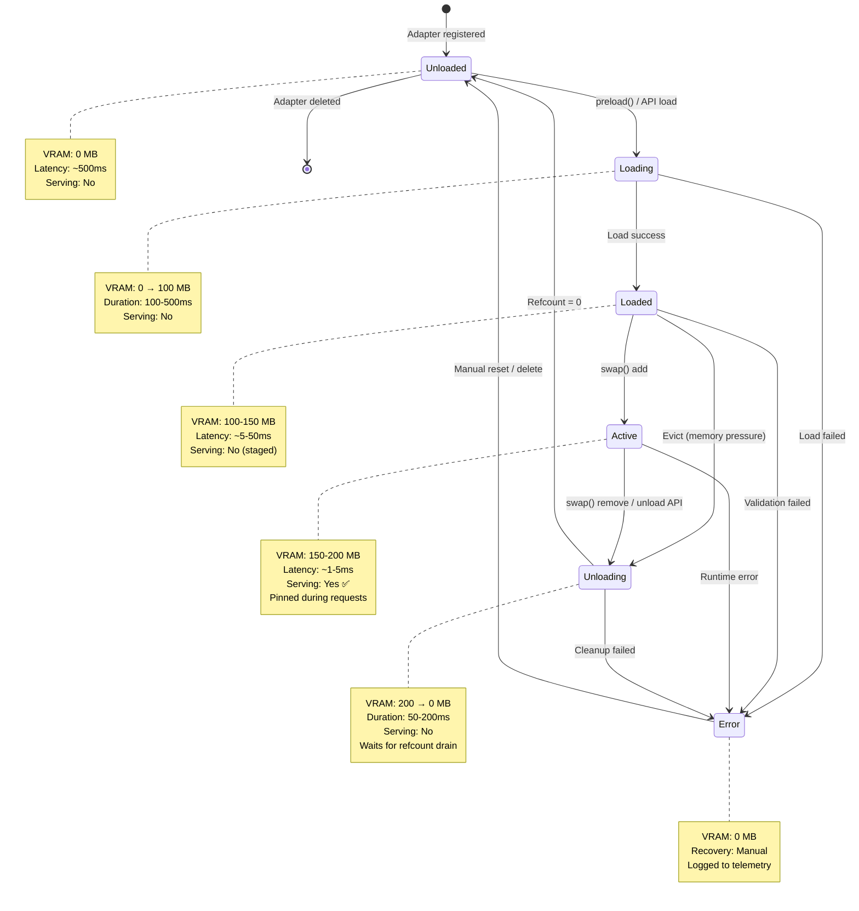
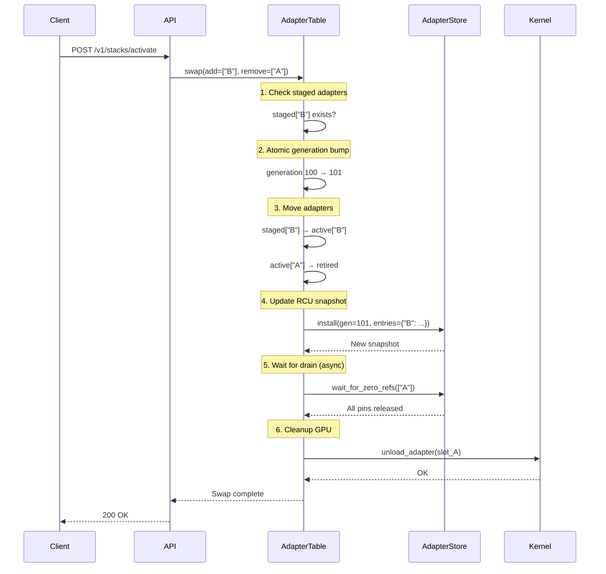
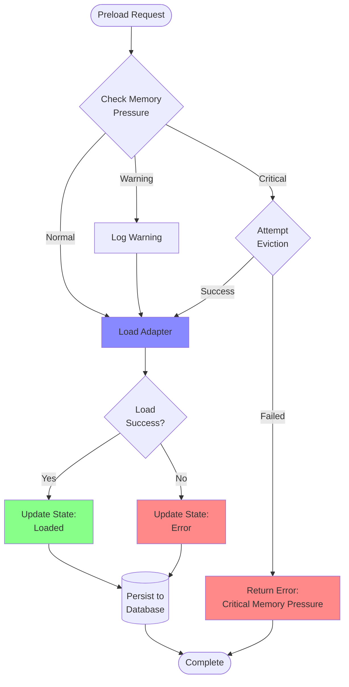

# Adapter Lifecycle States in AdapterOS

**Canonical reference for adapter and base model lifecycle management**

**Last Updated:** 2025-12-24

---

## Table of Contents

1. [Overview](#overview)
2. [Lifecycle States](#lifecycle-states)
3. [State Transitions](#state-transitions)
4. [Memory Implications](#memory-implications)
5. [Cold → Warm → Hot Progression](#cold--warm--hot-progression)
6. [Pinning and Lifecycle](#pinning-and-lifecycle)
7. [State Machine Diagram](#state-machine-diagram)
8. [Code Examples](#code-examples)
9. [Database Integration](#database-integration)
10. [Troubleshooting](#troubleshooting)

---

## Overview

AdapterOS manages the complete lifecycle of **base models** (Layer 1) and **adapters** (Layer 2) through a series of well-defined states. The lifecycle system ensures:

- **Memory efficiency**: Adapters are loaded only when needed
- **Performance optimization**: Hot paths minimize latency
- **Resource isolation**: Per-tenant memory quotas are enforced
- **Reliability**: State transitions are atomic and recoverable
- **Observability**: All transitions are logged and tracked in the database

### Key Components

| Component | Location | Purpose |
|-----------|----------|---------|
| **LifecycleState** | `crates/adapteros-lora-worker/src/lifecycle_state.rs` | Core state enum definition |
| **BaseModelState** | `crates/adapteros-lora-worker/src/base_model_state.rs` | Base model tracking |
| **AdapterTable** | `crates/adapteros-lora-worker/src/adapter_hotswap.rs` | Adapter hotswap coordination |
| **AdapterStore** | `crates/adapteros-core/src/adapter_store.rs` | RCU-style reference counting |
| **RequestPinner** | `crates/adapteros-lora-worker/src/request_pinner.rs` | RAII pinning guard |

---

## Lifecycle States

The `LifecycleState` enum defines the canonical progression for both base models and adapters:

```rust
#[derive(Debug, Clone, Copy, PartialEq, Eq, Serialize, Deserialize)]
pub enum LifecycleState {
    Unloaded,  // Not in memory
    Loading,   // Being loaded into memory
    Loaded,    // In memory, not yet active
    Active,    // Ready for inference
    Unloading, // Being removed from memory
    Error,     // Failed state
}
```

### State Definitions

#### 1. Unloaded

**Definition:** The adapter or base model is not loaded in GPU/system memory.

**Characteristics:**
- **VRAM usage:** 0 MB
- **Load latency:** ~500ms (disk I/O + decompression)
- **CPU overhead:** Initial parse of `.aos` format or SafeTensors
- **Serving capability:** ❌ Cannot serve requests

**Use cases:**
- Default state for newly registered adapters
- Adapters evicted due to memory pressure
- Cold storage for rarely-used adapters

**API Status Mapping:**
```rust
LifecycleState::Unloaded => ModelLoadStatus::NoModel
```

#### 2. Loading

**Definition:** The adapter/model is being loaded into memory but not yet ready.

**Characteristics:**
- **VRAM usage:** 0 MB → ~100 MB (partial allocation)
- **Duration:** 100-500ms depending on size
- **Operations:**
  - Reading `.aos` file from disk
  - Decompressing SafeTensors or Q15 weights
  - Allocating GPU buffers
  - Compiling Metal kernels (if CoreML)
- **Serving capability:** ❌ Cannot serve requests

**Failure modes:**
- Disk I/O errors → `LifecycleState::Error`
- Memory allocation failure → `LifecycleState::Error`
- Corrupt adapter file → `LifecycleState::Error`

**API Status Mapping:**
```rust
LifecycleState::Loading => ModelLoadStatus::Loading
```

#### 3. Loaded

**Definition:** The adapter is in memory and compiled, but not yet active in the serving stack.

**Characteristics:**
- **VRAM usage:** ~100-150 MB (depends on rank)
- **Activation latency:** ~5-50ms (swap into active set)
- **State:** Staged in `AdapterTable::staged` HashMap
- **Serving capability:** ❌ Not in active stack

**Use cases:**
- **Preloading:** Preparing adapters for future swap
- **Hot-standby:** Ready for immediate activation
- **Gradual migration:** Loading new version before swapping

**Transition to Active:**
```rust
// Atomic swap moves Loaded → Active
table.swap(&["new-adapter-id"], &["old-adapter-id"]).await?;
```

**API Status Mapping:**
```rust
LifecycleState::Loaded => ModelLoadStatus::Ready
```

#### 4. Active

**Definition:** The adapter is in the active serving stack and handling inference requests.

**Characteristics:**
- **VRAM usage:** ~150-200 MB (fully optimized)
- **Inference latency:** ~1-5ms per request
- **State:** Present in `AdapterTable::active` HashMap
- **Serving capability:** ✅ Can serve requests
- **Reference counting:** Pinned during active requests

**Optimizations:**
- Metal kernel pipeline cached
- LoRA weights resident in VRAM
- KV cache allocated and warmed
- Router gates precomputed

**Transition triggers:**
- **Incoming inference request** → Remains Active
- **Hot-swap command** → Active (new adapter) + Unloading (old adapter)
- **Memory pressure** → Unloading (if unpinned and idle)

**API Status Mapping:**
```rust
LifecycleState::Active => ModelLoadStatus::Ready
```

#### 5. Unloading

**Definition:** The adapter is being removed from memory in a coordinated shutdown.

**Characteristics:**
- **VRAM usage:** ~200 MB → 0 MB (gradual deallocation)
- **Duration:** 50-200ms (depends on refcount drain)
- **Operations:**
  - Wait for all in-flight requests to complete (RCU drain)
  - Decrement reference counts to zero
  - Release GPU buffers
  - Free system memory
- **Serving capability:** ❌ No longer accepts new requests

**Graceful shutdown:**
```rust
// New requests see swapped stack immediately
// Old requests continue with pinned snapshot
let pinned = pinner.pin()?; // Snapshot isolation
drop(pinned); // Decrements refcount when done
```

**Failure modes:**
- **Hung requests:** Timeout after 200ms, force cleanup
- **Memory leak:** GPU buffers not released → tracked via telemetry

**API Status Mapping:**
```rust
LifecycleState::Unloading => ModelLoadStatus::Unloading
```

#### 6. Error

**Definition:** The adapter encountered an unrecoverable error and cannot be used.

**Characteristics:**
- **VRAM usage:** 0 MB (cleaned up)
- **Error persistence:** Stored in database for debugging
- **Serving capability:** ❌ Cannot serve requests
- **Recovery:** Manual intervention required (reload or delete)

**Common error scenarios:**
- **Corrupt adapter file:** BLAKE3 hash mismatch
- **OOM during load:** Insufficient VRAM available
- **Kernel compilation failure:** Metal shader errors
- **Manifest mismatch:** Adapter incompatible with base model

**Error tracking:**
```rust
pub async fn mark_error(&mut self, error_message: String) -> Result<()> {
    self.update_status(LifecycleState::Error, Some(error_message), None).await
}
```

**API Status Mapping:**
```rust
LifecycleState::Error => ModelLoadStatus::Error
```

---

## State Transitions

### Valid Transition Paths

```
Unloaded → Loading → Loaded → Active → Unloading → Unloaded
   ↓          ↓         ↓        ↓         ↓
   └─────────→  Error  ←─────────┘─────────┘
```

### Transition Matrix

| From / To | Unloaded | Loading | Loaded | Active | Unloading | Error |
|-----------|----------|---------|--------|--------|-----------|-------|
| **Unloaded** | - | ✅ Load | ❌ | ❌ | ❌ | ✅ Corrupt file |
| **Loading** | ❌ | - | ✅ Success | ❌ | ❌ | ✅ Load failed |
| **Loaded** | ❌ | ❌ | - | ✅ Swap in | ✅ Evict | ✅ Validation failed |
| **Active** | ❌ | ❌ | ❌ | - | ✅ Swap out | ✅ Runtime error |
| **Unloading** | ✅ Cleanup done | ❌ | ❌ | ❌ | - | ✅ Cleanup failed |
| **Error** | ✅ Manual reset | ❌ | ❌ | ❌ | ❌ | - |

### Transition Triggers

#### 1. Unloaded → Loading

**Trigger:** Explicit preload command or stack activation

**Code path:**
```rust
// API: POST /v1/adapters/{adapter_id}/load
// Worker: AdapterTable::preload()
pub async fn preload(&self, id: String, hash: B3Hash, vram_mb: u64) -> Result<()> {
    // 1. Check memory pressure
    let pressure = memory_monitor.current_pressure_level().await;
    if pressure == MemoryPressureLevel::Critical {
        return Err(AosError::Worker("Critical memory pressure".into()));
    }

    // 2. Load adapter weights from disk
    let weights = load_adapter_file(&id, hash)?;

    // 3. Allocate GPU buffers
    let gpu_buffer = kernel.allocate_lora_buffer(vram_mb)?;

    // 4. Store in staged HashMap
    self.staged.write().insert(id, AdapterState {
        hash,
        vram_mb,
        loaded_at: Instant::now(),
        active: false,
        lifecycle: LifecycleState::Loaded,
    });

    Ok(())
}
```

**Failure recovery:** Transition to `Error` state, log to telemetry

#### 2. Loaded → Active

**Trigger:** Hot-swap command via `AdapterTable::swap()`

**Code path:**
```rust
// API: POST /v1/stacks/{stack_id}/activate
// Worker: AdapterTable::swap()
pub async fn swap(&self, add_ids: &[String], remove_ids: &[String]) -> Result<(i64, usize)> {
    // 1. Atomically update current_stack pointer
    let new_generation = self.next_generation();

    // 2. Move adapters: staged → active
    let mut active = self.active.write();
    let mut staged = self.staged.write();

    for id in add_ids {
        if let Some(mut state) = staged.remove(id) {
            state.active = true;
            state.lifecycle = LifecycleState::Active;
            active.insert(id.clone(), state);
        }
    }

    // 3. Update AdapterStore generation (RCU)
    let snapshot = self.store.install(new_generation, active_map);

    // 4. Retire old stack for cleanup
    self.retired_stacks.lock().await.push(old_stack);

    Ok((new_generation, active.len()))
}
```

**Atomicity guarantee:** Swap is lock-free for readers (RCU pattern)

#### 3. Active → Unloading

**Trigger:** Hot-swap removal, memory pressure, or manual unload

**Code path:**
```rust
// API: POST /v1/adapters/{adapter_id}/unload
// Worker: AdapterTable::swap() (remove_ids)
pub async fn swap(&self, add_ids: &[String], remove_ids: &[String]) -> Result<(i64, usize)> {
    // 1. Mark adapters as unloading
    for id in remove_ids {
        if let Some(mut state) = active.remove(id) {
            state.lifecycle = LifecycleState::Unloading;
            // Move to retired stack for RCU cleanup
        }
    }

    // 2. Wait for in-flight requests to drain
    self.wait_for_zero_refs(remove_ids, Duration::from_millis(200)).await?;

    // 3. Free GPU memory
    for id in remove_ids {
        kernel.unload_adapter(adapter_slot_id)?;
    }

    Ok(())
}
```

**Graceful drain:** Existing requests complete with pinned snapshot

#### 4. Unloading → Unloaded

**Trigger:** Reference count reaches zero

**Code path:**
```rust
// Background task: AdapterStore::drain_retired()
pub fn drain_retired(&self) -> Vec<u64> {
    let mut retired = self.retired.lock();
    let mut drained = Vec::new();

    retired.retain(|snapshot| {
        let in_use = snapshot.entries.values()
            .any(|record| record.refcount.load(Ordering::Acquire) > 0);

        if !in_use {
            drained.push(snapshot.generation);
            false // Remove from retired list
        } else {
            true // Keep waiting
        }
    });

    drained
}
```

**Cleanup actions:**
- GPU buffer deallocation
- System memory release
- Database status update

#### 5. Any State → Error

**Trigger:** Unrecoverable failure during any operation

**Error categories:**
1. **Disk I/O errors:** Corrupt file, missing weights
2. **Memory errors:** OOM, allocation failure
3. **Kernel errors:** Metal compilation failure
4. **Validation errors:** Hash mismatch, manifest incompatibility

**Persistence:**
```rust
pub async fn mark_error(&mut self, error_message: String) -> Result<()> {
    self.update_status(
        LifecycleState::Error,
        Some(error_message),
        None
    ).await?;

    // Log to telemetry for alerting
    telemetry.log_health_lifecycle(identity, payload);

    Ok(())
}
```

---

## Memory Implications

### VRAM Usage by State

| State | Typical VRAM (Rank 8) | Typical VRAM (Rank 32) | Components |
|-------|----------------------|------------------------|------------|
| **Unloaded** | 0 MB | 0 MB | - |
| **Loading** | 50-100 MB | 200-400 MB | Weights in transit |
| **Loaded** | 100-150 MB | 400-600 MB | Weights + buffers |
| **Active** | 150-200 MB | 600-800 MB | Weights + buffers + KV cache |
| **Unloading** | 100 → 0 MB | 400 → 0 MB | Gradual deallocation |
| **Error** | 0 MB | 0 MB | Cleaned up |

### Memory Pressure Handling

**Pressure levels:**
```rust
pub enum MemoryPressureLevel {
    Normal,   // < 70% VRAM usage
    Warning,  // 70-85% VRAM usage
    Critical, // > 85% VRAM usage
}
```

**Lifecycle response to pressure:**

#### Normal Pressure
- All state transitions allowed
- Preloading encouraged for hot-standby

#### Warning Pressure
- Preloading allowed but logged
- Background eviction of cold adapters
- KV cache quota enforcement tightened

#### Critical Pressure
- **Preloading blocked** with error:
  ```rust
  "Critical memory pressure detected, cannot preload adapter (requires ~{}MB)"
  ```
- Force unload unpinned adapters
- Reject new inference requests (backpressure)

**Eviction priority:**
1. Adapters in `Loaded` state (not active)
2. Adapters in `Active` state with zero refcount (idle)
3. Adapters with oldest `loaded_at` timestamp

**Code example:**
```rust
// Check memory pressure before preload
let pressure = self.memory_monitor.current_pressure_level().await;
if pressure == MemoryPressureLevel::Critical {
    return Err(AosError::Worker(format!(
        "Critical memory pressure detected, cannot preload adapter (requires ~{}MB)",
        vram_mb
    )));
}

// Attempt eviction if needed
if let Err(evict_err) = lifecycle.handle_memory_pressure(&profiler) {
    warn!(error = %evict_err, "Eviction failed during memory pressure");
}
```

---

## Cold → Warm → Hot Progression

AdapterOS uses a **thermal metaphor** to describe adapter activation performance:

### Cold Adapter (Unloaded)

**Latency:** ~500ms first-request latency

**Operations:**
1. Load `.aos` file from disk (~200ms)
2. Decompress SafeTensors weights (~100ms)
3. Allocate GPU buffers (~50ms)
4. Compile Metal kernels (~100ms)
5. Upload weights to VRAM (~50ms)

**Use case:** Rarely-used adapters, long-tail traffic

**Optimization:** Use preload API to transition to Warm

### Warm Adapter (Loaded)

**Latency:** ~5-50ms activation latency

**State:**
- Weights in VRAM
- Kernels compiled and cached
- Not in active serving stack

**Operations to activate:**
1. Atomic pointer swap (~1ms)
2. Update router gates (~2-10ms)
3. Allocate KV cache slot (~2-20ms)

**Use case:** Hot-standby for predictable traffic spikes

**Optimization:** Include in active stack to transition to Hot

### Hot Adapter (Active)

**Latency:** ~1-5ms per-request overhead

**State:**
- Weights resident in VRAM
- KV cache warmed
- Router gates precomputed
- Active in serving stack

**Operations per request:**
1. Pin snapshot (~0.1ms)
2. Route request (~0.5ms)
3. Apply LoRA layer (~1-3ms)
4. Unpin snapshot (~0.1ms)

**Use case:** High-throughput production traffic

**Optimization:** Use pinning to prevent eviction

### State Diagram: Cold → Warm → Hot

```
┌─────────────────────────────────────────────────────────────┐
│                     Lifecycle Progression                    │
└─────────────────────────────────────────────────────────────┘

    Unloaded             Loaded              Active
   (Cold 🧊)           (Warm 🌡️)          (Hot 🔥)
       │                   │                  │
       │  preload()        │   swap()         │
       │  ~500ms           │   ~5-50ms        │  inference
       ├──────────────────→│──────────────────→│  ~1-5ms
       │                   │                  │
       │                   │                  │  pinned
       │                   │                  │  (protected)
       │                   │                  │
       │   evict()         │   swap_out()     │
       │←──────────────────┤←─────────────────┤
       │   memory          │   memory         │
       │   pressure        │   pressure       │
```

### Transition Performance

| Transition | Latency | Blocking? | Reversible? |
|------------|---------|-----------|-------------|
| Cold → Warm | 500ms | Yes (async) | Yes (evict) |
| Warm → Hot | 5-50ms | No (atomic) | Yes (swap) |
| Hot → Warm | 2-10ms | No (atomic) | Yes (swap) |
| Warm → Cold | 50-200ms | Yes (drain) | Yes (preload) |

---

## Pinning and Lifecycle

**Pinning** is a reference-counting mechanism that prevents adapters from being evicted during active requests.

### RequestPinner: RAII Guard

```rust
/// Pins the current adapter snapshot for the duration of a request.
pub struct RequestPinner {
    table: Arc<AdapterTable>,
}

/// RAII guard that holds adapter pins until dropped.
pub struct PinnedRequest {
    pins: AdapterPins,
    stack: Arc<Stack>,
    stack_hash: B3Hash,
}
```

### Pin Lifecycle

```
Request Arrives
     │
     ├──> RequestPinner::pin()
     │       ├── Snapshot current stack
     │       ├── Increment refcounts (AdapterStore)
     │       └── Return PinnedRequest guard
     │
     ├──> Process inference request
     │       ├── Adapters guaranteed resident
     │       └── Snapshot isolation (no mid-request swaps)
     │
     └──> PinnedRequest dropped (RAII)
             ├── Decrement refcounts
             └── Allow adapter eviction if refcount == 0
```

### Code Example: Pinning in Action

```rust
// Before inference request
let pinner = RequestPinner::new(adapter_table.clone());
let pinned = pinner.pin()?; // Snapshot + increment refcounts

// Process request with snapshot isolation
let stack = pinned.stack();
let result = process_inference(stack, input).await?;

// RAII cleanup: refcounts decremented automatically
drop(pinned);
```

### Snapshot Isolation Guarantees

**Scenario:** Hot-swap occurs during an in-flight request

```rust
// Request 1: Pin old stack (generation 100)
let pinned_old = pinner.pin()?; // Sees adapter A

// Admin: Swap adapter A → B (generation 101)
adapter_table.swap(&["B"], &["A"]).await?;

// Request 2: Pin new stack (generation 101)
let pinned_new = pinner.pin()?; // Sees adapter B

// Request 1 continues with adapter A (isolated snapshot)
// Request 2 uses adapter B (new snapshot)
// No cross-contamination!
```

**Test coverage:**
- `swap_waits_until_pins_released()` - Verifies RCU drain
- `swap_only_affects_new_requests()` - Verifies snapshot isolation

### Pinning and Memory Pressure

**Question:** What happens if pinned adapters exceed VRAM capacity?

**Answer:** Pinning provides **soft protection**, not hard guarantees:

1. **Normal pressure:** Pinned adapters are never evicted
2. **Warning pressure:** Background cleanup of unpinned adapters
3. **Critical pressure:**
   - New preloads **blocked**
   - Unpinned adapters **force evicted**
   - Pinned adapters **remain resident** (may cause OOM)

**OOM mitigation:**
- Per-tenant KV cache quotas (`crates/adapteros-lora-worker/src/kv_quota.rs`)
- Configurable max concurrent requests
- Circuit breaker for cascading failures

### Permanent Pinning (Future Feature)

**API (planned):**
```bash
# Pin adapter to prevent eviction
aosctl pin-adapter --id my-critical-adapter

# Unpin adapter to allow eviction
aosctl unpin-adapter --id my-critical-adapter
```

**Use cases:**
- Critical production adapters
- SLA-guaranteed latency (no cold starts)
- Regulatory compliance (always available)

---

## State Machine Diagram

### Full Lifecycle State Machine



### Hot-Swap State Machine



### Memory Pressure Response



---

## Code Examples

### Example 1: Adapter Preload (Unloaded → Loaded)

```rust
use adapteros_lora_worker::adapter_hotswap::AdapterTable;
use adapteros_core::B3Hash;
use std::sync::Arc;

async fn preload_adapter_example() -> Result<()> {
    // Initialize adapter table
    let table = Arc::new(AdapterTable::new());

    // Define adapter identity
    let adapter_id = "my-code-review-adapter".to_string();
    let adapter_hash = B3Hash::hash(b"adapter-weights-content");
    let vram_mb = 150; // Estimated VRAM usage

    // Preload adapter into staging area
    table.preload(adapter_id.clone(), adapter_hash, vram_mb).await?;

    // Adapter is now in Loaded state (staged, not active)
    println!("Adapter {} preloaded successfully", adapter_id);

    Ok(())
}
```

**Expected behavior:**
- State transition: `Unloaded` → `Loading` → `Loaded`
- Adapter stored in `table.staged` HashMap
- VRAM allocated but adapter not serving requests

---

### Example 2: Hot-Swap (Loaded → Active)

```rust
async fn hotswap_adapters_example() -> Result<()> {
    let table = Arc::new(AdapterTable::new());

    // Preload two adapters
    let adapter_a_hash = B3Hash::hash(b"adapter-a");
    let adapter_b_hash = B3Hash::hash(b"adapter-b");

    table.preload("adapter-a".to_string(), adapter_a_hash, 150).await?;
    table.preload("adapter-b".to_string(), adapter_b_hash, 150).await?;

    // Activate adapter-a (Loaded → Active)
    table.swap(&["adapter-a".to_string()], &[]).await?;

    // Hot-swap: replace adapter-a with adapter-b
    let (generation, active_count) = table
        .swap(
            &["adapter-b".to_string()], // Add to active set
            &["adapter-a".to_string()], // Remove from active set
        )
        .await?;

    println!("Swap complete: generation={}, active_count={}", generation, active_count);

    Ok(())
}
```

**Guarantees:**
- **Atomic swap:** New requests see `adapter-b` immediately
- **Snapshot isolation:** In-flight requests with `adapter-a` complete normally
- **Graceful cleanup:** `adapter-a` cleaned up after refcount drains

---

### Example 3: Pinning for Snapshot Isolation

```rust
use adapteros_lora_worker::request_pinner::RequestPinner;

async fn inference_with_pinning_example() -> Result<()> {
    let table = Arc::new(AdapterTable::new());

    // Setup: preload and activate adapter
    let adapter_hash = B3Hash::hash(b"adapter-v1");
    table.preload("my-adapter".to_string(), adapter_hash, 150).await?;
    table.swap(&["my-adapter".to_string()], &[]).await?;

    // Create request pinner
    let pinner = RequestPinner::new(table.clone());

    // Pin current stack snapshot
    let pinned = pinner.pin()?;
    let stack = pinned.stack();

    println!("Pinned generation: {}", pinned.generation());
    println!("Stack hash: {:?}", pinned.stack_hash());

    // Process inference request with guaranteed adapter residency
    let result = process_inference(stack, "What is Rust?").await?;

    // RAII cleanup: refcounts decremented automatically
    drop(pinned);

    Ok(())
}

async fn process_inference(stack: &Arc<Stack>, input: &str) -> Result<String> {
    // Adapter guaranteed to remain in VRAM during this call
    // Even if hot-swap occurs, this request uses the pinned snapshot
    Ok(format!("Inference result for: {}", input))
}
```

**Test scenario: Concurrent swap**
```rust
// Request 1: Pin old stack
let pinned_old = pinner.pin()?;

// Admin swaps adapter mid-request
tokio::spawn(async {
    table.swap(&["new-adapter"], &["old-adapter"]).await
});

// Request 1 continues with old adapter (snapshot isolation)
let result = process_inference(pinned_old.stack(), input).await?;
```

---

### Example 4: Base Model State Tracking

```rust
use adapteros_lora_worker::base_model_state::BaseModelState;
use adapteros_db::Db;
use std::sync::Arc;

async fn base_model_lifecycle_example() -> Result<()> {
    let db = Arc::new(Db::open_in_memory()?);
    let tenant_id = "tenant-prod".to_string();
    let model_id = "qwen2.5-7b-instruct".to_string();

    // Create base model state tracker
    let mut base_model = BaseModelState::new(model_id.clone(), tenant_id.clone(), db.clone());

    // Transition: Unloaded → Loading
    base_model.mark_loading().await?;

    // Simulate model loading (500ms)
    tokio::time::sleep(tokio::time::Duration::from_millis(500)).await;

    // Transition: Loading → Active
    let memory_usage_mb = 4096; // 4GB model
    base_model.mark_loaded(memory_usage_mb).await?;

    // Query status
    assert!(base_model.is_loaded());
    assert_eq!(base_model.lifecycle(), LifecycleState::Active);
    assert_eq!(base_model.memory_usage_mb(), Some(memory_usage_mb));

    // Graceful shutdown: Active → Unloading → Unloaded
    base_model.mark_unloading().await?;
    tokio::time::sleep(tokio::time::Duration::from_millis(100)).await;
    base_model.mark_unloaded().await?;

    assert!(!base_model.is_loaded());

    Ok(())
}
```

**Database persistence:**
```sql
-- Auto-persisted on each state change
UPDATE base_model_status
SET status = 'ready',
    memory_usage_mb = 4096,
    loaded_at = datetime('now')
WHERE tenant_id = 'tenant-prod';
```

---

### Example 5: Error Handling and Recovery

```rust
async fn error_handling_example() -> Result<()> {
    let table = Arc::new(AdapterTable::new());
    let adapter_id = "corrupt-adapter".to_string();
    let adapter_hash = B3Hash::hash(b"invalid-hash");

    // Attempt to preload corrupt adapter
    match table.preload(adapter_id.clone(), adapter_hash, 150).await {
        Ok(_) => {
            unreachable!("Should fail with corrupt file");
        }
        Err(e) => {
            // Log error to telemetry
            eprintln!("Preload failed: {}", e);

            // Transition to Error state (handled internally)
            // State: Unloaded → Loading → Error
        }
    }

    // Check error state in database
    let db = Arc::new(Db::open_in_memory()?);
    if let Some(status) = db.get_adapter_status(&adapter_id).await? {
        assert_eq!(status.lifecycle, "error");
        assert!(status.error_message.is_some());
        println!("Error: {}", status.error_message.unwrap());
    }

    Ok(())
}
```

**Common error codes:**
- `AosError::Worker("Critical memory pressure")` - OOM during preload
- `AosError::InvalidAdapter("BLAKE3 mismatch")` - Corrupt file
- `AosError::Kernel("Metal compilation failed")` - GPU error

---

### Example 6: Memory Pressure Response

```rust
use adapteros_memory::MemoryMonitor;

async fn memory_pressure_example() -> Result<()> {
    let table = Arc::new(AdapterTable::new());
    let memory_monitor = MemoryMonitor::new();

    // Simulate critical memory pressure
    let pressure = memory_monitor.current_pressure_level().await;

    if pressure == MemoryPressureLevel::Critical {
        eprintln!("Critical memory pressure detected!");

        // Attempt eviction of idle adapters
        let evicted = table.evict_idle_adapters().await?;
        println!("Evicted {} adapters", evicted.len());

        // Retry preload after eviction
        let adapter_hash = B3Hash::hash(b"new-adapter");
        match table.preload("new-adapter".to_string(), adapter_hash, 150).await {
            Ok(_) => println!("Preload succeeded after eviction"),
            Err(e) => eprintln!("Preload still failed: {}", e),
        }
    }

    Ok(())
}
```

---

## Database Integration

### Schema: adapter_lifecycle_history

```sql
CREATE TABLE adapter_lifecycle_history (
    id INTEGER PRIMARY KEY AUTOINCREMENT,
    tenant_id TEXT NOT NULL,
    adapter_id TEXT NOT NULL,
    from_state TEXT NOT NULL,
    to_state TEXT NOT NULL,
    trigger TEXT, -- 'preload', 'swap', 'evict', 'error'
    error_message TEXT,
    memory_usage_mb INTEGER,
    transitioned_at TEXT DEFAULT (datetime('now')),

    FOREIGN KEY (tenant_id, adapter_id)
        REFERENCES adapters(tenant_id, adapter_id)
        ON DELETE CASCADE
);

CREATE INDEX idx_adapter_lifecycle_history_adapter
    ON adapter_lifecycle_history(tenant_id, adapter_id, transitioned_at);
```

### Schema: adapters (current state)

```sql
CREATE TABLE adapters (
    tenant_id TEXT NOT NULL,
    adapter_id TEXT NOT NULL,
    name TEXT,
    hash_b3 TEXT NOT NULL,
    rank INTEGER,
    current_state TEXT DEFAULT 'unloaded', -- LifecycleState enum
    memory_bytes INTEGER,
    loaded_at TEXT,
    error_message TEXT,
    created_at TEXT DEFAULT (datetime('now')),
    updated_at TEXT DEFAULT (datetime('now')),

    PRIMARY KEY (tenant_id, adapter_id)
);
```

### Triggers: Automatic Lifecycle Logging

```sql
CREATE TRIGGER adapter_lifecycle_logger
AFTER UPDATE OF current_state ON adapters
WHEN NEW.current_state != OLD.current_state
BEGIN
    INSERT INTO adapter_lifecycle_history (
        tenant_id, adapter_id, from_state, to_state, memory_usage_mb
    ) VALUES (
        NEW.tenant_id,
        NEW.adapter_id,
        OLD.current_state,
        NEW.current_state,
        NEW.memory_bytes / (1024 * 1024)
    );
END;
```

### Query Examples

**Find all adapters currently in Active state:**
```sql
SELECT adapter_id, name, memory_bytes, loaded_at
FROM adapters
WHERE tenant_id = 'tenant-prod'
  AND current_state = 'active'
ORDER BY loaded_at DESC;
```

**Lifecycle history for debugging:**
```sql
SELECT
    from_state,
    to_state,
    trigger,
    error_message,
    transitioned_at
FROM adapter_lifecycle_history
WHERE tenant_id = 'tenant-prod'
  AND adapter_id = 'my-adapter'
ORDER BY transitioned_at DESC
LIMIT 20;
```

**Memory usage over time:**
```sql
SELECT
    to_state,
    AVG(memory_usage_mb) as avg_memory_mb,
    COUNT(*) as transition_count
FROM adapter_lifecycle_history
WHERE tenant_id = 'tenant-prod'
  AND transitioned_at > datetime('now', '-1 day')
GROUP BY to_state;
```

---

## Troubleshooting

### Issue 1: Adapter Stuck in Loading State

**Symptoms:**
- Adapter shows `current_state = 'loading'` in database
- API requests hang indefinitely
- No error message logged

**Root causes:**
1. Disk I/O timeout (slow NFS mount)
2. GPU allocation deadlock
3. Metal kernel compilation timeout

**Diagnosis:**
```bash
# Check adapter state
aosctl adapter status --id my-adapter

# Check recent lifecycle transitions
sqlite3 ~/.adapteros/data.db \
  "SELECT * FROM adapter_lifecycle_history
   WHERE adapter_id = 'my-adapter'
   ORDER BY transitioned_at DESC LIMIT 5;"

# Check worker logs
tail -f ~/.adapteros/logs/aos-worker.log | grep "my-adapter"
```

**Resolution:**
```bash
# Force transition to error state
aosctl adapter reset --id my-adapter

# Delete and re-register adapter
aosctl adapter delete --id my-adapter
aosctl adapter register --id my-adapter --file ./my-adapter.aos
```

---

### Issue 2: Memory Pressure Prevents Preload

**Symptoms:**
- Preload fails with error: `"Critical memory pressure detected"`
- VRAM usage above 85%
- Other adapters remain active

**Diagnosis:**
```bash
# Check memory usage
aosctl system memory

# List all active adapters
aosctl adapter list --filter state=active --sort-by memory_desc

# Check memory pressure level
curl http://localhost:8080/v1/system/memory | jq .pressure_level
```

**Resolution:**
```bash
# Manually unload idle adapters
aosctl adapter unload --id idle-adapter-1
aosctl adapter unload --id idle-adapter-2

# Or force eviction of all unpinned adapters
aosctl system evict-idle

# Retry preload
aosctl adapter preload --id my-adapter
```

---

### Issue 3: Hot-Swap Refcount Drain Timeout

**Symptoms:**
- Swap command times out after 200ms
- Old adapter stuck in `unloading` state
- Error: `"Adapter stack changed while pinning request"`

**Root cause:** Long-running inference request holding refcount

**Diagnosis:**
```bash
# Check refcount status
curl http://localhost:8080/v1/system/refcounts | jq .

# Check active requests
curl http://localhost:8080/v1/system/requests | jq '.active | length'
```

**Resolution:**
```bash
# Wait for in-flight requests to complete
sleep 5

# Retry swap
aosctl stack activate --stack-id my-stack

# If persistent, force cleanup (risk: abort in-flight requests)
aosctl adapter force-unload --id stuck-adapter
```

---

### Issue 4: Adapter Error State After Failed Load

**Symptoms:**
- Adapter in `current_state = 'error'`
- Error message: `"BLAKE3 hash mismatch"`
- Cannot transition to any other state

**Diagnosis:**
```sql
SELECT adapter_id, error_message, updated_at
FROM adapters
WHERE current_state = 'error';
```

**Resolution:**
```bash
# Verify adapter file integrity
b3sum ~/.adapteros/adapters/my-adapter.aos

# Re-download or rebuild adapter
aosctl adapter train --dataset ./data.jsonl --output my-adapter.aos

# Delete and re-register
aosctl adapter delete --id my-adapter
aosctl adapter register --id my-adapter --file ./my-adapter.aos
```

---

## References

### Source Files

| File | Purpose |
|------|---------|
| `crates/adapteros-lora-worker/src/lifecycle_state.rs` | Core LifecycleState enum |
| `crates/adapteros-lora-worker/src/base_model_state.rs` | Base model tracking |
| `crates/adapteros-lora-worker/src/adapter_hotswap.rs` | AdapterTable hotswap logic |
| `crates/adapteros-core/src/adapter_store.rs` | RCU reference counting |
| `crates/adapteros-lora-worker/src/request_pinner.rs` | Snapshot pinning |
| `tests/e2e_adapter_lifecycle.rs` | E2E lifecycle tests |

### Related Documentation

- [Architecture Overview](./ARCHITECTURE.md) - System design and components
- [API Reference](./API_REFERENCE.md) - REST API endpoints
- [Training Guide](./TRAINING.md) - Adapter training workflow
- [Memory Management](./MEMORY.md) - VRAM quotas and pressure handling
- [Troubleshooting Guide](./TROUBLESHOOTING.md) - Common issues

### Migration Notes (0075_lifecycle_state_transition_triggers.sql)

```sql
-- Trigger to enforce valid lifecycle transitions
CREATE TRIGGER enforce_lifecycle_transitions
BEFORE UPDATE OF current_state ON adapters
BEGIN
    SELECT CASE
        -- Unloaded can only transition to Loading or Error
        WHEN OLD.current_state = 'unloaded' AND NEW.current_state NOT IN ('loading', 'error')
        THEN RAISE(ABORT, 'Invalid transition: unloaded can only go to loading or error')

        -- Loading can only transition to Loaded or Error
        WHEN OLD.current_state = 'loading' AND NEW.current_state NOT IN ('loaded', 'error')
        THEN RAISE(ABORT, 'Invalid transition: loading can only go to loaded or error')

        -- Loaded can transition to Active, Unloading, or Error
        WHEN OLD.current_state = 'loaded' AND NEW.current_state NOT IN ('active', 'unloading', 'error')
        THEN RAISE(ABORT, 'Invalid transition: loaded can only go to active, unloading, or error')

        -- Active can transition to Unloading or Error
        WHEN OLD.current_state = 'active' AND NEW.current_state NOT IN ('unloading', 'error')
        THEN RAISE(ABORT, 'Invalid transition: active can only go to unloading or error')

        -- Unloading can only transition to Unloaded or Error
        WHEN OLD.current_state = 'unloading' AND NEW.current_state NOT IN ('unloaded', 'error')
        THEN RAISE(ABORT, 'Invalid transition: unloading can only go to unloaded or error')

        -- Error can only transition to Unloaded (manual reset)
        WHEN OLD.current_state = 'error' AND NEW.current_state != 'unloaded'
        THEN RAISE(ABORT, 'Invalid transition: error can only go to unloaded (manual reset)')
    END;
END;
```

---

**Document Version:** 1.0
**Last Updated:** 2025-12-24
**Maintained By:** AdapterOS Core Team
