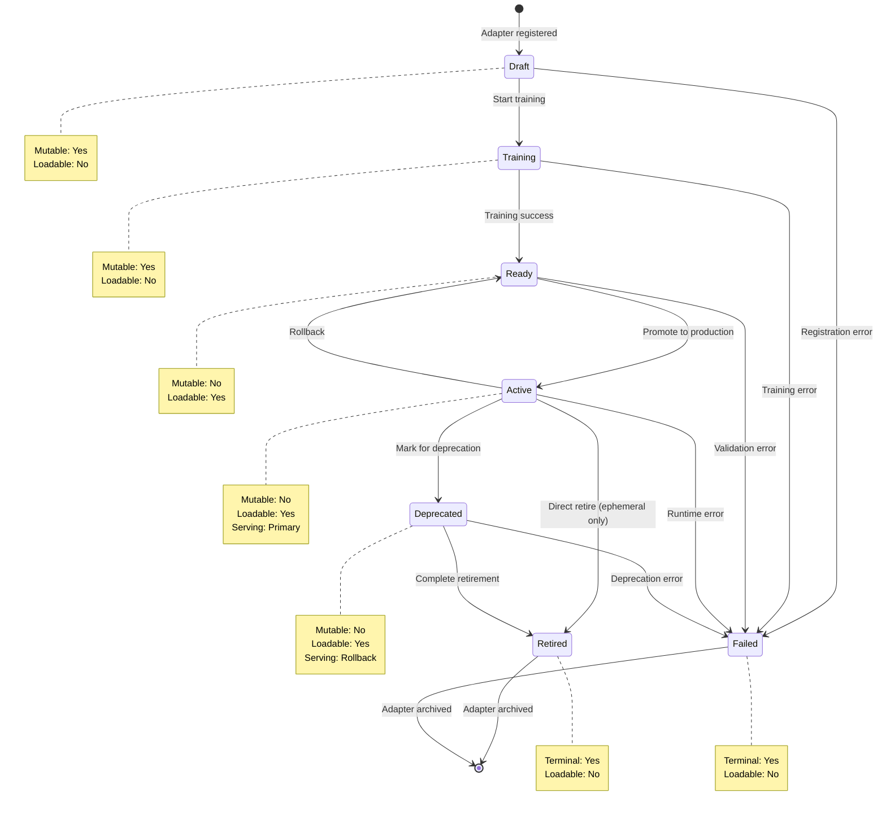
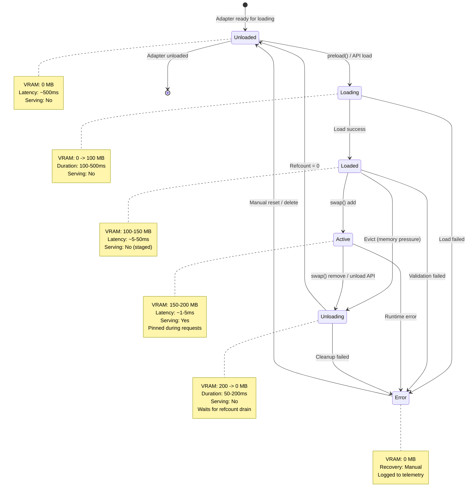
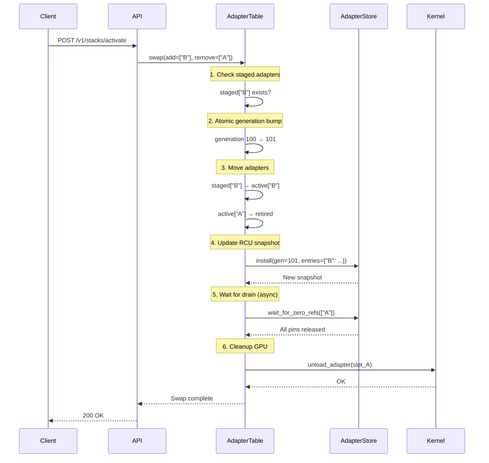

# Adapter Lifecycle States in AdapterOS

**Canonical reference for adapter and base model lifecycle management**

**Last Updated:** 2025-12-29

---

## Table of Contents

1. [Overview](#overview)
2. [Two Lifecycle Systems](#two-lifecycle-systems)
3. [Business Lifecycle States](#business-lifecycle-states)
4. [Runtime Lifecycle States](#runtime-lifecycle-states)
5. [State Transitions](#state-transitions)
6. [Memory Implications](#memory-implications)
7. [Unloaded → Loaded → Active Progression](#unloaded--loaded--active-progression)
8. [Pinning and Lifecycle](#pinning-and-lifecycle)
9. [State Machine Diagram](#state-machine-diagram)
10. [Code Examples](#code-examples)
11. [Database Integration](#database-integration)
12. [Troubleshooting](#troubleshooting)

---

## Overview

AdapterOS manages the complete lifecycle of **base models** (Layer 1) and **adapters** (Layer 2) through two complementary lifecycle systems:

1. **Business Lifecycle** - Tracks the maturity and availability of adapters from creation through retirement
2. **Runtime Lifecycle** - Tracks the memory/GPU state of adapters for hot-swap and inference

The lifecycle systems ensure:

- **Memory efficiency**: Adapters are loaded only when needed
- **Performance optimization**: Hot paths minimize latency
- **Resource isolation**: Per-tenant memory quotas are enforced
- **Reliability**: State transitions are atomic and recoverable
- **Observability**: All transitions are logged and tracked in the database
- **Version control**: Semantic versioning tracks adapter evolution
- **Tier-specific rules**: Ephemeral, warm, and persistent adapters have different lifecycle paths

### Key Components

| Component | Location | Purpose |
|-----------|----------|---------|
| **LifecycleState (Business)** | `crates/adapteros-core/src/lifecycle.rs` | Business lifecycle enum (7 states) |
| **LifecycleState (Runtime)** | `crates/adapteros-lora-worker/src/lifecycle_state.rs` | Runtime/memory lifecycle enum (6 states) |
| **LifecycleTransition** | `crates/adapteros-core/src/lifecycle.rs` | Validates business state transitions |
| **BaseModelState** | `crates/adapteros-lora-worker/src/base_model_state.rs` | Base model tracking |
| **AdapterTable** | `crates/adapteros-lora-worker/src/adapter_hotswap.rs` | Adapter hotswap coordination |
| **AdapterStore** | `crates/adapteros-core/src/adapter_store.rs` | RCU-style reference counting |
| **RequestPinner** | `crates/adapteros-lora-worker/src/request_pinner.rs` | RAII pinning guard |
| **Lifecycle DB** | `crates/adapteros-db/src/lifecycle.rs` | Database transition operations |
| **SQL Triggers** | `migrations/0075_lifecycle_state_transition_triggers.sql` | Database-level state machine enforcement |

---

## Two Lifecycle Systems

AdapterOS uses two distinct but complementary lifecycle systems:

### Business Lifecycle (Adapter Maturity)

Tracks the **development and deployment maturity** of an adapter:

```
Draft → Training → Ready → Active → Deprecated → Retired
                     ↘         ↘  ↖ (rollback)
                      └──────────► Failed
```

**Location:** `crates/adapteros-core/src/lifecycle.rs`

**Use cases:**
- Version control and promotion workflows
- Training pipeline integration
- Deprecation and retirement policies
- Audit trails for adapter changes

### Runtime Lifecycle (Memory State)

Tracks the **GPU/memory state** of an adapter for serving:

```
Unloaded → Loading → Loaded → Active → Unloading → Unloaded
    ↓          ↓         ↓        ↓         ↓
    └─────────→  Error  ←─────────┘─────────┘
```

**Location:** `crates/adapteros-lora-worker/src/lifecycle_state.rs`

**Use cases:**
- Hot-swap coordination
- Memory pressure handling
- Inference request routing
- VRAM allocation tracking

### Relationship Between Systems

| Business State | Can Be Loaded? | Typical Runtime State |
|---------------|---------------|----------------------|
| Draft | No | N/A (not loadable) |
| Training | No | N/A (training in progress) |
| Ready | Yes | Unloaded or Loaded (staged) |
| Active | Yes | Loaded or Active (serving) |
| Deprecated | Yes | Active (still routable) |
| Retired | No | Unloaded (cleaned up) |
| Failed | No | N/A (not loadable) |

---

## Business Lifecycle States

The business lifecycle enum (`adapteros_core::lifecycle::LifecycleState`) defines adapter maturity:

```rust
#[derive(Debug, Clone, Copy, PartialEq, Eq, Hash, Serialize, Deserialize)]
#[serde(rename_all = "lowercase")]
pub enum LifecycleState {
    Draft,       // Under development, .aos missing or incomplete
    Training,    // Training job running
    Ready,       // .aos uploaded, hash verified, basic validation passed
    Active,      // Production-ready and available for use
    Deprecated,  // Still functional but discouraged, migration recommended
    Retired,     // No longer available, cannot be loaded
    Failed,      // Training or validation failed; not routable
}
```

### State Definitions

#### 1. Draft

**Definition:** Adapter version created; `.aos` file missing or incomplete.

**Characteristics:**
- **Loadable:** No
- **Mutable:** Yes (weights can be modified)
- **Serving capability:** Cannot serve requests

**Use cases:**
- New adapter registration
- Work-in-progress development
- Pre-training configuration

**Valid transitions:** Draft → Training, Draft → Failed

#### 2. Training

**Definition:** Training job is actively running for this adapter.

**Characteristics:**
- **Loadable:** No
- **Mutable:** Yes (training in progress)
- **Serving capability:** Cannot serve requests

**Use cases:**
- Active LoRA fine-tuning
- Dataset processing
- Hyperparameter optimization

**Valid transitions:** Training → Ready, Training → Failed

#### 3. Ready

**Definition:** Artifact uploaded and validated; ready for activation.

**Characteristics:**
- **Loadable:** Yes (can be preloaded)
- **Mutable:** No (artifact is immutable)
- **Serving capability:** Can serve requests if loaded

**Requirements to enter Ready:**
- `.aos` file path must be set
- `.aos` file hash must be verified
- `content_hash_b3` must be computed (BLAKE3 of manifest + canonical weights)
- `manifest_hash` must be computed (BLAKE3 of manifest bytes)

> **Note:** Adapters registered before hash fields were mandatory may be blocked
> from activation. Use `aosctl adapter repair-hashes` to compute missing hashes.

**Valid transitions:** Ready → Active, Ready → Failed

#### 4. Active

**Definition:** Production-ready and available for routing.

**Characteristics:**
- **Loadable:** Yes
- **Mutable:** No
- **Serving capability:** Primary serving state

**Requirements to enter Active:**
- All Ready requirements met
- Training snapshot/metrics evidence exists
- Unique per (repo_id, branch) for codebase adapters

**Valid transitions:** Active → Deprecated, Active → Ready (rollback), Active → Retired (ephemeral only), Active → Failed

#### 5. Deprecated

**Definition:** Still functional but discouraged; migration recommended.

**Characteristics:**
- **Loadable:** Yes (for rollback scenarios)
- **Mutable:** No
- **Serving capability:** Can serve requests (for rollback)

**Use cases:**
- Graceful migration to newer versions
- Rollback availability window
- End-of-life announcements

**Tier restriction:** Ephemeral adapters cannot be deprecated (must go directly to Retired)

**Valid transitions:** Deprecated → Retired, Deprecated → Failed

#### 6. Retired

**Definition:** No longer available; cannot be loaded.

**Characteristics:**
- **Loadable:** No
- **Mutable:** No
- **Serving capability:** Cannot serve requests
- **Terminal state:** No transitions out

**Use cases:**
- End-of-life adapters
- Audit record preservation
- Storage cleanup candidates

**Valid transitions:** None (terminal state)

#### 7. Failed

**Definition:** Training or validation failed; not routable.

**Characteristics:**
- **Loadable:** No
- **Mutable:** No
- **Serving capability:** Cannot serve requests
- **Terminal state:** No transitions out

**Common failure scenarios:**
- Training job failure
- Validation errors
- Corrupt artifact detection
- Policy violations

**Valid transitions:** None (terminal state)

### Tier-Specific Rules

```rust
impl LifecycleState {
    /// Ephemeral adapters cannot be deprecated
    pub fn is_valid_for_tier(&self, tier: &str) -> bool {
        match (self, tier) {
            (LifecycleState::Deprecated, "ephemeral") => false,
            _ => true,
        }
    }
}
```

| Tier | Can Deprecated? | Typical Path |
|------|-----------------|--------------|
| Ephemeral | No | Active → Retired |
| Warm | Yes | Active → Deprecated → Retired |
| Persistent | Yes | Active → Deprecated → Retired |

---

### Codebase Adapter Constraints

Codebase adapters have additional lifecycle constraints beyond standard adapters.

#### Uniqueness Constraint

**One codebase adapter per stream**: Only one codebase adapter can be active (`lifecycle_state = 'active'`) per inference stream at any time. This is enforced at the database level:

```sql
CREATE UNIQUE INDEX idx_adapters_codebase_session_unique
    ON adapters(stream_session_id)
    WHERE adapter_type = 'codebase'
      AND stream_session_id IS NOT NULL
      AND active = 1;
```

Attempts to bind a second codebase adapter to a stream will fail with a constraint violation.

#### Versioning Requirements

Codebase adapters evolve as context grows and must be versioned:

1. **Auto-versioning Trigger**: When `activation_count >= versioning_threshold` (default: 100)
2. **Manual Versioning**: Via API endpoint `POST /v1/adapters/codebase/:id/version`
3. **Version Lineage**: New version records `parent_id` pointing to previous version

Versioning creates a new adapter record with incremented version, preserving the lineage chain.

#### Frozen State for CoreML Export

**Design Decision**: "Frozen" is implemented as a **property**, not a lifecycle state, because:
1. Freezing is orthogonal to business lifecycle (an Active adapter can be frozen)
2. Multiple frozen exports can exist for different adapter versions
3. Freezing does not prevent runtime state transitions (unloaded ↔ loaded)

**Frozen Property Fields:**
- `coreml_package_hash`: BLAKE3 hash of frozen CoreML package (set when frozen)
- Presence of `coreml_package_hash` indicates adapter has been frozen for CoreML

**Frozen Adapter Behavior:**

| Aspect | Behavior |
|--------|----------|
| Weight Modification | Blocked after freezing (hash would change) |
| Lifecycle Transitions | Allowed (frozen adapters can be promoted/deprecated) |
| Runtime States | Allowed (can be loaded/unloaded normally) |
| Re-export | Creates new frozen package with new hash |

**Mapping to Business States:**

| Business State | Can Be Frozen? | Notes |
|----------------|----------------|-------|
| Draft | No | No weights to freeze |
| Training | No | Weights not finalized |
| Ready | Yes | Weights available, not yet active |
| Active | Yes | Production adapter, common freeze point |
| Deprecated | Yes | Freeze for archival before retirement |
| Retired | No | Adapter no longer available |
| Failed | No | Invalid state |

#### Deployment Verification

Before a codebase adapter can transition from Ready → Active, deployment verification checks:

1. **Repo Clean State**: Working directory matches expected commit SHA
2. **Manifest Hash Match**: Adapter manifest hash matches recorded value
3. **CoreML Hash Match** (if frozen): Fused package hash matches `coreml_package_hash`
4. **Session Conflict Check**: No other codebase adapter active on target stream

Verification is performed via `POST /v1/adapters/codebase/:id/verify` and must pass before activation.

---

## Runtime Lifecycle States

The runtime lifecycle enum (`adapteros_lora_worker::lifecycle_state::LifecycleState`) tracks memory state:

```rust
#[derive(Debug, Clone, Copy, PartialEq, Eq, Serialize, Deserialize)]
pub enum LifecycleState {
    Unloaded,  // Not in memory
    Loading,   // Being loaded into memory
    Loaded,    // In memory, not yet active
    Active,    // Ready for inference
    Unloading, // Being removed from memory
    Error,     // Failed state
}
```

### Runtime State Definitions

#### 1. Unloaded

**Definition:** The adapter or base model is not loaded in GPU/system memory.

**Characteristics:**
- **VRAM usage:** 0 MB
- **Load latency:** ~500ms (disk I/O + decompression)
- **CPU overhead:** Initial parse of `.aos` format or SafeTensors
- **Serving capability:** Cannot serve requests

**Use cases:**
- Default state for newly registered adapters
- Adapters evicted due to memory pressure
- Cold storage for rarely-used adapters

**API Status Mapping:**
```rust
LifecycleState::Unloaded => ModelLoadStatus::NoModel
```

#### 2. Loading

**Definition:** The adapter/model is being loaded into memory but not yet ready.

**Characteristics:**
- **VRAM usage:** 0 MB → ~100 MB (partial allocation)
- **Duration:** 100-500ms depending on size
- **Operations:**
  - Reading `.aos` file from disk
  - Decompressing SafeTensors or Q15 weights
  - Allocating GPU buffers
  - Compiling Metal kernels (if CoreML)
- **Serving capability:** Cannot serve requests

**Failure modes:**
- Disk I/O errors → `LifecycleState::Error`
- Memory allocation failure → `LifecycleState::Error`
- Corrupt adapter file → `LifecycleState::Error`

**API Status Mapping:**
```rust
LifecycleState::Loading => ModelLoadStatus::Loading
```

#### 3. Loaded

**Definition:** The adapter is in memory and compiled, but not yet active in the serving stack.

**Characteristics:**
- **VRAM usage:** ~100-150 MB (depends on rank)
- **Activation latency:** ~5-50ms (swap into active set)
- **State:** Staged in `AdapterTable::staged` HashMap
- **Serving capability:** Not in active stack

**Use cases:**
- **Preloading:** Preparing adapters for future swap
- **Hot-standby:** Ready for immediate activation
- **Gradual migration:** Loading new version before swapping

**Transition to Active:**
```rust
// Atomic swap moves Loaded → Active
table.swap(&["new-adapter-id"], &["old-adapter-id"]).await?;
```

**API Status Mapping:**
```rust
LifecycleState::Loaded => ModelLoadStatus::Ready
```

#### 4. Active

**Definition:** The adapter is in the active serving stack and handling inference requests.

**Characteristics:**
- **VRAM usage:** ~150-200 MB (fully optimized)
- **Inference latency:** ~1-5ms per request
- **State:** Present in `AdapterTable::active` HashMap
- **Serving capability:** Can serve requests
- **Reference counting:** Pinned during active requests

**Optimizations:**
- Metal kernel pipeline cached
- LoRA weights resident in VRAM
- KV cache allocated and warmed
- Router gates precomputed

**Transition triggers:**
- **Incoming inference request** → Remains Active
- **Hot-swap command** → Active (new adapter) + Unloading (old adapter)
- **Memory pressure** → Unloading (if unpinned and idle)

**API Status Mapping:**
```rust
LifecycleState::Active => ModelLoadStatus::Ready
```

#### 5. Unloading

**Definition:** The adapter is being removed from memory in a coordinated shutdown.

**Characteristics:**
- **VRAM usage:** ~200 MB → 0 MB (gradual deallocation)
- **Duration:** 50-200ms (depends on refcount drain)
- **Operations:**
  - Wait for all in-flight requests to complete (RCU drain)
  - Decrement reference counts to zero
  - Release GPU buffers
  - Free system memory
- **Serving capability:** No longer accepts new requests

**Graceful shutdown:**
```rust
// New requests see swapped stack immediately
// Old requests continue with pinned snapshot
let pinned = pinner.pin()?; // Snapshot isolation
drop(pinned); // Decrements refcount when done
```

**Failure modes:**
- **Hung requests:** Timeout after 200ms, force cleanup
- **Memory leak:** GPU buffers not released → tracked via telemetry

**API Status Mapping:**
```rust
LifecycleState::Unloading => ModelLoadStatus::Unloading
```

#### 6. Error

**Definition:** The adapter encountered an unrecoverable error and cannot be used.

**Characteristics:**
- **VRAM usage:** 0 MB (cleaned up)
- **Error persistence:** Stored in database for debugging
- **Serving capability:** Cannot serve requests
- **Recovery:** Manual intervention required (reload or delete)

**Common error scenarios:**
- **Corrupt adapter file:** BLAKE3 hash mismatch
- **OOM during load:** Insufficient VRAM available
- **Kernel compilation failure:** Metal shader errors
- **Manifest mismatch:** Adapter incompatible with base model

**Error tracking:**
```rust
pub async fn mark_error(&mut self, error_message: String) -> Result<()> {
    self.update_status(LifecycleState::Error, Some(error_message), None).await
}
```

**API Status Mapping:**
```rust
LifecycleState::Error => ModelLoadStatus::Error
```

---

## State Transitions

### Business Lifecycle Transitions

The business lifecycle enforces a strict state machine for adapter maturity:

#### Valid Transition Paths

```
Draft → Training → Ready → Active → Deprecated → Retired
  ↘         ↘        ↘       ↘  ↖ (rollback)     ↗
   └────────┴────────┴───────┴──► Failed    (ephemeral: Active → Retired)
```

#### Business Transition Matrix

| From / To | Draft | Training | Ready | Active | Deprecated | Retired | Failed |
|-----------|-------|----------|-------|--------|------------|---------|--------|
| **Draft** | - | Yes | No | No | No | No | Yes |
| **Training** | No | - | Yes | No | No | No | Yes |
| **Ready** | No | No | - | Yes | No | No | Yes |
| **Active** | No | No | Yes* | - | Yes | Yes** | Yes |
| **Deprecated** | No | No | No | No | - | Yes | Yes |
| **Retired** | No | No | No | No | No | - | No |
| **Failed** | No | No | No | No | No | No | - |

\* Active → Ready is allowed for rollback
\*\* Active → Retired is only allowed for ephemeral tier adapters

#### Database-Level Enforcement

Business lifecycle transitions are enforced at the database level via SQL triggers (see `migrations/0075_lifecycle_state_transition_triggers.sql`):

```sql
-- Reference table for valid lifecycle state transitions
CREATE TABLE lifecycle_transition_rules (
    id INTEGER PRIMARY KEY AUTOINCREMENT,
    from_state TEXT NOT NULL,
    to_state TEXT NOT NULL,
    description TEXT,
    is_rollback INTEGER NOT NULL DEFAULT 0,
    UNIQUE(from_state, to_state)
);

-- Seeded valid transitions
INSERT INTO lifecycle_transition_rules (from_state, to_state, description) VALUES
    ('draft', 'training', 'Start training job'),
    ('training', 'ready', 'Training completed successfully'),
    ('ready', 'active', 'Promote to production'),
    ('active', 'deprecated', 'Mark for deprecation'),
    ('active', 'ready', 'Rollback from production'),
    ('active', 'retired', 'Direct retirement (ephemeral tier only)'),
    ('deprecated', 'retired', 'Complete retirement');
```

### Runtime Lifecycle Transitions

The runtime lifecycle tracks memory/GPU state for serving:

#### Valid Transition Paths

```
Unloaded → Loading → Loaded → Active → Unloading → Unloaded
   ↓          ↓         ↓        ↓         ↓
   └─────────→  Error  ←─────────┘─────────┘
```

#### Runtime Transition Matrix

| From / To | Unloaded | Loading | Loaded | Active | Unloading | Error |
|-----------|----------|---------|--------|--------|-----------|-------|
| **Unloaded** | - | Yes (Load) | No | No | No | Yes (Corrupt file) |
| **Loading** | No | - | Yes (Success) | No | No | Yes (Load failed) |
| **Loaded** | No | No | - | Yes (Swap in) | Yes (Evict) | Yes (Validation failed) |
| **Active** | No | No | No | - | Yes (Swap out) | Yes (Runtime error) |
| **Unloading** | Yes (Cleanup done) | No | No | No | - | Yes (Cleanup failed) |
| **Error** | Yes (Manual reset) | No | No | No | No | - |

### Runtime Transition Triggers

#### 1. Unloaded → Loading

**Trigger:** Explicit preload command or stack activation

**Code path:**
```rust
// API: POST /v1/adapters/{adapter_id}/load
// Worker: AdapterTable::preload()
pub async fn preload(&self, id: String, hash: B3Hash, vram_mb: u64) -> Result<()> {
    // 1. Check memory pressure
    let pressure = memory_monitor.current_pressure_level().await;
    if pressure == MemoryPressureLevel::Critical {
        return Err(AosError::Worker("Critical memory pressure".into()));
    }

    // 2. Load adapter weights from disk
    let weights = load_adapter_file(&id, hash)?;

    // 3. Allocate GPU buffers
    let gpu_buffer = kernel.allocate_lora_buffer(vram_mb)?;

    // 4. Store in staged HashMap
    self.staged.write().insert(id, AdapterState {
        hash,
        vram_mb,
        loaded_at: Instant::now(),
        active: false,
        lifecycle: LifecycleState::Loaded,
    });

    Ok(())
}
```

**Failure recovery:** Transition to `Error` state, log to telemetry

#### 2. Loaded → Active

**Trigger:** Hot-swap command via `AdapterTable::swap()`

**Code path:**
```rust
// API: POST /v1/stacks/{stack_id}/activate
// Worker: AdapterTable::swap()
pub async fn swap(&self, add_ids: &[String], remove_ids: &[String]) -> Result<(i64, usize)> {
    // 1. Atomically update current_stack pointer
    let new_generation = self.next_generation();

    // 2. Move adapters: staged → active
    let mut active = self.active.write();
    let mut staged = self.staged.write();

    for id in add_ids {
        if let Some(mut state) = staged.remove(id) {
            state.active = true;
            state.lifecycle = LifecycleState::Active;
            active.insert(id.clone(), state);
        }
    }

    // 3. Update AdapterStore generation (RCU)
    let snapshot = self.store.install(new_generation, active_map);

    // 4. Retire old stack for cleanup
    self.retired_stacks.lock().await.push(old_stack);

    Ok((new_generation, active.len()))
}
```

**Atomicity guarantee:** Swap is lock-free for readers (RCU pattern)

#### 3. Active → Unloading

**Trigger:** Hot-swap removal, memory pressure, or manual unload

**Code path:**
```rust
// API: POST /v1/adapters/{adapter_id}/unload
// Worker: AdapterTable::swap() (remove_ids)
pub async fn swap(&self, add_ids: &[String], remove_ids: &[String]) -> Result<(i64, usize)> {
    // 1. Mark adapters as unloading
    for id in remove_ids {
        if let Some(mut state) = active.remove(id) {
            state.lifecycle = LifecycleState::Unloading;
            // Move to retired stack for RCU cleanup
        }
    }

    // 2. Wait for in-flight requests to drain
    self.wait_for_zero_refs(remove_ids, Duration::from_millis(200)).await?;

    // 3. Free GPU memory
    for id in remove_ids {
        kernel.unload_adapter(adapter_slot_id)?;
    }

    Ok(())
}
```

**Graceful drain:** Existing requests complete with pinned snapshot

#### 4. Unloading → Unloaded

**Trigger:** Reference count reaches zero

**Code path:**
```rust
// Background task: AdapterStore::drain_retired()
pub fn drain_retired(&self) -> Vec<u64> {
    let mut retired = self.retired.lock();
    let mut drained = Vec::new();

    retired.retain(|snapshot| {
        let in_use = snapshot.entries.values()
            .any(|record| record.refcount.load(Ordering::Acquire) > 0);

        if !in_use {
            drained.push(snapshot.generation);
            false // Remove from retired list
        } else {
            true // Keep waiting
        }
    });

    drained
}
```

**Cleanup actions:**
- GPU buffer deallocation
- System memory release
- Database status update

#### 5. Any State → Error

**Trigger:** Unrecoverable failure during any operation

**Error categories:**
1. **Disk I/O errors:** Corrupt file, missing weights
2. **Memory errors:** OOM, allocation failure
3. **Kernel errors:** Metal compilation failure
4. **Validation errors:** Hash mismatch, manifest incompatibility

**Persistence:**
```rust
pub async fn mark_error(&mut self, error_message: String) -> Result<()> {
    self.update_status(
        LifecycleState::Error,
        Some(error_message),
        None
    ).await?;

    // Log to telemetry for alerting
    telemetry.log_health_lifecycle(identity, payload);

    Ok(())
}
```

---

## Memory Implications

### VRAM Usage by State

| State | Typical VRAM (Rank 8) | Typical VRAM (Rank 32) | Components |
|-------|----------------------|------------------------|------------|
| **Unloaded** | 0 MB | 0 MB | - |
| **Loading** | 50-100 MB | 200-400 MB | Weights in transit |
| **Loaded** | 100-150 MB | 400-600 MB | Weights + buffers |
| **Active** | 150-200 MB | 600-800 MB | Weights + buffers + KV cache |
| **Unloading** | 100 → 0 MB | 400 → 0 MB | Gradual deallocation |
| **Error** | 0 MB | 0 MB | Cleaned up |

### Memory Pressure Handling

**Pressure levels:**
```rust
pub enum MemoryPressureLevel {
    Normal,   // < 70% VRAM usage
    Warning,  // 70-85% VRAM usage
    Critical, // > 85% VRAM usage
}
```

**Lifecycle response to pressure:**

#### Normal Pressure
- All state transitions allowed
- Preloading encouraged for hot-standby

#### Warning Pressure
- Preloading allowed but logged
- Background eviction of cold adapters
- KV cache quota enforcement tightened

#### Critical Pressure
- **Preloading blocked** with error:
  ```rust
  "Critical memory pressure detected, cannot preload adapter (requires ~{}MB)"
  ```
- Force unload unpinned adapters
- Reject new inference requests (backpressure)

**Eviction priority:**
1. Adapters in `Loaded` state (not active)
2. Adapters in `Active` state with zero refcount (idle)
3. Adapters with oldest `loaded_at` timestamp

**Code example:**
```rust
// Check memory pressure before preload
let pressure = self.memory_monitor.current_pressure_level().await;
if pressure == MemoryPressureLevel::Critical {
    return Err(AosError::Worker(format!(
        "Critical memory pressure detected, cannot preload adapter (requires ~{}MB)",
        vram_mb
    )));
}

// Attempt eviction if needed
if let Err(evict_err) = lifecycle.handle_memory_pressure(&profiler) {
    warn!(error = %evict_err, "Eviction failed during memory pressure");
}
```

---

## Unloaded → Loaded → Active Progression

AdapterOS describes adapter activation performance along the runtime progression:

### Unloaded Adapter

**Latency:** ~500ms first-request latency

**Operations:**
1. Load `.aos` file from disk (~200ms)
2. Decompress SafeTensors weights (~100ms)
3. Allocate GPU buffers (~50ms)
4. Compile Metal kernels (~100ms)
5. Upload weights to VRAM (~50ms)

**Use case:** Rarely-used adapters, long-tail traffic

**Optimization:** Use preload API to transition to Loaded

### Loaded Adapter

**Latency:** ~5-50ms activation latency

**State:**
- Weights in VRAM
- Kernels compiled and cached
- Not in active serving stack

**Operations to activate:**
1. Atomic pointer swap (~1ms)
2. Update router gates (~2-10ms)
3. Allocate KV cache slot (~2-20ms)

**Use case:** Hot-standby for predictable traffic spikes

**Optimization:** Include in active stack to transition to Active

### Active Adapter

**Latency:** ~1-5ms per-request overhead

**State:**
- Weights resident in VRAM
- KV cache warmed
- Router gates precomputed
- Active in serving stack

**Operations per request:**
1. Pin snapshot (~0.1ms)
2. Route request (~0.5ms)
3. Apply LoRA layer (~1-3ms)
4. Unpin snapshot (~0.1ms)

**Use case:** High-throughput production traffic

**Optimization:** Use pinning to prevent eviction

### State Diagram: Unloaded → Loaded → Active

```
┌─────────────────────────────────────────────────────────────┐
│                     Lifecycle Progression                    │
└─────────────────────────────────────────────────────────────┘

    Unloaded             Loaded              Active
       │                   │                  │
       │  preload()        │   swap()         │
       │  ~500ms           │   ~5-50ms        │  inference
       ├──────────────────→│──────────────────→│  ~1-5ms
       │                   │                  │
       │                   │                  │  pinned
       │                   │                  │  (protected)
       │                   │                  │
       │   evict()         │   swap_out()     │
       │←──────────────────┤←─────────────────┤
       │   memory          │   memory         │
       │   pressure        │   pressure       │
```

### Transition Performance

| Transition | Latency | Blocking? | Reversible? |
|------------|---------|-----------|-------------|
| Unloaded → Loaded | 500ms | Yes (async) | Yes (evict) |
| Loaded → Active | 5-50ms | No (atomic) | Yes (swap) |
| Active → Loaded | 2-10ms | No (atomic) | Yes (swap) |
| Loaded → Unloaded | 50-200ms | Yes (drain) | Yes (preload) |

---

## Pinning and Lifecycle

**Pinning** is a reference-counting mechanism that prevents adapters from being evicted during active requests.

### RequestPinner: RAII Guard

```rust
/// Pins the current adapter snapshot for the duration of a request.
pub struct RequestPinner {
    table: Arc<AdapterTable>,
}

/// RAII guard that holds adapter pins until dropped.
pub struct PinnedRequest {
    pins: AdapterPins,
    stack: Arc<Stack>,
    stack_hash: B3Hash,
}
```

### Pin Lifecycle

```
Request Arrives
     │
     ├──> RequestPinner::pin()
     │       ├── Snapshot current stack
     │       ├── Increment refcounts (AdapterStore)
     │       └── Return PinnedRequest guard
     │
     ├──> Process inference request
     │       ├── Adapters guaranteed resident
     │       └── Snapshot isolation (no mid-request swaps)
     │
     └──> PinnedRequest dropped (RAII)
             ├── Decrement refcounts
             └── Allow adapter eviction if refcount == 0
```

### Code Example: Pinning in Action

```rust
// Before inference request
let pinner = RequestPinner::new(adapter_table.clone());
let pinned = pinner.pin()?; // Snapshot + increment refcounts

// Process request with snapshot isolation
let stack = pinned.stack();
let result = process_inference(stack, input).await?;

// RAII cleanup: refcounts decremented automatically
drop(pinned);
```

### Snapshot Isolation Guarantees

**Scenario:** Hot-swap occurs during an in-flight request

```rust
// Request 1: Pin old stack (generation 100)
let pinned_old = pinner.pin()?; // Sees adapter A

// Admin: Swap adapter A → B (generation 101)
adapter_table.swap(&["B"], &["A"]).await?;

// Request 2: Pin new stack (generation 101)
let pinned_new = pinner.pin()?; // Sees adapter B

// Request 1 continues with adapter A (isolated snapshot)
// Request 2 uses adapter B (new snapshot)
// No cross-contamination!
```

**Test coverage:**
- `swap_waits_until_pins_released()` - Verifies RCU drain
- `swap_only_affects_new_requests()` - Verifies snapshot isolation

### Pinning and Memory Pressure

**Question:** What happens if pinned adapters exceed VRAM capacity?

**Answer:** Pinning provides **soft protection**, not hard guarantees:

1. **Normal pressure:** Pinned adapters are never evicted
2. **Warning pressure:** Background cleanup of unpinned adapters
3. **Critical pressure:**
   - New preloads **blocked**
   - Unpinned adapters **force evicted**
   - Pinned adapters **remain resident** (may cause OOM)

**OOM mitigation:**
- Per-tenant KV cache quotas (`crates/adapteros-lora-worker/src/kv_quota.rs`)
- Configurable max concurrent requests
- Circuit breaker for cascading failures

### Permanent Pinning (Future Feature)

**API (planned):**
```bash
# Pin adapter to prevent eviction
aosctl pin-adapter --id my-critical-adapter

# Unpin adapter to allow eviction
aosctl unpin-adapter --id my-critical-adapter
```

**Use cases:**
- Critical production adapters
- SLA-guaranteed latency (no cold starts)
- Regulatory compliance (always available)

---

## State Machine Diagram

### Business Lifecycle State Machine (7 States)



### Runtime Lifecycle State Machine (6 States)



### Hot-Swap State Machine



### Memory Pressure Response


---

## Code Examples

### Example 1: Adapter Preload (Unloaded → Loaded)

```rust
use adapteros_lora_worker::adapter_hotswap::AdapterTable;
use adapteros_core::B3Hash;
use std::sync::Arc;

async fn preload_adapter_example() -> Result<()> {
    // Initialize adapter table
    let table = Arc::new(AdapterTable::new());

    // Define adapter identity
    let adapter_id = "my-code-review-adapter".to_string();
    let adapter_hash = B3Hash::hash(b"adapter-weights-content");
    let vram_mb = 150; // Estimated VRAM usage

    // Preload adapter into staging area
    table.preload(adapter_id.clone(), adapter_hash, vram_mb).await?;

    // Adapter is now in Loaded state (staged, not active)
    println!("Adapter {} preloaded successfully", adapter_id);

    Ok(())
}
```

**Expected behavior:**
- State transition: `Unloaded` → `Loading` → `Loaded`
- Adapter stored in `table.staged` HashMap
- VRAM allocated but adapter not serving requests

---

### Example 2: Hot-Swap (Loaded → Active)

```rust
async fn hotswap_adapters_example() -> Result<()> {
    let table = Arc::new(AdapterTable::new());

    // Preload two adapters
    let adapter_a_hash = B3Hash::hash(b"adapter-a");
    let adapter_b_hash = B3Hash::hash(b"adapter-b");

    table.preload("adapter-a".to_string(), adapter_a_hash, 150).await?;
    table.preload("adapter-b".to_string(), adapter_b_hash, 150).await?;

    // Activate adapter-a (Loaded → Active)
    table.swap(&["adapter-a".to_string()], &[]).await?;

    // Hot-swap: replace adapter-a with adapter-b
    let (generation, active_count) = table
        .swap(
            &["adapter-b".to_string()], // Add to active set
            &["adapter-a".to_string()], // Remove from active set
        )
        .await?;

    println!("Swap complete: generation={}, active_count={}", generation, active_count);

    Ok(())
}
```

**Guarantees:**
- **Atomic swap:** New requests see `adapter-b` immediately
- **Snapshot isolation:** In-flight requests with `adapter-a` complete normally
- **Graceful cleanup:** `adapter-a` cleaned up after refcount drains

---

### Example 3: Pinning for Snapshot Isolation

```rust
use adapteros_lora_worker::request_pinner::RequestPinner;

async fn inference_with_pinning_example() -> Result<()> {
    let table = Arc::new(AdapterTable::new());

    // Setup: preload and activate adapter
    let adapter_hash = B3Hash::hash(b"adapter-v1");
    table.preload("my-adapter".to_string(), adapter_hash, 150).await?;
    table.swap(&["my-adapter".to_string()], &[]).await?;

    // Create request pinner
    let pinner = RequestPinner::new(table.clone());

    // Pin current stack snapshot
    let pinned = pinner.pin()?;
    let stack = pinned.stack();

    println!("Pinned generation: {}", pinned.generation());
    println!("Stack hash: {:?}", pinned.stack_hash());

    // Process inference request with guaranteed adapter residency
    let result = process_inference(stack, "What is Rust?").await?;

    // RAII cleanup: refcounts decremented automatically
    drop(pinned);

    Ok(())
}

async fn process_inference(stack: &Arc<Stack>, input: &str) -> Result<String> {
    // Adapter guaranteed to remain in VRAM during this call
    // Even if hot-swap occurs, this request uses the pinned snapshot
    Ok(format!("Inference result for: {}", input))
}
```

**Test scenario: Concurrent swap**
```rust
// Request 1: Pin old stack
let pinned_old = pinner.pin()?;

// Admin swaps adapter mid-request
tokio::spawn(async {
    table.swap(&["new-adapter"], &["old-adapter"]).await
});

// Request 1 continues with old adapter (snapshot isolation)
let result = process_inference(pinned_old.stack(), input).await?;
```

---

### Example 4: Base Model State Tracking

```rust
use adapteros_lora_worker::base_model_state::BaseModelState;
use adapteros_db::Db;
use std::sync::Arc;

async fn base_model_lifecycle_example() -> Result<()> {
    let db = Arc::new(Db::open_in_memory()?);
    let tenant_id = "tenant-prod".to_string();
    let model_id = "qwen2.5-7b-instruct".to_string();

    // Create base model state tracker
    let mut base_model = BaseModelState::new(model_id.clone(), tenant_id.clone(), db.clone());

    // Transition: Unloaded → Loading
    base_model.mark_loading().await?;

    // Simulate model loading (500ms)
    tokio::time::sleep(tokio::time::Duration::from_millis(500)).await;

    // Transition: Loading → Active
    let memory_usage_mb = 4096; // 4GB model
    base_model.mark_loaded(memory_usage_mb).await?;

    // Query status
    assert!(base_model.is_loaded());
    assert_eq!(base_model.lifecycle(), LifecycleState::Active);
    assert_eq!(base_model.memory_usage_mb(), Some(memory_usage_mb));

    // Graceful shutdown: Active → Unloading → Unloaded
    base_model.mark_unloading().await?;
    tokio::time::sleep(tokio::time::Duration::from_millis(100)).await;
    base_model.mark_unloaded().await?;

    assert!(!base_model.is_loaded());

    Ok(())
}
```

**Database persistence:**
```sql
-- Auto-persisted on each state change
UPDATE base_model_status
SET status = 'ready',
    memory_usage_mb = 4096,
    loaded_at = datetime('now')
WHERE tenant_id = 'tenant-prod';
```

---

### Example 5: Error Handling and Recovery

```rust
async fn error_handling_example() -> Result<()> {
    let table = Arc::new(AdapterTable::new());
    let adapter_id = "corrupt-adapter".to_string();
    let adapter_hash = B3Hash::hash(b"invalid-hash");

    // Attempt to preload corrupt adapter
    match table.preload(adapter_id.clone(), adapter_hash, 150).await {
        Ok(_) => {
            unreachable!("Should fail with corrupt file");
        }
        Err(e) => {
            // Log error to telemetry
            eprintln!("Preload failed: {}", e);

            // Transition to Error state (handled internally)
            // State: Unloaded → Loading → Error
        }
    }

    // Check error state in database
    let db = Arc::new(Db::open_in_memory()?);
    if let Some(status) = db.get_adapter_status(&adapter_id).await? {
        assert_eq!(status.lifecycle, "error");
        assert!(status.error_message.is_some());
        println!("Error: {}", status.error_message.unwrap());
    }

    Ok(())
}
```

**Common error codes:**
- `AosError::Worker("Critical memory pressure")` - OOM during preload
- `AosError::InvalidAdapter("BLAKE3 mismatch")` - Corrupt file
- `AosError::Kernel("Metal compilation failed")` - GPU error

---

### Example 6: Memory Pressure Response

```rust
use adapteros_memory::MemoryMonitor;

async fn memory_pressure_example() -> Result<()> {
    let table = Arc::new(AdapterTable::new());
    let memory_monitor = MemoryMonitor::new();

    // Simulate critical memory pressure
    let pressure = memory_monitor.current_pressure_level().await;

    if pressure == MemoryPressureLevel::Critical {
        eprintln!("Critical memory pressure detected!");

        // Attempt eviction of idle adapters
        let evicted = table.evict_idle_adapters().await?;
        println!("Evicted {} adapters", evicted.len());

        // Retry preload after eviction
        let adapter_hash = B3Hash::hash(b"new-adapter");
        match table.preload("new-adapter".to_string(), adapter_hash, 150).await {
            Ok(_) => println!("Preload succeeded after eviction"),
            Err(e) => eprintln!("Preload still failed: {}", e),
        }
    }

    Ok(())
}
```

---

## Database Integration

### Business Lifecycle Schema

The business lifecycle uses version history tables for audit trails:

#### Schema: adapter_lifecycle_history

```sql
CREATE TABLE adapter_lifecycle_history (
    id TEXT PRIMARY KEY,
    adapter_pk TEXT NOT NULL,  -- FK to adapters.id
    tenant_id TEXT NOT NULL,
    version TEXT NOT NULL,
    lifecycle_state TEXT NOT NULL,  -- draft, training, ready, active, deprecated, retired, failed
    previous_lifecycle_state TEXT,
    reason TEXT,
    initiated_by TEXT NOT NULL,
    metadata_json TEXT,
    created_at TEXT DEFAULT (datetime('now')),

    FOREIGN KEY (adapter_pk) REFERENCES adapters(id) ON DELETE CASCADE
);
```

#### Schema: adapters (lifecycle_state column)

```sql
CREATE TABLE adapters (
    id TEXT PRIMARY KEY,
    tenant_id TEXT NOT NULL,
    adapter_id TEXT NOT NULL UNIQUE,
    name TEXT,
    hash_b3 TEXT NOT NULL,
    rank INTEGER,
    tier TEXT DEFAULT 'warm',  -- ephemeral, warm, persistent
    lifecycle_state TEXT DEFAULT 'draft',  -- Business lifecycle state
    version TEXT DEFAULT '1.0.0',
    aos_file_path TEXT,
    aos_file_hash TEXT,
    content_hash_b3 TEXT,
    repo_id TEXT,
    metadata_json TEXT,
    created_at TEXT DEFAULT (datetime('now')),
    updated_at TEXT DEFAULT (datetime('now')),

    FOREIGN KEY (tenant_id) REFERENCES tenants(id)
);
```

#### Schema: lifecycle_transition_rules

```sql
-- Reference table for valid lifecycle state transitions
CREATE TABLE lifecycle_transition_rules (
    id INTEGER PRIMARY KEY AUTOINCREMENT,
    from_state TEXT NOT NULL,
    to_state TEXT NOT NULL,
    description TEXT,
    is_rollback INTEGER NOT NULL DEFAULT 0,
    created_at TEXT NOT NULL DEFAULT (datetime('now')),
    UNIQUE(from_state, to_state)
);
```

### Database Triggers for Business Lifecycle

The business lifecycle is enforced at the database level via SQL triggers:

```sql
-- Enforce state machine rules
CREATE TRIGGER enforce_adapter_lifecycle_transitions
BEFORE UPDATE OF lifecycle_state ON adapters
FOR EACH ROW
WHEN OLD.lifecycle_state != NEW.lifecycle_state
BEGIN
    -- Rule 1: Terminal states cannot transition out (retired, failed)
    SELECT CASE
        WHEN OLD.lifecycle_state = 'retired'
        THEN RAISE(ABORT, 'LIFECYCLE_VIOLATION: Cannot transition from retired state')
        WHEN OLD.lifecycle_state = 'failed'
        THEN RAISE(ABORT, 'LIFECYCLE_VIOLATION: Cannot transition from failed state')
    END;

    -- Rule 2: Ephemeral tier adapters cannot be deprecated
    SELECT CASE
        WHEN OLD.tier = 'ephemeral' AND NEW.lifecycle_state = 'deprecated'
        THEN RAISE(ABORT, 'LIFECYCLE_VIOLATION: Ephemeral adapters cannot be deprecated')
    END;

    -- Rule 3: Validate transition is in allowed rules
    SELECT CASE
        WHEN NEW.lifecycle_state = 'failed'
        THEN NULL  -- Valid: any -> failed
        WHEN NOT EXISTS (
            SELECT 1 FROM lifecycle_transition_rules
            WHERE from_state = OLD.lifecycle_state AND to_state = NEW.lifecycle_state
        )
        THEN RAISE(ABORT, 'LIFECYCLE_VIOLATION: Invalid state transition')
    END;
END;
```

### Runtime Lifecycle Tracking

The runtime lifecycle is tracked via the `base_model_status` table:

```sql
CREATE TABLE base_model_status (
    tenant_id TEXT PRIMARY KEY,
    model_id TEXT,
    status TEXT DEFAULT 'no-model',  -- Runtime status: no-model, loading, ready, unloading, error
    error_message TEXT,
    memory_usage_mb INTEGER,
    loaded_at TEXT,
    updated_at TEXT DEFAULT (datetime('now')),

    FOREIGN KEY (tenant_id) REFERENCES tenants(id)
);
```

### Query Examples

**Find all adapters currently in Active state (business lifecycle):**
```sql
SELECT adapter_id, name, version, tier, created_at
FROM adapters
WHERE tenant_id = 'tenant-prod'
  AND lifecycle_state = 'active'
ORDER BY created_at DESC;
```

**Lifecycle history for debugging:**
```sql
SELECT
    alh.lifecycle_state,
    alh.previous_lifecycle_state,
    alh.reason,
    alh.initiated_by,
    alh.version,
    alh.created_at
FROM adapter_lifecycle_history alh
JOIN adapters a ON alh.adapter_pk = a.id
WHERE a.adapter_id = 'my-adapter'
ORDER BY alh.created_at DESC
LIMIT 20;
```

**Find adapters by tier and lifecycle state:**
```sql
SELECT adapter_id, name, lifecycle_state, version
FROM adapters
WHERE tier = 'ephemeral'
  AND lifecycle_state IN ('active', 'deprecated')
ORDER BY created_at DESC;
```

**Check valid transitions from a given state:**
```sql
SELECT to_state, description, is_rollback
FROM lifecycle_transition_rules
WHERE from_state = 'active'
ORDER BY is_rollback, to_state;
```

**Runtime status for a tenant:**
```sql
SELECT model_id, status, memory_usage_mb, error_message, loaded_at
FROM base_model_status
WHERE tenant_id = 'tenant-prod';
```

---

## Troubleshooting

### Issue 1: Adapter Stuck in Loading State

**Symptoms:**
- Adapter shows `current_state = 'loading'` in database
- API requests hang indefinitely
- No error message logged

**Root causes:**
1. Disk I/O timeout (slow NFS mount)
2. GPU allocation deadlock
3. Metal kernel compilation timeout

**Diagnosis:**
```bash
# Check adapter state
aosctl adapter status --id my-adapter

# Check recent lifecycle transitions
sqlite3 ~/.adapteros/data.db \
  "SELECT * FROM adapter_lifecycle_history
   WHERE adapter_id = 'my-adapter'
   ORDER BY transitioned_at DESC LIMIT 5;"

# Check worker logs
tail -f ~/.adapteros/logs/aos-worker.log | grep "my-adapter"
```

**Resolution:**
```bash
# Force transition to error state
aosctl adapter reset --id my-adapter

# Delete and re-register adapter
aosctl adapter delete --id my-adapter
aosctl adapter register --id my-adapter --file ./my-adapter.aos
```

---

### Issue 2: Memory Pressure Prevents Preload

**Symptoms:**
- Preload fails with error: `"Critical memory pressure detected"`
- VRAM usage above 85%
- Other adapters remain active

**Diagnosis:**
```bash
# Check memory usage
aosctl system memory

# List all active adapters
aosctl adapter list --filter state=active --sort-by memory_desc

# Check memory pressure level
curl http://localhost:8080/v1/system/memory | jq .pressure_level
```

**Resolution:**
```bash
# Manually unload idle adapters
aosctl adapter unload --id idle-adapter-1
aosctl adapter unload --id idle-adapter-2

# Or force eviction of all unpinned adapters
aosctl system evict-idle

# Retry preload
aosctl adapter preload --id my-adapter
```

---

### Issue 3: Hot-Swap Refcount Drain Timeout

**Symptoms:**
- Swap command times out after 200ms
- Old adapter stuck in `unloading` state
- Error: `"Adapter stack changed while pinning request"`

**Root cause:** Long-running inference request holding refcount

**Diagnosis:**
```bash
# Check refcount status
curl http://localhost:8080/v1/system/refcounts | jq .

# Check active requests
curl http://localhost:8080/v1/system/requests | jq '.active | length'
```

**Resolution:**
```bash
# Wait for in-flight requests to complete
sleep 5

# Retry swap
aosctl stack activate --stack-id my-stack

# If persistent, force cleanup (risk: abort in-flight requests)
aosctl adapter force-unload --id stuck-adapter
```

---

### Issue 4: Adapter Error State After Failed Load

**Symptoms:**
- Adapter in `current_state = 'error'`
- Error message: `"BLAKE3 hash mismatch"`
- Cannot transition to any other state

**Diagnosis:**
```sql
SELECT adapter_id, error_message, updated_at
FROM adapters
WHERE current_state = 'error';
```

**Resolution:**
```bash
# Verify adapter file integrity
b3sum ~/.adapteros/adapters/my-adapter.aos

# Re-download or rebuild adapter
aosctl adapter train --dataset ./data.jsonl --output my-adapter.aos

# Delete and re-register
aosctl adapter delete --id my-adapter
aosctl adapter register --id my-adapter --file ./my-adapter.aos
```

---

### Issue 5: Adapter Missing Hash Fields (Preflight Failure)

**Symptoms:**
- Preflight fails with error: `[PREFLIGHT_MISSING_CONTENT_HASH]` or `[PREFLIGHT_MISSING_MANIFEST_HASH]`
- Alias swap blocked even though adapter has a valid `.aos` file
- Adapter was registered before hash fields became mandatory

**Root cause:**
Adapters registered before the hash validation hardening (migration 0075+) may be missing:
- `content_hash_b3`: BLAKE3 hash of manifest bytes + canonical segment payload
- `manifest_hash`: BLAKE3 hash of manifest bytes alone

These fields are now required for integrity verification and deterministic routing.

**Diagnosis:**
```bash
# Check specific adapter hash fields
aosctl adapter info --id my-adapter --json | jq '.content_hash_b3, .manifest_hash'

# Find all adapters with missing hashes for a tenant
aosctl adapter migrate-hashes --tenant-id my-tenant --dry-run
```

**Resolution (single adapter):**
```bash
# Repair hashes for a single adapter
aosctl adapter repair-hashes --adapter-id my-adapter

# Preview changes without updating
aosctl adapter repair-hashes --adapter-id my-adapter --dry-run
```

**Resolution (batch migration):**
```bash
# Repair all adapters for a specific tenant
aosctl adapter migrate-hashes --tenant-id my-tenant

# Repair all adapters across all tenants
aosctl adapter migrate-hashes --all-tenants --batch-size 50

# Preview changes first
aosctl adapter migrate-hashes --all-tenants --dry-run
```

**Migration report:**
After running the migration command, a summary is printed showing:
- Total adapters processed
- Successfully repaired count
- Skipped count (already had hashes)
- Failed count (missing .aos file or parse errors)

Adapters that failed migration are listed with their error details. These typically need:
- Re-registering if the `.aos` file was deleted
- Manual investigation if the `.aos` file is corrupted

---

### Migration Notes

#### Migration 0075: Business Lifecycle State Transition Triggers

This migration establishes database-level enforcement of the 7-state business lifecycle:

```sql
-- Key additions in migration 0075:
--   1. lifecycle_transition_rules table for reference and validation
--   2. Support for all 7 states: draft, training, ready, active, deprecated, retired, failed
--   3. Terminal state enforcement for both retired and failed
--   4. Ephemeral tier restriction (cannot be deprecated)
--   5. Rollback support (active -> ready)
--   6. Consistent error codes (LIFECYCLE_VIOLATION prefix)

-- Full migration: migrations/0075_lifecycle_state_transition_triggers.sql
```

**State Machine Summary:**
- **Forward path:** draft -> training -> ready -> active -> deprecated -> retired
- **Rollback:** active -> ready (for production issues)
- **Failure:** any (non-terminal) -> failed
- **Terminal states:** retired, failed (no transitions out)
- **Tier-specific:** ephemeral cannot enter deprecated

### Testing Lifecycle Transitions

Tests for lifecycle enforcement are in:
- `crates/adapteros-db/tests/lifecycle_trigger_tests.rs` - SQL trigger tests
- `crates/adapteros-db/tests/lifecycle_rules_tests.rs` - Transition rule tests
- `crates/adapteros-core/src/lifecycle.rs` - Unit tests for LifecycleTransition

---

## References

### Source Files

| File | Purpose |
|------|---------|
| `crates/adapteros-core/src/lifecycle.rs` | Business lifecycle enum (7 states) and validation |
| `crates/adapteros-lora-worker/src/lifecycle_state.rs` | Runtime lifecycle enum (6 states) |
| `crates/adapteros-db/src/lifecycle.rs` | Database transition operations |
| `crates/adapteros-lora-worker/src/base_model_state.rs` | Base model state tracking |
| `crates/adapteros-lora-worker/src/adapter_hotswap.rs` | AdapterTable hotswap logic |
| `crates/adapteros-core/src/adapter_store.rs` | RCU reference counting |
| `crates/adapteros-lora-worker/src/request_pinner.rs` | Snapshot pinning |
| `migrations/0075_lifecycle_state_transition_triggers.sql` | Database-level enforcement |

### Related Documentation

- [Architecture Overview](./ARCHITECTURE.md) - System design and components
- [API Reference](./API_REFERENCE.md) - REST API endpoints
- [Training Guide](./TRAINING.md) - Adapter training workflow
- [Troubleshooting Guide](./TROUBLESHOOTING.md) - Common issues
- [PRD-RECT-001](./prds/rectification/PRD-RECT-001-tenant-isolation-adapter-lifecycle.md) - Tenant isolation for lifecycle
- [PRD-RECT-002](./prds/rectification/PRD-RECT-002-worker-lifecycle-tenant-scoping.md) - Worker lifecycle scoping

---

**Document Version:** 2.0
**Last Updated:** 2025-12-29
**Maintained By:** AdapterOS Core Team
