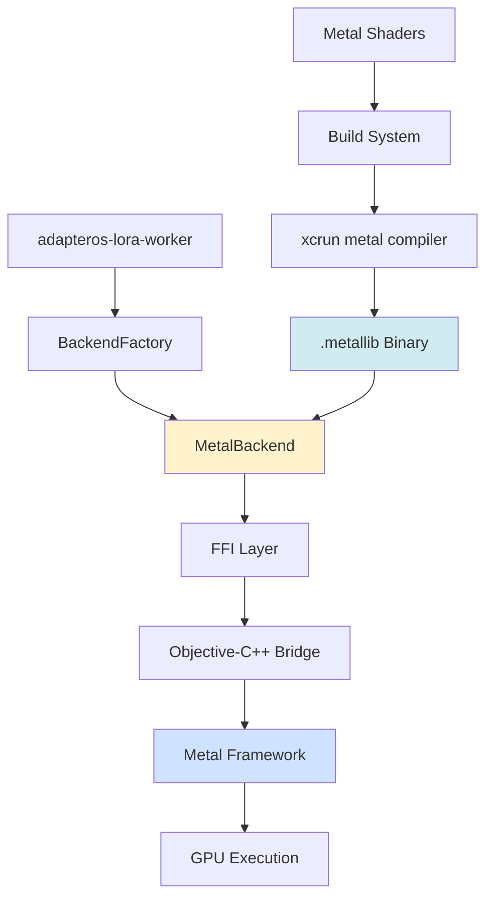

# Metal Backend Guide

**Copyright:** © 2025 JKCA / James KC Auchterlonie. All rights reserved.
**Last Updated:** 2025-12-11
**Purpose:** Complete guide to Metal backend for GPU acceleration

---

## Table of Contents

1. [Overview](#overview)
2. [Architecture](#architecture)
3. [Setup and Configuration](#setup-and-configuration)
4. [Integration Details](#integration-details)
5. [FFI Patterns](#ffi-patterns)
6. [Troubleshooting](#troubleshooting)

---

## Overview

The Metal backend enables **GPU acceleration** for LoRA inference on macOS devices through Apple's Metal framework. It provides:

- **Parallel GPU processing** for tensor operations
- **Unified memory architecture** on Apple Silicon (zero-copy)
- **Precompiled Metal shaders** for deterministic execution
- **Legacy hardware support** (pre-M1 devices without ANE)

### Status

**Building successfully.** The Metal backend compiles and links correctly. Used as a legacy fallback for systems without ANE support.

### When to Use Metal

| Scenario | Recommended Backend | Rationale |
|----------|---------------------|-----------|
| Apple Silicon with ANE | **CoreML** | ANE determinism + power efficiency |
| Production workloads | **MLX** | Enterprise resilience + flexibility |
| Intel Macs (pre-M1) | **Metal** | GPU acceleration without ANE |
| Development/Testing | **Metal** | Fast iteration on GPU kernels |

---

## Architecture

### Metal Integration in AdapterOS Stack



### Data Flow: Kernel Execution

```
1. Rust: MetalBackend::run_step(ring, io)
   ↓
2. FFI: metal_execute_kernel(context, ring, io)
   ↓
3. ObjC++: Create command buffer + encoder
   ↓
4. Metal: Dispatch kernel on GPU
   ↓
5. ObjC++: Wait for completion, copy results
   ↓
6. Rust: Return logits to caller
```

### Build Process Architecture

```
┌─────────────────────────────────────────────┐
│ 1. Source Files (.metal)                    │
│    metal/src/kernels/adapteros_kernels.metal│
│    metal/src/kernels/attention.metal        │
│    metal/src/kernels/mlp.metal              │
└─────────────────┬───────────────────────────┘
                  │
      xcrun -sdk macosx metal -c -std=metal3.1
                  │
                  ↓
┌─────────────────────────────────────────────┐
│ 2. Intermediate Representation (.air)       │
└─────────────────┬───────────────────────────┘
                  │
          xcrun -sdk macosx metallib
                  │
                  ↓
┌─────────────────────────────────────────────┐
│ 3. Metal Library (.metallib)                │
│    adapteros_kernels.metallib               │
│    (embedded in binary)                     │
└─────────────────┬───────────────────────────┘
                  │
        BLAKE3 hash + manifest signing
                  │
                  ↓
┌─────────────────────────────────────────────┐
│ 4. Runtime Loading                          │
│    MTLDevice::newLibraryWithData()          │
└─────────────────────────────────────────────┘
```

---

## Setup and Configuration

### Prerequisites

**System Requirements:**
- macOS 10.11+ (runtime)
- Xcode 14.0+ (build time)
- Metal-capable GPU (all Macs since 2012)

**For Apple Silicon (M1+):**
- Metal 3.1 support
- Unified memory architecture
- 15.8-17.0 TOPS GPU performance

**For Intel Macs:**
- Metal 2.3+ support
- Discrete GPU or integrated graphics
- Lower performance than Apple Silicon

### Metal Toolchain Setup

#### Automated Installation

```bash
# Run the automated installer
./scripts/install-metal-toolchain.sh
```

The script will:
1. Check for Xcode installation
2. Verify Metal compiler availability
3. Download and install Metal Toolchain (if needed)
4. Verify installation with test compilation

#### Manual Installation

```bash
# Install Metal Toolchain via xcodebuild
xcodebuild -downloadComponent MetalToolchain
```

**Alternative (GUI):**
1. Open Xcode
2. Go to **Preferences > Components**
3. Install **Metal Toolchain**

#### Verification

```bash
# Check Metal compiler path
xcrun --find metal
# Expected: /Applications/Xcode.app/Contents/Developer/Toolchains/XcodeDefault.xctoolchain/usr/bin/metal

# Test compilation
mkdir -p var/tmp
cd var/tmp
cat > test.metal << 'EOF'
#include <metal_stdlib>
using namespace metal;

kernel void test_kernel(device float* data [[buffer(0)]]) {
    uint tid = threadgroup_position_in_grid.x;
    data[tid] = 1.0f;
}
EOF

# Compile to AIR
xcrun -sdk macosx metal -c test.metal -o test.air

# Link to metallib
xcrun -sdk macosx metallib test.air -o test.metallib

# Verify output
ls -lh test.metallib
```

#### Verify AdapterOS Build

```bash
# Clean build to force Metal compilation
cargo clean -p adapteros-lora-kernel-mtl

# Build Metal kernel crate
cargo build -p adapteros-lora-kernel-mtl

# Expected output:
# cargo:warning=Kernel hash: <blake3-hash>
# Finished dev [unoptimized + debuginfo] target(s)
```

**Success indicators:**
- ✅ No "missing Metal Toolchain" errors
- ✅ `crates/adapteros-lora-kernel-mtl/shaders/adapteros_kernels.metallib` created
- ✅ `crates/adapteros-lora-kernel-mtl/shaders/kernel_hash.txt` contains BLAKE3 hash
- ✅ Build completes without panics

### Build System Integration

**Crate:** `adapteros-memory`

The Memory crate includes Metal heap observers for tracking GPU memory usage.

**Build Script (`build.rs`):**
```rust
fn main() {
    // Only build on macOS
    if !cfg!(target_os = "macos") {
        return;
    }

    // Compile Objective-C++ implementation
    cc::Build::new()
        .cpp(true)
        .file("src/heap_observer_impl.mm")
        .flag("-std=c++17")
        .flag("-fno-exceptions")
        .flag("-fobjc-arc")
        .compile("heap_observer");

    // Link Metal framework
    println!("cargo:rustc-link-lib=framework=Metal");
    println!("cargo:rustc-link-lib=framework=Foundation");
    println!("cargo:rustc-link-lib=framework=IOKit");
    println!("cargo:rustc-link-lib=framework=CoreFoundation");
}
```

**Frameworks Linked:**

| Framework | Purpose |
|-----------|---------|
| Metal | GPU device management and acceleration |
| Foundation | Objective-C runtime and utilities |
| IOKit | Hardware monitoring and page fault detection |
| CoreFoundation | Low-level system APIs |

**Compilation Flags:**

| Flag | Purpose |
|------|---------|
| `-std=c++17` | Modern C++ standard support |
| `-fobjc-arc` | Automatic Reference Counting |
| `-fno-objc-arc-exceptions` | ARC without exception overhead |
| `-fvisibility=hidden` | Hide internal symbols |
| `-O3` | Full optimization |

---

## Integration Details

### Metal Backend Implementation

**Crate Structure:**
```
crates/adapteros-lora-kernel-mtl/
├── Cargo.toml
├── build.rs                    # Compile Metal shaders
├── src/
│   ├── lib.rs                  # MetalBackend struct
│   ├── ffi.rs                  # Rust FFI declarations
│   └── metal_kernels.mm        # Objective-C++ implementation
├── shaders/
│   └── adapteros_kernels.metallib  # Compiled shaders
└── tests/
    └── metal_determinism.rs    # Determinism tests
```

**File Locations:**

| File Type | Location | Purpose |
|-----------|----------|---------|
| `.metal` sources | `metal/src/kernels/` | Shader source code |
| `.air` intermediate | `metal/src/kernels/` (temp) | Compilation artifact |
| `.metallib` binary | `crates/adapteros-lora-kernel-mtl/shaders/` | Embedded in binary |
| `kernel_hash.txt` | `crates/adapteros-lora-kernel-mtl/shaders/` | BLAKE3 hash |
| `metallib_manifest.json` | `crates/adapteros-lora-kernel-mtl/manifests/` | Signed manifest |

### Memory Management

**Unified Memory Buffer (Zero-Copy on Apple Silicon):**

```objective-c++
extern "C" void* metal_create_shared_buffer(void* context_ptr, size_t size) {
    @autoreleasepool {
        MetalContext* ctx = (__bridge MetalContext*)context_ptr;

        // Create shared buffer (unified memory, zero-copy CPU↔GPU)
        id<MTLBuffer> buffer = [ctx.device newBufferWithLength:size
                                                        options:MTLResourceStorageModeShared];

        return (__bridge_retained void*)buffer;
    }
}

extern "C" void* metal_buffer_contents(void* buffer_ptr) {
    id<MTLBuffer> buffer = (__bridge id<MTLBuffer>)buffer_ptr;
    return buffer.contents; // Direct CPU access to GPU memory
}
```

**Rust Side:**
```rust
pub struct MetalBuffer {
    buffer_ptr: *mut c_void,
    size: usize,
}

impl MetalBuffer {
    pub fn new(context: &MetalKernels, size: usize) -> Result<Self> {
        unsafe {
            let buffer_ptr = metal_create_shared_buffer(context.context, size);
            if buffer_ptr.is_null() {
                return Err(AosError::Kernel("Failed to create buffer".into()));
            }
            Ok(Self { buffer_ptr, size })
        }
    }

    pub fn as_slice_mut(&mut self) -> &mut [f32] {
        unsafe {
            let contents = metal_buffer_contents(self.buffer_ptr) as *mut f32;
            std::slice::from_raw_parts_mut(contents, self.size / 4)
        }
    }
}

impl Drop for MetalBuffer {
    fn drop(&mut self) {
        unsafe {
            if !self.buffer_ptr.is_null() {
                metal_release_buffer(self.buffer_ptr);
            }
        }
    }
}
```

### Metal Heap Observers

The `adapteros-memory` crate provides FFI for tracking Metal heap allocations.

**FFI Header (`include/heap_observer.h`):**
```c
// FFI-safe structures
typedef struct {
    uint64_t buffer_id;
    uint64_t heap_id;
    size_t size;
    uint64_t timestamp_ns;
} FFIHeapAllocation;

typedef struct {
    uint64_t heap_id;
    size_t total_size;
    size_t used_size;
    uint64_t timestamp_ns;
} FFIHeapState;

typedef struct {
    float fragmentation_ratio;
    size_t largest_free_block;
    uint32_t free_block_count;
} FFIFragmentationMetrics;

// FFI functions
int32_t metal_heap_observer_init(void);
int32_t metal_heap_observe_allocation(FFIHeapAllocation allocation);
int32_t metal_heap_observe_deallocation(uint64_t buffer_id);
int32_t metal_heap_update_state(FFIHeapState state);
int32_t metal_heap_get_fragmentation(uint64_t heap_id, FFIFragmentationMetrics* out);
```

**Objective-C++ Implementation:**
```objective-c++
// Thread-safe global singleton
static std::mutex g_mutex;
static std::map<uint64_t, FFIHeapAllocation> g_allocations;

extern "C" int32_t metal_heap_observe_allocation(FFIHeapAllocation allocation) {
    std::lock_guard<std::mutex> lock(g_mutex);
    g_allocations[allocation.buffer_id] = allocation;
    return 1; // Success
}

extern "C" int32_t metal_heap_get_fragmentation(
    uint64_t heap_id,
    FFIFragmentationMetrics* out
) {
    std::lock_guard<std::mutex> lock(g_mutex);

    // Calculate fragmentation from allocation map
    size_t total_used = 0;
    for (const auto& [id, alloc] : g_allocations) {
        if (alloc.heap_id == heap_id) {
            total_used += alloc.size;
        }
    }

    out->fragmentation_ratio = calculate_fragmentation(heap_id);
    out->free_block_count = count_free_blocks(heap_id);

    return 1; // Success
}
```

### Thread Safety

All FFI functions are thread-safe:
- `std::mutex` for allocation map protection
- `std::mutex` for heap state protection
- `std::atomic<bool>` for initialization flag
- `thread_local` storage for error messages

---

## FFI Patterns

### Memory Safety Principles

**Golden Rules:**
1. **Single Ownership:** Only one side (Rust or ObjC++) owns memory at a time
2. **No Double-Free:** Use `freeWhenDone:NO` when wrapping Rust-owned data
3. **Explicit Transfers:** Use `__bridge_retained`/`__bridge_transfer` for ownership transfers
4. **No Leaks:** Pair every allocation with deallocation (RAII on Rust side)
5. **Deterministic Lifetime:** Avoid ARC where possible for determinism

### Pattern 1: Borrow Rust Buffer (Read-Only)

**Use Case:** Pass serialized plan data to Metal for shader execution

**Rust Side:**
```rust
extern "C" {
    fn metal_kernel_load(plan: *const u8, plan_len: usize) -> i32;
}

impl MetalKernels {
    pub fn load(&mut self, plan_bytes: &[u8]) -> Result<()> {
        unsafe {
            let ret = metal_kernel_load(plan_bytes.as_ptr(), plan_bytes.len());
            if ret != 0 {
                return Err(AosError::Kernel("Metal kernel load failed".into()));
            }
        }
        Ok(())
    }
}
```

**Objective-C++ Side:**
```objective-c++
extern "C" int metal_kernel_load(const uint8_t* plan, size_t len) {
    @autoreleasepool {
        // Wrap Rust buffer WITHOUT copying (freeWhenDone:NO)
        NSData* data = [NSData dataWithBytesNoCopy:(void*)plan
                                            length:len
                                      freeWhenDone:NO];

        // Use data (Rust still owns underlying buffer)
        id<MTLDevice> device = MTLCreateSystemDefaultDevice();
        id<MTLBuffer> buffer = [device newBufferWithBytes:data.bytes
                                                   length:data.length
                                                  options:MTLResourceStorageModeShared];

        return 0; // Success
    }
}
```

**Key Points:**
- ✅ `freeWhenDone:NO` prevents double-free
- ✅ Rust owns buffer, ObjC++ borrows temporarily
- ✅ No memory leak (Rust deallocates after call returns)

### Pattern 2: Transfer Buffer to Rust (Write)

**Use Case:** Retrieve GPU output logits from Metal to Rust

**Rust Side:**
```rust
extern "C" {
    fn metal_kernel_get_logits(
        context: *mut c_void,
        out_buffer: *mut f32,
        capacity: usize
    ) -> usize;
}

impl MetalKernels {
    pub fn get_logits(&self, vocab_size: usize) -> Result<Vec<f32>> {
        let mut logits = vec![0.0f32; vocab_size];

        unsafe {
            let actual_len = metal_kernel_get_logits(
                self.context,
                logits.as_mut_ptr(),
                vocab_size
            );

            if actual_len != vocab_size {
                return Err(AosError::Kernel("Logits size mismatch".into()));
            }
        }

        Ok(logits)
    }
}
```

**Objective-C++ Side:**
```objective-c++
extern "C" size_t metal_kernel_get_logits(
    void* context_ptr,
    float* out_buffer,
    size_t capacity
) {
    @autoreleasepool {
        MetalContext* ctx = (__bridge MetalContext*)context_ptr;
        id<MTLBuffer> gpu_buffer = ctx.logitsBuffer;

        // Copy from GPU to CPU (Rust-owned buffer)
        size_t byte_size = capacity * sizeof(float);
        if (gpu_buffer.length < byte_size) {
            return 0; // Error: buffer too small
        }

        memcpy(out_buffer, gpu_buffer.contents, byte_size);
        return capacity; // Success
    }
}
```

### Pattern 3: Create Opaque Object (ObjC++ → Rust)

**Use Case:** Create Metal device/library context, return opaque pointer to Rust

**Rust Side:**
```rust
extern "C" {
    fn metal_create_context(metallib_path: *const c_char) -> *mut c_void;
    fn metal_release_context(context: *mut c_void);
}

pub struct MetalKernels {
    context: *mut c_void,
}

impl MetalKernels {
    pub fn new() -> Result<Self> {
        let metallib_path = std::ffi::CString::new("/path/to/kernels.metallib")?;

        unsafe {
            let context = metal_create_context(metallib_path.as_ptr());
            if context.is_null() {
                return Err(AosError::Kernel("Failed to create Metal context".into()));
            }

            Ok(Self { context })
        }
    }
}

impl Drop for MetalKernels {
    fn drop(&mut self) {
        unsafe {
            if !self.context.is_null() {
                metal_release_context(self.context);
                self.context = std::ptr::null_mut();
            }
        }
    }
}
```

**Objective-C++ Side:**
```objective-c++
@interface MetalContext : NSObject
@property (nonatomic, retain) id<MTLDevice> device;
@property (nonatomic, retain) id<MTLLibrary> library;
@property (nonatomic, retain) id<MTLCommandQueue> queue;
@end

extern "C" void* metal_create_context(const char* metallib_path) {
    @autoreleasepool {
        id<MTLDevice> device = MTLCreateSystemDefaultDevice();
        if (!device) return nullptr;

        NSString* path = @(metallib_path);
        NSError* error = nil;
        id<MTLLibrary> library = [device newLibraryWithFile:path error:&error];
        if (error) return nullptr;

        MetalContext* ctx = [[MetalContext alloc] init];
        ctx.device = device;
        ctx.library = library;
        ctx.queue = [device newCommandQueue];

        // Transfer ownership to Rust
        return (__bridge_retained void*)ctx;
    }
}

extern "C" void metal_release_context(void* context_ptr) {
    if (context_ptr) {
        CFRelease(context_ptr);
    }
}
```

### Pattern 4: Error Handling

**Objective-C++ Side:**
```objective-c++
enum MetalErrorCode {
    METAL_SUCCESS = 0,
    METAL_ERROR_DEVICE_NOT_FOUND = 1,
    METAL_ERROR_LIBRARY_LOAD_FAILED = 2,
    METAL_ERROR_EXECUTION_FAILED = 4,
};

extern "C" int metal_execute_with_error(
    void* context_ptr,
    const uint8_t* plan,
    size_t len,
    char* error_buffer,
    size_t error_buffer_size
) {
    @autoreleasepool {
        MetalContext* ctx = (__bridge MetalContext*)context_ptr;

        NSError* error = nil;
        // Execute operation...

        if (error) {
            NSString* msg = error.localizedDescription;
            const char* cstr = [msg UTF8String];
            size_t msg_len = strlen(cstr);
            size_t copy_len = MIN(msg_len, error_buffer_size - 1);

            memcpy(error_buffer, cstr, copy_len);
            error_buffer[copy_len] = '\0';

            return METAL_ERROR_EXECUTION_FAILED;
        }

        return METAL_SUCCESS;
    }
}
```

**Rust Side:**
```rust
const ERROR_BUFFER_SIZE: usize = 1024;

impl MetalKernels {
    pub fn execute_with_error(&self, plan: &[u8]) -> Result<()> {
        let mut error_buffer = vec![0u8; ERROR_BUFFER_SIZE];

        unsafe {
            let ret = metal_execute_with_error(
                self.context,
                plan.as_ptr(),
                plan.len(),
                error_buffer.as_mut_ptr() as *mut c_char,
                ERROR_BUFFER_SIZE,
            );

            if ret != 0 {
                let error_msg = std::ffi::CStr::from_ptr(error_buffer.as_ptr() as *const c_char)
                    .to_string_lossy()
                    .into_owned();

                return Err(AosError::Kernel(format!(
                    "Metal execution failed (code {}): {}",
                    ret, error_msg
                )));
            }
        }

        Ok(())
    }
}
```

### Anti-Patterns

**❌ Anti-Pattern 1: Double-Free**
```objective-c++
// BAD: freeWhenDone:YES will cause double-free
NSData* data = [NSData dataWithBytesNoCopy:(void*)plan
                                    length:len
                              freeWhenDone:YES]; // ❌
```

**✅ Good:**
```objective-c++
// GOOD: freeWhenDone:NO, Rust retains ownership
NSData* data = [NSData dataWithBytesNoCopy:(void*)plan
                                    length:len
                              freeWhenDone:NO]; // ✅
```

**❌ Anti-Pattern 2: Memory Leak**
```rust
// BAD: Never released
fn bad_usage() -> Result<()> {
    unsafe {
        let context = metal_create_context();
        // ❌ Never released → memory leak
        Ok(())
    }
}
```

**✅ Good:**
```rust
// GOOD: RAII with Drop
pub struct MetalKernels {
    context: *mut c_void,
}

impl Drop for MetalKernels {
    fn drop(&mut self) {
        unsafe {
            if !self.context.is_null() {
                metal_release_context(self.context);
            }
        }
    }
}
```

---

## Troubleshooting

### Error: "cannot execute tool 'metal' due to missing Metal Toolchain"

**Symptom:**
```
error: cannot execute tool 'metal' due to missing Metal Toolchain
use: xcodebuild -downloadComponent MetalToolchain
```

**Solutions:**

1. Run automated installer:
   ```bash
   ./scripts/install-metal-toolchain.sh
   ```

2. Manual installation:
   ```bash
   xcodebuild -downloadComponent MetalToolchain
   ```

3. Check Xcode license:
   ```bash
   sudo xcodebuild -license accept
   ```

4. Reset Xcode developer directory:
   ```bash
   sudo xcode-select --reset
   sudo xcode-select --switch /Applications/Xcode.app
   ```

### Error: "Metal compiler not found"

**Solutions:**

1. Install Xcode Command Line Tools:
   ```bash
   xcode-select --install
   ```

2. Verify Xcode installation:
   ```bash
   xcode-select -p
   # Should output: /Applications/Xcode.app/Contents/Developer
   ```

### Build Fails with Metal Syntax Errors

**Solutions:**

1. Check Metal version:
   ```bash
   xcrun --show-sdk-version
   # Minimum: 12.5
   ```

2. Verify Metal standard:
   - AdapterOS uses Metal 3.1 (`-std=metal3.1`)
   - Requires Xcode 14.0+ and macOS 12.5+

3. Update Xcode:
   ```bash
   softwareupdate --install "Xcode"
   ```

### Metallib Not Embedded in Binary

**Symptom:**
```
Error: Failed to load Metal library
```

**Solutions:**

1. Check shaders directory:
   ```bash
   ls -lh crates/adapteros-lora-kernel-mtl/shaders/
   # Should contain: adapteros_kernels.metallib
   ```

2. Force rebuild:
   ```bash
   cargo clean -p adapteros-lora-kernel-mtl
   cargo build -p adapteros-lora-kernel-mtl --verbose
   ```

### Sandboxed/CI Builds (Metal Module Cache)

Some sandboxed environments block writes to the default `$HOME/.cache/clang/ModuleCache`. Override the cache paths:

```bash
export CLANG_MODULE_CACHE_PATH="$PWD/target/clang-module-cache"
export METAL_HOME_OVERRIDE="$PWD"
cargo check -p adapteros-server-api
```

This keeps the module cache writable and avoids `could not build module 'metal_types'` errors.

---

## CI/CD Integration

### GitHub Actions

```yaml
name: Build

on: [push, pull_request]

jobs:
  build-macos:
    runs-on: macos-latest

    steps:
      - uses: actions/checkout@v4

      - name: Install Rust
        uses: dtolnay/rust-toolchain@stable

      - name: Install Metal Toolchain
        run: |
          ./scripts/install-metal-toolchain.sh

      - name: Build
        run: cargo build --release

      - name: Test
        run: cargo test --workspace
```

---

## See Also

- [docs/COREML_BACKEND.md](./COREML_BACKEND.md) - CoreML backend guide
- [docs/ADR_MULTI_BACKEND_STRATEGY.md](./ADR_MULTI_BACKEND_STRATEGY.md) - Multi-backend architecture
- [docs/MLX_INTEGRATION.md](./MLX_INTEGRATION.md) - MLX backend guide
- [AGENTS.md](../AGENTS.md) - Development guidelines

---

## References

- [Metal Shading Language Specification](https://developer.apple.com/metal/Metal-Shading-Language-Specification.pdf)
- [Metal Best Practices Guide](https://developer.apple.com/documentation/metal/best_practices_for_metal_apps)
- [Apple Silicon Performance Guide](https://developer.apple.com/documentation/metal/gpu_features/understanding_gpu_family_4)

---

**Signed:** James KC Auchterlonie
**Date:** 2025-12-11
**Status:** Building Successfully (Legacy Fallback)
