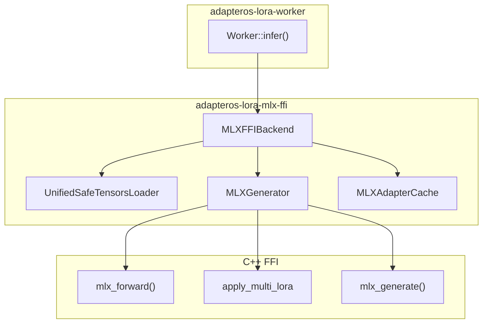

# MLX_GUIDE

Primary inference backend. Source: `adapteros-lora-mlx-ffi`.

---

## Topology



---

## Build

```bash
brew install ml-explore/mlx/mlx
cargo build -p adapteros-lora-worker  # MLX included by default on macOS
```

---

## Model Path

| Env | Purpose |
|-----|---------|
| `AOS_MLX_FFI_MODEL` | Model directory |
| `AOS_MODEL_PATH` | Fallback |
| `AOS_TOKENIZER_PATH` | Explicit tokenizer.json |

Directory must contain: `safetensors.json`, `tokenizer.json`.

---

## Inference Flow

1. `Worker::infer()` receives `WorkerInferRequest`
2. `MLXFFIBackend::infer()` loads base model via `UnifiedSafeTensorsLoader`
3. `apply_multi_lora()` applies selected adapters
4. `mlx_forward()` / `mlx_generate()` produces tokens
5. Unified memory; no explicit GPU transfer

---

## Training

- `mlx_value_and_grad()` for loss + gradients
- `mlx_lora_backward_gpu` for LoRA backprop
- Source: `adapteros-lora-worker/training/`
