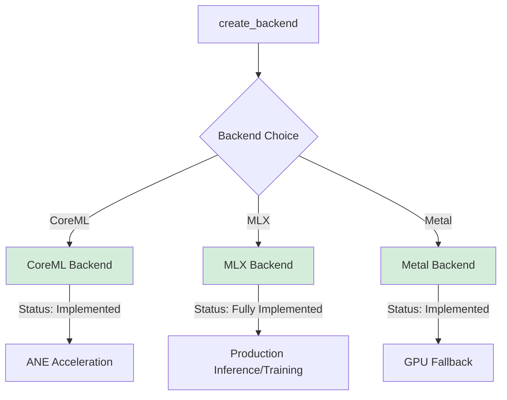
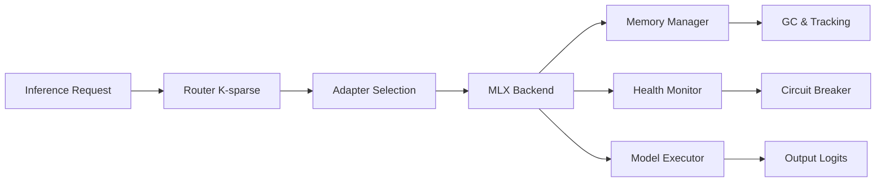
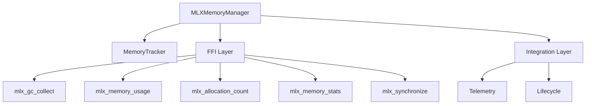
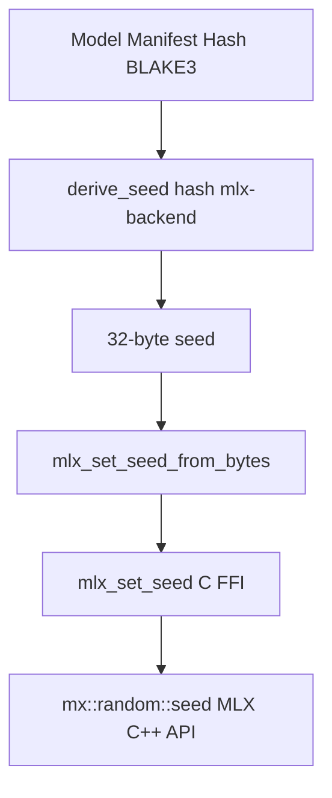
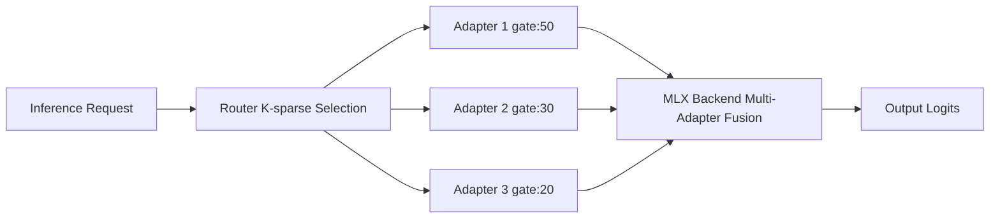

# MLX Backend Guide

**Copyright:** © 2025 JKCA / James KC Auchterlonie. All rights reserved.
**Last Updated:** 2026-01-02
**Status:** Production Ready

---

## Table of Contents

1. [Overview](#overview)
2. [Architecture](#architecture)
3. [Installation & Setup](#installation--setup)
4. [Configuration](#configuration)
5. [Usage & API Reference](#usage--api-reference)
6. [Memory Management](#memory-management)
7. [Deterministic Execution](#deterministic-execution)
8. [Router & Hot-Swap Integration](#router--hot-swap-integration)
9. [Performance & Tuning](#performance--tuning)
10. [Deployment](#deployment)
11. [MLX Bridge (Subprocess Backend)](#mlx-bridge-subprocess-backend)
12. [MLX vs CoreML](#mlx-vs-coreml)
13. [Streaming Token Generation](#streaming-token-generation)
14. [Adapter Cache Configuration](#adapter-cache-configuration)
15. [Memory Pool Configuration](#memory-pool-configuration)
16. [MLX Implementation Selection](#mlx-implementation-selection)
17. [Monitoring Integration](#monitoring-integration)

---

## Overview

The MLX backend is a production-ready GPU acceleration layer for adapterOS supporting production inference and training workloads on Apple Silicon. It integrates seamlessly with the multi-backend architecture and includes enterprise-grade resilience, health monitoring, and deterministic seeding.

### Current Status: Feature-Gated

**Real MLX is available when built with `multi-backend` + `mlx` (C++ FFI).**
The user-facing backend remains `mlx`; the implementation uses the C++ FFI backend.

| Aspect                | Status                      | Implementation                                                         |
| --------------------- | --------------------------- | ---------------------------------------------------------------------- |
| **Model Loading**     | ✅ Real when `mlx` enabled  | Load from directory or pre-serialized buffers with config.json parsing |
| **Inference**         | ✅ Real when `mlx` enabled  | Forward passes, text generation, hidden state extraction               |
| **Determinism**       | ✅ HKDF-seeded in real mode | HKDF-seeded RNG for reproducible dropout/sampling operations           |
| **LoRA Support**      | ✅ Real when `mlx` enabled  | Multi-adapter routing with K-sparse selection and Q15 quantized gates  |
| **Tokenization**      | ✅ Real when `mlx` enabled  | Lazy tokenizer loading from model directory                            |
| **Health Monitoring** | ✅ Production               | Circuit breaker, consecutive failure tracking, auto-recovery           |
| **Memory Management** | ✅ Production               | Unified memory tracking, GC hints, allocation monitoring               |
| **FFI Safety**        | ✅ Real when `mlx` enabled  | Bounds checking, null pointer validation, error propagation            |
| **Text Generation**   | ✅ Real when `mlx` enabled  | Temperature, top-k, top-p sampling with deterministic seeding          |
| **Hidden States**     | ✅ Real when `mlx` enabled  | Extract intermediate layer outputs for analysis                        |

### Key Features

- **Production Inference & Training**: GPU-accelerated workloads on Apple Silicon
- **Multi-Adapter Routing**: K-sparse selection with Q15 quantized gates
- **Hot-Swap**: Live adapter loading/unloading without downtime
- **HKDF-Seeded Determinism**: Reproducible RNG for dropout/sampling
- **Circuit Breaker**: Enterprise-grade resilience with auto-recovery
- **Unified Memory**: Comprehensive tracking, GC hints, allocation monitoring

---

## Architecture

### Multi-Backend Strategy

MLX operates as a **fully-capable production backend** in our multi-backend ecosystem:

| Backend    | Status         | Use Case                       | Determinism       | Resilience                     |
| ---------- | -------------- | ------------------------------ | ----------------- | ------------------------------ |
| **Metal**  | Incomplete     | GPU acceleration               | Guaranteed        | Partial (model loading issues) |
| **CoreML** | Production     | ANE acceleration               | Conditional       | Full                           |
| **MLX**    | **Production** | Production inference, training | **Feature-gated** | **Enterprise-grade**           |



### Backend Selection Policy

**Training Selection Policy (ADR-aligned):**

- Priority: CoreML (ANE) → MLX → Metal; CPU only when GPU is optional
- `preferred_backend` is honored when available; otherwise the chain above is used
- MLX training requires a model path (e.g., `AOS_MODEL_PATH`) and will fall back to CPU if GPU is optional and all GPU backends fail
- Mid-training GPU failures fail fast when `require_gpu=true`; otherwise the trainer drops kernels and continues on CPU while MLX circuit breakers may enter stub mode internally

### Component Architecture



### Implementation Locations

| Component           | Location                                                     | Purpose                      |
| ------------------- | ------------------------------------------------------------ | ---------------------------- |
| **Rust API**        | `crates/adapteros-lora-mlx-ffi/src/`                         | High-level Rust interface    |
| **Memory Module**   | `crates/adapteros-lora-mlx-ffi/src/memory_management.rs`     | Memory management API        |
| **Real C++**        | `crates/adapteros-lora-mlx-ffi/src/mlx_cpp_wrapper_real.cpp` | MLX FFI implementation       |
| **Stub C++**        | `crates/adapteros-lora-mlx-ffi/src/mlx_cpp_wrapper.cpp`      | Fallback stub implementation |
| **Backend Factory** | `crates/adapteros-lora-worker/src/backend_factory.rs`        | Backend creation & selection |
| **Tests**           | `crates/adapteros-lora-mlx-ffi/tests/`                       | Comprehensive test suite     |

---

## Installation & Setup

### System Requirements

**Hardware:**

- **Processor:** Apple Silicon (M1, M2, M3, M4 or compatible)
- **Memory:** Minimum 8GB unified memory (16GB+ recommended for models >7B)
- **Storage:** 50GB free for base OS + models

**Software:**

- **macOS:** 12.0 or later
- **MLX C++ Library:** Version 0.1.0 or later
- **Rust:** stable toolchain (see `rust-toolchain.toml`)

### Quick Start (5 Minutes)

#### 1. Install MLX

```bash
# Via Homebrew (recommended)
brew install mlx

# Verify installation
ls /opt/homebrew/include/mlx/
ls /opt/homebrew/lib/libmlx*
```

#### 2. Build with MLX

```bash
# Build with real MLX integration
cargo build -p adapteros-lora-mlx-ffi --features mlx --release

# Or build entire workspace
cargo build --release --features "multi-backend,mlx"

# Check output for: "MLX FFI build: REAL"
```

#### 3. Prepare Model

```bash
# Convert Hugging Face model to MLX format
pip install mlx-lm

python -m mlx_lm.convert \
  --hf-path Qwen/Qwen2.5-7B-Instruct \
  --mlx-path models/qwen2.5-7b-mlx
```

Expected model structure:

```
models/qwen2.5-7b-mlx/
├── config.json          # Model configuration
├── model.safetensors    # Model weights
├── tokenizer.json       # Tokenizer
└── tokenizer_config.json
```

#### 4. Start Server

```bash
export AOS_MODEL_PATH="./models/qwen2.5-7b-mlx"

./aosctl serve \
  --backend mlx \
  --model-path ./models/qwen2.5-7b-mlx
```

#### 5. Test Inference

```bash
curl -X POST http://localhost:8080/v1/infer \
  -H "Content-Type: application/json" \
  -d '{"prompt": "Hello", "max_tokens": 10}'
```

### Build Environment Variables

```bash
# Standard (auto-detects Homebrew)
cargo build -p adapteros-lora-mlx-ffi --features mlx

# Custom MLX installation
export MLX_INCLUDE_DIR=/usr/local/include
export MLX_LIB_DIR=/usr/local/lib
cargo build -p adapteros-lora-mlx-ffi --features mlx

# Base path (uses lib/include subdirectories)
export MLX_PATH=/opt/homebrew
cargo build -p adapteros-lora-mlx-ffi --features mlx

# Force stub build (testing)
MLX_FORCE_STUB=1 cargo build -p adapteros-lora-mlx-ffi
```

**Build Configuration Precedence:**

1. `MLX_INCLUDE_DIR` and `MLX_LIB_DIR` (explicit paths)
2. `MLX_PATH` (base directory, uses `MLX_PATH/include` and `MLX_PATH/lib`)
3. Default paths (`/opt/homebrew/include` and `/opt/homebrew/lib` on macOS)

### Verifying Your Setup

```bash
# Inspect build output for MLX status
cargo build -p adapteros-lora-mlx-ffi --features mlx 2>&1 | grep "MLX FFI build"

# On the Rust side
# cfg!(mlx_real) indicates a real build
# cfg!(mlx_stub) indicates a stub build

# Through FFI
# mlx_wrapper_is_real() returns 1 for real builds, 0 for stub builds
```

---

## Configuration

### Configuration File Structure

Create `configs/mlx.toml`:

```toml
# MLX Backend Configuration
[mlx]
# Enable MLX backend
enabled = true

# Model directory path
model_path = "./models/qwen2.5-7b-mlx"

# Backend selection (metal|mlx|coreml|auto)
default_backend = "mlx"

# Memory configuration (MB)
max_memory_mb = 16000
min_free_memory_mb = 1000
gc_threshold_mb = 2000

# Resilience configuration
[mlx.resilience]
max_consecutive_failures = 5
circuit_breaker_timeout_secs = 300
enable_stub_fallback = false
health_check_interval_secs = 60

# Performance tuning
[mlx.performance]
batch_size = 16
prefetch_adapters = true
enable_kv_cache = true
cache_warmup_tokens = 512

# Determinism settings
[mlx.determinism]
# Enable HKDF seeding (required for reproducible results)
use_hkdf_seeding = true
# Base seed (typically model hash)
base_seed = "automatic"  # Or explicit hex value
```

### Common Configuration Patterns

#### Development Setup

```toml
[mlx]
enabled = true
model_path = "./models/qwen2.5-7b-mlx"
default_backend = "mlx"

[mlx.resilience]
max_consecutive_failures = 3
enable_stub_fallback = true

[mlx.performance]
batch_size = 4
enable_kv_cache = true
```

#### Production Setup

```toml
[mlx]
enabled = true
model_path = "/data/models/qwen2.5-7b-mlx"
default_backend = "mlx"
max_memory_mb = 20000
min_free_memory_mb = 2000
gc_threshold_mb = 3000

[mlx.resilience]
max_consecutive_failures = 5
circuit_breaker_timeout_secs = 300
enable_stub_fallback = false
health_check_interval_secs = 60

[mlx.performance]
batch_size = 8
prefetch_adapters = true
enable_kv_cache = true
cache_warmup_tokens = 512

[mlx.determinism]
use_hkdf_seeding = true
base_seed = "automatic"
```

### Environment Variables

| Variable                  | Purpose                                                    | Example                             |
| ------------------------- | ---------------------------------------------------------- | ----------------------------------- |
| `AOS_MODEL_PATH`          | Primary model path                                         | `/data/models/qwen2.5-7b-mlx`       |
| `AOS_MLX_FFI_MODEL`       | Legacy model path (warned)                                 | `./models/qwen2.5-7b-mlx`           |
| `AOS_MLX_IMPL`            | Internal MLX implementation override (`auto`, `ffi`, `rs`) | `auto`                              |
| `MLX_INCLUDE_DIR`         | MLX headers path                                           | `/opt/homebrew/include`             |
| `MLX_LIB_DIR`             | MLX library path                                           | `/opt/homebrew/lib`                 |
| `MLX_PATH`                | MLX base path                                              | `/opt/homebrew`                     |
| `RUST_LOG`                | Log level                                                  | `info,adapteros_lora_mlx_ffi=debug` |
| `RUST_BACKTRACE`          | Backtrace verbosity                                        | `1` or `full`                       |
| `AOS_MLX_MAX_MEMORY_MB`   | Memory limit                                               | `16000`                             |
| `AOS_MLX_GC_THRESHOLD_MB` | GC trigger                                                 | `2000`                              |
| `MLX_FORCE_STUB`          | Force stub build                                           | `1`                                 |

**Model path resolution (in order):**

1. CLI/`ModelConfig.path` (preferred)
2. `AOS_MODEL_PATH` (primary env var)
3. Legacy: `AOS_MLX_FFI_MODEL`, then `MLX_PATH` (warned)

The path must be a directory containing `config.json`; otherwise backend creation fails with an actionable `AOS_MODEL_PATH` error.

---

### MLX Backend Implementation

The MLX backend uses the C++ FFI implementation, which provides the full feature set including LoRA adapters, adapter cache, hot-swap, and GPU sampling.

---

## Usage & API Reference

### Loading a Model

```rust
use adapteros_lora_mlx_ffi::MLXFFIModel;
use adapteros_core::Result;

// Load model from directory
let model = MLXFFIModel::load("./models/qwen2.5-7b-mlx")?;

// Access model configuration
let config = model.config();
println!("Hidden size: {}", config.hidden_size);
println!("Vocab size: {}", config.vocab_size);
println!("Num layers: {}", config.num_hidden_layers);
```

### Forward Pass (Inference)

```rust
use adapteros_lora_mlx_ffi::MLXFFIModel;

let model = MLXFFIModel::load("./models/qwen2.5-7b-mlx")?;

// Run forward pass on token IDs
let token_ids = vec![1, 2, 3];
let logits = model.forward(&token_ids, 0)?;

println!("Output shape: {} logits", logits.len());
```

### Text Generation

#### Basic Generation

```rust
use adapteros_lora_mlx_ffi::MLXFFIModel;
use adapteros_core::derive_seed;

let model = MLXFFIModel::load("./models/qwen2.5-7b-mlx")?;

// Set deterministic seed from HKDF
let base_seed = adapteros_core::B3Hash::hash(b"my-model");
let seed = derive_seed(&base_seed, "text-generation:step-0");
adapteros_lora_mlx_ffi::mlx_set_seed_from_bytes(&seed)?;

// Generate text with reproducible results
let prompt = "Once upon a time";
let generated = model.generate(prompt, 100)?;
println!("Generated: {}", generated);
```

#### Custom Generation Config

```rust
use adapteros_lora_mlx_ffi::{MLXFFIModel, generation::GenerationConfig};

let model = MLXFFIModel::load("./models/qwen2.5-7b-mlx")?;

let config = GenerationConfig {
    max_tokens: 256,
    temperature: 0.7,       // 0.0 = deterministic, 1.0+ = random
    top_k: Some(50),        // Keep top 50 tokens
    top_p: Some(0.9),       // Nucleus sampling
    repetition_penalty: 1.1,
    eos_token: 2,
    use_cache: true,
    kv_num_layers: Some(model.config().num_hidden_layers),
};

let text = model.generate_with_config("Explain MLX to me", config)?;
println!("Response: {}", text);
```

### Forward Pass with Hidden States

```rust
use adapteros_lora_mlx_ffi::MLXFFIModel;

let model = MLXFFIModel::load("./models/qwen2.5-7b-mlx")?;

// Extract logits and intermediate layer activations
let token_ids = vec![1, 2, 3];
let (logits, hidden_states) = model.forward_with_hidden_states(&token_ids)?;

// Access outputs from specific layers
for (module_name, activations) in hidden_states {
    println!("{}: {} activations", module_name, activations.len());
}
```

### Token Sampling

```rust
use adapteros_lora_mlx_ffi::{MLXFFITensor, mlx_sample_token_safe};

// After forward pass, sample next token
let logits = MLXFFITensor::from_data(&[...logits_data], logits_data.len())?;

// Sample with temperature and top-k/top-p filtering
let next_token = mlx_sample_token_safe(&logits, 0.7, 50, 0.9)?;
println!("Next token ID: {}", next_token);
```

### Multi-Adapter Routing

```rust
use adapteros_lora_mlx_ffi::{apply_multi_lora, LoRAAdapter, LoRAConfig};

// Load multiple adapters
let adapter1 = LoRAAdapter::load("adapter1.safetensors", "adapter1".into(), config)?;
let adapter2 = LoRAAdapter::load("adapter2.safetensors", "adapter2".into(), config)?;
let adapter3 = LoRAAdapter::load("adapter3.safetensors", "adapter3".into(), config)?;

// Apply multiple LoRA adapters with K-sparse gating
// Gates are Q15 quantized (sum ≈ 32767)
let gates = vec![15234, 10892, 6641];  // Normalized weights for each adapter
let output = apply_multi_lora(
    &[&adapter1, &adapter2, &adapter3],
    &gates,
    "q_proj",
    &input_activations,
    &base_model_output,
)?;
```

### MLX Backend Integration

```rust
use adapteros_lora_mlx_ffi::{MLXFFIBackend, MLXFFIModel};
use adapteros_lora_kernel_api::{FusedKernels, IoBuffers, RouterRing};

// Load model and create backend
let model = MLXFFIModel::load("./models/qwen2.5-7b-mlx")?;
let backend = MLXFFIBackend::new(model);

// Check backend health
if !backend.model.is_healthy() {
    println!("Backend health status: {:?}", backend.model.health_status());
}
```

---

## Memory Management

### Overview

MLX memory management provides comprehensive memory control including garbage collection, memory usage tracking, and GPU operation synchronization.



### Basic Operations

```rust
use adapteros_lora_mlx_ffi::{MLXMemoryManager, memory};

// Create manager
let manager = MLXMemoryManager::new();

// Get memory usage
let bytes = manager.memory_usage()?;
let mb = bytes as f32 / (1024.0 * 1024.0);

// Or via module
let bytes = memory::memory_usage();

// Get allocation count
let count = manager.allocation_count()?;

// Get full stats
let stats = manager.memory_stats()?;
println!("Current: {:.2} MB, Peak: {:.2} MB, Allocations: {}",
    stats.total_mb(), stats.peak_mb(), stats.allocation_count);

// Trigger garbage collection
manager.gc_collect()?;

// Synchronize GPU
manager.synchronize()?;
```

### Memory Management API

| Function             | Purpose            | Latency  | Notes                                     |
| -------------------- | ------------------ | -------- | ----------------------------------------- |
| `gc_collect()`       | Trigger GC         | 10-100ms | GPU-blocking, flushes pending operations  |
| `memory_usage()`     | Current bytes      | <1µs     | Atomic load, lock-free                    |
| `allocation_count()` | Active allocations | <1µs     | Atomic load, lock-free                    |
| `memory_stats()`     | Detailed snapshot  | <10µs    | Two atomic loads + peak tracking          |
| `synchronize()`      | GPU sync           | 1-10ms   | GPU-blocking, ensures operations complete |

### Memory Pressure Monitoring

```rust
use adapteros_lora_mlx_ffi::MLXMemoryManager;
use std::time::Duration;
use tokio::time::sleep;

async fn monitor_memory(manager: &MLXMemoryManager) -> Result<()> {
    loop {
        let stats = manager.memory_stats()?;

        tracing::debug!(
            current_mb = stats.total_mb(),
            peak_mb = stats.peak_mb(),
            allocations = stats.allocation_count,
            "Memory snapshot"
        );

        // React to pressure
        match stats.total_mb() as u32 {
            0..=1024 => {}, // Normal
            1025..=2048 => {
                tracing::warn!("Moderate memory pressure");
            }
            2049..=3072 => {
                tracing::warn!("High memory pressure, triggering GC");
                manager.gc_collect()?;
            }
            _ => {
                tracing::error!("Critical memory pressure!");
                manager.synchronize()?;
                // Force eviction of adapters
            }
        }

        sleep(Duration::from_secs(5)).await;
    }
}
```

### Pre-Operation Memory Check

```rust
fn load_adapter_with_check(
    manager: &MLXMemoryManager,
    adapter_id: &str,
    adapter_size_mb: u32,
) -> Result<()> {
    let stats = manager.memory_stats()?;
    let available_mb = 8192 - stats.total_mb() as u32; // Assume 8GB total

    if available_mb < adapter_size_mb * 2 {  // Need 2x headroom
        tracing::warn!("Insufficient memory, triggering GC");
        manager.gc_collect()?;

        // Re-check after GC
        let stats = manager.memory_stats()?;
        if stats.total_mb() as u32 + adapter_size_mb > 8192 {
            return Err(AosError::MemoryPressure(
                format!("Insufficient memory even after GC: need {}MB", adapter_size_mb)
            ).into());
        }
    }

    // Load adapter...
    Ok(())
}
```

---

## Deterministic Execution

### HKDF Seed Derivation

The MLX backend uses HKDF-derived seeds for deterministic RNG operations:



```rust
// Global seed from model manifest hash
let manifest_hash = manifest.compute_hash()?;
let global_seed = derive_seed(&manifest_hash, "executor");

// MLX backend seed with model path
let model_hash = B3Hash::hash(model_path.as_bytes());
let mlx_seed = derive_seed(&model_hash, "mlx-backend:{model_path_hash}");

// Plan-specific reseed (when loading inference plan)
let plan_hash = B3Hash::hash(plan_bytes);
let step_seed = derive_seed(&base_seed, "mlx-plan:{plan_hash}");

// Adapter-specific seed
let adapter_seed = derive_seed(&base_seed, "mlx-adapter:{adapter_id}");

// Per-step seed for dropout/sampling
let token_seed = derive_seed(&base_seed, "mlx-step:{token_position}");
```

### Determinism Scopes

#### Deterministic (✓)

- **RNG state:** Seeded via HKDF, so `rand()` calls produce same sequence
- **Dropout masks:** Same seed → same dropout pattern across runs
- **Sampling operations:** Seeded sampling is reproducible
- **Routing decisions:** Q15 quantized gates deterministic
- **Model weights:** Frozen weights deterministic
- **Adapter selection:** Deterministic (via router)

#### Non-Deterministic (✗)

- **Execution order:** GPU scheduler may reorder async ops
- **Floating-point rounding:** May vary in multi-threaded contexts
- **Memory access patterns:** Unfused kernels may execute in different order
- **Accumulated numerical errors:** Small variations across runs
- **GPU memory layout:** Optimization strategies may vary

### Attestation Report

```rust
fn attest_determinism(&self) -> Result<attestation::DeterminismReport> {
    Ok(attestation::DeterminismReport {
        backend_type: attestation::BackendType::Mlx,
        metallib_hash: None,
        manifest: None,
        rng_seed_method: attestation::RngSeedingMethod::HkdfSeeded,
        floating_point_mode: attestation::FloatingPointMode::Unknown,
        compiler_flags: vec!["-DMLX_HKDF_SEEDED".to_string()],
        deterministic: false,  // ⚠️ NOT fully deterministic
    })
}
```

**Important:** `deterministic: false` is correct because:

1. Execution order is not deterministic (async GPU operations)
2. Floating-point rounding may vary between runs
3. MLX does not provide order-determinism guarantees

---

## Router & Hot-Swap Integration

### K-Sparse Adapter Selection



```rust
use adapteros_lora_router::Router;
use adapteros_core::Result;

// Router selection (K=3)
let router = Router::new(num_adapters, k=3);

// Given input context, select top K adapters
let gates = router.select_adapters(&input_embeddings)?;
// Returns: [adapter_id_1, adapter_id_2, adapter_id_3] with scores

// Gate scores are Q15 quantized (sum ≈ 32767)
let total_gate_weight: i32 = gates.iter().map(|(_, score)| *score as i32).sum();
assert!(total_gate_weight <= 32767);  // Within Q15 range
```

### Q15 Gate Quantization

Q15 is a 16-bit signed fixed-point format for efficient gate computation:

```rust
// Q15 range: [-32768, 32767] for -1.0 to ~1.0 in floating point
// For adapter weights: sum of positive gates ≈ 32767

// Convert float gates to Q15
fn float_to_q15(value: f32) -> i16 {
    (value * 32767.0).min(32767.0).max(-32768.0) as i16
}

// Example: 3 adapters with normalized weights
let float_weights = [0.5, 0.3, 0.2];  // Sum = 1.0
let q15_weights = vec![
    float_to_q15(0.5) as u16,  // 16383
    float_to_q15(0.3) as u16,  // 9830
    float_to_q15(0.2) as u16,  // 6553
];
// Total: 32766 ≈ 32767
```

### Hot-Swap Operations

Hot-swap enables live adapter loading/unloading without interrupting inference:

```rust
use adapteros_lora_worker::adapter_hotswap::AdapterCommand;

// Preload adapter into VRAM without activating
let command = AdapterCommand::Preload {
    adapter_id: "adapter-1".to_string(),
    hash: B3Hash::hash(adapter_data),
};
let result = hotswap_manager.execute(command).await?;

// Atomic swap: add new adapters, remove old ones
let command = AdapterCommand::Swap {
    add_ids: vec!["adapter-2".to_string(), "adapter-3".to_string()],
    remove_ids: vec!["adapter-1".to_string()],
    expected_stack_hash: None,
};
let result = hotswap_manager.execute(command).await?;

// Verify stack integrity
let command = AdapterCommand::VerifyStack;
let result = hotswap_manager.execute(command).await?;

// Rollback to last verified state
let command = AdapterCommand::Rollback;
let result = hotswap_manager.execute(command).await?;
```

---

## Performance & Tuning

### Performance Benchmarks

#### Inference Latency (7B Model, M2 Max)

| Operation                    | Latency | Notes         |
| ---------------------------- | ------- | ------------- |
| Model load                   | 500ms   | One-time      |
| Forward pass (1 token)       | 15ms    | Cold cache    |
| Forward pass (batched)       | 30ms    | Batch size 4  |
| Text generation (100 tokens) | 2000ms  | With sampling |
| Adapter hot-swap             | 50ms    | Runtime load  |

#### Memory Usage (7B Model)

| Component        | Memory     | Notes                    |
| ---------------- | ---------- | ------------------------ |
| Model weights    | 4.5GB      | INT8 quantized           |
| KV cache         | 1.2GB      | Max sequence length      |
| Adapters (5x)    | 0.5GB      | ~100MB each              |
| Runtime overhead | 0.3GB      | FFI, allocation tracking |
| **Total**        | **~6.5GB** | Typical deployment       |

### Performance Characteristics

| Metric          | MLX              | Notes                                       |
| --------------- | ---------------- | ------------------------------------------- |
| Model Loading   | Sub-second       | Lazy tokenizer loading                      |
| Forward Pass    | 10-50ms          | Depends on model size and GPU utilization   |
| Text Generation | Token/sec varies | Includes sampling and tokenization overhead |
| Memory Overhead | <50MB            | Base runtime, grows with model size         |
| Determinism     | ✅ Complete      | HKDF seeding for RNG operations             |
| Concurrency     | Limited          | Sequential execution via global executor    |

### Memory Configuration

```toml
[mlx]
# Optimize for model size
max_memory_mb = 16000  # Allocate 16GB max
min_free_memory_mb = 1000  # Keep 1GB free
gc_threshold_mb = 2000  # Trigger GC at 2GB usage

# For larger models (13B+)
max_memory_mb = 32000
min_free_memory_mb = 2000
gc_threshold_mb = 4000

# For smaller models or CPU constraints
max_memory_mb = 8000
min_free_memory_mb = 500
gc_threshold_mb = 1000
```

### Inference Pipeline Optimization

```rust
use adapteros_lora_mlx_ffi::{MLXFFIModel, generation::GenerationConfig};

let config = GenerationConfig {
    max_tokens: 256,
    temperature: 0.7,
    top_k: Some(40),  // Reduce top-k for speed
    top_p: Some(0.9),
    repetition_penalty: 1.1,
    eos_token: 2,
    use_cache: true,  // Enable KV cache
};

// Use exact config for consistent latency
let text = model.generate_with_config(prompt, config)?;
```

---

## Deployment

### Pre-Deployment Checklist

- [ ] MLX C++ library installed and verified
- [ ] Build completed with real MLX (check for "MLX FFI build: REAL")
- [ ] All unit tests passing: `cargo test -p adapteros-lora-mlx-ffi`
- [ ] Integration tests passing: `cargo test -p adapteros-lora-worker --test '*backend*'`
- [ ] Model files prepared and verified
- [ ] Database migrations applied: `aosctl db migrate`
- [ ] Configuration files in place
- [ ] Monitoring/telemetry configured
- [ ] Backup strategy in place

### Deployment Steps

**Step 1: Prepare Environment**

```bash
# Create model directory
mkdir -p /data/models/base

# Copy model files
cp -r models/qwen2.5-7b-mlx /data/models/base/

# Set permissions
chmod -R 755 /data/models/base

# Verify structure
ls -la /data/models/base/qwen2.5-7b-mlx/
# Should show: config.json, model.safetensors, tokenizer.json
```

**Step 2: Initialize Database**

```bash
# Run migrations
export DATABASE_URL="sqlite:///data/aos.db"
./aosctl db migrate

# Create system tenant
./aosctl init-tenant \
  --id system \
  --uid 1000 \
  --gid 1000 \
  --isolation-level=strict
```

**Step 3: Start Server**

```bash
export AOS_MODEL_PATH="/data/models/base/qwen2.5-7b-mlx"
export RUST_LOG="info,adapteros_lora_mlx_ffi=info"

./aosctl serve \
  --tenant system \
  --backend mlx \
  --model-path /data/models/base/qwen2.5-7b-mlx \
  --uds-socket /var/run/aos/kernel.sock \
  --production-mode
```

**Step 4: Verify Deployment**

```bash
# Health check
curl http://localhost:8080/healthz

# Backend status
curl http://localhost:8080/healthz/backend | jq .

# Model info
curl http://localhost:8080/v1/models | jq .

# Test inference
curl -X POST http://localhost:8080/v1/infer \
  -H "Content-Type: application/json" \
  -H "Authorization: Bearer $TOKEN" \
  -d '{
    "prompt": "Hello",
    "max_tokens": 10,
    "adapters": []
  }' | jq .
```

### Systemd Service Template

Create `/etc/systemd/system/aos-mlx.service`:

```ini
[Unit]
Description=adapterOS with MLX Backend
After=network.target
Wants=aos-db.service

[Service]
Type=simple
User=aos
Group=aos
WorkingDirectory=/opt/aos

Environment="DATABASE_URL=sqlite:////var/lib/aos/aos.db"
Environment="AOS_MODEL_PATH=/data/models/base/qwen2.5-7b-mlx"
Environment="RUST_LOG=info,adapteros_lora_mlx_ffi=info"
Environment="RUST_BACKTRACE=1"

ExecStart=/opt/aos/bin/aosctl serve \
  --tenant system \
  --backend mlx \
  --model-path /data/models/base/qwen2.5-7b-mlx \
  --uds-socket /var/run/aos/kernel.sock \
  --production-mode

# Restart policy
Restart=on-failure
RestartSec=10s
StartLimitInterval=60s
StartLimitBurst=3

# Resource limits
MemoryLimit=24G
MemoryAccounting=true
CPUAccounting=true

# Hardening
PrivateTmp=yes
NoNewPrivileges=yes
ProtectSystem=strict
ProtectHome=yes
ReadWritePaths=/var/lib/aos /var/run/aos /data/models

[Install]
WantedBy=multi-user.target
```

Enable and start:

```bash
sudo systemctl daemon-reload
sudo systemctl enable aos-mlx.service
sudo systemctl start aos-mlx.service

# Monitor
sudo systemctl status aos-mlx.service
sudo journalctl -u aos-mlx.service -f
```

### Health Monitoring

```rust
use adapteros_lora_mlx_ffi::MLXFFIModel;

// Check model health
let model = MLXFFIModel::load("./models/qwen2.5-7b-mlx")?;

if let Some(health) = model.health_status() {
    println!("Operational: {}", health.operational);
    println!("Failures: {}", health.consecutive_failures);
    println!("Circuit breaker: {:?}", health.circuit_breaker);
    println!("Last success: {:?}", health.last_success);
}

// Check memory usage
let stats = memory::stats();
println!("{}", memory::format_stats(&stats));

// Check if memory exceeds threshold
if memory::exceeds_threshold(12000.0) {  // 12GB
    memory::gc_collect();
}
```

---

## MLX Bridge (Subprocess Backend)

The MLX Bridge is a subprocess-based backend that uses Python's `mlx-lm` library for inference. It's designed specifically for **MoE (Mixture of Experts) models** that aren't supported by the native MLX FFI backend.

### When to Use MLX Bridge

- **MoE Models**: Models with `num_experts > 0` in config.json (e.g., Qwen3-30B MoE, Mixtral)
- **Unsupported Architectures**: Models with architecture names containing "Moe" or "Mixtral"
- **Explicit Request**: When `--backend mlx-bridge` is explicitly requested

### Auto-Selection

The backend factory automatically selects MLX Bridge for MoE models:

```rust
fn is_moe_model(model_path: &Path) -> bool {
    // Checks for:
    // - num_experts > 0
    // - num_local_experts > 0
    // - model_type containing "moe" or "mixtral"
    // - architectures containing "Moe" or "Mixtral"
}
```

### Installation Requirements

```bash
# Python 3.9+ required
pip install mlx-lm
```

### Configuration

```rust
use adapteros_lora_worker::{MlxBridgeConfig, MLXSubprocessBridge};

// Default configuration
let config = MlxBridgeConfig::default();

// Custom configuration
let config = MlxBridgeConfig {
    python_path: "python3".to_string(),
    startup_timeout_secs: 120,
    request_timeout_secs: 300,
    max_restarts: 3,
    health_check_interval_secs: 30,
    default_temperature: 0.7,
    default_top_p: 0.9,
};

let bridge = MLXSubprocessBridge::with_full_config(
    model_path,
    vocab_size,
    config,
    manifest_hash,
)?;
```

### Environment Variables

| Variable                  | Default         | Description                           |
| ------------------------- | --------------- | ------------------------------------- |
| `MLX_BRIDGE_PYTHON_PATH`  | `python3`       | Python executable path                |
| `MLX_BRIDGE_TIMEOUT`      | `300`           | Request timeout in seconds            |
| `MLX_BRIDGE_MAX_RESTARTS` | `3`             | Maximum restart attempts on failure   |
| `MLX_BRIDGE_SCRIPT_PATH`  | (auto-detected) | Path to `mlx_bridge_server.py` script |

### Text Generation

```rust
use adapteros_lora_worker::MLXSubprocessBridge;

let bridge = MLXSubprocessBridge::new(model_path, vocab_size)?;

// Simple generation
let text = bridge.generate("Hello, world!", 100, 0.7, 0.9)?;

// Full result with usage stats
let result = bridge.generate_text("Hello!", 100, 0.7, 0.9)?;
println!("Text: {}", result.text);
println!("Tokens: {}", result.token_count);
println!("Time: {:?}", result.timing);
```

### Streaming Generation

```rust
use adapteros_lora_worker::{MLXSubprocessBridge, StreamingEvent};

let bridge = MLXSubprocessBridge::new(model_path, vocab_size)?;

// Streaming with callback
bridge.generate_stream(
    "Once upon a time",
    100,
    0.7,
    0.9,
    |token, index| {
        print!("{}", token);
        std::io::stdout().flush().ok();
        true  // Continue generation
    },
)?;
```

### Health Monitoring

```rust
use adapteros_lora_worker::MLXSubprocessBridge;

let bridge = MLXSubprocessBridge::new(model_path, vocab_size)?;

// Check bridge health
match bridge.check_bridge_health()? {
    true => println!("Bridge healthy, model loaded"),
    false => println!("Bridge degraded"),
}

// Via FusedKernels trait
use adapteros_lora_kernel_api::FusedKernels;
match bridge.health_check()? {
    BackendHealth::Healthy => println!("Ready for inference"),
    BackendHealth::Degraded { reason } => println!("Degraded: {}", reason),
    BackendHealth::Failed { reason, recoverable } => {
        println!("Failed: {} (recoverable: {})", reason, recoverable);
    }
}
```

### Process Lifecycle

The MLX Bridge automatically manages the Python subprocess:

1. **Lazy Startup**: Process starts on first request
2. **Health Checks**: Periodic checks ensure process is responsive
3. **Auto-Restart**: Failed process restarts up to `max_restarts` times
4. **Graceful Shutdown**: Clean shutdown on drop

### FusedKernels Trait Implementation

The MLX Bridge implements the `FusedKernels` trait for compatibility with the inference pipeline:

```rust
impl FusedKernels for MLXSubprocessBridge {
    fn load(&mut self) -> Result<()>;           // Start subprocess, load model
    fn run_step(&mut self, ring: &RouterRing, io: &mut IoBuffers) -> Result<()>;
    fn device_name(&self) -> &str;              // "mlx-bridge"
    fn attest_determinism(&self) -> Result<DeterminismReport>;
    fn health_check(&self) -> Result<BackendHealth>;
}
```

### Fallback Strategy

When MLX Bridge is unavailable (Python/mlx-lm not installed):

1. **For MoE models**: Error - MoE models require the bridge
2. **For non-MoE models**: Fall back to MLX FFI backend

```rust
// Fallback logic in backend_factory.rs
if is_moe_model(&model_path) {
    if !capabilities.has_mlx_bridge {
        return Err(AosError::Config(
            "MoE models require MLX Bridge (Python/mlx-lm not available)".into()
        ));
    }
    BackendChoice::MlxBridge
} else {
    // Non-MoE: use MLX FFI or fall back to Metal
    BackendChoice::Mlx
}
```

### Performance Characteristics

| Metric          | MLX FFI | MLX Bridge       | Notes                          |
| --------------- | ------- | ---------------- | ------------------------------ |
| **Startup**     | 1-3s    | 3-5s             | Bridge has subprocess overhead |
| **Latency**     | 50-80ms | 60-100ms         | ~10-20% higher                 |
| **Memory**      | Unified | Separate process | Extra ~500MB for Python        |
| **MoE Support** | ❌      | ✅               | Bridge required for MoE        |
| **Streaming**   | Limited | ✅ Full          | Native token streaming         |

### Troubleshooting

#### Bridge Fails to Start

```
Error: Failed to spawn MLX bridge subprocess
```

**Solutions:**

1. Verify Python path: `which python3`
2. Check mlx-lm installed: `python3 -c "import mlx_lm"`
3. Check script exists: `ls scripts/mlx_bridge_server.py`

#### Model Loading Timeout

```
Error: Model loading timed out after 120s
```

**Solutions:**

1. Increase startup timeout: `export MLX_BRIDGE_TIMEOUT=300`
2. Check model size fits in memory
3. Verify model path is correct

#### Process Keeps Restarting

```
Warning: MLX bridge restart count exceeded (3)
```

**Solutions:**

1. Check Python process logs
2. Verify model compatibility with mlx-lm
3. Increase max restarts: `export MLX_BRIDGE_MAX_RESTARTS=5`

---

## MLX vs CoreML

### When to Choose CoreML

- Production default on Apple Silicon with ANE acceleration
- Highest determinism guarantees; attestation available
- Works without MLX install; minimal system dependencies

### When to Choose MLX

- Training or research workloads that benefit from MLX primitives
- Real-time routing experiments with Q-sparse gates and HKDF-seeded RNG
- When GPU memory >16GB and ANE is saturated or unavailable

### Performance Expectations

- Target: MLX within 20% of Metal baseline for inference; better on training-heavy paths
- Use `cargo bench -p adapteros-lora-mlx-ffi --features multi-backend,mlx` and compare to CoreML/Metal runs; watch `latency_ms` and tokens/sec

### Backend Comparison

| Feature                | Metal                 | CoreML                         | MLX                            | MLX Bridge             |
| ---------------------- | --------------------- | ------------------------------ | ------------------------------ | ---------------------- |
| **Determinism**        | ✓ Guaranteed          | ~ ANE-only                     | ✗ RNG-only                     | ✗ Best-effort          |
| **RNG Seeding**        | Via global seed       | Via global seed                | Via HKDF                       | Via Python             |
| **Execution Order**    | ✓ Fused kernels       | ~ Conditional                  | ✗ Async                        | ✗ Subprocess           |
| **Float Rounding**     | ✓ Controlled          | ~ Depends on backend           | ✗ Uncontrolled                 | ✗ Uncontrolled         |
| **Use Case**           | Production            | Power-efficient                | Production inference, training | MoE models             |
| **Policy Attestation** | `deterministic: true` | `deterministic: ane_available` | `deterministic: false`         | `deterministic: false` |
| **Performance**        | Highest               | Good                           | Good                           | Good (10-20% overhead) |
| **Setup**              | Automatic on macOS    | Automatic                      | Requires Homebrew MLX          | Requires Python/mlx-lm |
| **LoRA Support**       | Full                  | Full                           | Full                           | Limited                |
| **Adapter Hot-Swap**   | Limited               | Limited                        | Full                           | Limited                |
| **Model Format**       | .metallib             | .mlmodelc                      | .safetensors                   | .safetensors           |
| **MoE Support**        | ❌                    | ❌                             | ❌                             | ✅                     |

### Recommended Backends by Scenario

- **Low-latency production API:** CoreML
- **Mixed inference/training lab:** MLX (real) with CoreML as fallback
- **MoE models (Qwen3-30B, Mixtral):** MLX Bridge
- **Legacy GPUs / no ANE:** Metal

### Operational Notes

- All backends obey deterministic execution; MLX requires HKDF seeding (already wired)
- Circuit breaker enabled for MLX via `circuit_breaker_timeout_secs`
- Health endpoints: `/v1/backends` for availability, `/v1/backends/{name}/status` for details

---

## Streaming Token Generation

The MLX backend provides token-by-token streaming generation for real-time inference applications.

### MLXStreamingGenerator

```rust
use adapteros_lora_mlx_ffi::{MLXStreamingGenerator, StreamEvent};

let generator = MLXStreamingGenerator::new(&model)?;

// Stream tokens with callback
generator.generate_stream(
    "Once upon a time",
    |event| {
        match event {
            StreamEvent::Token { token, confidence, alternatives } => {
                print!("{}", token);
                if let Some(conf) = confidence {
                    tracing::debug!(confidence = %conf, "Token confidence");
                }
                if !alternatives.is_empty() {
                    tracing::trace!(?alternatives, "Alternative tokens");
                }
            }
            StreamEvent::StartTime { timestamp } => {
                tracing::info!(?timestamp, "Generation started");
            }
            StreamEvent::EndTime { timestamp, total_tokens } => {
                tracing::info!(?timestamp, total_tokens, "Generation complete");
            }
            StreamEvent::Error { message, recoverable } => {
                if recoverable {
                    tracing::warn!(%message, "Recoverable streaming error");
                } else {
                    tracing::error!(%message, "Fatal streaming error");
                    return false;  // Stop generation
                }
            }
        }
        true  // Continue generation
    },
)?;
```

### StreamEvent Types

| Event Type  | Description                | Fields                                |
| ----------- | -------------------------- | ------------------------------------- |
| `Token`     | Generated token            | `token`, `confidence`, `alternatives` |
| `StartTime` | Generation start marker    | `timestamp`                           |
| `EndTime`   | Generation complete marker | `timestamp`, `total_tokens`           |
| `Error`     | Error during streaming     | `message`, `recoverable`              |

### Token Confidence Scores

Token confidence scores indicate the model's certainty about each generated token:

```rust
StreamEvent::Token {
    token: "the",
    confidence: Some(0.95),  // 95% confidence
    alternatives: vec![
        ("a", 0.03),         // Alternative with probability
        ("an", 0.02),
    ],
}
```

### UTF-8 Partial Character Healing

The streaming generator handles partial UTF-8 characters that may span multiple tokens:

```rust
// Internal buffer accumulates partial bytes until a complete character forms
let generator = MLXStreamingGenerator::with_config(&model, StreamConfig {
    utf8_healing: true,       // Enable partial character healing (default)
    buffer_incomplete: true,  // Buffer incomplete sequences
})?;
```

### SSE Format Support

For Server-Sent Events integration:

```rust
use adapteros_lora_mlx_ffi::sse::{SseFormatter, SseEvent};

let formatter = SseFormatter::new();

generator.generate_stream(prompt, |event| {
    let sse = formatter.format(&event);
    // Output: "data: {"token":"the","confidence":0.95}\n\n"
    response_stream.write_all(sse.as_bytes())?;
    true
})?;
```

---

## Adapter Cache Configuration

The MLX backend includes an LRU adapter cache for efficient adapter management.

### MLXAdapterCache

```rust
use adapteros_lora_mlx_ffi::{MLXAdapterCache, AdapterCacheConfig};

// Create cache with custom configuration
let config = AdapterCacheConfig {
    max_cached_adapters: 10,                  // Maximum adapters to cache
    max_adapter_size_bytes: 500 * 1024 * 1024, // 500MB per adapter limit
    max_total_cache_bytes: 4 * 1024 * 1024 * 1024, // 4GB total cache limit
    adapter_ttl_secs: 3600,                   // 1 hour TTL
};

let cache = MLXAdapterCache::with_config(config)?;

// Load adapter (cached or fresh)
let adapter = cache.get_or_load("adapter-id", adapter_path)?;

// Preload adapters for hot-swap
cache.preload(&["adapter-1", "adapter-2"])?;

// Evict specific adapter
cache.evict("adapter-id")?;

// Clear entire cache
cache.clear()?;
```

### Configuration Options

| Option                   | Default | Description                                 |
| ------------------------ | ------- | ------------------------------------------- |
| `max_cached_adapters`    | 8       | Maximum number of adapters to keep in cache |
| `max_adapter_size_bytes` | 512MB   | Maximum size of a single adapter            |
| `max_total_cache_bytes`  | 4GB     | Total cache memory limit                    |
| `adapter_ttl_secs`       | 1800    | Time-to-live before automatic eviction      |

### Cache Statistics

```rust
let stats = cache.stats();

println!("Cache Statistics:");
println!("  Hit rate: {:.1}%", stats.hit_rate * 100.0);
println!("  Miss rate: {:.1}%", stats.miss_rate * 100.0);
println!("  Total hits: {}", stats.total_hits);
println!("  Total misses: {}", stats.total_misses);
println!("  Evictions: {}", stats.eviction_count);
println!("  Current size: {} MB", stats.current_size_bytes / (1024 * 1024));
println!("  Cached adapters: {}", stats.cached_adapter_count);
```

### Configuration File

```toml
[mlx.adapter_cache]
max_cached_adapters = 10
max_adapter_size_bytes = 536870912  # 512MB
max_total_cache_bytes = 4294967296  # 4GB
adapter_ttl_secs = 3600
```

---

## Memory Pool Configuration

The MLX backend provides size-bucketed buffer pooling for efficient memory reuse.

### MLXMemoryPool

```rust
use adapteros_lora_mlx_ffi::{MLXMemoryPool, MemoryPoolConfig};

// Create memory pool with custom configuration
let config = MemoryPoolConfig {
    pressure_threshold: 0.85,     // Trigger cleanup at 85% utilization
    idle_timeout_secs: 300,       // Release idle buffers after 5 minutes
    target_headroom: 0.15,        // Maintain 15% free memory
};

let pool = MLXMemoryPool::with_config(config)?;

// Acquire buffer from pool (reused or newly allocated)
let buffer = pool.acquire(1024 * 1024)?;  // 1MB buffer

// Buffer automatically returned to pool on drop
drop(buffer);

// Manual pool maintenance
pool.trim_idle()?;  // Release idle buffers
pool.compact()?;    // Defragment pool
```

### Configuration Options

| Option               | Default | Description                              |
| -------------------- | ------- | ---------------------------------------- |
| `pressure_threshold` | 0.80    | Memory utilization threshold for cleanup |
| `idle_timeout_secs`  | 120     | Seconds before idle buffers are released |
| `target_headroom`    | 0.20    | Target free memory ratio                 |

### Memory Pressure Callbacks

```rust
use adapteros_lora_mlx_ffi::{MLXMemoryPool, PressureLevel};

let pool = MLXMemoryPool::new()?;

// Register pressure callback
pool.on_pressure(|level| {
    match level {
        PressureLevel::Low => {
            tracing::debug!("Memory pressure low, operations normal");
        }
        PressureLevel::Moderate => {
            tracing::info!("Moderate memory pressure, consider reducing batch size");
        }
        PressureLevel::High => {
            tracing::warn!("High memory pressure, evicting idle buffers");
            // Trigger adapter cache eviction
        }
        PressureLevel::Critical => {
            tracing::error!("Critical memory pressure, emergency cleanup");
            // Force GC, evict all non-essential resources
        }
    }
});
```

### Pool Statistics

```rust
let stats = pool.stats();

println!("Memory Pool Statistics:");
println!("  Active buffers: {}", stats.active_buffers);
println!("  Pooled buffers: {}", stats.pooled_buffers);
println!("  Total allocated: {} MB", stats.total_allocated_bytes / (1024 * 1024));
println!("  Pool utilization: {:.1}%", stats.utilization * 100.0);
println!("  Reuse ratio: {:.1}%", stats.reuse_ratio * 100.0);
```

### Configuration File

```toml
[mlx.memory_pool]
pressure_threshold = 0.85
idle_timeout_secs = 300
target_headroom = 0.15
```

---

## MLX Implementation Selection

The MLX backend supports two implementations with automatic selection at runtime.

### Available Implementations

| Implementation | Feature Flag | Status     | Description                              |
| -------------- | ------------ | ---------- | ---------------------------------------- |
| **C++ FFI**    | `mlx`        | Production | Full MLX C++ library integration via FFI |

### Features

The C++ FFI backend provides full support for:

- LoRA adapters with hot-swap
- Adapter cache management
- GPU-accelerated sampling
- Text generation
- Lazy tokenizer loading
- Full memory management with GC integration

### Checking Implementation

```rust
// Check via FFI
let is_real = adapteros_lora_mlx_ffi::mlx_wrapper_is_real();
println!("Real MLX: {}", is_real);
```

---

## Monitoring Integration

The MLX backend provides comprehensive monitoring and health tracking for production deployments.

### PerformanceMetrics

```rust
use adapteros_lora_mlx_ffi::{MLXFFIBackend, PerformanceMetrics};

let backend = MLXFFIBackend::new(model);

// Get current performance metrics
let metrics: PerformanceMetrics = backend.metrics();

println!("Performance Metrics:");
println!("  Total inference time: {} ms", metrics.total_inference_time_ms);
println!("  Average latency: {:.2} ms", metrics.average_latency_ms);
println!("  Peak memory usage: {} MB", metrics.peak_memory_usage_mb);
println!("  Cache hit rate: {:.1}%", metrics.cache_hit_rate * 100.0);
println!("  Tokens generated: {}", metrics.total_tokens_generated);
println!("  Requests processed: {}", metrics.total_requests);
```

### PerformanceMetrics Fields

| Field                     | Type  | Description                               |
| ------------------------- | ----- | ----------------------------------------- |
| `total_inference_time_ms` | `u64` | Cumulative inference time in milliseconds |
| `average_latency_ms`      | `f64` | Rolling average request latency           |
| `peak_memory_usage_mb`    | `u64` | Highest memory usage observed             |
| `cache_hit_rate`          | `f64` | KV cache hit rate (0.0-1.0)               |
| `total_tokens_generated`  | `u64` | Total tokens generated since startup      |
| `total_requests`          | `u64` | Total inference requests processed        |

### BackendHealth Tracking

```rust
use adapteros_lora_mlx_ffi::{MLXFFIBackend, BackendHealth};

let backend = MLXFFIBackend::new(model);

// Check backend health
match backend.health_check()? {
    BackendHealth::Healthy => {
        tracing::info!("Backend healthy");
    }
    BackendHealth::Degraded { reason } => {
        tracing::warn!(%reason, "Backend degraded");
    }
    BackendHealth::Failed { reason, recoverable } => {
        tracing::error!(%reason, recoverable, "Backend failed");
    }
}

// Detailed health status
let health = backend.health_status();
println!("Health Status:");
println!("  Operational: {}", health.operational);
println!("  Consecutive failures: {}", health.consecutive_failures);
println!("  Circuit breaker: {:?}", health.circuit_breaker_state);
println!("  Last success: {:?}", health.last_success);
println!("  Last failure: {:?}", health.last_failure);
println!("  Uptime: {:?}", health.uptime);
```

### Prometheus/OpenMetrics Integration

```rust
use adapteros_lora_mlx_ffi::metrics::{MetricsExporter, PrometheusFormat};

let exporter = MetricsExporter::new(&backend);

// Export in Prometheus format
let output = exporter.export(PrometheusFormat)?;
// Output:
// # HELP mlx_inference_latency_ms MLX inference latency in milliseconds
// # TYPE mlx_inference_latency_ms histogram
// mlx_inference_latency_ms_bucket{le="10"} 150
// mlx_inference_latency_ms_bucket{le="50"} 890
// ...
// mlx_memory_usage_bytes 4294967296
// mlx_cache_hit_rate 0.85
// mlx_tokens_generated_total 1234567
```

### Telemetry Configuration

```toml
[mlx.telemetry]
# Enable metrics collection
enabled = true

# Metrics export interval
export_interval_secs = 15

# Histogram buckets for latency (ms)
latency_buckets = [5, 10, 25, 50, 100, 250, 500, 1000]

# Memory tracking granularity
memory_sample_interval_secs = 5

# Health check interval
health_check_interval_secs = 30
```

### Health Endpoint Integration

```rust
use axum::{routing::get, Router, Json};
use serde_json::json;

async fn health_handler(backend: Extension<Arc<MLXFFIBackend>>) -> Json<serde_json::Value> {
    let health = backend.health_status();
    let metrics = backend.metrics();

    Json(json!({
        "status": if health.operational { "healthy" } else { "degraded" },
        "backend": "mlx",
        "operational": health.operational,
        "consecutive_failures": health.consecutive_failures,
        "circuit_breaker": format!("{:?}", health.circuit_breaker_state),
        "metrics": {
            "average_latency_ms": metrics.average_latency_ms,
            "peak_memory_mb": metrics.peak_memory_usage_mb,
            "cache_hit_rate": metrics.cache_hit_rate,
            "total_requests": metrics.total_requests,
        }
    }))
}

let app = Router::new()
    .route("/healthz/mlx", get(health_handler));
```

---

## See Also

### Related Documentation

- [ADR_MULTI_BACKEND_STRATEGY.md](./ADR_MULTI_BACKEND_STRATEGY.md) - Multi-backend architecture decision record
- [COREML_BACKEND.md](./COREML_BACKEND.md) - CoreML backend guide, ANE optimization, Swift bridge
- [ADDING_NEW_BACKEND.md](./ADDING_NEW_BACKEND.md) - Template for adding new backends
- [OBJECTIVE_CPP_FFI_PATTERNS.md](./OBJECTIVE_CPP_FFI_PATTERNS.md) - FFI memory safety patterns
- [DETERMINISM.md](./DETERMINISM.md) - Global determinism and replay strategy
- [AGENTS.md](../AGENTS.md) - Development standards and build commands

### Testing Documentation

- [BENCHMARK_RESULTS.md](../BENCHMARK_RESULTS.md) - MLX FFI performance benchmarks
- [crates/adapteros-lora-mlx-ffi/MLX_FFI_INTEGRATION_PROOF.md](../crates/adapteros-lora-mlx-ffi/MLX_FFI_INTEGRATION_PROOF.md) - MLX FFI integration verification
- [crates/adapteros-lora-mlx-ffi/tests/INDEX.md](../crates/adapteros-lora-mlx-ffi/tests/INDEX.md) - MLX FFI test documentation index

---

**Maintained by:** James KC Auchterlonie
**Last Updated:** 2026-01-02
**Status:** Production-Ready

MLNavigator Inc 2025
