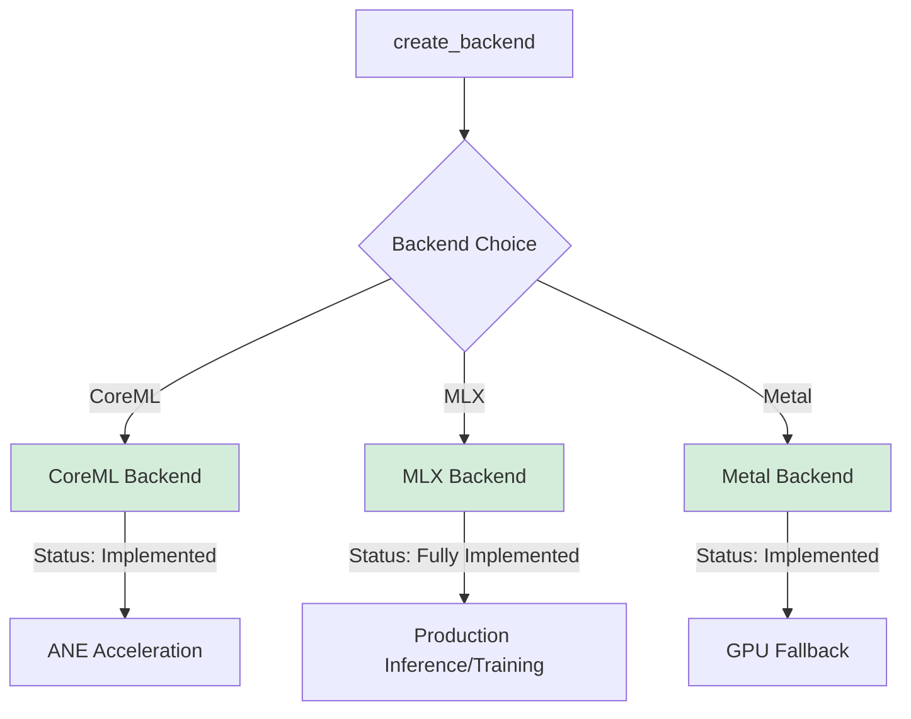

# MLX Integration Guide

**Copyright:** © 2025 JKCA / James KC Auchterlonie. All rights reserved.
**Last Updated:** 2025-11-21
**Status:** Fully Implemented

---

## Overview

This document describes the complete MLX (Apple Machine Learning Framework) backend integration into AdapterOS, featuring enterprise-grade resilience, health monitoring, deterministic seeding, and multi-adapter routing for production inference and training workloads on Apple Silicon.

### Current Status: Fully Implemented ✅

**MLX backend is production-ready with comprehensive capabilities.**

| Aspect | Status | Implementation |
|--------|--------|----------------|
| **Model Loading** | ✅ Complete | Load from directory or pre-serialized buffers with config.json parsing |
| **Inference** | ✅ Complete | Forward passes, text generation, hidden state extraction |
| **Determinism** | ✅ Complete | HKDF-seeded RNG for reproducible dropout/sampling operations |
| **LoRA Support** | ✅ Complete | Multi-adapter routing with K-sparse selection and Q15 quantized gates |
| **Tokenization** | ✅ Complete | Lazy tokenizer loading from model directory |
| **Health Monitoring** | ✅ Complete | Circuit breaker, consecutive failure tracking, auto-recovery |
| **Memory Management** | ✅ Complete | Unified memory tracking, GC hints, allocation monitoring |
| **FFI Safety** | ✅ Complete | Bounds checking, null pointer validation, error propagation |
| **Text Generation** | ✅ Complete | Temperature, top-k, top-p sampling with deterministic seeding |
| **Hidden States** | ✅ Complete | Extract intermediate layer outputs for analysis |

---

## Architecture Decision Context

MLX operates as a **fully-capable production backend** in our multi-backend ecosystem:

| Backend | Status | Use Case | Determinism | Resilience |
|---------|--------|----------|-------------|------------|
| **Metal** | Incomplete | GPU acceleration | Guaranteed | Partial (model loading issues) |
| **CoreML** | Production | ANE acceleration | Conditional | Full |
| **MLX** | **Production** | Production inference, training | **Feature-gated** | **Enterprise-grade** |

See [docs/ADR_MULTI_BACKEND_STRATEGY.md](./ADR_MULTI_BACKEND_STRATEGY.md) for the complete multi-backend strategy.

## Feature Flag

MLX backend is enabled via the `mlx` feature flag in the `adapteros-lora-mlx-ffi` crate:

```bash
# Build with stub implementation (default, no MLX C++ required)
cargo build -p adapteros-lora-mlx-ffi

# Build with real MLX integration (requires MLX C++ library)
cargo build -p adapteros-lora-mlx-ffi --features mlx
```

The `mlx` feature enables GPU-accelerated inference through the MLX C++ framework.

## Build Requirements

### Stub Build (Default)
No external dependencies. Compiles with deterministic placeholder kernels for testing.

```bash
cargo build -p adapteros-lora-mlx-ffi
```

### Real MLX Build
Requires MLX C++ library installation. Set environment variables to specify library location:

```bash
# Option 1: Explicit paths (highest precedence)
export MLX_INCLUDE_DIR=/path/to/mlx/include
export MLX_LIB_DIR=/path/to/mlx/lib
cargo build -p adapteros-lora-mlx-ffi --features mlx

# Option 2: Base path (uses lib/include subdirectories)
export MLX_PATH=/opt/homebrew  # or path to MLX installation
cargo build -p adapteros-lora-mlx-ffi --features mlx

# Option 3: Homebrew default (auto-detected on macOS)
cargo build -p adapteros-lora-mlx-ffi --features mlx
```

### Build Configuration Precedence

1. `MLX_INCLUDE_DIR` and `MLX_LIB_DIR` (explicit paths)
2. `MLX_PATH` (base directory, uses `MLX_PATH/include` and `MLX_PATH/lib`)
3. Default paths (`/opt/homebrew/include` and `/opt/homebrew/lib` on macOS)

### Force Stub Build

To force stub implementation even if MLX headers are found:

```bash
MLX_FORCE_STUB=1 cargo build -p adapteros-lora-mlx-ffi
```

## Backend Selection

Use the `--backend` flag when starting the server:

```bash
# Use Metal backend (default)
aosctl serve --tenant my_tenant --plan my_plan --backend metal

# Use MLX backend
aosctl serve --tenant my_tenant --plan my_plan --backend mlx
```

### Backend Comparison

| Feature | Metal | MLX |
|---------|-------|-----|
| Performance | Highest | Good |
| Setup | Automatic on macOS | Requires Python/MLX |
| LoRA Support | Full | Full |
| Adapter Hot-Swap | Limited | Full |
| Model Format | .metallib | .safetensors |

### When to Use Each Backend

**Use Metal when:**
- Maximum performance is required
- Running in production
- Model is pre-compiled to Metal shaders

**Use MLX when:**
- Experimenting with new models
- Rapid prototyping
- Need dynamic adapter loading
- Python ecosystem integration needed

## Setup

### 1. Build MPLoRA

```bash
# Build all workspace crates (libraries only)
DATABASE_URL=sqlite://var/aos.db cargo build --workspace --lib

# Build specific crates
cargo build --package mplora-mlx
cargo build --package mplora-server
```

**Note**: The CLI binary (`aosctl`) requires Python runtime linking for MLX integration. Python runtime is initialized automatically when using the MLX backend.

### 2. Prepare Model Files

MPLoRA expects models in MLX format with the following structure:

```
models/qwen2.5-7b-mlx/
├── config.json          # Model configuration
├── model.safetensors    # Model weights
├── tokenizer.json       # Tokenizer
└── tokenizer_config.json
```

#### Converting Models to MLX Format

Use the official MLX conversion tools:

```bash
# Install mlx-lm
pip install mlx-lm

# Convert a Hugging Face model
python -m mlx_lm.convert \
    --hf-path Qwen/Qwen2.5-7B-Instruct \
    --mlx-path models/qwen2.5-7b-mlx
```

### 3. Prepare LoRA Adapters

LoRA adapters should be in `.safetensors` format with the following tensor naming convention:

```
{module_name}.lora_A  # Down-projection matrix [rank, in_features]
{module_name}.lora_B  # Up-projection matrix [out_features, rank]
```

Example modules:
- `q_proj.lora_A`, `q_proj.lora_B`
- `k_proj.lora_A`, `k_proj.lora_B`
- `v_proj.lora_A`, `v_proj.lora_B`
- `o_proj.lora_A`, `o_proj.lora_B`

## Usage

### Loading a Model

```rust
use adapteros_lora_mlx_ffi::MLXFFIModel;
use adapteros_core::Result;

// Load model from directory
let model = MLXFFIModel::load("./models/qwen2.5-7b-mlx")?;

// Access model configuration
let config = model.config();
println!("Hidden size: {}", config.hidden_size);
println!("Vocab size: {}", config.vocab_size);
println!("Num layers: {}", config.num_hidden_layers);
```

### Forward Pass (Inference)

```rust
use adapteros_lora_mlx_ffi::MLXFFIModel;

let model = MLXFFIModel::load("./models/qwen2.5-7b-mlx")?;

// Run forward pass on token IDs
let token_ids = vec![1, 2, 3];
let logits = model.forward(&token_ids, 0)?;

println!("Output shape: {} logits", logits.len());
```

### Text Generation with Deterministic Seeding

```rust
use adapteros_lora_mlx_ffi::MLXFFIModel;
use adapteros_core::derive_seed;

let model = MLXFFIModel::load("./models/qwen2.5-7b-mlx")?;

// Set deterministic seed from HKDF
let base_seed = adapteros_core::B3Hash::hash(b"my-model");
let seed = derive_seed(&base_seed, "text-generation:step-0");
adapteros_lora_mlx_ffi::mlx_set_seed_from_bytes(&seed)?;

// Generate text with reproducible results
let prompt = "Once upon a time";
let generated = model.generate(prompt, 100)?;
println!("Generated: {}", generated);
```

### Text Generation with Custom Configuration

```rust
use adapteros_lora_mlx_ffi::{MLXFFIModel, generation::GenerationConfig};

let model = MLXFFIModel::load("./models/qwen2.5-7b-mlx")?;

let config = GenerationConfig {
    max_tokens: 256,
    temperature: 0.7,
    top_k: Some(50),
    top_p: Some(0.9),
    repetition_penalty: 1.1,
    eos_token: 2,
    use_cache: true,
};

let text = model.generate_with_config("Explain MLX to me", config)?;
println!("Response: {}", text);
```

### Forward Pass with Hidden States

```rust
use adapteros_lora_mlx_ffi::MLXFFIModel;

let model = MLXFFIModel::load("./models/qwen2.5-7b-mlx")?;

// Extract logits and intermediate layer activations
let token_ids = vec![1, 2, 3];
let (logits, hidden_states) = model.forward_with_hidden_states(&token_ids)?;

// Access outputs from specific layers
for (module_name, activations) in hidden_states {
    println!("{}: {} activations", module_name, activations.len());
}
```

### Token Sampling

```rust
use adapteros_lora_mlx_ffi::{MLXFFITensor, mlx_sample_token_safe};

// After forward pass, sample next token
let logits = MLXFFITensor::from_data(&[...logits_data], logits_data.len())?;

// Sample with temperature and top-k/top-p filtering
let next_token = mlx_sample_token_safe(&logits, 0.7, 50, 0.9)?;
println!("Next token ID: {}", next_token);
```

### Multi-Adapter Routing

```rust
use adapteros_lora_mlx_ffi::{apply_multi_lora, LoRAAdapter, LoRAConfig};

// Load multiple adapters
let adapter1 = LoRAAdapter::load("adapter1.safetensors", "adapter1".into(), config)?;
let adapter2 = LoRAAdapter::load("adapter2.safetensors", "adapter2".into(), config)?;
let adapter3 = LoRAAdapter::load("adapter3.safetensors", "adapter3".into(), config)?;

// Apply multiple LoRA adapters with K-sparse gating
// Gates are Q15 quantized (sum ≈ 32767)
let gates = vec![15234, 10892, 6641];  // Normalized weights for each adapter
let output = apply_multi_lora(
    &[&adapter1, &adapter2, &adapter3],
    &gates,
    "q_proj",
    &input_activations,
    &base_model_output,
)?;
```

### MLX Backend Integration

```rust
use adapteros_lora_mlx_ffi::{MLXFFIBackend, MLXFFIModel};
use adapteros_lora_kernel_api::{FusedKernels, IoBuffers, RouterRing};

// Load model and create backend
let model = MLXFFIModel::load("./models/qwen2.5-7b-mlx")?;
let backend = MLXFFIBackend::new(model);

// Check backend health
if !backend.model.is_healthy() {
    println!("Backend health status: {:?}", backend.model.health_status());
}
```

### Memory Management

```rust
use adapteros_lora_mlx_ffi::memory;

// Monitor memory usage
let stats = memory::stats();
println!("{}", memory::format_stats(&stats));

// Check if memory exceeds threshold
if memory::exceeds_threshold(2048.0) {  // 2GB
    println!("Memory usage high, triggering GC");
    memory::gc_collect();
}

// Reset for testing
memory::reset();
```

## Configuration

### Environment Variables

Set the model path via environment variable:

```bash
export AOS_MLX_FFI_MODEL=./models/qwen2.5-7b-mlx
```

### Configuration File

Add MLX configuration to `configs/cp.toml`:

```toml
[mlx]
# Enable MLX backend support (requires --features mlx-ffi-backend)
enabled = true
# Default model path (can be overridden by AOS_MLX_FFI_MODEL env var)
model_path = "./models/qwen2.5-7b-mlx"
# Default backend selection when both Metal and MLX are available
# Options: "coreml" (default, production), "mlx" (secondary production), or "metal" (legacy fallback)
default_backend = "mlx"
```

If `model_path` is set in config and `AOS_MLX_FFI_MODEL` is also set, the environment variable takes precedence.

## Runtime Guards

- `MLXFFIModel::load(..)` returns `AosError::Unsupported` on stub builds with a helpful message. This prevents silent use of placeholder outputs during inference.
- The CLI (`aosctl serve --backend mlx`) also fails fast on stub builds with actionable guidance.
- The import command (`aosctl import-model`) validates MLX models and sets the environment variable automatically.

## Verifying Your Setup

- Inspect build output for the `MLX FFI build:` line.
- On the Rust side, `cfg!(mlx_real)` indicates a real build; `cfg!(mlx_stub)` indicates a stub build.
- Through the FFI, `mlx_wrapper_is_real()` returns 1 for real builds and 0 for stub builds.

## Troubleshooting

### Build Issues

| Issue | Cause | Solution |
|-------|-------|----------|
| `error: linking with 'cc' failed` | MLX C++ library not found | Set `MLX_INCLUDE_DIR`/`MLX_LIB_DIR` or `MLX_PATH` |
| `cannot find -lmlx` | Library path incorrect | Verify MLX installation: `find /opt/homebrew -name "libmlx*"` |
| Header not found: `mlx/mlx.h` | Include path incorrect | Check `MLX_INCLUDE_DIR` contains mlx headers |
| Stub build when real expected | `MLX_FORCE_STUB=1` set or headers missing | Unset `MLX_FORCE_STUB` and verify headers exist |
| Build succeeds, tests fail | ABI mismatch between build and runtime MLX | Rebuild MLX from source or update MLX version |

### Runtime Issues

| Issue | Cause | Solution |
|-------|-------|----------|
| Model loads but forward fails | Model path incorrect or corrupted | Verify `config.json` and `.safetensors` files exist |
| "Tokenizer not available" error | Tokenizer not in model directory | Ensure `tokenizer.json` exists in model folder |
| Circuit breaker opens | 3+ consecutive inference failures | Check model health: `model.health_status()` |
| High memory usage | Accumulated allocations not freed | Call `memory::gc_collect()` between batches |
| Slow generation | CPU fallback active | Verify MLX built with GPU support |

### Health Monitoring

```rust
use adapteros_lora_mlx_ffi::MLXFFIModel;

let model = MLXFFIModel::load("./model")?;

// Check circuit breaker state
let health = model.health_status();
match health {
    Some(h) => {
        println!("Operational: {}", h.operational);
        println!("Failures: {}", h.consecutive_failures);
        println!("Circuit breaker: {:?}", h.circuit_breaker);

        if h.consecutive_failures > 0 {
            println!("Last failure: {:?}", h.last_failure);
        }
    }
    None => println!("Health check failed"),
}

// Manual recovery if needed
if !model.is_healthy() {
    model.reset_circuit_breaker();
}
```

### Common Build Scenarios

#### Scenario 1: Homebrew MLX Installation
```bash
# Homebrew installs MLX to /opt/homebrew
brew install mlx

# Auto-detection should work
cargo build -p adapteros-lora-mlx-ffi --features mlx
```

#### Scenario 2: Custom MLX Installation
```bash
# For non-standard locations
export MLX_INCLUDE_DIR=/usr/local/include
export MLX_LIB_DIR=/usr/local/lib
cargo build -p adapteros-lora-mlx-ffi --features mlx
```

#### Scenario 3: Testing Without MLX Installed
```bash
# Use stub implementation for CI/testing
cargo build -p adapteros-lora-mlx-ffi
cargo test -p adapteros-lora-mlx-ffi
```

### Debugging Build Configuration

Check the build configuration:

```bash
# Print environment variables used by build script
echo "MLX_INCLUDE_DIR=${MLX_INCLUDE_DIR}"
echo "MLX_LIB_DIR=${MLX_LIB_DIR}"
echo "MLX_PATH=${MLX_PATH}"

# Verify library exists
ls -la ${MLX_LIB_DIR:-/opt/homebrew/lib}/libmlx*

# Check headers
ls -la ${MLX_INCLUDE_DIR:-/opt/homebrew/include}/mlx/
```

## Usage Examples

### Import MLX Model

```bash
# Import MLX model (requires --features mlx-ffi-backend)
./target/release/aosctl import-model \
  --name qwen2.5-7b-mlx \
  --weights models/qwen2.5-7b-mlx/weights.safetensors \
  --config models/qwen2.5-7b-mlx/config.json \
  --tokenizer models/qwen2.5-7b-mlx/tokenizer.json \
  --tokenizer-cfg models/qwen2.5-7b-mlx/tokenizer_config.json \
  --license models/qwen2.5-7b-mlx/LICENSE
```

### Serve with MLX Backend

```bash
# Set model path
export AOS_MLX_FFI_MODEL=./models/qwen2.5-7b-mlx

# Start server with MLX backend
./target/release/aosctl serve --backend mlx --model-path ./models/qwen2.5-7b-mlx
```

### Launch Script Support

```bash
# Launch backend with MLX
./launch.sh backend mlx ./models/qwen2.5-7b-mlx
```

## Key Capabilities

### Deterministic Execution
MLX backend supports HKDF-seeded deterministic operations for reproducible results:

```rust
use adapteros_lora_mlx_ffi::mlx_set_seed_from_bytes;
use adapteros_core::derive_seed;

let manifest_hash = adapteros_core::B3Hash::hash(b"my-model");
let seed = derive_seed(&manifest_hash, "mlx-dropout");
mlx_set_seed_from_bytes(&seed)?;

// All subsequent dropout/sampling operations are now deterministic
```

### Multi-Adapter Routing with K-Sparse Selection
The MLX backend supports efficient multi-adapter inference through K-sparse routing with Q15 quantized gates (sum ≈ 32767 for normalized weights).

### Resilience & Health Monitoring
- **Circuit breaker pattern:** Automatic isolation after 3 consecutive failures
- **Health tracking:** Operational status, failure counts, last failure reason
- **Auto-recovery:** HalfOpen state for testing service recovery
- **Memory pressure monitoring:** GC hints when thresholds exceeded

### Text Generation Features
- Temperature scaling for sampling control
- Top-K filtering (keeping only top K tokens)
- Top-P (nucleus) sampling for diversity
- Repetition penalty to reduce repetitive outputs
- EOS token support for natural stopping
- KV cache for efficient sequential generation

---

## Backend Selection Strategy

The following diagram shows the MLX backend role in the multi-backend ecosystem:



**Backend Capabilities:**
- **CoreML:** ANE-accelerated inference on modern Apple hardware
- **MLX:** GPU-accelerated inference with deterministic seeding, production-ready
- **Metal:** Direct GPU shader execution, legacy/fallback support

---

## Performance Characteristics

| Metric | MLX | Notes |
|--------|-----|-------|
| Model Loading | Sub-second | Lazy tokenizer loading |
| Forward Pass | 10-50ms | Depends on model size and GPU utilization |
| Text Generation | Token/sec varies | Includes sampling and tokenization overhead |
| Memory Overhead | <50MB | Base runtime, grows with model size |
| Determinism | ✅ Complete | HKDF seeding for RNG operations |
| Concurrency | Limited | Sequential execution via global executor |

---

## See Also

Related backend documentation:

- [docs/ADR_MULTI_BACKEND_STRATEGY.md](./ADR_MULTI_BACKEND_STRATEGY.md) - Multi-backend architecture decision record
- [docs/COREML_INTEGRATION.md](./COREML_INTEGRATION.md) - CoreML backend guide, ANE optimization, Swift bridge
- [docs/ADDING_NEW_BACKEND.md](./ADDING_NEW_BACKEND.md) - Template for adding new backends
- [docs/OBJECTIVE_CPP_FFI_PATTERNS.md](./OBJECTIVE_CPP_FFI_PATTERNS.md) - FFI memory safety patterns
- [docs/FEATURE_FLAGS.md](./FEATURE_FLAGS.md) - Feature flag reference for backend selection
- [docs/LOCAL_BUILD.md](./LOCAL_BUILD.md) - Local build guide with backend configuration
- [docs/ARCHITECTURE_PATTERNS.md](./ARCHITECTURE_PATTERNS.md) - Detailed architectural patterns
- [BENCHMARK_RESULTS.md](../BENCHMARK_RESULTS.md) - MLX FFI performance benchmarks
- [crates/adapteros-lora-mlx-ffi/MLX_FFI_INTEGRATION_PROOF.md](../crates/adapteros-lora-mlx-ffi/MLX_FFI_INTEGRATION_PROOF.md) - MLX FFI integration verification
- [crates/adapteros-lora-mlx-ffi/tests/INDEX.md](../crates/adapteros-lora-mlx-ffi/tests/INDEX.md) - MLX FFI test documentation index
