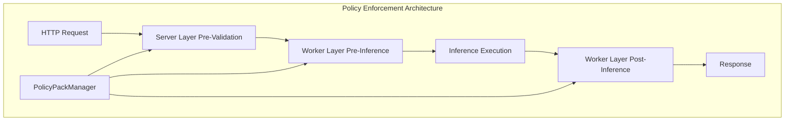

# adapterOS Policy Packs

**Document Version:** 2.0
**Last Updated:** 2025-12-11
**Status:** Production Ready
**Maintained by:** adapterOS Policy Team

---

## Table of Contents

1. [Overview](#overview)
2. [Policy Registry](#policy-registry)
3. [The 28 Canonical Policy Packs](#the-28-canonical-policy-packs)
4. [Policy Enforcement Architecture](#policy-enforcement-architecture)
5. [Policy Enforcement Middleware](#policy-enforcement-middleware)
6. [Development Bypass Policy](#development-bypass-policy)
7. [Configuration](#configuration)
8. [Testing](#testing)
9. [Troubleshooting](#troubleshooting)
10. [API Reference](#api-reference)

---

## Overview

adapterOS implements a comprehensive policy enforcement system with 25 canonical policy packs that govern all aspects of system behavior. Policy enforcement happens at multiple layers throughout the request lifecycle, ensuring security, performance, and operational compliance.

### Policy Enforcement Layers



### Key Policy Principles

- **Zero Egress:** No data exfiltration during serving
- **Determinism:** Identical inputs produce identical outputs
- **Tenant Isolation:** Strict per-tenant data boundaries
- **Evidence-Based:** All answers cite sources or abstain
- **Performance Bounded:** Ensure serving stays snappy
- **Audit Everything:** Comprehensive logging without disk melt

---

## Policy Registry

The policy registry contains exactly 25 policy packs, each with:

- **ID**: Unique identifier (`PolicyId`, legacy `PolicyPackId` in pack manager)
- **Name**: Human-readable name
- **Description**: Purpose and scope
- **Severity**: Enforcement level (Critical, High, Medium, Low)
- **Implementation Status**: Whether the policy is implemented

Canonical registry definitions live in `crates/adapteros-policy/src/registry.rs` with implementations in `crates/adapteros-policy/src/packs/`; the legacy pack manager remains in `crates/adapteros-policy/src/policy_packs.rs`.

---

## The 28 Canonical Policy Packs

### Core Security Policies (Critical Severity)

#### 1. Egress Policy
**Status:** ✅ Implemented

**Purpose:** Zero data exfiltration during serving

**Rules:**
- No network access from worker processes during inference
- UDS-only communication between control plane and workers
- Packet filter (PF) rules deny all network traffic from workers
- DNS resolution blocked during serving

**Enforcement:**
```rust
// Example violation
if worker_has_network_access() {
    return PolicyViolation {
        policy_pack: "Egress",
        severity: Critical,
        message: "Network access forbidden during inference",
        remediation: Some("Disable network access or use UDS-only mode"),
    };
}
```

#### 2. Determinism Policy
**Status:** ✅ Implemented

**Purpose:** Identical inputs produce identical outputs

**Rules:**
- All randomness derived from HKDF with domain separation
- Never use `rand::thread_rng()` directly
- Seeding from manifest hash in deterministic contexts
- Canonical JSON serialization for all state
- No `println!` in production code (use tracing instead)

**Verification:**
```rust
// Deterministic RNG
let seed = derive_seed("router", &manifest_hash);
let mut rng = ChaCha20Rng::from_seed(seed);

// Deterministic serialization
let json = serde_json::to_string_pretty(&state)?;
```

#### 8. Isolation Policy
**Status:** ✅ Implemented

**Purpose:** Process, file, and key isolation

**Rules:**
- Each tenant gets unique UID/GID on worker processes
- No shared memory between tenants
- File system isolation via chroot or namespaces
- Key material isolated per tenant in keychain
- Database queries always scoped to `tenant_id`

**Enforcement:**
```rust
// Tenant isolation check
if !claims.tenant_id.eq(&resource.tenant_id) && !is_admin(&claims) {
    return Err(SecurityError::TenantIsolationViolation);
}
```

#### 14. Secrets Policy
**Status:** ✅ Implemented

**Purpose:** Kill plaintext secrets and drift

**Rules:**
- No plaintext secrets in configuration files
- All secrets stored in OS keychain or environment variables
- Secret zeroization on drop (via `ZeroizeOnDrop` trait)
- No secrets in logs or error messages
- Secrets never serialized

**Verification:**
```rust
impl ZeroizeOnDrop for SecretKey<N> {}

// Error messages must not leak secrets
#[error("Decryption failed")]  // ✅ Generic
#[error("Decryption failed: {secret}")]  // ❌ Leaks secret
```

### Operational Policies (High Severity)

#### 3. Router Policy
**Status:** ✅ Implemented

**Purpose:** Predictable, bounded adapter mixing

**Rules:**
- K-sparse routing with configurable K (default: 8)
- Q15 quantization for adapter gates (denominator = 32767.0, NOT 32768)
- Deterministic routing with sorted adapter scores
- Tie-breaking by adapter index (ascending)
- No NaN or Inf in routing scores

**Implementation:**
```rust
// Q15 quantization
let gate_f32 = q15_value as f32 / 32767.0;  // Critical: 32767, not 32768

// Deterministic sorting
adapters.sort_by(|a, b| {
    b.score.partial_cmp(&a.score)
        .unwrap_or(std::cmp::Ordering::Equal)
        .then_with(|| a.index.cmp(&b.index))
});
```

#### 4. Evidence Policy
**Status:** ✅ Implemented

**Purpose:** Answers cite sources or abstain

**Rules:**
- Open-book mode: require RAG spans in responses
- Minimum span count per response (configurable, default: 3)
- Span provenance tracked in telemetry
- Abstention preferred over hallucination
- Evidence must be verifiable against RAG index

**Configuration:**
```toml
[policies.evidence]
require_open_book = true
min_spans = 3
allow_abstention = true
```

#### 5. Refusal Policy
**Status:** ✅ Implemented

**Purpose:** Safe no-answer behavior without hallucination

**Rules:**
- Explicit refusal messages for out-of-scope queries
- No fabrication when evidence is insufficient
- Refusals logged with context for audit
- User-facing refusal messages are polite and informative

**Example Refusal:**
```
I don't have sufficient information to answer that question accurately.
Based on the available data, I can only confirm [partial information].
```

#### 6. Numeric Policy
**Status:** ✅ Implemented

**Purpose:** Prevent unit errors and fabricated numbers

**Rules:**
- All numeric outputs include units
- Unit conversions must be explicit and logged
- No bare numbers in responses (e.g., "42" → "42 milliseconds")
- Numeric precision appropriate to context

#### 7. RAG Policy
**Status:** ✅ Implemented

**Purpose:** Strict per-tenant data boundaries

**Rules:**
- RAG indices isolated per tenant
- No cross-tenant document access
- Document IDs include tenant prefix
- RAG queries scoped to tenant's index partition

#### 9. Telemetry Policy
**Status:** ✅ Implemented

**Purpose:** Observability for audit without disk melt

**Rules:**
- Structured logging via `tracing` (not `println!`)
- Log levels: ERROR for violations, WARN for anomalies, INFO for normal ops
- Telemetry batching to reduce I/O
- Retention policies to prevent disk exhaustion
- Sampling for high-frequency events

#### 10. Retention Policy
**Status:** ✅ Implemented

**Purpose:** Bounded storage and auditability

**Rules:**
- Audit logs retained for 90 days (configurable)
- Old adapters evicted based on LRU policy
- Telemetry data aggregated after 30 days
- Storage quotas enforced per tenant

#### 11. Performance Policy
**Status:** ✅ Implemented

**Purpose:** Ensure serving stays snappy

**Rules:**
- Inference latency < 500ms (p99)
- Request timeout: 30 seconds
- Worker memory usage < 80% of available
- KV cache hit rate > 80%

#### 12. Memory Policy
**Status:** ✅ Implemented

**Purpose:** Avoid OOM, avoid thrash, keep quality

**Rules:**
- Memory headroom: always keep at least 15% free
- OOM prevention: reject requests when memory low
- Graceful degradation: reduce KV cache size if needed
- No memory leaks: all allocations tracked

### Compliance Policies (Medium Severity)

#### 13. Artifacts Policy
**Status:** ✅ Implemented

**Purpose:** Know exactly what you're running

**Rules:**
- All adapters have manifest with BLAKE3 hash
- Manifest includes model, training dataset, hyperparameters
- No shadow adapters (undocumented or unsigned)
- Provenance tracked in database

#### 15. BuildRelease Policy
**Status:** ✅ Implemented

**Purpose:** No YOLO merges, no shadow kernels

**Rules:**
- All code changes require pull request
- CI/CD must pass before merge
- No direct commits to `main` branch
- Metal kernels must be signed in manifest

#### 16. Compliance Policy
**Status:** ✅ Implemented

**Purpose:** Auditors get hashes, not hand-waving

**Rules:**
- All operations logged with BLAKE3 hashes
- Audit trail immutable and cryptographically signed
- Compliance reports generated on demand
- External auditors can verify hash chains

#### 17. Incident Policy
**Status:** ✅ Implemented

**Purpose:** Predictable, documented reactions under stress

**Rules:**
- Incident response procedures documented
- Automated failover for critical components
- Graceful degradation under load
- Post-incident reviews required

#### 18. Output Policy
**Status:** ✅ Implemented

**Purpose:** Outputs are parsable, attributable, and not loose

**Rules:**
- All outputs include attribution metadata
- Structured output formats preferred
- Streaming responses must be valid at each chunk
- Output validation before returning to user

#### 19. Adapters Policy
**Status:** ✅ Implemented

**Purpose:** Control sprawl and ensure adapters are useful

**Rules:**
- Adapters must be registered before use
- Unused adapters evicted after 30 days
- Adapter versions tracked
- Deprecated adapters marked and eventually removed

#### 20. Deterministic I/O Policy
**Status:** ✅ Implemented

**Purpose:** Deterministic I/O for reproducible execution

**Rules:**
- File reads/writes go through hashed wrappers
- No wall-clock time in deterministic contexts
- Network I/O stubbed or blocked during deterministic execution

#### 21. Drift Policy
**Status:** ✅ Implemented

**Purpose:** Detect and verify environment drift

**Rules:**
- Environment fingerprint computed on boot
- Drift recorded with cryptographic verification
- Fail or warn based on drift severity and policy config

#### 22. DIR/MPLoRA Policy
**Status:** ✅ Implemented

**Purpose:** Enforce multi-path LoRA constraints in DIR

**Rules:**
- Enforce orthogonal multi-path adapter constraints
- Validate shared downsample and merge paths
- Reject invalid MPLoRA composition

#### 23. Naming Policy
**Status:** ✅ Implemented

**Purpose:** Enforce adapter and stack naming conventions

**Rules:**
- Names follow canonical tenant/domain/purpose format
- Reserved namespaces are blocked
- Hierarchy and lineage are validated

#### 24. Dependency Security Policy
**Status:** ✅ Implemented

**Purpose:** Prevent vulnerable dependencies from shipping

**Rules:**
- Dependencies validated against CVE data
- High-severity vulnerabilities block promotion by default
- Vulnerability cache maintained for offline validation

#### 25. Circuit Breaker Policy
**Status:** ✅ Implemented

**Purpose:** Bound failure impact with circuit breakers

**Rules:**
- Service calls use configured breaker thresholds
- Open/half-open recovery paths are deterministic
- Fault trends recorded for audit

---

## Policy Enforcement Architecture

### PolicyPackManager

The `PolicyPackManager` is the central coordinator for all policy packs. It:

- Maintains registry of all 25 policy pack validators
- Manages policy pack configurations (enabled/disabled, enforcement levels)
- Validates requests against all active policy packs
- Implements the `PolicyEnforcer` trait for unified enforcement interface

**Location:** `crates/adapteros-policy/src/policy_packs.rs`

### PolicyEngine

The `PolicyEngine` wraps `PolicyPackManager` and integrates with manifest-based policies:

- Configures pack manager from manifest `Policies`
- Provides backward-compatible interface for legacy code
- Delegates enforcement to `PolicyPackManager`

**Location:** `crates/adapteros-policy/src/lib.rs`

### Enforcement Flow

```
Request → Server Policy Validation → Worker Pre-Inference Validation →
Inference Execution → Worker Post-Inference Validation → Response
```

At each stage, the `PolicyPackManager` validates the operation:

1. **Server Layer**: Pre-request validation before forwarding to workers
2. **Worker Pre-Inference**: Validation before starting inference
3. **Worker Post-Inference**: Output validation before returning response

### Enforcement Levels

Each policy pack has an enforcement level that determines how violations are handled:

| Level | Behavior | Example |
|-------|----------|---------|
| **Info** | Log only, never block | Performance metrics below optimal |
| **Warning** | Log, block only if severity is Error/Critical/Blocker | Memory usage high but not critical |
| **Error** | Log and block if severity is Error/Critical/Blocker | Missing required evidence spans |
| **Critical** | Log and always block | Network access during inference (Egress) |

### Severity Handling

| Severity | Action | HTTP Response |
|----------|--------|---------------|
| Info | Log only | ✅ 200 OK (allowed) |
| Warning | Log only | ✅ 200 OK (allowed) |
| Error | Block request | ❌ 403 Forbidden |
| Critical | Block request | ❌ 403 Forbidden |
| Blocker | Block request | ❌ 403 Forbidden |

### Performance Optimizations

#### Short-Circuiting

Validation stops early when a critical blocker violation is found that would block the request regardless of other packs. This reduces latency for clearly invalid requests.

#### Validation Order

Policy packs are validated in registration order. Critical packs (Egress, Determinism, Isolation) are validated early to catch blockers quickly.

---

## Policy Enforcement Middleware

### Overview

The policy enforcement middleware validates all HTTP requests against applicable policy packs to ensure compliance before operations execute.

### Middleware Flow

```
HTTP Request
    ↓
[API Logger] ← Outermost
    ↓
[Drain Middleware] ← Reject during shutdown
    ↓
[Request Tracking] ← Track in-flight requests
    ↓
[Client IP] ← Extract client IP
    ↓
[Request ID] ← Generate/extract request ID
    ↓
[Versioning] ← API version handling
    ↓
[Caching] ← HTTP caching
    ↓
[Security Headers] ← Add security headers
    ↓
[Request Size Limit] ← Limit request size
    ↓
[Rate Limiting] ← Rate limit per tenant
    ↓
[CORS] ← CORS configuration
    ↓
[Compression] ← Response compression
    ↓
[Trace] ← Request tracing
    ↓
[Auth] ← JWT validation (for protected routes)
    ↓
[Policy Enforcement] ← **Policy validation** ✨
    ↓
[Handler] ← Route handler
```

### Request Context Extraction

The middleware extracts context from:

1. **Claims** (from auth_middleware):
   - `tenant_id` - Tenant identifier
   - `user_id` - User identifier (sub)
   - `role` - User role (admin, operator, sre, compliance, viewer)

2. **Request**:
   - `method` - HTTP method (GET, POST, PUT, DELETE)
   - `path` - Request path (e.g., `/v1/adapters/load`)
   - `request_id` - Unique request identifier

3. **Derived**:
   - `request_type` - Category of operation (Inference, AdapterOperation, etc.)
   - `operation` - Human-readable operation (e.g., "POST /v1/adapters/load")
   - `priority` - Request priority (Low, Normal, High, Critical)

### Request Type Mapping

```rust
Path Pattern                → Request Type
/v1/infer*                 → Inference
/v1/streaming/infer*       → Inference
/v1/adapters*              → AdapterOperation
/v1/adapter-stacks*        → AdapterOperation
/v1/training*              → TrainingOperation
/v1/datasets*              → TrainingOperation
/v1/policies*              → PolicyUpdate
/v1/system*                → SystemOperation
/v1/metrics*               → SystemOperation
/v1/users*                 → UserOperation
/v1/tenants*               → UserOperation
/v1/documents*             → FileOperation
/v1/collections*           → FileOperation
```

### Implementation

**File:** `crates/adapteros-server-api/src/middleware/policy_enforcement.rs`

**Key Functions:**
- `policy_enforcement_middleware()` - Main middleware function
- `determine_request_type()` - Map path to RequestType
- `determine_priority()` - Calculate request priority
- `is_blocking_severity()` - Check if violation blocks request
- `log_violation()` - Log violation with appropriate level

### Integration with Routes

Policy enforcement is applied to protected routes:

```rust
// In routes.rs
let protected_routes = Router::new()
    // ... all protected route definitions ...
    .layer(
        ServiceBuilder::new()
            .layer(middleware::from_fn_with_state(
                state.clone(),
                auth_middleware,
            ))
            .layer(middleware::from_fn(tenant_route_guard_middleware))
            .layer(middleware::from_fn(csrf_middleware))
            .layer(middleware::from_fn(context_middleware))
            .layer(middleware::from_fn_with_state(
                state.clone(),
                policy_enforcement_middleware,
            ))
            .layer(middleware::from_fn_with_state(
                state.clone(),
                audit_middleware,
            )),
    );
```

**Processing Order:**
1. Auth validates JWT and sets Claims
2. Tenant guard enforces tenant isolation
3. CSRF protection
4. Context middleware consolidates request context
5. **Policy enforcement validates against all policy packs**
6. Audit logging records the request
7. Handler executes

### Error Responses

#### Policy Violation Response

**HTTP Status:** 403 Forbidden

```json
{
  "error": "policy violation",
  "code": "POLICY_VIOLATION",
  "details": "Request violates 2 policy pack(s): Egress Ruleset: Network access forbidden during inference; Isolation Ruleset: Cross-tenant access detected"
}
```

#### Policy Evaluation Error

**HTTP Status:** 500 Internal Server Error

```json
{
  "error": "policy validation failed",
  "code": "POLICY_ERROR",
  "details": "Failed to validate request: Database connection failed"
}
```

### Logging

All policy violations are logged with structured context:

**Info Severity:**
```
INFO  policy_enforcement: Policy violation (Info)
  request_id="550e8400-e29b-41d4-a716-446655440000"
  operation="POST /v1/adapters/load"
  policy_pack="Performance Ruleset"
  violation_id="perf-001"
  message="Request may impact latency targets"
```

**Error/Critical Severity:**
```
ERROR policy_enforcement: Policy violation (Error)
  request_id="550e8400-e29b-41d4-a716-446655440000"
  operation="POST /v1/infer"
  policy_pack="Egress Ruleset"
  violation_id="egress-001"
  message="Network access forbidden during inference"
  remediation=Some("Disable network access or use UDS-only mode")
```

### Policy Hook Enforcement

Policy hooks provide fine-grained enforcement at specific lifecycle points:

**Supported Hooks:**
- `OnRequestBeforeRouting` - Before adapter selection
- `OnBeforeInference` - After routing, before inference execution
- `OnAfterInference` - After inference completes

**Implementation:**
```rust
/// Enforce policies at a specific hook for a tenant
pub async fn enforce_at_hook(
    state: &AppState,
    ctx: &HookContext,
) -> Result<Vec<PolicyDecision>, PolicyHookViolationError> {
    // 1. Query tenant's enabled policies for this hook
    // 2. Validate each enabled policy
    // 3. Log ALL decisions (allow/deny) to policy_audit_decisions
    // 4. Return error if any policy denies
}
```

---

## Development Bypass Policy

### Overview

Development bypass allows skipping authentication in development environments for rapid iteration. This is controlled via environment variables and UI settings.

### Environment Matrix

| Environment | Default | Notes |
|-------------|---------|-------|
| **Development** | ON (implicit via `import.meta.env.DEV`) | For local/reference flows only; banner shown |
| **Staging** | OFF by default | May be turned ON temporarily for reference runs; ensure banner is visible |
| **Production** | OFF | Do not enable unless explicitly approved and time-bounded |

### Backend Configuration

```bash
# Enable dev bypass (debug builds only)
AOS_DEV_NO_AUTH=1 cargo run --bin adapteros-server

# Custom JWT secret (for testing)
AOS_DEV_JWT_SECRET="my-test-secret" cargo run --bin adapteros-server
```

### Frontend Configuration

```typescript
// In UI code
const devBypassEnabled = import.meta.env.DEV ||
                         import.meta.env.VITE_ENABLE_DEV_BYPASS === 'true';

// Login with dev bypass
if (devBypassEnabled) {
    // Show banner warning user about dev mode
    showDevModeBanner();
}
```

### Security Considerations

1. **Never in Production:** Dev bypass must never be enabled in production
2. **Banner Required:** Always show a visible banner when dev bypass is active
3. **Time-Limited:** If enabled in staging, set shorter TTL (1-2 hours)
4. **Audit Trail:** All dev bypass sessions logged to audit logs
5. **Limited Scope:** Dev bypass limited to reference/admin use only

### Usage

```bash
# Frontend: Login with dev bypass
curl -X POST http://localhost:8080/v1/auth/login?dev=true \
  -H "Content-Type: application/json" \
  -d '{"email": "reference@example.com", "password": "any"}'
```

**Response includes banner flag:**
```json
{
  "token": "eyJ...",
  "dev_mode": true,
  "message": "Development mode active - authentication bypassed"
}
```

---

## Configuration

### Manifest-Based Configuration

`PolicyEngine::new(policies)` automatically configures packs from manifest:

```rust
let engine = PolicyEngine::new(manifest.policies.clone());
// Pack manager is configured with evidence.require_open_book, etc.
```

### Per-Pack Configuration

Individual policy packs can be configured:

```rust
let mut config = PolicyPackConfig {
    id: PolicyPackId::Evidence,
    version: "1.0.0".to_string(),
    config: serde_json::json!({
        "require_open_book": true,
        "min_spans": 3,
    }),
    enabled: true,
    enforcement_level: EnforcementLevel::Error,
    last_updated: Utc::now(),
};

manager.update_pack_config(PolicyPackId::Evidence, config)?;
```

### Configuration File

```toml
# configs/cp.toml

[policies]
# Egress policy
egress.enabled = true
egress.enforcement_level = "critical"

# Evidence policy
evidence.require_open_book = true
evidence.min_spans = 3
evidence.enforcement_level = "error"

# Performance policy
performance.max_latency_ms = 500
performance.enforcement_level = "warning"

# Enable/disable policy enforcement globally
enforcement_enabled = true
```

### Environment Variables

```bash
# Enable/disable policy enforcement
export AOS_POLICY_ENFORCEMENT=true

# Set enforcement level globally
export AOS_POLICY_LEVEL=error

# Enable specific policy packs
export AOS_POLICY_EGRESS=true
export AOS_POLICY_EVIDENCE=true
```

---

## Testing

### Unit Tests

Test individual policy pack validators in isolation:

```bash
# Test specific policy pack
cargo test -p adapteros-policy test_egress_policy

# Test policy manager
cargo test -p adapteros-policy test_policy_manager
```

### Integration Tests

Test full enforcement flow:

```bash
# Basic enforcement tests
cargo test -p adapteros-server-api policy_enforcement_integration

# Comprehensive tests
cargo test -p adapteros-server-api policy_enforcement_comprehensive
```

**Comprehensive tests include:**
- Enforcement level behavior
- Short-circuiting optimization
- Concurrent validation
- Error message quality
- Hook enforcement
- Violation logging

### Policy Validation Tests

```rust
#[test]
fn test_egress_policy_blocks_network() {
    let policy = EgressPolicy::new();
    let request = PolicyRequest {
        context: RequestContext {
            operation: "POST /v1/infer".to_string(),
            tenant_id: "test-tenant".to_string(),
            // ... other fields
        },
        metadata: serde_json::json!({"network_access": true}),
    };

    let result = policy.validate(&request);
    assert!(!result.valid);
    assert_eq!(result.violations.len(), 1);
    assert_eq!(result.violations[0].severity, ViolationSeverity::Critical);
}
```

### Testing with Curl

```bash
# Should succeed (no policy violations)
curl -X POST http://localhost:8080/v1/adapters/list \
  -H "Authorization: Bearer $TOKEN" \
  -H "Content-Type: application/json"

# Should fail with 403 if policy violated
curl -X POST http://localhost:8080/v1/infer \
  -H "Authorization: Bearer $TOKEN" \
  -H "Content-Type: application/json" \
  -d '{"prompt": "test", "max_tokens": 100}'
```

---

## Troubleshooting

### Common Issues

#### Policy violations blocking valid requests

**Symptoms:** Legitimate requests return 403 Forbidden

**Diagnosis:**
- Check enforcement levels: may be set too strict
- Review violation details for false positives
- Verify pack configurations match expectations

**Solution:**
```bash
# Temporarily lower enforcement level
curl -X PUT http://localhost:8080/v1/policies/evidence/config \
  -H "Authorization: Bearer $ADMIN_TOKEN" \
  -d '{"enforcement_level": "warning"}'

# Or disable specific pack temporarily
curl -X PUT http://localhost:8080/v1/policies/evidence/config \
  -H "Authorization: Bearer $ADMIN_TOKEN" \
  -d '{"enabled": false}'
```

#### Missing violations

**Symptoms:** Known violations not caught or logged

**Diagnosis:**
- Check if pack is enabled
- Verify enforcement level allows violations
- Review validator implementation

**Solution:**
```bash
# Check pack configuration
curl http://localhost:8080/v1/policies/evidence/config \
  -H "Authorization: Bearer $TOKEN"

# Enable pack if disabled
curl -X PUT http://localhost:8080/v1/policies/evidence/config \
  -H "Authorization: Bearer $ADMIN_TOKEN" \
  -d '{"enabled": true, "enforcement_level": "error"}'
```

#### Performance issues

**Symptoms:** Slow request processing, high CPU usage

**Diagnosis:**
- Ensure short-circuiting is working (check logs)
- Profile validation duration
- Check for inefficient validators

**Solution:**
```bash
# Disable non-critical packs
curl -X PUT http://localhost:8080/v1/policies/performance/config \
  -H "Authorization: Bearer $ADMIN_TOKEN" \
  -d '{"enabled": false}'

# Increase timeout for validation
export AOS_POLICY_TIMEOUT_MS=5000
```

### Debug Mode

Enable debug logging for policy enforcement:

```bash
# Set log level
export RUST_LOG=adapteros_policy=debug,adapteros_server_api=debug

# Run server
cargo run --bin adapteros-server
```

**Debug output example:**
```
DEBUG policy_enforcement: Validating request
  request_id="550e8400-e29b-41d4-a716-446655440000"
  operation="POST /v1/infer"
  tenant_id="test-tenant"

DEBUG policy_enforcement: Checking policy pack
  pack="Egress"
  enabled=true
  enforcement_level="critical"

DEBUG policy_enforcement: Policy validation complete
  pack="Egress"
  violations=0
  duration_ms=2
```

---

## API Reference

### Policy Management Endpoints

| Method | Endpoint | Description | Permission Required |
|--------|----------|-------------|---------------------|
| GET | `/v1/policies` | List all policy packs | Admin/Operator/SRE/Compliance |
| GET | `/v1/policies/:pack_id` | Get policy pack details | Admin/Operator/SRE/Compliance |
| GET | `/v1/policies/:pack_id/config` | Get policy pack configuration | Admin/SRE |
| PUT | `/v1/policies/:pack_id/config` | Update policy pack configuration | Admin |
| POST | `/v1/policies/:pack_id/validate` | Manually validate against policy | Admin/Compliance |
| GET | `/v1/policies/violations` | Query policy violations | Admin/SRE/Compliance |
| GET | `/v1/policies/violations/:id` | Get violation details | Admin/SRE/Compliance |

### Policy Pack IDs

Canonical registry (`PolicyId`, 25 packs):

| ID | Name |
|----|------|
| 1 | Egress |
| 2 | Determinism |
| 3 | Router |
| 4 | Evidence |
| 5 | Refusal |
| 6 | Numeric |
| 7 | RAG |
| 8 | Isolation |
| 9 | Telemetry |
| 10 | Retention |
| 11 | Performance |
| 12 | Memory |
| 13 | Artifacts |
| 14 | Secrets |
| 15 | Build/Release |
| 16 | Compliance |
| 17 | Incident |
| 18 | Output |
| 19 | Adapters |
| 20 | Deterministic I/O |
| 21 | Drift |
| 22 | DIR/MPLoRA |
| 23 | Naming |
| 24 | Dependency Security |
| 25 | Circuit Breaker |

Legacy API IDs (`PolicyPackId`, 20 packs):

| ID | Name | Severity |
|----|------|----------|
| `egress` | Egress Policy | Critical |
| `determinism` | Determinism Policy | Critical |
| `router` | Router Policy | High |
| `evidence` | Evidence Policy | High |
| `refusal` | Refusal Policy | High |
| `numeric` | Numeric Units Policy | Medium |
| `rag` | RAG Index Policy | High |
| `isolation` | Isolation Policy | Critical |
| `telemetry` | Telemetry Policy | Medium |
| `retention` | Retention Policy | Medium |
| `performance` | Performance Policy | High |
| `memory` | Memory Policy | High |
| `artifacts` | Artifacts Policy | Medium |
| `secrets` | Secrets Policy | Critical |
| `build_release` | Build Release Policy | Medium |
| `compliance` | Compliance Policy | Medium |
| `incident` | Incident Policy | High |
| `output` | Output Policy | Medium |
| `adapters` | Adapters Policy | Medium |
| `full_pack` | Full Pack Policy (legacy example) | Low |

### Example API Calls

#### List All Policy Packs

```bash
curl http://localhost:8080/v1/policies \
  -H "Authorization: Bearer $TOKEN"
```

**Response:**
```json
{
  "policy_packs": [
    {
      "id": "egress",
      "name": "Egress Policy",
      "description": "Zero data exfiltration during serving",
      "severity": "Critical",
      "enabled": true,
      "enforcement_level": "critical",
      "version": "1.0.0"
    },
    // ... other policy packs
  ]
}
```

#### Get Policy Pack Configuration

```bash
curl http://localhost:8080/v1/policies/evidence/config \
  -H "Authorization: Bearer $TOKEN"
```

**Response:**
```json
{
  "id": "evidence",
  "version": "1.0.0",
  "config": {
    "require_open_book": true,
    "min_spans": 3
  },
  "enabled": true,
  "enforcement_level": "error",
  "last_updated": "2025-12-11T10:00:00Z"
}
```

#### Update Policy Pack Configuration

```bash
curl -X PUT http://localhost:8080/v1/policies/evidence/config \
  -H "Authorization: Bearer $ADMIN_TOKEN" \
  -H "Content-Type: application/json" \
  -d '{
    "config": {
      "require_open_book": true,
      "min_spans": 5
    },
    "enabled": true,
    "enforcement_level": "error"
  }'
```

#### Query Policy Violations

```bash
curl "http://localhost:8080/v1/policies/violations?start_time=2025-12-01T00:00:00Z&pack_id=egress" \
  -H "Authorization: Bearer $TOKEN"
```

**Response:**
```json
{
  "violations": [
    {
      "id": "viol-001",
      "policy_pack": "Egress",
      "violation_id": "egress-001",
      "severity": "Critical",
      "message": "Network access forbidden during inference",
      "timestamp": "2025-12-11T10:30:00Z",
      "request_id": "550e8400-e29b-41d4-a716-446655440000",
      "tenant_id": "test-tenant",
      "remediation": "Disable network access or use UDS-only mode"
    }
  ]
}
```

---

## See Also

- [SECURITY.md](SECURITY.md) - Security architecture and enforcement
- [AUTHENTICATION.md](AUTHENTICATION.md) - Authentication and authorization
- [AGENTS.md](../AGENTS.md) - Developer guide and policy implementation
- [Policy Implementation](../crates/adapteros-policy/src/policy_packs.rs) - Source code

---

**Copyright:** © 2025 MLNavigator Inc / James KC Auchterlonie. All rights reserved.
