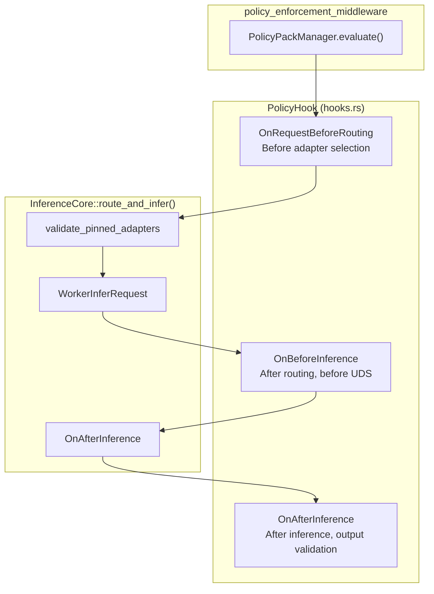

# POLICIES

30 canonical policy packs. Source: `adapteros-policy/registry.rs`, `adapteros-policy/hooks.rs`, `policy_packs.rs`.

---

## Enforcement Flow

**Hook context:** `HookContext { tenant_id, user_id, request_id, hook, resource_type, ... }`

---

## Policy Packs (PolicyId)

From `adapteros_policy::registry::PolicyId`:

| ID | Name | Domain |
|----|------|--------|
| 1 | Egress | Network egress, UDS allowlist |
| 2 | Determinism | Seed, replay |
| 3 | Router | K-sparse, adapter selection |
| 4 | Evidence | Training evidence, provenance |
| 5 | Refusal | Refusal patterns |
| 6 | Numeric | Numeric bounds |
| 7 | RAG | Retrieval, citations |
| 8 | Isolation | Tenant, process model |
| 9 | Telemetry | Event logging |
| 10 | Retention | Data retention |
| 11 | Performance | Latency, throughput |
| 12 | Memory | UMA, eviction |
| 13 | Artifacts | Build artifacts |
| 14 | Secrets | Secret handling |
| 15 | BuildRelease | Build/release gates |
| 16 | Compliance | Compliance checks |
| 17 | Incident | Incident response |
| 18 | Output | Output safety |
| 19 | Adapters | Adapter lifecycle |
| 20 | DeterministicIo | I/O determinism |
| 21 | Drift | Drift detection |
| 22 | Mplora | MoE/LoRA |
| 23 | Naming | Naming conventions |
| 24 | DependencySecurity | Dependency audit |
| 25 | CircuitBreaker | Circuit breaker |
| 26 | Capability | Capability checks |
| 27 | Language | Language constraints |
| 28 | QueryIntent | Query intent |
| 29 | LiveData | Live data handling |
| 30 | ProductionReadiness | Production gates |

---

## Isolation Pack (UDS)

From `adapteros-policy/src/packs/isolation.rs`:

- `uds_root`: `var/run/aos/<tenant>`
- `uds_paths`: `var/run/aos/<tenant>/*.sock`
- `process_model`: per_tenant

---

## Dev Bypass

`security.dev_bypass = true` or `AOS_DEV_NO_AUTH=1` skips auth; policy still runs where applicable.
