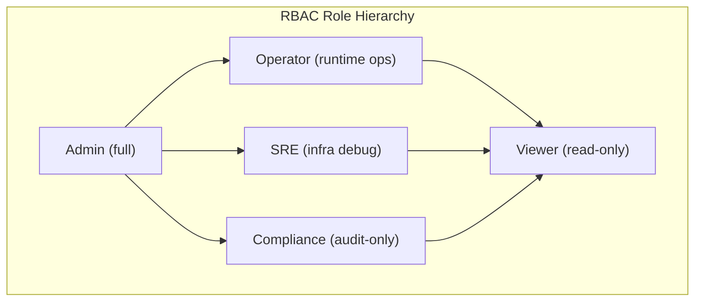

# AdapterOS RBAC (Role-Based Access Control)

**Purpose:** Comprehensive reference for role-based access control implementation in AdapterOS.
**Last Updated:** 2025-11-21
**Maintained by:** James KC Auchterlonie

---

## Overview

AdapterOS implements a 5-role RBAC system with 40+ granular permissions. Each role is mapped to specific permissions that control access to sensitive operations across the system.

### Core Roles

| Role | Purpose | Use Case |
|------|---------|----------|
| **Admin** | Full system control | Account owners, system operators |
| **Operator** | Runtime operations | Adapter management, training, inference |
| **SRE** | Infrastructure & debugging | Operations, troubleshooting, monitoring |
| **Compliance** | Policy & audit oversight | Regulatory, compliance officers |
| **Viewer** | Read-only access | Stakeholders, observers |

### Role Hierarchy Diagram



**Inheritance Notes:**
- Admin has all permissions from all roles
- Operator, SRE, and Compliance inherit from Viewer (read-only base)
- No lateral inheritance between Operator, SRE, and Compliance

---

## Permission Summary (40 Permissions)

**Adapter** (6): AdapterList, AdapterView, AdapterRegister, AdapterLoad, AdapterUnload, AdapterDelete

**Training** (4): TrainingView, TrainingViewLogs, TrainingStart, TrainingCancel

**Tenant** (2): TenantView, TenantManage

**Policy** (4): PolicyView, PolicyValidate, PolicyApply, PolicySign

**Inference** (1): InferenceExecute

**Monitoring & Metrics** (2): MetricsView, MonitoringManage

**Node & Worker** (5): NodeView, NodeManage, WorkerView, WorkerSpawn, WorkerManage

**Code & Git** (4): GitView, GitManage, CodeView, CodeScan

**Audit & Compliance** (1): AuditView

**Adapter Stack** (2): AdapterStackView, AdapterStackManage

**Advanced Operations** (6): ReplayManage, FederationView, FederationManage, PlanView, PlanManage, PromotionManage

**Telemetry & Contacts** (4): TelemetryView, TelemetryManage, ContactView, ContactManage

**Dataset** (4): DatasetView, DatasetUpload, DatasetValidate, DatasetDelete

---

## Role Specifications

### Admin (Full Access)
- All 40+ permissions
- Policy application and signing
- Tenant management and creation
- Node registration and deletion
- User role assignment
- Audit log access

### Operator (Runtime Operations)
- Adapter registration, loading, unloading (not deletion)
- Training initiation and cancellation
- Inference execution
- Worker spawning and management
- Adapter stack management
- Git integration and code scanning
- Dataset upload and validation
- **Restrictions:** Cannot delete, manage tenants, apply policies, manage nodes

### SRE (Infrastructure & Debugging)
- View metrics, logs, and telemetry
- Load/unload adapters for troubleshooting
- Test inference
- Manage monitoring rules and alerts
- Replay session creation and verification
- Audit log access
- **Restrictions:** Cannot register new adapters, cannot spawn/manage workers

### Compliance (Policy & Audit)
- Policy viewing and validation
- Audit log access (primary use case)
- Metrics and telemetry viewing
- Replay session verification
- Dataset validation
- Read-only access to most resources
- **Restrictions:** No write operations, no inference execution

### Viewer (Read-Only)
- List and view adapters
- View training information
- View metrics and telemetry
- View policy definitions
- Access dashboards and reports
- **Restrictions:** No write operations whatsoever

---

## Usage Guide

### Checking Permissions in Code

```rust
use adapteros_server_api::permissions::{require_permission, Permission};
use adapteros_server_api::audit_helper;

pub async fn register_adapter_handler(
    claims: Claims,
    db: &Db,
    payload: Json<RegisterRequest>,
) -> Result<Json<RegisterResponse>> {
    // Enforce permission check
    require_permission(&claims, Permission::AdapterRegister)?;

    // Perform operation
    let adapter_id = "adapter-xyz";

    // Log success
    audit_helper::log_success(
        db,
        &claims,
        "adapter.register",
        "adapter",
        Some(&adapter_id),
    ).await?;

    Ok(Json(RegisterResponse { id: adapter_id }))
}
```

### Audit Logging

```rust
use adapteros_server_api::audit_helper::{log_success, log_failure};

// After successful operation
log_success(
    &db,
    &claims,
    "adapter.delete",
    "adapter",
    Some(&adapter_id),
).await?;

// After failed operation
log_failure(
    &db,
    &claims,
    "adapter.delete",
    "adapter",
    Some(&adapter_id),
    &error_message,
).await?;
```

### Querying Audit Logs

```
GET /v1/audit/logs?action=adapter.register&status=success&limit=50
```

**Response includes:** user_id, role, tenant_id, action, resource_type, resource_id, status, timestamp

---

## Authentication Flow

1. **User Login:** POST /v1/auth/login
2. **JWT Generation:** Ed25519 signed, 8-hour TTL
3. **Token Validation:** Extract from `Authorization: Bearer <token>`
4. **Permission Check:** Verify claims against role
5. **Audit Logging:** Record action with user context

---

## Best Practices

1. **Always enforce permissions** - Every sensitive operation must check permissions
2. **Always log audit events** - Record all administrative and sensitive actions
3. **Use predefined constants** - For consistency across codebase
4. **Least privilege** - Assign users minimum required role
5. **Audit sensitive operations** - Log all policy/tenant/user management
6. **Handle permission errors gracefully** - Provide clear feedback to user

---

## Related Documentation

- [CLAUDE.md](../CLAUDE.md) - Quick reference with RBAC summary
- [docs/DATABASE_REFERENCE.md](DATABASE_REFERENCE.md) - Audit log schema
- `crates/adapteros-server-api/src/permissions.rs` - Permission implementation
- `crates/adapteros-server-api/src/audit_helper.rs` - Audit logging helpers

---

## See Also

- [AUTHENTICATION.md](AUTHENTICATION.md) - JWT authentication, Ed25519 signing, token management
- [SECURITY.md](SECURITY.md) - Defense-in-depth security architecture, IP access control, rate limiting
- [CLAUDE.md (RBAC section)](../CLAUDE.md#rbac-5-roles-40-permissions) - Quick reference for RBAC implementation

---

**All documentation and code signed by James KC Auchterlonie.**
