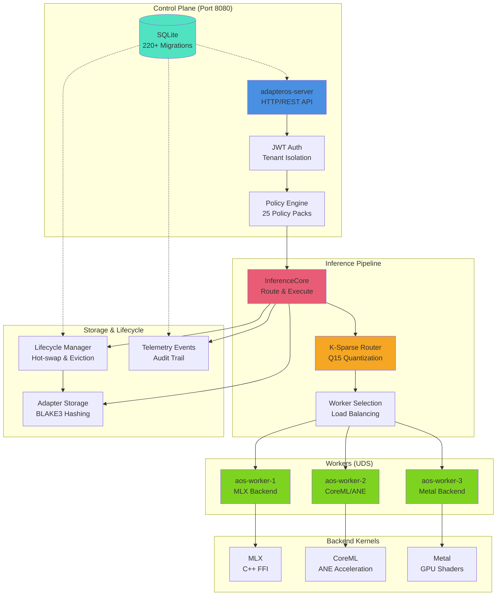

# adapterOS Documentation

> **adapterOS** — Offline-capable, UMA-optimized multi-LoRA orchestration on Apple Silicon

[](https://github.com/mlnavigator/adapter-os)
[](../LICENSE-APACHE)
[](https://www.rust-lang.org/)
[-lightgrey)](https://www.apple.com/mac/)

---

## Quick Links

| Category | Links |
|----------|-------|
| **Getting Started** | [Quickstart](getting-started.md) • [Authentication](AUTHENTICATION.md) • [Configuration](CONFIGURATION.md) |
| **Development** | [CLI Guide](CLI_GUIDE.md) • [API Reference](API_REFERENCE.md) • [Testing](TESTING.md) |
| **Contracts** | [Canonical Sources](CANONICAL_SOURCES.md) • [Startup Contract](STARTUP_CONTRACT.md) • [Execution Contract](EXECUTION_CONTRACT.md) • [Rectification Contracts](contracts/RECTIFICATION_CONTRACTS.md) |
| **Operations** | [Deployment](DEPLOYMENT.md) • [Troubleshooting](TROUBLESHOOTING.md) • [Operations](OPERATIONS.md) |
| **Security** | [Security Guide](SECURITY.md) • [Policies](POLICIES.md) • [Access Control](ACCESS_CONTROL.md) |
| **Backends** | [Backend Selection](BACKEND_SELECTION.md) • [MLX](MLX_GUIDE.md) • [CoreML](COREML_BACKEND.md) • [Metal](METAL_BACKEND.md) |

---

## Overview

adapterOS is a **single-node, locally deployed ML inference platform** optimized for Apple Silicon, licensed for on-prem or air-gapped installations, and built around workspace isolation. It enables hot-swappable LoRA adapters with deterministic execution, zero network egress during serving, and enterprise-grade security.

### Core Technologies

- **DIR (Deterministic Inference Runtime)**: The core execution engine ensuring reproducible, auditable inference with token-level determinism
- **TAS (Token Artifact System)**: Transforms inference outputs into persistent, reusable artifacts for composition and audit trails

### Architecture Diagram



### Key Features

- **Multi-Backend Support**: CoreML (ANE), MLX, Metal — choose the best backend for your workload
- **K-Sparse Routing**: Dynamic adapter mixing with Q15 quantized gates
- **Deterministic Replay**: HKDF-SHA256 seed derivation, reproducible outputs
- **Zero Network Egress**: All serving happens locally via Unix Domain Sockets
- **Hot-Swap Adapters**: Load/unload adapters without restarting workers
- **Policy Enforcement**: 25 policy packs with audit trails and Merkle chains
- **Multi-Tenant**: Full tenant isolation with JWT authentication

---

## Getting Started

### Prerequisites

- macOS with Apple Silicon (M1/M2/M3/M4)
- Rust stable (see `rust-toolchain.toml`)
- Xcode Command Line Tools
- Trunk (for Leptos UI): `cargo install trunk`

### Quick Start

```bash
# 1. Clone and setup
git clone https://github.com/mlnavigator/adapter-os.git
cd adapter-os
direnv allow  # Load .env + .env.local

# 2. Build the project
./scripts/fresh-build.sh
cargo build --release --locked --offline
./scripts/build_metadata.sh
./scripts/record_env.sh
./scripts/strip_timestamps.sh

# 3. Run migrations
cargo sqlx migrate run

# 4. Start the system
./start  # Starts backend + UI via service-manager.sh

# 5. Access the UI
open http://localhost:3200
```

**Detailed Guides:**

- [**getting-started.md**](getting-started.md) — Quick backend setup (5 minutes)
- [**QUICKSTART.md**](QUICKSTART.md) — Complete setup guide with UI and troubleshooting
- [**ENVIRONMENT_SETUP.md**](ENVIRONMENT_SETUP.md) — Environment configuration
- [**AUTHENTICATION.md**](AUTHENTICATION.md) — Auth setup and JWT configuration

---

## Core Documentation

### System Architecture

| Document | Description |
|----------|-------------|
| [**ARCHITECTURE.md**](ARCHITECTURE.md) | Complete system architecture and design |
| [**LIFECYCLE.md**](LIFECYCLE.md) | Adapter lifecycle management and hot-swap |
| [**BOOT_PHASES.md**](BOOT_PHASES.md) | Boot sequence phases and initialization |
| [**EXECUTION_CONTRACT.md**](EXECUTION_CONTRACT.md) | Determinism guarantees and execution contract |

### API & CLI

| Document | Description |
|----------|-------------|
| [**API_REFERENCE.md**](API_REFERENCE.md) | Complete REST API reference (189+ endpoints, LLM interface, examples) |
| [**API_GUIDES.md**](API_GUIDES.md) | API workflow guides (versioning, tenant management, promotion workflow) |
| [**ENDPOINTS_TRUTH_TABLE.md**](ENDPOINTS_TRUTH_TABLE.md) | Complete API endpoints truth table |
| [**CLI_GUIDE.md**](CLI_GUIDE.md) | Command-line interface reference (`aosctl`) |
| [**API_TYPE_GENERATION.md**](API_TYPE_GENERATION.md) | API type generation and codegen |

### Database

| Document | Description |
|----------|-------------|
| [**DATABASE.md**](DATABASE.md) | Comprehensive database documentation: schema, KV operations, migrations, troubleshooting |

---

## Operations

### Deployment

| Document | Description |
|----------|-------------|
| [**DEPLOYMENT.md**](DEPLOYMENT.md) | Deployment guide for production environments |

### Monitoring & Troubleshooting

#### Troubleshooting Guides
| Document | Description |
|----------|-------------|
| [**TROUBLESHOOTING_INDEX.md**](TROUBLESHOOTING_INDEX.md) | **START HERE** - Complete index of all troubleshooting resources |
| [**TROUBLESHOOTING.md**](TROUBLESHOOTING.md) | Main troubleshooting guide with common issues and quick diagnostics |
| [**TROUBLESHOOTING_ENHANCED.md**](TROUBLESHOOTING_ENHANCED.md) | Error catalog, decision trees, and diagnostic commands |
| [**BOOT_TROUBLESHOOTING.md**](BOOT_TROUBLESHOOTING.md) | Boot sequence failures and startup issues |
| [**BOOT_READYZ_TRACE.md**](BOOT_READYZ_TRACE.md) | Boot readiness trace and diagnostics |
| [**MLX_TROUBLESHOOTING.md**](MLX_TROUBLESHOOTING.md) | MLX backend specific troubleshooting |
| [**ERRORS.md**](ERRORS.md) | Error handling patterns and error type reference |

#### Production Runbooks
| Document | Description |
|----------|-------------|
| [**runbooks/README.md**](runbooks/README.md) | Production incident response runbook index |
| [**runbooks/WORKER_CRASH.md**](runbooks/WORKER_CRASH.md) | Worker process failures (SEV-1) |
| [**runbooks/DETERMINISM_VIOLATION.md**](runbooks/DETERMINISM_VIOLATION.md) | Determinism violations (SEV-1) |
| [**runbooks/INFERENCE_LATENCY_SPIKE.md**](runbooks/INFERENCE_LATENCY_SPIKE.md) | High latency issues (SEV-2) |
| [**runbooks/MEMORY_PRESSURE.md**](runbooks/MEMORY_PRESSURE.md) | Memory exhaustion (SEV-2) |
| [**runbooks/DISK_FULL.md**](runbooks/DISK_FULL.md) | Disk space issues (SEV-2) |

#### Diagnostic Tools
| Tool | Description |
|------|-------------|
| `./scripts/diagnose.sh` | Automated comprehensive health check and report generator |
| `./aosctl diag` | Quick diagnostics via CLI |
| `./scripts/service-manager.sh` | Service management and monitoring |

---

## Development

### Testing & Quality

| Document | Description |
|----------|-------------|
| [**TESTING.md**](TESTING.md) | Testing guide and test organization |
| [**NAMING_CONVENTIONS.md**](NAMING_CONVENTIONS.md) | Code naming conventions and standards |
| [**DOCUMENTATION_DRIFT.md**](DOCUMENTATION_DRIFT.md) | Documentation validation framework |

### Error Handling

| Document | Description |
|----------|-------------|
| [**ERRORS.md**](ERRORS.md) | Comprehensive error handling guide (codes, patterns, helpers, best practices) |

### Deprecations & Changes

| Document | Description |
|----------|-------------|
| [**DEPRECATIONS.md**](DEPRECATIONS.md) | Deprecated features and migration paths |

---

## Backend Guides

### MLX Backend

| Document | Description |
|----------|-------------|
| [**MLX_GUIDE.md**](MLX_GUIDE.md) | MLX backend integration guide |
| [**MLX_TROUBLESHOOTING.md**](MLX_TROUBLESHOOTING.md) | MLX troubleshooting guide |
| [**BACKEND_PARITY.md**](BACKEND_PARITY.md) | Backend feature parity matrix |

### CoreML Backend

| Document | Description |
|----------|-------------|
| [**COREML_BACKEND.md**](COREML_BACKEND.md) | CoreML backend with ANE acceleration |

### Metal Backend

| Document | Description |
|----------|-------------|
| [**METAL_BACKEND.md**](METAL_BACKEND.md) | Metal backend guide |

### FFI & Low-Level

| Document | Description |
|----------|-------------|
| See [MLX_GUIDE.md](MLX_GUIDE.md) for FFI patterns |

---

## Security & Policies

### Security

| Document | Description |
|----------|-------------|
| [**SECURITY.md**](SECURITY.md) | Security architecture and best practices |
| [**ACCESS_CONTROL.md**](ACCESS_CONTROL.md) | Access control guide (RBAC + tenant isolation) |
| [**CRYPTO_RECEIPTS.md**](CRYPTO_RECEIPTS.md) | Cryptographic receipts and verification |
| [**KERNEL_HASH_TRACE.md**](KERNEL_HASH_TRACE.md) | Metal kernel hash verification and attestation |
| [**CRYPTO_RECEIPT_INTEGRATION.md**](CRYPTO_RECEIPT_INTEGRATION.md) | Crypto receipt integration details |

### Policy Enforcement

| Document | Description |
|----------|-------------|
| [**POLICIES.md**](POLICIES.md) | Policy system overview (25 policy packs) |

---

## Training

### Training Guides

| Document | Description |
|----------|-------------|
| [**TRAINING_PIPELINE.md**](TRAINING_PIPELINE.md) | Training pipeline architecture |
| [**TRAINING_METRICS.md**](TRAINING_METRICS.md) | Training metrics and evaluation |
| [**TRAINING.md**](TRAINING.md) | Training guide and workflows |
| [**REVIEW_WORKFLOW.md**](REVIEW_WORKFLOW.md) | Human-in-the-loop review workflow |

---

## Reference

### Glossary & Concepts

| Document | Description |
|----------|-------------|
| [**TERMINOLOGY.md**](TERMINOLOGY.md) | Workspace vs. tenant naming map |
| [**GLOSSARY.md**](GLOSSARY.md) | Terminology and definitions |

### Determinism & Replay

| Document | Description |
|----------|-------------|
| [**DETERMINISM.md**](DETERMINISM.md) | Comprehensive determinism and replay guide |
| [**replay_spec.md**](replay_spec.md) | Replay harness and verification |
| [**VISUAL_GUIDES.md**](VISUAL_GUIDES.md) | Visual guides: system comparisons, token flows, KV cache diagrams |

### Configuration

| Document | Description |
|----------|-------------|
| [**CONFIGURATION.md**](CONFIGURATION.md) | Configuration guide and precedence rules |

---

## Key Workflows

### Inference Flow

```
HTTP Request → Auth/Policy → InferenceCore → Router Decision (K-sparse, Q15)
                                    ↓
                            Worker Selection (UDS)
                                    ↓
                            Kernel Execution (Backend)
                                    ↓
                            Response + Evidence + Telemetry
```

**See**: [ARCHITECTURE.md](ARCHITECTURE.md) for inference architecture details

### Training Flow

```
API Request → TrainingService → Orchestrator → Worker (Trainer)
                                                    ↓
                                              Adapter Packaging (Q15)
                                                    ↓
                                              Registry → Lifecycle
```

**See**: [TRAINING_PIPELINE.md](TRAINING_PIPELINE.md)

### Adapter Lifecycle

```
Upload → Validation → Storage (BLAKE3) → Registry → Loading
                                              ↓
                                         Hot-Swap → Eviction
```

**See**: [LIFECYCLE.md](LIFECYCLE.md)

---

## Critical Invariants

| Invariant | Location | Notes |
|-----------|----------|-------|
| All inference through `InferenceCore` | `inference_core.rs` | Bypassing breaks auditability |
| Q15 denominator = 32767.0 | `lora-router/src/lib.rs` | **NOT 32768** — precision-critical |
| `tenant_id` in all queries | All handlers | FK triggers enforce isolation |
| No `-ffast-math` flags | `Cargo.toml` | Breaks determinism |
| FK constraints enabled | `db/lib.rs` | `foreign_keys=true` required |

**See**: [DETERMINISM.md](DETERMINISM.md)

---

## Documentation by Audience

### For Developers

1. [getting-started.md](getting-started.md) — Get running in 5 minutes (backend only)
2. [QUICKSTART.md](QUICKSTART.md) — Complete setup with UI (10 minutes)
2. [CLI_GUIDE.md](CLI_GUIDE.md) — Learn the `aosctl` CLI
3. [API_REFERENCE.md](API_REFERENCE.md) — Browse all 225 API endpoints
4. [ARCHITECTURE.md](ARCHITECTURE.md) — Understand system architecture
5. [GLOSSARY.md](GLOSSARY.md) — Core concepts and terminology

### For Operators

1. [DEPLOYMENT.md](DEPLOYMENT.md) — Production deployment guide
2. [OPERATIONS.md](OPERATIONS.md) — Day-2 operations
3. [TROUBLESHOOTING.md](TROUBLESHOOTING.md) — Resolve common issues
4. [runbooks/README.md](runbooks/README.md) — Production incident response
5. [DATABASE.md](DATABASE.md) — Database operations and backup

### For Researchers

1. [MLX_GUIDE.md](MLX_GUIDE.md) — MLX backend deep dive
2. [COREML_BACKEND.md](COREML_BACKEND.md) — CoreML/ANE acceleration
3. [TRAINING_PIPELINE.md](TRAINING_PIPELINE.md) — Training architecture
4. [TRAINING_METRICS.md](TRAINING_METRICS.md) — Evaluation metrics
5. [METAL_BACKEND.md](METAL_BACKEND.md) — Metal GPU kernels

### For Security Auditors

1. [SECURITY.md](SECURITY.md) — Security architecture
2. [POLICIES.md](POLICIES.md) — Policy enforcement system
3. [ACCESS_CONTROL.md](ACCESS_CONTROL.md) — Access control (RBAC + tenant isolation)
4. [CRYPTO_RECEIPTS.md](CRYPTO_RECEIPTS.md) — Cryptographic receipts and verification

---

## Environment & Platform

- **Platform**: macOS with Apple Silicon (M1/M2/M3/M4)
- **Database**: SQLite at `var/aos-cp.sqlite3`
- **Default Model**: Llama-3.2-3B-Instruct-4bit (4-bit quantized)
- **Rust**: Nightly (see `rust-toolchain.toml`)
- **UI**: Leptos 0.7 + Tailwind CSS + WASM (Client-Side Rendering)

---

## Contributing to Documentation

When adding or updating documentation:

1. Follow the existing structure and format
2. Add navigation links to this README
3. Use clear headings and code examples
4. Update API documentation when changing interfaces
5. Keep the quick start guide current
6. Run `bash scripts/test/all.sh all`, then `cargo test --test determinism_core_suite -- --test-threads=8`, `cargo test -p adapteros-lora-router --test determinism`, `bash scripts/check_fast_math_flags.sh`, and `cargo run -p xtask -- sbom` + `git diff --exit-code sbom/cargo-sbom.json` before committing

See [CONTRIBUTING.md](../CONTRIBUTING.md) in the project root for general contribution guidelines.

---

## Getting Help

- **Quick Questions**: Check [getting-started.md](getting-started.md) or [TROUBLESHOOTING.md](TROUBLESHOOTING.md)
- **API Questions**: See [API_REFERENCE.md](API_REFERENCE.md)
- **CLI Help**: Run `./aosctl --help` or see [CLI_GUIDE.md](CLI_GUIDE.md)
- **Rust API Docs**: Run `cargo doc --no-deps --open`
- **Examples**: See `examples/` and `tests/` directories in project root

---

## Internal Documentation

### Engineering & Design

| Document | Description |
|----------|-------------|
| [**engineering/E2E_TESTING_STRATEGY.md**](engineering/E2E_TESTING_STRATEGY.md) | End-to-end testing strategy |
| [**engineering/HANDLER_HYGIENE.md**](engineering/HANDLER_HYGIENE.md) | Handler code quality standards |
| [**engineering/codebase_map_audit.md**](engineering/codebase_map_audit.md) | Codebase mapping audit |
| [**design/CRITICAL_FUNCTION_GLOSSARY.md**](design/CRITICAL_FUNCTION_GLOSSARY.md) | Critical function glossary |
| [**diagrams/content_addressing_flow.md**](diagrams/content_addressing_flow.md) | Content addressing flow diagrams |

### Security Hardening

| Document | Description |
|----------|-------------|
| [**hardening/PR-001-PERIODIC-AUDIT-CHAIN-VERIFICATION.md**](hardening/PR-001-PERIODIC-AUDIT-CHAIN-VERIFICATION.md) | Periodic audit chain verification |
| [**hardening/PR-002-RECEIPT-SCHEMA-V2-BACKEND-IDENTITY.md**](hardening/PR-002-RECEIPT-SCHEMA-V2-BACKEND-IDENTITY.md) | Receipt schema v2 with backend identity |
| [**hardening/PR-003-SEED-FALLBACK-HARDENING.md**](hardening/PR-003-SEED-FALLBACK-HARDENING.md) | Seed fallback hardening |
| [**hardening/PR-004-ROOT-SEED-DIGEST-IN-RECEIPT.md**](hardening/PR-004-ROOT-SEED-DIGEST-IN-RECEIPT.md) | Root seed digest in receipt |
| [**hardening/PR-005-EVIDENCE-ENVELOPE-INGESTION-VALIDATION.md**](hardening/PR-005-EVIDENCE-ENVELOPE-INGESTION-VALIDATION.md) | Evidence envelope validation |
| [**hardening/PR-006-METALLIB-HASH-ENFORCEMENT.md**](hardening/PR-006-METALLIB-HASH-ENFORCEMENT.md) | Metal library hash enforcement |
| [**hardening/fusion_interval.md**](hardening/fusion_interval.md) | Fusion interval hardening |
| [**hardening/observability.md**](hardening/observability.md) | Observability hardening |
| [**hardening/privacy.md**](hardening/privacy.md) | Privacy hardening |
| [**hardening/release.md**](hardening/release.md) | Release hardening |
| [**hardening/replay.md**](hardening/replay.md) | Replay hardening |
| [**KERNEL_HASH_TRACE.md**](KERNEL_HASH_TRACE.md) | Kernel hash trace and verification |
| [**COREML_DETERMINISM_AUDIT_TRAILS.md**](COREML_DETERMINISM_AUDIT_TRAILS.md) | CoreML determinism audit trails |
| [**CONTENT_ADDRESSING_INTEGRITY_VERIFICATION.md**](CONTENT_ADDRESSING_INTEGRITY_VERIFICATION.md) | Content addressing integrity verification |
| [**security/THREAT_MODEL_RECEIPTS_AUDIT.md**](security/THREAT_MODEL_RECEIPTS_AUDIT.md) | Threat model and receipts audit |

### Contracts & Specifications

| Document | Description |
|----------|-------------|
| [**auth_contract.md**](auth_contract.md) | Authentication contract specification |
| [**pilot_reference_contract.md**](pilot_reference_contract.md) | Pilot reference contract |
| [**contracts/training-example.md**](contracts/training-example.md) | Training contract example |

### Database & Performance

| Document | Description |
|----------|-------------|
| [**db/DB_OPTIMIZATION_COORDINATION.md**](db/DB_OPTIMIZATION_COORDINATION.md) | Database optimization coordination |
| [**engineering/db_performance_tenant_isolation.md**](engineering/db_performance_tenant_isolation.md) | Database performance and tenant isolation |

### Architecture Decision Records

| Document | Description |
|----------|-------------|
| [**adr/0023-cache-coherence-investigation.md**](adr/0023-cache-coherence-investigation.md) | Cache coherence investigation |

### Planning & Design Documents

| Document | Description |
|----------|-------------|
| [**design/BACKEND_STATUS_PAGE.md**](design/BACKEND_STATUS_PAGE.md) | Backend status page design |
| [**design/MOE_FREE_TOKEN_EXPLORATION.md**](design/MOE_FREE_TOKEN_EXPLORATION.md) | MoE free token exploration |
| [**design/RENAME_MAP_MOE_LORA.md**](design/RENAME_MAP_MOE_LORA.md) | MoE/LoRA naming map |
| [**plans/PLAN_boot.md**](plans/PLAN_boot.md) | Boot sequence plan |
| [**plans/PLAN_inference_loop.md**](plans/PLAN_inference_loop.md) | Inference loop plan |
| [**plans/PLAN_operationalization.md**](plans/PLAN_operationalization.md) | Operationalization plan |
| [**plans/cli-http-client.md**](plans/cli-http-client.md) | CLI HTTP client plan |
| [**plans/pagination-consolidation.md**](plans/pagination-consolidation.md) | Pagination consolidation plan |
| [**plans/2026-01-23-embedding-benchmark-design.md**](plans/2026-01-23-embedding-benchmark-design.md) | Embedding benchmark design |
| [**plans/2026-01-23-embedding-benchmark-impl.md**](plans/2026-01-23-embedding-benchmark-impl.md) | Embedding benchmark implementation |
| [**roadmap/DATABASE_PERFORMANCE_ROADMAP.md**](roadmap/DATABASE_PERFORMANCE_ROADMAP.md) | Database performance roadmap |

### Testing & Stability

| Document | Description |
|----------|-------------|
| [**stability/CHECKLIST.md**](stability/CHECKLIST.md) | Stability checklist |
| [**stability/RECENT_ISSUES.md**](stability/RECENT_ISSUES.md) | Recent stability issues |
| [**testing/IGNORED_TESTS_AUDIT.md**](testing/IGNORED_TESTS_AUDIT.md) | Ignored tests audit |
| [**tests/TRAINING_E2E_TEST.md**](tests/TRAINING_E2E_TEST.md) | Training E2E test documentation |
| [**engineering/println_eprintln_audit.md**](engineering/println_eprintln_audit.md) | Println/eprintln audit |

### Training & Performance

| Document | Description |
|----------|-------------|
| [**training/LOSS_SPEC.md**](training/LOSS_SPEC.md) | Training loss specification |
| [**training/REPORTING.md**](training/REPORTING.md) | Training reporting |
| [**training/TENANT_ISOLATION_PERFORMANCE.md**](training/TENANT_ISOLATION_PERFORMANCE.md) | Tenant isolation performance |
| [**performance/K_SPARSE_ROUTER_BASELINE.md**](performance/K_SPARSE_ROUTER_BASELINE.md) | K-sparse router performance baseline |

### Runbooks (Additional)

| Document | Description |
|----------|-------------|
| [**runbooks/DB_OPTIMIZATION_ROLLOUT.md**](runbooks/DB_OPTIMIZATION_ROLLOUT.md) | Database optimization rollout |
| [**runbooks/TENANT_QUERY_PERFORMANCE_INCIDENT.md**](runbooks/TENANT_QUERY_PERFORMANCE_INCIDENT.md) | Tenant query performance incident |

---

## License

adapterOS is dual-licensed under Apache 2.0 or MIT at your option.

- [Apache License 2.0](../LICENSE-APACHE)
- [MIT License](../LICENSE-MIT)

---

**Last Updated**: December 11, 2025
**adapterOS Version**: 0.12.0
**Maintained by**: [@rogu3bear](https://github.com/rogu3bear)
**MLNavigator Inc**
