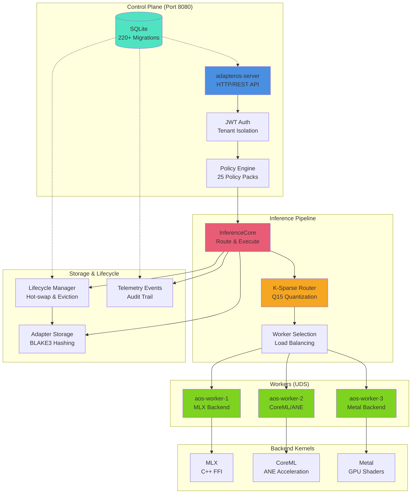

# AdapterOS Documentation

> **AdapterOS** — Offline-capable, UMA-optimized multi-LoRA orchestration on Apple Silicon

[](https://github.com/mlnavigator/adapter-os)
[](../LICENSE-APACHE)
[](https://www.rust-lang.org/)
[-lightgrey)](https://www.apple.com/mac/)

---

## Quick Links

| Category | Links |
|----------|-------|
| **Getting Started** | [Quickstart](QUICKSTART.md) • [Authentication](AUTHENTICATION.md) • [Configuration](CONFIGURATION.md) |
| **Development** | [CLI Guide](CLI_GUIDE.md) • [API Reference](API_REFERENCE.md) • [Testing](TESTING.md) |
| **Operations** | [Deployment](DEPLOYMENT.md) • [Troubleshooting](TROUBLESHOOTING.md) • [Operations](OPERATIONS.md) |
| **Security** | [Security Guide](SECURITY.md) • [Policies](POLICIES.md) • [Access Control](ACCESS_CONTROL.md) |
| **Backends** | [Backend Selection](BACKEND_SELECTION.md) • [MLX](MLX_GUIDE.md) • [CoreML](COREML_BACKEND.md) • [Metal](METAL_BACKEND.md) |

---

## Overview

AdapterOS is a **single-node, locally deployed ML inference platform** optimized for Apple Silicon, licensed for on-prem or air-gapped installations, and built around workspace isolation. It enables hot-swappable LoRA adapters with deterministic execution, zero network egress during serving, and enterprise-grade security.

### Core Technologies

- **DIR (Deterministic Inference Runtime)**: The core execution engine ensuring reproducible, auditable inference with token-level determinism
- **TAS (Token Artifact System)**: Transforms inference outputs into persistent, reusable artifacts for composition and audit trails

### Architecture Diagram



### Key Features

- **Multi-Backend Support**: CoreML (ANE), MLX, Metal — choose the best backend for your workload
- **K-Sparse Routing**: Dynamic adapter mixing with Q15 quantized gates
- **Deterministic Replay**: HKDF-SHA256 seed derivation, reproducible outputs
- **Zero Network Egress**: All serving happens locally via Unix Domain Sockets
- **Hot-Swap Adapters**: Load/unload adapters without restarting workers
- **Policy Enforcement**: Canonical policy packs with audit trails and Merkle chains
- **Multi-Tenant**: Full tenant isolation with JWT authentication

---

## Getting Started

### Prerequisites

- macOS with Apple Silicon (M1/M2/M3/M4)
- Rust nightly (see `rust-toolchain.toml`)
- Xcode Command Line Tools
- Trunk (for Leptos UI): `cargo install trunk`

### Quick Start

```bash
# 1. Clone and setup
git clone https://github.com/mlnavigator/adapter-os.git
cd adapter-os
direnv allow  # Load .env + .env.local

# 2. Build the project
make build

# 3. Run migrations
cargo sqlx migrate run

# 4. Start the system
./start  # Starts backend + UI via service-manager.sh

# 5. Access the UI
open http://localhost:3200
```

**Detailed Guides:**

- [**QUICKSTART.md**](QUICKSTART.md) — Complete setup guide with troubleshooting
- [**ENVIRONMENT_SETUP.md**](ENVIRONMENT_SETUP.md) — Environment configuration
- [**AUTHENTICATION.md**](AUTHENTICATION.md) — Auth setup and JWT configuration

---

## Core Documentation

### System Architecture

| Document | Description |
|----------|-------------|
| [**CONCEPTS.md**](CONCEPTS.md) | Core concepts: Adapters, Router, Plans, Control Points |
| [**INFERENCE_FLOW.md**](INFERENCE_FLOW.md) | End-to-end inference pipeline walkthrough |
| [**LIFECYCLE.md**](LIFECYCLE.md) | Adapter lifecycle management and hot-swap |
| [**Control Plane**](ARCHITECTURE.md#architecture-components) | Control plane architecture and APIs |

### API & CLI

| Document | Description |
|----------|-------------|
| [**API_REFERENCE.md**](API_REFERENCE.md) | Complete REST API reference (189+ endpoints, LLM interface, examples) |
| [**API_GUIDES.md**](API_GUIDES.md) | API workflow guides (versioning, tenant management, promotion workflow) |
| [**CLI_GUIDE.md**](CLI_GUIDE.md) | Command-line interface reference (`aosctl`) |

### Database

| Document | Description |
|----------|-------------|
| [**DATABASE.md**](DATABASE.md) | Comprehensive database documentation: schema, KV operations, migrations, troubleshooting |

---

## Operations

### Deployment

| Document | Description |
|----------|-------------|
| [**DEPLOYMENT.md**](DEPLOYMENT.md) | Deployment guide for production environments |
| [**deployment-guide.md**](deployment-guide.md) | Step-by-step deployment procedures |
| [**PRODUCTION_OPERATIONS.md**](PRODUCTION_OPERATIONS.md) | Production operations and maintenance |
| [**PRODUCTION_BACKUP_RESTORE.md**](PRODUCTION_BACKUP_RESTORE.md) | Backup and disaster recovery |

### Monitoring & Troubleshooting

#### Monitoring
| Document | Description |
|----------|-------------|
| [**PRODUCTION_MONITORING.md**](PRODUCTION_MONITORING.md) | Production monitoring setup and dashboards |
| [**MONITORING_SETUP_README.md**](MONITORING_SETUP_README.md) | Monitoring configuration guide |
| [**monitoring.md**](monitoring.md) | Monitoring architecture and metrics |
| [**system-metrics.md**](system-metrics.md) | System metrics reference |

#### Troubleshooting Guides
| Document | Description |
|----------|-------------|
| [**TROUBLESHOOTING_INDEX.md**](TROUBLESHOOTING_INDEX.md) | **START HERE** - Complete index of all troubleshooting resources |
| [**TROUBLESHOOTING.md**](TROUBLESHOOTING.md) | Main troubleshooting guide with common issues and quick diagnostics |
| [**TROUBLESHOOTING_ENHANCED.md**](TROUBLESHOOTING_ENHANCED.md) | Error catalog, decision trees, and diagnostic commands |
| [**BOOT_TROUBLESHOOTING.md**](BOOT_TROUBLESHOOTING.md) | Boot sequence failures and startup issues |
| [**MLX_TROUBLESHOOTING.md**](MLX_TROUBLESHOOTING.md) | MLX backend specific troubleshooting |
| [**ERRORS.md**](ERRORS.md) | Error handling patterns and error type reference |

#### Production Runbooks
| Document | Description |
|----------|-------------|
| [**runbooks/README.md**](runbooks/README.md) | Production incident response runbook index |
| [**runbooks/WORKER_CRASH.md**](runbooks/WORKER_CRASH.md) | Worker process failures (SEV-1) |
| [**runbooks/DETERMINISM_VIOLATION.md**](runbooks/DETERMINISM_VIOLATION.md) | Determinism violations (SEV-1) |
| [**runbooks/INFERENCE_LATENCY_SPIKE.md**](runbooks/INFERENCE_LATENCY_SPIKE.md) | High latency issues (SEV-2) |
| [**runbooks/MEMORY_PRESSURE.md**](runbooks/MEMORY_PRESSURE.md) | Memory exhaustion (SEV-2) |
| [**runbooks/DISK_FULL.md**](runbooks/DISK_FULL.md) | Disk space issues (SEV-2) |

#### Diagnostic Tools
| Tool | Description |
|------|-------------|
| `./scripts/diagnose.sh` | Automated comprehensive health check and report generator |
| `./aosctl diag` | Quick diagnostics via CLI |
| `./scripts/service-manager.sh` | Service management and monitoring |

---

## Development

### Testing & Quality

| Document | Description |
|----------|-------------|
| [**TEST_QUICK_REFERENCE.md**](TEST_QUICK_REFERENCE.md) | Testing quick reference and best practices |
| [**SECURITY_TESTING.md**](SECURITY_TESTING.md) | Security testing guide |
| [**SECURITY_TEST_README.md**](SECURITY_TEST_README.md) | Security test suite documentation |
| [**DEMO_GUIDE.md**](DEMO_GUIDE.md) | Demo scenarios and test cases |

### Error Handling

| Document | Description |
|----------|-------------|
| [**ERRORS.md**](ERRORS.md) | Comprehensive error handling guide (codes, patterns, helpers, best practices) |

### Deprecations & Changes

| Document | Description |
|----------|-------------|
| [**DEPRECATIONS.md**](DEPRECATIONS.md) | Deprecated features and migration paths |
| [**STUB_IMPLEMENTATIONS.md**](STUB_IMPLEMENTATIONS.md) | Stub implementations and placeholders |

---

## Backend Guides

### MLX Backend

| Document | Description |
|----------|-------------|
| [**MLX_INTEGRATION.md**](MLX_INTEGRATION.md) | MLX backend integration guide |
| [**MLX_BACKEND_DEPLOYMENT_GUIDE.md**](MLX_BACKEND_DEPLOYMENT_GUIDE.md) | MLX deployment and configuration |
| [**MLX_INSTALLATION_GUIDE.md**](MLX_INSTALLATION_GUIDE.md) | MLX installation steps |
| [**MLX_QUICK_REFERENCE.md**](MLX_QUICK_REFERENCE.md) | MLX quick reference |
| [**MLX_TROUBLESHOOTING.md**](MLX_TROUBLESHOOTING.md) | MLX troubleshooting guide |
| [**MLX_ROUTER_HOTSWAP_INTEGRATION.md**](MLX_ROUTER_HOTSWAP_INTEGRATION.md) | MLX hot-swap integration |
| [**MLX_MIGRATION_GUIDE.md**](MLX_MIGRATION_GUIDE.md) | Migrating to MLX backend |
| [**MLX_VS_COREML_GUIDE.md**](MLX_VS_COREML_GUIDE.md) | MLX vs CoreML comparison |
| [**MLX_MEMORY.md**](MLX_MEMORY.md) | MLX memory management |
| [**MLX_METAL_DEVICE_ACCESS.md**](MLX_METAL_DEVICE_ACCESS.md) | MLX Metal device access |
| [**MLX_HKDF_SEEDING.md**](MLX_HKDF_SEEDING.md) | HKDF seeding in MLX backend |

### CoreML Backend

| Document | Description |
|----------|-------------|
| [**COREML_INTEGRATION.md**](COREML_INTEGRATION.md) | CoreML backend with ANE acceleration |
| [**COREML_ATTESTATION_DETAILS.md**](COREML_ATTESTATION_DETAILS.md) | CoreML attestation and verification |
| [**coreml_training_backend.md**](coreml_training_backend.md) | CoreML training backend guide |

### Metal Backend

| Document | Description |
|----------|-------------|
| [**METAL_BUILD_SYSTEM_INTEGRATION.md**](METAL_BUILD_SYSTEM_INTEGRATION.md) | Metal build system integration |
| [**METAL_TOOLCHAIN_SETUP.md**](METAL_TOOLCHAIN_SETUP.md) | Metal toolchain setup guide |

### FFI & Low-Level

| Document | Description |
|----------|-------------|
| [**FFI_GUIDE.md**](FFI_GUIDE.md) | Complete FFI guide (Rust ↔ C++/ObjC++) |
| [**OBJECTIVE_CPP_FFI_PATTERNS.md**](OBJECTIVE_CPP_FFI_PATTERNS.md) | Objective-C++ FFI patterns |

---

## Security & Policies

### Security

| Document | Description |
|----------|-------------|
| [**SECURITY.md**](SECURITY.md) | Security architecture and best practices |
| [**CRYPTO.md**](CRYPTO.md) | Cryptography overview (BLAKE3, HKDF) |
| [**CRYPTO_SECURITY_S6_S9.md**](CRYPTO_SECURITY_S6_S9.md) | Cryptographic security details |
| [**ACCESS_CONTROL.md**](ACCESS_CONTROL.md) | Access control guide (RBAC + tenant isolation) |
| [**SECURE_ENCLAVE_INTEGRATION_ENHANCED.md**](SECURE_ENCLAVE_INTEGRATION_ENHANCED.md) | Secure Enclave integration |
| [**secure-enclave-integration.md**](secure-enclave-integration.md) | Secure Enclave basics |
| [**keychain-integration.md**](keychain-integration.md) | macOS Keychain integration |

### Policy Enforcement

| Document | Description |
|----------|-------------|
| [**POLICIES.md**](POLICIES.md) | Policy system overview (canonical policy packs) |
| [**POLICY_ENFORCEMENT.md**](POLICY_ENFORCEMENT.md) | Policy enforcement architecture |
| [**POLICY_ENFORCEMENT_MIDDLEWARE.md**](POLICY_ENFORCEMENT_MIDDLEWARE.md) | Policy middleware implementation |
| [**POLICY_ENFORCEMENT_MIDDLEWARE_IMPLEMENTATION_GUIDE.md**](POLICY_ENFORCEMENT_MIDDLEWARE_IMPLEMENTATION_GUIDE.md) | Middleware implementation guide |
| [**policy-engine-outline.md**](policy-engine-outline.md) | Policy engine high-level outline |
| [**DEV_BYPASS_POLICY.md**](DEV_BYPASS_POLICY.md) | Development bypass policy (debug only) |

---

## Training

### Training Guides

| Document | Description |
|----------|-------------|
| [**TRAINING_PIPELINE.md**](TRAINING_PIPELINE.md) | Training pipeline architecture |
| [**TRAINING_METRICS.md**](TRAINING_METRICS.md) | Training metrics and evaluation |
| [**TRAINING_PROVENANCE.md**](TRAINING_PROVENANCE.md) | Training provenance tracking |
| [**TRAINING_VERSIONING.md**](TRAINING_VERSIONING.md) | Training version management |
| [**RUNBOOK_TRAINING_LINEAGE_TRUST.md**](RUNBOOK_TRAINING_LINEAGE_TRUST.md) | Training lineage trust runbook |

### Dataset Management

| Document | Description |
|----------|-------------|
| [**USER_GUIDE_DATASETS.md**](USER_GUIDE_DATASETS.md) | Dataset management user guide |
| [**DATASET_TRAINING_INTEGRATION.md**](DATASET_TRAINING_INTEGRATION.md) | Dataset-training integration |
| [**GPU_TRAINING_INTEGRATION.md**](GPU_TRAINING_INTEGRATION.md) | GPU training integration guide |

---

## Reference

### Glossary & Concepts

| Document | Description |
|----------|-------------|
| [**TERMINOLOGY.md**](TERMINOLOGY.md) | Workspace vs. tenant naming map |
| [**GLOSSARY.md**](GLOSSARY.md) | Terminology and definitions |
| [**CONCEPTS.md**](CONCEPTS.md) | Core concepts deep dive |

### Determinism & Replay

| Document | Description |
|----------|-------------|
| [**DETERMINISM.md**](DETERMINISM.md) | Comprehensive determinism and replay guide |
| [**replay_spec.md**](replay_spec.md) | Replay harness and verification |
| [**VISUAL_GUIDES.md**](VISUAL_GUIDES.md) | Visual guides: system comparisons, token flows, KV cache diagrams |

### Configuration

| Document | Description |
|----------|-------------|
| [**CONFIG_PRECEDENCE.md**](CONFIG_PRECEDENCE.md) | Configuration precedence rules |

### User Flows

| Document | Description |
|----------|-------------|
| [**USER_FLOW.md**](USER_FLOW.md) | End-to-end user workflows |

---

## Key Workflows

### Inference Flow

```
HTTP Request → Auth/Policy → InferenceCore → Router Decision (K-sparse, Q15)
                                    ↓
                            Worker Selection (UDS)
                                    ↓
                            Kernel Execution (Backend)
                                    ↓
                            Response + Evidence + Telemetry
```

**See**: [INFERENCE_FLOW.md](INFERENCE_FLOW.md)

### Training Flow

```
API Request → TrainingService → Orchestrator → Worker (Trainer)
                                                    ↓
                                              Adapter Packaging (Q15)
                                                    ↓
                                              Registry → Lifecycle
```

**See**: [TRAINING_PIPELINE.md](TRAINING_PIPELINE.md)

### Adapter Lifecycle

```
Upload → Validation → Storage (BLAKE3) → Registry → Loading
                                              ↓
                                         Hot-Swap → Eviction
```

**See**: [LIFECYCLE.md](LIFECYCLE.md)

---

## Critical Invariants

| Invariant | Location | Notes |
|-----------|----------|-------|
| All inference through `InferenceCore` | `inference_core.rs` | Bypassing breaks auditability |
| Q15 denominator = 32767.0 | `lora-router/src/lib.rs` | **NOT 32768** — precision-critical |
| `tenant_id` in all queries | All handlers | FK triggers enforce isolation |
| No `-ffast-math` flags | `Cargo.toml` | Breaks determinism |
| FK constraints enabled | `db/lib.rs` | `foreign_keys=true` required |

**See**: [DETERMINISM.md](DETERMINISM.md)

---

## Documentation by Audience

### For Developers

1. [QUICKSTART.md](QUICKSTART.md) — Get running in 10 minutes
2. [CLI_GUIDE.md](CLI_GUIDE.md) — Master the `aosctl` CLI
3. [API_REFERENCE.md](API_REFERENCE.md) — Browse all 225 API endpoints
4. [CONCEPTS.md](CONCEPTS.md) — Understand core abstractions
5. [INFERENCE_FLOW.md](INFERENCE_FLOW.md) — Follow the inference pipeline

### For Operators

1. [DEPLOYMENT.md](DEPLOYMENT.md) — Production deployment guide
2. [PRODUCTION_OPERATIONS.md](PRODUCTION_OPERATIONS.md) — Day-2 operations
3. [PRODUCTION_MONITORING.md](PRODUCTION_MONITORING.md) — Setup monitoring
4. [TROUBLESHOOTING.md](TROUBLESHOOTING.md) — Resolve common issues
5. [PRODUCTION_BACKUP_RESTORE.md](PRODUCTION_BACKUP_RESTORE.md) — Disaster recovery

### For Researchers

1. [MLX_INTEGRATION.md](MLX_INTEGRATION.md) — MLX backend deep dive
2. [COREML_INTEGRATION.md](COREML_INTEGRATION.md) — CoreML/ANE acceleration
3. [TRAINING_PIPELINE.md](TRAINING_PIPELINE.md) — Training architecture
4. [TRAINING_METRICS.md](TRAINING_METRICS.md) — Evaluation metrics
5. [FFI_GUIDE.md](FFI_GUIDE.md) — Low-level FFI patterns

### For Security Auditors

1. [SECURITY.md](SECURITY.md) — Security architecture
2. [POLICIES.md](POLICIES.md) — Policy enforcement system
3. [ACCESS_CONTROL.md](ACCESS_CONTROL.md) — Access control (RBAC + tenant isolation)
4. [CRYPTO.md](CRYPTO.md) — Cryptographic foundations

---

## Environment & Platform

- **Platform**: macOS with Apple Silicon (M1/M2/M3/M4)
- **Database**: SQLite at `var/aos-cp.sqlite3`
- **Default Model**: Qwen2.5-7B (4-bit quantized)
- **Rust**: Nightly (see `rust-toolchain.toml`)
- **UI**: Leptos 0.7 + Tailwind CSS + WASM (Client-Side Rendering)

---

## Contributing to Documentation

When adding or updating documentation:

1. Follow the existing structure and format
2. Add navigation links to this README
3. Use clear headings and code examples
4. Update API documentation when changing interfaces
5. Keep the quick start guide current
6. Run `make check` before committing

See [CONTRIBUTING.md](../CONTRIBUTING.md) in the project root for general contribution guidelines.

---

## Getting Help

- **Quick Questions**: Check [QUICKSTART.md](QUICKSTART.md) or [TROUBLESHOOTING.md](TROUBLESHOOTING.md)
- **API Questions**: See [API_REFERENCE.md](API_REFERENCE.md)
- **CLI Help**: Run `./aosctl --help` or see [CLI_GUIDE.md](CLI_GUIDE.md)
- **Rust API Docs**: Run `cargo doc --no-deps --open`
- **Examples**: See `examples/` and `tests/` directories in project root

---

## License

AdapterOS is dual-licensed under Apache 2.0 or MIT at your option.

- [Apache License 2.0](../LICENSE-APACHE)
- [MIT License](../LICENSE-MIT)

---

**Last Updated**: December 11, 2025
**AdapterOS Version**: alpha-v0.11-unstable-pre-release
**Maintained by**: [@rogu3bear](https://github.com/rogu3bear)
**MLNavigator Inc**
