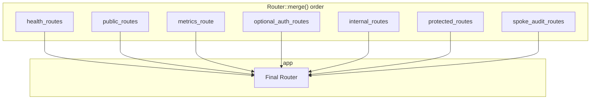

# ROUTES

Route tiers, composition, and middleware. Code is authoritative. Source: `adapteros-server-api/src/routes/mod.rs`.

---

## Route Composition

Final app is built by merging route groups, then applying global layers:

**Code:** `build()` returns `health_routes.merge(app)` where `app` merges the above. Health routes have no middleware.

---

## Tiers

| Tier | Router var | Middleware | Purpose |
|------|------------|------------|---------|
| health | health_routes | None | /healthz, /readyz, /version |
| public | public_routes | policy_enforcement | Auth login, status, metrics |
| metrics | metrics_route | policy_enforcement | /metrics, /v1/metrics |
| optional_auth | optional_auth_routes | optional_auth, context, policy, audit | /v1/models/status, /v1/topology |
| internal | internal_routes | worker_uid, policy | Worker register, heartbeat, manifests |
| protected | protected_routes | auth, tenant_guard, csrf, context, policy, audit | All user-facing APIs |
| spoke_audit | spoke_audit_routes | Same as protected | /v1/audit/* |

---

## Internal Routes (Worker-to-CP)

No JWT, CSRF, or tenant guard. Trust boundary: worker on same host.

| Path | Method | Handler |
|------|--------|---------|
| /v1/workers/fatal | POST | receive_worker_fatal |
| /v1/workers/register | POST | register_worker |
| /v1/workers/status | POST | notify_worker_status |
| /v1/workers/heartbeat | POST | worker_heartbeat |
| /v1/tenants/{tenant_id}/manifests/{manifest_hash} | GET | fetch_manifest_by_hash |

**Defense:** `worker_uid_middleware` (when `AOS_WORKER_UID` set), policy enforcement.

---

## Route Modules

Extracted submodules merged into protected_routes:

| Module | File | Path prefix |
|--------|------|-------------|
| auth_routes | routes/auth_routes.rs | /v1/auth/* |
| tenant_routes | routes/tenant_routes.rs | /v1/tenants/* |
| chat_routes | routes/chat_routes.rs | /v1/chat/* |
| training_routes | routes/training_routes.rs | /v1/training/* |
| adapters | routes/adapters.rs | /v1/adapters/*, /v1/adapter-repositories/* |

---

## Global Layers (outermost first)

Applied to `app` after merge:

| Layer | Purpose |
|-------|---------|
| TraceLayer | HTTP tracing |
| ErrorCodeEnforcementLayer | Ensure error codes |
| idempotency_middleware | Idempotency keys |
| cors_layer | CORS |
| rate_limiting_middleware | Rate limits |
| request_size_limit_middleware | Size limits |
| security_headers_middleware | Security headers |
| caching_middleware | HTTP caching |
| versioning_middleware | API versioning |
| trace_context_middleware | W3C Trace Context |
| request_id_middleware | Request ID |
| seed_isolation_middleware | Determinism |
| client_ip_middleware | Client IP |
| request_tracking_middleware | In-flight tracking |
| lifecycle_gate | Maintenance gate |
| drain_middleware | Drain rejection |
| observability_middleware | Logging, error envelope |
| CompressionLayer | gzip, br, deflate |

---

## Route Map

Run `./scripts/dev/generate_route_map.sh` to regenerate `docs/api/ROUTE_MAP.md` from `docs/generated/api-route-inventory.json`. Inventory is parsed from `routes/mod.rs` by `scripts/contracts/generate_contract_artifacts.py`.
