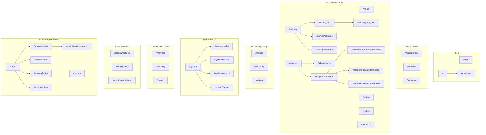
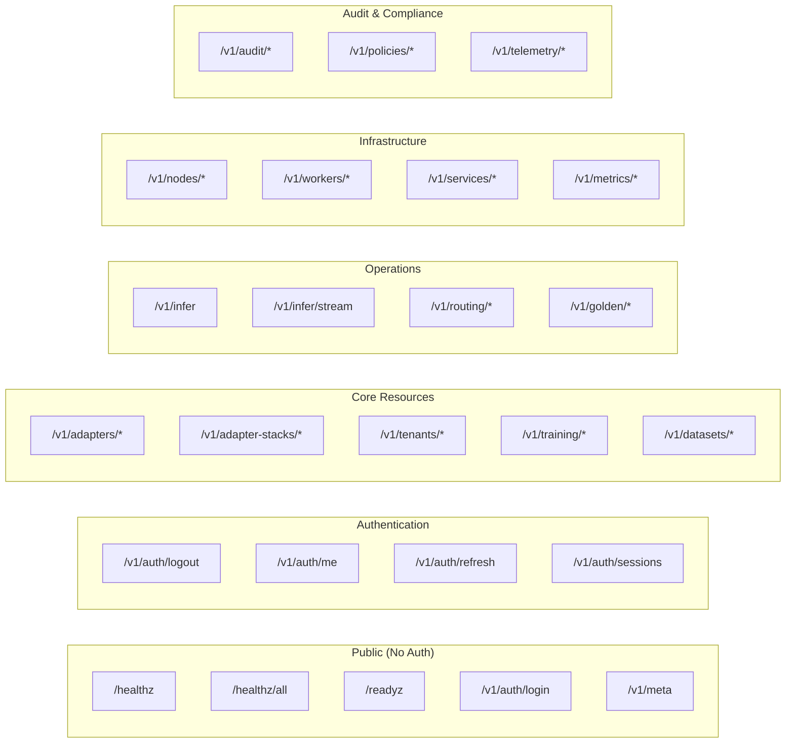
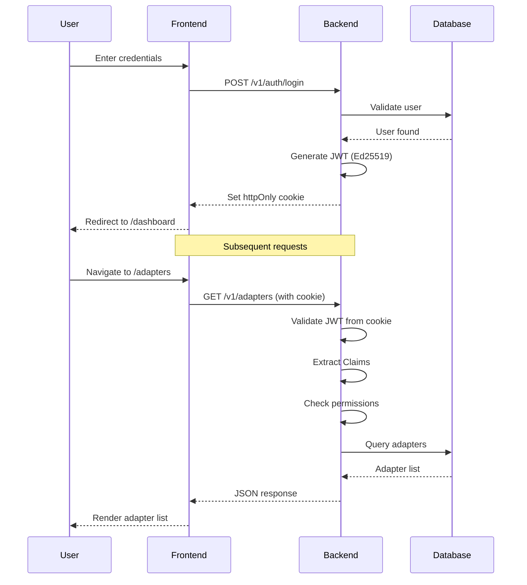
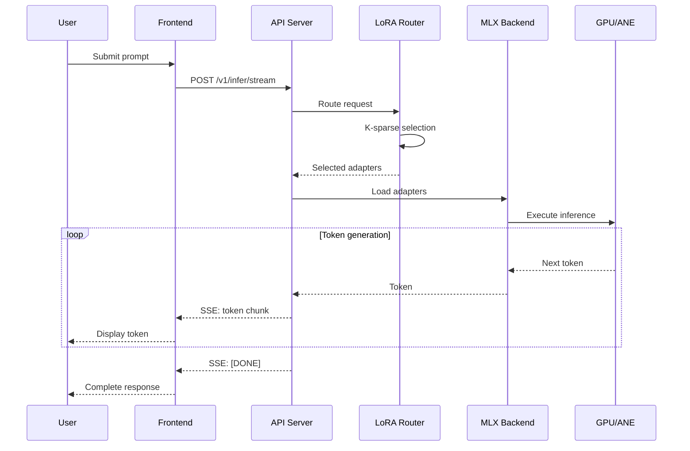
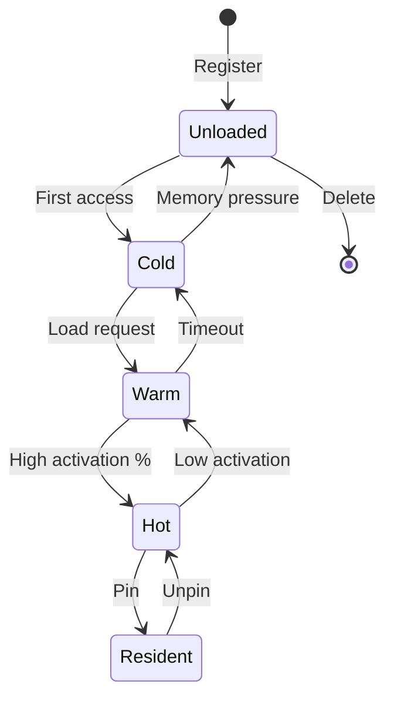
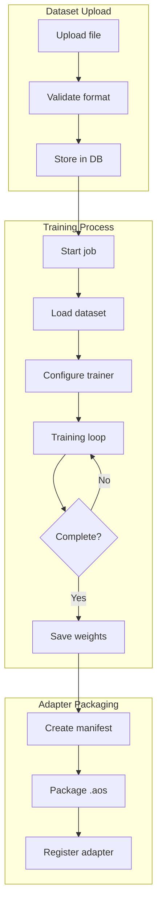
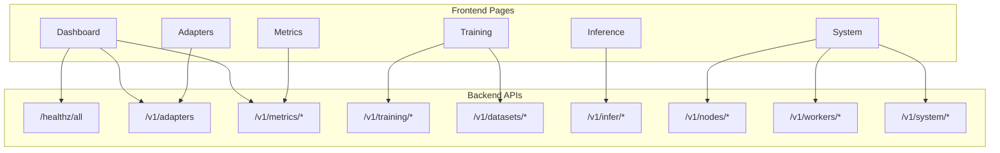
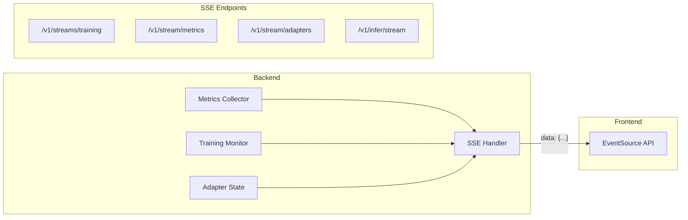
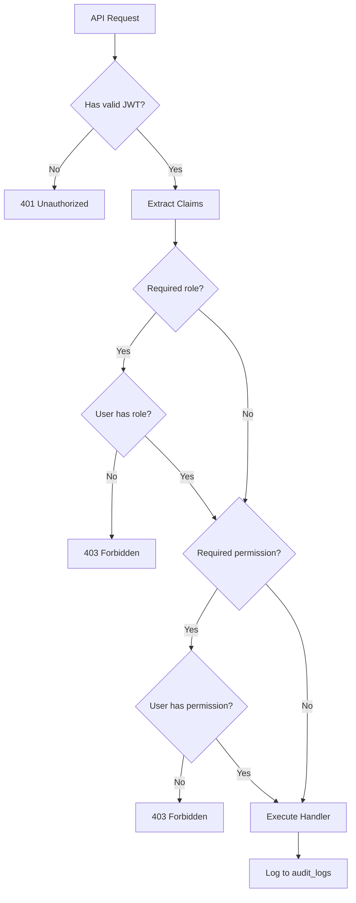
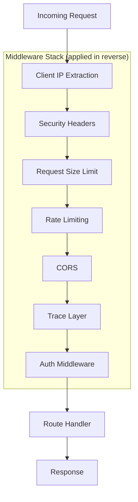

# AdapterOS Route Map Diagram

**Copyright:** 2025 JKCA / James KC Auchterlonie. All rights reserved.

This document provides visual diagrams of the route structure and data flow in AdapterOS.

---

## Frontend Route Hierarchy

---

## API Endpoint Categories

---

## Authentication Flow

---

## Inference Data Flow

---

## Adapter Lifecycle State Machine

---

## Training Pipeline Flow

---

## Page-to-API Mapping (Visual)

---

## SSE Streaming Architecture

---

## RBAC Permission Flow

---

## Middleware Stack

---

## Notes

1. All diagrams use Mermaid syntax for rendering
2. View these diagrams in any Mermaid-compatible viewer
3. GitHub and VS Code render Mermaid natively
4. For interactive viewing, use https://mermaid.live
