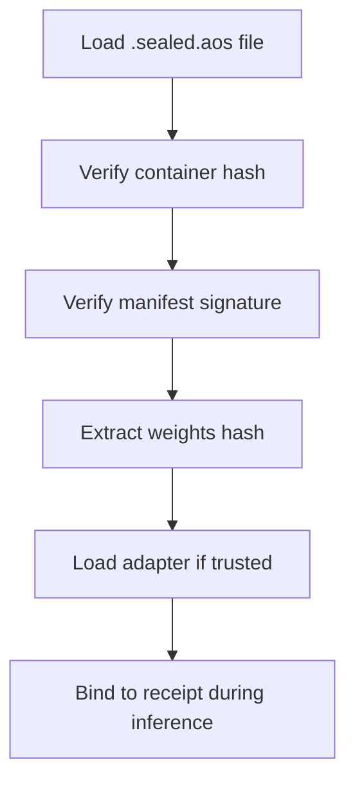
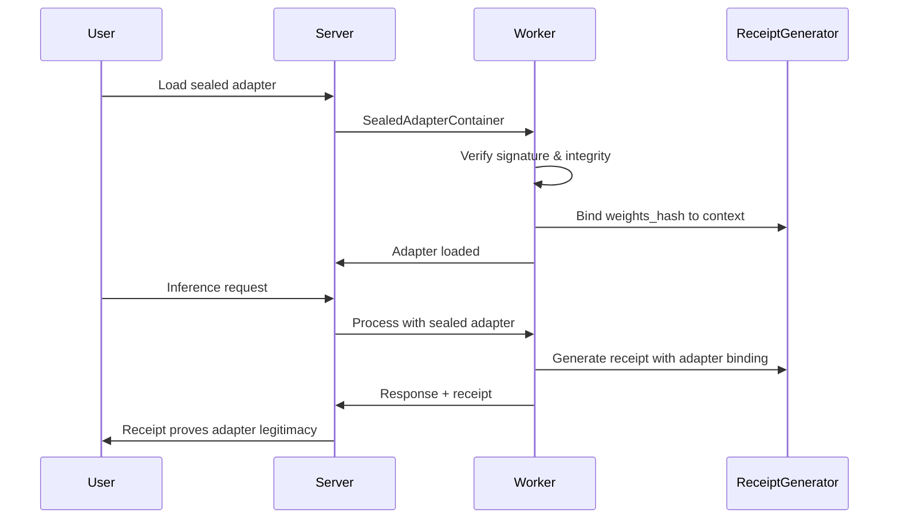

# Sealed Adapters

**Version:** 0.12.0

Guide to AdapterOS sealed adapter containers - cryptographically secure, tamper-proof adapter distribution.

---

## Overview

Sealed adapters are **cryptographically signed, tamper-proof containers** for adapter distribution. They provide:

- **Integrity guarantees**: Cryptographic proof adapters haven't been modified
- **Authenticity**: Signed by trusted authorities
- **Audit trails**: Trackable distribution chain
- **Receipt binding**: Integration with cryptographic receipts

### What Are Sealed Adapters?

```text
A sealed adapter is a cryptographically signed container that guarantees:
1. The adapter came from a trusted source (signature verification)
2. The adapter hasn't been tampered with (integrity hash)
3. The adapter can be safely loaded (receipt binding)
```

### File Format

Sealed adapters use the `.sealed.aos` file extension with a binary format containing:
- **Magic bytes**: "SEAL" identifier
- **Integrity hash**: BLAKE3 hash of entire container
- **Signed manifest**: Ed25519 signature over metadata
- **Adapter payload**: Weights and configuration data

---

## Why Sealed Adapters Matter

### For Enterprise Security

```text
"Ensure only approved, verified adapters run in production."
```

- **Supply chain security**: Verify adapters from trusted sources
- **Tamper detection**: Cryptographic proof of integrity
- **Compliance**: Meet regulatory requirements for AI component verification
- **Incident response**: Track adapter origins during investigations

### For Model Distribution

```text
"Distribute fine-tuned adapters securely to edge devices."
```

- **Secure deployment**: Sign adapters before distribution
- **Verification at runtime**: Check integrity before loading
- **Chain of custody**: Track from creation to deployment
- **Offline verification**: No network required for checks

### For Research Collaboration

```text
"Share fine-tuned adapters with cryptographic provenance."
```

- **Reproducibility**: Verify exact adapter used in experiments
- **Attribution**: Prove adapter came from claimed source
- **Peer review**: Allow third-party verification
- **Publication support**: Include adapter hashes in papers

---

## How Sealed Adapters Work

### Container Structure

```rust
pub struct SealedAdapterContainer {
    /// Format version
    pub version: u8,

    /// Container integrity hash (covers all fields)
    pub container_hash: B3Hash,

    /// Signed manifest with metadata
    pub manifest: SignedManifest,

    /// Adapter weights and config
    pub payload: AdapterPayload,

    /// Creation timestamp
    pub created_at: String,

    /// Sealing authority public key
    pub sealer_pubkey: [u8; 32],
}
```

### Key Components

| Component | Purpose | Cryptography |
|-----------|---------|--------------|
| **Container Hash** | Integrity of entire file | BLAKE3 hash |
| **Signed Manifest** | Authenticity of metadata | Ed25519 signature |
| **Weights Hash** | Integrity of adapter weights | BLAKE3 hash |
| **Config Hash** | Integrity of adapter config | BLAKE3 hash |
| **Sealer Public Key** | Identify signing authority | Ed25519 public key |

### Verification Process



---

## Creating Sealed Adapters

### Prerequisites

1. **Adapter bundle**: Trained adapter weights and configuration
2. **Signing key**: Ed25519 private key for signing
3. **AdapterOS CLI**: `aosctl` with sealing support

### Step-by-Step Creation

#### 1. Prepare Your Adapter

```bash
# Train or obtain your adapter
# Result: adapter_bundle/ directory with:
# - adapter.json (config)
# - adapter.safetensors (weights)
# - metadata.json (optional)
```

#### 2. Generate Signing Key (One-time)

```bash
# Generate Ed25519 keypair
aosctl keygen create-sealing-key --name "my-org-adapters"

# Output:
# Private key: sealing_key.pem
# Public key: sealing_key.pub
# Key ID: abc123...
```

#### 3. Seal the Adapter

```bash
# Seal with private key
aosctl adapter seal \
  --input-bundle ./adapter_bundle/ \
  --signing-key ./sealing_key.pem \
  --output adapter.sealed.aos \
  --metadata '{"version": "1.0", "author": "my-org"}'

# Verify the seal
aosctl adapter verify-seal adapter.sealed.aos --trusted-key sealing_key.pub
```

#### 4. Distribute Securely

```bash
# Share the .sealed.aos file and public key
# Recipients can verify without your private key
```

### Programmatic Creation

```rust
use adapteros_aos::sealed::{SealedAdapterContainer, AdapterBundle};
use ed25519_dalek::SigningKey;

// Load your adapter bundle
let bundle = AdapterBundle::from_directory("./adapter_bundle/")?;

// Load signing key
let signing_key = SigningKey::from_pkcs8_pem(&std::fs::read("sealing_key.pem")?)?;

// Create sealed container
let container = SealedAdapterContainer::seal(&bundle, &signing_key)?;

// Save to file
container.write_to_file("adapter.sealed.aos")?;
```

---

## Loading Sealed Adapters

### CLI Loading

```bash
# Load and verify sealed adapter
aosctl adapter load-sealed adapter.sealed.aos --trusted-key sealing_key.pub

# Load with JSON output
aosctl adapter load-sealed adapter.sealed.aos \
  --trusted-key sealing_key.pub \
  --json > adapter_info.json

# Load for specific tenant
aosctl adapter load-sealed adapter.sealed.aos \
  --trusted-key sealing_key.pub \
  --tenant my-tenant
```

### Verification Details

```bash
# Show verification details
aosctl adapter load-sealed adapter.sealed.aos \
  --trusted-key sealing_key.pub \
  --verbose

# Output includes:
# - Container hash
# - Manifest signature status
# - Weights hash
# - Sealer public key
# - Adapter metadata
```

### Programmatic Loading

```rust
use adapteros_aos::sealed::SealedAdapterContainer;
use ed25519_dalek::VerifyingKey;

// Load container
let container = SealedAdapterContainer::read_from_file("adapter.sealed.aos")?;

// Verify against trusted keys
let trusted_key = VerifyingKey::from_bytes(&load_public_key("sealing_key.pub")?)?;
container.verify(&[trusted_key])?;

// Extract adapter for use
let adapter = container.unseal(&[trusted_key])?;
```

---

## Receipt Binding

### Why Bind Receipts to Sealed Adapters?

When using sealed adapters, receipts prove:
- **Adapter authenticity**: Came from trusted source
- **Adapter integrity**: Not tampered with
- **Binding to output**: Specific adapter produced specific output

### Automatic Binding Process



### Receipt Verification

```bash
# Receipt includes adapter binding
curl http://localhost:8080/v1/receipts/{trace_id}

# Response includes:
{
  "receipt": {
    "context_id": {
      "weights_hash": "b3_hash_of_sealed_adapter",
      "model_hash": "b3_hash_of_base_model"
    },
    "digest": "final_receipt_digest"
  }
}
```

### Third-Party Verification

```rust
// Anyone can verify the adapter was legitimate
let receipt = api.get_receipt(trace_id)?;
let sealed_adapter_hash = receipt.context_id.weights_hash;

// This proves: "Output came from verified sealed adapter"
assert!(receipt.verify());
```

---

## Key Management

### Signing Key Security

```bash
# Generate secure key
aosctl keygen create-sealing-key \
  --name "production-adapters" \
  --protected  # Require passphrase

# Backup encrypted key
aosctl keygen backup-sealing-key \
  --key production-adapters \
  --output backup.enc

# Rotate keys
aosctl keygen rotate-sealing-key \
  --old-key production-adapters \
  --new-key production-adapters-v2
```

### Trusted Key Distribution

```bash
# Export public key for distribution
aosctl keygen export-public \
  --key production-adapters \
  --output production-adapters.pub

# Import trusted keys on target systems
aosctl keygen import-trusted \
  --key-file production-adapters.pub \
  --name "trusted-org"
```

### Key Storage Best Practices

- **Hardware Security Modules (HSM)**: Store private keys in HSM
- **Key rotation**: Rotate keys regularly (quarterly/annually)
- **Access control**: Limit private key access to authorized personnel
- **Audit logging**: Log all key operations
- **Backup security**: Encrypt key backups

---

## File Format Specification

### Binary Format Layout

```
Offset  Length  Field
0       4       Magic bytes ("SEAL")
4       1       Version (1)
5       32      Container hash (BLAKE3)
37      4       Manifest length (u32 LE)
41      N       Signed manifest (CBOR)
41+N    4       Payload length (u32 LE)
45+N    M       Adapter payload (CBOR)
45+N+M  25      ISO 8601 timestamp ("2026-01-13T12:34:56Z")
70+N+M  32      Sealer public key
102+N+M 32      Container hash (repeated for verification)
```

### Magic Bytes

```rust
pub const SEALED_MAGIC: &[u8; 4] = b"SEAL";
```

### Version History

- **Version 1**: Initial release with Ed25519 signatures

### Signed Manifest Structure

```rust
pub struct SignedManifest {
    pub adapter_id: String,
    pub base_model_hash: B3Hash,
    pub payload_hash: B3Hash,      // Hash of weights + config
    pub metadata: serde_json::Value,
    pub signature: ed25519::Signature,
    pub public_key: ed25519::VerifyingKey,
}
```

### Adapter Payload Structure

```rust
pub struct AdapterPayload {
    pub weights_hash: B3Hash,      // BLAKE3 of weights_data
    pub weights_data: Vec<u8>,     // Compressed weights
    pub config_hash: B3Hash,       // BLAKE3 of config_data
    pub config_data: Vec<u8>,      // JSON config
}
```

---

## Use Cases and Examples

### Enterprise Model Distribution

```bash
# Organization seals approved adapters
aosctl adapter seal \
  --input-bundle ./finance-adapter/ \
  --signing-key ./org-sealing-key.pem \
  --output finance-adapter-v1.sealed.aos

# Distribute to production systems
scp finance-adapter-v1.sealed.aos prod-server:

# Production system loads securely
aosctl adapter load-sealed finance-adapter-v1.sealed.aos \
  --trusted-key org-public-key.pub
```

### Research Artifact Sharing

```bash
# Researcher seals fine-tuned adapter
aosctl adapter seal \
  --input-bundle ./my-research-adapter/ \
  --signing-key ./research-key.pem \
  --metadata '{"paper": "arxiv:1234.5678", "dataset": "custom-corpus"}' \
  --output research-adapter.sealed.aos

# Share with reviewers (include public key)
# Reviewers can verify without researcher's private key
aosctl adapter verify-seal research-adapter.sealed.aos \
  --trusted-key research-public-key.pub
```

### Supply Chain Security

```bash
# CI/CD pipeline seals adapters
aosctl adapter seal \
  --input-bundle ./build-output/ \
  --signing-key ./ci-sealing-key.pem \
  --metadata '{"build": "12345", "commit": "abc123"}' \
  --output sealed-adapter.sealed.aos

# Deployment verifies before loading
if aosctl adapter verify-seal sealed-adapter.sealed.aos --trusted-key ci-public-key.pub; then
    aosctl adapter load-sealed sealed-adapter.sealed.aos --trusted-key ci-public-key.pub
else
    echo "Adapter integrity check failed!"
    exit 1
fi
```

### Offline Verification

```bash
# No network required - pure cryptographic verification
aosctl adapter verify-seal adapter.sealed.aos \
  --trusted-key trusted.pub \
  --offline  # Explicitly offline mode

# Can verify receipts too
aosctl receipt verify <receipt_digest> --offline
```

---

## Troubleshooting

### Signature Verification Fails

```bash
# Check if using correct public key
aosctl adapter verify-seal adapter.sealed.aos \
  --trusted-key wrong-key.pub \
  --verbose

# Expected: "Signature verification failed"
# Fix: Use the correct signing key's public key

# Check key format
aosctl keygen inspect-key --key-file sealing_key.pub
```

### Container Hash Mismatch

```bash
# File corruption or tampering
aosctl adapter inspect-seal adapter.sealed.aos

# Check if file was modified after sealing
ls -la adapter.sealed.aos  # Check timestamps
```

### Loading Fails

```bash
# Check adapter compatibility
aosctl adapter inspect-seal adapter.sealed.aos --show-metadata

# Verify base model compatibility
aosctl models list  # Check available base models
```

### Key Management Issues

```bash
# List available keys
aosctl keygen list-keys

# Check key permissions
ls -la ~/.aos/keys/

# Re-import public key
aosctl keygen import-trusted --key-file trusted.pub --name trusted-org
```

---

## API Reference

### Adapter Sealing Endpoints

| Method | Endpoint | Purpose |
|--------|----------|---------|
| `POST` | `/v1/adapters/seal` | Seal an adapter (admin) |
| `POST` | `/v1/adapters/sealed/verify` | Verify sealed adapter |
| `POST` | `/v1/adapters/sealed/load` | Load sealed adapter |

### CLI Commands

```bash
aosctl adapter seal --help
aosctl adapter load-sealed --help
aosctl adapter verify-seal --help
aosctl keygen --help
```

---

## Configuration

### Environment Variables

```bash
# Enable sealed adapter support
export AOS_SEALED_ADAPTERS_ENABLED=true

# Trusted keys directory
export AOS_SEALING_KEYS_DIR=~/.aos/keys

# Default sealing key
export AOS_DEFAULT_SEALING_KEY=production-key

# Strict verification (reject unknown sealers)
export AOS_SEALING_STRICT_VERIFICATION=true
```

### Security Considerations

- **Key protection**: Never share private signing keys
- **Key rotation**: Rotate keys regularly
- **Audit logging**: Log all sealing and loading operations
- **Access control**: Limit sealing to authorized personnel
- **Verification**: Always verify before loading in production

---

## Related Documentation

- [**CRYPTO_RECEIPTS.md**](CRYPTO_RECEIPTS.md) — Receipt system that binds to sealed adapters
- [**MODEL_MANAGEMENT.md**](MODEL_MANAGEMENT.md) — General adapter management
- [**SECURITY.md**](SECURITY.md) — Security architecture
- [**CLI_GUIDE.md**](CLI_GUIDE.md) — Command-line interface

---

*Last updated: January 13, 2026*