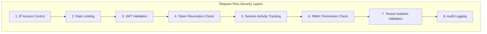
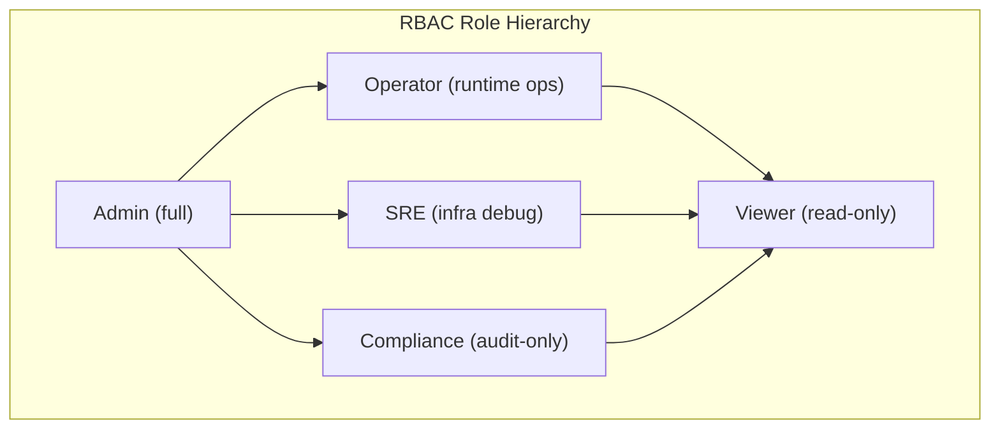
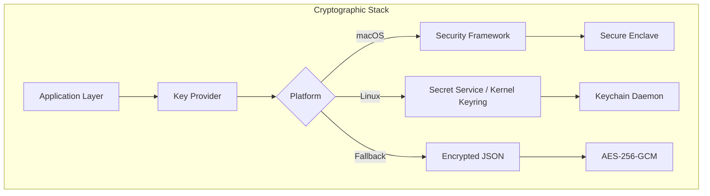
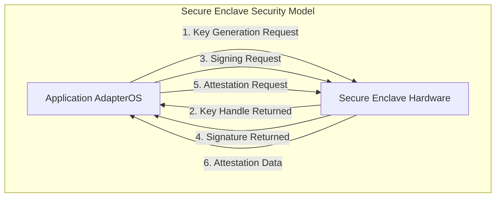

# AdapterOS Security Architecture

**Document Version:** 2.0
**Last Updated:** 2025-12-11
**Status:** Production Ready
**Maintained by:** AdapterOS Security Team

---

## Table of Contents

1. [Overview](#overview)
2. [Authentication](#authentication)
3. [Authorization (RBAC)](#authorization-rbac)
4. [Token Management](#token-management)
5. [Cryptographic Architecture](#cryptographic-architecture)
6. [Secure Enclave Integration](#secure-enclave-integration)
7. [Keychain Integration](#keychain-integration)
8. [IP Access Control](#ip-access-control)
9. [Rate Limiting](#rate-limiting)
10. [Tenant Isolation](#tenant-isolation)
11. [Audit Logging](#audit-logging)
12. [Session Management](#session-management)
13. [Security Testing](#security-testing)
14. [Security Best Practices](#security-best-practices)
15. [Troubleshooting](#troubleshooting)
16. [API Reference](#api-reference)

---

## Overview

AdapterOS implements defense-in-depth security with multiple layers providing comprehensive protection across authentication, cryptography, hardware security, and operational controls.

### Security Layers



### Key Security Principles

- **Zero Trust:** Every request is authenticated and authorized
- **Deny by Default:** Explicit permission required for all actions
- **Defense in Depth:** Multiple security layers
- **Audit Everything:** Comprehensive logging of all security events
- **Tenant Isolation:** Strict boundaries between tenants
- **Time-Limited Tokens:** 8-hour JWT expiry with refresh mechanism
- **Hardware Security:** Secure Enclave integration when available
- **Cryptographic Protection:** Hardware-backed signing and encryption

---

## Authentication

### JWT with Ed25519 Signatures

AdapterOS uses **Ed25519** digital signatures for JWT tokens in production mode, providing:

- **Fast verification:** ~60,000 signatures/second
- **Small signatures:** 64 bytes
- **High security:** ~128-bit security level
- **Deterministic:** Same message always produces same signature

### Token Structure

```rust
pub struct Claims {
    pub sub: String,        // User ID
    pub email: String,      // User email
    pub role: String,       // Role (admin, operator, sre, compliance, viewer)
    pub tenant_id: String,  // Tenant context
    pub exp: i64,           // Expiry timestamp (8 hours)
    pub iat: i64,           // Issued at timestamp
    pub jti: String,        // JWT ID (BLAKE3 hash for revocation)
    pub nbf: i64,           // Not before timestamp
}
```

### Password Security

- **Algorithm:** Argon2id (memory-hard, GPU-resistant)
- **Minimum Length:** 12 characters
- **Complexity:** Recommended (uppercase, lowercase, numbers, symbols)
- **Storage:** Only salted hash stored, never plaintext

### Authentication Flow

```
1. User submits email + password
   ↓
2. Check account lockout (5 failed attempts in 15 min)
   ↓
3. Query user from database
   ↓
4. Verify password with Argon2id
   ↓
5. Check IP access control
   ↓
6. Generate JWT with Ed25519 signature
   ↓
7. Create session record
   ↓
8. Track auth attempt (audit log)
   ↓
9. Return JWT token
```

### Bootstrap Admin

Initial setup requires creating the first admin user via the **bootstrap endpoint**:

```bash
curl -X POST https://api.adapteros.local/v1/auth/bootstrap \
  -H "Content-Type: application/json" \
  -d '{
    "email": "admin@company.com",
    "password": "SecurePassword123!",
    "display_name": "System Administrator"
  }'
```

**Security:** Bootstrap is **disabled** after the first user is created.

### Development Authentication

For debug builds only:

```bash
# Option 1: NO_AUTH mode
NO_AUTH=1 cargo run --bin adapteros-server

# Option 2: Dev bypass
AOS_DEV_NO_AUTH=1 cargo run --bin adapteros-server

# Option 3: Custom JWT secret
AOS_DEV_JWT_SECRET="my-test-secret" cargo run --bin adapteros-server
```

**Warning:** Never use development authentication in production.

---

## Authorization (RBAC)

> **Full Reference:** See [ACCESS_CONTROL.md](ACCESS_CONTROL.md) for comprehensive access control documentation including RBAC, tenant isolation, all 56 permissions, and usage examples.

### Role Hierarchy



### Permission Matrix

| Permission          | Admin | Operator | SRE | Compliance | Viewer |
|---------------------|-------|----------|-----|------------|--------|
| **Adapters**        |       |          |     |            |        |
| AdapterList         | ✅    | ✅       | ✅  | ✅         | ✅     |
| AdapterView         | ✅    | ✅       | ✅  | ✅         | ✅     |
| AdapterRegister     | ✅    | ✅       | ❌  | ❌         | ❌     |
| AdapterLoad/Unload  | ✅    | ✅       | ✅  | ❌         | ❌     |
| AdapterDelete       | ✅    | ❌       | ❌  | ❌         | ❌     |
| **Training**        |       |          |     |            |        |
| TrainingStart       | ✅    | ✅       | ❌  | ❌         | ❌     |
| TrainingCancel      | ✅    | ✅       | ❌  | ❌         | ❌     |
| TrainingView        | ✅    | ✅       | ✅  | ✅         | ✅     |
| **Inference**       |       |          |     |            |        |
| InferenceExecute    | ✅    | ✅       | ✅  | ❌         | ❌     |
| **Tenants**         |       |          |     |            |        |
| TenantManage        | ✅    | ❌       | ❌  | ❌         | ❌     |
| TenantView          | ✅    | ✅       | ✅  | ✅         | ✅     |
| **Policies**        |       |          |     |            |        |
| PolicyView          | ✅    | ✅       | ✅  | ✅         | ✅     |
| PolicyValidate      | ✅    | ❌       | ❌  | ✅         | ❌     |
| PolicyApply         | ✅    | ❌       | ❌  | ❌         | ❌     |
| PolicySign          | ✅    | ❌       | ❌  | ❌         | ❌     |
| **Audit**           |       |          |     |            |        |
| AuditView           | ✅    | ❌       | ✅  | ✅         | ❌     |
| **Nodes**           |       |          |     |            |        |
| NodeManage          | ✅    | ❌       | ❌  | ❌         | ❌     |

### Usage in Handlers

```rust
use adapteros_server_api::permissions::{require_permission, Permission};

pub async fn my_handler(
    Extension(claims): Extension<Claims>,
) -> Result<Json<Response>, (StatusCode, Json<ErrorResponse>)> {
    // Check permission
    require_permission(&claims, Permission::AdapterRegister)?;

    // Proceed with operation
    Ok(Json(response))
}
```

---

## Token Management

### Token Lifecycle

```
Issue (Login)
  ↓
Active (8 hours)
  ↓
Refresh (if near expiry)
  ↓
Revoke (Logout / Security Event)
  ↓
Expired (Auto-cleanup)
```

### Revocation Mechanisms

#### 1. Manual Logout
User explicitly logs out via `/v1/auth/logout`

#### 2. Token Refresh
Old token revoked when new token issued via `/v1/auth/refresh`

#### 3. Bulk Revocation
Admin revokes all user tokens (e.g., on password change)

#### 4. Automatic Expiry
Tokens expire after 8 hours, revocations cleaned up after expiry

### Revocation Checking

Every authenticated request checks the `revoked_tokens` table:

```sql
SELECT COUNT(*) FROM revoked_tokens WHERE jti = ?
```

**Performance:** Indexed lookup (~0.1ms), negligible overhead

---

## Cryptographic Architecture

### Core Cryptographic Operations

AdapterOS provides a comprehensive cryptographic foundation with hardware-backed security, cross-platform key management, and deterministic execution guarantees.



### Digital Signatures (Ed25519)

**Purpose:** Identity verification, bundle signing, and cryptographic receipts

```rust
use adapteros_crypto::{KeyAlgorithm, KeyProvider};

let provider = KeyProvider::new(KeyProviderConfig::default()).await?;
let key_handle = provider.generate("my-key", KeyAlgorithm::Ed25519).await?;
let signature = provider.sign("my-key", b"Hello, world!").await?;
```

**Properties:**
- Ed25519 elliptic curve signatures
- Deterministic signatures (same message = same signature)
- 32-byte public keys, 64-byte signatures
- Hardware acceleration when available

### Symmetric Encryption (AES-256-GCM)

**Purpose:** Data confidentiality, envelope encryption, secure communication

```rust
use adapteros_crypto::envelope::Envelope;

let envelope = Envelope::encrypt(b"secret data", "recipient-key-id").await?;
let plaintext = envelope.decrypt("recipient-key-id").await?;
```

**Properties:**
- AES-256-GCM authenticated encryption
- 96-bit nonces (automatically generated)
- 128-bit authentication tags
- No padding required

### Hashing (BLAKE3)

**Purpose:** Content addressing, integrity verification, deterministic identifiers

```rust
use adapteros_core::B3Hash;

let hash = B3Hash::hash(b"data");
let hex_string = hash.to_hex();
```

**Properties:**
- 256-bit output
- Cryptographically secure
- High performance (SIMD optimized)
- Used for all content addressing in AdapterOS

### Cryptographic Security Features (S6-S9)

#### S6: Secure Enclave (SEP) Attestation

Hardware-backed key generation and attestation using Apple's Secure Enclave Processor on M-series Macs.

**Features:**
- Chip detection (M1/M2/M3/M4)
- SEP availability check
- Hardware-backed keys (P-256 ECDSA)
- Attestation chain (X.509 certificates)
- Graceful fallback to software keys

**API Usage:**
```rust
use adapteros_crypto::{
    check_sep_availability, generate_sep_key_with_attestation,
    detect_chip_generation, SepChipGeneration,
};

// Check availability
let availability = check_sep_availability();
if availability.available {
    println!("SEP available on {}", availability.chip_generation);
}

// Generate key with attestation
let nonce = b"random-nonce-123456789012345678901234";
let attestation = generate_sep_key_with_attestation("my-key", nonce).await?;
```

#### S7: Key Rotation Daemon

Automatic key rotation system with configurable intervals and comprehensive audit logging.

**Features:**
- Automatic rotation based on interval (default: 90 days)
- Manual rotation via API
- Rotation history with signed receipts
- Grace periods for historical decryption
- Policy enforcement (max historical keys)

**API Usage:**
```rust
use adapteros_crypto::{RotationDaemon, RotationPolicy};

let policy = RotationPolicy {
    rotation_interval_secs: 90 * 24 * 3600, // 90 days
    grace_period_secs: 7 * 24 * 3600,        // 7 days
    max_historical_keys: 10,
    auto_rotate: true,
};

let daemon = Arc::new(RotationDaemon::new(provider, policy));
let handle = daemon.clone().start();

// Manual rotation
let receipt = daemon.force_rotate("my-key").await?;
```

#### S8: Audit Logging for Crypto Operations

Comprehensive, immutable audit trail for all cryptographic operations with Ed25519 signatures.

**Features:**
- Logs all encrypt/decrypt, key generation, rotation, deletion
- Digital signatures and verification tracking
- Structured audit entries with timestamps
- Tamper detection via Ed25519 signatures
- Queryable audit trail by operation, key ID, user, result, time range

**API Usage:**
```rust
use adapteros_crypto::{CryptoAuditLogger, CryptoOperation};

let logger = Arc::new(CryptoAuditLogger::new());

// Log successful operation
logger.log_success(
    CryptoOperation::Encrypt,
    Some("key-123".to_string()),
    Some("user-456".to_string()),
    serde_json::json!({"data_size": 2048}),
).await?;

// Query by operation
let encryptions = logger.query_by_operation(CryptoOperation::Encrypt).await;
```

#### S9: Policy-Based Crypto Enforcement

Enforces cryptographic policies for all operations, integrated with AdapterOS's policy packs.

**Features:**
- Algorithm policies (approved/banned lists)
- Key size policies (minimum sizes per algorithm)
- Key age policies (maximum age before rotation)
- Operation policies (permitted operations per algorithm)
- Hardware backing policies (require SEP/HSM)
- FIPS 140-2 compliance mode

**API Usage:**
```rust
use adapteros_crypto::{CryptoPolicyEnforcer, CryptoPolicy};

let enforcer = CryptoPolicyEnforcer::with_default_policy(audit_logger);

// Validate algorithm
enforcer.validate_algorithm(&KeyAlgorithm::Ed25519).await?;

// Validate key size
enforcer.validate_key_size(&KeyAlgorithm::Aes256Gcm, 256).await?;

// Comprehensive validation
enforcer.validate_crypto_operation(
    &KeyAlgorithm::Aes256Gcm,
    &CryptoOperation::Encrypt,
    Some(256),              // key size
    Some(30 * 24 * 3600),   // key age
    false,                  // hardware backed
).await?;
```

### Security Properties

#### Threat Model

**Assumptions:**
- OS keychain backends are trustworthy
- Hardware (Secure Enclave) is not compromised
- User credentials are not compromised

**Protections:**
- Memory zeroization after use
- No plaintext key material in logs
- Hardware-backed operations when available
- Fine-grained access controls

#### Deterministic Execution

All cryptographic operations support deterministic execution for reproducibility:

```rust
use adapteros_deterministic_exec::GlobalSeed;

// Set global seed for deterministic randomness
let seed = GlobalSeed::get_or_init(seed_hash);

// All subsequent crypto operations are deterministic
let key = provider.generate("deterministic-key", KeyAlgorithm::Ed25519).await?;
```

---

## Secure Enclave Integration

### Overview

Hardware-backed key generation and attestation using Apple's Secure Enclave Processor on M-series Macs.

### Security Architecture



### Security Properties

1. **Key Protection:** Keys never leave Secure Enclave
2. **No Key Export:** Hardware-enforced key export prevention
3. **Hardware Attestation:** Cryptographic proof of key origin
4. **Process Isolation:** Secure Enclave operates in isolated execution environment
5. **Memory Protection:** Secure Enclave memory is encrypted and protected

### Threat Model Analysis

| Component | Threats | Mitigations |
|-----------|---------|-------------|
| **Key Generation** | Key interception, weak entropy | Hardware-based RNG, Secure Enclave isolation |
| **Key Storage** | Key extraction, memory scraping | Keys never leave Secure Enclave, hardware protection |
| **Signing Operations** | Signature forgery, replay attacks | Hardware-backed signing, request authentication |
| **Attestation** | Attestation spoofing, man-in-the-middle | Hardware-rooted certificates, cryptographic verification |
| **Keychain Access** | Unauthorized keychain access | Keychain ACLs, process restrictions |

### Implementation

```rust
use security_framework::{
    key::SecKey,
    keychain::Keychain,
};

pub struct SecureEnclaveConnection {
    keychain: Keychain,
    key_alias: String,
}

impl SecureEnclaveConnection {
    pub fn generate_keypair(&self, alias: &str) -> Result<PublicKey> {
        // Generate Ed25519 keypair in Secure Enclave
        let key_attributes = [
            (kSecAttrKeyType, kSecAttrKeyTypeEd25519),
            (kSecAttrKeySizeInBits, 256),
            (kSecAttrTokenID, kSecAttrTokenIDSecureEnclave),
            (kSecAttrIsPermanent, true),
            (kSecAttrLabel, alias),
        ];

        let key = SecKey::generate(&key_attributes)?;
        let pubkey = key.public_key()?;

        // Store key reference in keychain
        self.keychain.add_item(&key)?;

        Ok(PublicKey::from_bytes(pubkey.bytes()))
    }

    pub fn sign(&self, alias: &str, data: &[u8]) -> Result<Signature> {
        let key = self.keychain.find_item(alias)?;
        let signature = key.sign(data, kSecPaddingPKCS1)?;
        Ok(Signature::from_bytes(signature))
    }
}
```

### Configuration

```toml
[secd]
# Secure Enclave settings
enable_secure_enclave = true
key_alias = "aos-host-signing"
keychain_name = "AdapterOS-SecureEnclave"

# Enhanced security settings
require_hardware_attestation = true
attestation_timeout_secs = 30
attestation_verification_level = "strict"

# Key lifecycle
key_rotation_interval_days = 365
backup_enabled = false  # Keys never leave Secure Enclave
```

---

## Keychain Integration

### Overview

AdapterOS provides secure cryptographic key storage across multiple platforms using native OS keychain facilities.

### Supported Backends

#### macOS (Security Framework)

**Primary Backend:** macOS Security Framework via secure CLI commands

- **Storage:** Keychain database protected by user login credentials
- **Hardware Integration:** Secure Enclave support on Apple Silicon
- **Security:** Command injection prevention with input validation

#### Linux (Multiple Backends)

**Primary Backend:** freedesktop Secret Service (D-Bus)
- **Daemons:** GNOME Keyring, KDE KWallet
- **Storage:** Encrypted keyring files in `~/.local/share/keyrings/`
- **Fallback:** Linux kernel keyring (keyutils)

**Secondary Backend:** Linux kernel keyring
- **Storage:** In-kernel memory (not persisted to disk)
- **Headless Support:** Works without D-Bus or desktop session

#### Password-Based Fallback

**Fallback Backend:** Encrypted JSON keystore
- **Storage:** AES-256-GCM encrypted file
- **KDF:** Argon2id with high iteration count
- **Opt-in:** Requires `ADAPTEROS_KEYCHAIN_FALLBACK=pass:<password>` environment variable

### Schema Definitions

#### macOS Keychain Attributes

| Attribute | Value | Description |
|-----------|-------|-------------|
| `kSecClass` | `kSecClassGenericPassword` | Item class for generic secrets |
| `kSecAttrService` | `"adapteros"` | Service namespace |
| `kSecAttrAccount` | `"<key_id>-<type>"` | Unique identifier |
| `kSecAttrLabel` | `"AdapterOS <Type> Key: <key_id>"` | Human-readable label |
| `kSecAttrAccessible` | `kSecAttrAccessibleWhenUnlockedThisDeviceOnly` | Access policy |

#### Linux Secret Service Schema

| Attribute | Value | Description |
|-----------|-------|-------------|
| `service` | `"adapteros"` | Service namespace |
| `key-type` | `"ed25519" | "symmetric"` | Algorithm type |
| `key-id` | `"<key_id>"` | Unique identifier |
| `label` | `"AdapterOS <Type> Key: <key_id>"` | Human-readable label |

### Key Lifecycle

#### Key Generation
1. Generate via platform-specific API or software crypto
2. Store in appropriate backend with proper attributes
3. Cache `KeyHandle` in memory for performance

#### Key Retrieval
1. Lookup by service/account or attributes
2. Backend handles decryption automatically
3. Validate key format and length
4. Return cached handle if available

#### Key Rotation
1. Create new key with same ID
2. Store new key (overwrites existing)
3. Delete old key from backend
4. Generate cryptographically signed rotation receipt

#### Key Deletion
1. Find key by ID
2. Delete from backend storage
3. Remove from memory cache
4. Log deletion operation

### Security Considerations

#### Backend Security Properties

| Backend | At-Rest Encryption | Hardware Security | Headless Support |
|---------|-------------------|-------------------|------------------|
| macOS Keychain | ✅ User credentials | ✅ Secure Enclave | ❌ |
| Linux Secret Service | ✅ User credentials | ❌ | ❌ |
| Linux Kernel Keyring | ✅ Kernel protection | ❌ | ✅ |
| Password Fallback | ✅ AES-256-GCM | ❌ | ✅ |

---

## IP Access Control

### Allowlist/Denylist Model

```
Decision Logic:
1. Check denylist → If match, DENY
2. Check if allowlist exists
   - If yes and IP not on allowlist → DENY
   - If yes and IP on allowlist → ALLOW
3. If no allowlist, ALLOW
```

### Global vs Tenant-Specific Rules

- **Global Rules:** `tenant_id = NULL` (apply to all tenants)
- **Tenant Rules:** `tenant_id = 'tenant-a'` (apply only to specific tenant)

### CIDR Range Support

```sql
INSERT INTO ip_access_control (id, ip_address, ip_range, list_type, tenant_id, ...)
VALUES ('rule-1', '192.168.1.100', '192.168.1.0/24', 'allow', 'tenant-a', ...);
```

### Temporary Blocks

```sql
-- Block IP for 24 hours
expires_at = datetime('now', '+24 hours')
```

### API Examples

```bash
# Add IP to denylist
curl -X POST https://api.adapteros.local/v1/security/ip-access \
  -H "Authorization: Bearer $TOKEN" \
  -d '{
    "ip_address": "192.168.1.100",
    "list_type": "deny",
    "tenant_id": "tenant-a",
    "reason": "suspicious activity"
  }'

# List all rules
curl https://api.adapteros.local/v1/security/ip-access?tenant_id=tenant-a \
  -H "Authorization: Bearer $TOKEN"
```

---

## Rate Limiting

### Per-Tenant Quotas

Default: **1000 requests per minute** per tenant

### Sliding Window Algorithm

```
Window: 60 seconds
Max Requests: 1000

Request 1 @ t=0s   → Count = 1   → Allow
Request 2 @ t=1s   → Count = 2   → Allow
...
Request 1001 @ t=30s → Count = 1001 → DENY (429 Too Many Requests)

Window resets @ t=60s → Count = 0
```

### Response Headers

```
HTTP/1.1 429 Too Many Requests
Content-Type: application/json

{
  "error": "rate limit exceeded",
  "code": "RATE_LIMIT_EXCEEDED",
  "details": "rate limit: 1001/1000 requests, resets at 1732017600"
}
```

### Admin Override

```bash
# Update rate limit for tenant
curl -X PUT https://api.adapteros.local/v1/security/rate-limit/tenant-a \
  -H "Authorization: Bearer $ADMIN_TOKEN" \
  -d '{"max_requests": 5000}'

# Reset rate limit (emergency)
curl -X DELETE https://api.adapteros.local/v1/security/rate-limit/tenant-a \
  -H "Authorization: Bearer $ADMIN_TOKEN"
```

---

## Tenant Isolation

### Enforcement Points

1. **JWT Claims:** Every token includes `tenant_id`
2. **Middleware Validation:** Checks `tenant_id` matches resource
3. **Database Queries:** All queries scoped to `tenant_id`

### Validation Function

```rust
use adapteros_server_api::security::validate_tenant_isolation;

pub async fn get_adapter(
    Extension(claims): Extension<Claims>,
    Path(adapter_id): Path<String>,
) -> Result<Json<Adapter>, (StatusCode, Json<ErrorResponse>)> {
    let adapter = db.get_adapter(&adapter_id).await?;

    // Enforce tenant isolation
    validate_tenant_isolation(&claims, &adapter.tenant_id)?;

    Ok(Json(adapter))
}
```

### Admin Bypass

Admin role (with `role = "admin"`) can access **all tenants** for management.

---

## Path Security

**Runtime state must live under canonical runtime tree (`var/`)** and must **NOT** persist under `/tmp` (or macOS `/private/tmp`).

### Security Rationale

Persistent data storage under `/tmp` (or `/private/tmp`) violates security boundaries:
- System temp directories are world-writable and can be manipulated by other users/processes
- Data may persist longer than intended, creating information leakage risks
- Breaks deterministic behavior expectations for runtime state

### Implementation Status

#### ✅ IMPLEMENTED
- **Worker sockets**: Reject `/tmp` and `/private/tmp`, default to `/var/run/aos/{tenant}/worker.sock`
- **Telemetry paths**: `resolve_telemetry_dir()` rejects `/tmp` and `/private/tmp`
- **Manifest cache**: Cache directories reject `/tmp` persistence
- **Adapter storage**: Adapter file paths reject `/tmp` locations
- **Database paths**: SQLite database files reject `/tmp` storage
- **Index root resolver**: Uses `resolve_env_or_default_no_tmp()` with unit test coverage
- **Model cache root**: `AOS_MODEL_CACHE_DIR` is rejected for persistent base model storage
- **Menu bar status path**: `AOS_STATUS_PATH` rejects `/tmp` and `/private/tmp`

### Path Resolution Functions

```rust
// Implemented with /tmp + /private/tmp rejection
pub fn resolve_telemetry_dir() -> Result<ResolvedPath> {
    resolve_env_or_default_no_tmp("AOS_TELEMETRY_DIR", DEFAULT_TELEMETRY_DIR, "telemetry-dir")
}

// ✅ IMPLEMENTED: Index root with /tmp rejection
pub fn resolve_index_root() -> Result<ResolvedPath> {
    resolve_env_or_default_no_tmp("AOS_INDEX_DIR", DEFAULT_INDEX_ROOT, "index-root")
}
```

### Validation

Path security is validated through unit tests:

```rust
#[test]
fn test_telemetry_root_rejects_tmp() {
    std::env::set_var("AOS_TELEMETRY_DIR", "/tmp/telemetry");
    assert!(resolve_telemetry_dir().is_err());  // ✅ Rejects /tmp
}

#[test]
fn index_root_rejects_tmp() {  // ✅ IMPLEMENTED
    std::env::set_var("AOS_INDEX_DIR", "/tmp/indices");
    assert!(resolve_index_root().is_err());
}
```

**Citation:** `plan/drift-findings.json` fs-01 rule validation  
**Status:** ✅ Fully implemented - all persistent path resolvers reject /tmp

---

## Audit Logging

### Log Structure

```sql
CREATE TABLE audit_logs (
    id TEXT PRIMARY KEY,
    timestamp TEXT NOT NULL,
    user_id TEXT NOT NULL,
    user_role TEXT NOT NULL,
    tenant_id TEXT NOT NULL,
    action TEXT NOT NULL,           -- e.g., "adapter.register"
    resource_type TEXT NOT NULL,    -- e.g., "adapter"
    resource_id TEXT,
    status TEXT NOT NULL,            -- "success" or "failure"
    error_message TEXT,
    ip_address TEXT,
    metadata_json TEXT
);
```

### Logged Events

- **Authentication:** Login, logout, token refresh, failed attempts
- **Authorization:** Permission denials, tenant isolation violations
- **Adapters:** Register, delete, load, unload
- **Training:** Start, cancel, completion
- **Policies:** Apply, sign, validate
- **Tenants:** Create, update, pause
- **Cryptography:** All crypto operations (S8)

### Query Examples

```bash
# All actions by user
curl "https://api.adapteros.local/v1/audit/logs?user_id=user-123" \
  -H "Authorization: Bearer $TOKEN"

# Failed login attempts
curl "https://api.adapteros.local/v1/audit/logs?action=auth.login&status=failure" \
  -H "Authorization: Bearer $TOKEN"

# Resource history
curl "https://api.adapteros.local/v1/audit/logs?resource_type=adapter&resource_id=adapter-xyz" \
  -H "Authorization: Bearer $TOKEN"
```

---

## Session Management

### Active Sessions

All sessions tracked in `user_sessions` table:

```sql
CREATE TABLE user_sessions (
    jti TEXT PRIMARY KEY,
    user_id TEXT NOT NULL,
    tenant_id TEXT NOT NULL,
    created_at TEXT NOT NULL,
    expires_at TEXT NOT NULL,
    ip_address TEXT,
    user_agent TEXT,
    last_activity TEXT NOT NULL
);
```

### List Active Sessions

```bash
curl https://api.adapteros.local/v1/auth/sessions \
  -H "Authorization: Bearer $TOKEN"
```

**Response:**
```json
{
  "sessions": [
    {
      "jti": "abc123",
      "created_at": "2025-11-19T10:00:00Z",
      "ip_address": "192.168.1.100",
      "last_activity": "2025-11-19T10:30:00Z"
    }
  ]
}
```

### Revoke Session

```bash
curl -X DELETE https://api.adapteros.local/v1/auth/sessions/abc123 \
  -H "Authorization: Bearer $TOKEN"
```

---

## Security Testing

### Security Regression Test Suite

AdapterOS includes a comprehensive security regression test suite that automatically detects security vulnerabilities.

#### Test Categories

**1. Static Analysis (Compile-Time Detection)**

- **test_no_unsafe_in_public_api** - Scans for unsafe blocks in public functions
- **test_no_panics_in_crypto** - Validates no unwrap/expect/panic in crypto code
- **test_constant_time_operations** - Checks for timing-sensitive operations
- **test_input_validation** - Ensures public APIs validate untrusted input
- **test_error_information_leakage** - Validates no sensitive data in error messages
- **test_hkdf_seeding** - Ensures randomness uses HKDF, not direct RNG

**2. Runtime Validation (Execution-Time Tests)**

- **test_secret_zeroization** - Validates SecretKey implements ZeroizeOnDrop
- **test_cryptographic_operations_validity** - Tests core cryptographic properties
- **test_serialization_security** - Ensures secrets cannot be serialized
- **test_concurrent_signing_safety** - Validates thread-safe crypto operations
- **test_signature_tampering_detection** - Verifies tampered signatures fail

**3. Configuration & Dependency Checks**

- **test_dependency_audit** - Checks required security crates are present

#### Running Security Tests

```bash
# Run all security tests
cargo test --test security_regression_suite -- --nocapture

# Run specific test
cargo test --test security_regression_suite test_no_unsafe_in_public_api -- --nocapture

# Run with backtrace for debugging
RUST_BACKTRACE=1 cargo test --test security_regression_suite
```

#### Common Remediation Patterns

**Unsafe Code in Public API:**
```rust
// ❌ BEFORE: Unsafe in public API
pub fn verify_signature(key: &PublicKey) -> Result<()> {
    unsafe { validate_pointer(key as *const _) }
}

// ✅ AFTER: Safe wrapper around FFI boundary
pub fn verify_signature(key: &PublicKey) -> Result<()> {
    validate_internal(key)?  // Safety: FFI is internal only
}
```

**Panics in Crypto Code:**
```rust
// ❌ BEFORE
let sig = signature.unwrap();

// ✅ AFTER
let sig = signature.ok_or_else(|| AosError::Crypto("Invalid sig".into()))?;
```

**Timing-Sensitive Operations:**
```rust
// ❌ BEFORE
if key == expected {
    return Ok(());
}

// ✅ AFTER
use subtle::ConstantTimeEq;
if key.ct_eq(&expected).into() {
    return Ok(());
}
```

---

## Security Best Practices

### 1. Production Checklist

- [ ] Enable Ed25519 JWT signing (`use_ed25519 = true`)
- [ ] Configure IP allowlist for admin endpoints
- [ ] Set appropriate rate limits per tenant
- [ ] Enable audit logging
- [ ] Enable Secure Enclave on Apple Silicon
- [ ] Configure key rotation intervals
- [ ] Enable FIPS mode if required
- [ ] Rotate JWT signing keys periodically
- [ ] Monitor failed authentication attempts
- [ ] Review audit logs regularly
- [ ] Backup revoked tokens table
- [ ] Run security regression tests

### 2. Key Rotation

```bash
# Generate new Ed25519 keypair
adapteros-cli crypto generate-keypair --output /etc/adapteros/jwt-key.pem

# Update configuration
production_mode: true
jwt_mode: "eddsa"
jwt_key_path: "/etc/adapteros/jwt-key.pem"

# Restart server (existing tokens remain valid until expiry)
systemctl restart adapteros-server
```

### 3. Incident Response

#### Compromised Account
```bash
# Revoke all user tokens
curl -X POST https://api.adapteros.local/v1/auth/revoke-all \
  -H "Authorization: Bearer $ADMIN_TOKEN" \
  -d '{"user_id": "compromised-user", "reason": "account compromise"}'

# Disable user
curl -X PUT https://api.adapteros.local/v1/users/compromised-user \
  -H "Authorization: Bearer $ADMIN_TOKEN" \
  -d '{"disabled": true}'
```

#### Suspicious IP
```bash
# Block IP immediately
curl -X POST https://api.adapteros.local/v1/security/ip-access \
  -H "Authorization: Bearer $ADMIN_TOKEN" \
  -d '{
    "ip_address": "suspicious.ip",
    "list_type": "deny",
    "reason": "suspicious activity detected"
  }'
```

### 4. Compliance Queries

```sql
-- All privileged actions in last 30 days
SELECT * FROM audit_logs
WHERE action IN ('adapter.delete', 'policy.sign', 'tenant.create')
  AND timestamp >= datetime('now', '-30 days')
ORDER BY timestamp DESC;

-- Failed authentication by IP
SELECT ip_address, COUNT(*) as attempts
FROM auth_attempts
WHERE success = 0
  AND attempted_at >= datetime('now', '-7 days')
GROUP BY ip_address
HAVING attempts > 10
ORDER BY attempts DESC;
```

---

## Troubleshooting

### Common Issues

#### macOS Keychain Locked
- Symptom: `errSecAuthFailed` or permission errors
- Solution: Unlock Keychain Access application

```bash
# Unlock keychain
security unlock-keychain
```

#### Linux D-Bus Unavailable
- Symptom: Secret service connection fails
- Solution: Start desktop session or install keyring daemon

```bash
# Start GNOME keyring
gnome-keyring-daemon --start
```

#### Secure Enclave Not Available
- Check if running on Apple Silicon
- Verify macOS version (13.0+ for attestation)

```bash
# Check Secure Enclave status
system_profiler SPHardwareDataType | grep -i "secure enclave"
```

#### Password Fallback Wrong Password
- Symptom: Decryption fails with authentication error
- Solution: Verify `ADAPTEROS_KEYCHAIN_FALLBACK` value

```bash
# Check environment variable
echo $ADAPTEROS_KEYCHAIN_FALLBACK

# Reset keystore if needed
rm ~/.adapteros-keys.enc
```

---

## API Reference

### Authentication Endpoints

| Method | Endpoint | Description | Auth Required |
|--------|----------|-------------|---------------|
| POST | `/v1/auth/bootstrap` | Create initial admin | No |
| POST | `/v1/auth/login` | Login with email/password | No |
| POST | `/v1/auth/logout` | Logout and revoke token | Yes |
| POST | `/v1/auth/refresh` | Refresh JWT token | Yes |
| GET | `/v1/auth/sessions` | List active sessions | Yes |
| DELETE | `/v1/auth/sessions/:jti` | Revoke specific session | Yes |

### Security Management Endpoints

| Method | Endpoint | Description | Permission Required |
|--------|----------|-------------|---------------------|
| GET | `/v1/security/ip-access` | List IP rules | Admin/SRE |
| POST | `/v1/security/ip-access` | Add IP rule | Admin |
| DELETE | `/v1/security/ip-access/:id` | Remove IP rule | Admin |
| GET | `/v1/security/rate-limit/:tenant_id` | Get rate limit | Admin/SRE |
| PUT | `/v1/security/rate-limit/:tenant_id` | Update rate limit | Admin |
| DELETE | `/v1/security/rate-limit/:tenant_id` | Reset rate limit | Admin |

### Audit Endpoints

| Method | Endpoint | Description | Permission Required |
|--------|----------|-------------|---------------------|
| GET | `/v1/audit/logs` | Query audit logs | Admin/SRE/Compliance |
| GET | `/v1/audit/stats` | Audit statistics | Admin/Compliance |
| GET | `/v1/audit/failed-attempts/:email` | Failed auth attempts | Admin/SRE |

---

## Security Contact

**Security Issues:** security@adapteros.com
**Bug Bounty:** https://adapteros.com/security/bounty
**PGP Key:** Available at https://adapteros.com/security/pgp

---

## See Also

- [ACCESS_CONTROL.md](ACCESS_CONTROL.md) - Complete access control guide including RBAC, tenant isolation, permissions, and best practices
- [AUTHENTICATION.md](AUTHENTICATION.md) - Detailed authentication flow and token management
- [POLICIES.md](POLICIES.md) - Policy enforcement and policy packs
- [AGENTS.md](../AGENTS.md) - Developer guide and security best practices

---

**Copyright:** © 2025 MLNavigator Inc / James KC Auchterlonie. All rights reserved.
